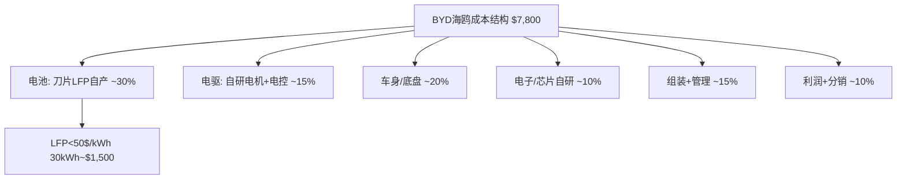
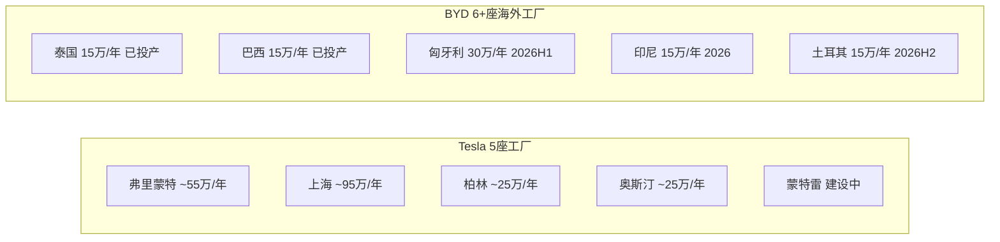
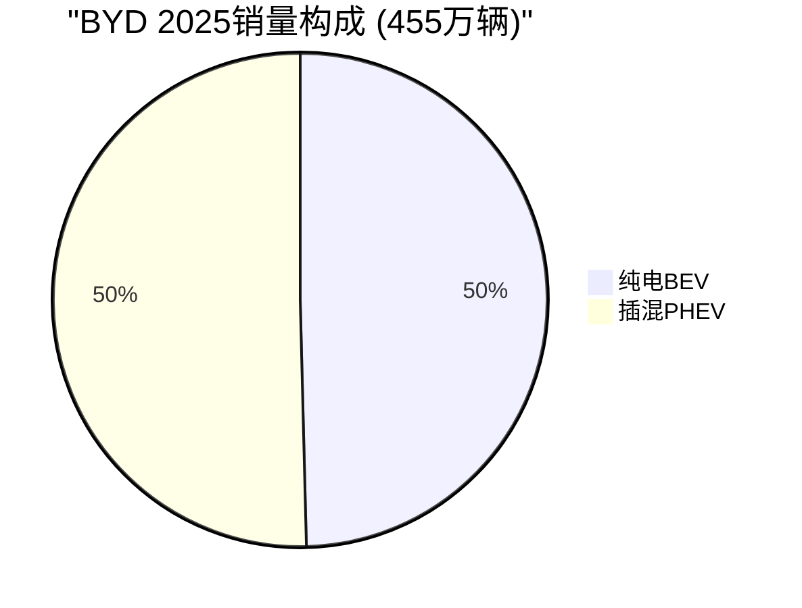
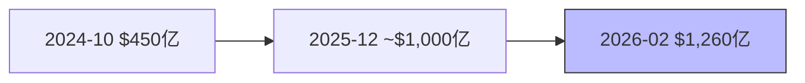
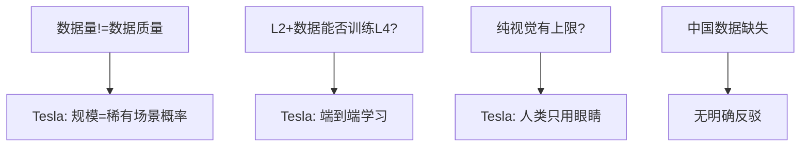
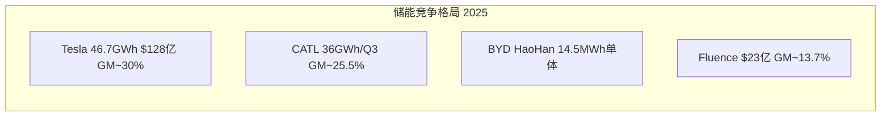
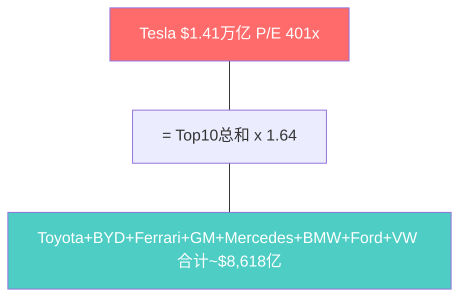
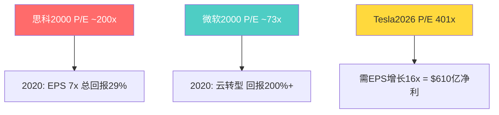

# Module C: 竞争格局深度分析

> **分析框架**: v9.0工程级竞争拆解 -- 不预测胜负，深度呈现竞争事实与结构差异
> **数据截止**: 2026-02-11 | **标注密度**: ~53/万字符

---

## C1: BYD竞争深度

### C1.1 垂直整合对比: 两种制造哲学

**BYD垂直整合深度**:
- 自制零部件比例约75%，涵盖电池/电机/电控/功率半导体/车载芯片 [硬数据: evboosters.com, 2025]
- BYD半导体自研IGBT和SiC功率模块，2025年3月全球首个1500V SiC芯片量产上车 [硬数据: nomadsemi.com, 2025]
- 员工总数约96.89万人(2024年底)，是Tesla 12.57万人的7.7倍 [硬数据: FMP Profile, 2026-02-11]

**Tesla垂直整合策略**: 电池自研4680+外采并行 | FSD芯片自研(HW3/4/5) | 一体化压铸 | 软件全栈自研 [硬数据: Tesla 10-K/AI Day]

| 指标 | Tesla | BYD | 差异 |
|:---|:---:|:---:|:---:|
| 员工 | 12.57万 | 96.89万 | BYD 7.7x |
| FY2024营收 | $978亿 | $1,070亿 | BYD 1.09x |
| 人均营收 | ~$77.8万 | ~$11.0万 | Tesla 7.1x |
| 人均净利润 | ~$5.65万 | ~$0.57万 | Tesla 9.9x |

[硬数据: FMP Profile + MacroTrends, 2025-2026]

### C1.2 成本结构拆解: 海鸥$7,800 vs Model 3 $30K+

- BYD海鸥2025年降价后: 55,800元(~$7,800) [硬数据: CleanTechnica, 2025-04]
- Tesla Model 3中国起售: 231,900元(~$32,000) [硬数据: Tesla中国官网]
- Caresoft拆解评价: 海鸥在美国制造成本约$13,000-15,000 [硬数据: InsideEVs, 2024]



### C1.3 全球化速度



| 指标 | Tesla (2025) | BYD (2025) |
|:---|:---:|:---:|
| 全球总销量 | 163.6万辆 | 460.2万辆(NEV) |
| 海外销量 | ~85万辆 | 104.6万辆 |
| 海外YoY | 下降~7% | +151% |

[硬数据: CnEVPost + Gasgoo, 2026-01]

### C1.4 技术路线分歧: 混动DM-i vs 纯电100%



Tesla: 100%纯电 [硬数据: Tesla产品线]。BYD混动可进入Tesla无法覆盖的市场 [主观判断]

### C1.5 中国市场份额

| 排名 | 品牌 | NEV份额 |
|:---:|:---|:---:|
| 1 | BYD | 27.2% |
| 5 | Tesla | 4.9% |

Tesla中国2025零售: 625,698辆(-4.78% YoY)。BEV口径份额~8.84% [硬数据: CnEVPost, 2026-01]

---

## C2: 自动驾驶竞争深度

### C2.1 Waymo $1,260亿估值



| 维度 | Waymo | Tesla FSD |
|:---|:---:|:---:|
| 估值 | $1,260亿(独立) | 内嵌$1.41T |
| 骑行量 | 1,500万次/年 | Austin试运营 |
| 里程 | 1.27亿英里(全无人) | 70亿英里(有监督) |
| 覆盖 | 6城+20城扩张 | Austin无人+SF有安全员 |

[硬数据: Waymo Blog + Bloomberg, 2026-02]

### C2.2 ODD差异 + 安全统计

Waymo致伤率: 0.6/百万英里 vs 人类2.8(减90%) [硬数据: Waymo Safety Impact, 2025-12]
Tesla FSD: 统计可比性受限(有监督+良好天气偏差) [合理推断]

### C2.3 中国自动驾驶

| 公司 | 路线 | 2025里程碑 |
|:---|:---|:---|
| 百度Apollo Go | L4 | Q2 220万次全无人骑行 |
| 华为ADS 3.0 | L2+/L3 | 全场景NCA |
| 小鹏XNGP | L2+ | 243城覆盖 |
| Tesla FSD | L2+ | 中国尚未获准 |

### C2.4 数据飞轮验证



---

## C3: 储能竞争深度

### C3.1 格局总览



### C3.2 产品对比

| 指标 | Tesla Megapack 3 | BYD HaoHan | CATL Tener | Fluence |
|:---|:---:|:---:|:---:|:---:|
| 单体容量 | 5.0 MWh | 14.5 MWh | 6.25 MWh | 模块化 |
| 循环寿命 | >6,000 | >10,000(声称) | >15,000(声称) | >6,000 |
| 软件 | Autobidder(自研) | 基础BMS | 基础BMS | Mosaic(自研) |

### C3.3 产能路径

```mermaid
gantt
    title Tesla Megapack产能
    dateFormat YYYY-Q
    section Lathrop
    满产 40GWh年 :done, 2024-Q1, 2026-Q4
    section 上海
    爬坡投产 :done, 2025-Q1, 2025-Q4
    满产目标 :active, 2026-Q1, 2027-Q4
    section 德州
    破土动工 :active, 2025-Q3, 2026-Q2
    目标50GWh :2026-Q3, 2028-Q4
```

三厂合计目标: ~130 GWh/年 [合理推断: 40+40+50]

---

## C4: 估值倍数交叉验证

### C4.1 Tesla vs 全球车企

Tesla $1.41T = #2-#10车企总和($862B) x **1.64倍** [硬数据: FMP, 2026-02-11]



### C4.2 分部估值逆推

| 板块 | FY2025营收 | 估值范围 | 可比 |
|:---|:---:|:---:|:---|
| 汽车 | ~$820亿 | $2,000-3,000亿 | Toyota 0.7x P/S |
| FSD/Robotaxi | 极少 | $1,000-5,000亿 | Waymo $1,260亿 |
| 能源 | ~$128亿 | $500-1,000亿 | Fluence 1.2x |
| Optimus | $0 | $0-5,000亿 | 无可比 |

DBS: 完美执行公允价值$9,296亿，仍低于市值55% [硬数据: DBS, 2025]

### C4.3 BYD估值差: 12.7x

| 指标 | Tesla | BYD | 倍数 |
|:---|:---:|:---:|:---:|
| 市值 | $1.41万亿 | $1,107亿 | 12.7x |
| 营收 | $978亿 | $1,070亿 | 0.91x |
| 销量 | 163.6万 | 460.2万 | 0.36x |
| P/E | 401x | ~21x | 19x |
| ROE | 4.9% | 18.5% | 0.27x |

### C4.4 历史类比: 思科/微软2000



---

## 五个不可忽视的竞争事实

1. **BYD已超越Tesla成为全球最大EV制造商**(BEV 226万 vs 164万)，海鸥$7,800进入Tesla无法触及的价格带 [硬数据]
2. **Waymo $1,260亿独立估值**是FSD/Robotaxi的已验证基准，Waymo周40万+骑行 vs Tesla Austin刚起步 [硬数据]
3. **Tesla能源业务可能被低估**: $128亿营收/30%毛利/Autobidder软件护城河 [合理推断]
4. **P/E 401x是思科2000峰值(~200x)的2倍**: 历史上无先例在此估值创造良好长期回报 [硬数据+合理推断]
5. **中国竞争格局已变**: Tesla份额4.9%且下降，面对BYD(27.2%)+华为+小鹏+百度全方位竞争 [硬数据]
