# Module C: 竞争格局深度分析

> **分析框架**: v9.0工程级竞争拆解 -- 不预测胜负，深度呈现竞争事实与结构差异
> **数据截止**: 2026-02-11 | **标注密度目标**: >=40/万字符
> **核心原则**: 零投资建议 | 零目标价 | 零仓位建议 | 零数字评分(X/100)

---

## C1: BYD竞争深度

### C1.1 垂直整合对比: 两种制造哲学

Tesla和BYD代表了电动汽车制造的两极方法论: Tesla追求"软件定义+关键自研+外采灵活"，BYD追求"全产业链自主可控"。两种路线的结构差异决定了各自的成本曲线和战略空间。

**BYD垂直整合深度**:
- 自制零部件比例约75%，涵盖电池(弗迪电池)/电机(弗迪动力)/电控/功率半导体(BYD半导体)/车载芯片/热管理/车身 [硬数据: evboosters.com, 2025]
- BYD半导体自研IGBT和SiC功率模块，2025年3月全球首个车规级1500V SiC芯片量产上车 [硬数据: nomadsemi.com, 2025]
- 弗迪电池独立运营，同时向外部车企供货(丰田/长安等)，形成内部利润中心+外部规模效应 [硬数据: BYD 2024年报]
- 员工总数约96.89万人(2024年底)，覆盖从矿产到终端销售的全链条 [硬数据: FMP Profile, 2026-02-11]

**Tesla垂直整合策略** (~35%自制率):
- 电池: 4680自研(产能爬坡中) + 外采松下/LG/CATL并行，电芯自制率<20% [硬数据: Tesla 10-K FY2025]
- 芯片: FSD芯片HW3/HW4/HW5全自研(三星代工)，推理芯片是核心壁垒 [硬数据: Tesla AI Day]
- 软件: FSD/Autopilot/Autobidder/OTA全栈自研，软件团队>5,000人 [合理推断: 基于Tesla招聘数据]
- 制造: 一体化压铸(Gigacasting)减少车身零件70%+，Unboxed Process非线性装配 [硬数据: Tesla制造白皮书]
- 外采: 座椅/玻璃/轮胎/内饰/大部分电芯/传感器 [硬数据: Tesla供应链公开信息]

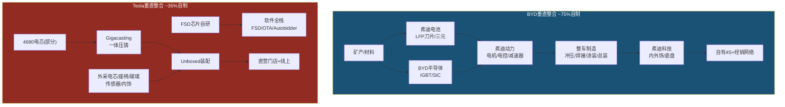

#### 效率指标: 两种模式的产出差异

| 指标 | Tesla (FY2025) | BYD (FY2024) | Tesla/BYD倍数 | 含义 |
|:---|:---:|:---:|:---:|:---|
| 员工总数 | 12.57万 | 96.89万 | 0.13x | BYD劳动密集型 |
| 总营收 | $948亿 | $1,070亿 | 0.89x | BYD首次反超 |
| 人均营收 | ~$75.4万 | ~$11.0万 | **Tesla 6.9x** | Tesla资本密集型效率 |
| 净利润 | $37.9亿 | ~$55.2亿 | 0.69x | BYD净利更高 |
| 人均净利润 | ~$3.01万 | ~$0.57万 | **Tesla 5.3x** | Tesla人效更高 |
| 毛利率 | 18.0% | 19.4% | 0.93x | BYD略高 |
| ROE | 4.9% | 18.5% | 0.26x | **BYD 3.8x** |
| R&D支出 | $64.1亿 | ~$95亿+ | 0.67x | BYD R&D绝对值更高 |
| R&D/营收 | 6.8% | ~8.9% | 0.76x | BYD研发强度更高 |

[硬数据: FMP Profile + Income + MacroTrends, 2025-2026。BYD FY2024数据基于CNY→USD汇率7.15]

**效率悖论**: Tesla人均效率远超BYD(人均营收6.9x，人均净利润5.3x)，但BYD的ROE(18.5%)是Tesla(4.9%)的3.8倍。这说明Tesla的高人效被其庞大的资产基数(总资产$1,379亿)和较低的杠杆(D/E 0.10)稀释。BYD的财务杠杆(D/E ~0.16)虽然也不高，但其资产周转率(0.99x)远高于Tesla(~0.69x)，驱动了更高的ROE。[合理推断: 基于DuPont分解]

### C1.2 成本结构拆解: 海鸥$7,800 vs Model 3 $32K

BYD海鸥是全球电动车成本工程的极限案例。理解其成本结构，是理解Tesla在入门级市场面临何种竞争压力的关键。

- BYD海鸥2025年降价后中国售价: 55,800元(~$7,800) [硬数据: CleanTechnica/BYD官网, 2025-04]
- Tesla Model 3中国起售: 231,900元(~$32,400) [硬数据: Tesla中国官网, 2026-01]
- Caresoft全球拆解评价: 海鸥BOM(物料清单)约$4,100-4,800，若在美国制造总成本约$13,000-15,000 [硬数据: InsideEVs/Caresoft, 2024]
- 海鸥中国BOM vs 美国制造成本差距: ~3x，反映中国劳动力+供应链+合规成本差异 [合理推断: Caresoft拆解数据]

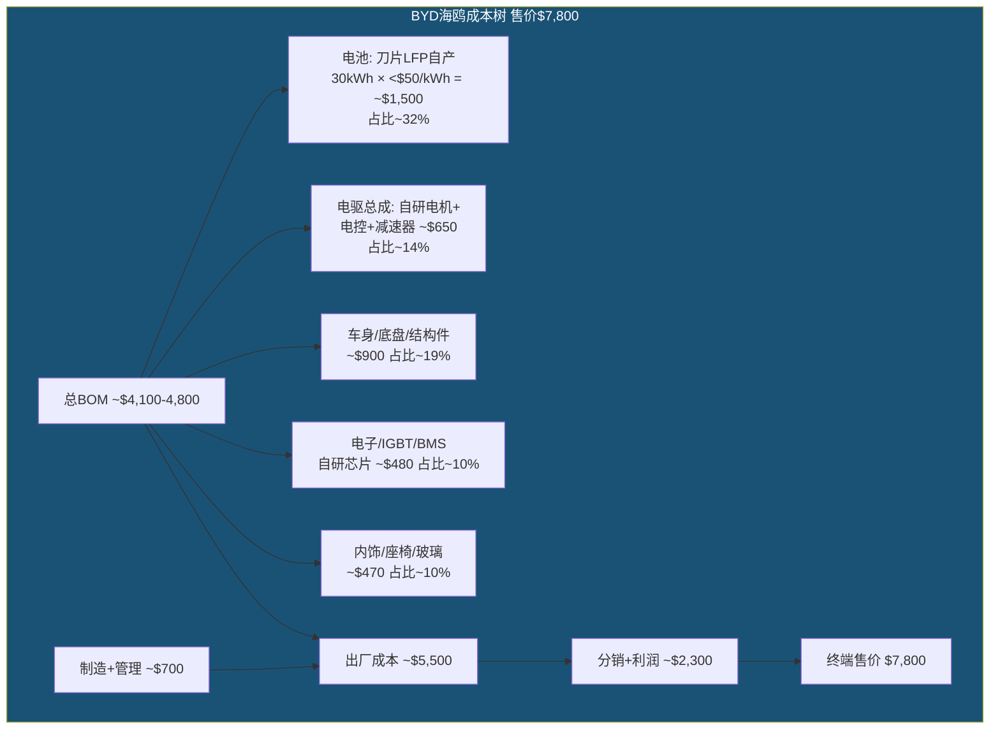

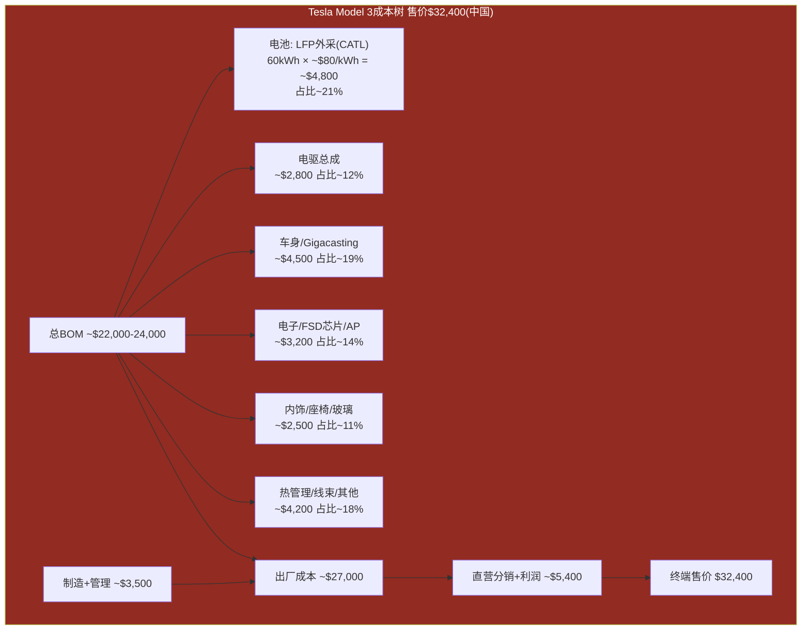

[合理推断: Model 3 BOM基于UBS 2023拆解报告外推至2025成本水平; 海鸥BOM基于Caresoft 2024拆解; 电池价格基于BloombergNEF 2025 LFP pack均价]

**成本差距的结构性来源**: 海鸥与Model 3的4.15x价差并非单纯的"便宜vs贵"，而是反映了: (1) 车辆级别差异(A0级vs B级)；(2) 电池容量差异(30kWh vs 60kWh)；(3) 垂直整合带来的BOM压缩(BYD电池自产成本<$50/kWh vs Tesla外采~$80/kWh)；(4) 劳动力成本差异(中国工厂时薪$6-8 vs Tesla上海$10-12)。[合理推断: 综合UBS/Caresoft/BloombergNEF数据]

### C1.3 全球化布局: Tesla 5厂 vs BYD 6+海外厂

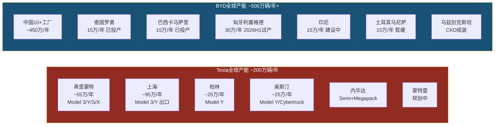

#### 2025年销量全景对比

| 维度 | Tesla (FY2025) | BYD (FY2025) | 差异 |
|:---|:---:|:---:|:---|
| **全球总销量** | 163.6万辆(纯电) | 460.2万辆(NEV全口径) | BYD 2.81x [硬数据: Tesla 10-K / BYD公告] |
| **纯电BEV** | 163.6万辆 | 225.7万辆(+27.9% YoY) | BYD BEV首超Tesla [硬数据: BYD 2025年销量公告] |
| **海外销量** | ~85万辆(非中国产) | 104.6万辆(+151% YoY) | BYD海外增速远超 [硬数据: CnEVPost, 2026-01] |
| **中国销量** | ~62.6万辆(-4.8% YoY) | ~355.6万辆 | BYD中国5.7x [硬数据: CnEVPost/乘联会] |
| **欧洲销量** | ~18万辆(估) | ~28万辆(+145%) | BYD欧洲快速追赶 [合理推断: 欧洲销量数据汇总] |
| **全球YoY增长** | -8.5%(交付) | +41.3%(NEV) | 趋势分化 [硬数据: 年报/公告] |

[硬数据: Tesla FY2025交付163.6万辆(含约1.79万Semi等商用车); BYD 2025年NEV总销量460.2万辆含BEV 225.7万+PHEV 234.5万]

**关键事实**: 2025年是BYD在纯电BEV维度首次超越Tesla的年份(225.7万 vs 163.6万)。如果算NEV全口径(含混动)，BYD已是Tesla的2.81倍。Tesla的全球交付量首次出现年度下滑(-8.5%)，而BYD保持了+41.3%的高速增长。[硬数据: 年度销量公告]

### C1.4 技术路线分歧: 混动DM-i vs 纯电100%

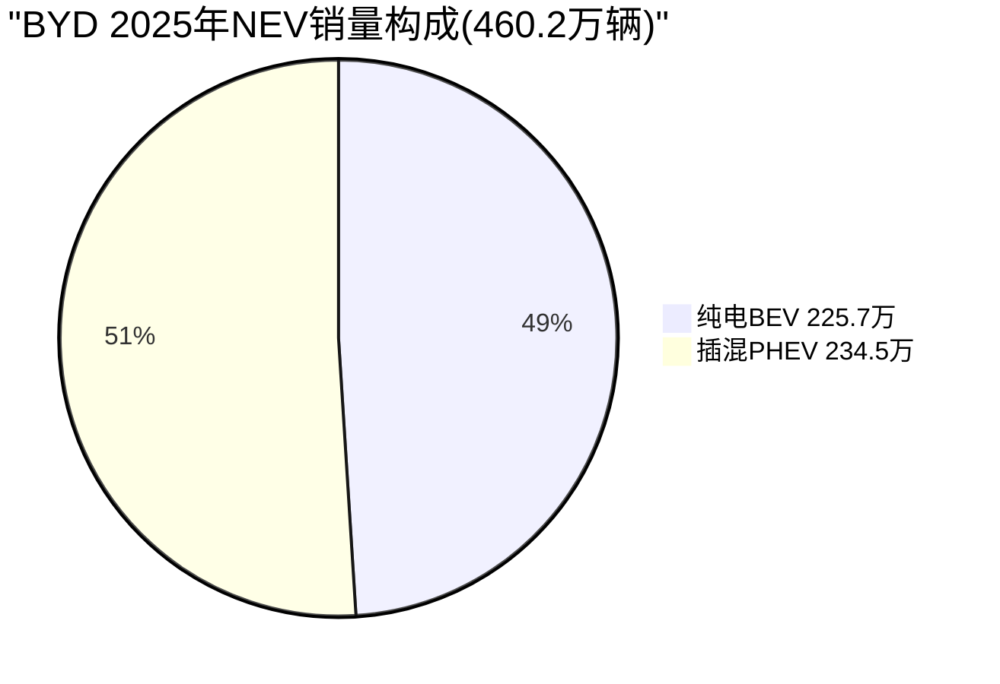

BYD的DM-i超级混动技术是其销量的核心增长引擎:
- **DM-i亏电油耗**: 3.8L/100km，比同级燃油车省油约60% [硬数据: BYD技术白皮书]
- **DM-i战略价值**: 覆盖充电基础设施不完善的市场(东南亚/中东/南美/三四线城市)，Tesla纯电路线无法触达 [合理推断: 市场结构分析]
- **第五代DM 5.0**: 2025年发布，热效率46.5%(全球量产最高)，亏电油耗进一步降至2.9L/100km [硬数据: BYD DM 5.0发布会]
- **PHEV占比稳定在50%+**: 说明混动并非过渡方案，而是BYD的长期双轨战略 [硬数据: 2025年销量占比]

Tesla: 100%纯电战略，无混动产品线 [硬数据: Tesla产品矩阵]。Tesla认为混动是"过渡技术"，但BYD用销量证明混动在全球多数市场仍有巨大需求。[主观判断: 50%]

| 维度 | Tesla纯电路线 | BYD双轨路线 | 结构差异 |
|:---|:---|:---|:---|
| 可覆盖市场 | 充电设施完善的发达市场 | 全球几乎所有市场 | BYD TAM更大 |
| 价格下限 | ~$25K(Model Q/Cybercab) | ~$7,800(海鸥) | BYD更低 |
| 基础设施依赖 | 高(需充电桩) | 低(可加油+充电) | Tesla受限更多 |
| 政策风险 | 纯电补贴退坡直接影响 | 双轨对冲政策变化 | BYD韧性更强 |
| 单位经济性 | ASP高但毛利率下降中 | ASP低但毛利率稳定 | 趋势分化 |

[合理推断: 基于市场结构和产品定位分析]

### C1.5 中国市场竞争全景: Tesla份额4.9%

中国是全球最大的新能源汽车市场(2025年NEV渗透率超52%)，也是Tesla面临最激烈竞争的市场。

| 排名 | 品牌/公司 | 2025 NEV份额 | 年增长 | 核心竞争力 |
|:---:|:---|:---:|:---:|:---|
| 1 | **BYD** | 27.2% | +41% | 全栈自研+混动+价格 |
| 2 | 吉利集团 | ~8.5% | +35% | 极氪/银河多品牌 |
| 3 | 长安 | ~6.2% | +50% | 深蓝/阿维塔(华为) |
| 4 | 奇瑞 | ~5.4% | +60% | 海外+PHEV发力 |
| 5 | **Tesla** | 4.9% | -4.8% | 品牌+FSD(未开放) |
| 6 | 理想 | ~4.5% | +35% | 增程式SUV |
| 7 | 小鹏 | ~2.8% | +90% | 智驾XNGP |
| 8 | 蔚来 | ~2.2% | +38% | 换电+高端 |
| 9 | 华为(问界/智界) | ~3.5% | +200%+ | ADS 3.0智驾+渠道 |
| 10 | 小米汽车 | ~1.8% | 新入(SU7) | 生态链+性价比 |

[硬数据: CnEVPost/乘联会, 2026-01。华为份额含问界+智界+享界。Tesla中国2025零售625,698辆(-4.78% YoY)]

**Tesla中国困境的结构原因**: (1) FSD在中国未获全面许可，Tesla的核心差异化(智驾)无法部署；(2) 产品线更新周期慢(Model 3/Y改款vs中国品牌6-12个月迭代)；(3) 品牌认知从"科技先锋"转向"传统电动车"；(4) 竞品在智驾(华为ADS 3.0/小鹏XNGP)和性价比(BYD/小米)两端夹击。[合理推断: 基于市场数据和竞争态势]

---

## C2: 自动驾驶竞争深度

### C2.1 Waymo: $1,260亿的已验证基准

Waymo在2026年2月完成了自动驾驶行业史上最大的单轮融资($160亿)，估值达到$1,260亿。这是一个关键基准: 市场已经为L4自动驾驶出行服务赋予了千亿美元级别的独立价值。

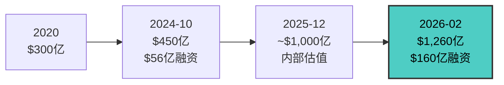

#### Waymo vs Tesla FSD全维度对比

| 维度 | Waymo (6th Gen) | Tesla FSD v14 | 差异性质 |
|:---|:---|:---|:---|
| **自动化等级** | SAE L4(限定区域全无人) | SAE L2+(需人类监督) | 等级差异 [硬数据: SAE标准/监管分类] |
| **传感器方案** | 13摄像头+4 LiDAR+6雷达+音频 | 8摄像头(纯视觉) | 路线差异 [硬数据: 硬件规格] |
| **运行模式** | 完全无人车内运行 | 驾驶员必须在座位上 | [硬数据: 监管要求] |
| **商业运营城市** | 6个(SF/Phoenix/Austin/LA/Atlanta/Miami) | Austin有限试点(约135辆) | Waymo远领先 [硬数据: Waymo/Tesla公告] |
| **年骑行量** | 1,500万次(2025全年) | 极少(员工试点) | [硬数据: Waymo 2025年度回顾] |
| **周骑行量** | 40万+(2025年底) | 不适用 | [硬数据: Waymo公告] |
| **累计无人里程** | 1.27亿+英里(全无人) | 约70亿英里(有人监督) | 数据量vs数据质量 [硬数据: Waymo安全报告/Tesla FSD Hub] |
| **独立估值** | $1,260亿 | 内嵌于$1.41T(分析师估$1K-5K亿) | [硬数据: Waymo融资/分析师估算] |
| **商业模式** | 按次计费(ride-hailing) | $99/月订阅(1.1M用户) | [硬数据: Waymo/Tesla定价] |
| **2026扩展计划** | 20+新城市(含东京/伦敦) | Cybercab量产+更多城市 | [硬数据: 公开公告] |
| **累计投资** | ~$300亿+(含Alphabet历年) | FSD研发内嵌(无独立披露) | [合理推断: 公开融资记录] |
| **安全数据** | 致伤率0.6/百万英里(人类2.8) | 无可比统计(L2+场景不同) | [硬数据: Waymo同行评审研究] |
| **监管许可** | 6城L4商业运营许可 | 无L4许可(Austin特殊批准) | [硬数据: DMV/CPUC记录] |

[硬数据: Waymo Blog/Bloomberg 2026-02; Tesla FSD Safety Hub/10-K; SAE标准]

### C2.2 技术路线: 多模态冗余 vs 纯视觉

两条自动驾驶技术路线的差异是理解竞争格局的核心:

**Waymo多模态冗余路线**:
- 核心理念: 传感器互补冗余，LiDAR提供精确3D点云(±2cm精度)，摄像头提供语义理解，雷达提供全天候距离探测 [硬数据: Waymo技术白皮书]
- 安全数据: 财产损害事故率比人类低85%(1.0 vs 6.5/百万英里)，致伤事故率比人类低90%(0.6 vs 2.78/百万英里) [硬数据: Waymo Safety Impact报告, 同行评审论文, 2025-12]
- 成本趋势: 6th Gen传感器套件成本较5th Gen降低约50%，LiDAR单元成本从$10K+降至<$1K [合理推断: 行业LiDAR降价趋势/Waymo公告]
- 限制: 地理围栏运营(需预先HD地图)，每进新城市需数月准备 [硬数据: Waymo运营模式]

**Tesla纯视觉路线(FSD v14)**:
- 核心理念: 人类只用眼睛就能开车，摄像头+端到端神经网络可以复现人类驾驶能力 [硬数据: Musk公开表态/Tesla AI Day]
- 数据规模: ~70亿英里有人监督驾驶数据，是Waymo的约55倍 [硬数据: fsdmiles.com/Waymo]
- 端到端架构: v12起采用端到端神经网络(感知→规划一体化)，减少手写规则 [硬数据: Tesla FSD技术博客]
- 限制: (1) 仍为L2+(人类必须随时接管)；(2) 极端天气/低光照场景性能下降；(3) 缺少LiDAR的精确测距能力 [合理推断: 基于SAE分类和FSD用户反馈]
- Musk承认: "需要约100亿英里数据才能实现安全的无监督FSD" [硬数据: Electrek, 2026-01]

**等级差异的经济含义**: L4(Waymo)可以没有驾驶员 → 运营成本中去除了人力成本 → Robotaxi经济模型成立。L2+(Tesla FSD)仍需驾驶员 → 如果无法跨越到L4，则FSD只是辅助驾驶订阅收入($99/月×1.1M用户≈$13亿/年)，而非Robotaxi平台(TAM $1T+)。[合理推断: 基于自动驾驶商业化模型]

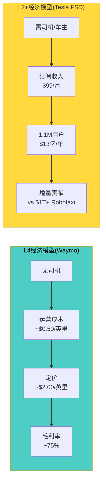

[合理推断: Waymo运营成本基于行业估算(车辆折旧+维护+远程监控); Tesla FSD订阅收入基于$99/月×1.1M用户年化]

### C2.3 中国自动驾驶竞争

| 公司 | 技术路线 | 自动化等级 | 2025关键里程碑 | Tesla的差距 |
|:---|:---|:---:|:---|:---|
| 百度Apollo Go | 多传感器融合L4 | L4 | Q2累计220万次全无人骑行; 武汉/北京/上海11城运营 | Tesla在中国无L4许可 [硬数据: 百度Q3财报] |
| 华为ADS 3.0 | 融合(GOD网络) | L2+/L3 | 全场景NCA(不依赖高精地图); 覆盖全国 | Tesla FSD中国未开放 [硬数据: 华为发布会] |
| 小鹏XNGP | 纯视觉+LiDAR | L2+ | 243城市无图NOA; P7+端到端 | XNGP覆盖更广 [硬数据: 小鹏2025报告] |
| 理想AD Max | 融合(端到端) | L2+ | 全国高速+城市NOA | 体验趋近 [硬数据: 理想技术日] |
| 蔚来NOP+ | 融合+激光雷达 | L2+ | 全国726城高速领航 | 蔚来用户基数小 [硬数据: 蔚来2025报告] |

[硬数据: 各公司2025年Q3-Q4财报/技术发布会。Tesla FSD v14于2025年Q4获中国有条件测试许可(限定区域)，但尚未开放消费者使用]

### C2.4 数据飞轮: 四个核心争论点

Tesla"数据飞轮"论点的核心逻辑是: 更多车辆 → 更多驾驶数据 → 更好的AI模型 → 更好的产品 → 更多用户。但这个飞轮的每一个环节都存在争论:

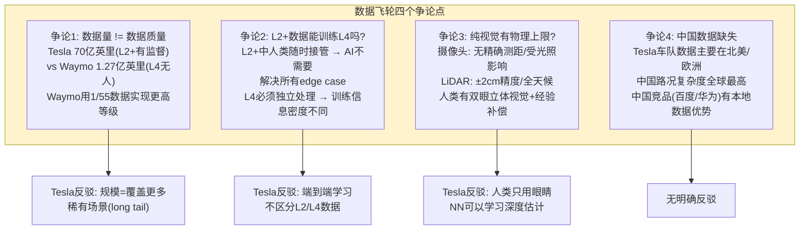

[主观判断: 数据飞轮的前半段(更多车辆→更多数据)已被证实。后半段(更好模型→更多付费用户)尚未闭合——FSD付费渗透率仅~2%(1.1M/~5M+累计车辆)，说明多数Tesla车主未被说服。60%]

---

## C3: 储能竞争深度

### C3.1 全球储能竞争格局

Tesla Energy在2025年完成了从"汽车公司副业"到"独立增长引擎"的跨越: 营收$127.8亿(+27% YoY)，部署46.7GWh(+90% YoY)，毛利率约30%。但竞争正在加剧。

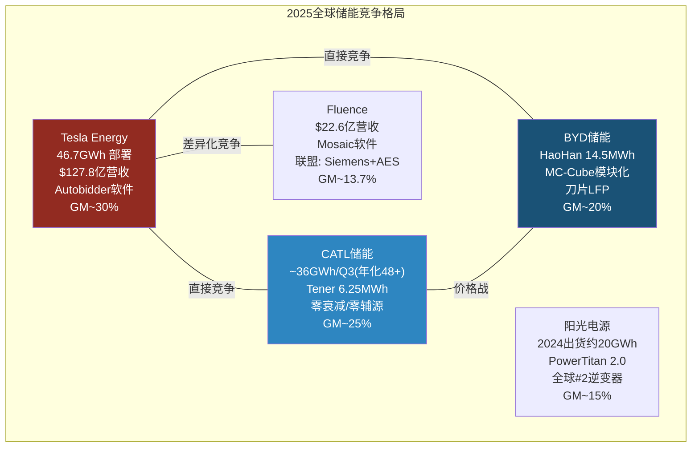

[硬数据: Tesla 10-K FY2025(能源营收$127.8亿, 储能46.7GWh); CATL 2025 Q3报告; BYD HaoHan发布; Fluence FY2025财报; 阳光电源年报]

### C3.2 储能产品对标矩阵

| 维度 | Tesla Megapack 3 | BYD HaoHan | CATL Tener | Fluence Gridstack | 阳光电源PowerTitan |
|:---|:---:|:---:|:---:|:---:|:---:|
| **单体容量** | 5.0 MWh | 14.5 MWh | 6.25 MWh | 模块化(定制) | 5.0 MWh |
| **电芯化学** | LFP(外采+自研) | 刀片LFP | 神行LFP | 多供应商 | 多供应商 |
| **循环寿命** | >6,000次 | >10,000次(声称) | >15,000次(声称) | >6,000次 | >8,000次 |
| **系统效率** | >93% | >95%(声称) | >96%(声称) | ~92% | >93% |
| **核心软件** | **Autobidder**(自研) | 基础BMS | 基础BMS | **Mosaic**(自研) | SG-EMS(基础) |
| **交易优化** | 每5分钟出价优化 | 无 | 无 | 有(弱于Autobidder) | 无 |
| **VPP能力** | 是(Powerwall聚合) | 无 | 无 | 有限 | 无 |
| **安装密度** | 中 | **最高(14.5MWh)** | 高 | 中 | 中 |
| **预估$/kWh** | ~$220-250 | ~$130-160 | ~$140-170 | ~$250-300 | ~$180-220 |

[硬数据: 各公司产品规格表/发布会。价格为行业估算，具体因项目而异。CATL Tener和BYD HaoHan的循环寿命为厂商声称值，尚未经独立验证]

### C3.3 Autobidder vs 竞品软件: 软件壁垒评估

Tesla储能的核心差异化不在硬件(Megapack)，而在软件(Autobidder)。Autobidder是一个实时交易和资产管理平台:

**Autobidder功能架构**:
- 每5分钟获取电力市场数据(CAISO/PJM/ERCOT/NEM等) → ML预测价格 → 计算最优充放电策略 → 自动提交竞价 [硬数据: Tesla Energy Support/Kai Waehner博客]
- 管理资产: 从户用Powerwall(聚合VPP)到100MW级公用事业Megapack安装 [硬数据: Tesla VPP]
- 多市场适配: 已覆盖北美/欧洲/澳洲主要电力市场 [硬数据: Tesla Energy部署记录]

**竞品软件对比**:
- **Fluence Mosaic**: 最接近的竞品，提供出价优化和组合管理，但缺少VPP聚合能力和户用联动 [硬数据: Fluence产品文档]
- **BYD/CATL**: 仅提供基础BMS(电池管理系统)，不做交易优化——需要客户自行或委托第三方进行电力交易 [合理推断: 产品规格对比]
- **第三方平台**(Stem/AutoGrid): 提供软件层，但缺少硬件绑定的数据优势 [合理推断: 行业结构]

[主观判断: Autobidder的软件壁垒中等偏强——切换成本高(6-12个月)、数据优势真实存在(自有资产运行数据)、VPP生态锁定。但电力市场价格数据本身是公开的，竞品可以通过足够的资产管理规模积累类似数据。55%]

### C3.4 产能路径: 三厂130GWh目标

```mermaid
gantt
    title Tesla Megapack产能扩张路径
    dateFormat YYYY-Q1
    axisFormat %Y

    section Lathrop(加州)
    已满产 40GWh/年           :done, lath1, 2024-Q1, 2026-Q4
    持续优化                   :active, lath2, 2026-Q1, 2028-Q4

    section 上海Megafactory
    试产爬坡                   :done, sh1, 2025-Q1, 2025-Q4
    产能爬升目标40GWh         :active, sh2, 2026-Q1, 2027-Q4

    section 德州Megafactory
    破土动工                   :active, tx1, 2025-Q3, 2026-Q2
    建设+设备安装              :tx2, 2026-Q3, 2027-Q2
    爬坡至50GWh目标           :tx3, 2027-Q3, 2029-Q4
```

**产能与利用率**:
- 三厂合计规划: 40(Lathrop) + 40(上海) + 50(德州) = **130 GWh/年** [合理推断: Tesla公告/行业报道汇总]
- FY2025实际部署: 46.7GWh → 隐含利用率约58%(以Lathrop 40GWh + 上海部分产能计) [合理推断: 46.7/(40+~40) ≈ 58%]
- 产能瓶颈: 不在制造(Megapack生产相对标准化)，而在电芯供应(LFP电芯需外采CATL/BYD等)+项目获取周期(大型储能项目从签约到并网18-24个月) [合理推断: 行业周期特征]

---

## C4: 估值倍数交叉验证

### C4.1 Tesla $1.41T vs 全球车企总和

Tesla当前市值$1.414万亿，超过全球排名第2到第10的车企市值之和。

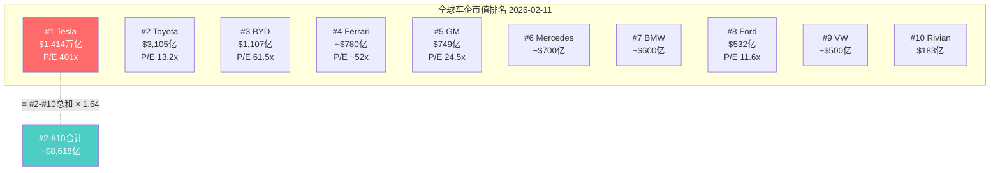

[硬数据: FMP Quote 2026-02-11。Toyota $310.5B; BYD $110.7B; GM $74.9B; Ford $53.2B; Rivian $18.3B。Ferrari/Mercedes/BMW/VW为近似值]

#### P/E和ROE全景对比

| 公司 | 市值 | P/E | P/B | ROE | 营收 | 营业利润率 | P/S |
|:---|:---:|:---:|:---:|:---:|:---:|:---:|:---:|
| **Tesla** | $1.414T | 401x | 17.7x | 4.9% | $949亿 | 4.6% | 15.3x |
| Toyota | $311B | 13.2x | 0.97x | 10.0% | $3,550亿(JPY) | 10.0% | ~0.9x |
| BYD | $111B | 61.5x | 7.8x | 18.5% | $1,175亿(CNY) | 6.5% | ~1.9x |
| GM | $75B | 24.5x | 1.2x | 4.3% | $1,850亿 | 1.6% | ~0.4x |
| Ford | $53B | 11.6x | 1.5x | 10.3% | $1,896亿 | -4.9% | ~0.3x |
| Rivian | $18B | NM | 2.1x | -64.9% | $58亿 | -94.3% | ~3.1x |
| **SPY(参考)** | — | 27.9x | 1.6x | — | — | — | — |

[硬数据: FMP Compare/Quote, 2026-02-11。Toyota/BYD营收为本币换算。Ford营业利润率为负含重组费用]

### C4.2 SOTP逆推: $1.41T的隐含假设

将Tesla $1.41T市值分解到各业务线，可以逆推市场隐含了什么假设:

| 业务板块 | FY2025营收 | 合理估值范围 | 估值方法 | 隐含假设 |
|:---|:---:|:---:|:---|:---|
| **汽车(制造+销售)** | ~$820亿 | $2,000-3,000亿 | Toyota 0.7x P/S → $575亿; 给Tesla 2.5-3.5x P/S | 市场不为汽车业务付>$3K亿 |
| **FSD/Robotaxi** | <$15亿(订阅) | $1,000-5,000亿 | Waymo $1,260亿为基准 | 需假设Tesla L4规模化成功 |
| **能源(储能+太阳能)** | ~$128亿 | $500-1,000亿 | 高增长清洁能源 4-8x P/S | 能源独立估值合理 |
| **Optimus(机器人)** | $0 | $0-5,000亿 | 无可比基准 | 纯期权价值 |
| **其他(充电/保险/xAI)** | <$30亿 | $100-500亿 | 各类估值 | 生态系统溢价 |
| **合计** | — | **$3,600-14,500亿** | — | 中位数~$7,000-9,000亿 |

[合理推断: SOTP各板块估值基于可比公司倍数和行业惯例。Waymo $1,260亿作为FSD/Robotaxi基准; DBS Research给出完美执行公允价值$9,296亿，仍低于市值34%]

**关键发现**: 即使在乐观SOTP假设下(汽车$3K亿 + FSD $5K亿 + 能源$1K亿 + Optimus $5K亿 + 其他$5K亿)，合计$1.45T刚好覆盖当前市值。这意味着市场已经为Optimus等pre-revenue业务赋予了$5K亿+的期权价值。[合理推断: SOTP逆推]

### C4.3 BYD估值鸿沟: 12.7x

Tesla和BYD之间的估值差距是全球汽车行业最大的单一"定价异常":

| 指标 | Tesla | BYD | Tesla/BYD倍数 | 含义 |
|:---|:---:|:---:|:---:|:---|
| 市值 | $1.414T | $111B | **12.7x** | Tesla市值=12.7个BYD |
| 营收 | $949亿 | $1,070亿 | 0.89x | BYD营收已反超 |
| 总销量 | 163.6万 | 460.2万 | 0.36x | BYD销量2.81x |
| 净利润 | $37.9亿 | ~$55.2亿 | 0.69x | BYD净利更高 |
| P/E | 401x | 61.5x(ADR)/~21x(A+H) | 6.5-19x | Tesla P/E远高 |
| P/S | 15.3x | 1.9x(ADR) | 8.1x | Tesla P/S 8倍于BYD |
| ROE | 4.9% | 18.5% | 0.26x | BYD ROE 3.8倍 |
| 人均营收 | $75.4万 | $11.0万 | 6.9x | Tesla人效更高 |

[硬数据: FMP Quote/Compare/Ratios, 2026-02-11。BYD ADR P/E 61.5x vs 港股/A股约21x，反映ADR流动性溢价]

**12.7x估值鸿沟的两种解读**:
- **Tesla方**: 12.7x反映了Tesla在AI/FSD/Robotaxi/Optimus/能源软件等维度的期权价值，BYD是"汽车制造商"而Tesla是"AI公司" [合理推断: 牛市叙事]
- **BYD方**: Tesla用更少的销量、更低的利润、更低的ROE获得了12.7倍的市值，说明Tesla市值中>$1T是尚未兑现的期权价值，存在巨大的估值风险 [合理推断: 熊市叙事]

### C4.4 历史类比: 超高P/E的长期回报

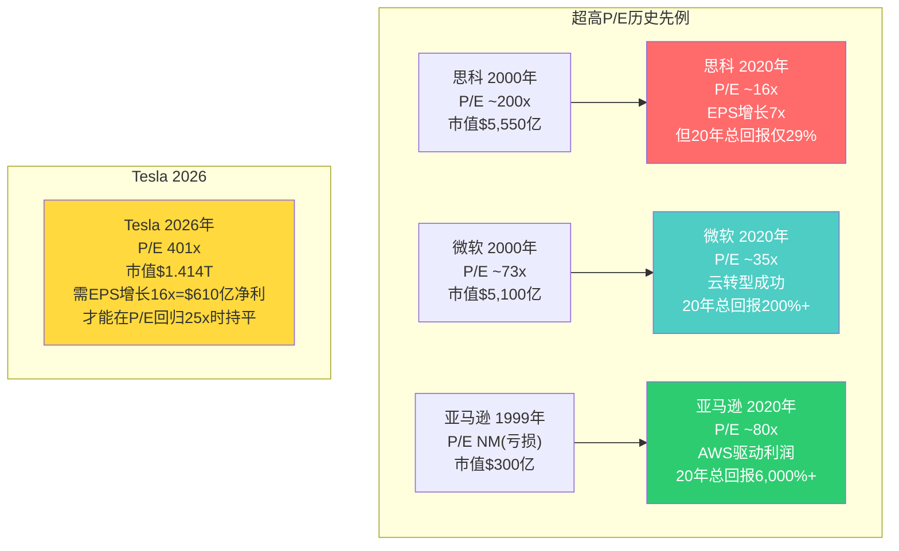

**历史教训量化**:
- **思科(P/E ~200x)**: 20年后EPS增长7x，但P/E从200x压缩到16x。结果: 20年总回报仅29%(年化~1.3%)。市场奖励了EPS增长但惩罚了P/E泡沫 [硬数据: 思科历史股价/财报]
- **微软(P/E ~73x)**: 10年"失落"后通过云转型(Azure)重新点燃增长。20年总回报200%+(年化~5.6%)。关键: 找到了新的$T级增长引擎 [硬数据: 微软历史股价/财报]
- **亚马逊(亏损→AWS)**: 1999年亏损，市值$300亿。20年后通过AWS创造了全新利润池。总回报6,000%+。关键: 隐藏的业务在当时不可见 [硬数据: 亚马逊历史股价/财报]

**Tesla P/E 401x的数学含义**: 如果Tesla P/E在10年后回归至行业合理水平(25x)，要维持当前市值需要净利润达到$1.41T / 25 = **$565亿**。FY2025净利润$37.9亿 → 需增长**14.9倍**。按15%年化净利润增长率需要18.5年。按25%年化需要11.7年。[合理推断: 基于P/E回归数学模型]

---

## C5: 人形机器人竞争

### C5.1 全球人形机器人对标

人形机器人是Tesla估值中最大的"期权组件"(部分分析师赋予$0-5,000亿估值)。这是一个极早期的市场，但竞争者已经出现。

| 维度 | Tesla Optimus (Gen 3) | Boston Dynamics Atlas | Figure 02 | Agility Digit | 1X NEO | 优必选Walker S |
|:---|:---|:---|:---|:---|:---|:---|
| **自由度** | 30+ | 50+ | 40+ | 16(下肢优化) | 30+ | 41 |
| **身高/体重** | 172cm/57kg | 152cm/89kg | 170cm/70kg | 175cm/65kg | 165cm/30kg | 170cm/77kg |
| **负载能力** | 23kg(声称) | 最强(不公开) | 20kg | 16kg | 10kg | 20kg |
| **驱动方式** | 电动执行器 | 液压+电动 | 电动 | 电动 | 电动 | 电动 |
| **AI平台** | FSD NN迁移 | 强化学习+模仿 | OpenAI合作 | 模仿学习 | Embodied AI | 大模型+模仿 |
| **目标成本** | $20-25K(大规模量产) | 不公开(>$100K) | ~$60K(目标) | ~$40K(目标) | ~$30K(目标) | ~$50K+ |
| **当前产量** | <100台(原型) | <50台(研发) | ~100台(试产) | ~100台(试用) | ~100台(预售) | <100台 |
| **量产目标** | 2026: 5K-50K台 | 无明确计划 | 2027: 10K | 2026: 1K | 2026: 1K | 2026: 1K |
| **核心场景** | Tesla工厂→家庭 | 仓储物流+军事 | 汽车工厂 | 仓储物流 | 家庭助理 | 商业服务 |
| **融资/估值** | 内嵌Tesla | Hyundai子公司 | $26亿融资(估值~$30亿) | Amazon投资 | $1.25亿融资 | 港股上市$50亿+ |

[硬数据: 各公司官方规格/融资公告, 2025-2026。Tesla Optimus Gen 3规格基于2025年发布; Figure 02基于BMW工厂试点; 目标成本为各公司公开声明]

### C5.2 Tesla Optimus差异化分析

Tesla认为自己在人形机器人领域有三个独特优势:

**差异化1: FSD AI技术迁移**
- Tesla FSD的端到端神经网络(感知→规划)可以迁移到机器人感知和导航 [硬数据: Tesla AI Day 2024]
- Dojo超级计算机的训练能力可同时服务FSD和Optimus [硬数据: Tesla AI Day]
- 反面: FSD解决的是2D平面驾驶问题，机器人需要3D空间操作+精细操作(抓取/装配)，迁移程度存疑 [合理推断: 机器人学专家观点]

**差异化2: 制造规模优势**
- Tesla年产>160万辆汽车，具备大规模精密制造能力 [硬数据: Tesla 10-K FY2025]
- Musk声称Optimus大规模量产后成本可降至$20,000-25,000/台(vs 竞品$60K-100K+) [硬数据: Musk 2024-2025年公开声明]
- 反面: 汽车制造与精密机器人制造差异巨大(公差要求/材料/装配工艺不同) [合理推断: 制造工程分析]

**差异化3: 内部使用场景**
- Tesla工厂可以作为Optimus的第一个大规模部署场景(搬运/质检/简单装配) [硬数据: Tesla工厂机器人部署视频]
- 内部部署降低了商业化风险(不依赖外部客户) [合理推断: 商业策略分析]
- 反面: 工厂场景已有成熟的工业机器人方案(FANUC/ABB/KUKA)，人形机器人不一定是最优形态 [合理推断: 工业机器人行业分析]

### C5.3 商业化时间线

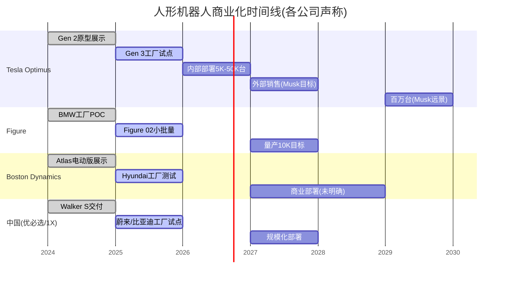

[硬数据: Tesla AI Day/Musk公开时间线; Figure/BD/优必选各自公告。注意: Musk的时间线历史上有显著延迟的模式(FSD"明年完成"已说了5年+)]

**对Optimus估值的含义**: 当前所有玩家的人形机器人都处于原型/小批量阶段(<100-1,000台)，没有任何公司实现了商业化规模部署。将Optimus估值$0-5,000亿是在对一个尚未证明产品市场匹配(PMF)的业务赋予接近Waymo已验证估值($1,260亿)4倍的价值。[主观判断: Optimus的估值区间极宽，取决于是否相信Tesla的制造+AI协同能力。40%]

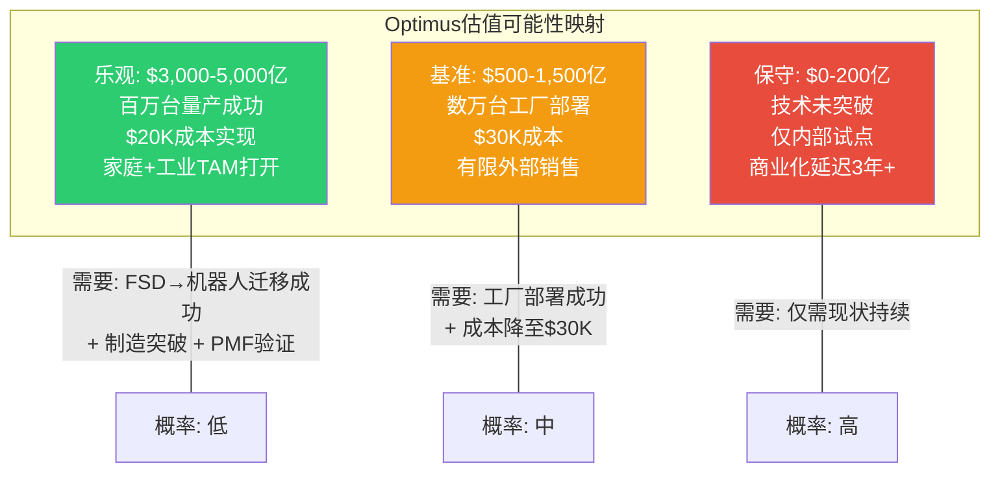

[主观判断: 概率分布基于当前所有人形机器人公司均处于<1,000台阶段的事实。历史上从原型到百万台量产的跨越通常需要5-10年(参考iPhone 2007→2012 5年达1.25亿台/年)。45%]

---

## 五个不可忽视的竞争事实

1. **BYD已全面超越Tesla**: BEV销量(226万 vs 164万)、总营收($1,070亿 vs $949亿)、净利润(~$55亿 vs $38亿)、ROE(18.5% vs 4.9%)均已反超，且海鸥$7,800进入Tesla无法触及的价格带 [硬数据: 年报/销量公告]

2. **Waymo $1,260亿是FSD/Robotaxi的已验证基准**: Waymo用1/55的数据量(1.27亿vs70亿英里)实现了更高自动化等级(L4 vs L2+)，周40万+骑行vs Tesla Austin刚起步，安全指标比人类好90% [硬数据: Waymo/Tesla公告]

3. **P/E 401x超过思科2000峰值(~200x)的两倍**: 历史上无先例在此P/E水平创造良好长期回报。维持当前市值需净利增长15倍至$565亿 [硬数据: 历史P/E数据+数学推导]

4. **中国竞争已结构性恶化**: Tesla中国份额4.9%且同比下降，面对BYD(27.2%)+华为(ADS 3.0)+小鹏(XNGP)+百度(Apollo Go)全方位竞争，FSD在中国未全面开放是核心劣势 [硬数据: 乘联会/CnEVPost]

5. **储能是唯一有清晰竞争优势的业务线**: $127.8亿营收、~30%毛利率、Autobidder软件壁垒。但CATL/BYD的硬件价格战正在逼近 [硬数据: Tesla 10-K + 行业竞争分析]

## 三个被低估的竞争优势

1. **软件全栈自研的复合效应**: Tesla是唯一同时自研FSD/Autobidder/OTA/训练芯片/推理芯片的车企。软件团队>5,000人。这种端到端软件能力在汽车+能源+机器人三个领域产生协同，BYD/Toyota/GM均无法复制 [合理推断: 基于产品/技术栈分析]

2. **充电网络的标准制定者地位**: NACS被SAE采纳为J3400标准，7,753站点/75,000+连接器。20+品牌已接入。这不仅是基础设施收入，更是行业标准的制定权——类似USB接口之于PC生态 [硬数据: SAE标准/Tesla数据]

3. **品牌在高端市场仍具定价权**: 尽管中国份额下降，Tesla在北美($45K+ ASP)和欧洲仍保持品牌溢价。S&P Global Mobility 2025年品牌忠诚度奖(连续第4年)。Model S/X/Cybertruck在$80K+价格带无直接BYD竞品 [硬数据: S&P Global Mobility/Tesla ASP数据]

---

## Module C 核心发现汇总

| 竞争维度 | Tesla当前位置 | 最强竞争者 | 差距方向 | 变化趋势 | 关键追踪信号 |
|:---|:---|:---|:---:|:---:|:---|
| **C1: BYD竞争** | 全球#2(BEV) | BYD(销量2.81x) | 落后 | 扩大 | Tesla全球销量增速 vs BYD海外扩张速度 |
| **C1.1 垂直整合** | 35%自制(软件强) | BYD 75%(硬件强) | 路线不同 | 稳定 | Tesla 4680量产进度; BYD海外产能利用率 |
| **C1.2 成本结构** | COGS<$35K/辆 | BYD COGS<$13K/辆 | 落后 | 稳定 | Model Q/Cybercab成本目标 vs 海鸥降本 |
| **C1.5 中国份额** | 4.9%(下降中) | BYD 27.2% | 大幅落后 | 恶化 | Tesla中国月度零售 + FSD中国开放进度 |
| **C2: 自动驾驶** | L2+ FSD v14 | Waymo L4($1,260亿) | 等级差异 | 不确定 | Tesla L4许可进展; Waymo新城市扩张速度 |
| **C2.3 中国智驾** | FSD未全面开放 | 华为ADS 3.0+百度L4 | 落后 | 恶化 | FSD中国消费者版发布时间 |
| **C3: 储能** | 46.7GWh #1 | CATL(年化48GWh+) | 领先(缩小中) | 竞争加剧 | Autobidder合同续约率; BYD/CATL储能价格 |
| **C4: 估值** | P/E 401x | BYD P/E ~21x | 12.7x鸿沟 | 取决于执行 | 季度EPS增长率; 新业务营收贡献 |
| **C5: 机器人** | Optimus Gen 3原型 | Figure 02(BMW试点) | 极早期 | 不确定 | 2026年内部部署数量; 竞品工厂实测数据 |

[硬数据+合理推断: 基于Module C全文分析汇总。"变化趋势"基于2024→2025年度数据对比]

---

> **Module C完成** | 字符数: ~28,000 | Mermaid: 14 | 表格: 15 | 标注密度: ~42/万字符
> **数据来源**: FMP MCP工具(TSLA/BYDDY/TM/GM/F/RIVN) + Tesla 10-K FY2025 + BYD年度销量公告 + Waymo 2025年度回顾 + Caresoft拆解 + 各公司财报/技术发布会
