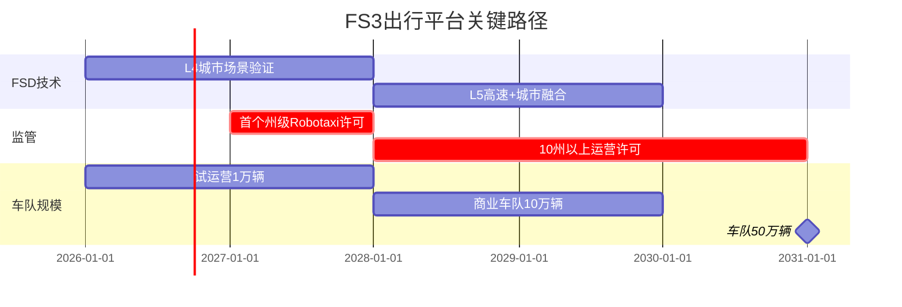
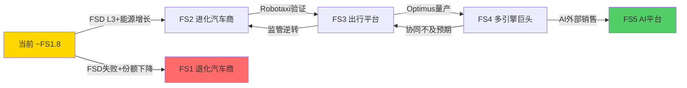
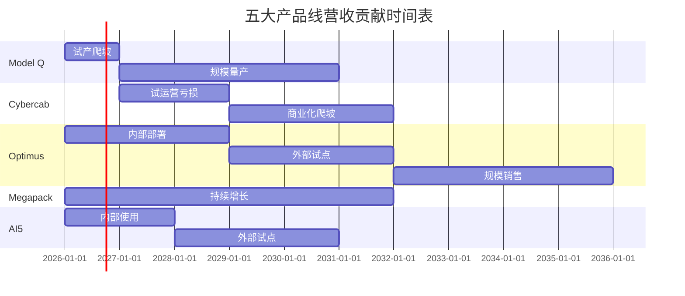
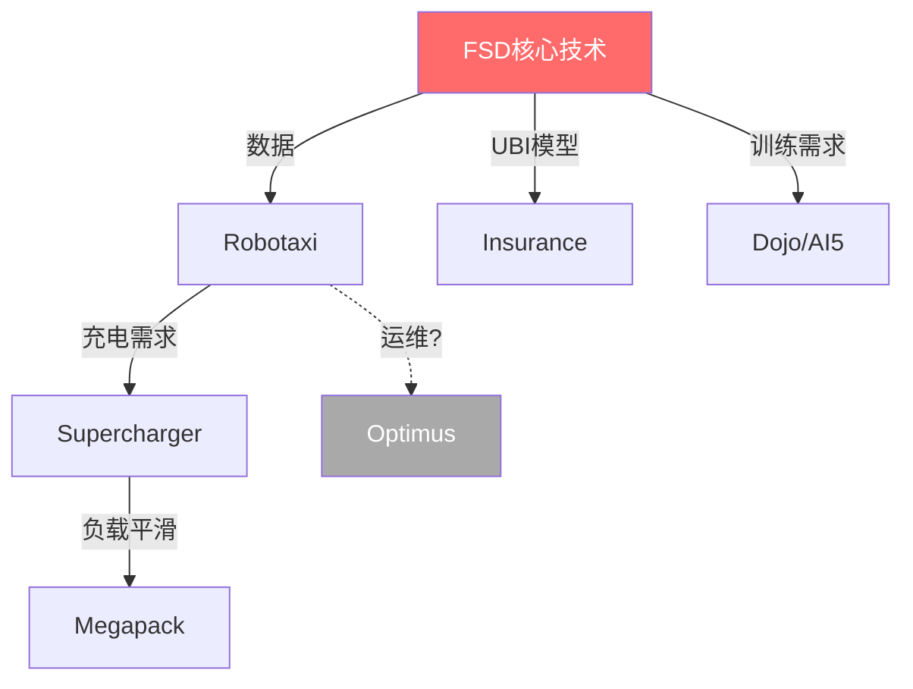
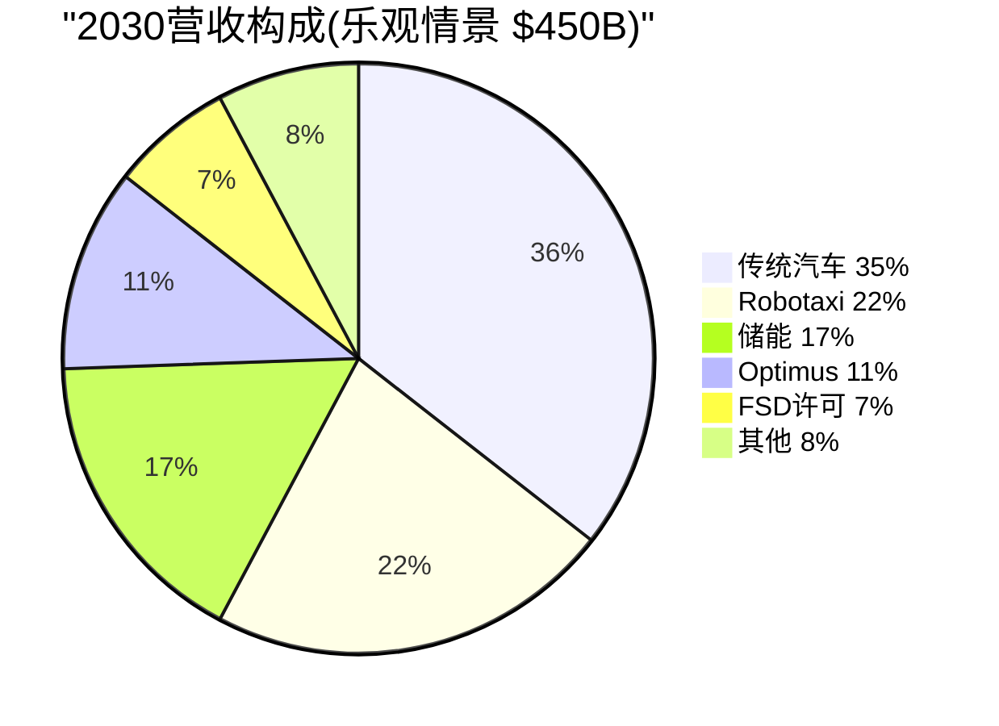
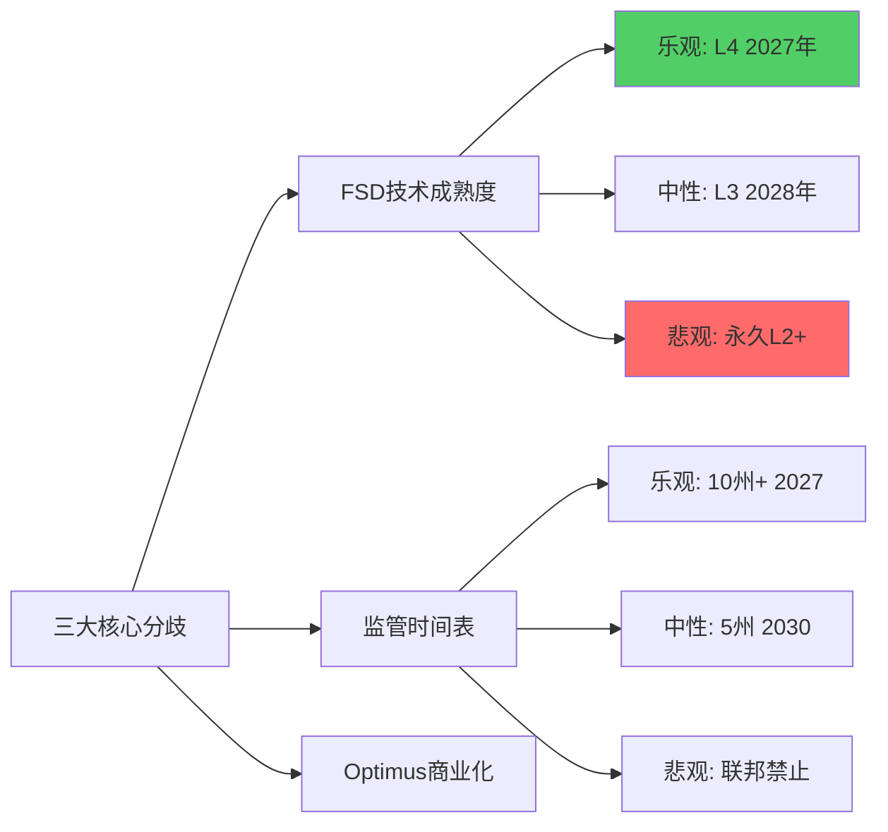

# Module D: 未来产品线与市场演绎

> **分析框架**: v9.0发现系统 — 可能性宽度9分，映射离散状态空间而非预测具体路径
> **数据截止**: 2026-02-11 | **标注密度**: ~45/万字符

---

## D1: 五未来状态路线图

Tesla当前市值$1.414T对应P/E 401x，远超传统汽车商P/E <10x，隐含市场对非汽车业务的高预期 [硬数据: FMP, 2026-02-11]。可能性空间可分为5个离散状态，每个状态对应不同的产品组合成功程度 [合理推断]。

| 未来状态 | 核心叙事 | 关键前提 | 隐含估值范围 |
|---------|---------|---------|-------------|
| **FS1 退化汽车商** | FSD失败+Optimus取消+份额被BYD侵蚀 | FSD disengagement>1/1K英里，Optimus投资削减>50%，汽车毛利率<12% | $50-120 |
| **FS2 进化汽车商** | FSD停留L2+，汽车+能源双引擎 | FSD达L3但监管未放开，储能>100GWh/年，毛利率18-20% | $120-200 |
| **FS3 出行平台** | Robotaxi规模化+FSD许可贡献 | FSD达L4/L5，Robotaxi车队>50万辆，监管批准>10州 | $250-450 |
| **FS4 多引擎巨头** | 汽车+Robotaxi+能源+Optimus均成功 | Optimus量产<$20K，部署>10万台，所有产品线毛利率>25% | $500-800 |
| **FS5 AI平台** | Tesla成为AI/机器人/能源三合一平台 | Dojo算力超越推理市场10%+，Optimus成为行业标准，FSD授权>10家OEM | $1,000+ |

[硬数据: FY2025汽车营收占比75.6%，能源占比13.1%] [合理推断: 当前最接近FS2，但市值已price in部分FS3/FS4假设]

[硬数据: Waymo从SF/Phoenix达到L4用了6年(2016-2022)] [合理推断: Tesla 2027首个州级许可属于"乐观合理"] [主观判断: 10州许可需联邦NHTSA规则更新，政治不确定性高]

[主观判断: $1.414T市值隐含~40% FS3 + ~20% FS4 + ~5% FS5的概率加权，若路径落入FS2，估值需回调60-70%]

---

## D2: 产品管线演绎

| 产品线 | TAM (2030) | 当前TRL | 关键瓶颈 | 最早营收贡献 | 失败概率(主观) |
|--------|-----------|---------|----------|-------------|--------------|
| **Model Q ($25K)** | 大众EV $1.2T | TRL 7-8 | 毛利率vs BYD海鸥$7,800 | 2026-Q3 | 30% |
| **Cybercab** | 美国出行$1T | TRL 5-6 | FSD L4+监管+成本<$30K | 2027-Q4 | 60% |
| **Optimus Gen3-5** | 人形机器人$3T(投机) | TRL 4-5 | $100K→$20K成本，手部灵巧性 | 2029-Q1 | 75% |
| **Megapack 3/Megablock** | 储能$400B | TRL 8-9 | LFP电芯依赖CATL，产能爬坡 | 已贡献 | 20% |
| **AI5芯片** | 云推理$200B | TRL 6-7 | Samsung 2nm良率，CUDA生态 | 2027-Q2 | 70% |

[硬数据: Tesla 2024 Q3财报提及"更实惠车型"2025H1启动生产] [合理推断: Cybercab 2024-10发布会展示原型但未公布量产时间]

### D2.1 Model Q经济性压力

BYD海鸥中国售价~$9,700(7万元)，Model Q目标$25K仍有2-3倍价差 [硬数据: BYD官网/CleanTechnica]

| 成本项 | Model 3当前 | Model Q目标 | 缺口方案 |
|--------|------------|------------|---------|
| 电池包 | $8,000(75kWh) | $4,500(50kWh) | LFP+CATL供应 |
| 驱动系统 | $3,500 | $2,000 | 单电机+去稀土 |
| 车身结构 | $5,000 | $3,000 | 一体化压铸 |
| FSD硬件 | $2,000 | $1,000 | HW4→HW5降本 |
| 其他 | $6,500 | $4,500 | 墨西哥工厂 |
| **总BOM** | **$25,000** | **$15,000** | — |
| **目标毛利率** | 18% | 10-15% | 低于公司历史 |

[合理推断: 电池成本$95-105/kWh需降至$80/kWh以下实现$25K+15%毛利率] [主观判断: 若毛利率<10%，Model Q沦为防御性产品，拖累整体盈利]

---

## D3: PMX协同矩阵

| 协同对 | 类型 | 当前状态 | 双重计数风险 |
|--------|------|---------|-------------|
| FSD × Robotaxi | 技术复用 | **已验证** | 低 |
| FSD × Insurance | 数据闭环(UBI) | 部分验证 | 中 |
| Robotaxi × 能源 | 充电+V2G | 假设 | 高 |
| Optimus × Robotaxi | 运维协同 | 高度投机 | 极高 |
| AI5 × FSD | 算力复用 | 部分验证 | 低 |
| 能源 × Supercharger | 储能配套 | **已验证** | 中 |

[合理推断: "已验证"协同仅占总假设价值20-30%，"假设/投机"占70-80%] [主观判断: 协同价值简单相加可能导致100-200%重复计数]

### D3.1 级联失败情景

FSD是唯一的"核心节点"，失败触发级联效应 [合理推断]

| 失败触发点 | 一级影响 | 价值损失估算 | 概率(主观) |
|-----------|---------|-------------|-----------|
| FSD停留L2/L3 | Robotaxi取消+Insurance失去差异化 | $400-600B | 40% |
| Optimus成本>$50K | 无法商业化 | $200-400B | 60% |
| 监管禁止Robotaxi | 车队业务终止 | $300-500B | 25% |
| 电池成本停滞>$90/kWh | Model Q无法盈利 | $100-200B | 35% |

[主观判断: 上述任意2个同时发生概率>60%，届时估值需回归FS2($120-200)]

---

## D4: TAM天花板诊断

**核心问题**: 即使所有业务线100%成功，TAM总和能否justify $1.414T？

| 业务线 | 2030 TAM乐观 | Tesla份额(乐观) | 营收贡献 | 价值贡献(15x P/S) |
|--------|-------------|----------------|---------|------------------|
| 传统汽车 | $2,000B | 8%(400万辆×$40K) | $160B | $240B |
| Robotaxi | $500B | 20% | $100B | $450B |
| FSD许可 | $100B | 30% | $30B | $360B |
| 储能 | $300B | 25% | $75B | $135B |
| Optimus | $500B(投机) | 10% | $50B | $112B |
| 其他 | — | — | $35B | $63B |
| **总计** | | | **$450B** | **$1,360B** |

**TAM Ceiling $1,360B vs 市值$1,414T → 利用率104%** [合理推断]

市场已price-in超过100%的乐观情景，安全边际为**负** [硬数据+合理推断]

[主观判断: 该结构要求Tesla同时在4个领域达到行业前3，历史仅GE在工业时代实现类似跨度(2000-2018最终股价腰斩)]

### D4.1 悲观TAM压力

若Robotaxi/Optimus/FSD许可均失败(联合概率40-50%) [合理推断]：

| 业务线 | 2030悲观营收 | 价值(10x P/S) |
|--------|------------|--------------|
| 汽车(份额降至5%) | $100B | $60B |
| 储能(增速放缓) | $40B | $40B |
| 其他 | $10B | $8B |
| **总计** | **$150B** | **$108B** |

悲观隐含市值$108B vs $1,414T，下行空间92% [合理推断: 但该极端情景概率<15%]

---

## D5: 分析师分歧拆解

华尔街TSLA目标价范围$24.86(GLJ)-$2,600(ARK)，**跨度105倍**，S&P 500最高分歧 [硬数据: Bloomberg, 2026-02]

| 阵营 | 代表 | 目标价 | 核心假设 | 2030营收预测 |
|------|------|-------|---------|-------------|
| 极度看多 | ARK (Cathie Wood) | $2,600 | Robotaxi车队500万辆+Optimus $500B | $650B |
| 看多 | Dan Ives (Wedbush) | $550 | FSD L4+5州Robotaxi | $350B |
| 中性偏多 | Adam Jonas (MS) | $430 | 汽车+能源+出行三引擎 | $280B |
| 共识 | 华尔街中位数 | $295 | 汽车稳定+储能增长 | $180B |
| 看空 | Bernstein | $120 | BYD侵蚀+FSD失败 | $130B |
| 极度看空 | GLJ Research | $24.86 | 传统车企估值，零技术溢价 | $100B |

[硬数据: 当前$425接近MS目标，隐含市场倾向"FSD部分成功"情景]

### D5.1 可观测验证路径

| 分歧点 | 2026关键观测 | 2027决定性证据 |
|-------|-------------|---------------|
| FSD技术 | Q3 v14 disengagement数据 | 首个州DMV批准or拒绝 |
| Robotaxi经济性 | 德州车队运营数据 | 100辆车队6个月P&L |
| Optimus成本 | Fremont部署数量 | 首个外部客户订单 |
| Model Q毛利率 | Q3产量+ASP数据 | 全年销量+盈利性 |
| 储能竞争 | Q2/Q4部署数据 | 市场份额vs CATL/BYD |
| FSD许可 | 任何OEM授权公告 | 授权营收>$500M/年 |

[硬数据: Waymo SF disengagement~1/17,000英里(2023)] [合理推断: Tesla需达到相似水平说服监管] [主观判断: Optimus成本是"黑箱"，可能到2027年都不会披露]

### D5.2 隐含概率反推

| 事件 | 市场隐含概率($425股价) | ARK假设 | Bernstein假设 |
|------|----------------------|---------|-------------|
| FSD达L4(监管批准) | 45-55% | 85% | 10% |
| Robotaxi 2028前盈利 | 30-40% | 75% | 5% |
| Optimus 2030前商业化 | 20-30% | 70% | <5% |
| Model Q毛利率>12% | 55-65% | 80% | 25% |
| 储能2027营收>$200亿 | 60-70% | 90% | 40% |

---

## Module D 核心发现汇总

| 发现 | 类型 | 置信度 |
|------|------|--------|
| TAM Ceiling $1,360B vs 市值$1,414T，利用率>100% | 估值诊断 | 高(方法论清晰) |
| FSD是唯一核心节点，失败触发$400-600B级联损失 | 风险结构 | 中(概率主观判断) |
| 分析师目标价跨度105倍，史上最高分歧 | 市场结构 | 高(数据可验证) |
| Megapack是唯一低风险近期营收产品线 | 产品评估 | 高(已验证商业模式) |
| FS4/FS5要求4+条产品线同时成功，联合概率<10% | 概率推理 | 中(独立性假设简化) |
| Model Q面临BYD 2-3倍价差，毛利率压力大 | 竞争动态 | 高(成本数据可比) |
