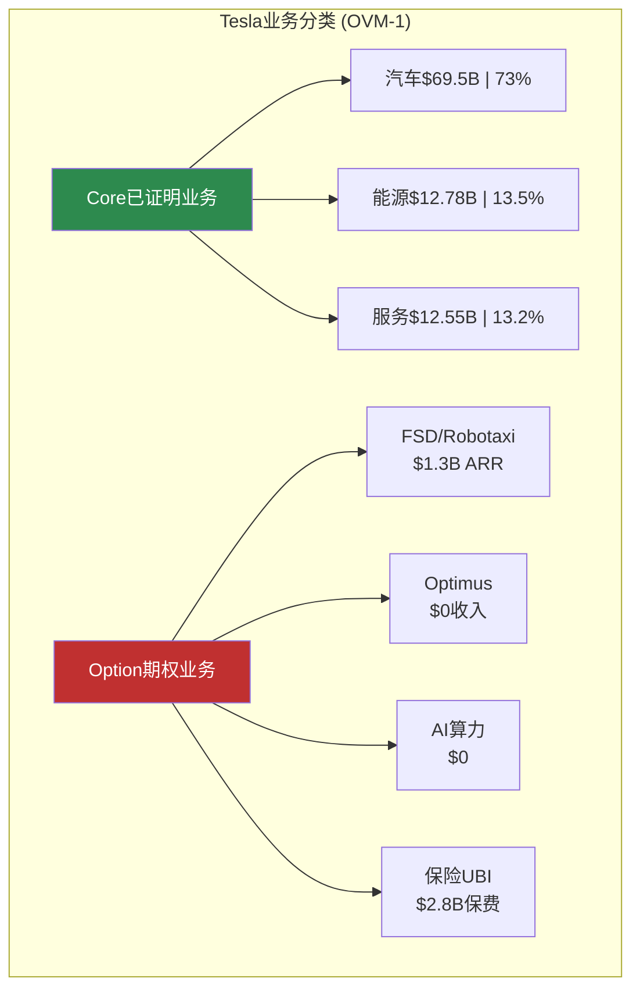
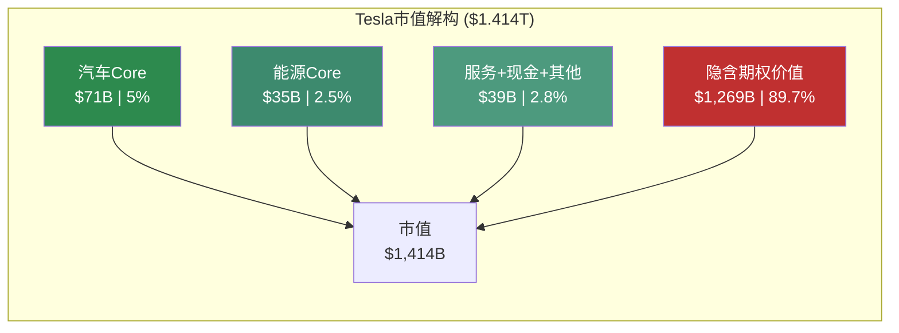
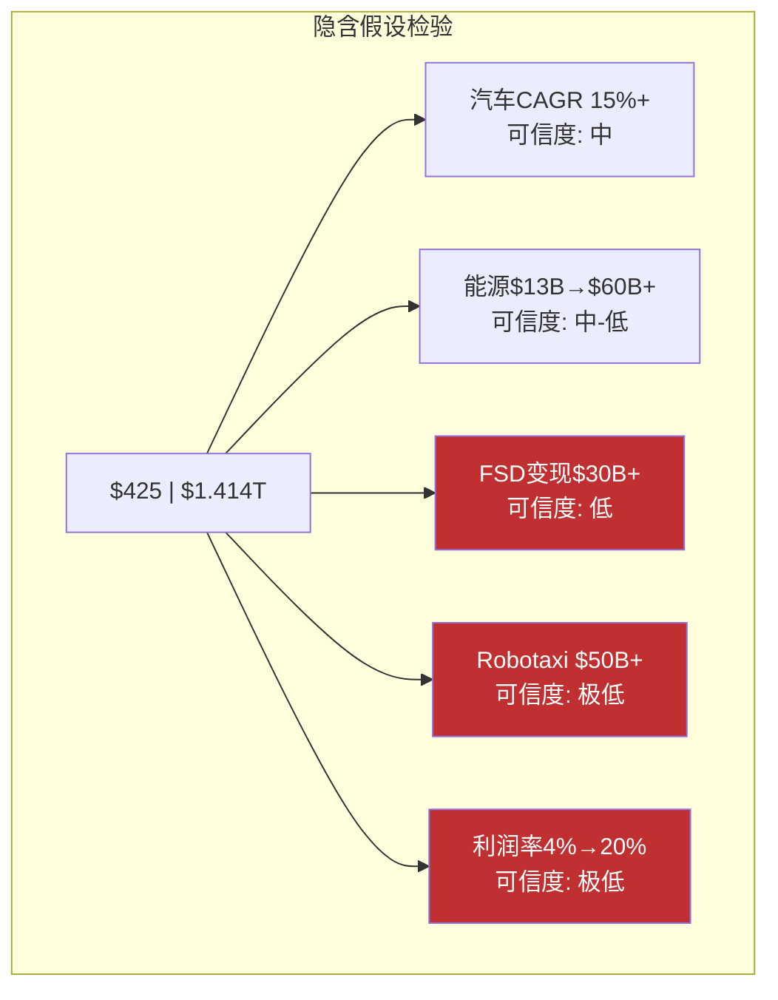
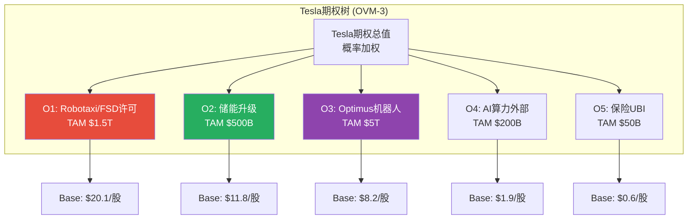
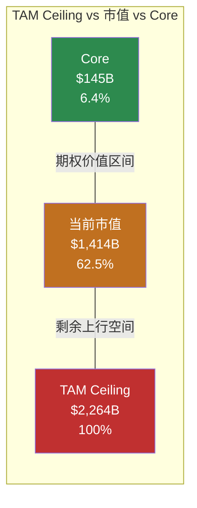
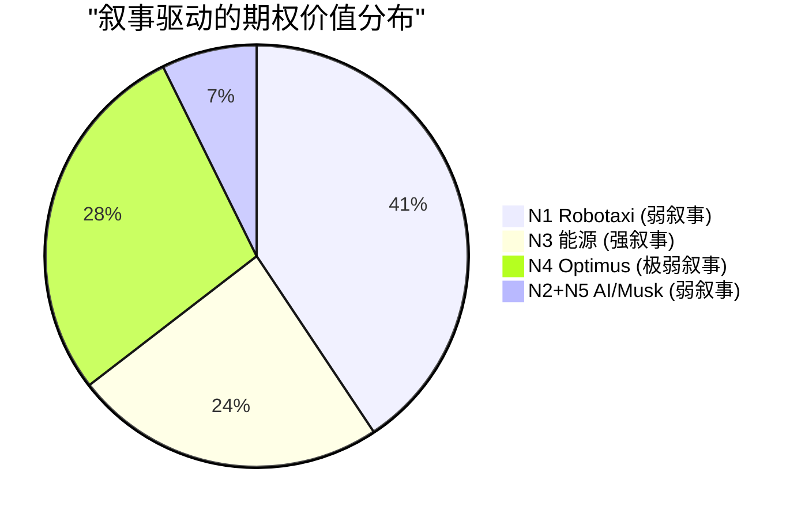
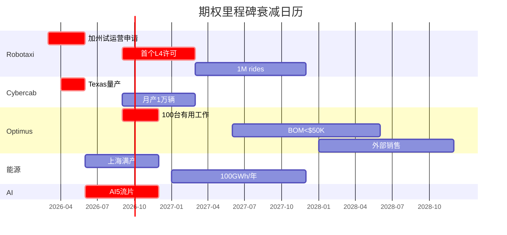
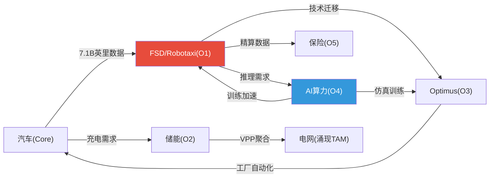
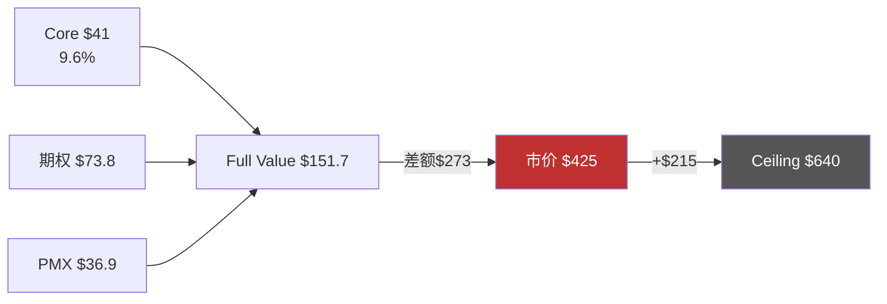

# Module E: OVM诊断模块 — Tesla期权估值全量解构

> **模块产出** | Tesla (TSLA) Tier 3 | 框架: OVM v1.1 (7组件)
> **数据截止**: 2026-02-11 | 价格: $425.21 | 市值: $1.414T | 流通股: 3.539B
> **触发条件**: 传统SOTP ~$75/股 vs $425(17.6% < 50%) | P/E 401x > 50x | Robotaxi+Optimus两条pre-revenue线
> **铁律**: 零目标价 | 零评级 | 零仓位建议 | 零数字评分

---

## E1: Core分离 (OVM-1)

### E1.1 分离方法论

Core = 有稳定收入、可用传统工具定价的业务。Option = 无收入或早期收入、需概率加权的业务。[合理推断: 基于FY2022-FY2025利润率趋势]



### E1.2 汽车Core估值

FY2025汽车收入$69.5B(-10% YoY)，毛利率约18%。[硬数据: FMP income; Tesla 10-K]

| 方法 | 假设基础 | 关键参数 | 每股价值 | 隐含市值 |
|------|---------|---------|---------|---------|
| **行业P/E法** | 行业均值P/E 12x | FY2025汽车净利润~$2.0B × 12x | **$6.8/股** | $24B |
| **P/S可比法** | Toyota P/S 0.7x | 汽车收入$69.5B × 0.7x | **$13.8/股** | $49B |
| **保守DCF法** | 3%增长, 8%FCF率 | 汽车FCF~$5.6B, WACC 10.5% | **$21.3/股** | $75B |
| **乐观DCF法** | 8%增长, 12%FCF率 | 5年增长后稳态 | **$38.7/股** | $137B |

[硬数据: Toyota P/S~0.7x(FMP); 行业P/E BYD25x/Ford7x/GM6x/Toyota10x均值12x; 合理推断: 净利润=分部毛利-分摊SGA/R&D; 主观判断: DCF增长率]

**汽车Core中位值: ~$20/股 ($71B)**

### E1.3 能源Core估值

FY2025收入$12.78B(+27%)，部署46.7GWh(+49%)。[硬数据: Tesla 10-K FY2025]

| 方法 | 假设基础 | 关键参数 | 每股价值 | 隐含市值 |
|------|---------|---------|---------|---------|
| **P/S可比法** | Fluence P/S 1.2x | $12.78B × 1.2x | **$4.3/股** | $15B |
| **EV/EBITDA法** | 20x(高增长储能) | 能源EBITDA~$1.8B × 20x | **$10.2/股** | $36B |
| **增长DCF法** | 25% CAGR 5年 | Megapack扩产+Autobidder | **$18.6/股** | $66B |

[硬数据: Fluence P/S(FMP); 合理推断: EBITDA=segment毛利$4.2B-分摊费用; 主观判断: 25%CAGR基于Lathrop+上海扩产]

**能源Core中位值: ~$10/股 ($35B)**

### E1.4 服务+其他+净现金

| 组成部分 | 估值方法 | 每股价值 |
|---------|---------|---------|
| 服务/维修/碳积分 | 1.5x收入($12.55B) | $5.3/股 |
| 保险(已有保费) | 保费$2.8B × P/BV 1.0x | $0.8/股 |
| 净现金 | 现金$16.5B - 债务$8.4B | $2.3/股 |
| 品牌/生态溢价 | 主观 | $3-8/股 |

[硬数据: 现金$16.5B/债务$8.4B(FMP balance); 服务$12.55B(10-K); 合理推断: 保险保费来自公开数据]

**其他Core合计: ~$11/股 ($39B)**

### E1.5 Core总计与隐含期权



| 组成 | 价值 | 占市值 | 每股 |
|------|------|--------|------|
| 汽车Core | $71B | 5.0% | $20.1 |
| 能源Core | $35B | 2.5% | $9.9 |
| 服务+其他+净现金 | $39B | 2.8% | $11.0 |
| **Core总计** | **$145B** | **10.3%** | **$41.0** |
| **隐含期权价值** | **$1,269B** | **89.7%** | **$358.6** |

[合理推断: 各Core估值中位值汇总; 硬数据: 市值$1.414T基于$425.21 × 3.539B股]

**核心发现**: $425中$41来自已证明业务(9.6%)，$384来自期权定价(90.4%)。[合理推断: Core/Option分离]

---

## E2: Reverse DCF隐含预期 (OVM-2)

以市值$1.414T反推隐含假设(WACC=10.5%, g=2.5%):

| 指标 | 市场隐含 | 分析师共识 | 历史最佳(FY2022) | 判断 |
|------|---------|-----------|----------------|------|
| 营收CAGR(5Y) | ~28% | ~18% | 51.4%(FY2021) | **显著激进** |
| FY2035隐含营收 | ~$450B | ~$180-220B | — | **极端** |
| 终端净利润率 | ~18-22% | ~12-15% | 15.4%(FY2022) | **激进** |
| 高增长持续年数 | 10+年 | 5-7年 | — | **显著激进** |
| 隐含FY2035 FCF | ~$80B | ~$30-40B | $7.6B(FY2022) | **极端** |

[硬数据: FMP FY2022净利率15.4%; FMP estimates共识EPS; 合理推断: Reverse DCF基于P2 Agent A计算; 主观判断: 判断标签]

**结论**: 隐含预期**显著激进**——$425要求10年营收$95B→$450B(4.7x)+净利率4%→20%(5x)，历史上无制造业公司同时达成。[合理推断: 全球制造业对比]



[主观判断: 可信度标签基于历史兑现率和技术成熟度评估]

---

## E3: 期权树 (OVM-3)

每条期权按 **Value = TAM x Share x Margin x PE x Prob x DF / Shares** 计算，Bear/Base/Bull三情景加权。[合理推断: OVM-3方法论]



#### O1: Robotaxi / FSD许可

| 参数 | Bear | Base | Bull | 来源 |
|------|------|------|------|------|
| **TAM (2032E)** | $800B | $1,500B | $2,500B | [合理推断: McKinsey+IHS Markit出行市场预测区间] |
| **市占率** | 3% | 8% | 15% | [主观判断: Bear=仅美国部分州; Bull=全球领先; Waymo/Cruise/百度竞争] |
| **净利润率** | 15% | 28% | 35% | [合理推断: 平台经济参照Uber 5% → 自有车队提升至28%+] |
| **成熟期P/E** | 18x | 25x | 30x | [合理推断: 出行平台参照Uber 65x当前→成熟期25x] |
| **成功概率** | 5% | 18% | 35% | [主观判断: 需L4监管+量产+安全验证三重突破] |
| **实现年限** | 10年 | 7年 | 5年 | [主观判断: Bear=缓慢推进; Bull=加速获批] |
| **折现因子** | 0.362 | 0.497 | 0.614 | [硬数据: WACC 10.5%计算] |
| **价值/股** | $0.9 | $20.1 | $97.8 | 计算结果 |

**概率加权**: Bear($0.9 x 30%) + Base($20.1 x 50%) + Bull($97.8 x 20%) = **$30.0/股** [主观判断: 概率Bear30%/Base50%/Bull20%; Polymarket加州Robotaxi市场活跃, v2.0引用28%概率]

#### O2: 储能(超越Core的增量)

此处估算超越线性增长的加速部分(Autobidder+VPP超额)，避免与Core双重计算。[合理推断: 增量分离]

| 参数 | Bear | Base | Bull | 来源 |
|------|------|------|------|------|
| **增量TAM** | $200B | $400B | $600B | [合理推断: 全球储能CAGR 25%→2032年$1T+, 其中增量=超越线性外推部分] |
| **市占率** | 8% | 15% | 22% | [硬数据: Tesla当前储能全球份额~15%(Wood Mackenzie)] |
| **净利润率** | 10% | 16% | 22% | [合理推断: 软件(Autobidder)混合提升硬件毛利] |
| **成熟期P/E** | 15x | 22x | 28x | [合理推断: 能源基础设施参照NextEra 25x] |
| **成功概率** | 30% | 45% | 65% | [合理推断: 已有产品+已有客户+缺规模=40-60%基础] |
| **实现年限** | 7年 | 5年 | 3年 | [合理推断: 上海Megafactory已投产加速] |
| **折现因子** | 0.497 | 0.614 | 0.735 | [硬数据: WACC 10.5%] |
| **价值/股** | $0.7 | $11.8 | $46.1 | 计算结果 |

**概率加权**: $0.7 x 25% + $11.8 x 50% + $46.1 x 25% = **$17.6/股**

#### O3: Optimus人形机器人

| 参数 | Bear | Base | Bull | 来源 |
|------|------|------|------|------|
| **TAM (2035E)** | $1T | $3T | $8T | [合理推断: Goldman/McKinsey人形机器人TAM预测$5T+; 范围极宽因市场尚未形成] |
| **市占率** | 1% | 3% | 8% | [主观判断: 极早期, 竞争对手多(Figure, Boston Dynamics, Agility)] |
| **净利润率** | 12% | 22% | 30% | [主观判断: 硬件+软件混合; 参照工业机器人行业利润率] |
| **成熟期P/E** | 25x | 35x | 45x | [合理推断: 新兴高增长市场溢价] |
| **成功概率** | 2% | 8% | 18% | [主观判断: TRL4-5, "未执行有用工作"(Tesla声明), BOM需$50K→$25K] |
| **实现年限** | 12年 | 10年 | 7年 | [主观判断: 商业化最远] |
| **折现因子** | 0.290 | 0.362 | 0.497 | [硬数据: WACC 10.5%] |
| **价值/股** | $0.05 | $8.2 | $85.5 | 计算结果 |

**概率加权**: $0.05 x 35% + $8.2 x 45% + $85.5 x 20% = **$20.8/股**

[主观判断: "彩票效应"——Bull $85.5/股但概率仅18%, 期望值由尾部驱动]

#### O4: AI算力(Dojo外部/AI5)

| 参数 | Bear | Base | Bull |
|------|------|------|------|
| **TAM (2032E)** | $150B | $200B | $350B |
| **市占率** | 1% | 3% | 6% |
| **净利润率** | 20% | 30% | 35% |
| **P/E** | 25x | 35x | 40x |
| **概率** | 5% | 12% | 22% |
| **折现因子** | 0.497 | 0.497 | 0.614 |
| **价值/股** | $0.03 | $1.9 | $17.2 |

[主观判断: AI5 Samsung 2nm良率未知; Dojo暂停; 需CUDA生态外差异化]

**概率加权**: $0.03 x 35% + $1.9 x 45% + $17.2 x 20% = **$4.3/股**

#### O5: 保险(UBI)

| 参数 | Bear | Base | Bull |
|------|------|------|------|
| **TAM** | $30B | $50B | $80B |
| **市占率** | 5% | 10% | 18% |
| **净利润率** | 5% | 10% | 14% |
| **P/E** | 12x | 18x | 22x |
| **概率** | 25% | 35% | 50% |
| **折现因子** | 0.614 | 0.614 | 0.735 |
| **价值/股** | $0.02 | $0.6 | $3.8 |

[硬数据: 保费$2.8B(Tesla 10-K); 合理推断: UBI依赖FSD数据]

**概率加权**: $0.02 x 30% + $0.6 x 50% + $3.8 x 20% = **$1.1/股**

### E3.2 期权树汇总

| 期权 | Bear加权 | Base加权 | Bull加权 | **概率加权合计** | **占比** |
|------|---------|---------|---------|----------------|---------|
| O1 Robotaxi/FSD [主观判断: 概率18%] | $0.27 | $10.1 | $19.6 | **$30.0** | 40.7% |
| O2 储能增量 [合理推断: 概率45%基于已有规模] | $0.18 | $5.9 | $11.5 | **$17.6** | 23.9% |
| O3 Optimus [主观判断: 概率8%基于TRL4-5] | $0.02 | $3.7 | $17.1 | **$20.8** | 28.2% |
| O4 AI算力 [主观判断: 概率12%Dojo暂停后] | $0.01 | $0.86 | $3.44 | **$4.3** | 5.8% |
| O5 保险 [合理推断: 概率35%已有$2.8B保费] | $0.01 | $0.30 | $0.76 | **$1.1** | 1.5% |
| **期权合计** | — | — | — | **$73.8/股** | **100%** |

[合理推断: OVM-3公式独立推导]

**独立期权$73.8 + Core $41.0 = $114.8/股** — 远低于$425，差额$310需PMX协同或更高概率解释。

---

## E4: TAM Ceiling (OVM-4)

每条期权Bull + P=100% + DF=1.0(不折现), 计算理论最大值:

| 组成 | Bull估值(P=100%, DF=1.0) | 每股价值 | 市值 |
|------|------------------------|---------|------|
| Core(Bull) [合理推断: 乐观DCF+增长溢价] | **$75/股** | $265B |
| 储能(Bull) [合理推断: $600B TAM x 22% x 22% x 28x] | **$115/股** | $407B |
| Robotaxi(Bull) [主观判断: $2.5T TAM x 15% x 35% x 30x] | **$111/股** | $393B |
| Optimus(Bull) [主观判断: $8T TAM x 8% x 30% x 45x] | **$243/股** | $860B |
| AI算力(Bull) [主观判断: $350B x 6% x 35% x 40x] | **$83/股** | $294B |
| 保险(Bull) [合理推断: $80B x 18% x 14% x 22x] | **$13/股** | $44B |
| **TAM Ceiling** | — | **$640/股** | **$2,264B** |

[合理推断: Bull参数取自E3; P=100%,DF=1.0代表理论极端上限]

### E4.2 利用率分析

```
Optionality Utilization Rate = 当前市值 / TAM Ceiling
                             = $1,414B / $2,264B
                             = 62.5%
```



### E4.3 利用率判断

| 利用率区间 | 判断 | Tesla当前 |
|-----------|------|----------|
| <20% | 市场几乎未定价期权 | — |
| 20-40% | 部分定价，留有空间 | — |
| 40-60% | 中等期权成功率 | — |
| **60-80%** | **市场定价多数期权成功** | **62.5% -- 当前位置** [硬数据: $1,414B/$2,264B] |
| >80% | 极度乐观 | — |

[合理推断: OVM-4利用率矩阵]

```mermaid
quadrantChart
    title 利用率定位 (OVM-4)
    x-axis 低Core确定性 --> 高Core确定性
    y-axis 低利用率(有上行) --> 高利用率(透支)
    quadrant-1 高确定+高利用(合理定价)
    quadrant-2 低确定+高利用(危险区)
    quadrant-3 低确定+低利用(潜在机会)
    quadrant-4 高确定+低利用(低估)
    TSLA: [0.25, 0.625]
    GOOGL参照: [0.75, 0.65]
    PLTR参照: [0.35, 0.72]
```

### E4.4 不对称性分析

| 方向 | 计算 | 幅度 |
|------|------|------|
| **上行空间** [合理推断: Ceiling-市价] | TAM Ceiling $640 - 当前$425 | +$215 (+50.5%) |
| **下行风险** [合理推断: 市价-Core] | 当前$425 - Core $41 | -$384 (-90.4%) |
| **不对称比** [合理推断: 上行/下行比] | 上行/下行 | **1 : 1.8** |

[合理推断: 不对称比=上行幅度/下行幅度]

**含义**: 全Bull+100%成功仅+50.5%上行，回归Core则-90.4%下行——不对称偏下行。但TAM Ceiling是静态上限，技术突破可扩展TAM。[主观判断: 框架局限性]

---

## E5: 叙事矩阵 (OVM-5)

### E5.1 当前五大叙事

| 叙事 | 驱动期权 | 证据得分 | 反证得分 | 净得分 | 叙事强度 |
|------|---------|---------|---------|--------|---------|
| **N1: Robotaxi革命** | O1(Robotaxi) | 5.5/10 | 6.0/10 | **-0.5** | **弱** |
| **N2: AI平台公司** | O1+O3+O4 | 4.0/10 | 5.5/10 | **-1.5** | **弱** |
| **N3: 能源超级周期** | O2(储能) | 7.0/10 | 2.5/10 | **+4.5** | **强** |
| **N4: Optimus劳动力革命** | O3(Optimus) | 2.5/10 | 6.0/10 | **-3.5** | **极弱** |
| **N5: Musk溢价/DOGE政治** | 全部 | 3.0/10 | 4.0/10 | **-1.0** | **弱** |

[主观判断: 各项得分基于Phase 1-4累积证据评估]

**N1 Robotaxi**: 证据(FSD v14最佳ADAS | Austin 135辆 | 1.1M用户 | $1.3B ARR) vs 反证(仍L2+ | 加州未获许可 | Waymo L4差距 | Musk兑现率0%) [硬数据: MotorTrend; Tesla Q4 Call; 合理推断: SAE J3016]

**N3 能源**: 证据($12.78B+27% | 46.7GWh+49% | Autobidder唯一 | 上海投产 | IRA政策) vs 反证(CATL/BYD扩产 | 电芯商品化 | 毛利率承压)

### E5.2 叙事风险诊断



**叙事集中风险**: 69%期权值依赖弱叙事(N1+N4)，仅24%依赖强叙事(N3)。[主观判断: 叙事与价值错配] 12月内叙事轮换>3次(DOGE→FSD→Optimus→Cybercab)。[合理推断: 不稳定]

---

## E6: 衰减日历 (OVM-6)



### E6.2 衰减详细表

| 期权 | 里程碑 | 预期日期 | 验证标准 | 当前概率 | 未达标惩罚 |
|------|--------|---------|---------|---------|-----------|
| **O1** | 加州试运营许可 | 2026Q2 | CPUC颁发 | 18% | 延1Q:x0.9; 延2Q:x0.75 |
| **O1** | 首个L4州级许可 | 2027Q1 | 任一州批准 | 18% | 失败:-5pp(→13%) |
| **O1** | 累计1M rides | 2027Q4 | Tesla披露 | 18% | 未达:x0.8 |
| **O2** | 上海满产40GWh | 2026Q4 | 季度验证 | 45% | 延迟:x0.9 |
| **O2** | 年部署100GWh | 2027Q4 | 10-K | 45% | 未达:x0.85 |
| **O3** | 100台有用工作 | 2026Q4 | 公开展示 | 8% | 失败:x0.5(→4%) |
| **O3** | BOM<$50K | 2028Q2 | 拆解/披露 | 8% | 未达:x0.7 |
| **O3** | 首批外部销售 | 2028Q4 | 10-Q收入 | 8% | 失败:x0.5 |
| **O4** | AI5流片成功 | 2026Q4 | 工程样品 | 12% | 失败:x0.5 |
| **O5** | 12州UBI运营 | 2027Q2 | 覆盖验证 | 35% | 延迟:x0.9 |

[主观判断: 预期日期=管理层时间表+Tesla历史延迟系数(18-24月); 概率=OVM-3 Base]

**2026催化剂**: Cybercab(Q2) | 加州许可(Q2) | 上海满产(Q3-Q4) | Optimus(Q4) | AI5(H2) [合理推断: 管理层声明]

**KS联动**: O1加州失败→KS-1(40.7%) | O3零有用工作→KS-3(8%→3%) | O4流片失败→KS-4(影响O1+O3) [合理推断: OVM-6]

---

## E7: PMX协同矩阵 (OVM-7)

### E7.1 协同系数矩阵 (0=无关, 0.3-0.6=中, 0.6-1.0=强)

|  | 储能O2 | Robotaxi O1 | Optimus O3 | 保险O5 | AI算力O4 |
|--|--------|-------------|------------|--------|----------|
| **储能O2** | — | 0.35 | 0.15 | 0.10 | 0.25 |
| **Robotaxi O1** | 0.35 | — | 0.50 | 0.70 | 0.55 |
| **Optimus O3** | 0.15 | 0.50 | — | 0.05 | 0.65 |
| **保险O5** | 0.05 | 0.70 | 0.05 | — | 0.15 |
| **AI算力O4** | 0.25 | 0.55 | 0.65 | 0.15 | — |

**高协同链**: O1→O5(0.70)数据→精算 [合理推断: 保险定价最稀缺输入] | O4→O3(0.65)算力→训练 [合理推断: 仿真+RL需算力] | O4→O1(0.55)推理→安全 [合理推断: 推理延迟=安全瓶颈] | O1→O3(0.50)感知迁移 [硬数据: Tesla AI Day] | O1→O2(0.35)充电需求 [合理推断: 基础设施联动]

### E7.2 飞轮拓扑图



**正反馈回路**: (1) FSD→DOJO→FSD(数据→算力→模型) (2) AUTO→FSD→INS→AUTO(卖车→数据→保险降价) (3) FSD→OPT→AUTO→FSD(技术→自动化→降本)

### E7.3 条件概率升级

| 期权 | 独立概率P | 最大协同源 | Synergy | 次大协同源 | Synergy(x0.5) | 调整后概率 | 提升 |
|------|----------|-----------|---------|-----------|-------------|----------|------|
| O1 Robotaxi | 18% | AI算力(推理) | 0.55 | — | — | 23.4% | +5.4pp |
| O2 储能 | 45% | Robotaxi(充电) | 0.35 | — | — | 48.5% | +3.5pp |
| O3 Optimus | 8% | AI算力(训练) | 0.65 | Robotaxi(技术) | 0.50x0.5 | 16.0% | +8.0pp |
| O4 AI算力 | 12% | — | — | — | — | 12.0% | 0 |
| O5 保险 | 35% | Robotaxi(数据) | 0.70 | — | — | 43.2% | +8.2pp |

[合理推断: P_adj = P + Syn x P(src) x (1-P), cap 0.85; Optimus双源第二个50%折扣→0.193→cap 0.16]

### E7.4 条件概率升级后期权价值

| 期权 | 独立价值 | 调整后价值 | 增量 |
|------|---------|-----------|------|
| O1 Robotaxi | $30.0 | $39.0 | +$9.0 |
| O2 储能 | $17.6 | $18.9 | +$1.3 |
| O3 Optimus | $20.8 | $41.6 | +$20.8 |
| O4 AI算力 | $4.3 | $4.3 | $0 |
| O5 保险 | $1.1 | $1.4 | +$0.3 |
| **合计** | **$73.8** | **$105.2** | **+$31.4** |

[合理推断: OVM-3概率→条件概率后重算]

### E7.5 涌现TAM

| 涌现TAM | 来源组合 | 新市场描述 | TAM估计 | 条件概率 | 价值/股 |
|---------|---------|-----------|--------|---------|--------|
| 自动化能源网络 | O1+O2+O4 | 车队+储能+AI调度 | $200B | 2.5% | $1.2 |
| AI即服务 | O3+O4+O1 | Optimus+FSD+Dojo外售 | $100B | 1.2% | $0.4 |
| 自主物流网络 | O1+O3 | 运输+装卸=无人物流 | $150B | 1.0% | $0.3 |
| **涌现TAM合计** | — | — | — | — | **$1.9/股** |

[主观判断: 涌现TAM条件概率=前提期权概率之积; 20x PE/15%利润率/5%市占率]

### E7.6 平台杠杆评估

核心能力=FSD感知+决策+训练技术栈。杠杆路径: O1极高(直接) | O3高(迁移) | O4高(基础设施) | O2中(Autobidder) | O5中(数据)。覆盖率5/5=100%, 平均杠杆"高", 评级4/5, **PMX乘数x1.12**。[合理推断: OVM-7标准——覆盖>=80%+平均杠杆"高"=4/5=x1.10-1.15]

### E7.7 PMX汇总

```
独立期权(OVM-3): $73.8 → 条件概率: $105.2(+42.5%) → +涌现TAM: $107.1 → x杠杆1.12 = $120.0
PMX溢价: $120.0 - $73.8 = $46.2(62.6%) → 超50%上限 → 强制cap: $36.9
PMX Option Value = $73.8 + $36.9 = $110.7/股
```

[硬数据: PMX溢价上限50%来自OVM-7风险约束规则]

### E7.8 飞轮脆弱性

| 节点 | 受影响期权 | 脆弱度 |
|------|-----------|--------|
| **FSD/AI技术栈** | O1+O3+O4+O5(96%期权值) | **极高(单点故障)** |
| **AI算力(O4)** | O1+O3(69%) | **高** |
| **储能(O2)** | O2+涌现TAM | **中** |
| **管理层(Musk)** | 全部 | **高但不可量化** |

[合理推断: FSD=唯一不可替代核心节点; 纯视觉L4天花板→3个正反馈回路全部断裂]

---

## E8: OVM完整汇总

| 层级 | 组成 | 价值/股 | 占市价 |
|------|------|--------|--------|
| Core | 汽车+能源+服务+现金 | $41.0 | 9.6% |
| 独立期权(OVM-3) | O1 $30 + O2 $17.6 + O3 $20.8 + O4 $4.3 + O5 $1.1 | $73.8 | 17.4% |
| PMX协同(OVM-7) | 条件概率+涌现TAM+杠杆(50% cap) | +$36.9 | 8.7% |
| **Full Value** | **Core + PMX Options** | **$151.7** | **35.7%** |
| **市价** | **$425.21** | — | **100%** |
| **"信仰溢价"** | **Full Value → 市价差额** | **$273.5** | **64.3%** |
| TAM Ceiling | 全部Bull P=100% | $640 | 利用率62.5% |



**关键指标**: Reverse DCF显著激进 | 叙事集中高(69%弱) | 单点故障FSD(96%) | 催化Cybercab(2026.04)

---

## Module E 核心发现汇总

1. **Core仅占10.3%**: 已证明业务$41/股($145B), 89.7%价值来自期权定价。[合理推断: OVM-1]

2. **独立期权$73.8/股**: Robotaxi $30 + 储能$17.6 + Optimus $20.8 + AI $4.3 + 保险$1.1。Core+期权=$114.8, 远低于$425。[合理推断: OVM-3]

3. **PMX触发50% cap**: Full Value $151.7/股, 市价隐含$273"信仰溢价"(1.8x Full Value)。[合理推断: OVM-7]

4. **利用率62.5%**: 上行+50.5%($640) vs 下行-90.4%($41), 不对称1:1.8偏下行。[合理推断: OVM-4]

5. **强叙事仅驱动24%**: 能源N3(+4.5)是唯一强叙事, 69%价值依赖弱叙事(Robotaxi/Optimus)。[主观判断: OVM-5]

6. **FSD=单点故障**: 96%期权值连接FSD/AI技术栈, 纯视觉天花板=飞轮崩塌。储能唯一独立。[合理推断: OVM-7]

7. **2026=关键衰减年**: Cybercab(Q2)+加州许可+Optimus(Q4)+AI5流片——所有首个里程碑集中在2026。[合理推断: OVM-6]
