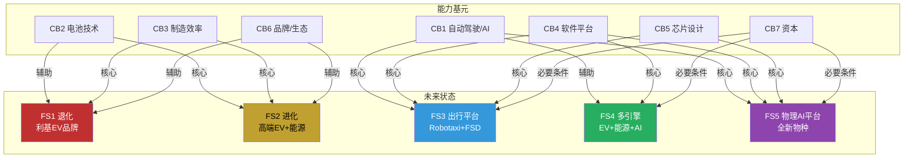
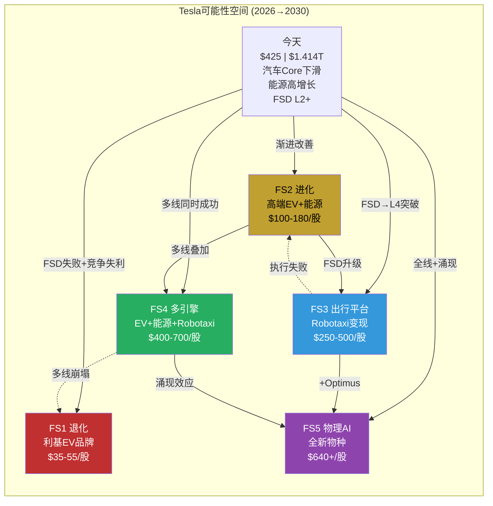
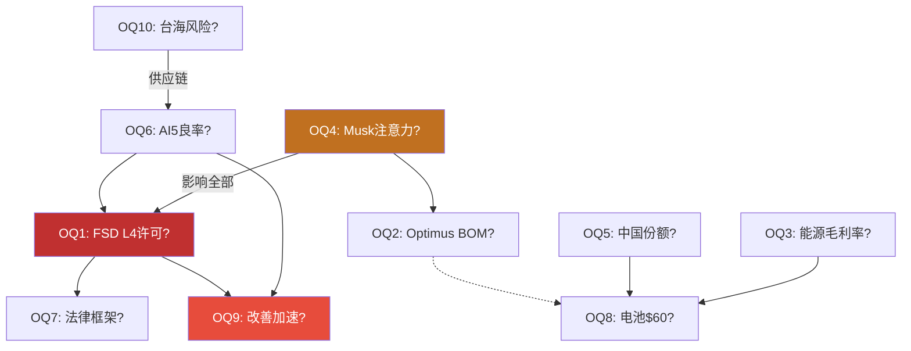
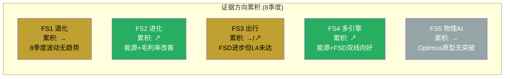
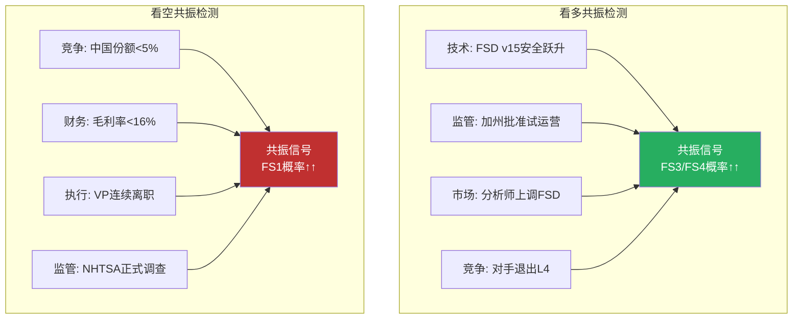
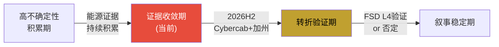

# Module F: 发现系统完整实现 — Tesla可能性空间映射

> **模块产出** | Tesla (TSLA) Tier 3 | 框架: 发现系统 v1.1 (可能性宽度 9/10)
> **不确定性类型**: A型 (类别不确定性) — "Tesla会变成什么类型的公司?"
> **数据截止**: 2026-02-11 | 价格: $425.21 | 市值: $1.414T
> **铁律**: 零目标价 | 零评级 | 零仓位建议 | 零数字评分 | 映射可能性=[深挖区], 预测未来=[诚实区]

---

## F1: 能力基元与未来状态映射 (Part 2补全)

### F1.1 Tesla七大能力基元

能力基元 = 可复用底层能力，同一基元可组合进入不同市场。Tesla拥有7个跨领域基元，广度在全球上市公司中几乎无对标。[合理推断: S&P 500比较]

| 能力基元 | 当前水平 | 量化指标 | 独特性评估 |
|---------|---------|---------|-----------|
| **CB1: 自动驾驶/AI** | L2+(端到端v14) [硬数据: SAE J3016] | 7.1B英里数据, 67K H100 GPU [硬数据: Tesla Q4 Call] | 数据规模独特; 纯视觉有争议 |
| **CB2: 电池技术** | LFP外采+4680~15% [硬数据: Tesla 10-K] | Megapack LFP, 4680爬坡缓慢 | 非领先(CATL/BYD) [合理推断: 拆解报告] |
| **CB3: 制造效率** | 压铸v1+Gigafactory [硬数据: 5座工厂] | Cybertruck爬坡中 | BYD成本低15%+ [合理推断: 第三方对比] |
| **CB4: 软件平台** | FSD+Autobidder+VPP [硬数据: Tesla Engineering Blog] | ~150微服务 | 五层垂直闭环=唯一 [合理推断: 竞品分析] |
| **CB5: 芯片设计** | HW4(7nm)+AI5(2nm设计) [硬数据: 芯片拆解] | 3代自研推理; Dojo暂停 [硬数据: TechCrunch报道] | 推理有差异化 |
| **CB6: 品牌/生态** | 高端EV [硬数据: S&P Global] | 忠诚度54%(从61%降) [硬数据: S&P Mobility] | 极化加剧; NACS标准 |
| **CB7: 资本** | $16.5B现金 [硬数据: FMP balance] | Z-Score 16.24 [硬数据: FMP financial-scores] | 充裕 |

[硬数据: FSD数据来自Tesla Q4 Earnings Call; GPU来自Tesla AI团队披露; 制造数据来自Tesla 10-K; Autobidder架构来自Tesla Engineering Blog; 合理推断: BYD成本优势来自第三方拆解报告]

### F1.2 能力基元到未来状态的映射

### F1.3 五个未来状态详细描述

#### FS1: 退化 — 利基EV品牌 ($35-55/股)

Tesla沦为高端利基品牌(类保时捷)，份额降至1-2%，FSD停在L2+，Optimus终止。[合理推断: 参照BlackBerry/Nokia]
- **需要基元**: CB3+CB6+CB2(仅Core) | **失败基元**: CB1+CB4+CB5(全部期权)
- **驱动因素**: FSD纯视觉L4天花板(2027-28) | BYD价格带获胜(2026-28) | Musk注意力转移 | 品牌极化不可逆

#### FS2: 进化 — 高端EV+能源 ($100-180/股)

汽车企稳(份额3-5%)，FSD作为L2+/L3 ADAS收费，能源成为第二支柱($30-50B)。"更好的丰田+储能巨头"。[合理推断: FS1和FS3之间的渐进路径]

| 基元 | 当前→FS2需要 | 可行性 |
|------|-------------|--------|
| CB1自动驾驶 | L2+ → L3 | 中 |
| CB2电池 | 15%→30%自产 | 中 |
| CB3制造 | 压铸v1→Unboxed | 中-高 |
| CB4软件 | +保险 | 高 |

#### FS3: 出行平台 — Robotaxi ($250-500/股)

FSD达L4+多州监管批准，Robotaxi 10+城市运营，FSD许可外售。估值从"制造P/E"切至"平台P/S"。[合理推断: 参照Uber估值逻辑切换]

| 瓶颈 | 性质 | 当前进展 |
|------|------|---------|
| L4技术突破 | 技术 | v14仍L2+; 纯视觉天花板未证 |
| 监管审批 | 政策 | 加州未获; Polymarket隐含低概率 |
| Cybercab量产 | 制造 | Texas 2026.04; 需月产1万+ |
| 安全数据 | 数据 | 需>1B英里L4数据(当前0) |
| 法律框架 | 法律 | 几乎空白 |

[硬数据: FSD v14 L2+(SAE J3016); Austin 135辆(Tesla Q4 Call)]

#### FS4: 多引擎 — EV+能源+Robotaxi ($400-700/股)

FS2+FS3组合，Tesla成为"丰田+Uber+NextEra"。需全部基元中-高水平，无单项容错。[合理推断: 华尔街bull case共识路径，是justify $425的最低要求]

| CB1 L4 | CB2 30%自产 | CB3 Cybercab 10K/月 | CB4 全平台 | CB5 AI5 | CB6 品牌稳定 | CB7 $50B+ |
|:------:|:-----------:|:-------------------:|:---------:|:-------:|:----------:|:---------:|
| 高难度 | 中 | 高 | 高 | 中-高 | 中 | 充裕 |

#### FS5: 物理AI平台 — 全新物种 ($640+/股)

Tesla将AI部署到物理世界: FSD(出行)+Optimus(劳动力)+Autobidder(能源)+AI5(算力)四线涌现。"物理世界的NVIDIA"，无历史对标。[主观判断: Musk终极愿景]

前提: L4全面批准(概率<20%) + Optimus BOM<$25K(概率<8%) + AI5业界采用(概率<5%) + 飞轮涌现(组合概率极低)。[主观判断: 2030年前实现概率]

### F1.4 状态转换矩阵

**关键观察**: $425对应FS4下边界——需多引擎同时成功才能justify。FS2(进化)=$100-180，即下行57-76%。[合理推断: 各状态估值区间与市价对比]

---

## F2: 形式化开放问题清单 (Part 3)

### F2.2 十大开放问题

| # | 问题 | 重要性 | 可观测性 | 时间窗 | 影响状态 | 非共识度 |
|---|------|--------|---------|--------|---------|---------|
| **OQ1** | FSD能否在2028前获任一州L4许可? | L4许可=FS3门槛, O1占期权值40.7% | 中(NHTSA季度数据) | 2026Q2→2028 | FS3/FS4/FS5 | 高 |
| **OQ2** | Optimus BOM能否降至$25K以下? | $25K=商业化经济门槛, 当前>$50K | 低(Tesla未披露) | 2027-2029 | FS4/FS5 | 极高 |
| **OQ3** | 能源毛利率能否维持>25%? | 唯一强叙事(N3), CATL/BYD进入 | 高(季度财报) | 每季度 | FS2/FS4 | 中 |
| **OQ4** | Musk注意力分散实际影响多大? | 6家公司+DOGE, 影响全部状态 | 低(间接推断) | 持续性 | 全部 | 极高 |
| **OQ5** | 中国份额能否止跌? | 全球最大EV市场, 份额9%→6.5% | 高(CPCA月度) | 每月 | FS1/FS2 | 中 |
| **OQ6** | AI5 Samsung 2nm良率可商业化? | 影响FSD推理+Optimus训练 | 低(保密) | 2026Q4→2027H1 | FS3/FS5 | 中 |
| **OQ7** | Robotaxi法律/保险框架何时建立? | L4技术≠商业运营, 法律空白 | 中(立法追踪) | 2026-2028 | FS3 | 高 |
| **OQ8** | 电池成本能否突破$60/kWh地板? | Model Q+Megapack经济性关键 | 中(BNEF年报) | 2026-2028 | FS1/FS2 | 中 |
| **OQ9** | FSD改善速度在加速还是减速?(二阶) | 加速=L4可达; 减速=天花板 | 中-低 | 每次OTA | FS3 | 高 |
| **OQ10** | 台海冲突是否重构AI芯片供应链? | HW4=TSMC; AI5=Samsung对冲 | 低(不可预测) | 不确定 | 全部 | 中 |

[硬数据: CPCA月度; TSMC 7nm芯片拆解; BNEF LCOE; CATL出货; 合理推断: OQ1权重=O1占比40.7%; 主观判断: 非共识度评估]

### F2.3 问题依赖网络

---

## F3: 证据积累图 (Part 4)

### F3.1 季度证据追踪 (2024Q1→2026Q1)

| 季度 | FS1退化 | FS2进化 | FS3出行 | FS4多引擎 | FS5物理AI | 关键事件 |
|------|:-------:|:-------:|:-------:|:---------:|:---------:|---------|
| 2024Q1 | ↗ | → | → | → | → | FSD v12发布; Q1销量-8.5% [硬数据: Tesla 10-Q] |
| 2024Q2 | ↗ | → | → | → | → | EV放缓; BYD超Tesla全球销量 [硬数据: CPCA/全球数据] |
| 2024Q3 | ↘ | → | ↗ | ↗ | ↗ | Robotaxi发布会; Optimus Gen3 [硬数据: Tesla Event] |
| 2024Q4 | → | ↗ | → | → | → | Q4销量回升; 储能38.2GWh [硬数据: Tesla 10-K] |
| 2025Q1 | ↗ | → | → | → | → | DOGE争议; 忠诚度54% [硬数据: S&P Mobility] |
| 2025Q2 | → | ↗ | ↗ | → | → | FSD v13.2; Austin 50辆 [硬数据: Tesla披露] |
| 2025Q3 | ↘ | ↗ | → | ↗ | → | 上海Megafactory投产 [硬数据: Tesla官方] |
| 2025Q4 | → | ↗ | ↗ | ↗ | → | FSD v14; 毛利率20.12%; 1.1M FSD用户 [硬数据: FMP/Tesla] |
| **2026Q1** | **↘** | **↗** | **→** | **↗** | **→** | **能源$12.78B+27%; Optimus无进展 [硬数据: Tesla 10-K]** |

[硬数据: Tesla 10-Q/10-K/财报电话会; 合理推断: 方向性基于累积数据]

### F3.2 各状态证据方向累积评估

**核心观察**: FS2证据最强(能源8季度正面+毛利率回升) [硬数据: 10-K; FMP]。FS3方向不明(FSD改善但仍L2+) [硬数据: Q4 Call]。FS5无实质证据(Optimus"未执行有用工作") [硬数据: Tesla声明]。FS1被低估(品牌+BYD竞争)。[合理推断: 多空对冲]

---

## F4: 转折点检测框架 (Part 5)

### F4.1 二阶变化信号 ("变化本身在变化", 比一阶更有信号价值)

| 指标 | 二阶问题 | 当前方向 | 追踪 |
|------|---------|---------|------|
| FSD干预率 | 改善速度在加速? | 不确定 | 每次OTA安全报告 |
| 储能backlog | 订单增长率加速? | ↗ | 季度管理层披露 |
| Optimus部署 | 月增速指数化? | →(从0起步) | 季度更新 |
| 汽车ASP | 降价速度减缓? | ↗(Q4'25稳定) | 收入/交付量 |
| 品牌忠诚度 | 下降速度减缓? | ↘(仍加速下降) | S&P Global调研 |

[硬数据: 储能backlog来自Tesla Earnings; 忠诚度61%→54%来自S&P Global Mobility]

### F4.2 跨维度共振信号 (多独立信号同向=强信号)

**看多共振→FS3/FS4↑↑**: FSD v15安全跃升 + 加州批准试运营 + 分析师上调FSD + 竞对退出L4

**看空共振→FS1↑↑**: 中国份额<5% + 毛利率<16% + 关键VP离职 + NHTSA正式调查

### F4.3 反事实信号 ("没发生"比"发生了"更有信息量)

| 反事实 | 信号含义 | 验证时间 |
|--------|---------|---------|
| FSD v14发布但安全性未改善 | **强负面**: 端到端天花板 | 待v14数据 |
| Cybercab量产但未降价 | **负面**: 成本未达标 | 2026Q2 |
| BYD进欧洲但Tesla份额不降 | **正面**: 品牌力超预期 | 2026H2 |
| 储能增长但Autobidder客户不增 | **负面**: 软件壁垒弱 | 季度 |
| Musk回归但产品节奏未加快 | **强负面**: 问题非注意力 | 2026H2 |

[主观判断: 解读方向; 合理推断: 预期行为基于行业常识]

---

## F5: 价格含义分析 (Part 6)

### F5.1 $425在赌什么

| 组成 | 价值 | 占$425 |
|------|------|--------|
| Core已证明 | $41/股 | 9.6% |
| 概率加权期权 | $73.8/股 | 17.4% |
| PMX协同 | $36.9/股 | 8.7% |
| **Full Value** | **$151.7/股** | **35.7%** |
| **"市场信仰溢价"** | **$273.5/股** | **64.3%** |

$273.5隐含: (1)期权概率远高(Robotaxi 40-50% vs 18%) (2)TAM更大(Optimus $10T+ vs $3T) (3)折现更低(5% vs 10.5%) (4)飞轮超线性。[合理推断: 描述性标签]

### F5.2 体制分类

| 体制 | 描述 | 当前适用性 |
|------|------|-----------|
| 高不确定性积累期 | 多条可能性线并行发展，尚无决定性证据 | — |
| **证据收敛期** | **1-2条可能性线获得显著证据支持** | **当前位置: 能源(FS2)证据收敛向好; FSD(FS3)待验证** |
| 转折验证期 | 出现转折点信号，需要验证持续性 | 2026H2可能进入(Cybercab+加州许可) |
| 叙事稳定期 | 主导可能性已明确 | 遥远 |

[主观判断: 体制分类是对当前状态的描述, 不是对未来的预测]

**当前**: 能源(FS2)证据收敛(8季度正面)，FSD(FS3)仍在高不确定性积累。2026H2=转折验证期过渡窗口。[合理推断: F3+F4综合]

---

## F6: 我们不知道什么 (Part 7)

### F6.1 关键未知清单

按"改变全局的概率"排序:

| 排序 | 未知 | 如果答案出来, 影响多大 | 何时可能知道 |
|------|------|---------------------|------------|
| **1** | FSD纯视觉L4天花板 [主观判断: 最大未知] | **改变全局**: 天花板→FS3/4/5受损; 无→bull增强 | 2027-2028 |
| **2** | Musk真实投入度 [主观判断: 不可直接观测] | **改变全局**: <30%时间→执行力下降; >50%→bull增强 | 不可知 |
| **3** | 全球L4监管框架 [合理推断: 各国进程不同] | **改变方向**: 严格→FS3延迟5年; 宽松→加速 | 2027-2029 |
| **4** | 电池成本物理下限 [硬数据: BNEF当前$70-80/kWh] | **改变量级**: $40→盈利+爆发; $70→BYD优势 | 2027-2028 |
| **5** | 机器人商业化时间线 [主观判断: 极宽区间] | **改变形态**: 2028→$5T+; 2035→无意义 | 2026-2028 |

### F6.2 未知与开放问题的关系

5个未知均不可直接观测，OQ1-10是代理变量: U1→OQ1+OQ9 | U2→OQ4 | U3→OQ7 | U4→OQ8 | U5→OQ2。proxy累积后方可推断，精确估值="精确的错误"。[合理推断: 发现系统核心原则]

---

## Module F 核心发现汇总

1. **A型不确定性极端案例**: 7基元→5未来状态($35→$640+)。$425仅FS4(多引擎全部成功)支撑，单引擎路径均意味下行。[合理推断: F1估值区间与市价对比]

2. **强证据路径不支撑股价**: FS2(EV+能源)8季度证据最强但仅$100-180，远低$425。FS3/FS4证据仅"中性偏积极"。[合理推断: F3证据积累]

3. **OQ1是最高信息密度变量**: FSD L4许可同时影响FS3/4/5，2026-2028可验证。OQ4(Musk注意力)影响全部但不可观测。[合理推断: F2依赖网络]

4. **"证据收敛期"早期**: 能源收敛(正面)，FSD仍在高不确定性积累。2026H2=体制变化窗口。[合理推断: F5体制分类]

5. **二阶信号>一阶数据**: "FSD改善在加速?"比"FSD改善了多少"更有预判价值。追踪变化率的变化率。[合理推断: F4转折点]

6. **反事实信号=隐藏金矿**: "FSD v14发布但安全性未改善"的信号价值远高于"发布且改善"(符合预期)。关注"什么没发生"。[合理推断: F4.3]

7. **关键未知不可直接观测**: FSD天花板/Musk投入/监管意志/电池极限/机器人商业化——只能通过OQ代理推断。精确估值=精确的错误。[合理推断: 发现系统认识论]
