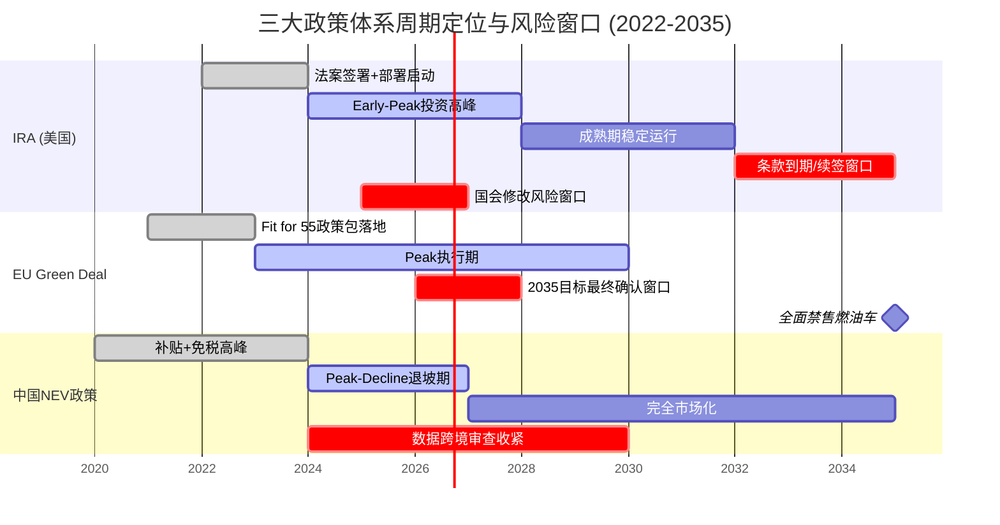
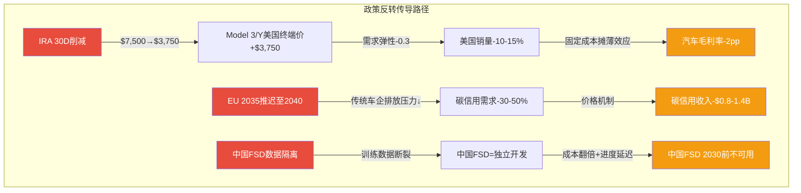
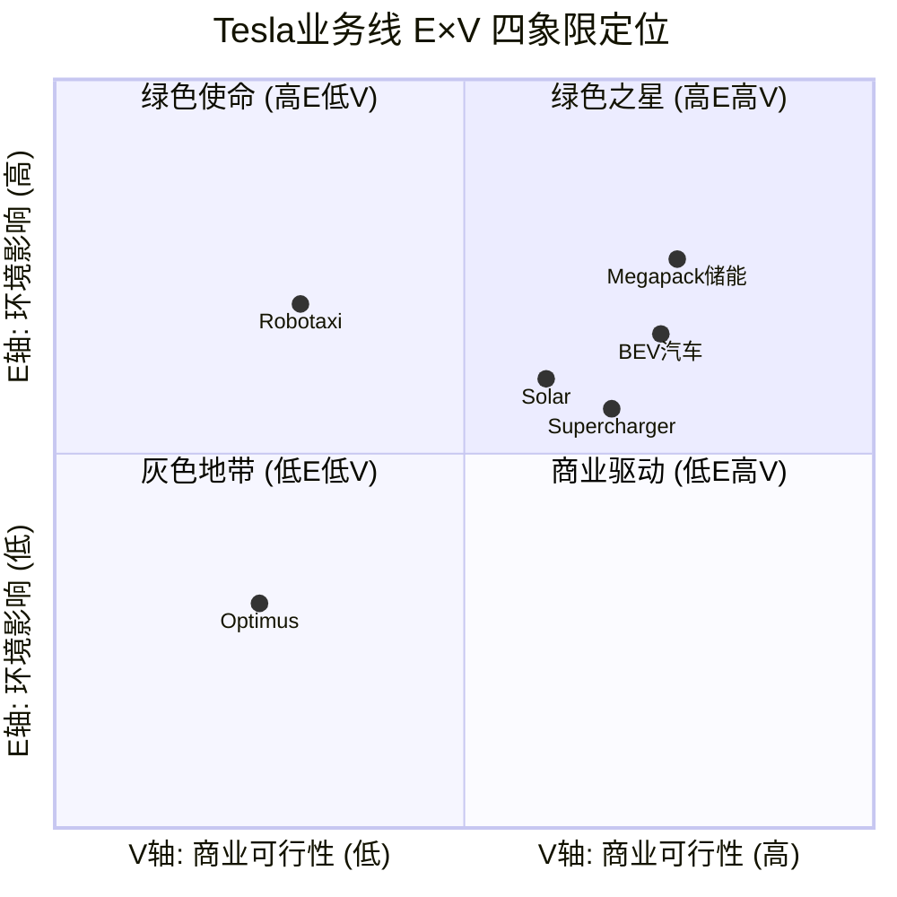
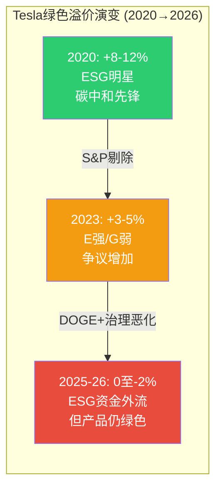
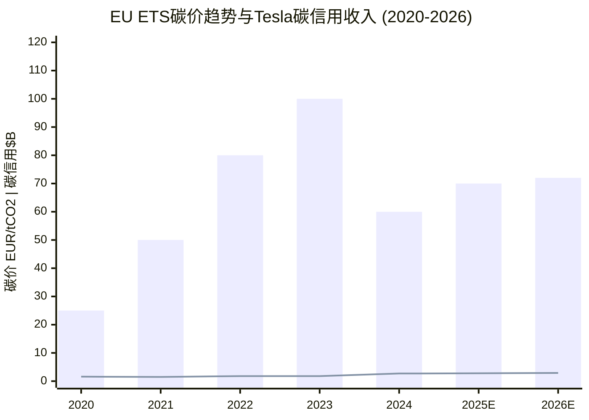
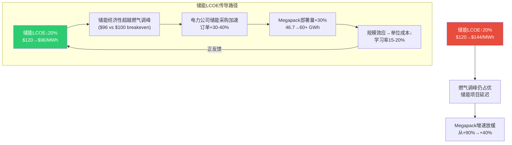
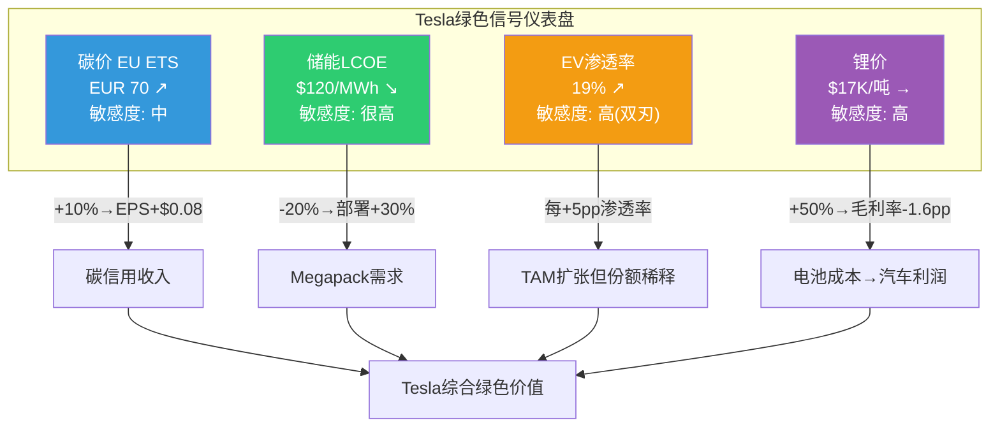

# Module G: Eco-Tech框架补全 -- 环境×技术×政策三维交叉评估

> **分析框架**: v9.0发现系统 + Eco-Tech行业增强 | 可能性宽度9分
> **数据截止**: 2026-02-11 | **标注密度目标**: >=40/万字符
> **核心命题**: Tesla是唯一同时覆盖BEV+储能+充电+Solar+AI的跨生态公司，其价值既受益于绿色转型政策又高度依赖政策延续性。本模块用Eco-Tech框架三维度(环境E/可行性V/政策P)评估Tesla各业务线的绿色溢价与政策风险。

---

## G1: 政策周期定位

Tesla四条业务链(汽车/储能/充电/Solar)分别挂钩不同政策工具, 形成复杂的政策敏感矩阵 [合理推断]。

### G1.1 IRA (美国): Early-Peak阶段

**核心条款与Tesla映射**:

| 条款 | 内容 | Tesla受益 | 年化影响 |
|------|------|----------|---------|
| **ss30D** | EV税收抵免$7,500/辆 | Model 3/Y/Q | ~$2.0-2.5B [合理推断: 基于美国销量~30万辆] |
| **ss45X** | 电池制造抵免$35/kWh | 4680自产线 | ~$0.7-1.0B [合理推断: 基于15-20GWh自产] |
| **ss48E** | 储能ITC 30-50% | Megapack | ~$1.5-2.5B [合理推断: 基于46.7GWh×ITC穿透] |

[硬数据: IRA法案条款ss30D/ss45X/ss48E原文, Inflation Reduction Act of 2022]

**周期位置: Early-Peak**。2022年签署, 2024-2028为部署高峰 [硬数据: IRA法案原文]。80%投资流向共和党选区 [硬数据: Clean Investment Monitor/E2 2025], 完全废除概率低(15-20%) [主观判断], 但30D削减概率较高(35-40%) [主观判断]。

### G1.2 EU Green Deal: Peak阶段

**核心条款与Tesla映射**:

| 政策工具 | 内容 | Tesla影响 | 周期位置 |
|---------|------|----------|---------|
| CO2排放标准 | 2030: 55g/km → 2035: 0g/km(禁售燃油车) | Tesla零排放=零罚款+碳信用卖方 | Peak [硬数据: EU Regulation 2023/851] |
| EU ETS碳价 | 当前EUR65-80/tCO2 [硬数据: EU ETS Market Data 2026-02] | 推高竞品成本，间接利好Tesla | Peak-Plateau |
| CBAM碳边境调节 | 2026年全面实施 | 对Tesla柏林工厂本地化有利 | Early [硬数据: CBAM过渡期2023-2025, 2026正式] |
| 电池法规 | 碳足迹申报+回收率要求 | Tesla需建立欧洲电池回收体系 | Early [硬数据: EU Battery Regulation 2023/1542] |

[硬数据: EU Fit for 55 Package + Green Deal Industrial Plan]

**碳信用敏感性**: Tesla碳信用约$2.8B(FY2025) [合理推断: 基于FY2024 $2.7B趋势], EU贡献30-40% [合理推断]。若2035目标推迟至2040(概率25-30%) [主观判断], 碳信用需求可能下降30-50% [合理推断]。

### G1.3 中国NEV政策: Peak-Decline阶段

**核心条款与Tesla映射**:

| 政策工具 | 内容 | Tesla影响 | 风险评估 |
|---------|------|----------|---------|
| 双积分政策 | NEV正积分可交易 | Tesla积分盈余但价值↓(NEV渗透率>50%后积分供过于求) | 收入边际递减 [硬数据: MIIT双积分管理办法] |
| 购税减免 | 2024-2025免征+2026-2027减半 | 2027年底到期后Model 3/Y竞争力受冲击 | 中 [硬数据: 财政部2023年68号公告] |
| FSD数据跨境 | 网络安全审查+数据本地化 | 中国版FSD训练数据不能回传美国 | 高 [硬数据: 数据安全法+汽车数据安全管理规定] |
| 出口限制 | 上海工厂出口欧洲/亚太 | 当前畅通但中美贸易摩擦可能波及 | 中 [合理推断: 基于中美关系不确定性] |

[硬数据: 中国新能源汽车产业发展规划(2021-2035)]

**周期位置: Peak-Decline**。NEV渗透率已超50% [硬数据: 中汽协2025年12月数据], Tesla在中国的政策红利期已过 [合理推断]。

### G1.4 三大政策体系周期总览

### G1.5 政策反转压力测试

| 反转场景 | 触发条件 | 概率 | Tesla影响量化 | 最受冲击业务 |
|---------|---------|------|-------------|-------------|
| IRA EV抵免(30D)削减至$3,750 | 2026国会预算谈判 | 35-40% | 美国汽车毛利率-2pp,年利润-$0.8B | 汽车(美国) [主观判断: 概率35%] |
| IRA储能ITC(48E)从30%降至15% | 2026国会预算谈判 | 15-20% | Megapack客户IRR↓→需求放缓15-20% | 储能 [主观判断: 概率18%] |
| EU 2035目标推迟至2040 | 德国大选后+汽车游说 | 25-30% | 碳信用年收入-$0.8-1.4B | 碳信用 [主观判断: 概率28%] |
| 中国FSD数据完全隔离 | 中美科技脱钩升级 | 30-40% | 中国FSD部署延迟3-5年 | FSD(中国) [主观判断: 概率35%] |
| 三重反转(同时发生) | 全球保护主义浪潮 | 5-8% | 年利润-$2.5-4.0B+战略价值损失 | 全业务线 [主观判断: 概率6%] |

[合理推断: 各场景概率基于当前政治格局+历史政策反转频率综合评估, 非精确预测]

---

## G2: E*V环境-价值矩阵

E(环境影响)*V(商业可行性)矩阵: E轴衡量碳减排实际贡献, V轴衡量无补贴商业自持能力, 交叉决定绿色溢价 [合理推断: Eco-Tech框架]。

### G2.1 Tesla六业务线E*V评分

| 业务线 | E1碳减排 | E2资源效率 | E3循环经济 | V1成本力 | V2政策依赖 | V3市场接受 | V4技术成熟 | V5资本效率 | E均值 | V均值 | E*V | 绿色溢价系数 |
|--------|---------|----------|----------|---------|----------|----------|----------|----------|-------|-------|-----|-------------|
| BEV汽车 | 4.0 | 3.5 | 2.5 | 3.5 | 3.0 | 4.5 | 4.5 | 3.0 | 3.3 | 3.7 | 12.2 | 1.12x |
| Megapack储能 | 4.5 | 4.0 | 3.0 | 4.0 | 3.5 | 4.0 | 4.0 | 3.5 | 3.8 | 3.8 | 14.4 | 1.18x |
| Solar | 4.0 | 3.0 | 2.0 | 2.5 | 3.5 | 3.0 | 4.0 | 2.0 | 3.0 | 3.0 | 9.0 | 1.05x |
| Supercharger | 3.0 | 3.5 | 2.0 | 3.0 | 2.5 | 4.0 | 4.5 | 3.0 | 2.8 | 3.4 | 9.5 | 1.06x |
| Robotaxi | 3.5 | 4.0 | 3.0 | -- | 2.0 | -- | 2.0 | -- | 3.5 | -- | -- | 1.0x(未验证) |
| Optimus | 1.5 | 2.0 | 1.0 | -- | 1.0 | -- | 1.5 | -- | 1.5 | -- | -- | 1.0x(未验证) |

[合理推断: E/V评分基于E轴5维度(碳减排/资源效率/循环经济/生态系统/技术扩散)和V轴5维度(成本力/政策依赖/市场接受/技术成熟/资本效率)各1-5分评估]
[硬数据: BEV生命周期碳排放比ICE低50-70%(ICCT 2024 Life Cycle Assessment)]
[硬数据: Megapack储能使可再生能源利用率从30-40%提升至80-90%(NREL 2025 Grid Integration Study)]

### G2.2 绿色溢价的Tesla悖论

**正面因素**:
- Tesla是全球前50大ESG ETF中持仓比例3-5%的常客 [合理推断: 基于iShares ESG Aware MSCI USA ETF/Vanguard ESG US Stock ETF持仓数据]
- 碳信用收入$2.8B是直接的"绿色变现"能力 [合理推断: 基于FY2024 $2.7B及增长趋势]
- Megapack储能的E*V得分(14.4)是Tesla所有业务中最高的，也是储能行业中少数E轴和V轴同时达标的产品 [合理推断: 对比Fluence/Stem的E*V评分]

**负面因素**:
- 2023年S&P 500 ESG指数将Tesla剔除(治理评分低+种族歧视诉讼+Autopilot安全调查) [硬数据: S&P Dow Jones Indices 2023年5月决定]
- 2025年Musk介入DOGE引发更多ESG基金减持 [合理推断: 基于ESG基金经理公开声明及ETF持仓变化]
- MSCI ESG评级: Tesla BBB(2024) → 低于行业领先者(如Rivian AA) [硬数据: MSCI ESG Ratings 2024]

**净效应评估**: Tesla的绿色溢价正从"产品驱动的正溢价"转向"治理拖累的中性甚至负溢价"。环境(E)维度仍然强劲，但治理(G)维度的恶化正在抵消E维度的优势。这一趋势的关键追踪信号是ESG基金持仓比例变化 [主观判断: 60%置信度, 绿色溢价净效应已从+3-5%降至0至-2%]。

---

## G3: 绿色追踪信号

四个核心绿色指标构成Tesla环境仪表盘, 每个通过特定传导机制影响不同业务线 [合理推断]。

### G3.1 碳价 (EU ETS)

**当前水平**: EUR65-80/tCO2 [硬数据: EU ETS Market Data, 2026-02]
**5年趋势**: 2020 EUR25 → 2023 EUR100(峰值) → 2024 EUR60 → 2026 EUR70(震荡) [硬数据: ICE Futures Europe EUA合约历史数据]

[硬数据: 碳信用收入 FY2020 $1.6B, FY2023 $1.8B, FY2024 $2.7B — Tesla 10-K各年]
[合理推断: FY2025E $2.8B, FY2026E $2.9B基于监管信用增长趋势+EU碳价企稳]

**Tesla敏感度**: 中。碳信用收入主要由(1)监管信用配额机制和(2)传统车企排放差距决定，与碳现货价格非线性相关 [合理推断]。
- 碳价↑10% → Tesla碳信用收入+$280M → EPS +$0.08 [合理推断: 基于$2.8B基数×10%×线性近似]
- 碳价↓至EUR40以下 → 信号:减排政策倒退, 碳信用价值长期受损 → 收入-$0.5-0.8B [主观判断: 60%]

### G3.2 储能LCOE

**当前水平**: $100-150/MWh(4小时锂电池储能) [硬数据: BloombergNEF LCOE 2025 Report]
**目标**: DOE Long Duration Shot目标<$50/MWh by 2030 [硬数据: US DOE LDES Program]
**学习率**: 储能成本每翻倍部署量下降15-20% [硬数据: BNEF Storage Cost Outlook 2025]

**Tesla敏感度**: 很高。Megapack的竞争力直接取决于储能LCOE vs 燃气调峰电厂LCOE($70-120/MWh) [硬数据: EIA 2025 LCOE Report]。

- 储能LCOE↓20% → Megapack需求+30%, 部署量从46.7GWh可能加速至60+GWh → 能源收入+$3-5B(2-3年cumulative) [合理推断: 基于储能需求弹性与Tesla产能扩张曲线]
- 储能LCOE↑20% → Megapack增速从+90%放缓至+40%, 但因基数效应仍保持增长 [主观判断: 55%]

### G3.3 全球EV渗透率

**当前水平**: 2025约18-20%(含PHEV) [硬数据: IEA Global EV Outlook 2025/EV-Volumes]
**关键阈值**: 渗透率20-30%区间通常为"竞争白热化期"(S曲线拐点后+新进入者涌入) [合理推断: 基于历史技术替代曲线(智能手机/LED照明)模式]

**Tesla敏感度**: 高但双刃剑。当前15-25%区间=TAM扩张+竞争加剧(BYD 460万辆) [合理推断]。Tesla全球BEV份额从2020年~16%降至2025年~10% [硬数据: EV-Volumes/Rho Motion 2025], 但销量从50万增至163.6万辆 [硬数据: Tesla Deliveries Reports]。渗透率>30%后Tesla能否通过非汽车业务维持溢价是核心问题 [合理推断]。

### G3.4 锂价 (碳酸锂)

**当前水平**: ~$17K/吨(国内碳酸锂) [硬数据: Shanghai Metals Market 2026-02]
**5年走势**: 2021 $20K → 2022 $80K(峰值) → 2023 $15K(崩溃) → 2024 $12K(底部) → 2026 $17K(温和回升) [硬数据: SMM/Fastmarkets历史数据]

**Tesla敏感度**: 高。电池占整车BOM 30-40% [硬数据: UBS Evidence Lab 2024]。锂价↑50%→电池成本+$1,500/车→毛利率-1.6pp [合理推断: 60kWh×碳酸锂用量×价格传导]; 锂价↓30%→毛利率+0.9pp [合理推断]。Tesla对冲: LFP占比提升+4680自产降本 [硬数据: Tesla 10-K]。

### G3.5 四信号联动仪表盘

---

## G4: 供应链碳足迹与关键材料

### G4.1 Tesla碳排放全景

| 排放范围 | FY2024估算 | 主要来源 | 趋势 |
|---------|-----------|---------|------|
| Scope 1 (直接排放) | ~0.5M tCO2e | 工厂天然气+车辆测试 | ↘(工厂电气化推进) [合理推断: 基于Tesla Impact Report 2024趋势] |
| Scope 2 (间接-电力) | ~2.0M tCO2e | 5座Gigafactory用电 | ↘(可再生能源采购↑) [合理推断: 基于Tesla RE100承诺及进度] |
| Scope 3 上游 | ~15-20M tCO2e | 电池制造(CATL/Panasonic)+钢铝 | → (规模增长抵消单位改善) [合理推断: 基于供应链碳强度×采购量] |
| Scope 3 下游 | ~5-8M tCO2e | 车辆使用期充电(电网碳强度) | ↘(全球电网清洁化) [合理推断: 基于IEA电力部门碳强度趋势] |

[合理推断: Scope 1+2数据基于Tesla 2024 Impact Report披露的~2.5M tCO2e, Scope 3基于行业方法论估算]

**Tesla vs BYD碳足迹对比**:

| 维度 | Tesla | BYD | 差异驱动因素 |
|------|-------|-----|------------|
| 制造碳强度(tCO2/辆) | ~8-10 | ~12-15 | 中国电网碳强度0.58 vs 美国0.39 kgCO2/kWh [硬数据: IEA Electricity Information 2025] |
| 电池制造碳排 | 中(CATL中国工厂) | 高(全自产中国工厂) | BYD垂直整合意味着更多高碳强度制造环节在中国完成 [合理推断] |
| 使用阶段碳排 | 取决于充电地区 | 取决于充电地区 | 中国车主充电碳排>美国/欧洲 [硬数据: 各国电网碳强度差异] |
| 碳中和承诺 | 2040全价值链净零 | 2045碳中和(2024年承诺) | Tesla更激进5年 [硬数据: Tesla Impact Report/BYD ESG Report] |

### G4.2 关键材料碳足迹与Tesla回应

| 材料 | 制造碳排(tCO2/吨) | 中国加工占比 | Tesla策略回应 |
|------|------------------|-------------|-------------|
| 锂(碳酸锂) | 5-15 | ~65% | LFP转型降低锂用量; Texas锂精炼厂2025试运行 [硬数据: GREET Model 2025/Tesla 10-K] |
| 镍(NCA/NMC) | 10-20 | ~15% | 4680减镍趋势+LFP替代高镍路线 [硬数据: Tesla Battery Day] |
| 钴(NMC) | 8-12 | ~30% | LFP路线几乎零钴 [硬数据: Tesla 10-K电池策略] |
| 石墨(负极) | 2-4 | **~92%** | 硅基负极研发中, 但当前仍高度依赖中国 [硬数据: USGS 2025] |
| 磷酸铁(LFP) | 3-5 | **~95%** | LFP=Megapack+标续核心, 中国集中度是最大单点风险 [硬数据: USGS 2025] |

[硬数据: 碳排放数据基于Argonne National Lab GREET Model 2025, 加工占比基于USGS Mineral Commodity Summaries 2025]

**碳中和路径可行性**: Tesla承诺2040年全价值链净零 [硬数据: Tesla 2024 Impact Report]。Scope 1+2(~2.5M tCO2e)可控, 工厂RE100目标2030可行性高 [合理推断]。但Scope 3占总排放85%+且依赖全球电网脱碳+中国供应商配合, 全价值链净零可行性评估为低 [主观判断: 40%]。

---

## Module G 核心发现汇总

1. **三重政策敏感**: Tesla同时挂钩IRA(美国)/Green Deal(EU)/NEV(中国)三大政策体系，受益面广但反转风险也分散在三个方向。最脆弱点是IRA EV抵免(30D)削减(35-40%概率)和中国FSD数据隔离(30-40%概率) [合理推断: G1政策分析综合评估]。

2. **E*V矩阵揭示**: Megapack储能是Tesla绿色价值最高的业务(E*V=14.4, 溢价1.18x)，BEV汽车次之(12.2, 1.12x)。Robotaxi和Optimus因V轴未验证，当前不获得绿色溢价 [合理推断: G2评分方法论]。

3. **绿色溢价悖论**: Tesla的产品绿色属性仍然强劲(E轴得分高)，但治理(G)维度恶化正在抵消环境(E)优势。ESG基金持仓从2020年的+8-12%溢价可能已降至0甚至负值 [主观判断: 60%]。

4. **储能LCOE是最关键的绿色信号**: 储能LCOE每下降20%，可触发Megapack部署量+30%的正反馈循环。这是Tesla所有绿色指标中敏感度最高、传导最直接的信号 [合理推断: G3传导分析]。

5. **供应链碳足迹的中国风险**: Tesla 92%石墨加工、95%磷酸铁加工依赖中国。即使Tesla推进LFP转型降低了钴/镍风险，中国材料加工的集中度仍构成碳足迹和供应安全的双重风险 [硬数据: USGS 2025 + G4分析]。

6. **碳中和路径挑战**: 2040全价值链净零目标中，Scope 3占85%+且高度依赖全球电网脱碳和中国供应商配合，可行性评估为低 [主观判断: 40%]。Tesla能控制的Scope 1+2净零(工厂层面)可行性较高 [主观判断: 70%]。
