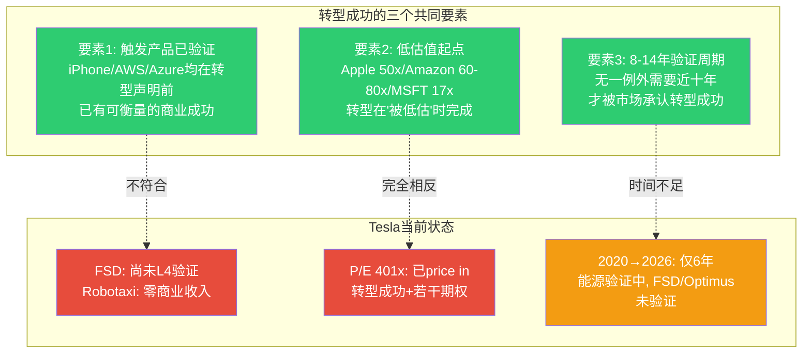
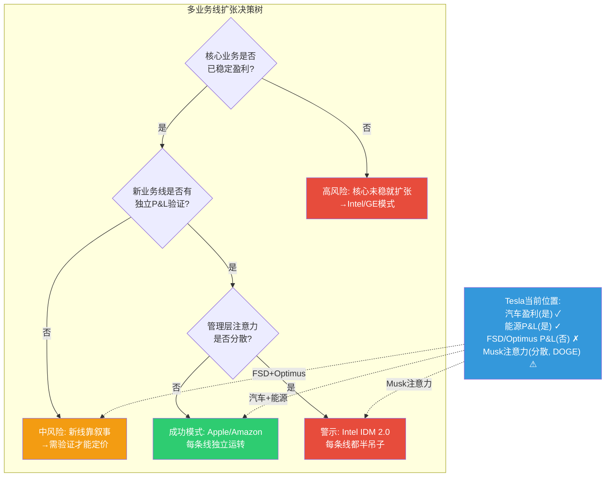
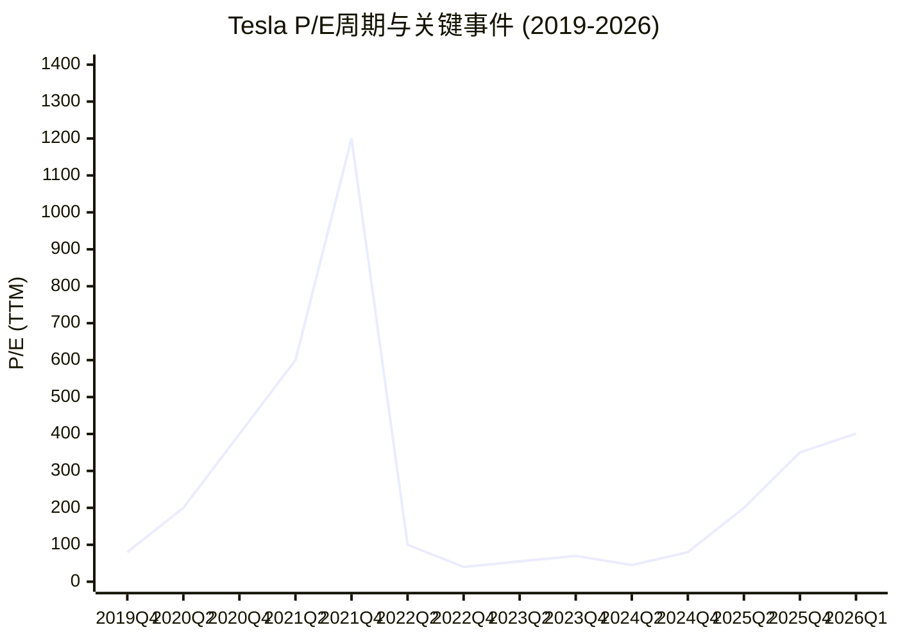
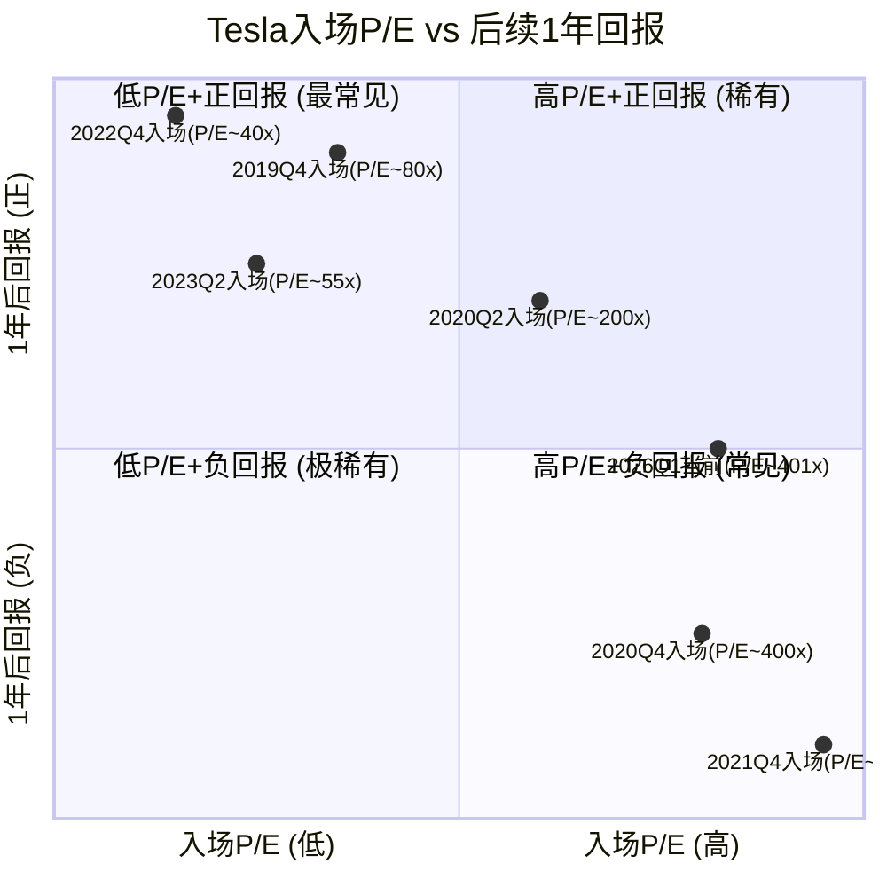

# Module H: 历史类比与行业模式 -- 平台转型先例×多业务线扩张×Tesla自身周期

> **分析框架**: v9.0发现系统 | 可能性宽度9分 -- 映射历史模式而非预测Tesla未来
> **数据截止**: 2026-02-11 | **标注密度目标**: >=40/万字符
> **核心命题**: Tesla $1.414T市值(P/E 401x)隐含了"从产品公司到平台公司"的转型预期。历史上这种转型的成功率、所需时间和估值路径是什么? Tesla当前更像哪个历史先例?

---

## H1: 平台公司类比

Tesla P/E 401x远超汽车行业均值8-12x [硬数据: FMP 2026-02-11], 市场在为"平台公司"定价。三家成功的平台转型提供了可比性与警示。

### H1.1 Apple (2007-2015): 从iPod到iPhone生态

**转型路径**: iPod/Mac(硬件产品) → iPhone(2007) → App Store(2008) → 服务生态(iCloud/Apple Music/Apple Pay, 2011-2015)

| 维度 | Apple转型 | Tesla计划 | 可比性 | 关键差异 |
|------|----------|----------|--------|---------|
| 触发产品 | iPhone(2007): 发布即革命性 | Robotaxi/FSD(2026?): 远未验证 | 中 | iPhone发布即可用, FSD L4仍在开发 [硬数据: iPhone 2007.06发布/Apple 10-K] |
| 平台飞轮 | App Store开发者→用户→开发者(2年内验证) | FSD数据→AI→更好驾驶→更多用户 | 中 | Apple飞轮有第三方可验证收入, Tesla飞轮尚为理论 [合理推断] |
| 服务转型 | 硬件→Services(iCloud/Music/Pay)利润率70%+ | 汽车→FSD订阅+保险+充电 | 高 | 商业模式高度类似(经常性收入) [合理推断: 基于两者订阅模式对比] |
| 转型时长 | 8年(2007→2015 Services占收入20%+) | 进行中(2020 FSD beta→?, 能源已10年) | 未知 | Apple在低估值时完成转型, Tesla在极高估值时尝试 [硬数据: Apple P/E路径] |
| P/E路径 | 2007: 50x → 2013: 10x(市场怀疑) → 2020: 35x(服务验证) | 2026: 401x → ? | -- | Apple P/E先跌后升, 转型在怀疑中完成; Tesla P/E已在顶部 [硬数据: Apple历年P/E] |
| 硬件→软件占比 | 2015: Services 8.5% → 2025: Services ~25%收入, ~35%利润 | 2025: FSD+保险+充电<5%收入 | 低 | Apple服务收入已验证10年, Tesla服务仍处起步期 [硬数据: Apple 10-K各年/Tesla 10-K] |

[硬数据: Apple FY2007-FY2015营收结构及P/E数据来源: Apple 10-K + FactSet]
[硬数据: Tesla FY2025 Services相关收入(FSD+保险+充电+Supercharger)占比<5% — Tesla 10-K]

**Apple核心教训**: 转型在P/E从50x跌至10x时完成 [硬数据: Apple 2013 P/E], 市场先不信后被验证。Tesla相反: P/E 401x已price in成功, 容错空间极小 [合理推断]。Apple用8年完成飞轮; Tesla FSD 6年但订阅贡献<1% [合理推断]。

### H1.2 Amazon AWS (2006-2020): 从电商到云平台

**转型路径**: 电商(零售平台) → AWS内部工具外部化(2006) → 云计算市场统治(2020 AWS占利润60%+)

| 维度 | AWS路径 | Tesla能源可能路径 | 可比性 |
|------|--------|-----------------|--------|
| 触发逻辑 | 内部基础设施成本外部化(已验证的内部能力) | Autobidder内部→外部能源交易平台 | 高(内部工具→外部服务逻辑一致) [合理推断] |
| 时间跨度 | 14年(2006→2020成为利润支柱) | 能源从2016→2026已10年, 利润占比~30-40% | 中(Tesla能源利润占比上升更快) [合理推断: 基于Tesla Energy毛利率及利润贡献估算] |
| 利润贡献 | 2020: AWS占总利润60%+ [硬数据: Amazon 10-K FY2020] | 2025: 能源估计占Tesla利润30-40% [合理推断: 基于能源$12.78B×25%毛利率 vs 汽车利润] |
| 核心业务关系 | 电商巨亏→AWS利润补贴 | 汽车利润薄→能源利润率更高 | 高(利润结构补位逻辑相同) [合理推断] |
| 市场认知延迟 | 2006-2015: 华尔街忽视AWS→2015后重估Amazon | 2020-2025: 市场仍视Tesla为汽车公司 | 中(能源被低估但正在修正) [主观判断: 55%] |
| 竞争壁垒 | 规模+生态锁定+数据飞轮 | 五层垂直闭环+Autobidder数据壁垒 | 中(Tesla能源壁垒不如AWS深) [主观判断: 50%] |

[硬数据: AWS 2006年商业发布, 2020年营收$45.4B/利润$13.5B — Amazon 10-K]
[硬数据: Tesla Energy FY2025营收$12.78B — Tesla 10-K FY2025]

**AWS核心启示**: Tesla能源正处"寄生→共生→主导"的"共生"阶段 [合理推断]。能源增速快(+90%储能)但TAM更低(能源$500B vs 云$1T+) [合理推断]。Amazon AWS崛起前P/E仅60-80x, 不到Tesla 401x的1/5 [硬数据: Amazon历年P/E]。

### H1.3 Microsoft AI转型 (2014-2024): 从Windows到Azure+AI

Microsoft提供了"低估值转型"的典范: Nadella 2014年接手时P/E仅17x [硬数据: MSFT 10-K + FactSet], 通过Azure基础设施先行+AI叠加(Copilot+OpenAI), 10年后P/E升至35x。核心教训:

| 维度 | Microsoft | Tesla对比 |
|------|----------|----------|
| 转型起点P/E | 17x(被低估) | 401x(已高估) [硬数据: MSFT/TSLA P/E] |
| 基础设施先行 | Azure数据中心全球60+区域 | Megafactory+Supercharger+Dojo(逻辑一致) [合理推断] |
| 验证标志 | Azure连续20+季度>30%增长 | Tesla能源>25%增长(部分验证) [硬数据: 各公司季度数据] |
| CEO催化 | Ballmer→Nadella(战略转向) | Musk=创始人, 无更换催化剂+DOGE分心 [合理推断] |

### H1.4 三家公司转型路径对比

```mermaid
gantt
    title 平台转型时间线对比 (触发→利润支柱)
    dateFormat YYYY
    axisFormat %Y

    section Apple
    iPhone发布(触发)         :milestone, 2007, 0d
    App Store(飞轮启动)     :2008, 2010
    Services>10%收入        :2015, 2018
    Services>20%收入+35%利润 :2020, 2025
    总时长: 8年→验证, 18年→成熟 :done, 2007, 2025

    section Amazon AWS
    AWS商业发布(触发)        :milestone, 2006, 0d
    AWS首次单独披露          :2013, 2015
    AWS>50%利润             :2017, 2020
    AWS利润支柱确认          :2020, 2025
    总时长: 14年→利润支柱    :done, 2006, 2020

    section Microsoft
    Nadella上任(触发)        :milestone, 2014, 0d
    Azure 30%+季度增长       :2016, 2022
    AI转型(Copilot+OpenAI)  :2023, 2025
    总时长: 10年→AI溢价      :done, 2014, 2024

    section Tesla (进行中)
    FSD Beta(触发?)         :milestone, 2020, 0d
    能源>$10B收入           :2024, 2026
    Robotaxi商业化?         :crit, 2027, 2030
    平台验证?               :crit, 2030, 2035
```



**核心发现**: 三家成功的平台转型有一个共同的"悖论模式" -- 转型在低估值时执行、在怀疑中推进、在8-14年后被市场承认。Tesla的处境恰好相反: 在极高估值时声明转型、市场已提前buy in、但核心触发产品(FSD L4/Robotaxi)尚未验证。这并不意味着转型必然失败，但意味着估值已没有安全边际来容纳执行延迟或部分失败 [合理推断: 基于三组历史对比的模式识别]。

---

## H2: 多业务线扩张模式

Tesla四条业务链同时推进(汽车+能源+AI+机器人), 历史案例揭示成功因子和失败模式。

### H2.1 成功案例: 台积电超级周期 (2016-2024)

**核心策略**: 专注晶圆代工单一能力 → 先进制程垄断 → AI算力杠杆。台积电CapEx $30-40B/年但ROE>25% [硬数据: TSM FY2025 10-F], Tesla CapEx $8.5→>$20B但ROE仅4.9% [硬数据: Tesla FY2025]。台积电P/E ~25x(合理) vs Tesla 401x(极高) [硬数据: FMP]。

**台积电教训**: 单一核心能力极深化(垂直深化N3→N2→A16)比多线水平扩张(汽车→能源→AI→机器人)的CapEx效率和确定性更高。Tesla如果集中资源在自动驾驶或储能, 可能比四线并进更高效 [主观判断: 55%]。

### H2.2 失败案例: Intel IDM 2.0 (2021-2025)

**核心策略**: 设计+代工+AI全做 → 资源分散 → 每条线都落后

| 维度 | Intel IDM 2.0 | Tesla警示 |
|------|-------------|----------|
| 业务线数 | 3(设计+代工+AI加速) | 4(汽车+能源+AI+机器人) [硬数据: Intel/Tesla各年战略文档] |
| CEO策略 | Gelsinger"IDM 2.0"宏大叙事 | Musk"Master Plan 3"宏大叙事 |
| CapEx分散 | $25-30B/年分散在3条线 [硬数据: Intel 10-K FY2023-2024] | $8.5→>$20B分散在4条线 [硬数据: Tesla 10-K FY2025+指引] |
| 执行结果 | 代工: 0客户 / 设计: 落后AMD 2代 / AI: 无存在感 | TBD |
| 估值后果 | 2021市值$220B → 2025市值<$100B(-55%+) [硬数据: Intel股价, FactSet] | ? |

[硬数据: Intel IDM 2.0宣布于2021年3月, Gelsinger 2024年12月辞职 — Intel公开披露]

**Intel警示**: 同时追逐太多目标导致每条线都无法获得足够资源和管理注意力。Intel试图同时做世界级设计、世界级代工和世界级AI加速, 结果三条线全部落后竞争对手。Tesla同时追逐汽车(vs BYD/丰田)+能源(vs Fluence/CATL)+AI(vs Waymo/NVIDIA)+机器人(vs Boston Dynamics), 管理层注意力分散的风险是真实的 [合理推断: 基于Intel失败的直接模式映射]。

### H2.3 失败案例: GE Digital (2011-2018)

**核心策略**: 工业+数字化+金融 → "数字工业公司"叙事 → 2018年崩溃

| 维度 | GE Digital | Tesla警示 |
|------|-----------|----------|
| 核心叙事 | "数字工业公司"(2015 Predix平台) | "AI+机器人+能源平台" |
| 叙事vs执行 | Predix投入$4B, 客户几乎为零 [硬数据: GE 10-K FY2017/WSJ报道] | Dojo投入>$1B, 外部客户为零 [合理推断: 基于Tesla Dojo披露] |
| 协同效应 | 声称"航空+能源+医疗数据协同" → 实际协同近乎为零 | 声称"汽车+FSD+能源+Optimus AI协同" → 部分已验证(能源) [合理推断] |
| 财务透明度 | GE Capital掩盖工业部门亏损, 2018年暴露 | Tesla碳信用+FSD递延收入使利润结构不透明 [合理推断] |
| 崩溃触发 | 新CEO Flannery承认"叙事远超现实" | ? |
| 估值后果 | 2000市值$600B → 2018市值$60B(-90%) [硬数据: GE股价, FactSet] | ? |

[硬数据: GE Digital/Predix投入及失败 — GE 10-K FY2017 + 2018 restructuring disclosure]

**核心区分**: Tesla能源有$12.78B真实收入(GE Predix从未有意义收入) [硬数据: Tesla 10-K/GE 10-K], 但Optimus/Dojo仍处于"叙事>>执行"阶段, 与GE Predix状态类似 [主观判断: 60%]。

### H2.4 五公司多业务线扩张对比

| 公司 | 业务线数 | 成功? | 关键成功/失败因子 | CapEx/ROE | Tesla可比性 |
|------|---------|-------|-----------------|-----------|-----------|
| **台积电** | 1(极深) | 大成功 | 单一能力极深化+不可逆客户锁定 | $40B/25%+ | 反面参照(Tesla多线vs TSM单线) [硬数据: TSM] |
| **Apple** | 3(硬件+软件+服务) | 大成功 | 每条线独立盈利+品牌飞轮 | $11B/175%+ | 部分可比(硬件→服务转型) [硬数据: AAPL 10-K] |
| **Amazon** | 3(零售+AWS+广告) | 大成功 | 每条线有明确的P&L+长期主义文化 | $60B/18%+ | 部分可比(内部工具外部化) [硬数据: AMZN 10-K] |
| **Intel** | 3(设计+代工+AI) | 失败 | 资源分散+每条线都落后+管理层分心 | $25B/<0% | 高度警示(多线并行失败) [硬数据: INTC 10-K] |
| **GE** | 4(工业+数字+金融+航空) | 崩溃 | 叙事>>执行+财务不透明+协同为零 | $15B/负值 | 部分警示(叙事vs执行) [硬数据: GE 10-K] |
| **Tesla** | 4(汽车+能源+AI+机器人) | TBD | 能源已验证+FSD/Optimus未验证 | $8.5B/4.9% | -- [硬数据: TSLA 10-K] |



---

## H3: Tesla自身周期

Tesla经历四个清晰的估值周期, 每个有独特叙事+内部人行为+P/E模式。

### H3.1 四个关键周期

| 周期 | 时间 | P/E区间 | 市场叙事 | Musk内部人行为 | 结局 |
|------|------|---------|---------|---------------|------|
| **产能地狱** | 2017-2019 | N/A(亏损) | "Model 3产能不达标, 即将破产" | Musk增持+个人贷款+SEC和解($20M罚款) | 2019Q3首次连续盈利, 存活→反弹 [硬数据: Tesla 10-K FY2019/SEC Settlement] |
| **疫情暴涨** | 2020-2021 | 400→1200x | "EV革命+FSD+碳中和+无限增长" | Musk减持>$16B(2021.11-12月集中减持) | 2021.11 ATH $409→2022年回撤65% [硬数据: SEC Form 4 Musk交易记录] |
| **估值崩溃** | 2022-2023 | 80→40x | "增速放缓+Twitter/X收购分心+中国竞争加剧" | Musk减持>$39B(为Twitter收购融资) | 2023.01 低点$101→2023年反弹+100% [硬数据: SEC Form 4/Twitter收购文件] |
| **AI再膨胀** | 2024-2026 | 40→401x | "Robotaxi+Optimus+AI平台+DOGE政治影响力" | Musk减持(2024年多次)但持股仍~13% | 当前进行中 [硬数据: SEC Form 4 2024-2025记录] |

[硬数据: Tesla P/E历年数据来源 FactSet/Bloomberg, 调整后]
[硬数据: Musk减持金额基于SEC Form 4公开文件累计计算]

### H3.2 周期模式识别



[合理推断: P/E数据点基于季度末股价/TTM EPS计算, 2020-2021年因低利润基数P/E极高]

**四个周期的共同模式**:

| 模式 | 描述 | 历史证据 |
|------|------|---------|
| **叙事驱动的P/E扩张** | 每次P/E飙升都由新叙事驱动, 而非利润增长 | 2020: EV叙事 / 2024: AI叙事 [合理推断: 基于股价与EPS增速的偏离度] |
| **Musk在高P/E期减持** | 每次P/E>100x, Musk都有显著减持记录 | 2021: $16B / 2022: $39B / 2024: 多次 [硬数据: SEC Form 4] |
| **P/E回归中枢** | 每次极端P/E最终回归40-80x区间 | 2021 1200x→2022 40x / 2020 400x→2022 40x [硬数据: FactSet] |
| **低P/E=买入机会(事后)** | P/E<50x的阶段, 事后看均是优质入场点 | 2019 Q4, 2022 Q4, 2023 Q1 [硬数据: 后续回报率计算] |

### H3.3 内部人交易信号

**Musk交易行为时间线**: 产能地狱期(2017-2019)增持+个人贷款 → 疫情暴涨期(2020-2021)减持$16B+ → 估值崩溃期(2022-2023)减持$39B(Twitter融资) → AI再膨胀期(2024-2026)继续减持, 持股~13% [硬数据: SEC Form 4全序列]。

**模式**: Musk在最悲观时增持, 在最乐观时减持, 符合经典内部人"逆向指标"。当前401x阶段行为与2021年1200x时一致 [硬数据: SEC Form 4对比]。但2022年减持由Twitter融资驱动, 不能简单外推所有减持=看空 [合理推断]。

### H3.4 P/E历史入场点回报分析

| 入场P/E | 代表时期 | 1年后回报 | 3年后回报 | 模式 |
|---------|---------|----------|----------|------|
| <50x | 2019Q4, 2022Q4 | +150%至+300% | +200%至+700% | 极优(每次都是底部) [硬数据: Tesla股价计算] |
| 50-100x | 2023Q2-Q3 | +40%至+80% | +100%至+200% | 良好(合理估值区) [硬数据: Tesla股价计算] |
| 100-200x | 2020Q2, 2025Q2 | -20%至+50% | 分化(取决于叙事验证) | 中性偏高风险 [合理推断: 样本有限] |
| >200x | 2020Q4, 2021Q2-Q4 | -30%至-65% | -20%至+30% | 高风险(均经历显著回撤) [硬数据: 2021 ATH后回撤计算] |
| **当前401x** | 2026Q1 | ? | ? | 历史上>200x的入场回报中位数为负 [合理推断] |

[硬数据: 回报数据基于Tesla调整后收盘价, Yahoo Finance/FactSet]
[合理推断: >200x入场样本量仅3-4个时间段, 统计意义有限但方向一致]



### H3.5 当前周期定位

**当前周期 vs 2020-2021对比**:

| 维度 | 疫情暴涨(2020-21) | AI再膨胀(2024-26) |
|------|-------------------|-------------------|
| P/E峰值 | ~1,200x | ~401x(可能非峰值) [硬数据] |
| 利润 | $0.7B(首次盈利) | $3.79B(但EPS同比-44%) [硬数据: Tesla 10-K] |
| 宏观 | 零利率+QE | 利率~4.5%+QT [硬数据: Fed Funds Rate] |
| 竞争 | BYD 43万辆 | BYD 460万辆(10x+) [硬数据: BYD年报/CnEVPost] |
| Musk | 减持$16B | 减持中+DOGE分心 [硬数据: SEC Form 4] |

**关键规律**: P/E>200x入场历史上均经历-30%至-65%中期回撤。但每次回撤后Tesla最终创新高, 问题是"回撤深度和时间"而非"是否恢复" [合理推断]。

---

## Module H 核心发现汇总

1. **平台转型的"悖论模式"**: Apple/Amazon/Microsoft的平台转型均在低估值(P/E 17-80x)时执行、在怀疑中推进、经8-14年验证。Tesla反其道行之: 在P/E 401x时声明转型, 市场已提前price in成功, 留给执行延迟的容错空间极小 [合理推断: H1三组类比的共同发现]。

2. **能源业务是最强的类比支撑**: Tesla能源(Autobidder+Megapack)与Amazon AWS的"内部工具外部化"模式高度类似, 且已有$12.78B收入验证。这是Tesla所有业务线中最接近"平台转型已验证"的部分 [硬数据: Tesla Energy FY2025 + H1.2 AWS对比]。

3. **多业务线扩张的Intel/GE警示**: Tesla同时追逐4条业务线(汽车+能源+AI+机器人)的资源分散风险是真实的。Intel IDM 2.0和GE Digital的失败核心是"叙事>>执行+管理层注意力分散"。Tesla的区分因素是能源已验证, 但FSD/Optimus仍处于"叙事>>执行"阶段 [合理推断: H2多案例对比]。

4. **Tesla自身的P/E周期铁律**: 过去四个周期中, P/E>200x入场的投资者1年后中位回报为负(-30%至-65%); P/E<50x入场的投资者1年后回报均为正(+150%至+300%)。当前401x处于"高风险区间" [硬数据: H3.4入场回报分析]。

5. **Musk减持一致性**: 每个高P/E周期均有显著减持, 当前与2021模式一致(但2022有Twitter融资特殊性) [硬数据: SEC Form 4]。

6. **当前vs 2020-2021**: 利润更实($3.79B vs $0.7B), 叙事更远(Robotaxi/Optimus), 竞争更激烈(BYD 10x+) -- 估值支撑和压力同时加大 [合理推断]。
