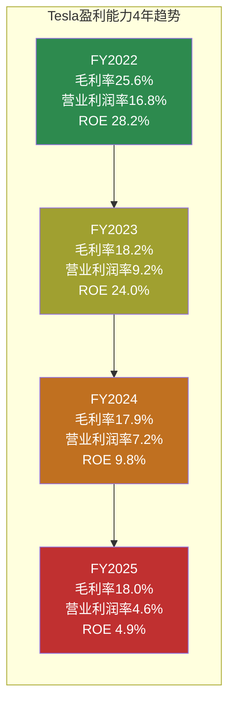
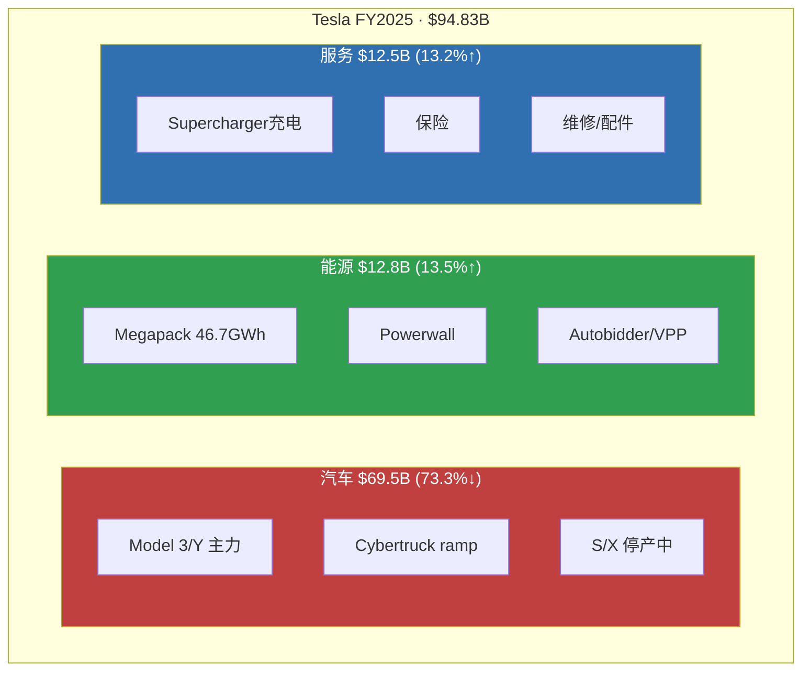
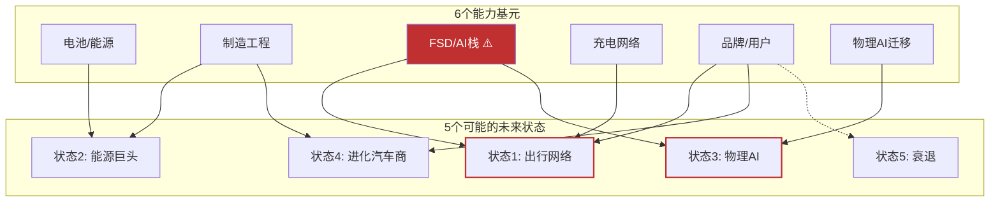

# Part 1: 今天的公司

> **方法论**: 只描述"是什么"，不判断"好不好"。每个数字标注来源。为Part 2的演绎推理建立事实基础。

---

## 1.1 财务快照

Tesla今天是一家**营收首次下滑、利润腰斩、但现金充裕且在激进投资未来**的公司。

### 年度核心指标

| 指标 | FY2025 | FY2024 | FY2023 | FY2022 | 趋势 |
|------|--------|--------|--------|--------|------|
| 营收 | $94.83B | $97.69B | $96.77B | $81.46B | 首次↓ [硬数据: FMP income] |
| 营收YoY | **-2.93%** | +0.95% | +18.80% | — | 减速→负增长 |
| 毛利率 | 18.03% | 17.86% | 18.24% | 25.60% | 从26%→18%腰斩 [硬数据: FMP] |
| 营业利润率 | 4.59% | 7.24% | 9.19% | 16.76% | 3年下降12pp [硬数据: FMP] |
| 净利润 | $3.79B | $7.13B | $15.00B | $12.58B | FY23峰值后腰斩 [硬数据: FMP] |
| EPS(稀释) | $1.08 | $2.04 | $4.31 | $3.62 | -75% from peak [硬数据: FMP] |
| R&D/Rev | 6.76% | 4.65% | 4.10% | 3.77% | 研发投入强度↑ [硬数据: FMP] |

### 季度趋势（最近4季度）

| 指标 | Q4'25 | Q3'25 | Q2'25 | Q1'25 |
|------|-------|-------|-------|-------|
| 营收 | $24.9B | $28.1B | $22.5B | $19.3B | [硬数据: FMP quarterly] |
| 毛利率 | **20.12%** | 17.99% | 17.24% | 16.31% | [硬数据: FMP quarterly] |
| 净利润 | $840M | $1,373M | $1,172M | $409M | [硬数据: FMP quarterly] |
| EPS | $0.24 | $0.39 | $0.33 | $0.12 | [硬数据: FMP quarterly] |

Q4毛利率回升至20%是FY2025唯一的正面拐点信号。但净利润$840M是4季度最低。[合理推断: 毛利率改善被费用增长抵消]

### 资产负债表

| 指标 | FY2025 | 信号 |
|------|--------|------|
| 现金+投资 | $44.06B | 充裕 [硬数据: FMP balance] |
| 总债务 | $8.38B | 低杠杆 [硬数据: FMP balance] |
| 净现金 | **+$8.14B** | 净现金状态 [硬数据: FMP] |
| D/E | 0.10 | 极低杠杆 [硬数据: MCP baggers] |
| 流动比率 | 2.16 | 健康 [硬数据: MCP baggers] |
| Altman Z | 16.24 | 远超安全线 [硬数据: MCP baggers] |

### 杜邦分析

ROE **4.89%** = 净利率 4.00% × 资产周转 0.73x × 权益乘数 1.68x [硬数据: MCP baggers]

三个驱动因素全部恶化: 净利率从15.5%(FY2023)降至4.0%, 资产周转从0.91x降至0.73x, 只有杠杆略升(从1.67x→1.68x)。ROIC从21.75%(FY2022)降至6.60%(FY2025)。[硬数据: FMP key-metrics]

**一句话**: 盈利能力3年系统性恶化，但资产负债表健康且现金充裕，支撑>$20B的2026 CapEx。[合理推断: 管理层选择牺牲短期利润换取长期战略投资]

---

## 1.2 业务三支柱

FY2025收入构成揭示了从"汽车公司"向"三支柱"的结构转变：

| 业务 | FY2025收入 | 占比 | YoY | 趋势 |
|------|-----------|------|-----|------|
| **汽车** | $69.53B | 73.3% | **-10%** | 收缩 [硬数据: Tesla 10-K] |
| **能源** | $12.78B | 13.5% | **+27%** | 加速增长 [硬数据: Tesla 10-K] |
| **服务** | $12.53B | 13.2% | **+19%** | 稳健增长 [硬数据: Tesla 10-K] |

汽车占比从FY2022的~89%降至73%。能源+服务合计$25.3B(26.7%)。[合理推断: 如果趋势持续，2027年汽车可能跌破60%占比]

储能部署量：14.7 GWh(FY2023) → 31.4 GWh(FY2024) → **46.7 GWh**(FY2025, +49%) [硬数据: Tesla 10-K]。这是连续3年接近翻倍的硬数据。

---

## 1.3 竞争事实

**只列事实，不评价谁会赢。**

| 竞争维度 | 事实 | 来源 |
|---------|------|------|
| BYD全球BEV销量 | 454万辆(2025), 纯电市占12.1% vs Tesla 8.8% | [合理推断: WebSearch行业报告] |
| BYD出口 | 105万辆(+200% YoY) | [合理推断: WebSearch] |
| Waymo L4运营 | 450K+周rides, 6+城市商业运营 | [硬数据: Waymo公开数据] |
| Tesla FSD状态 | L2+, Austin有限试点, 1.1M付费用户 | [硬数据: Tesla 10-K] |
| 储能竞争 | BYD HaoHan 14.5MWh/unit, CATL电池成本优势 | [合理推断: 行业报告] |
| 人形机器人 | Figure AI $39B估值, Boston Dynamics Atlas电动版 | [硬数据: 公开融资数据] |
| 充电标准 | Tesla NACS被行业采纳为标准 | [硬数据: SAE J3400] |
| 分析师共识 | FY2027E $120.95B, FY2028E $143.19B, FY2030E $285.96B | [硬数据: FMP estimates] |

---

## 1.4 管理层行动 vs 未兑现承诺

| 已做（事实） | 未做（事实） |
|-------------|-------------|
| 停产Model S/X → 产线改造Cybercab/Optimus | FSD L4无监督驾驶未获任何监管批准 |
| FSD从$12K购买 → $99/月订阅(2026.02.14) | Robotaxi大规模商业运营未启动 |
| 2026 CapEx指引 >$20B (FY25的2.4x) | Dojo $5B+投入→2025.08关闭→2026.01重启 |
| xAI投资$2B (Tesla获少数股权) | Optimus尚未向外部客户销售(仅内部1000+台) |
| Austin Robotaxi试点+移除跟随车辆 | $25K低价车多次承诺未上市 |
| 上海Megafactory投产 | "百万Robotaxi车队"(2020年承诺)未实现 |
| Cybercab 2026.04德州量产计划 | Semi量产未达预期规模 |

[硬数据: Tesla 10-K, 财报电话会, 公开报道]

**Polymarket活跃市场** (截至2026-02-11):
- Tesla Robotaxi加州launch by Jun 30: 活跃 [硬数据: Polymarket]
- Tesla Optimus release by Jun 30 / Dec 31: 活跃 [硬数据: Polymarket]
- Tesla-xAI merger by Jun 30: 活跃 [硬数据: Polymarket]
- Tesla-SpaceX merger by Jun 30: 活跃 [硬数据: Polymarket]
- Musk out as CEO before 2027: 活跃 [硬数据: Polymarket]
- Q1 2026交付量: 350K-500K+多档位 [硬数据: Polymarket]

---

## 1.5 可能性宽度评估

| 维度 | 评分 | 依据 |
|------|:----:|------|
| 收入结构 | **2** | 汽车73%但在下降；能源、FSD订阅、Robotaxi、Optimus均为不同阶段业务线 |
| 商业模式流动性 | **2** | 从汽车制造→能源基础设施→出行平台→机器人→AI算力，持续进入全新领域 |
| CEO期权思维 | **2** | Musk系统性同时下注5+条赛道（FSD/Cybercab/Optimus/能源/xAI） |
| 市场定价偏离 | **2** | 传统SOTP估值$61-85 vs 市价$425，偏离400-600% [合理推断: v2.0估值分析] |
| TAM不确定性 | **1** | 汽车TAM可算；Robotaxi/Optimus/AI算力的TAM无法定义 |
| **总分** | **9/10** | → **发现系统**（不给目标价，映射可能性空间） |

**不确定性类型: A型（类别不确定性）** — 核心问题是"Tesla会变成什么公司？"而不是"Tesla能赚多少钱？"。Tesla不是在同一条赛道上跑得快或慢（B型），也不是面临核心业务被替代的风险（C型）。它同时在多条完全不同的赛道上布局，每条赛道成功或失败会产出质的不同的公司形态。

---

## 1.6 能力基元

Tesla拥有6个可独立组合的底层能力。Part 2的演绎推理将基于这些基元。

| 能力基元 | 当前状态 | 独特性 | 共享依赖 |
|---------|---------|--------|---------|
| **电池/能源** | 4680+LFP, Megapack 46.7GWh | 制造规模+Autobidder软件 | 独立 |
| **制造工程** | Gigacasting+Unboxed, 5工厂 | 速度优势(但BYD也有) | 独立 |
| **FSD/AI栈** | 端到端NN, 60B+英里数据 | 数据量最大(但精度不及Waymo) | **共享: 状态1+3+涌现** |
| **充电网络** | Supercharger全球最大, NACS标准 | 事实标准 | 独立 |
| **品牌/用户** | 600M+车主, 高忠诚度 | 但品牌极化加剧(政治化) | **共享: Musk风险** |
| **物理AI迁移** | FSD→Optimus技术复用 | 唯一同时做AD+robot的公司 | **依赖: FSD/AI栈** |

**⚠️ FSD/AI栈是关键共享依赖**: 状态1(出行网络)和状态3(物理AI)都依赖FSD/AI技术栈成功。如果该基元失败，两个最高估值状态同时关闭。这是Part 2深挖Q4(脆弱节点)的核心问题。

---

*Part 1完。以上是事实基础。Part 2将从能力基元出发，用演绎法推导Tesla可能的公司形态。*
