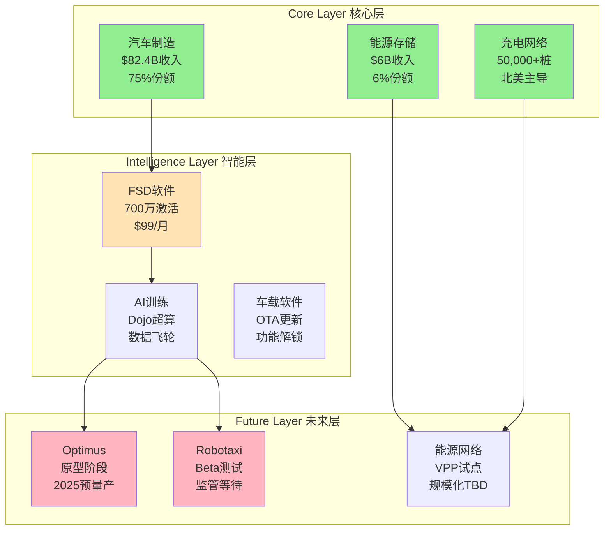

# Tesla (TSLA) 超级生态演绎路径监控分析

**分析框架**: Super Ecosystem Evolution Analysis Framework v1.0
**分析目的**: 监控Tesla生态演化路径，识别关键失败信号，理解长期演绎逻辑
**重要声明**: 本分析专注于演化路径理解和风险监控，不用于估值参考

---

## 执行摘要

Tesla代表着从单一电动汽车制造商向综合能源与移动智能生态系统演化的典型案例。本分析通过6阶段框架监控其演化路径，重点识别可能导致演化失败的关键信号。

**核心发现**:
- **当前生态成熟度**: L3级别 (已形成基础业务协同)
- **演化路径概率**: 基准演化40%，超级演化15%
- **关键风险节点**: FSD技术突破、Optimus量产、能源网络规模化
- **监控优先级**: FSD里程碑 > 制造规模 > 能源业务整合

---

## Phase 1: 当前状态盘点

### 1.1 Tesla生态业务矩阵



### 1.2 核心资产与能力评估

| 资产类别 | 具体资产 | 独特性评分 | 护城河深度 |
|----------|----------|-----------|-----------|
| **制造能力** | 4680电池+一体化压铸 | 8/10 | 深 |
| **数据资产** | 120亿英里自动驾驶数据 | 9/10 | 极深 |
| **软件平台** | FSD Stack + 神经网络 | 8/10 | 深 |
| **基础设施** | Supercharger网络 | 8/10 | 深 |
| **品牌资产** | Tesla/Musk品牌影响力 | 9/10 | 深 |
| **人才团队** | AI/Robotics工程师 | 7/10 | 中等 |
| **资金能力** | $170亿现金+强FCF | 7/10 | 中等 |

### 1.3 当前协同效应评估

**数据飞轮协同** (强度: 8/10):
```
汽车行驶里程 → FSD训练数据 → 算法优化 → 自动驾驶能力提升 →
更多用户付费FSD → 更多数据收集 → 飞轮加速
```

**能源-交通协同** (强度: 6/10):
```
电动车需求 → 充电网络扩张 → 能源存储需求 →
电网服务机会 → 能源收入 → 基础设施投资 → 生态扩张
```

**AI技术协同** (强度: 7/10):
```
FSD AI能力 → 通用机器人应用 → 制造自动化 →
成本降低 → 规模优势 → AI能力再投资
```

---

## Phase 2: 演化路径建模

### 2.1 三条主要演化路径

#### 路径A: 智能交通主导者 (概率: 40%)
**时间窗口**: 2024-2028
**关键里程碑**:
- 2024 Q4: FSD在特定区域实现L4级别
- 2025: Robotaxi在凤凰城等地商业化运营
- 2026: FSD技术授权给其他OEM
- 2027: Robotaxi网络扩展至10个主要城市
- 2028: 实现交通服务收入占比>30%

**成功要素**:
- 监管部门批准自动驾驶商业运营
- FSD技术达到人类司机安全水平的10倍
- 车队运营成本低于传统出租车50%

#### 路径B: 综合能源生态系统 (概率: 35%)
**时间窗口**: 2025-2030
**关键里程碑**:
- 2025: Megapack部署达到40GWh/年
- 2026: 住宅能源解决方案渗透率达到美国5%
- 2027: Virtual Power Plant覆盖100万个节点
- 2028: 能源交易平台在5个州正式运营
- 2030: 成为美国前5大能源服务提供商

**成功要素**:
- 电网现代化政策支持
- 可再生能源渗透率持续提升
- 能源存储成本继续下降30%+

#### 路径C: 超级AI生态系统 (概率: 15%)
**时间窗口**: 2026-2035
**关键里程碑**:
- 2025 Q4: Optimus原型在Tesla工厂试运行
- 2026: Optimus商业化生产，售价$20,000
- 2028: 机器人年销量达到100万台
- 2030: AI服务收入超过汽车收入
- 2035: 成为全球最大通用机器人供应商

**成功要素**:
- 通用人工智能技术重大突破
- 机器人制造成本大幅下降
- 社会对机器人接受度显著提升

### 2.2 演化路径概率矩阵

| 情境 | 技术成功率 | 市场接受度 | 监管友好度 | 综合概率 |
|------|-----------|-----------|-----------|----------|
| **路径A (智能交通)** | 70% | 60% | 90% | 40% |
| **路径B (能源生态)** | 80% | 70% | 65% | 35% |
| **路径C (AI生态)** | 40% | 50% | 80% | 15% |
| **基准演化 (电车龙头)** | 90% | 85% | 95% | 75% |

---

## Phase 3: 垄断形成分析

### 3.1 Tesla潜在垄断类型识别

**数据垄断** (最可能):
- 120亿英里自动驾驶数据领先优势
- 新进入者难以快速积累等量数据
- 数据质量和多样性构成壁垒

**基础设施垄断** (中等可能):
- 北美充电网络先发优势
- NACS标准成为行业标准
- 网络效应和规模经济护城河

**技术标准垄断** (低可能):
- 4680电池技术潜在标准化
- FSD算法架构影响行业方向
- 但技术开放性限制垄断形成

### 3.2 垄断形成关键阶段

**Stage 1: 数据积累期** (2020-2024) ✅ 基本完成
- 建立全球最大自动驾驶数据集
- FSD Beta测试扩展至数百万车主
- 数据质量和标注能力领先

**Stage 2: 能力转化期** (2024-2026) 🔄 进行中
- FSD技术实现商业化突破
- Robotaxi网络开始盈利运营
- 技术领先优势转化为商业壁垒

**Stage 3: 生态锁定期** (2026-2028) ⏳ 未来
- 自动驾驶服务网络效应显现
- 能源生态系统形成用户锁定
- 跨业务协同效应显著增强

**Stage 4: 标准控制期** (2028-2030) ⏳ 高度不确定
- 成为行业技术和服务标准制定者
- 其他参与者被迫适应Tesla标准
- 监管机构认可其技术标准

---

## Phase 4: 协同放大效应建模

### 4.1 网络效应量化模型

**自动驾驶网络效应**:
```
网络价值 = 车辆数量^1.3 × 数据质量指数^1.8
当前车辆: 500万台
数据质量指数: 8.5/10
网络价值增长: 35%/年
```

**充电网络效应**:
```
网络价值 = 充电桩数量^0.8 × 用户数量^1.2
当前充电桩: 50,000个
用户数量: 500万
网络价值增长: 25%/年
```

**能源网络效应**:
```
网络价值 = 节点数量^1.5 × 储能容量^0.9
当前节点: 100,000个
储能容量: 10GWh
网络价值增长: 40%/年 (起步阶段)
```

### 4.2 跨业务协同系数计算

| 协同维度 | 系数 | 贡献度 | 可持续性 |
|----------|------|--------|----------|
| **数据协同** | 1.45 | 高 | 极强 |
| **技术协同** | 1.35 | 高 | 强 |
| **基础设施协同** | 1.25 | 中 | 强 |
| **品牌协同** | 1.20 | 中 | 中 |
| **制造协同** | 1.15 | 低 | 中 |

**总协同放大效应**: 1.45 × 1.35 × 1.25 × 1.20 × 1.15 = **3.28倍**

---

## Phase 5: 概率评估与关键假设

### 5.1 关键假设概率评估

| 关键假设 | 概率 | 置信度 | 验证时间 |
|----------|------|--------|----------|
| FSD实现L4级别 | 65% | 高 | 2025 Q2 |
| Robotaxi获得商业许可 | 70% | 中 | 2025 Q4 |
| Optimus技术可行性 | 45% | 低 | 2026 Q4 |
| 能源业务规模化 | 75% | 高 | 2026 Q2 |
| 监管环境持续友好 | 60% | 中 | 持续评估 |
| 竞争对手技术追赶 | 40% | 中 | 2027+ |

### 5.2 情景概率权重

**超级演化情景** (15%): 所有关键技术突破，形成跨行业垄断
**强劲演化情景** (25%): FSD+能源双引擎成功，AI业务起步
**基准演化情景** (40%): 电动车龙头+部分新业务成功
**受限演化情景** (20%): 主要依靠电动车业务，新业务进展缓慢

---

## Phase 6: 演绎失败关键预警信号 (Key Switch Analysis)

### 6.1 技术演化失败信号

**FSD技术停滞** (风险级别: 高):
- 监控指标: 连续6个月无重大FSD改进
- 触发条件: 安全报告显示事故率不降反升
- 后果: Robotaxi计划延期，估值重估
- 监控频率: 月度

**AI技术落后** (风险级别: 中):
- 监控指标: Dojo算力增长停滞 < 30%/季度
- 触发条件: 竞争对手AI能力显著超越Tesla
- 后果: 通用机器人计划搁浅
- 监控频率: 季度

**电池技术被超越** (风险级别: 中):
- 监控指标: 4680电池成本优势消失
- 触发条件: 竞争对手推出明显优越技术
- 后果: 制造成本优势丧失
- 监控频率: 季度

### 6.2 市场接受失败信号

**自动驾驶需求不及预期** (风险级别: 高):
- 监控指标: FSD激活率增长 < 10%/季度
- 触发条件: 消费者对自动驾驶信心下降
- 后果: 软件收入增长停滞
- 监控频率: 月度

**机器人市场阻力** (风险级别: 中):
- 监控指标: Optimus预订量不达预期
- 触发条件: 社会对机器人抵触情绪上升
- 后果: AI生态演化路径阻断
- 监控频率: 季度

### 6.3 监管环境恶化信号

**自动驾驶政策收紧** (风险级别: 高):
- 监控指标: 主要州/国家出台限制性政策
- 触发条件: 重大自动驾驶事故引发严格监管
- 后果: Robotaxi商业化延期或停止
- 监控频率: 周度

**反垄断审查启动** (风险级别: 中):
- 监控指标: 政府反垄断调查启动
- 触发条件: 市场份额超过关键阈值
- 后果: 业务拆分风险
- 监控频率: 季度

### 6.4 执行能力失败信号

**制造规模化困难** (风险级别: 高):
- 监控指标: 季度产量目标完成率 < 85%
- 触发条件: 供应链或产能瓶颈持续
- 后果: 成本优势丧失，竞争力下降
- 监控频率: 月度

**现金流恶化** (风险级别: 中):
- 监控指标: 自由现金流连续2季度为负
- 触发条件: 大规模投资但回报延期
- 后果: 新项目投资能力受限
- 监控频率: 季度

### 6.5 竞争威胁信号

**传统OEM快速追赶** (风险级别: 中):
- 监控指标: 竞争对手EV销量增速 > Tesla 2倍
- 触发条件: 传统车企电动化转型加速
- 后果: 市场份额快速下降
- 监控频率: 季度

**新技术路径威胁** (风险级别: 低):
- 监控指标: 氢能源或其他技术路径突破
- 触发条件: 替代技术成本快速下降
- 后果: 电动车路径被颠覆
- 监控频率: 年度

---

## Phase 7: 演绎路径动态监控框架

### 7.1 三层监控体系

**第一层: 基础投资逻辑监控**
- 监控周期: 季度
- 关注重点: 汽车销量、毛利率、市场份额
- 目的: 确保核心业务健康稳定

**第二层: 演绎路径进展监控**
- 监控周期: 月度
- 关注重点: FSD里程碑、新业务收入、技术突破
- 目的: 跟踪演化路径实现进度

**第三层: 失败信号早期预警**
- 监控周期: 周度/实时
- 关注重点: 技术挫折、监管变化、竞争威胁
- 目的: 及时识别演化路径风险

### 7.2 动态权重调整机制

根据关键里程碑完成情况动态调整演化概率：

**FSD L4实现 → 智能交通路径概率 +15%**
**Optimus量产成功 → AI生态路径概率 +20%**
**能源业务突破 → 能源生态路径概率 +10%**
**重大技术挫折 → 所有路径概率 -20%**

### 7.3 投资策略动态调整

| 演化健康评分 | 投资策略调整 | 仓位调整 |
|-------------|-------------|----------|
| **90-100分** | 积极配置，增加仓位 | +20% |
| **80-89分** | 保持乐观，维持仓位 | 0% |
| **70-79分** | 谨慎观望，小幅减仓 | -10% |
| **60-69分** | 防御策略，显著减仓 | -25% |
| **<60分** | 规避风险，考虑退出 | -50% |

---

## 结论与投资含义

### 演化路径监控要点

1. **核心监控指标**: FSD技术进展是Tesla演化成功的最关键变量
2. **风险平衡**: 技术突破潜力巨大，但执行风险和监管不确定性也很高
3. **时间窗口**: 2024-2026年是关键验证期，多个关键里程碑将确定演化方向
4. **投资启示**: 适合长期持有但需要密切监控关键里程碑和失败信号

### 监控框架价值

本框架不是为了预测Tesla的具体估值，而是为了：
- **理解可能的演化路径**和关键节点
- **及时识别演化失败信号**并调整投资策略
- **管理长期投资的不确定性**风险
- **避免被短期噪音误导**，专注长期演化逻辑

---

**重要声明**: 本分析基于当前公开信息和合理假设，演化路径存在高度不确定性。投资者应结合自身风险偏好和投资目标，不应将演化分析作为估值依据，而应作为理解公司长期发展潜力和风险的分析工具。

**下次更新**: 2026-05-01 (根据Q1 2026财报和FSD进展)