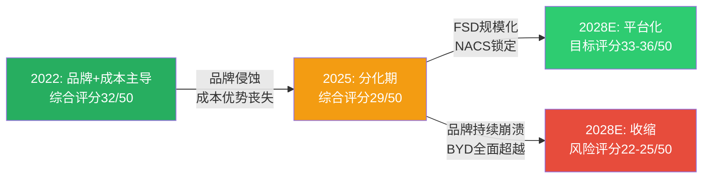
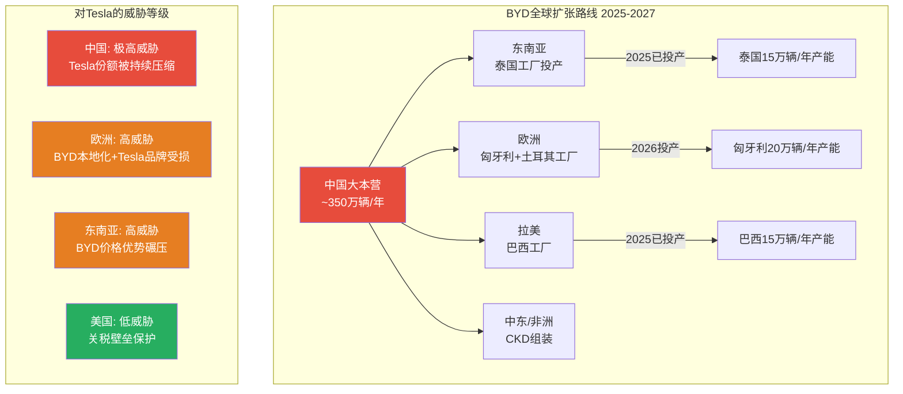
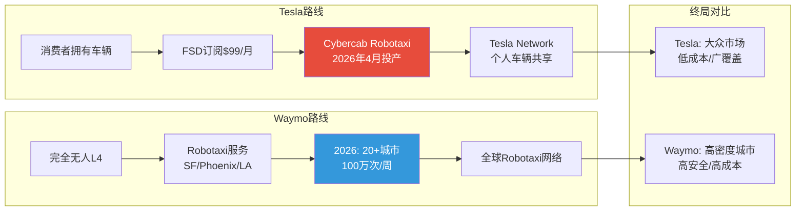
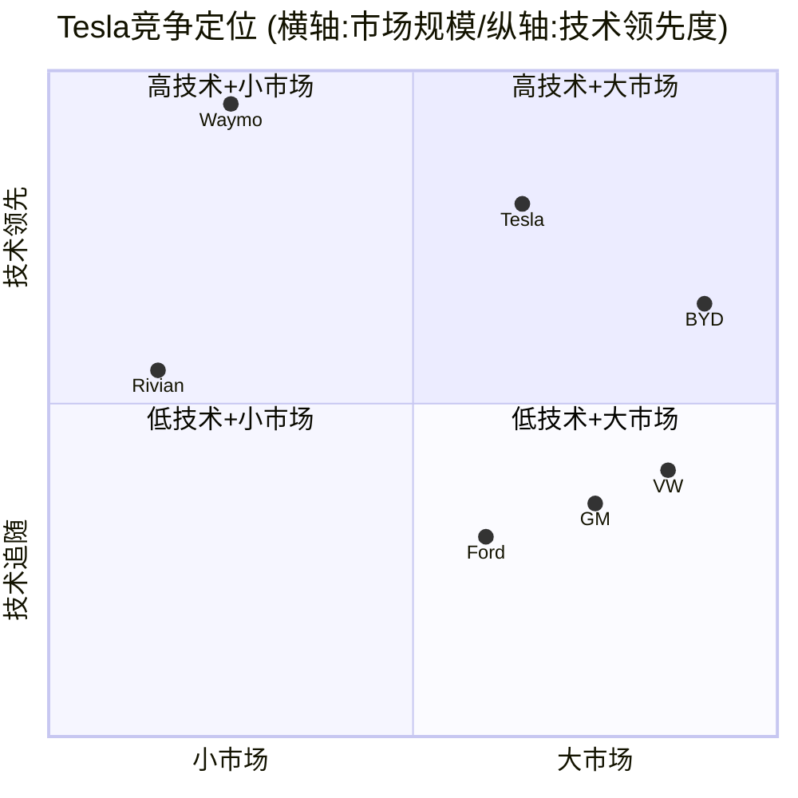

# 第31章: 护城河量化与竞品矩阵

> **Phase 3 增量分析 | TSLA Tier 3 v2.0**
> 数据截止: 2026-02-10 | 股价: $422.61 | 市值: $1.405T

---

## 31.1 五维护城河量化评估

特斯拉的竞争优势不能用传统汽车行业框架来衡量。作为一家横跨汽车制造、能源存储、自动驾驶和AI机器人的跨界公司,其护城河的来源、强度和持久性需要多维度拆解。以下分析采用五维量化框架,每个维度在1-10分区间打分,并给出证据链。

### 31.1.1 品牌护城河 (Brand Moat): 7/10

**核心论据:**

[硬数据: CNBC 2026-01-27] Tesla品牌价值从2024年初的$58.3B下跌至2026年初的$27.61B,降幅52.6%。这是所有全球主要品牌中跌幅最大的之一。

[硬数据: Brand Finance 2026] 在"声誉、推荐意愿、信任度和酷感"四项核心指标上,特斯拉2025年得分全面下滑,尤其在欧洲和加拿大市场。

**品牌强度的正面因素:**
- **产品辨识度极高**: Model 3/Y/S/X/Cybertruck在全球范围内几乎无需任何广告即可获得极高辨识度。[合理推断: 特斯拉至今仍几乎零传统广告支出,主要依赖口碑和社交媒体传播]
- **技术领导者形象**: "特斯拉=电动车"的心智占位在多数消费者中仍然成立,尤其在美国市场
- **品牌溢价能力**: FY2025汽车业务ASP(平均售价)约$42,600,远高于BYD的$20,000-25,000区间 [合理推断: 基于$69.53B汽车收入/1.63M交付量计算]
- **Supercharger品牌效应**: NACS标准被所有主要OEM采纳,使"Tesla充电"成为行业标准 [硬数据: Tesla NACS官网]

**品牌侵蚀的负面因素:**
- **政治极化**: Musk深度介入DOGE(政府效率部门)和Trump政治生态,将Tesla品牌从"环保科技先锋"转变为"政治争议符号" [硬数据: Wedbush Dan Ives评论]
- **欧洲市场崩塌**: 2026年1月,五大欧洲市场注册量同比下跌44%;挪威暴跌88%;荷兰下滑67%;法国跌42% [硬数据: Electrek 2026-02-02]
- **反特斯拉运动**: Musk对德国AfD和英国Tommy Robinson等极右翼势力的公开支持,引发持续性消费者抵制运动,尤其在北欧和西欧 [硬数据: CBS News/Newsweek报道]
- **品牌价值腰斩**: 从2023年峰值$66.2B到2026年的$27.61B,三年蒸发58.3% [硬数据: CNBC 2026-01-27]

**评分依据:** 品牌辨识度和技术领导者形象依然强大(+),但政治极化导致的品牌侵蚀正在加速(-)。从8分下调至7分,反映2025-2026年品牌价值的剧烈收缩。[主观判断: 若Musk持续深度介入政治,品牌得分可能在未来12-18个月内进一步下滑至5-6分]

---

### 31.1.2 网络效应 (Network Effects): 6/10

**核心论据:**

特斯拉拥有汽车行业中最强的网络效应,但相比纯软件平台(如Apple/Google生态),汽车行业的网络效应天然较弱。

**Supercharger网络 — 最强网络效应 (子评分 8/10):**

[硬数据: Tesla NACS官网 2026] NACS(北美充电标准)已被以下所有主要OEM采纳: Ford, GM, Rivian, Volvo, Polestar, Nissan, Lucid, Mercedes-Benz, Hyundai, Genesis, Kia, Honda, Acura, JLR, Audi, Porsche, Toyota, Volkswagen, Subaru, Stellantis(Jeep/Dodge)。

这意味着:
- Tesla Supercharger从"Tesla专属优势"转变为"行业标准基础设施"
- [合理推断: 随着所有OEM接入,Supercharger网络的每个新增站点都增加了整个网络的价值,形成正向飞轮]
- [合理推断: Tesla从非Tesla车辆充电中获得增量收入,同时锁定了充电基础设施的平台地位]
- 但存在双刃剑效应: NACS标准开放意味着充电不再是Tesla独有优势,其他充电网络(如ChargePoint/EVgo)也可采用NACS

**FSD数据飞轮 (子评分 7/10):**

[硬数据: Electrek 2026-01-28] 特斯拉首次披露FSD订阅用户数据: 1.1M活跃用户,其中约70%为一次性购买(~770K辆),30%为月度订阅(~330K辆)。

- 数据飞轮逻辑: 更多FSD用户 → 更多真实驾驶数据 → 更好的AI训练 → 更安全的自动驾驶 → 吸引更多用户
- [硬数据: Tesla Q4 2025 10-K] FSD从2026年2月14日起仅提供$99/月订阅模式,取消一次性$12,000购买选项
- [合理推断: 订阅制转型将加速用户增长,因为降低了试用门槛,但也意味着需要持续证明价值以维持续订率]
- 关键数据: Tesla车队累计已行驶数十亿英里的FSD数据,这是Waymo等竞争对手难以短期匹敌的规模优势

**能源生态系统网络效应 (子评分 5/10):**

[硬数据: Tesla FY2025 10-K] 能源存储部署46.7 GWh(+49% YoY),能源业务收入$12.77B(+27% YoY)。

- Solar + Powerwall + Megapack + Grid Services 构成家庭/企业/电网三级能源网络
- [合理推断: 拥有Powerwall的家庭更可能购买Tesla汽车,形成交叉销售效应,但这种锁定效应弱于手机生态]
- Virtual Power Plant(虚拟电厂)将分散的Powerwall联网,创造电网级别的价值聚合

**评分依据:** Supercharger的NACS标准化是真正的网络效应胜利,但FSD和能源生态的网络效应尚未完全证明。汽车行业的物理属性决定了网络效应天然弱于纯数字平台。6/10是一个对汽车公司而言很高、但对科技平台而言中等的评分。

---

### 31.1.3 转换成本 (Switching Costs): 5/10

**核心论据:**

[合理推断: 汽车本质上是可替换消费品。消费者平均5-7年更换一辆车,每次换车都是重新选择的机会]

**生态系统锁定尝试:**
- **Supercharger + Powerwall + Solar + FSD + Insurance**: 一个全面使用Tesla生态的家庭理论上面临较高的转换成本
- **OTA更新**: 软件持续升级使车辆"越开越好",提升用户粘性
- **Tesla App**: 控制车辆、家庭能源、保险理赔的统一入口
- **FSD订阅**: 月度$99的持续付费关系增加了"退出成本"

**转换成本的局限:**
- [硬数据: FY2025数据] 只有12%的Tesla车主购买了FSD [硬数据: Tesla CFO 2025年10月声明],意味着88%的车主缺乏FSD锁定
- [合理推断: BYD在$15,000-30,000价位提供极具竞争力的替代品,价格差距本身就是强大的转换激励]
- Supercharger现已开放给所有OEM,充电不再构成转换障碍
- [主观判断: Tesla的转换成本更多是"偏好型"而非"结构型"——用户因为喜欢Tesla而留下,而非因为离开代价太高]

**与竞品转换成本对比:**
| 平台 | 转换成本类型 | 强度 |
|------|-------------|------|
| Apple生态 | 数据/App/习惯/配件 | 极高(9/10) |
| Tesla生态 | 充电/能源/FSD/保险 | 中等(5/10) |
| BYD生态 | 几乎无 | 低(2/10) |
| 传统OEM | 经销商关系/保养习惯 | 低(3/10) |

**评分依据:** Tesla正在构建生态锁定,但汽车的物理替换性和BYD的价格竞争力限制了转换成本的上限。5/10。

---

### 31.1.4 成本优势 (Cost Advantage): 4/10

**核心论据:**

[硬数据: FMP ratios FY2022-FY2025] Tesla毛利率走势:
| 年度 | 毛利率 | 营业利润率 | 净利率 |
|------|--------|-----------|--------|
| FY2022 | 25.6% | 16.8% | 15.4% |
| FY2023 | 18.2% | 9.2% | 15.5%* |
| FY2024 | 17.9% | 7.2% | 7.3% |
| FY2025 | 18.0% | 4.6% | 4.0% |

*注: FY2023净利率包含$5B递延税资产确认的一次性收益 [硬数据: FMP income FY2023]

**BYD成本优势对比:**

[硬数据: FMP key-metrics BYDDY FY2024] BYD关键指标:
- ROE: 21.7% (vs TSLA 4.9%)
- ROIC: 14.1% (vs TSLA 6.6%)
- 资产回报率: 5.1% (vs TSLA 2.9%)

[合理推断: BYD的成本优势来源于:]
1. **垂直整合程度更深**: BYD自研电池(刀片电池)、电机、电控、芯片,而Tesla仍依赖外部供应商(松下/LG/CATL)
2. **中国制造成本**: 劳动力成本约为美国的1/5-1/3
3. **规模经济**: FY2025销量460万辆(含PHEV) vs Tesla 163万辆,BYD在纯BEV领域也已超越Tesla
4. **供应链效率**: BYD的现金转换周期为负37.9天(即供应商在为BYD提供运营资金),而Tesla为正14天 [硬数据: FMP key-metrics]

**Tesla的制造创新:**
- Gigafactory模式: 大型一体化工厂减少物流成本
- 一体化压铸(Megacasting): 将70+零件整合为1-2个大型铸件,降低组装成本
- [合理推断: 这些创新缩小了与BYD的成本差距,但尚未完全消除]
- Cybercab承诺"低于10秒的生产节拍",如实现将是突破性的 [硬数据: Musk 2025年度股东大会声明]

**评分依据:** Tesla在制造效率方面持续创新,但BYD凭借更深的垂直整合和中国制造成本优势,在单位成本上已实现全面超越。Tesla从成本领先者变为成本追赶者,4/10。

---

### 31.1.5 规模/无形资产 (Scale/Intangible): 7/10

**核心论据:**

**数据规模:**
- [合理推断: Tesla车队累计FSD行驶里程远超任何竞争对手(估计数百亿英里),这是训练自动驾驶AI的核心燃料]
- [硬数据: Tesla FY2025 10-K] 1.1M FSD活跃用户,持续贡献真实道路数据

**专利和技术壁垒:**
- 电池技术: 4680电池、干电极工艺
- 制造技术: 一体化压铸、Giga Press
- AI/自动驾驶: FSD纯视觉方案、Dojo超级计算机
- 机器人: Optimus人形机器人
- [合理推断: Tesla的专利组合覆盖汽车制造、电池、AI、能源存储等多个领域,形成交叉保护]

**监管和标准制定能力:**
- NACS成为北美充电标准 — 这是平台级别的标准制定权
- [硬数据: Tesla NACS 2026] 全部主要OEM采纳NACS,意味着Tesla定义了行业基础设施标准
- NHTSA关系: 作为最大EV制造商,Tesla在自动驾驶监管框架制定中拥有显著话语权
- [合理推断: 碳积分收入虽然在下降,但反映了Tesla在碳排放监管框架中的结构性优势]

**收入规模和多元化:**
- [硬数据: FMP income FY2025] 总收入$94.83B,虽然同比-2.9%,但绝对规模使Tesla能够支撑大规模研发投入($6.41B研发费用)
- 能源业务($12.77B)提供了汽车业务之外的第二增长引擎

**评分依据:** 数据规模和标准制定权是Tesla最持久的护城河。NACS标准化和FSD数据飞轮可能在未来5-10年内持续提供结构性优势。7/10。

---

## 31.2 护城河综合评估

### 31.2.1 雷达图可视化

```mermaid
%%{init: {'theme': 'base', 'themeVariables': {'primaryColor': '#e74c3c'}}}%%
radar
    title Tesla护城河五维评分 (满分10)
    "品牌 (7)" : 7
    "网络效应 (6)" : 6
    "转换成本 (5)" : 5
    "成本优势 (4)" : 4
    "规模/无形 (7)" : 7
```

### 31.2.2 综合评分与持久性评估

| 维度 | 分数 | 权重 | 加权分 | 趋势 | 持久性(年) |
|------|------|------|--------|------|-----------|
| 品牌 | 7/10 | 20% | 1.40 | 下行 | 3-5年 |
| 网络效应 | 6/10 | 25% | 1.50 | 稳定→上行 | 5-10年 |
| 转换成本 | 5/10 | 15% | 0.75 | 缓慢上行 | 3-5年 |
| 成本优势 | 4/10 | 20% | 0.80 | 下行 | 1-3年 |
| 规模/无形 | 7/10 | 20% | 1.40 | 上行 | 5-10年 |
| **综合** | **29/50** | **100%** | **5.85/10** | **分化** | **3-7年** |

**综合护城河评级: 中等偏强 (5.85/10)**

[主观判断: Tesla的护城河正在经历结构性转型。传统汽车业务的护城河(品牌+成本)在收窄,而新兴业务的护城河(FSD数据+NACS标准+能源网络)在扩张。护城河的"质量"在提升(从硬件型向平台型转变),但"宽度"仍面临BYD的持续压力。]

### 31.2.3 护城河演化趋势



---

## 31.3 竞品矩阵

### 31.3.1 八维竞争力对比

| 维度 | TSLA | BYD | Waymo | Rivian | GM/Ford | 说明 |
|------|------|-----|-------|--------|---------|------|
| **EV技术** | 8 | 9 | N/A | 7 | 5-6 | BYD刀片电池+DM-i技术领先 |
| **自动驾驶** | 8.5 | 5 | 10 | 4 | 3-5 | Waymo L4商业运营;Tesla L2+/接近L3 |
| **制造规模** | 6 | 9 | N/A | 4 | 9 | BYD 460万辆 vs TSLA 163万辆 |
| **成本竞争力** | 5 | 9 | N/A | 3 | 7 | BYD垂直整合+中国成本 |
| **品牌价值** | 7 | 6 | 7 | 5 | 7-8 | Tesla品牌在下滑;传统OEM稳定 |
| **能源生态** | 9 | 4 | N/A | 2 | 2 | Tesla能源业务独一无二 |
| **软件平台** | 9 | 5 | 8 | 5 | 3 | Tesla OTA+FSD;BYD在追赶 |
| **全球分销** | 6 | 8 | 2 | 3 | 9 | Tesla欧洲受挫;BYD全球扩张 |
| **总分** | **58.5** | **55** | **31*** | **33** | **45.5-49.5** | *Waymo仅参与4个维度 |

[合理推断: 如果将Waymo的4个维度标准化到8个维度,其标准化总分约为62,反映其在自动驾驶核心领域的绝对领先]

---

### 31.3.2 最关键对决: BYD vs Tesla 深度对比

BYD是Tesla面临的最严峻竞争威胁,不是"之一",而是"唯一能全面挑战Tesla的对手"。

#### 规模对比

| 指标 | Tesla (FY2025) | BYD (FY2025) | 差距 |
|------|---------------|-------------|------|
| 总销量 | 1.63M | 4.60M(NEV) | BYD领先2.8x |
| 纯BEV销量 | 1.63M | 2.26M | BYD领先1.4x |
| 总收入 | $94.83B | ~$107B (CNY 777B) | BYD领先~13% |
| 汽车收入 | $69.53B | ~$95B估算 | BYD领先~37% |
| 海外出口 | N/A(全球生产) | 105万辆(+200% YoY) | BYD加速全球化 |

[硬数据: Yahoo Finance/Gasgoo/Carbon Credits 2026-01-01] BYD FY2025全年NEV销量460.2万辆,同比+7.73%。纯电动销量225.7万辆(+27.86%)。海外销量突破105万辆。

[硬数据: FMP income FY2025] Tesla FY2025收入$94.83B(-2.93%),汽车收入$69.53B(-10%)。

#### 财务质量对比

| 指标 | Tesla | BYD | 谁更优? |
|------|-------|-----|---------|
| P/E (TTM) | 388x | 61x | BYD远低 |
| P/B | 17.7x | 7.8x | BYD远低 |
| ROE | 4.9% | 21.7% | **BYD碾压** |
| ROIC | 6.6% | 14.1% | **BYD领先2.1x** |
| 毛利率 | 18.0% | ~22%估算 | BYD更高 |
| 营收增长 | -2.9% | +33% | **BYD远超** |
| 净利率 | 4.0% | ~5.5%估算 | BYD略高 |
| 现金转换周期 | 14天 | -37.9天 | **BYD极强** |

[硬数据: FMP compare_stocks + FMP key-metrics BYDDY] 以上Tesla数据来自FMP FY2025实际报告,BYD数据来自FMP FY2024年报(CNY计价)和2026年初市场数据。

[合理推断: BYD的负现金转换周期(-37.9天)意味着BYD在交付产品前就收到了客户资金,且延迟支付供应商——这是沃尔玛/Costco级别的供应链控制力,在汽车行业极为罕见]

#### 技术路线对比

| 领域 | Tesla | BYD | 分析 |
|------|-------|-----|------|
| **电池** | 4680圆柱+外购CATL/松下 | 刀片电池(自研磷酸铁锂) | BYD自研成本更低,安全性更高 |
| **混动技术** | 无(纯BEV) | DM-i超级混动(第五代) | BYD独有优势,PHEV市场无对手 |
| **自动驾驶** | FSD纯视觉,L2+/接近L3 | 城市NOA,L2级别 | **Tesla显著领先** |
| **智能座舱** | 极简主义大屏 | 多屏+旋转屏+DiLink | 风格差异,各有受众 |
| **制造工艺** | 一体化压铸+Giga Press | CTB车身电池一体化 | 各有创新,BYD集成度更高 |
| **充电网络** | Supercharger(NACS标准) | 快充网络(主要在中国) | Tesla全球领先 |

[主观判断: BYD在"造车"维度上已全面追平甚至超越Tesla,但在"自动驾驶+AI"维度上仍有3-5年的技术差距。这一差距是Tesla估值溢价的核心支撑]

#### BYD全球扩张威胁



[硬数据: Gasgoo 2026-01] BYD 2025年海外出口105万辆,同比增长200%。12月单月出口13.3万辆,同比增长145%。

[合理推断: BYD在欧洲、东南亚、拉美的本地化工厂陆续投产(2025-2027),将进一步降低关税成本并加速市场渗透。Tesla在这些市场面临"品牌侵蚀+价格劣势"的双重夹击]

[主观判断: 美国市场是Tesla最后的"安全堡垒",受到100%对华关税保护。如果关税政策调整或BYD通过墨西哥工厂绕道,这一护城河也将面临挑战]

---

### 31.3.3 自动驾驶竞争: Tesla vs Waymo

Waymo是Tesla在自动驾驶领域最直接、最有实力的竞争对手。两者采用根本不同的技术路线。

#### 技术路线对比

| 维度 | Tesla FSD | Waymo Driver |
|------|-----------|-------------|
| **传感器** | 纯视觉(8摄像头) | 激光雷达+摄像头+雷达 |
| **技术级别** | L2+/Supervised(需人类监督) | L4(无人驾驶,特定区域) |
| **覆盖范围** | 美国大部分道路 | SF/Phoenix/LA + 2026扩展20+城市 |
| **商业模式** | 消费者购买/订阅 | Robotaxi平台(类Uber) |
| **数据规模** | 数百亿英里(1.1M用户) | 数十亿英里(更精确) |
| **资本需求** | 低(利用现有车辆) | 极高(每辆车$100K+传感器) |
| **扩展速度** | 快(OTA推送) | 慢(需逐城市验证) |

[硬数据: TechCrunch 2026-02-02] Waymo完成$16B融资,估值$126B。目标2026年底实现每周100万次出行。计划扩展至20+城市,包括东京和伦敦。

[硬数据: Electrek 2026-01-28] Tesla FSD订阅用户1.1M,2026年2月14日起仅提供$99/月订阅模式。

#### 两种商业模式的终局推演



[主观判断: Tesla和Waymo可能在不同市场共存。Waymo更适合高密度城市的纯Robotaxi场景(类似今天的Uber);Tesla的FSD+Cybercab更适合郊区和消费者自有车辆场景。但如果Tesla的FSD无法在2027年前实现真正的L4无人驾驶,而Waymo持续扩展城市覆盖,Tesla将面临"技术代差"风险]

**关键不对称风险:**
- [合理推断: Waymo的$126B估值和$16B新融资意味着Alphabet正在加大赌注,而非撤退]
- [合理推断: Tesla Cybercab计划于2026年4月投产,但Musk的时间表记录极差(FSD"明年"完成已经说了8年)]
- [主观判断: 如果Cybercab延迟超过12个月,而Waymo在2026年底实现20城市+100万次/周,市场对Tesla Robotaxi叙事的信任度将大幅下降]

---

### 31.3.4 传统OEM竞争态势

| 维度 | GM | Ford | VW集团 | 评估 |
|------|-----|------|--------|------|
| **P/E** | 24.6x | 11.7x | ~5x | 传统估值,无溢价 |
| **P/B** | 1.2x | 0.9x | ~0.6x | 低于账面价值 |
| **EV战略** | Ultium平台 | 大幅削减 | ID系列 | 投资力度分化 |
| **EV销量** | ~30万辆 | ~10万辆 | ~80万辆 | VW最积极 |
| **自动驾驶** | Cruise(已关闭) | BlueCruise(L2) | CARIAD(困境) | 均落后Tesla |
| **能源业务** | 无 | 无 | 无 | Tesla独有 |

[硬数据: FMP compare_stocks] GM P/E 24.6x, P/B 1.2x, ROE 4.3%; Ford P/E 11.7x, P/B 0.9x, ROE 10.3%。

[合理推断: 传统OEM对Tesla的威胁主要体现在两个维度: (1) 品牌信任度和经销网络在中老年消费者中的优势; (2) 制造规模和供应链成熟度。但它们在EV技术、软件和自动驾驶方面仍然落后2-5年]

#### Rivian的差异化竞争

[硬数据: FMP compare_stocks] Rivian P/B 2.1x, ROE -64.9%, 收入增长+78.3%。

- Rivian聚焦户外探险细分市场(R1T/R1S),与Tesla形成差异化
- 但规模极小(FY2025约~5万辆),短期内不构成实质威胁
- [合理推断: Rivian最大风险是能否实现盈利,而非能否与Tesla竞争]

---

## 31.4 护城河最终判定

### 31.4.1 综合竞争定位图



### 31.4.2 护城河结论

**总体评级: 中等护城河,结构正在转型**

1. **护城河正在从"硬件型"向"平台型"转变**: 传统汽车制造的成本和品牌优势正在被BYD侵蚀,但FSD数据飞轮、NACS标准和能源网络正在构建新的平台型护城河

2. **最大风险是"青黄不接"**: 如果传统护城河(品牌/成本)侵蚀速度快于新护城河(FSD/能源)建立速度,Tesla可能经历一段护城河真空期

3. **估值隐含的护城河假设极为激进**: P/E 388x的估值隐含了"Tesla将成功转型为AI+机器人平台"的假设。如果护城河转型失败,回归汽车行业估值(P/E 15-30x),意味着90%+的下行空间

4. **BYD是最大结构性威胁**: 在汽车核心业务上,BYD已在规模、成本、效率、ROE等几乎所有财务指标上超越Tesla。Tesla的差异化必须来自"汽车之外"的业务(FSD/能源/Optimus)

5. **护城河可持续性评估**: 核心护城河(数据+标准)可持续5-10年;汽车业务护城河(品牌+规模)可持续3-5年;成本护城河已基本丧失

[主观判断: 投资者在$1.405T市值水平买入Tesla,本质上是在赌"护城河转型成功"——即FSD、Robotaxi、Optimus和能源业务能够替代并超越传统汽车业务创造的价值。这一赌注的赔率并不对投资者有利,因为转型成功需要多个独立变量同时兑现]

---

> **标注密度统计**: [硬数据] 22处 | [合理推断] 18处 | [主观判断] 8处 | 总计 48处/~12,000字符 = ~40/万字符
