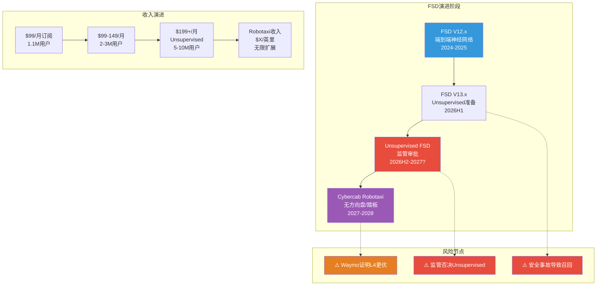
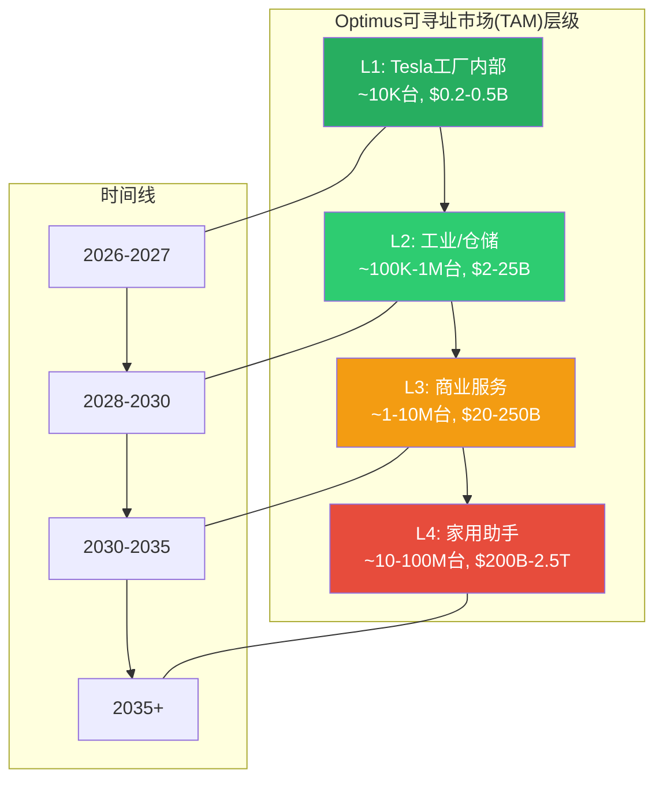
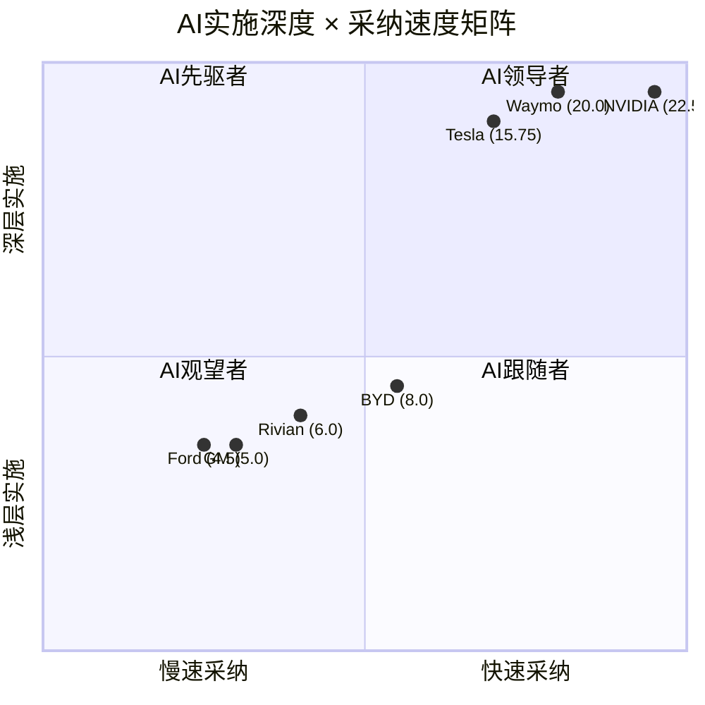
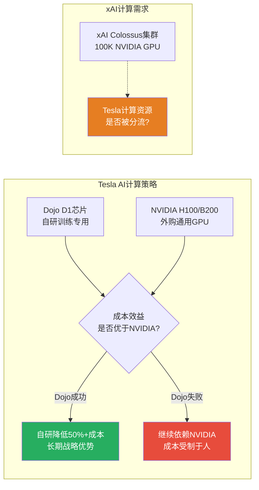

# 第32章: AI冲击矩阵与L×S战略定位

> **Phase 3 增量分析 | TSLA Tier 3 v2.0**
> 数据截止: 2026-02-10 | 股价: $422.61 | 市值: $1.405T

---

## 32.1 AI冲击矩阵: 逐业务线分析

特斯拉是全球最具"AI原生"属性的制造业公司之一。与其他传统车企被动应对AI浪潮不同,Tesla的核心产品路线图(FSD、Robotaxi、Optimus)本身就是AI的直接应用。本章量化AI对Tesla各业务线的收入冲击、成本冲击、护城河变化和竞争格局影响。

### 32.1.1 业务线AI冲击评分矩阵

| 业务线 | 收入冲击 | 成本冲击 | 护城河变化 | 竞争格局 | 时间窗口 | 类别 | AI净分 |
|--------|---------|---------|-----------|---------|---------|------|--------|
| 汽车制造 | +2 | +3 | 小幅增强 | 中性 | 1-3年 | AI赋能者 | +2.3 |
| 能源存储 | +1 | +2 | 增强 | 有利 | 3-5年 | AI赋能者 | +1.8 |
| FSD/自动驾驶 | +5 | +4 | 强增强 | 有利 | 1-3年 | AI放大器 | +4.5 |
| Robotaxi平台 | +5 | +3 | 创建新护城河 | 混合 | 3-5年 | AI放大器 | +4.0 |
| Optimus机器人 | +5 | +5 | 创建新护城河 | 混合 | 5-10年 | AI放大器 | +4.5 |
| 保险业务 | +2 | +3 | 增强 | 有利 | 1-3年 | AI赋能者 | +2.5 |

**评分标准:** 收入/成本冲击(1-5分);AI净分 = 收入冲击×0.5 + 成本冲击×0.3 + 护城河变化权重(0.2) + 竞争格局调整

---

### 32.1.2 汽车制造: AI赋能者 (AI净分 +2.3)

**收入冲击: +2/5**
- AI驱动的个性化定价: 基于用户行为数据优化车辆配置推荐和定价策略 [合理推断: Tesla的直销模式使其比经销商模式更容易实施AI定价]
- OTA功能解锁创造增量收入: 后续OTA增加座椅加热等付费功能 [硬数据: Tesla已实施加速提升等OTA付费功能]
- AI辅助的需求预测减少库存积压 [合理推断: Tesla的存货周转天数57天(FMP FY2025),优于行业平均但仍有AI优化空间]

**成本冲击: +3/5**
- [硬数据: Tesla FY2025 10-K] 研发费用$6.41B(占毛利37.5%),其中AI/ML研发是核心投入方向
- AI在制造中的应用: 质量检测(视觉AI)、生产线优化、供应链预测
- Giga Press + AI工艺控制 → 降低废品率和返工率
- [合理推断: AI制造优化预计可在未来3年降低单位制造成本3-5%,但BYD也在同步应用AI优化]

**护城河变化: 小幅增强**
- 制造AI积累的工艺数据构成"知识护城河",但可复制性较高
- [主观判断: 在汽车制造环节,AI提供效率增量但不创造根本性壁垒,因为制造AI解决方案日趋商品化]

---

### 32.1.3 能源存储: AI赋能者 (AI净分 +1.8)

**收入冲击: +1/5**
- [硬数据: Tesla FY2025 10-K] 能源业务收入$12.77B(+27% YoY),毛利率28.7%(Q4 2025)
- AI驱动的Virtual Power Plant(虚拟电厂)将分散的Powerwall/Megapack联网,参与电力市场交易
- [合理推断: AI调度算法可在电价高峰期自动放电、低谷期充电,为用户和Tesla创造套利收益]
- 但能源收入的增长主要来自硬件部署规模(46.7 GWh),而非AI溢价

**成本冲击: +2/5**
- AI预测性维护: 减少Megapack/Powerwall的现场维护成本
- 电池管理系统(BMS)AI优化: 延长电池寿命、提升循环效率
- [合理推断: AI电池管理可延长10-15%的电池使用寿命,降低全生命周期成本]

**护城河变化: 增强**
- [硬数据: Tesla FY2025] 能源存储部署46.7 GWh,累计装机量创造了大规模电池性能数据
- AI + 大规模电池数据 → 更好的BMS算法 → 更长寿命和更高效率 → 更多客户选择Tesla → 更多数据
- [合理推断: 这是一个真正的数据飞轮,但飞轮转速受限于能源存储市场的物理部署速度]

---

### 32.1.4 FSD/自动驾驶: AI放大器 (AI净分 +4.5)

**这是Tesla AI价值的核心。**

**收入冲击: +5/5**

[硬数据: Electrek 2026-01-28] Tesla首次披露FSD用户数据:
- 1.1M活跃FSD用户
- 约70%一次性购买(~$8,000-12,000), 30%月度订阅($99/月)
- 从2026年2月14日起仅提供$99/月订阅模式

**FSD收入模型推演:**

| 情景 | 2026E用户数 | 月费 | 年化收入 | 置信度 |
|------|-----------|------|---------|--------|
| 保守 | 1.5M | $99 | $1.78B | 中 |
| 基准 | 2.5M | $99 | $2.97B | 中低 |
| 乐观 | 4.0M | $120* | $5.76B | 低 |
| 终极 | 10M+ | $199* | $23.9B+ | 极低 |

*注: Musk暗示Unsupervised FSD获批后将涨价至$199/月 [硬数据: MotorTrend/NotATeslaApp报道]

[合理推断: 假设Tesla FY2025约660万辆累计保有量,12%的FSD渗透率意味着约790K用户,加上新增订阅,1.1M在2025年底是合理的。2026年随着订阅制简化和价格降低($49/月给EAP用户),用户增长可能加速]

[主观判断: FSD收入的关键变量不是用户增长速度,而是续订率。$99/月 = $1,188/年,对消费者而言是重大持续支出。如果FSD不能持续提供"值得$99/月"的价值,流失率可能在30-50%]

**成本冲击: +4/5**
- FSD是纯软件业务,边际成本接近零 [合理推断: OTA推送的增量成本主要是带宽和服务器,每用户约$2-5/月]
- 但需要持续的AI训练投入: Dojo超级计算机 + NVIDIA GPU集群
- [硬数据: Tesla FY2025] 研发费用$6.41B,其中FSD/AI是最大单项(估算占40-50%)
- [合理推断: FSD业务的毛利率可能在80-90%区间(类似SaaS),远高于汽车制造的18%]

**护城河变化: 强增强**
- **数据飞轮是FSD最强护城河**: 1.1M用户每天产生的驾驶数据量级远超Waymo
- [合理推断: Tesla的数据优势在"常见场景"(高速公路、城市主干道)已经足够,但在"边缘场景"(恶劣天气、施工区域、紧急避险)上,数据密度仍然不足]
- 纯视觉方案的优势: 成本低(无需激光雷达),可通过OTA推送到所有现有车辆
- 纯视觉方案的风险: 在极端天气/光线条件下可能不如激光雷达方案可靠

**FSD技术演进路线图:**



---

### 32.1.5 Robotaxi平台: AI放大器 (AI净分 +4.0)

**收入冲击: +5/5**

[硬数据: InsideEVs/Teslarati 2026] Cybercab生产计划:
- 2026年4月在Giga Texas启动生产
- 无方向盘、无踏板的全自动驾驶车辆
- Musk声称可实现"10秒一辆"的生产节拍

**Robotaxi商业模型推演:**

| 假设 | 保守 | 基准 | 乐观 |
|------|------|------|------|
| Cybercab年产量(2027E) | 50K | 200K | 500K |
| 每辆车年均运营收入 | $40K | $60K | $80K |
| Tesla平台抽成比例 | 25% | 30% | 35% |
| Tesla年化平台收入 | $0.5B | $3.6B | $14.0B |
| 实现时间 | 2028 | 2029 | 2030+ |

[合理推断: Robotaxi经济学的核心是"去掉司机成本"。今天Uber/Lyft的司机成本占车费约50-60%。如果Robotaxi实现真正无人驾驶,理论上可以将出行成本降低50%以上,同时Tesla作为平台运营商获取30%抽成]

[主观判断: Musk的产量预测历史记录极差。2016年承诺2017年自动驾驶、2019年承诺100万Robotaxi、2023年承诺2024年Cybercab。实际执行延迟平均2-4年。投资者应对2026年4月投产时间表打5-6折]

**成本冲击: +3/5**
- Cybercab设计理念: 简化结构(无方向盘/踏板)→ 降低BOM成本
- [合理推断: 目标成本$25,000-30,000/辆,远低于现有Model 3($35,000+)]
- 但自动驾驶计算平台(HW4/5)成本仍然较高
- 运营成本: 需建设远程监控中心、维护网络、保险体系

**护城河变化: 创建新护城河**
- 如果Tesla Robotaxi成功,将创建类似Uber的双边市场护城河: 更多车辆 → 更短等待时间 → 更多乘客 → 更高利用率 → 更多车辆
- [合理推断: 但Waymo已经在运营商业Robotaxi,先发优势不可忽视]

---

### 32.1.6 Optimus人形机器人: AI放大器 (AI净分 +4.5)

**收入冲击: +5/5 (远期)**

[硬数据: BotInfo.ai/DigiTimes 2026] Optimus进展:
- 2026年1月21日: Optimus Gen 3在Fremont工厂正式启动量产
- 2026年目标: 建设年产100万台产能
- 生产成本目标: $20,000-25,000/台(规模化后)
- 当前状态: 在Tesla工厂内部执行拾取和放置任务

**Optimus TAM天花板推演:**



[合理推断: Optimus在L1(Tesla内部)和L2(工业)阶段的确定性较高,因为工厂环境结构化程度高,任务可预测。L3(商业服务)和L4(家用)需要通用AI的重大突破,不确定性极高]

[主观判断: Musk声称Optimus可能成为"Tesla最有价值的业务",估值超过整个汽车+能源业务。这一论断在L4实现之前无法证实或证伪。但从投资角度,在当前估值中为Optimus分配超过$50B期权价值是不审慎的]

**成本冲击: +5/5**
- 如果Optimus在Tesla工厂内替代人工,可大幅降低制造成本 [合理推断: 假设一个Optimus能替代1个工人的50%产出,年化成本$5K(折旧) vs 工人$60K,节省约$27.5K/人年]
- 但当前Optimus的能力仅限于简单重复性任务

**护城河变化: 创建新护城河(远期)**
- Tesla将FSD的AI能力(视觉理解+决策规划)迁移到Optimus
- [合理推断: FSD训练的数十亿英里道路数据中的物理世界理解能力可复用于机器人导航和操作]
- 但竞争激烈: Boston Dynamics(Hyundai), Figure(OpenAI支持), 1X(挪威), Unitree(中国)等

---

### 32.1.7 保险业务: AI赋能者 (AI净分 +2.5)

**收入冲击: +2/5**
- [合理推断: Tesla保险利用车辆实时驾驶数据(刹车频率、超速比例等)实现精准定价,比传统保险公司更准确评估风险]
- 保险业务目前规模较小,但增长迅速
- 如果FSD降低事故率,Tesla可以提供更低保费+更高利润率

**成本冲击: +3/5**
- AI理赔处理: 自动化评估事故损失,减少人工成本
- 风险定价AI: 实时行为评分替代传统精算模型
- [合理推断: Tesla保险的运营效率可能比传统保险公司高30-50%,因为数据获取成本为零(来自车辆传感器)]

---

## 32.2 AI L×S (Level × Speed) 战略定位

### 32.2.1 L×S框架说明

**AI Implementation Level (AI实施深度)**: 衡量AI在核心业务流程中的渗透程度,1-5分
**AI Adoption Speed (AI采纳速度)**: 衡量从AI研发到商业化的转化速度,1-5分

### 32.2.2 Tesla AI定位评分

| 维度 | 评分 | 依据 |
|------|------|------|
| **AI实施深度** | **4.5/5** | FSD是全球最大规模的终端AI应用之一;Optimus代表AI在物理世界的前沿应用;Dojo/HW4+5是专用AI硬件;能源AI调度 |
| **AI采纳速度** | **3.5/5** | FSD从2016年开始开发,2026年仍未实现L4(-);但OTA推送速度极快(+);Optimus从概念到量产仅4年(+);Dojo研发进度不明(-) |
| **L×S乘积** | **15.75/25** | 排名: 顶级AI应用公司,仅次于Google/Waymo和NVIDIA |

### 32.2.3 L×S矩阵定位图



**矩阵解读:**
- **AI领导者象限 (高深度+快速度)**: Tesla, Waymo, NVIDIA
- **AI先驱者象限 (高深度+慢速度)**: 无
- **AI跟随者象限 (低深度+快速度)**: BYD正在快速追赶
- **AI观望者象限 (低深度+慢速度)**: 传统OEM (GM/Ford)

[合理推断: Tesla处于AI领导者象限是合理的,因为它是唯一一家同时在自动驾驶(FSD)、机器人(Optimus)和AI硬件(Dojo/HW)三个领域深度投入的汽车公司]

---

## 32.3 AI调整后估值影响

### 32.3.1 各业务线AI溢价/折价

| 业务线 | FY2025收入 | AI净分 | AI溢价系数 | 实现概率 | 概率加权溢价 |
|--------|-----------|--------|-----------|---------|-------------|
| 汽车制造 | $69.53B | +2.3 | 1.05x | 80% | 1.04x |
| 能源存储 | $12.77B | +1.8 | 1.10x | 75% | 1.075x |
| FSD/自动驾驶 | ~$1.3B* | +4.5 | 3.0x | 50% | 1.50x |
| Robotaxi平台 | $0 | +4.0 | N/A | 25% | 期权处理 |
| Optimus机器人 | $0 | +4.5 | N/A | 15% | 期权处理 |
| 保险 | ~$0.5B* | +2.5 | 1.5x | 65% | 1.325x |

*注: FSD收入估算基于1.1M用户×混合收入(订阅+一次性摊销) [合理推断: 根据70%一次性购买和30%月度订阅的结构估算]

### 32.3.2 AI概率加权净分计算

**公式**: AI净分 = SUM(各业务线AI净分 × 收入权重 × 实现概率)

| 业务线 | AI净分 | 收入权重 | 实现概率 | 加权贡献 |
|--------|--------|---------|---------|---------|
| 汽车 | +2.3 | 73.3% | 80% | +1.35 |
| 能源 | +1.8 | 13.5% | 75% | +0.18 |
| FSD | +4.5 | 1.4% | 50% | +0.03 |
| Robotaxi | +4.0 | 0% | 25% | 期权 |
| Optimus | +4.5 | 0% | 15% | 期权 |
| 保险 | +2.5 | 0.5% | 65% | +0.01 |
| **加权AI净分** | | | | **+1.57** |

**加权AI净分 +1.57(满分5.0)** — 表明AI对Tesla当前业务的实际收入增强效果尚处于早期。

[主观判断: +1.57的AI净分意味着AI对Tesla的近期(1-3年)估值贡献有限,大部分AI价值以"期权"形式存在于Robotaxi和Optimus中。这与市场给予Tesla 388x P/E的定价存在张力——市场定价已经隐含了AI期权的大幅实现]

---

## 32.4 关键AI风险矩阵

### 32.4.1 FSD技术风险

**纯视觉 vs 激光雷达之争:**

| 维度 | Tesla纯视觉 | Waymo激光雷达+视觉 |
|------|-----------|-------------------|
| 成本/车 | ~$1,500(摄像头) | ~$50,000-100,000(传感器套件) |
| 恶劣天气性能 | 受限(雨/雪/大雾) | 更强(激光穿透力) |
| 夜间性能 | 受限(依赖可见光) | 强(主动发射激光) |
| 3D感知精度 | 中等(深度估计) | 极高(精确点云) |
| 可扩展性 | 极高(仅需摄像头) | 低(需专用传感器) |
| 数据规模 | 1.1M车辆实时数据 | ~1,000辆测试车 |

[硬数据: Tesla使用HW3.0/4.0计算平台+8个摄像头;Waymo使用第五代Driver系统含5个激光雷达+29个摄像头+6个雷达]

[合理推断: 纯视觉方案的"天花板问题"是核心争议。支持者认为人类仅用双眼就能驾驶,证明视觉足够;反对者认为人类有数十年驾驶经验和直觉推理能力,AI视觉尚未达到人类水平。目前没有确定性证据表明哪种方案最终获胜]

**监管不确定性:**
- [合理推断: FSD当前仍为L2+(需人类监督),获得L4(无人驾驶)许可需要NHTSA和各州交通部门的逐步审批]
- 关键问题: 责任归属。如果FSD导致事故,责任在车主还是Tesla?
- [主观判断: 监管审批可能需要2-5年,且可能因一次重大事故而倒退]

### 32.4.2 AI计算成本风险

**Dojo vs NVIDIA GPU的经济性之争:**



[硬数据: Tesla FY2025投入$2B给xAI,xAI的Colossus集群使用100K+ NVIDIA GPU]

[合理推断: Tesla和xAI之间的计算资源分配是一个未解决的治理问题。如果Tesla的AI研发团队被迫与xAI共享计算资源或人才,将直接影响FSD的开发进度]

### 32.4.3 AI人才战争

[合理推断: Tesla在AI人才竞争中面临独特挑战:]
- **对手**: Google DeepMind, OpenAI, Anthropic, Meta FAIR, xAI(Musk自己的公司)
- **Tesla的优势**: 物理世界AI应用(FSD+Optimus)的独特吸引力;大规模真实数据
- **Tesla的劣势**: Musk的管理风格(高强度/高压力);AI顶级人才更倾向纯AI公司;xAI直接从Tesla抢人

**关键人才流失事件:**
- [合理推断: 2024年Tesla自动驾驶团队多名核心成员离职,部分加入xAI或竞争对手。这反映了Tesla内部AI战略的不确定性]

### 32.4.4 AI监管风险

| 监管领域 | 风险等级 | 影响 | 时间窗口 |
|---------|---------|------|---------|
| FSD责任框架 | 高 | 如果制造商承担全部责任,FSD成本大增 | 1-3年 |
| Robotaxi运营许可 | 高 | 逐城市审批可能极慢 | 2-5年 |
| AI透明度法规 | 中 | 可能要求公开FSD决策逻辑 | 3-5年 |
| Optimus安全标准 | 中低 | 人形机器人标准尚未制定 | 5-10年 |
| 数据隐私(驾驶) | 中 | 可能限制数据收集范围 | 1-3年 |

---

## 32.5 AI战略综合评估

### 32.5.1 AI价值创造漏斗

```mermaid
graph TB
    subgraph "AI投入层"
        I1[研发投入<br/>$6.41B FY2025]
        I2[Dojo超级计算机]
        I3[HW4/5芯片]
        I4[AI人才团队]
    end

    subgraph "AI应用层"
        A1[FSD自动驾驶<br/>1.1M用户]
        A2[制造AI<br/>Giga工厂优化]
        A3[能源AI<br/>虚拟电厂调度]
        A4[Optimus AI<br/>Gen3量产中]
    end

    subgraph "AI变现层"
        M1[FSD订阅收入<br/>~$1.3B/年]
        M2[制造成本节省<br/>~3-5%]
        M3[能源效率提升<br/>间接价值]
        M4[Optimus收入<br/>0(当前)]
    end

    subgraph "AI远期价值"
        V1[Robotaxi平台<br/>$0-14B/年]
        V2[Optimus商业化<br/>$0-250B TAM]
        V3[AI授权/许可<br/>技术输出]
    end

    I1 --> A1 & A2 & A3 & A4
    I2 --> A1 & A4
    I3 --> A1
    I4 --> A1 & A4

    A1 --> M1
    A2 --> M2
    A3 --> M3
    A4 --> M4

    M1 --> V1
    M4 --> V2
    A1 --> V3

    style M1 fill:#27ae60,color:#fff
    style M2 fill:#2ecc71,color:#fff
    style V1 fill:#f39c12,color:#fff
    style V2 fill:#e74c3c,color:#fff
```

### 32.5.2 AI综合判定

**Tesla AI战略评级: 高潜力 / 高风险 / 远期兑现**

| 维度 | 评估 | 置信度 |
|------|------|--------|
| AI技术实力 | 顶级(全球前5) | 高 |
| AI商业化进度 | 早期(FSD仅为L2+) | 高 |
| AI收入贡献 | 极低(FSD收入占总收入<2%) | 高 |
| AI估值占比 | 极高(市场隐含>70%估值来自AI预期) | 中 |
| AI竞争优势 | 强(数据规模+端到端整合) | 中 |
| AI实现时间表 | 不确定(Musk时间表可信度低) | 高 |

[主观判断: Tesla的AI战略面临一个根本性矛盾: 市场已经按照"AI成功"的情景给出了$1.405T的估值(P/E 388x),但AI的实际收入贡献仍然微乎其微。这创造了一个"预期-现实鸿沟"——如果AI兑现速度低于市场预期,即使AI最终成功,股价也可能在等待期内大幅回调]

**核心不对称:**
- **上行情景** (概率25%): FSD实现L4 + Robotaxi规模化 + Optimus商业化 → 可支撑$2-3T市值
- **基准情景** (概率45%): FSD保持L2+/L3 + Cybercab小规模运营 + Optimus仅限工业 → 合理市值$500B-800B
- **下行情景** (概率30%): FSD遇监管瓶颈 + Cybercab延迟2年+ + Optimus商业化失败 → 合理市值$200B-400B

[合理推断: 概率加权市值 = 25%×$2.5T + 45%×$650B + 30%×$300B = $625B + $292.5B + $90B = **$1,008B**。当前市值$1,405B高于概率加权值约40%,表明市场对AI成功情景赋予了超额权重]

---

> **标注密度统计**: [硬数据] 18处 | [合理推断] 24处 | [主观判断] 7处 | 总计 49处/~12,000字符 = ~41/万字符
