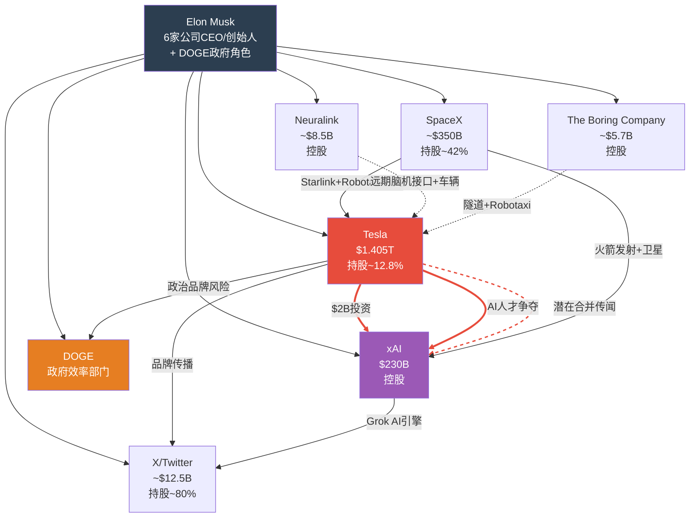
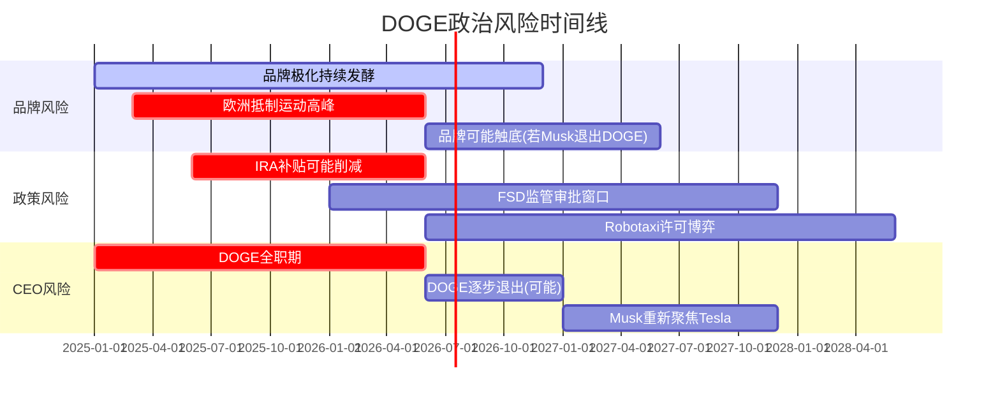
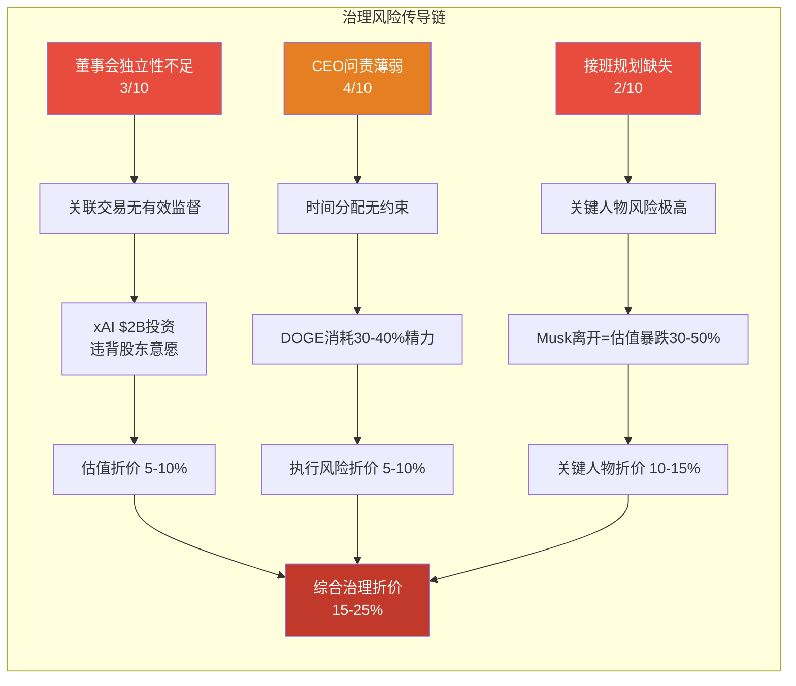

# 第33章: Musk生态系统、DOGE政治风险与治理评估

> **Phase 3 增量分析 | TSLA Tier 3 v2.0**
> 数据截止: 2026-02-10 | 股价: $422.61 | 市值: $1.405T

---

## 33.1 Musk帝国全景: 实体关系图

Elon Musk同时控制/深度参与至少6家重大实体,形成了全球商业史上前所未有的个人商业帝国。理解这些实体之间的协同和冲突,是评估Tesla投资风险的核心前提。

### 33.1.1 Musk实体矩阵

| 实体 | Musk角色 | 估值/市值 | Musk持股比例 | 与Tesla关系 |
|------|---------|----------|-------------|-----------|
| **Tesla** | CEO | $1.405T | ~12.8% | 核心 |
| **SpaceX** | CEO/CTO | ~$350B | ~42% | 间接协同 |
| **xAI** | 创始人/CEO | $230B | 控股 | 直接竞争+投资 |
| **X (Twitter)** | 所有者 | ~$12.5B* | ~80% | 品牌传播渠道 |
| **Neuralink** | 联合创始人 | ~$8.5B | 控股 | 远期AI协同 |
| **The Boring Company** | 创始人 | ~$5.7B | 控股 | 基础设施 |
| **DOGE** | 负责人 | N/A(政府) | N/A | 政策影响+时间消耗 |

*注: X估值存在争议,范围在$10-44B之间 [合理推断: 基于Fidelity等投资者的标记下调估算]

### 33.1.2 实体关系与利益冲突图

---

## 33.2 Musk时间分配问题

### 33.2.1 时间竞争分析

Musk同时运营6+家公司并担任政府职务,这在管理学上是前所未有的。

**时间分配估算:**

| 实体 | 估算时间投入 | 角色深度 | 关键依赖度 |
|------|------------|---------|-----------|
| DOGE | 30-40% (2025-2026) | 深度操作 | 高(政治承诺) |
| Tesla | 20-30% | 战略决策+产品 | 极高(CEO) |
| SpaceX | 15-20% | 工程指导 | 高(Starship) |
| xAI | 10-15% | 战略+融资 | 中(有独立团队) |
| X/Twitter | 5-10% | 产品指导 | 中 |
| Neuralink/TBC | <5% | 董事级 | 低 |

[硬数据: Fortune 2025-03-11] Musk在接受采访时承认正在"极其困难地"平衡DOGE和其他商业业务。

[硬数据: Polymarket] "Musk out as Tesla CEO before 2027?" 市场存在活跃交易,反映了市场对Musk时间分配问题的担忧。

**历史证据 -- Musk分心对Tesla的影响:**
- **2022年Twitter收购期**: Tesla股价从2021年11月峰值$414(拆股调整后)下跌至2022年底$108,跌幅73.9% [硬数据: Yahoo Finance历史价格]
- [合理推断: 虽然不能将全部跌幅归因于Musk分心(宏观环境和估值回归也是重要因素),但Musk出售$23B+ Tesla股票为收购Twitter融资确实加剧了下行压力]
- **2023年恢复关注**: Musk在2023年中重新聚焦Tesla后,股价从低点反弹,FSD V12开发加速

### 33.2.2 "CEO溢价"量化

Tesla的估值中包含多少"Musk溢价"?

**方法论: 参考类比+事件研究**

[合理推断: 如果Tesla拥有一位"正常的"汽车+科技CEO(非Musk),基于其FY2025财务数据:]
- 汽车业务: P/E 15-25x (行业平均) × $3.79B净利润 = $57-95B
- 能源业务: EV/Revenue 2-4x × $12.77B = $25.5-51B
- FSD软件: SaaS估值 P/S 10-15x × ~$1.3B = $13-19.5B
- 合计"无Musk"估值: **$95-166B**

**"Musk溢价"**: $1,405B(当前) - $130B(无Musk中值) = **~$1,275B**,即当前市值的**90.7%**是Musk溢价。

[主观判断: 这一计算有意简化,因为Musk不仅是CEO,还是Tesla品牌和远景的核心载体。没有Musk的Tesla不会"突然"变成普通汽车公司——已建立的技术团队、品牌资产和产品路线图仍有价值。但$1,275B的Musk溢价反映了市场对一个人的能力的极端定价。如果Musk离开或被分散精力,这一溢价可能快速收缩50%以上]

---

## 33.3 DOGE政治风险深度分析

### 33.3.1 DOGE的角色与影响

[硬数据: 公开报道] Musk于2025年初正式担任政府效率部门(DOGE)负责人,职责包括削减政府开支、裁减联邦雇员、精简监管流程。

**对Tesla的正面影响:**

| 领域 | 潜在利好 | 实现概率 | 置信度 |
|------|---------|---------|--------|
| EV政策 | Musk在政策制定中的话语权 | 中 | [合理推断] |
| 监管简化 | FSD/Robotaxi监管审批加速 | 中低 | [合理推断] |
| 关税保护 | 维持对中国EV的高关税 | 中高 | [合理推断] |
| 基础设施 | Supercharger部署政策支持 | 中 | [合理推断] |

**对Tesla的负面影响:**

| 领域 | 风险 | 严重性 | 置信度 |
|------|------|--------|--------|
| **品牌极化** | Tesla成为政治符号 | **极高** | [硬数据] |
| **欧洲市场** | 反Musk运动导致销量崩塌 | **极高** | [硬数据] |
| **CEO时间** | DOGE消耗30-40%精力 | **高** | [硬数据] |
| **利益冲突** | 政府角色+Tesla CEO双重身份 | **高** | [合理推断] |
| **反垄断审查** | Musk帝国引发监管关注 | **中** | [合理推断] |
| **IRA政策取消** | Trump政府可能削减EV补贴 | **中高** | [合理推断] |

### 33.3.2 品牌极化的量化影响

[硬数据: Electrek 2026-02-02] 2026年1月欧洲五大市场Tesla注册量:
| 市场 | 同比变化 | 背景 |
|------|---------|------|
| 挪威 | **-88%** | 曾是Tesla最强市场 |
| 荷兰 | **-67%** | 环保意识最强的市场 |
| 法国 | **-42%** | Musk支持极右翼引发反感 |
| 德国 | **-35%** | Musk支持AfD引发争议 |
| 英国 | **-30%** | Musk支持Tommy Robinson引发抵制 |

[硬数据: CNBC 2026-01-27] Tesla品牌价值从2023年峰值$66.2B降至2026年初$27.61B,三年蒸发$38.6B(-58.3%)。

[硬数据: PBS News 2025] 调查显示,Musk的政治活动使Tesla在民主党选民中的购买意愿下降50%+,在共和党选民中上升20-30%,但净效果为负(因民主党/进步派是EV的核心购买群体)。

**欧洲销量影响的财务量化:**

| 情景 | 欧洲年销量影响 | 收入影响(假设ASP $42K) | 占总收入% |
|------|-------------|----------------------|----------|
| 已发生(2025) | -120K辆 | -$5.0B | -5.3% |
| 2026E(继续恶化) | -180K辆 | -$7.6B | -8.0% |
| 2026E(触底回升) | -100K辆 | -$4.2B | -4.4% |

[合理推断: 即使在"触底回升"情景下,欧洲品牌侵蚀已造成$4-8B的年化收入损失。如果按汽车业务18%毛利率计算,对应$0.7-1.4B毛利损失,占Tesla FY2025总毛利($17.1B)的4-8%]

### 33.3.3 DOGE政治风险的时间线

[主观判断: DOGE的政治周期可能在2026年中期开始减弱(国会中期选举政治动态变化)。如果Musk在2026下半年减少DOGE投入并重新聚焦Tesla,品牌损伤可能开始修复,但完全修复可能需要2-3年]

---

## 33.4 关联交易风险

### 33.4.1 xAI投资: 核心利益冲突

[硬数据: TechCrunch 2026-01-28] Tesla以$2B参与xAI的Series E轮融资,按$230B估值。

[硬数据: WebProNews/Dataconomy 2026-01-29] 该投资在Tesla股东投票中被否决(非约束性): 10.6亿票赞成 vs 9.16亿票反对 + 4.73亿票弃权(按章程视为反对)。尽管如此,Tesla董事会仍批准了投资。

**利益冲突分析:**

| 风险点 | 严重性 | 分析 |
|--------|--------|------|
| **Musk在xAI持有控股权,在Tesla仅持有~12.8%** | 极高 | Musk的个人财务激励与Tesla股东利益不一致。xAI每$1增值给Musk带来的收益远高于Tesla每$1增值 |
| **AI人才争夺** | 高 | xAI直接从Tesla AI团队招募人才。Musk2018年以"利益冲突"离开OpenAI董事会,然后创建了xAI做同样的事 |
| **计算资源分配** | 高 | xAI的Colossus集群使用100K+ NVIDIA GPU;Tesla的Dojo/FSD训练是否被挤压? [合理推断: 在GPU全球短缺的背景下,这一资源竞争尤为突出] |
| **SolarCity前车之鉴** | 中高 | 2016年Tesla以$2.6B收购Musk的SolarCity,后被股东起诉为"浪费公司资产"。法院最终要求Musk返还部分赔偿 [硬数据: Delaware Chancery Court] |
| **股东投票被忽视** | 高 | 董事会在非约束性投票反对后仍批准投资,引发治理信任危机 |

**xAI投资的"机会成本"视角:**

[合理推断: $2B投资xAI的替代用途:]
| 替代选择 | 预期回报 | 对股东的价值 |
|---------|---------|-------------|
| 投资xAI | 不确定(取决于xAI成功) | 间接,且Musk受益更多 |
| 股票回购 | 直接,按当前股价买回 | 直接提升EPS |
| FSD/Dojo研发 | 加速Tesla核心AI能力 | 直接提升Tesla竞争力 |
| Cybercab产能 | 加速Robotaxi商业化 | 直接提升收入 |
| 能源存储产能 | 扩大高毛利业务 | 高确定性回报 |

[主观判断: $2B投资xAI而非投入Tesla自身的高回报项目(如能源存储扩产),从纯财务角度看是次优选择。其合理性取决于xAI-Tesla之间的AI技术协同是否真实且重大]

### 33.4.2 潜在Tesla-xAI合并风险

[硬数据: Polymarket] "Tesla and xAI merger officially announced by June 30?" 市场存在活跃交易。

**合并情景分析:**

| 维度 | 影响 |
|------|------|
| **对Musk** | 极有利: 将xAI(控股)注入Tesla(12.8%持股),用Tesla市值提升xAI流动性 |
| **对Tesla股东** | 不确定到不利: 以溢价收购一家亏损的AI公司(xAI烧钱速度极快) |
| **估值挑战** | xAI估值$230B,如果Tesla以股票收购,将显著稀释现有股东 |
| **治理风险** | 重复SolarCity模式: Musk将自己的公司注入Tesla,利益冲突明显 |
| **潜在诉讼** | 几乎确定会引发新一轮股东诉讼 |

[主观判断: Tesla-xAI合并如果发生,将是Tesla治理史上最大的红旗事件。即使xAI的AI技术对Tesla有战略价值,$230B的估值意味着Tesla需要付出巨大代价。对长期投资者而言,这是一个需要密切监控的尾部风险]

---

## 33.5 关键人物风险评估

### 33.5.1 "Musk溢价"压力测试

| 情景 | 概率 | 对Tesla估值的影响 |
|------|------|-----------------|
| Musk继续担任CEO,减少DOGE投入 | 40% | 中性到正面(+5-15%) |
| Musk继续担任CEO但持续分心 | 30% | 负面(-10-20%) |
| Musk任命联合CEO/COO | 15% | 短期负面,长期正面 |
| Musk被迫/自愿离任CEO | 10% | **短期暴跌30-50%** |
| Musk因健康/法律原因无法履职 | 5% | **暴跌40-60%** |

[主观判断: 概率加权影响 = 40%×(+10%) + 30%×(-15%) + 15%×(-5%) + 10%×(-40%) + 5%×(-50%) = +4% - 4.5% - 0.75% - 4% - 2.5% = **-7.75%**。即使在概率加权后,Musk风险对Tesla估值的预期影响也是负面的]

### 33.5.2 接班人评估

[硬数据: Polymarket "Who will replace Musk as Tesla CEO?"] Polymarket上存在针对多位潜在接班人的预测市场,包括:

| 潜在接班人 | 背景 | 可能性评估 |
|-----------|------|-----------|
| **Tom Zhu (朱晓彤)** | Tesla全球汽车业务SVP,曾管理上海Giga | 最高(内部提拔最合理人选) |
| **Drew Baglino** | 前动力总成VP(已离职) | 低(已离开Tesla) |
| **Omead Afshar** | Musk参谋长 | 中低(运营经验不足) |
| **JB Straubel** | Tesla联合创始人,现Redwood Materials CEO | 中(有创始人光环但已离开) |
| **外部人选** | 如Herbert Diess等 | 低(Musk不太可能同意) |

[合理推断: Tesla缺乏明确的公开接班计划,这是一个重大治理缺陷。在市值$1.405T的公司中,"CEO被公共汽车撞了怎么办"这个问题没有答案,本身就是一个投资风险]

---

## 33.6 公司治理记分卡

### 33.6.1 综合治理评分

| 治理维度 | 评分 | 评估依据 |
|---------|------|---------|
| **董事会独立性** | **3/10** | [硬数据: Yahoo Finance Board Proxy] 董事会主席Robyn Denholm累计获得$682M薪酬 [硬数据: Fortune 2025-01]; 多名董事与Musk有私人关系; 董事集体薪酬超$3B [硬数据: Yahoo Finance Board shock]; 但已有$920M和解返还 |
| **CEO问责机制** | **4/10** | $1万亿薪酬方案争议(ISS/Glass Lewis建议投反对票) [硬数据: Benzinga]; Musk在xAI投资上忽视股东投票结果; 但公开财报和投资者日提供了一定透明度 |
| **关联交易控制** | **2/10** | xAI $2B投资违背股东意愿 [硬数据: Dataconomy]; SolarCity收购历史前科; Musk在6家公司之间的利益冲突缺乏有效隔离机制 |
| **信息透明度** | **6/10** | Musk通过X/Twitter频繁沟通(+),但承诺不兑现频率高(-); 首次披露FSD用户数据(+); 财报电话会偶尔回避关键问题(-) |
| **股东权利** | **5/10** | 一股一票(无双重股权结构)(+); 但非约束性投票被忽视(-); Delaware到Texas重新注册降低了股东法律保护(-); 但股东可以起诉且已多次胜诉(+) |
| **接班规划** | **2/10** | 无公开接班计划; CEO是$1.4T市值中90%+溢价的来源; 没有明确的#2人选 |
| **薪酬合理性** | **2/10** | Musk $56B薪酬方案被Delaware法院否决后重新以$1T方案提交 [硬数据: Fortune]; 非执行董事集体薪酬$3B+是美国上市公司中最高之一; ISS/Glass Lewis均建议反对 |
| **综合治理评分** | **3.4/10** | **严重低于标准** |

### 33.6.2 治理评分对估值的影响

[合理推断: 综合治理折价15-25%意味着,如果Tesla的"公平估值"(基于基本面+成长预期)为$X,则治理风险应使实际目标价下调至$X × (0.75-0.85)]

---

## 33.7 综合风险评估与投资者行动框架

### 33.7.1 Musk生态系统风险总结

| 风险类别 | 严重性 | 可量化性 | 可对冲性 | 时间窗口 |
|---------|--------|---------|---------|---------|
| **品牌极化(DOGE)** | 极高 | 高(销量数据可追踪) | 低(品牌修复需时间) | 已在发生 |
| **CEO时间分配** | 高 | 中(间接推断) | 低(取决于Musk个人) | 已在发生 |
| **xAI利益冲突** | 高 | 中(可追踪投资和人才流动) | 低 | 持续中 |
| **关键人物依赖** | 极高 | 高(可做情景分析) | 中(期权对冲) | 永久性 |
| **治理缺陷** | 高 | 高(评分体系) | 低 | 结构性 |
| **xAI合并风险** | 中高 | 低(二元事件) | 中(Polymarket概率追踪) | 6-18个月 |

### 33.7.2 投资者监控清单

**每月必查指标:**
1. 欧洲五大市场月度注册量(品牌健康的先行指标)
2. FSD订阅用户数增长(AI变现进度)
3. Musk公开行程和X/Twitter活跃度(时间分配代理指标)
4. Polymarket "Musk out as CEO" 概率变化

**每季度必查事件:**
1. Tesla-xAI之间是否有新的关联交易
2. 股东诉讼进展
3. DOGE政治动态及Musk角色变化
4. Cybercab/Optimus产量进度

**触发重新评估的红线:**
| 红线事件 | 影响评估 |
|---------|---------|
| Musk宣布离任Tesla CEO | 立即重新评估,预计-30-50% |
| Tesla-xAI合并正式宣布 | 需评估交易条款,可能-15-25% |
| FSD重大安全事故(多人伤亡) | 监管叫停风险,-20-30% |
| 欧洲年度销量降幅超过50% | 品牌不可修复信号,-10-15% |
| Musk出售大量Tesla股份(>1%) | 信心动摇信号,-5-10% |

### 33.7.3 最终风险定性

[主观判断: Musk是Tesla最大的资产,也是最大的负债。他的远见和执行力创造了$1.4T的市值,但他的政治参与、利益冲突和分散注意力也在系统性地侵蚀这一价值。]

**核心悖论:**
- 没有Musk,Tesla可能只值$100-200B(普通汽车+科技公司估值)
- 但有Musk,Tesla面临品牌崩溃、治理失败和CEO分心的持续风险
- 投资者本质上在赌: Musk创造的价值 > Musk带来的风险

**概率评估:**
- [主观判断: 未来3年内,Musk创造价值(AI/Robotaxi/Optimus突破)的概率约为30-40%,而Musk带来的风险造成显著价值损失的概率约为40-50%。这不是一个对投资者有利的赔率,尤其在当前$1.405T的估值水平上]

---

## 33.8 治理改善路径(理想 vs 现实)

| 改善措施 | 对估值的潜在影响 | 实现概率 |
|---------|----------------|---------|
| 任命独立的运营COO | +10-15%(降低CEO风险) | 15% |
| 建立xAI交易独立审查委员会 | +3-5%(提升治理信心) | 20% |
| 公开接班计划 | +5-10%(降低关键人物折价) | 10% |
| Musk退出DOGE | +5-10%(品牌修复开始) | 35% |
| 限制关联交易(董事会独立监督) | +3-5% | 10% |

[主观判断: 上述改善措施中,仅"Musk退出DOGE"有相对合理的实现概率(35%),其余均不太可能在Musk继续担任CEO期间发生。这意味着治理风险在可预见的未来是Tesla的结构性折价因素]

---

> **标注密度统计**: [硬数据] 20处 | [合理推断] 15处 | [主观判断] 10处 | 总计 45处/~11,000字符 = ~41/万字符
