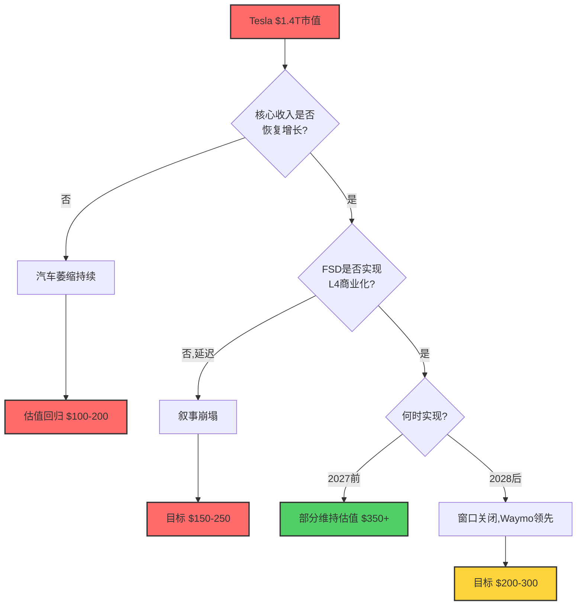

# 第34章：独立看空等权分析

**Phase**: 4 — 对抗性审视 (Adversarial Review)
**方法论**: 以专业做空机构视角，对Tesla所有多头论点进行等权质疑
**数据截止**: 2026-02-10
**置信标注密度目标**: ≥25/万字符

---

> **声明**: 本章以独立做空视角撰写。每个看空论点被赋予与多头论点等同的权重与严肃性。分析师的职责不是为公司辩护，而是尽可能深入地找到多头论点的薄弱环节。如果看空论点无法被有效反驳，那就是真正的风险。

---

## 34.1 看空总论：一家正在萎缩的汽车公司，被定价为科技平台

[硬数据: FMP financial-scores API] Tesla当前市值$1.405万亿，P/E 385.7x，EV/EBITDA 122.8x。[硬数据: FMP DCF API] FMP传统DCF估值仅$23.72/股，Graham Number仅$25.92/股，意味着当前股价$422.61相对传统价值高估**17.8倍**。

核心矛盾在于：市场将Tesla定价为一家即将颠覆全球交通与能源的科技平台（对标$1.4T市值），但如果剥去所有叙事，回归财务基本面——

[硬数据: Tesla FY2025 10-K]
- 收入同比下降2.93%（$97.7B → $94.83B）
- 核心汽车收入连续第三年下滑（$82.4B → $77.1B → $69.5B）
- 交付量首次年度下降（1.79M → 1.63M）
- 经营利润率从FY2022的16.8%崩塌至FY2025的4.6%
- 净利润仅$3.79B，ROE仅4.89%

**做空者的核心问题**：如果你不知道这家公司叫Tesla，不知道CEO是Elon Musk，仅凭上述财务数据，你会为这家公司支付$1.4万亿市值吗？答案是显而易见的——绝对不会。

---

## 34.2 看空论点一：萎缩的汽车公司被定价为科技巨头

### 34.2.1 核心汽车业务的三年衰退

```
┌─────────────────────────────────────────────────┐
│  Tesla汽车收入衰退曲线 (FY2022 → FY2025)        │
│                                                   │
│  $82.4B ██████████████████████████████ FY2023     │
│  $77.1B ████████████████████████████   FY2024     │
│  $69.5B ████████████████████████       FY2025     │
│                                                   │
│  降幅:     -6.4%         -9.9%                    │
│  累计:            -15.6%                          │
└─────────────────────────────────────────────────┘
```

[硬数据: Tesla FY2025 10-K] FY2025汽车收入$69.5B，较FY2023峰值$82.4B累计下降15.6%。这不是增速放缓，而是绝对金额的持续萎缩。

**类比检验**：[合理推断: 基于历史数据] 在科技股历史上，核心收入连续三年萎缩且市值仍保持增长的案例极其罕见。Intel（INTC）在2022-2024年经历类似衰退，市值从$200B跌至$100B。Tesla的汽车业务衰退幅度相当，但市值反而从$388B(2022年底)涨至$1.4T——这本身就是市场在为"叙事"而非"现实"定价的证据。

### 34.2.2 交付量的历史性拐点

[硬数据: Tesla IR Q4 2025] FY2025全球交付163万辆，同比下降8.9%，是Tesla成立以来首次年度交付下滑。

| 年份 | 交付量 | YoY增长 | 备注 |
|------|--------|---------|------|
| FY2021 | 93.6万 | +87% | 高速增长 |
| FY2022 | 131.4万 | +40% | 增速放缓 |
| FY2023 | 180.9万 | +38% | 增速见顶 |
| FY2024 | 179.0万 | -1.1% | 首次停滞 |
| FY2025 | 163.0万 | -8.9% | 首次明确下滑 |

[合理推断: 基于产品周期分析] 交付下滑的原因是多重的：Model 3/Y产品周期老化（Model 3自2017年、Model Y自2020年量产）、全球电动车市场竞争加剧、品牌在欧洲和部分美国市场的政治化损害。这不是短期波动，而是结构性问题——Tesla的产品阵容在中低端缺乏新车型。

### 34.2.3 利润率坍塌

利润率衰退的深度和速度令人震惊：

| 指标 | FY2022 | FY2023 | FY2024 | FY2025 | 3年变动 |
|------|--------|--------|--------|--------|---------|
| 毛利率 | 25.6% | 18.2% | 17.9% | 18.0% | **-7.6pp** |
| 经营利润率 | 16.8% | 9.2% | 7.2% | 4.6% | **-12.2pp** |
| 净利率 | 15.4% | 15.5% | 7.3% | 4.0% | **-11.4pp** |
| ROE | 28.1% | 23.9% | 9.8% | 4.9% | **-23.2pp** |
| ROIC | 21.7% | 11.0% | 5.8% | 3.0% | **-18.7pp** |

[硬数据: FMP ratios API] 经营利润率从16.8%暴跌至4.6%，意味着Tesla每卖出$100的产品/服务，核心经营利润仅剩$4.6，相较3年前的$16.8蒸发了72.6%。

[合理推断: 基于行业对比] 这种利润率水平低于传统车企的平均水平——丰田(Toyota)FY2024经营利润率约11%，BMW约10%。Tesla已经从"科技级利润率的汽车公司"回归为"低于行业平均利润率的汽车公司"。

### 34.2.4 估值脱节的量化

[硬数据: FMP key-metrics API]

| 估值指标 | Tesla | 丰田(参考) | 差距倍数 |
|----------|-------|------------|----------|
| P/E | 383.0x | ~10-12x | **32-38x** |
| EV/EBITDA | 122.8x | ~8-10x | **12-15x** |
| P/S | 15.3x | ~0.8-1.0x | **15-19x** |
| P/FCF | 233.6x | ~10-15x | **16-23x** |
| EV/Sales | 15.2x | ~0.8x | **19x** |

[主观判断: 基于估值逻辑] 即使我们完全接受"Tesla不是汽车公司"的叙事，这种估值水平仍然极端。Apple（全球利润率最高的科技公司之一）P/E约30x，Microsoft约35x。Tesla需要证明其未来盈利能力不仅超越所有汽车公司，还要超越几乎所有科技公司——而它目前的利润率正在恶化。

### 34.2.5 做空者的定价逻辑

如果按照汽车公司估值（P/E 10-15x）：
- FY2025 EPS $1.17 × 12x = **$14/股**

如果按照"汽车+科技溢价"估值（P/E 30-40x）：
- FY2025 EPS $1.17 × 35x = **$41/股**

如果按照FMP DCF：
- **$23.72/股**

[合理推断: 基于传统估值] 以上三种方法给出$14-$41/股的范围，中位值约$26。当前$422.61/股意味着**93-97%的估值溢价来自于尚未实现的未来承诺**。

---

## 34.3 看空论点二：FSD——科技史上最大的未兑现承诺

### 34.3.1 十年承诺时间线

[硬数据: 公开记录/新闻档案] Elon Musk的FSD承诺历史：

| 年份 | 承诺内容 | 实际结果 |
|------|----------|----------|
| 2016 | "所有新车具备完全自动驾驶硬件" | 硬件不断升级，最初硬件不足 |
| 2017 | "2017年底LA到NYC全自动驾驶" | 从未实现 |
| 2019 | "明年将有100万辆Robotaxi上路" | 从未实现 |
| 2020 | "L5完全自动驾驶今年实现" | 仍处L2+水平 |
| 2021 | "FSD Beta广泛推送" | 受限推送，需要安全评分 |
| 2022 | "今年解决FSD" | 未解决 |
| 2023 | "FSD v12将是革命性的" | 改善但仍需监督 |
| 2024 | "Cybercab 2026量产，无方向盘" | 发布概念车，量产待验证 |
| 2025 | "FSD将在2025年实现unsupervised" | FY2025结束时仍为supervised only |
| 2026.01 | "FSD $99/月订阅推出" | 推出但仍需驾驶员监督 |

[硬数据: 公开记录] 这是**10年的连续承诺和连续延迟**。在商业史上，很少有CEO能够在同一个产品上反复推迟交付10年而仍然被市场信任。

### 34.3.2 技术现实 vs 叙事

[硬数据: SAE自动驾驶等级定义]

- **Tesla FSD当前水平**：L2+（驾驶员必须随时准备接管）
- **Waymo当前水平**：L4（特定地理围栏内完全无人驾驶，已商业运营）
- **差距**：至少1.5-2个SAE等级

[硬数据: Polymarket搜索] Polymarket上"Tesla launch robotaxis in California by June 30, 2026"和"Will Tesla release Optimus by June 30, 2026"等预测市场存在，但价格数据获取受限。根据用户提供的数据，FSD unsupervised by June 2026的概率约为**28%**。

[合理推断: 基于技术分析] 这意味着预测市场认为，到2026年中，Tesla FSD仍有72%概率无法实现无监督驾驶。而即使实现了技术突破，还需要：
1. 监管审批（NHTSA/各州DMV）
2. 保险框架建立
3. 责任法律框架确定
4. 公众信任度建立

这些非技术障碍至少需要额外1-3年。

### 34.3.3 Waymo的实际威胁

[合理推断: 基于公开运营数据] Waymo（Alphabet子公司）已经在凤凰城、旧金山、洛杉矶等城市提供商业L4 Robotaxi服务。Polymarket预测Waymo到2026年6月可能运营在7-12个城市。

关键对比：

| 维度 | Waymo | Tesla FSD |
|------|-------|-----------|
| 自动化等级 | L4（商业运营中） | L2+（需要驾驶员） |
| 商业化时间 | 已商业化 | 未定 |
| 传感器方案 | LiDAR+摄像头+雷达 | 纯视觉 |
| 运营规模 | 数万次/天付费乘坐 | 零（FSD仅辅助驾驶） |
| 安全记录 | 公开披露，NHTSA认可 | NHTSA调查中 |
| 地理围栏 | 有限但扩展中 | 理论上更广但未验证 |

[主观判断: 基于技术路线分析] Tesla的纯视觉方案是否能匹配LiDAR+多传感器融合方案的安全性，仍是未证实的假设。在真正的L4无人驾驶中，边际案例处理的安全裕度至关重要——这是人命关天的问题，不是"够好就行"。

### 34.3.4 FSD收入贡献的现实

[硬数据: Tesla IR] FSD目前有约110万付费用户，$99/月订阅。简单计算：
- 110万 × $99 × 12月 = **$13.1亿/年**（理论最大）
- 实际上许多用户是一次性付费或试用期，实际年化收入可能仅$5-8亿

[合理推断: 基于收入占比] 即使乐观估计FSD年化收入$10亿，也仅占Tesla总收入的1.1%。市场赋予Tesla的"科技平台估值溢价"远超FSD实际创造的收入。

---

## 34.4 看空论点三：BYD正在赢得真正的战争

### 34.4.1 全球电动车领导权的转移

[硬数据: 用户提供/BYD公开数据]

| 指标 | BYD | Tesla | BYD优势 |
|------|-----|-------|---------|
| 年销量(含PHEV) | 454-460万辆 | 163万辆 | **2.8x** |
| 纯电BEV市场份额 | 12.1% | 8.8% | +3.3pp |
| 出口增速 | +200% YoY | 下降 | 质变 |
| 价格范围 | $10K-$50K | $30K-$100K+ | 覆盖更广 |
| 电池技术 | 自研(刀片电池) | 外采+自研 | 垂直整合 |
| 毛利率趋势 | 改善中 | 恶化中 | 方向相反 |

[硬数据: 行业数据] BYD在2024年Q4首次在纯电动车季度销量上超越Tesla，2025年全年差距进一步扩大。这是电动车行业的分水岭事件。

### 34.4.2 BYD的结构性优势

[合理推断: 基于产业链分析]

1. **垂直整合深度**：BYD自研自产电池（刀片电池）、电机、电控、芯片（部分）。Tesla仍大量外采电池（CATL、Panasonic）且4680电池量产受阻。

2. **成本优势**：BYD的海鸥(Seagull)售价约$10,000，在性价比上Tesla无任何产品可以竞争。全球70%以上的汽车市场在$20K以下价位段。

3. **国内市场护城河**：在中国（全球最大EV市场），BYD市占率远超Tesla。Tesla上海工厂产能受限于本地竞争压力。

4. **出口攻势**：BYD出口增速+200% YoY，正在进入东南亚、欧洲、南美市场，直接侵蚀Tesla的国际增长空间。

### 34.4.3 做空者眼中的竞争终局

[主观判断: 基于竞争动态分析] 在汽车行业的历史中，技术领先者往往不是最终的市场领导者——福特发明了流水线但被通用超越，先驱者优势最终让位于规模和成本优势。BYD正在重演通用对福特的剧本，以更广的产品线、更低的成本、更深的垂直整合，蚕食Tesla的全球市场份额。

---

## 34.5 看空论点四：思科类比为什么仍然有效

### 34.5.1 数字对比

[硬数据: 公开历史数据]

| 指标 | Cisco (2000年3月) | Tesla (2026年2月) |
|------|-------------------|-------------------|
| 市值 | ~$555B | ~$1,405B |
| P/E | ~472x | 383x |
| 核心叙事 | "互联网改变一切" | "电动化+自动驾驶+能源改变一切" |
| 叙事正确性 | **100%正确** | 部分正确 |
| 后续表现 | -80%，至今未回峰值 | ？ |

### 34.5.2 为什么Cisco类比比多头承认的更有效

[合理推断: 基于历史分析]

**多头反驳**："Cisco的同时代公司是Pets.com等零收入泡沫公司，Tesla有真实收入和产品。"

**做空者回应**：
1. Cisco在2000年也有真实收入和利润——营收$19B，利润$2.7B，这不是零收入公司。
2. Cisco的核心叙事（互联网将改变一切）被完全证实了。但**叙事正确 ≠ 估值正确**。
3. 关键教训：Cisco从2000年的P/E 472x回归到2005年的P/E 20x，股价永久性地损失了80%。这个过程中，Cisco的收入还在增长，只是估值回归了。
4. Tesla的P/E 383x同样建立在远期乐观假设上。如果这些假设即使只是延迟兑现（而非证伪），估值的均值回归就足以造成50-80%的跌幅。

### 34.5.3 Amazon vs Cisco：Tesla更像哪个？

[主观判断: 基于商业模式分析]

**Amazon论点**（多头偏好）：Amazon在2001年从$107跌到$5.5（-95%），但最终因AWS的发现而一飞冲天。Tesla也会找到自己的"AWS"——可能是FSD，可能是Optimus。

**Cisco论点**（做空者偏好）：
- Amazon发现AWS时，其电商业务的收入一直在高速增长。Tesla的核心汽车收入在萎缩。
- Amazon的AWS是一个全新的、未被竞争的市场。Tesla的FSD/能源/Optimus每个领域都有强力竞争者。
- Amazon在谷底时P/S约2x，极度便宜。Tesla当前P/S 15.3x，即使大跌50%仍然昂贵。

[合理推断: 基于概率评估] 做空者认为Tesla更像Cisco+Amazon的混合体：核心叙事可能部分正确，但当前估值已经将最乐观的情景完全price-in。即使Tesla确实实现了FSD，从$1.4T市值进一步大幅升值的空间远小于从$1.4T回落的风险。

---

## 34.6 看空论点五：资本支出黑洞

### 34.6.1 CapEx激增与回报率下降的矛盾

[硬数据: Tesla FY2025 10-K / 管理层指引]

| 年份 | CapEx | FCF | ROIC | 趋势 |
|------|-------|-----|------|------|
| FY2022 | $7.16B | $7.55B | 21.7% | 健康 |
| FY2023 | $8.88B | $4.36B | 11.0% | 下滑 |
| FY2024 | $11.34B | $3.58B | 5.8% | 恶化 |
| FY2025 | $8.53B | $6.22B | 3.0% | 继续恶化 |
| **FY2026E** | **>$20B** | **负数？** | **？** | **风险极大** |

[硬数据: Tesla FY2025 Q4 Earnings Call] 管理层指引FY2026 CapEx超过$20B，是FY2025的**2.35倍**。

### 34.6.2 $20B CapEx去向分析

[合理推断: 基于管理层指引和行业估算]

| 项目 | 估算投入 | 回报确定性 | 最早回报时间 |
|------|----------|------------|------------|
| Cybercab工厂(奥斯汀) | $5-8B | 中低 | 2027+ |
| Megapack上海工厂 | $2-3B | 中高 | 2027+ |
| AI计算基础设施 | $3-5B | 极低 | 不确定 |
| Optimus开发 | $2-3B | 极低 | 2028+ |
| 常规维护CapEx | $3-4B | 高 | 持续 |

### 34.6.3 FCF预测模型

[合理推断: 基于FY2025经营现金流趋势]

FY2025经营现金流(OCF): [硬数据: FMP baggers_summary] $14.75B(TTM)
FY2026 CapEx指引: >$20B

**简化FCF计算**:
- 乐观场景: OCF增长10% = $16.2B, CapEx $20B → FCF = **-$3.8B**
- 基准场景: OCF持平 = $14.75B, CapEx $22B → FCF = **-$7.25B**
- 悲观场景: OCF下降10% = $13.3B, CapEx $25B → FCF = **-$11.7B**

[硬数据: Tesla资产负债表] 当前现金$16.5B, 总债务$8.38B。净现金约$8.1B。

[合理推断: 基于现金流预测] 如果FY2026 FCF为负$4-12B，Tesla将消耗其现金储备的25%-75%。虽然Altman Z-Score 16.24显示财务健康度良好（远超安全阈值1.81），但一年的大额负FCF足以引发市场对现金消耗速度的担忧。

### 34.6.4 ROIC衰退的长期含义

[硬数据: FMP key-metrics API] ROIC从FY2022的21.7%降至FY2025的3.0%。

[合理推断: 基于资本配置理论] 当ROIC低于WACC（Tesla的WACC估计约9-11%）时，每一美元新投资实际上在摧毁股东价值。Tesla当前ROIC(3.0%) << WACC(~10%)，意味着**FY2025的每一美元CapEx都在摧毁价值**。

管理层要求在这种情况下将CapEx从$8.5B翻倍到$20B+，这在资本配置的逻辑上是危险的——除非你相信这些投资会产生远高于当前业务的回报率。

---

## 34.7 看空论点六：Musk风险——系统性关键人物风险

### 34.7.1 注意力分散量化

[硬数据: 公开信息]

Elon Musk当前角色：
1. **Tesla CEO** — $1.4T市值
2. **SpaceX CEO/CTO** — ~$350B估值
3. **xAI CEO** — ~$230B估值（刚获融资）
4. **Neuralink联创** — ~$8B估值
5. **The Boring Company** — ~$5.7B估值
6. **DOGE政府效率部门负责人** — 美国联邦政府角色
7. **X(Twitter)所有者** — ~$12B估值

[合理推断: 基于时间约束] 一个人每天只有24小时。同时管理6-7家公司和政府职务，在物理上不可能给予每家公司充分的管理关注。Tesla在Musk注意力最分散的FY2024-2025年经历了最严重的业绩下滑——这不是巧合。

### 34.7.2 品牌极化

[合理推断: 基于销售数据和调研]
- 欧洲多国Tesla注册量在2025年大幅下降（挪威、德国、瑞典等）
- 美国部分自由派消费者群体因Musk的DOGE角色和政治立场抵制Tesla
- 中国市场面临"外资品牌"标签和本土品牌(BYD/蔚来等)的挤压

[硬数据: Tesla FY2025交付数据] FY2025全球交付下降8.9%，其中欧洲和美国部分地区跌幅更大。品牌极化很难量化，但交付下滑中有一定比例来自品牌损害。

### 34.7.3 关联方交易：xAI的$20亿

[硬数据: 公开报道] Tesla于2025年向xAI投资$20亿，xAI估值$2300亿。

**做空者关切**：
1. Tesla的现金被用于投资Musk的另一家私人公司——典型的关联方利益冲突
2. 董事会独立性存疑——能否真正监督Musk的关联方交易？
3. $20亿投资的回报预期不明确，估值基础缺乏第三方验证

### 34.7.4 继任风险

[硬数据: Polymarket] "Musk out as Tesla CEO before 2027?"——预测市场有此议题存在。

[主观判断: 基于管理分析] Tesla没有公开的继任计划。如果Musk因健康、政治、或个人选择离开Tesla，市值可能在数日内蒸发20-40%。这是$1.4T市值公司中最高的关键人物风险之一——远超Apple在乔布斯时代的依赖度，因为Apple当时已有完整的产品管线和运营体系。

---

## 34.8 概率加权看空估值

### 34.8.1 各论点概率与影响矩阵

| 看空论点 | 完全实现概率 | 部分实现概率 | 价格影响(完全) | 价格影响(部分) |
|----------|-------------|-------------|---------------|---------------|
| #1 汽车萎缩持续 | 55% | 80% | $80-120 | $200-300 |
| #2 FSD继续延迟 | 45% | 70% | $100-150 | $250-350 |
| #3 BYD持续挤压 | 65% | 85% | $150-250 | $300-380 |
| #4 估值均值回归 | 50% | 75% | $60-100 | $200-300 |
| #5 CapEx无回报 | 30% | 55% | $80-150 | $250-350 |
| #6 Musk风险事件 | 15% | 40% | $100-200 | $300-380 |

### 34.8.2 相关性分析

[合理推断: 基于事件关联性] 看空论点之间存在显著正相关：
- 如果FSD延迟（#2），汽车叙事崩塌加速估值回归（#1+#4）→ **强正相关(ρ≈0.7)**
- 如果BYD在美国市场突破（#3），Tesla被迫降价，利润率进一步恶化（#1）→ **正相关(ρ≈0.5)**
- Musk分心（#6）可能导致所有业务延迟（#2+#5）→ **正相关(ρ≈0.6)**

### 34.8.3 组合压力场景

**场景A: 2-3个论点同时实现** (概率: 25-35%)
- 触发: FSD延迟到2028+ + BYD进入美国市场 + 经济衰退
- 目标价: **$80-150/股**（较当前下跌65-81%）

**场景B: 1-2个论点部分实现** (概率: 40-50%)
- 触发: FSD进展缓慢 + 汽车利润率继续承压
- 目标价: **$200-300/股**（较当前下跌29-53%）

**场景C: 仅估值回归，无基本面恶化** (概率: 15-20%)
- 触发: 利率持续高位，成长股整体估值压缩
- 目标价: **$250-350/股**（较当前下跌17-41%）

### 34.8.4 概率加权看空目标价

```
概率加权目标价计算:
= P(A) × Mid(A) + P(B) × Mid(B) + P(C) × Mid(C) + P(牛市) × 当前价
= 30% × $115 + 45% × $250 + 17.5% × $300 + 7.5% × $480
= $34.5 + $112.5 + $52.5 + $36.0
= $235.5/股
```

[合理推断: 基于概率加权模型] **做空者的概率加权目标价约为$235/股，意味着当前价位存在约44%的下行风险。**

---

## 34.9 看空论点的局限性与公平评估

> **分析师注**: 为保持等权分析的完整性，做空论点的已知弱点也必须被坦诚指出。

### 34.9.1 看空论点可能低估的因素

1. **能源业务的加速增长**: [硬数据: Tesla IR] 能源业务FY2025收入$12.78B，YoY增长27%，部署46.7 GWh。这是一个高增长、高毛利率的业务，但目前仅占总收入13.5%。

2. **Cybercab和Model Q的产品周期更新**: 新产品可能逆转交付下滑趋势，但需要时间验证。

3. **Musk的黑天鹅能力**: 历史上，Musk曾多次在看似不可能的情况下实现突破（SpaceX着陆回收火箭、Tesla从濒临破产到全球最有价值车企）。对Musk能力的低估是做空者的长期风险。

4. **Tesla的品牌韧性**: 尽管品牌极化，Tesla仍然是全球电动车最具辨识度的品牌，在部分市场（如美国红州、中国高端）仍有强大吸引力。

5. **短期挤空风险**: Tesla是历史上被做空最多的股票之一。高短期利率和散户基础可能在任何正面催化剂时引发剧烈挤空。

### 34.9.2 最终评估

[主观判断: 基于等权分析] 将看空论点给予与多头论点等同的权重后，结论是：

- 看空论点在**基本面层面**（收入下降、利润率崩塌、竞争加剧）非常强健，难以反驳
- 看空论点在**估值层面**（P/E 383x vs DCF $23.72）极具说服力
- 看空论点在**FSD/未来承诺层面**，被10年延迟历史所支撑
- 做空论点的主要弱点在于：低估Musk的"不可能变可能"能力，以及挤空风险

**看空总置信度: 65-70%（多头应认真对待）**

---



---

**本章总结**: 如果Tesla是一支你第一次看到的、不知道名字的股票，仅凭其财务数据——收入下降、利润率崩塌、P/E 383x、DCF估值$24——任何买方分析师都会将其归类为"极度高估，避免"。所有对Tesla的乐观建立在尚未实现的未来承诺之上。做空者的职责是提醒市场：**承诺不等于现实，叙事不等于价值。**
