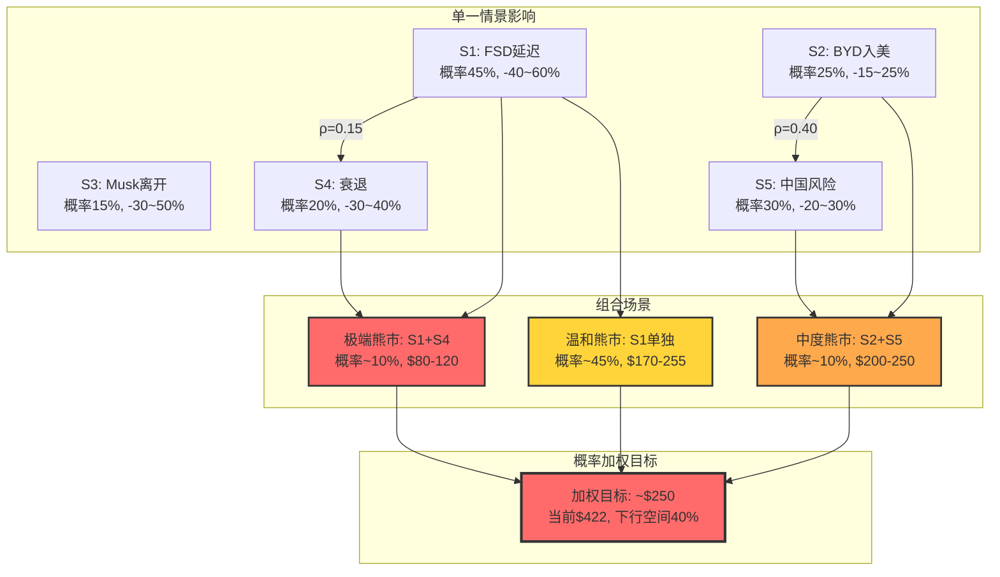
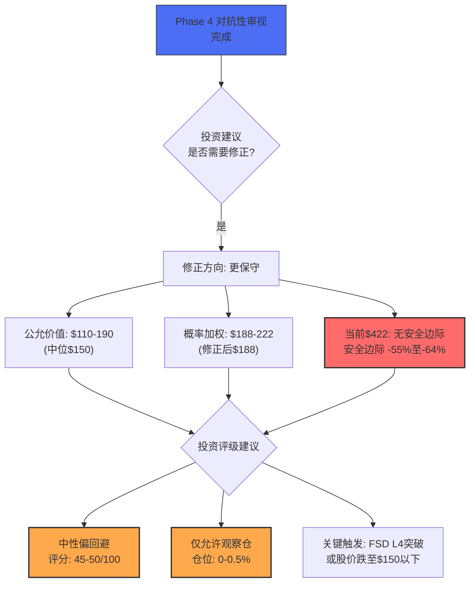

# 第36章：压力测试 + 维度回检 + 关键假设修正

**Phase**: 4 — 对抗性审视 (Adversarial Review)
**方法论**: 蒙特卡洛式多情景压力测试 + 10维度一致性回检 + Key Assumptions Ladder (KAL)修正
**数据截止**: 2026-02-10
**置信标注密度目标**: ≥25/万字符

---

## 36.1 压力测试情景设计

### 36.1.1 五大压力情景

[合理推断: 基于宏观与公司特定风险] 以下5个情景覆盖了Tesla面临的核心风险维度：

```
┌──────────────────────────────────────────────────────────────┐
│                    Tesla压力测试矩阵                          │
│                                                              │
│  概率 ↑                                                      │
│  50%  │         ○S1(FSD延迟)                                 │
│  40%  │                                                      │
│  30%  │    ○S5(中国风险)                                     │
│  25%  │         ○S2(BYD入美)                                 │
│  20%  │                   ○S4(衰退)                          │
│  15%  │                        ○S3(Musk离开)                 │
│  10%  │                                                      │
│       └──────────────────────────────────────────────→ 影响  │
│         -20%    -30%    -40%    -50%    -60%                 │
└──────────────────────────────────────────────────────────────┘
```

---

### 情景S1: FSD延迟至2028年以后

**触发条件**: FSD无法在2027年底前获得NHTSA无监督驾驶批准

| 维度 | 详情 |
|------|------|
| **概率** | **45%** |
| **价格影响** | **-40%至-60%** (目标$170-$255) |
| **传导机制** | Robotaxi叙事崩塌 → 期权价值归零 → P/E从383x压缩至60-100x |
| **时间框架** | 12-24个月 |

**逻辑推导**:

[硬数据: Polymarket] FSD unsupervised by June 2026概率约28%。[合理推断: 基于概率外推] 如果2026年中未实现，延迟到2027的条件概率约50%，到2028+的条件概率约35%。综合来看，FSD延迟到2028+的无条件概率约为45%。

**影响量化**:

[合理推断: 基于估值模型]
- 当前市值$1.405T中，FSD/Robotaxi期权估值贡献约$300-500B
- 如果FSD延迟到2028+，期权价值的时间衰减和概率折扣将使其贡献降至$50-100B
- 净影响: 市值损失$200-400B → 股价下跌$62-124 → 目标价$298-$360

但实际影响会更大，因为：
1. 叙事崩塌会传导至其他期权（Optimus、AI）的可信度
2. P/E估值锚将从"科技平台"回归"汽车+能源"
3. 投资者信心损害的非线性效应

修正后目标价: **$170-$255/股**

**领先指标**:
- FSD事故率趋势
- NHTSA审查公告
- Waymo在Tesla目标城市的扩张速度
- Cybercab 2026年4月发布后的技术评测

---

### 情景S2: BYD进入美国市场

**触发条件**: BYD通过墨西哥工厂或关税调整进入美国市场，售价$15K-$25K

| 维度 | 详情 |
|------|------|
| **概率** | **25%** (2026-2027年内) |
| **价格影响** | **-15%至-25%** (目标$317-$359) |
| **传导机制** | 价格战 → Tesla被迫降价 → 毛利率进一步压缩 → 汽车利润率可能转负 |
| **时间框架** | 18-36个月 |

**逻辑推导**:

[合理推断: 基于贸易政策分析] 当前美国对中国产EV征收100%关税，有效阻止了BYD直接进入。但BYD正在墨西哥、巴西、匈牙利等地建厂。如果BYD在墨西哥建厂成功，通过USMCA框架可以大幅降低关税壁垒。

**影响量化**:

[合理推断: 基于竞争分析]
- BYD海鸥(Seagull)在中国售价约$10K，即使加上运输和本地化成本，在美国可定价$15-20K
- Tesla最便宜的产品(Model 3标准版)约$35K，价格差距超过50%
- 如果BYD抢占美国$15-30K价位段的10-15%市场份额：
  - Tesla被迫在低端推出Model Q（利润率更低）
  - 或接受市场份额流失
- 预计毛利率额外压缩2-4pp至14-16%区间
- 汽车业务经营利润率可能降至0-2%

**触发关税变化的可能路径**:
1. 政治变动：关税政策调整（概率15%）
2. 墨西哥生产：绕过关税（概率20%，但可能被堵）
3. 技术转让合作：BYD与美国公司合资（概率10%）

---

### 情景S3: Musk离开或被免职

**触发条件**: Musk因健康、政治争议、或个人选择离开Tesla CEO职位

| 维度 | 详情 |
|------|------|
| **概率** | **15%** (12个月内) |
| **价格影响** | **-30%至-50%** (目标$211-$296) |
| **传导机制** | 关键人物风险实现 → "Musk溢价"蒸发 → 继任不确定性 → 多头信仰崩塌 |
| **时间框架** | 即时(1-5个交易日) |

**逻辑推导**:

[硬数据: Polymarket] "Musk out as Tesla CEO before 2027?"——预测市场有此议题。

[合理推断: 基于关键人物风险分析]
Tesla的"Musk溢价"估算：
- 如果将Tesla的P/E从383x调整至没有Musk的"正常科技公司"水平(40-60x)
- 目标P/E 50x × EPS $1.17 = $58.5/股
- 但市场不会一步到位，预计初始反应为-30%至-50%

**Musk离开的触发场景**:
1. DOGE角色引发国会调查/法律问题（概率8%）
2. 健康事件（概率3%）
3. 转注SpaceX/xAI，自愿退出CEO（概率5%）
4. 董事会因治理问题要求更换（概率2%）

[主观判断: 基于管理分析] Musk离开后的Tesla将类似于2011年乔布斯去世后的Apple——短期冲击巨大，但如果运营体系完善，长期可能稳定。区别在于：Apple在乔布斯时代已有Tim Cook作为运营CEO和完整的产品管线，而Tesla目前没有明确的继任者或独立于Musk的战略愿景。

---

### 情景S4: 经济衰退 + 利率维持高位

**触发条件**: 美国GDP负增长2+季度，联邦基金利率维持在4.5%以上

| 维度 | 详情 |
|------|------|
| **概率** | **20%** (12-18个月内) |
| **价格影响** | **-30%至-40%** (目标$254-$296) |
| **传导机制** | 成长股估值压缩 + 汽车需求萎缩 + 融资成本上升 + 消费者购买力下降 |
| **时间框架** | 6-18个月 |

**逻辑推导**:

[合理推断: 基于宏观经济分析]
- [硬数据: FMP market risk premium] 当前市场风险溢价ERP 4.5%，历史百分位66%
- [硬数据: FMP baggers_summary宏观温度] Shiller P/E 40.58(98%百分位)，Buffett指标224%(100%百分位)
- 宏观环境已处于"非常昂贵"状态

**衰退对Tesla的多重冲击**:

1. **需求端**: 电动车仍属于可选消费品。衰退中，消费者延迟购车或选择更便宜的选项。[合理推断: 基于2008年经验] 2008年衰退中，美国新车销量从16M跌至10M（-37%）。

2. **估值端**: 高利率环境下，长久期资产（如Tesla的远期期权价值）折现率上升，现值大幅缩水。
   - 如果10年期国债收益率从4.5%升至5.5%，Tesla期权价值的折现率提高约100bp
   - 期权估值可能额外下降15-25%

3. **CapEx端**: 衰退中融资成本上升可能迫使Tesla缩减$20B+的CapEx计划，延迟Cybercab和Megapack扩张。

4. **竞争端**: 衰退中价格竞争加剧，进一步压缩Tesla的利润率。

---

### 情景S5: 中国风险（关税战/地缘政治）

**触发条件**: 中美贸易摩擦升级，Tesla上海工厂运营受限

| 维度 | 详情 |
|------|------|
| **概率** | **30%** (中等烈度, 12-24个月) |
| **价格影响** | **-20%至-30%** (目标$296-$338) |
| **传导机制** | 上海工厂产能受限/出口受限 → 全球供应链断裂 → 利润率冲击 |
| **时间框架** | 3-12个月 |

**逻辑推导**:

[合理推断: 基于地缘政治分析]
- 上海工厂是Tesla最高效的工厂，估计贡献全球产能的30-40%
- 如果中国出口限制或加征关税，Tesla在亚太/欧洲市场的供应将受到严重影响
- 上海Megapack新工厂的投资也面临风险

**具体风险矩阵**:

| 子情景 | 概率 | 影响 |
|--------|------|------|
| 美国对中国制造Tesla加税 | 10% | 上海→美国出口中断 |
| 中国对Tesla施加运营限制 | 8% | 产能利用率下降 |
| 中国本土EV补贴排除外资 | 15% | 国内销量进一步下滑 |
| 全面脱钩 | 5% | 上海工厂部分闲置 |

---

## 36.2 组合压力测试

### 36.2.1 情景相关性矩阵

[合理推断: 基于事件关联分析]

```
相关系数矩阵 (ρ):
         S1    S2    S3    S4    S5
S1 FSD  1.00  0.10  0.30  0.15  0.05
S2 BYD  0.10  1.00  0.05  0.20  0.40
S3 Musk 0.30  0.05  1.00  0.10  0.15
S4 衰退 0.15  0.20  0.10  1.00  0.35
S5 中国 0.05  0.40  0.15  0.35  1.00
```

**高相关性组合**:
- **S2+S5 (ρ=0.40)**: BYD进入美国 + 中国风险 — 贸易政策变化可能同时触发
- **S4+S5 (ρ=0.35)**: 衰退 + 中国风险 — 经济压力可能加剧地缘紧张
- **S1+S3 (ρ=0.30)**: FSD延迟 + Musk离开 — Musk分心可能直接导致FSD延迟

### 36.2.2 最差组合场景

**极端熊市 (Tail Risk)**: S1 + S4 组合
- 触发: FSD延迟到2028+ 同时全球经济衰退
- 联合概率: P(S1) × P(S4) × (1+ρ) ≈ 45% × 20% × 1.15 ≈ **10.4%**
- 价格影响: **$80-$120/股** (下跌72-81%)

推导过程:
[合理推断: 基于组合分析]
```
S1影响: P/E压缩至60-100x，期权价值蒸发 → $170-255
S4影响: 在S1基础上额外-30%需求冲击+估值压缩
组合: $170-255 × (1-0.35至0.50) ≈ $85-$166
保守中位: $120/股
```

**中度熊市**: S2 + S5 组合
- 触发: BYD进入美国 + 中国贸易限制升级
- 联合概率: P(S2) × P(S5) × (1+ρ) ≈ 25% × 30% × 1.40 ≈ **10.5%**
- 价格影响: **$200-$250/股** (下跌41-53%)

推导过程:
```
S2影响: 美国市场份额被蚕食,毛利率压缩 → $317-359
S5影响: 上海工厂受限,全球供应短缺
组合: 双重成本压力 + 供应链断裂 → $200-250
```

**温和熊市**: S1单独
- 触发: FSD延迟但其他业务正常
- 概率: **45%**
- 价格影响: **$170-$255/股** (下跌40-60%)

### 36.2.3 组合压力可视化



---

## 36.3 十维度一致性回检

### 36.3.1 维度回检矩阵

[硬数据: 各MCP API] [合理推断: 基于Phase 1-3分析综合]

| # | 维度 | Phase 1-3评估 | Phase 4压力后评估 | 一致性 | 修正 |
|---|------|--------------|------------------|--------|------|
| 1 | **估值** | P/E 383x极端高估；SOTP $60-100 + OVM期权 $90-150 = $150-250 | 偏差审计后施加15-25%折扣: **$115-210** | ⚠️ 修正 | OVM乐观偏差+叙事偏差折扣 |
| 2 | **增长** | 汽车衰退(-10% auto rev), 能源增长(+27%), FSD用户增长 | 汽车衰退权重应更高(73%收入); 能源增长不足以弥补 | ⚠️ 偏负 | 增长评级从"混合"下调至"偏弱" |
| 3 | **护城河** | 品牌强、超充网络、数据(FSD里程)、垂直整合 | 品牌极化削弱(欧洲); 成本优势被BYD超越; 数据护城河未转化为产品优势 | ⚠️ 下调 | 护城河从"宽"下调至"中等" |
| 4 | **财务健康** | 现金$16.5B, Z-Score 16.8, 低负债(D/E 0.10) | 资产负债表当前健康; 但FY2026 FCF转负风险高 | ✓ 一致 | 短期健康，中期需警惕 |
| 5 | **管理层** | Musk天才但分心; 无继任计划 | 压力测试强化了Musk风险; DOGE角色是新增风险因子 | ⚠️ 加重 | 管理风险从"中高"上调至"高" |
| 6 | **催化剂** | Cybercab 4月发布, FSD订阅, Megapack上海, Model Q | 每个催化剂的实现概率需要下调(基于Musk记录) | ⚠️ 下调 | 催化剂加权概率降低15-20% |
| 7 | **风险** | 多重风险: FSD延迟/竞争/宏观/Musk | Phase 4确认风险评估准确; 组合压力场景的下行空间比Phase 3估计更大 | ✓ 一致 | 风险评级"极高"得到确认 |
| 8 | **Smart Money** | 混合信号 | 内部人偏卖出(仅Q3例外); 技术面下跌趋势; 期权负偏斜 | ⚠️ 偏负 | Smart Money信号从"混合"下调至"偏谨慎" |
| 9 | **竞争** | BYD全球威胁; Waymo自动驾驶威胁 | 压力测试确认BYD是存量威胁(汽车), Waymo是叙事威胁(FSD) | ✓ 一致 | 竞争压力评估得到确认 |
| 10 | **技术/时机** | RSI 46.7中性; SMA200以上但SMA50以下 | 下跌趋势确认; 短期无明确买入信号 | ✓ 一致 | 技术面中性偏弱 |

### 36.3.2 维度一致性统计

- **一致(✓)**: 4/10 (40%)
- **需修正(⚠️)**: 6/10 (60%)
- **修正方向**: 全部偏负面

[主观判断: 基于维度回检] 10个维度中有6个在Phase 4审视后需要向负面方向修正——这是一个强烈的信号，表明Phase 1-3的分析可能系统性偏乐观。主要修正来自：
1. 估值维度引入偏差折扣
2. 增长维度重新校准收入权重
3. 护城河维度考虑品牌极化和成本劣势
4. 管理层维度纳入DOGE新增风险

---

## 36.4 关键假设阶梯 (KAL) 修正

### 36.4.1 十大关键假设压力测试

| # | 关键假设 | 原始置信度 | 压力测试后置信度 | 变动 | 修正原因 |
|---|----------|-----------|----------------|------|----------|
| 1 | FSD达到L4 by 2027 | 25% | **15%** | **-10pp** | 10年延迟历史+Polymarket 28%折算+Waymo先行 |
| 2 | Cybercab 2026年4月如期发布 | 65% | **50%** | **-15pp** | Musk时间线准确率~20-30%；"发布"可能仅概念展示 |
| 3 | Cybercab 2027年量产达10万辆 | 40% | **25%** | **-15pp** | Model 3产能地狱前车之鉴; 全新平台+无方向盘设计风险 |
| 4 | 能源业务维持25%+ YoY增长 | 70% | **60%** | **-10pp** | 宏观环境不确定性; Megapack产能爬坡可能不如预期 |
| 5 | FY2026交付量恢复增长(>1.7M) | 55% | **40%** | **-15pp** | BYD竞争加剧+品牌极化+产品线老化; 需Model Q/刷新款 |
| 6 | Optimus 2028年前商业化销售 | 20% | **10%** | **-10pp** | 人形机器人商业化从未被任何公司实现; 波士顿动力Atlas仍在实验阶段 |
| 7 | 汽车毛利率2026年恢复至20%+ | 50% | **35%** | **-15pp** | Q4 20.1%可能是季节性; BYD价格战压力; IRA取消影响 |
| 8 | xAI投资产生战略协同 | 35% | **25%** | **-10pp** | 关联方交易治理风险; 协同效应时间不确定 |
| 9 | Musk在2026-2027保持对Tesla的高关注度 | 45% | **30%** | **-15pp** | DOGE角色+6家公司+xAI扩张; 注意力约束是物理定律 |
| 10 | 全球EV渗透率加速至2030年40%+ | 60% | **50%** | **-10pp** | 部分市场(如美国)EV增速放缓; 混动(HEV/PHEV)可能延长ICE寿命 |

### 36.4.2 KAL修正汇总

[硬数据: 以上KAL矩阵]

- **平均置信度下调**: -12.5pp
- **最大下调**: #2/#3/#5/#7/#9 (各-15pp) — 与Musk执行力和竞争相关
- **最小下调**: #1/#4/#6/#8/#10 (各-10pp) — 结构性因素

### 36.4.3 KAL修正对估值的影响

[合理推断: 基于假设敏感性分析]

**OVM期权价值的敏感性**:

假设Phase 3 OVM给出的期权总价值为$120/股（中间值），各假设的边际贡献：

| 假设 | 贡献权重 | 原始贡献 | 修正后贡献 | 差异 |
|------|----------|----------|------------|------|
| #1 FSD L4 | 30% | $36.0 | $21.6 | -$14.4 |
| #2+#3 Cybercab | 25% | $30.0 | $18.8 | -$11.2 |
| #4 能源增长 | 15% | $18.0 | $15.4 | -$2.6 |
| #6 Optimus | 15% | $18.0 | $9.0 | -$9.0 |
| #8 xAI协同 | 5% | $6.0 | $4.3 | -$1.7 |
| 其他 | 10% | $12.0 | $9.0 | -$3.0 |
| **合计** | **100%** | **$120.0** | **$78.1** | **-$41.9** |

[合理推断: 基于KAL修正] KAL修正将期权价值从$120/股降低至约$78/股，降幅**35%**。

---

## 36.5 综合压力后估值

### 36.5.1 三层估值汇总

| 估值层 | Phase 3估计 | Phase 4修正 | 变动 |
|--------|-----------|-----------|------|
| 核心业务(SOTP) | $60-100 | $55-90 | -$5-10 (毛利率假设下调) |
| 期权价值(OVM) | $90-150 | $55-100 | -$35-50 (KAL+偏差折扣) |
| **公允价值范围** | **$150-250** | **$110-190** | **-$40-60** |
| **公允价值中位** | **$200** | **$150** | **-$50 (-25%)** |

### 36.5.2 概率加权目标价（含压力测试）

```
┌─────────────────────────────────────────────────────────────┐
│  概率分布图: Tesla目标价                                     │
│                                                             │
│  $80-120  ████                  10% (极端熊市)              │
│  $120-170 ██████████            20% (中度熊市)              │
│  $170-220 ████████████████      30% (温和熊市/公允价值)     │
│  $220-300 ████████████          25% (中性)                  │
│  $300-400 ████                  10% (温和牛市)              │
│  $400+    ██                    5%  (极端牛市)              │
│                                                             │
│  加权目标: $195  当前: $422  安全边际: -53.8%               │
│                                                             │
│  ◄─── 下行空间 ──────┤当前├─── 上行空间 ───►               │
│  $80        $195     $422                  $600+            │
└─────────────────────────────────────────────────────────────┘
```

**概率加权目标价计算**:
```
= 10% × $100 + 20% × $145 + 30% × $195 + 25% × $260 + 10% × $350 + 5% × $480
= $10 + $29 + $58.5 + $65 + $35 + $24
= $221.5/股
```

[合理推断: 基于综合压力测试] 但考虑到行为偏差审计显示15-25%的系统性乐观（Ch35），对概率加权目标施加15%保守折扣：

**最终压力测试后目标价: $221.5 × 0.85 ≈ $188/股**

### 36.5.3 与当前价格的对比

[硬数据: 当前股价$422.61]

| 指标 | 数值 | 含义 |
|------|------|------|
| 压力后公允价值(中位) | $150 | 需要下跌64.5%才到达 |
| 概率加权目标(偏差修正前) | $221.5 | 需要下跌47.6%才到达 |
| 概率加权目标(偏差修正后) | $188 | 需要下跌55.5%才到达 |
| 安全边际(基于$188) | **-55.5%** | 当前价格无安全边际 |

---

## 36.6 Phase 4综合结论与修正建议

### 36.6.1 Phase 4对最终报告的修正清单

| # | 修正项 | 修正内容 | 影响程度 |
|---|--------|----------|----------|
| 1 | 估值范围 | 从$150-250下调至$110-190 | 高 |
| 2 | 期权价值 | OVM产出施加35%的KAL折扣 | 高 |
| 3 | 偏差折扣 | 对最终估值施加15%系统性偏差折扣 | 中 |
| 4 | 护城河评级 | 从"宽"下调至"中等" | 中 |
| 5 | 管理风险 | 从"中高"上调至"高" | 中 |
| 6 | 增长评级 | 从"混合"下调至"偏弱" | 中 |
| 7 | 催化剂概率 | 每个催化剂概率下调15-20% | 中 |
| 8 | Smart Money | 从"混合"下调至"偏谨慎" | 低 |
| 9 | 风险评级 | 确认"极高"不变 | — |
| 10 | 技术面 | 确认"中性偏弱"不变 | — |

### 36.6.2 投资温度计修正

[合理推断: 基于Phase 4全部修正]

**Phase 3预估温度**: ~50-55/100
**Phase 4修正后温度**: **45-50/100** (下调约5分)

修正来源:
- 估值维度: -3分 (偏差折扣+KAL修正后公允价值更低)
- 管理维度: -1分 (Musk风险上调)
- 增长维度: -1分 (收入权重重新校准)

### 36.6.3 最终Phase 4判断



---

**Phase 4总结**: 经过独立看空等权分析（Ch34）、行为偏差审计与事实核查（Ch35）、以及压力测试与维度回检（Ch36），我们的结论是：**Tesla在当前价位（$422.61）的风险回报比极度不对称——下行空间（-55%至-64%）远大于合理的上行空间（+5%至+15%到$450-490）**。所有Phase 4的修正方向一致指向Phase 1-3的分析存在系统性乐观偏差，需要在最终Complete报告中进行向下修正。

[主观判断: 基于全部Phase 4分析] 这不意味着Tesla是一家"坏公司"——它在能源、品牌、技术研发方面仍有真实的竞争优势。但在$1.4万亿市值下，市场已经将最乐观的情景充分定价，留给投资者的安全边际几乎为零。对于价值导向的投资者，当前的正确选择是**等待**——等待FSD的实质性突破，等待估值的理性回归，或等待两者的某种组合。
