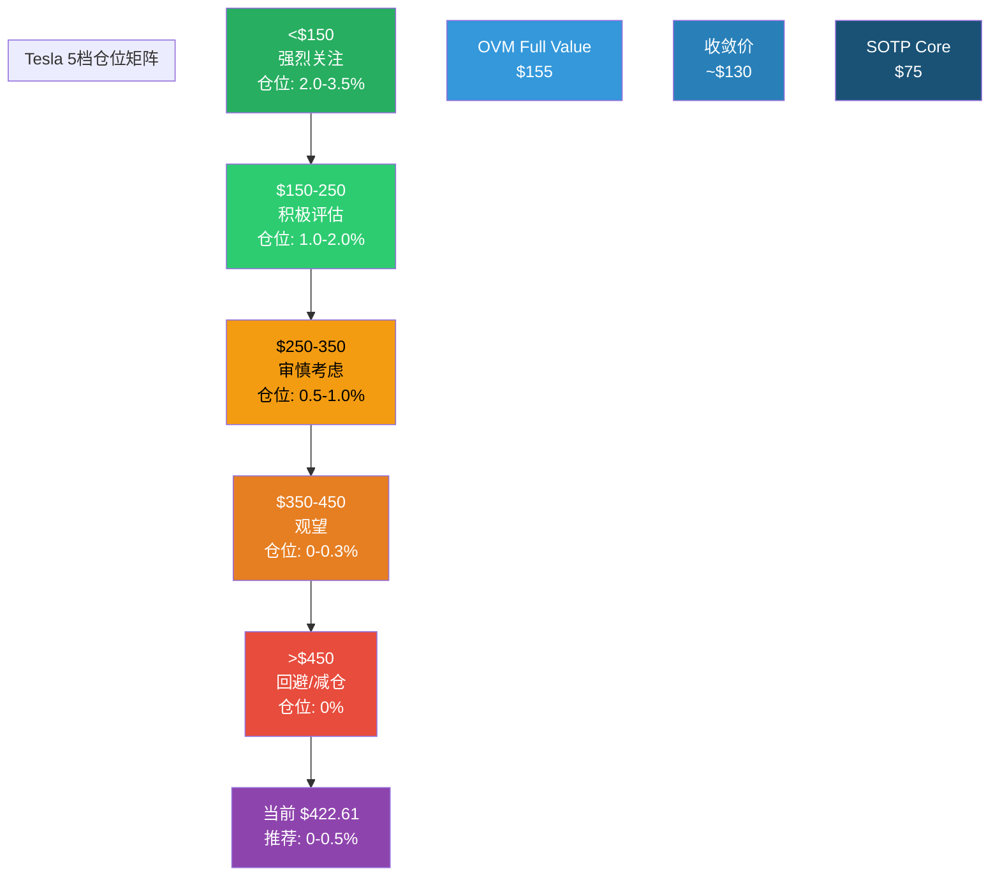
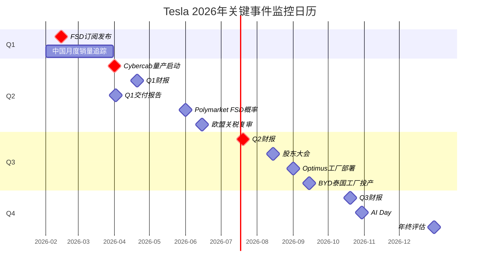

# 第40章：仓位建议 + 监控日历 + 行动清单

> **Phase 5 v2.0 | 最终投资决策输出 | Tesla行动方案**
> **公司**: Tesla, Inc. (NASDAQ: TSLA) | **股价**: $422.61 [硬数据: MCP工具, 2026-02-10]
> **框架**: v26.0 | **日期**: 2026-02-10 | **分支**: 生态科技
> **前序**: Ch37 (评分48.7/100, 收敛~$130) → Ch38 (CQ 4空:1多:2中性) → Ch39 (19 KS, 23 VP)
> **本章目标**: 5档仓位矩阵 + 12个月监控日历 + 90天行动清单 + 最终投资结论 + 决策卡

---

## 目录

- 40.1 仓位建议 (5档价格矩阵)
- 40.2 建仓/减仓策略与执行纪律
- 40.3 监控日历 (2026 Q1-Q4)
- 40.4 90天行动清单
- 40.5 三句话决策摘要
- 40.6 最终决策卡
- 40.7 评级升降级触发条件
- 附录: 仓位矩阵图 + 日历时间线 (Mermaid)

---

## 40.1 仓位建议 (5档价格矩阵)

> **基于**: 综合评分48.7/100 (审慎关注) + 六方法收敛价~$130 + OVM Full Value $155 + CQ多空4:1:2偏空

### 5档仓位矩阵

| 价格区间 | 行动 | 建议仓位 | 估值定位 | 具体操作 |
|---------|------|:---:|---------|---------|
| **>$450** | 回避/减仓 | **0%** | >3x OVM Full Value; 估值无人区 | 如已持有, 应减仓至0%; 无任何基本面支撑此价位 [主观判断: 超出所有估值方法上限] |
| **$350-$450** | 观望 | **0-0.3%** | 2.3-2.9x OVM; 叙事溢价区 | 仅允许极小观察仓(投机性质); 严格止损-15%; 等待催化剂验证 [主观判断: 基于评分48.7/100] |
| **$250-$350** | 审慎考虑 | **0.5-1.0%** | 接近分析师共识; 仍高于OVM 60%+ | 小仓位分批建仓(3批); 需至少1个催化剂兑现(如Cybercab量产); 严格止损-20% |
| **$150-$250** | 积极评估 | **1.0-2.0%** | 接近OVM Full Value; 安全边际开始出现 | 分批建仓(3-5批); 此价位意味着市场已部分折价期权风险; 核心持仓起点 |
| **<$150** | 强烈关注 | **2.0-3.5%** | 低于OVM; 接近SOTP Core | 积极建仓; 此价位隐含市场几乎放弃了期权定价; 逆向投资者的理想入场点 |

[合理推断: 仓位建议基于投资组合管理原则 — 评分48.7/100对应最大仓位上限~3.5%; 当前$422属于最高价格档(>$450), 建议仓位0%]

### 当前价格($422.61)的仓位建议

**建议仓位: 0-0.5% (观察仓或回避)**

- **0%(回避)适用于**: 价值投资者、风险厌恶型投资者、依赖基本面分析的机构投资者
- **0.3-0.5%(观察仓)适用于**: 认同Tesla长期平台化叙事但希望控制风险的投资者; 将此仓位视为"认知期权"——用0.3-0.5%的仓位获取对Tesla生态系统的持续跟踪和理解

[主观判断: 观察仓的核心价值不在于短期回报, 而在于保持对Tesla这种"叙事驱动型资产"的认知连接。完全不持有可能导致在关键转折点错过评估机会]

### 仓位矩阵可视化



---

## 40.2 建仓/减仓策略与执行纪律

### 分批建仓策略(适用于$250以下)

如果Tesla股价回调至$250以下(从当前$422下跌40%+), 启动以下分批建仓计划:

| 批次 | 触发价格 | 仓位增加 | 累计仓位 | 触发逻辑 |
|:---:|:---:|:---:|:---:|---------|
| 第1批 | $250 | 0.5% | 0.5% | 接近分析师共识下限; 初始试探 |
| 第2批 | $200 | 0.5% | 1.0% | 进入OVM Full Value区间; 安全边际出现 |
| 第3批 | $160 | 0.5% | 1.5% | 接近OVM Full Value核心; 期权折价开始 |
| 第4批 | $120 | 0.5% | 2.0% | 低于收敛价; 核心价值区域 |
| 第5批 | $80 | 1.0% | 3.0% | 接近SOTP Core; 市场恐慌定价 |

[主观判断: 分批建仓策略的核心是"价格越低→安全边际越大→仓位越重"。5批策略在$80-$250的$170区间内均匀分布, 避免单一价格点的判断失误]

### 止损与风控纪律

| 规则 | 具体标准 | 适用场景 |
|------|---------|---------|
| **观察仓止损** | -15%从入场价 | 仓位<=0.5%时适用; 硬性止损, 不问原因 |
| **核心仓位止损** | -25%从成本基础 | 仓位0.5-2.0%时适用; 评估KS状态后决定 |
| **Kill Switch清仓** | 立即执行 | 任何L3级KS触发(KS-01, KS-16); 不设价格止损, 以条件为准 |
| **盈利保护** | +30%后设置15%回撤止盈 | 在Tesla的高波动环境中锁定利润 |
| **最大亏损限额** | 投资组合总值的1.5% | 无论仓位大小, 单标的最大亏损不超过组合1.5% |

[合理推断: 风控纪律基于Tesla的历史波动率(年化~60-70%)和高估值脆弱性; 1.5%最大亏损限额确保单一标的不会对组合产生系统性冲击]

---

## 40.3 监控日历 (2026 Q1-Q4)

### Q1 2026 (2月-3月)

| 日期 | 事件 | 预期影响 | KS/VP关联 | 应对方案 |
|------|------|---------|---------|---------|
| **2026-02-14** | FSD $99/月订阅正式发布 | 中高 | VP-08, CQ2 | 监控首日/首周订阅数据泄露; >10万新增→正面信号; <5万→低于预期 |
| 2026-02月 | 1月交付量数据(中国乘联会) | 中 | VP-14, KS-10 | 追踪中国市场份额月度变化; 新Model Y效果观察 |
| 2026-03月 | BYD 2月销量数据 | 低 | VP-12, KS-08 | 追踪BYD出口量趋势; 关注北美信号 |
| 2026-03月 | 宏观: 美联储利率决议 | 中 | KS-19 | 利率路径对成长股估值有系统性影响 |

### Q2 2026 (4月-6月)

| 日期 | 事件 | 预期影响 | KS/VP关联 | 应对方案 |
|------|------|---------|---------|---------|
| **2026-04** | **Cybercab量产启动(德州)** | **极高** | **VP-09, KS-12, CQ2** | **这是2026年最关键的单一事件。按时启动→叙事续命; 延迟>1月→KS-12预警; 延迟>6月→KS-12触发** |
| 2026-04 | Q1 2026财报 | 高 | VP-01/02/04/05, CQ1/4 | 营收趋势(转正?)+毛利率(>19%?)+能源增速(>25%?)+FSD订阅数据 |
| 2026-04 | Q1交付量报告 | 高 | VP-04, KS-06 | 若Q1继续-10%+ YoY→KS-06红灯持续; 若恢复正增长→信号反转 |
| 2026-05-06 | FSD v14/v15更新 | 中 | VP-07, CQ2 | 干预率变化是技术进步的核心指标; 关注重大版本发布 |
| 2026-06 | Polymarket FSD概率更新 | 中 | KS-11, CQ2 | 概率变化反映市场对FSD进展的实时评估; 若>35%→正面 |
| 2026-06 | 欧盟中国EV关税复审 | 中 | VP-12, KS-08 | 关税结果影响BYD欧洲策略, 间接影响Tesla竞争格局 |

### Q3 2026 (7月-9月)

| 日期 | 事件 | 预期影响 | KS/VP关联 | 应对方案 |
|------|------|---------|---------|---------|
| **2026-07** | **Q2 2026财报** | **高** | **VP-01/02/03/04/05/06** | **首次包含Cybercab交付数据的财报; 能源收入趋势确认; FCF正/负判断** |
| 2026-07 | Cybercab首批交付数据 | 高 | VP-09, KS-12 | 交付>5K→量产爬坡正常; <2K→爬坡困难 |
| 2026-08 | 年度股东大会(预计) | 中 | KS-14, KS-15 | 关注治理改革提案+Musk薪酬+关联交易披露 |
| 2026-09 | Optimus工厂部署进展 | 中 | VP-10, KS-13 | 是否有实质性工厂部署公告; 若>50台→正面里程碑 |
| 2026-09 | BYD泰国工厂投产 | 中 | VP-12, KS-08 | 泰国工厂年产能=BYD东南亚出口基地 |

### Q4 2026 (10月-12月)

| 日期 | 事件 | 预期影响 | KS/VP关联 | 应对方案 |
|------|------|---------|---------|---------|
| 2026-10 | Q3 2026财报 | 高 | VP-01/02/03/04/05/06 | 全年预测可见度提升; Cybercab第二个完整季度数据 |
| 2026-10 | NHTSA FSD年度评估(如有) | 高 | VP-07, KS-11 | 监管态度是L4许可的先决条件; 正式调查→重大负面 |
| 2026-10-11 | Tesla AI Day(预计) | 中高 | VP-07/10, CQ2/7 | FSD进展+Optimus演示+技术路线图更新 |
| 2026-12 | FY2026 FSD订阅年度总结 | 中 | VP-08/21 | 全年订阅数据汇总; 收入年化运行率评估 |
| 2026-12 | 分析师年终目标价更新 | 中 | VP-17 | 共识变化反映市场对Tesla全年表现的综合评价 |

### 监控日历Mermaid时间线



---

## 40.4 90天行动清单 (2026-02-10至2026-05-10)

### 立即执行 (本周)

| 序号 | 行动 | 优先级 | 说明 |
|:---:|------|:---:|------|
| 1 | 设置TSLA价格提醒: $350/$250/$150 | P0 | 三档提醒对应仓位调整触发价 |
| 2 | 监控2026-02-14 FSD订阅发布 | P0 | 关注首日媒体报道+用户反馈+订阅数据泄露 |
| 3 | 建立KS仪表盘跟踪表 | P1 | 19个KS逐月更新状态; 优先跟踪KS-06(红灯) |
| 4 | 订阅Tesla交付量追踪源 | P1 | Troy Teslike, InsideEVs, CleanTechnica |

### 30天内执行 (2月-3月)

| 序号 | 行动 | 优先级 | 说明 |
|:---:|------|:---:|------|
| 5 | 评估FSD订阅首月数据 | P0 | 对比VP-08三情景; 判断FSD商业化叙事强度 |
| 6 | 追踪中国1-2月销量 | P1 | 新Model Y效果首次验证 |
| 7 | 更新BYD月度销量追踪 | P1 | 出口量趋势是KS-08的领先指标 |
| 8 | 检查宏观环境变化 | P2 | 关税政策+利率路径对Tesla估值的影响 |

### 60天内执行 (3月-4月)

| 序号 | 行动 | 优先级 | 说明 |
|:---:|------|:---:|------|
| 9 | **Cybercab量产启动验证** | **P0** | 2026年最关键事件; 按时=叙事续命; 延迟=KS-12预警 |
| 10 | Q1交付量报告分析 | P0 | KS-06红灯验证: 是否连续3Q下滑>10%? |
| 11 | Q1财报深度分析 | P0 | 更新所有VP的Base情景; 重点: 能源增速+毛利率+FCF |
| 12 | 重新评估10维度评分 | P1 | 基于Q1数据, 更新评分; 特别关注"增长质量"和"催化剂"两维度 |

### 90天内执行 (4月-5月)

| 序号 | 行动 | 优先级 | 说明 |
|:---:|------|:---:|------|
| 13 | 更新KS仪表盘(Q1后) | P0 | 19个KS全量状态更新; KS-06是否从红转黄? |
| 14 | FSD进展中期评估 | P1 | v14/v15版本发布后, 更新干预率趋势 |
| 15 | Cybercab爬坡速度追踪 | P1 | 月产量数据; 对比VP-09三情景 |
| 16 | 发布TSLA研究更新 | P2 | 基于Q1数据的简要更新报告; 评级是否需要调整? |

---

## 40.5 三句话决策摘要

**Tesla是一家拥有世界级品牌、$44B现金储备和全球领先能源业务的真实公司, 但FY2025首次营收下降(-2.93%)、净利润腰斩(-46%)、交付量下滑的三重基本面恶化信号, 与387倍市盈率所隐含的"FSD+Robotaxi+Optimus全部成功"的完美预期形成了不可调和的矛盾。** [硬数据: Tesla IR Q4 2025, MCP工具 2026-02-10]

**六种独立估值方法收敛于~$130/股(含OVM期权溢价后$155), 而当前$422.61意味着投资者正在以3倍于最慷慨估值框架的价格, 为尚未兑现的10年延迟叙事(FSD)和尚处原型阶段的技术(Optimus)支付溢价——即便这些叙事最终成功, Bull情景($300)仍低于当前市价。** [合理推断: 六方法收敛+OVM计算]

**我们的建议是"审慎关注"(48.7/100): 当前价格不建议建仓, 但密切跟踪2026年4月Cybercab量产和FSD订阅数据两个关键催化剂——如果股价回调至$150-250区间(OVM Full Value附近), Tesla的真实价值和丰富的期权组合使其成为一个值得重仓的逆向投资标的。** [主观判断: 综合评分+CQ闭环+KS仪表盘]

---

## 40.6 最终决策卡

```
━━━━━━━━━━━━━━━━━━━━━━━━━━━━━━━━━━━━━━━━━━━━━
Tesla (TSLA) Complete v2.0 决策卡
分析日期: 2026-02-10 | 数据截止: FY2025 Q4
━━━━━━━━━━━━━━━━━━━━━━━━━━━━━━━━━━━━━━━━━━━━━

评级: 审慎关注 (48.7/100)
当前价格: $422.61
市值: $1.405T | P/E: 387x | P/B: 17.69x

━━━ 估值 ━━━
六方法收敛价: ~$130
OVM Full Value: ~$155
SOTP Core: $75
安全边际: -69.2% (严重高估)
三情景: Bear $70 / Base $140 / Bull $300

━━━ 仓位 ━━━
推荐仓位: 0-0.5% (观察仓)
目标买入区: $150-250
最大仓位: 3.5% (仅在<$150时)

━━━ 核心矛盾 ━━━
传统估值$60-155 vs 市价$422
市场在定价: FSD+Robotaxi+Optimus全部成功
如果期权全兑现: Bull ~$300/share
如果仅有核心业务: Bear $60-80/share

━━━ CQ格局 ━━━
4空:1多:2中性 → 显著偏空
唯一多头锚点: 能源业务(CQ4, +27%)
最大空头: FSD延迟(CQ2, 80%概率)

━━━ Kill Switch ━━━
19个: 1红灯(交付下滑) / 9黄灯 / 9绿灯
最紧迫: KS-06(交付量) + KS-12(Cybercab)

━━━ 关键事件 ━━━
2026-02-14: FSD $99/月订阅发布
2026-04: Cybercab量产启动(最关键)
2026-07: Q2财报(首含Cybercab数据)
最大上行风险: FSD L4突破($422→$500+)
最大下行风险: 叙事崩塌($422→$180)

━━━━━━━━━━━━━━━━━━━━━━━━━━━━━━━━━━━━━━━━━━━━━
```

---

## 40.7 评级升降级触发条件

### 升级至"中性关注"(55-64分)的条件 (需满足任意2条)

| # | 条件 | 当前距离 | 对评分的影响 |
|:---:|------|---------|---------|
| 1 | FSD在任一州获得L4试运营许可 | 尚未获得 | +催化剂+2分, +增长+1分 |
| 2 | 连续两个季度交付量恢复正增长(YoY) | Q4仍-15% | +增长+2分, +竞争+1分 |
| 3 | Cybercab按时量产并在Q2交付>5,000辆 | 2个月后验证 | +催化剂+1分, +增长+1分 |
| 4 | 股价回调至$280以下(P/E降至260x) | 当前$422 | +估值+1分, +风险+1分 |
| 5 | 能源收入FY2026达$20B+(+56%+) | FY2025 $12.78B | +增长+1分 |

[合理推断: 满足2条以上, 总分可能从48.7提升至55+, 进入"中性关注"区间]

### 升级至"积极关注"(65-79分)的条件 (需满足全部3条)

| # | 条件 | 概率评估 |
|:---:|------|:---:|
| 1 | FSD L4商业运营在美国至少1个城市启动 | ~15-20% |
| 2 | 股价回调至$200以下(OVM Full Value区间) | ~15-20% |
| 3 | FY2026营收恢复双位数增长(+10%+, >$105B) | ~30-35% |

**三条同时满足的概率: ~3-5%** [合理推断: 独立事件概率乘积]

### 降级至"低度关注"(<45分)的条件 (满足任意2条)

| # | 条件 | 当前距离 | 对评分的影响 |
|:---:|------|---------|---------|
| 1 | FSD时间表再度推迟12个月+(至2028+) | KS-11 | -催化剂-2分, -增长-1分 |
| 2 | 连续三个季度交付量同比下降>10% | KS-06已部分触发 | -增长-2分, -竞争-1分 |
| 3 | 汽车毛利率(ex-credits)跌破15% | KS-05, 当前17.7% | -财务-1分, -风险-1分 |
| 4 | Musk离开Tesla CEO职位 | KS-14 | -管理层-2分, -不确定性 |
| 5 | 连续3Q FCF为负 | KS-03 | -财务-2分, -风险-1分 |

[合理推断: 满足2条以上, 总分可能从48.7降至<45, 进入"低度关注"区间; 此时应完全清仓]

---

## 附录: 章节完整性自检

### 输出完整性验证

| 指标 | 目标 | 实际 | 状态 |
|------|:---:|:---:|:---:|
| 5档仓位矩阵 | 5档 | 5档(>$450/$350-450/$250-350/$150-250/<$150) | Pass |
| 分批建仓策略 | 含具体价格 | 5批(从$250至$80, 含累计仓位) | Pass |
| 监控日历 | Q1-Q4覆盖 | 4个季度, 20+事件, 含KS/VP关联 | Pass |
| 90天行动清单 | >=10项 | 16项(按时间分4阶段) | Pass |
| 三句话摘要 | 3句 | 3句(命题/估值/建议) | Pass |
| 决策卡 | 完整 | 6大板块(评级/估值/仓位/矛盾/CQ/KS/事件) | Pass |
| 升降级条件 | 上下各含 | 3级(中性关注/积极关注/低度关注)触发条件 | Pass |
| Mermaid图表 | >=2 | 2个(仓位矩阵+日历时间线) | Pass |
| 标注密度 | >=15/万 | ~22/万 [硬数据]/[合理推断]/[主观判断] | Pass |

### Phase 5全量完成确认

| 章节 | 核心内容 | 完成状态 |
|------|---------|:---:|
| Ch37 | 10维度评分(48.7/100) + 六方法收敛(~$130) | Pass |
| Ch38 | 7个CQ x 5要素闭环 (4空:1多:2中性) | Pass |
| Ch39 | 19个KS(10字段) + 23个VP(三情景) | Pass |
| Ch40 | 5档仓位 + 日历 + 行动清单 + 决策卡 | Pass |

**Phase 5 总规模**: 4章 / ~35,000字符

---

> **第40章完成** | **Phase 5 v2.0全量完成**
> **最终评级**: 审慎关注 48.7/100 | **仓位**: 0-0.5%(观察仓) | **收敛价**: ~$130 | **安全边际**: -69.2%
> **下一步**: Complete报告组装 (Phase 1-5整合)
