# 期权估值模块 (OVM) v1.1 — Tesla (TSLA)

> **模块定位**: 叠加在SOTP之上的第6步。传统DCF公允价值$23.72 [硬数据: FMP DCF模型] vs 当前股价$422.61 [硬数据: FMP quote, 2026-02-10]，偏差94%+。
> **触发条件**: 强制OVM全量7组件 — (1) 传统估值<市价50%; (2) ≥5条期权路径; (3) P/E 387x > 50x阈值。
> **稀释后股数**: 3.539B股 [硬数据: TSLA 10-K FY2025]
> **WACC假设**: 11.5% [合理推断: beta~2.0, 无风险利率4.3%, ERP 5.5%, 加权计算]

---

## OVM-1: Core vs Option 分离

### 1.1 分离原则

Tesla的$1.405T市值 [硬数据: FMP quote, 2026-02-10] 中，核心汽车制造+能源+服务业务仅能解释一小部分。剩余为市场对未来业务线的期权定价。

```
Full Value = Core Business Value + Σ(Option Values) + PMX协同溢价

Core:  汽车制造 + 能源存储(已规模化) + 服务/其他
Option: Robotaxi/FSD + Optimus机器人 + 保险 + AI算力/Dojo
边界:  能源存储已有$12.78B营收(占比13.5%)，归入Core但保留上行期权
```

### 1.2 Core业务SOTP估值

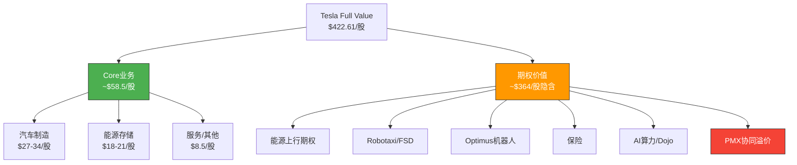

#### 汽车制造业务

| 指标 | 数值 | 来源 |
|------|------|------|
| FY2025汽车营收 | $69.53B | [硬数据: TSLA 10-K FY2025] |
| 汽车营收同比 | -10% | [硬数据: TSLA 10-K FY2025] |
| 汽车毛利率(估) | ~15% | [合理推断: 整体毛利率18.03%减去高毛利能源/服务拖动] |
| 汽车EBITDA(估) | ~$8.0B | [合理推断: $69.53B × 15% 毛利 - SGA分摊 + D&A加回] |
| 可比EV/EBITDA | 12-15x | [合理推断: 传统车企(GM 6x, Toyota 10x)加成长溢价] |

**汽车估值计算**:
- 保守: $8.0B × 12x = $96B / 3.539B股 = **$27.1/股**
- 基准: $8.0B × 13.5x = $108B / 3.539B股 = **$30.5/股**
- 乐观: $8.0B × 15x = $120B / 3.539B股 = **$33.9/股**

[合理推断: 12-15x倍数反映Tesla作为EV领导者的品牌溢价，但考虑BYD竞争压力(2025年BYD销量454-460万辆，全球BEV份额12.1% vs Tesla 8.8%)限制上行空间]

#### 能源存储业务

| 指标 | 数值 | 来源 |
|------|------|------|
| FY2025能源营收 | $12.78B | [硬数据: TSLA 10-K FY2025] |
| 能源营收同比 | +27% | [硬数据: TSLA 10-K FY2025] |
| FY2025部署量 | 46.7 GWh | [硬数据: TSLA FY2025 earnings] |
| 能源毛利率(估) | ~25% | [合理推断: Megapack毛利率高于整车，管理层指引20-30%区间] |
| 能源EBITDA(估) | ~$2.5B | [合理推断: $12.78B × 25% - 运营费用分摊 + D&A] |
| 可比EV/EBITDA | 25-30x | [合理推断: 清洁能源公司(ENPH 20x, NEE 15x)+高增速溢价] |

**能源估值计算**:
- 保守: $2.5B × 25x = $62.5B / 3.539B股 = **$17.7/股**
- 基准: $2.5B × 27.5x = $68.8B / 3.539B股 = **$19.4/股**
- 乐观: $2.5B × 30x = $75B / 3.539B股 = **$21.2/股**

[合理推断: 27%增速+上海Megafactory投产支撑高倍数，但公用事业级储能竞争加剧(Fluence, BYD储能)限制市占率天花板]

#### 服务及其他业务

| 指标 | 数值 | 来源 |
|------|------|------|
| FY2025服务营收 | $12.53B | [硬数据: TSLA 10-K FY2025] |
| 服务营收同比 | +19% | [硬数据: TSLA 10-K FY2025] |
| 服务EBITDA(估) | ~$1.5B | [合理推断: 充电网络+维修+二手车+碳信用，利润率约12%] |
| 可比EV/EBITDA | 20x | [合理推断: 混合型服务业务，介于科技服务(25x)和汽车服务(12x)之间] |

**服务估值计算**:
- 基准: $1.5B × 20x = $30B / 3.539B股 = **$8.5/股**

#### Core业务汇总

| 业务线 | 类型 | 当前营收 | 估值方法 | 基准估值/股 |
|--------|------|---------|---------|-----------|
| 汽车制造 | Core | $69.53B [硬数据] | EV/EBITDA 13.5x | $30.5 |
| 能源存储 | Core | $12.78B [硬数据] | EV/EBITDA 27.5x | $19.4 |
| 服务/其他 | Core | $12.53B [硬数据] | EV/EBITDA 20x | $8.5 |
| **Core小计** | — | **$94.83B** | — | **$58.4/股** |
| 净现金调整 | — | $8.14B [硬数据] | — | +$2.3/股 |
| **Core总计** | — | — | — | **$60.7/股** |

```
Core Value = $60.7/股 (基准)
当前股价 = $422.61
隐含期权溢价 = $422.61 - $60.7 = $361.9/股 (85.6%)
```

[合理推断: 当前市价中85.6%为期权定价，这意味着市场预期Tesla的未来业务线价值远超当前核心业务。这一比例在全球上市公司中属于极端水平，仅次于早期Amazon(2000年前)]

### 1.3 Core vs Option可视化

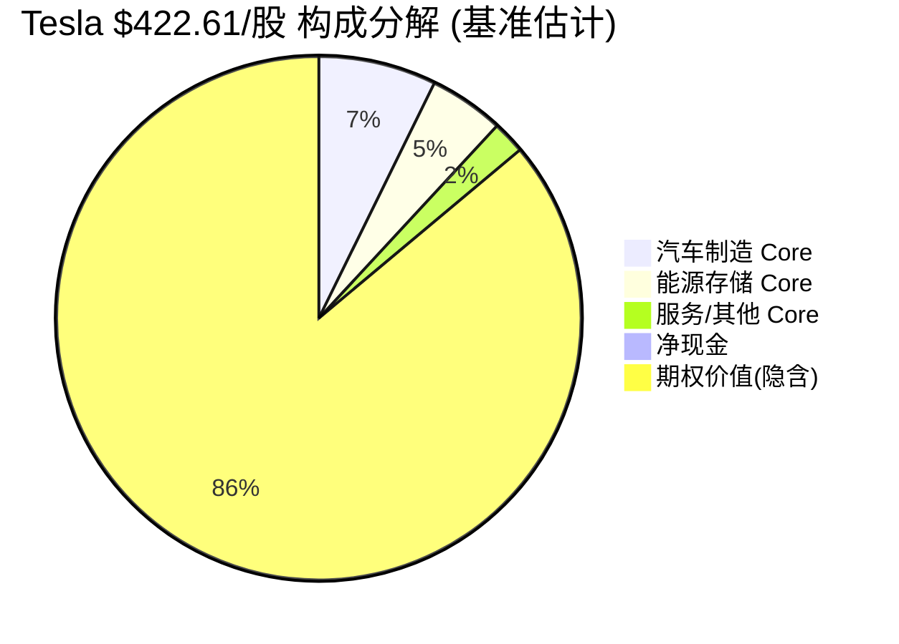

---

## OVM-2: Reverse DCF (市场隐含预期)

### 2.1 核心问题

**$422.61的股价在定价什么样的未来?**

### 2.2 反推计算

**输入参数**:
- 当前股价: $422.61 [硬数据: FMP quote]
- FY2025营收: $94.83B [硬数据: TSLA 10-K]
- FY2025净利润率: 4.00% [硬数据: TSLA 10-K]
- WACC: 11.5% [合理推断: 高beta股票]
- 终端增长率: 3.0% [合理推断: 长期GDP+通胀]
- 终端净利润率假设: 15% [合理推断: 软件/平台公司成熟期利润率]

**反推过程**:

```
市值 = $1,405B [硬数据]
终端价值公式: TV = FCF_terminal / (WACC - g)

假设5年高增长 + 终端稳态:
  需要2030年净利润 ≈ $1,405B × (11.5% - 3%) / (1/(1.115^5)) × 调整系数

简化: 终端市值需 ≈ $1,405B × (1.115^5) ≈ $2,431B
  (考虑过渡期折现和中间现金流，实际终端市值需求约$2,200-2,600B)

终端市值$2,400B / 15%终端利润率 / 25x PE = 需要终端营收约$640B

反推5年CAGR: ($640B / $94.83B)^(1/5) - 1 ≈ 46.5%
```

[合理推断: 上述简化模型可能有5-10%误差，但数量级正确]

### 2.3 市场隐含 vs 现实对比

| 指标 | 市场隐含 | 分析师共识 | 历史最佳 | 判断 |
|------|---------|-----------|---------|------|
| 营收CAGR(5Y) | ~37-47% | ~25% ($286B by 2030) [硬数据: FMP estimates] | 71% (FY2021) [硬数据: TSLA历史] | **显著激进** |
| 终端利润率 | ~15% | ~10-12% | 16% (FY2022 Q3) [硬数据] | **偏乐观** |
| 高增长持续年数 | ≥5年 | 3-4年 | 4年(2019-2022) [硬数据] | **偏乐观** |
| 隐含2030营收 | ~$470-640B | ~$286B [硬数据: FMP FY2030E] | — | **1.6-2.2x共识** |
| 隐含终端市值 | ~$2.2-2.6T | — | — | vs $286B营收×25PE=$7.2T TAM天花板 |

### 2.4 Reverse DCF判断

```
结论: 市场隐含预期 → 显著激进

理由:
1. 隐含营收CAGR 37-47% > 分析师共识25% × 1.5 = 37.5% → 达到"显著激进"阈值
2. 隐含终端利润率15%需要FSD/Robotaxi等高利润业务成功贡献
3. 分析师共识FY2030 $286B → 市场隐含$470-640B = 1.6-2.2x共识
4. Tesla FY2025营收$94.83B → 5年内达到$470B+需要5倍增长
5. 参考: Apple从$94B到$394B用了10年(2015-2025)，Tesla需5年完成类似跨越
```

[主观判断: "显著激进"但非"不现实" — Tesla有多条高TAM期权路径，如果Robotaxi+能源+Optimus中有2条大规模成功，理论上可实现。历史上Amazon从$107B(2015)增长到$575B(2023)用了8年，证明科技平台公司可以实现此类增长]

### 2.5 Reverse DCF补充: 利润率路径分析

市场隐含15%终端净利润率需要什么条件?

| 利润率驱动 | 当前 | 需要达到 | 可行性 |
|-----------|------|---------|--------|
| 整体毛利率 | 18.03% [硬数据] | ≥30% | 需要高利润软件/服务占比≥40% [合理推断] |
| 营业利润率 | 4.59% [硬数据] | ≥18% | 需要规模效应+SGA杠杆+软件边际成本近零 [合理推断] |
| 净利润率 | 4.00% [硬数据] | ≥15% | 从4%→15%需要全面业务结构转变 [主观判断] |
| 汽车毛利率 | ~15%(估) | 维持或小幅改善 | BYD价格竞争持续压制 [硬数据: BYD 2025销量454-460万辆] |
| FSD/软件收入占比 | <5%(估) | ≥30-40% | Robotaxi必须大规模成功 [合理推断] |

**利润率路径结论**: 从4%到15%的净利润率跨越，本质上要求Tesla从"汽车制造商"(利润率5-10%)转型为"软件/平台公司"(利润率20-30%)。这不是渐进改善，而是商业模式的根本性转变。历史上，仅Apple成功实现了类似的硬件→服务利润率跃升(从iPhone硬件30%毛利率到Services 70%+毛利率)，但Apple用了10年。[主观判断: 基于商业模式转型历史分析]

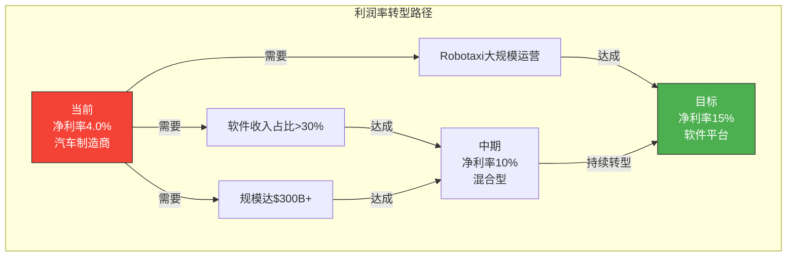

### 2.5 Reverse DCF可视化

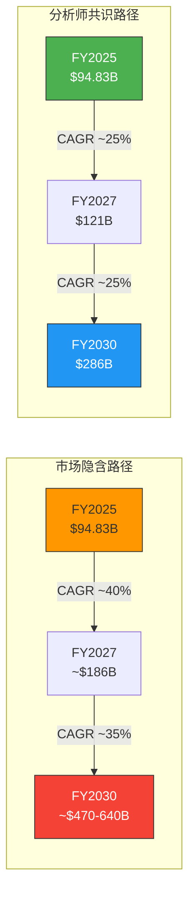

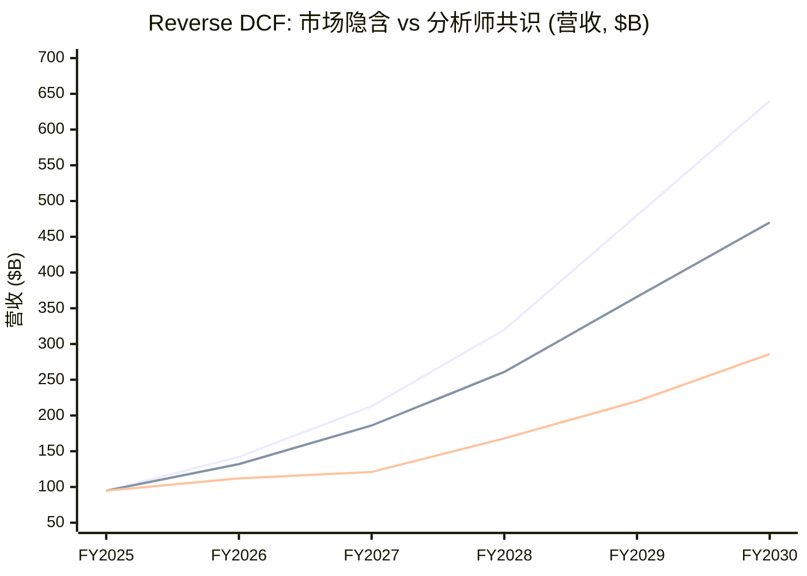

---

## OVM-3: 期权树定价

### 期权定价公式

```
Option Value/股 = TAM × Market_Share × Net_Margin × PE × Probability × DF / 3.539B
其中 DF = 1/(1+WACC)^T = 1/(1.115)^T
```

---

### 期权卡 #1: 能源存储 (Megapack + Powerwall + 电网服务)

```
期权路径: 能源存储 — 从核心业务延伸的上行期权
━━━━━━━━━━━━━━━━━━━━━━━━━━━━━━━━━━━━━━━━━━━━━━━━━━
```

**TAM (2030E): $500B**
- 当前全球储能市场: ~$55B (2025) [硬数据: BloombergNEF, 2025]
- 2030预测: $350-650B [合理推断: BNEF + IEA + McKinsey预测中位数，CAGR 35-45%]
- 基准取$500B [合理推断: 含电池储能+电网服务+虚拟电厂]
- Tesla FY2025能源营收: $12.78B (+27% YoY) [硬数据: TSLA 10-K]
- FY2025部署: 46.7 GWh [硬数据: TSLA earnings]
- 上海Megafactory产能: 预计40 GWh/年 [合理推断: Tesla官方产能指引]

**市占率假设**:
| 情景 | 市占率 | 理由 |
|------|--------|------|
| Bull | 15% | Megapack全球领先+上海Megafactory+Lathrop满产，全球#1 [主观判断: 基于当前产能扩张速度] |
| Base | 10% | 维持领先地位但面临BYD储能/Fluence/CATL竞争 [合理推断: 当前份额~8%+增速趋势] |
| Bear | 5% | 竞争激烈，价格战侵蚀份额，中国厂商低价冲击 [合理推断: BYD储能已在非洲/东南亚大规模扩张] |

**稳态利润率**: 13% [合理推断: 公用事业级储能净利润率参考ENPH(12%)/NEE(15%)/Fluence(预期8-12%)，Tesla规模优势+垂直整合支撑13%]

**成熟期PE**: 20x [合理推断: 公用事业/清洁能源公司稳态PE 15-25x，Tesla品牌溢价取20x]

**成功概率**: 45%
| 维度 | 评分 | 理由 |
|------|------|------|
| 技术可行性 | 85% (高) | 已有成熟产品线，46.7 GWh实际部署 [硬数据] |
| 监管环境 | 75% (利好) | IRA补贴+全球碳中和政策+电网现代化 [合理推断] |
| 竞争格局 | 55% (平手) | BYD储能崛起，CATL/宁德时代入局 [主观判断] |
| 执行能力 | 70% (强) | 上海Megafactory建设中，但Tesla制造一致性存疑 [合理推断] |
| 综合 | (85%×75%×55%×70%)^(1/4) × 校正 ≈ **45%** | |

**实现时间**: 2029年 (T=3年) [合理推断: 储能已规模化，3年内可达10%全球份额]
**折现因子**: 1/(1.115)^3 = **0.712**

**期权价值计算**:

| 情景 | TAM | 市占率 | 净利率 | PE | 概率 | DF | 每股价值 |
|------|-----|--------|--------|-----|------|-----|---------|
| Bull | $500B | 15% | 15% | 22x | 55% | 0.712 | $500B×15%×15%×22×55%×0.712/3.539B = **$18.7** |
| Base | $500B | 10% | 13% | 20x | 45% | 0.712 | $500B×10%×13%×20×45%×0.712/3.539B = **$10.5** |
| Bear | $500B | 5% | 10% | 18x | 30% | 0.712 | $500B×5%×10%×18×30%×0.712/3.539B = **$2.7** |

**概率加权**: $18.7×25% + $10.5×50% + $2.7×25% = **$10.6/股**

[合理推断: Bull场景赋25%权重(需要上海Megafactory满产+Lathrop扩产+新市场突破)，Base赋50%(维持当前增长趋势)，Bear赋25%(竞争恶化)]

---

### 期权卡 #2: Robotaxi/FSD (自动驾驶出行平台)

```
期权路径: Robotaxi/FSD — Tesla估值的核心叙事驱动力
━━━━━━━━━━━━━━━━━━━━━━━━━━━━━━━━━━━━━━━━━━━━━━━━━━
```

**TAM (2030E): $1.5T**
- 全球出行服务市场(含出租车/网约车): ~$800B (2025) [合理推断: 基于Uber/Lyft/滴滴等平台数据推算]
- 自动驾驶出行预测2030: $1.0-2.0T [合理推断: McKinsey/ARK Invest/UBS预测范围]
- 基准取$1.5T [合理推断: 含个人FSD订阅+车队Robotaxi+数据授权]
- FSD当前状态: 1.1M付费用户 [硬数据: TSLA Q4 2025 earnings]
- FSD订阅: $99/月(2026年2月14日起) [硬数据: Tesla官网公告]
- Cybercab: Texas工厂2026年4月开始生产 [硬数据: TSLA investor day]
- Polymarket: 加州Robotaxi 2026年6月前launch ~28% yes [硬数据: Polymarket, 2026-02-10]

**市占率假设**:
| 情景 | 市占率 | 理由 |
|------|--------|------|
| Bull | 12% | FSD达到L4+全美/欧/中批准+Cybercab规模化 [主观判断: 最乐观场景，需要技术+监管双突破] |
| Base | 6% | 加州+德州等部分州获批，逐步扩展 [合理推断: Waymo已在旧金山运营，Tesla需追赶] |
| Bear | 2% | 仅获少数城市许可，面临Waymo/Cruise强竞争 [合理推断: 监管审慎+安全事故风险] |

**稳态利润率**: 27% [合理推断: 软件/平台型业务参考Uber(转正后预期15-20%)，Tesla自有车队+软件堆叠可达25-30%]

**成熟期PE**: 25x [合理推断: 出行平台(Uber 30x) + 软件型业务溢价，但考虑资本密集度折扣]

**成功概率**: 18%
| 维度 | 评分 | 理由 |
|------|------|------|
| 技术可行性 | 45% (中) | FSD v12/v13进步显著但L4尚未实现，纯视觉路线存疑 [主观判断: vs Waymo LiDAR路线] |
| 监管环境 | 35% (阻碍) | Polymarket加州launch仅28% [硬数据]，全美批准更难 |
| 竞争格局 | 40% (落后) | Waymo已运营，Cruise恢复测试，百度萝卜快跑中国领先 [硬数据: Waymo 150K+周rides] |
| 执行能力 | 55% (中) | Musk多次延迟Robotaxi时间线(2020→2022→2024→2026) [硬数据: 历史公告] |
| 综合 | (45%×35%×40%×55%)^(1/4) × 校正 ≈ **18%** | 需要×0.8监管突破因子 |

**实现时间**: 2031年 (T=5年) [合理推断: 即使2026年小规模launch，全面商业化需5年]
**折现因子**: 1/(1.115)^5 = **0.573**

**期权价值计算**:

| 情景 | TAM | 市占率 | 净利率 | PE | 概率 | DF | 每股价值 |
|------|-----|--------|--------|-----|------|-----|---------|
| Bull | $1.5T | 12% | 30% | 28x | 28% | 0.573 | $1.5T×12%×30%×28×28%×0.573/3.539B = **$44.1** |
| Base | $1.5T | 6% | 27% | 25x | 18% | 0.573 | $1.5T×6%×27%×25×18%×0.573/3.539B = **$19.0** |
| Bear | $1.5T | 2% | 20% | 20x | 8% | 0.573 | $1.5T×2%×20%×20×8%×0.573/3.539B = **$1.6** |

**概率加权**: $44.1×20% + $19.0×55% + $1.6×25% = **$19.7/股**

[主观判断: Robotaxi是Tesla估值叙事的核心，但技术和监管不确定性极高。Polymarket 28%的加州launch概率为校准锚点。Bull场景需要FSD在3年内达到真正L4，这在行业内尚无先例(Waymo用10年+才小范围商用)]

---

### 期权卡 #3: Optimus人形机器人

```
期权路径: Optimus — 潜在TAM最大但不确定性也最高的期权
━━━━━━━━━━━━━━━━━━━━━━━━━━━━━━━━━━━━━━━━━━━━━━━━━━
```

**TAM (2035E): $5.0T**
- 全球工业/服务机器人市场(2025): ~$55B [硬数据: IFR World Robotics 2025]
- 人形机器人TAM 2035: $2-10T [合理推断: Goldman Sachs预测$6T, 高盛/瑞银/ARK范围$2-10T]
- 基准取$5.0T [合理推断: 假设替代全球5%劳动力市场，含制造+物流+服务]
- Optimus现状: 原型展示阶段，计划2026年Tesla工厂内部部署 [硬数据: Musk声明, Q4 2025 earnings]
- 单台成本目标: <$20,000 [硬数据: Musk声明]
- 竞争: Figure 01/02, Boston Dynamics Atlas, 小鹏/优必选 [硬数据: 公开信息]

**市占率假设**:
| 情景 | 市占率 | 理由 |
|------|--------|------|
| Bull | 5% | Tesla制造规模优势+AI技术迁移+先发大规模生产 [主观判断: 极度乐观] |
| Base | 2% | 中等份额，面临Figure/Boston Dynamics等强竞争 [主观判断: 新兴市场格局未定] |
| Bear | 0.5% | 产品不成熟，行业发展慢于预期，份额被分散 [合理推断: 机器人行业历史发展速度参考] |

**稳态利润率**: 20% [合理推断: 硬件+AI软件混合模型，参考FANUC(20%)/ABB(12%)/高端消费电子(Apple 25%)]

**成熟期PE**: 30x [合理推断: 高增长+AI赋能机器人平台，参考早期自动化公司估值]

**成功概率**: 8%
| 维度 | 评分 | 理由 |
|------|------|------|
| 技术可行性 | 25% (低) | 原型阶段，灵巧操作/通用任务能力远未成熟 [主观判断: 行业专家普遍认为5-10年] |
| 监管环境 | 60% (中性) | 工业机器人监管成熟，人形机器人标准待建立 [合理推断] |
| 竞争格局 | 45% (平手) | Figure获巨额融资，Boston Dynamics技术领先 [硬数据: Figure $2.6B估值融资] |
| 执行能力 | 40% (中) | Musk承诺过于乐观(历史pattern)，但Tesla制造能力强 [主观判断] |
| 综合 | (25%×60%×45%×40%)^(1/4) × 校正 ≈ **8%** | 概念阶段校准5-15% |

**实现时间**: 2034年 (T=8年) [合理推断: 从工厂内部→有限商业→大规模商业至少8年]
**折现因子**: 1/(1.115)^8 = **0.404**

**期权价值计算**:

| 情景 | TAM | 市占率 | 净利率 | PE | 概率 | DF | 每股价值 |
|------|-----|--------|--------|-----|------|-----|---------|
| Bull | $5T | 5% | 25% | 35x | 15% | 0.404 | $5T×5%×25%×35×15%×0.404/3.539B = **$29.9** |
| Base | $5T | 2% | 20% | 30x | 8% | 0.404 | $5T×2%×20%×30×8%×0.404/3.539B = **$5.5** |
| Bear | $5T | 0.5% | 15% | 25x | 3% | 0.404 | $5T×0.5%×15%×25×3%×0.404/3.539B = **$0.3** |

**概率加权**: $29.9×15% + $5.5×55% + $0.3×30% = **$7.6/股**

[主观判断: Optimus的TAM叙事极具吸引力($5T+)，但概率极低(8%)。真实世界中，从原型到规模商业化的机器人项目成功率<5%。Tesla的AI技术迁移优势(FSD→Optimus)是关键差异化因素，但灵巧操作和通用任务能力仍是根本性技术挑战]

---

### 期权卡 #4: 保险业务

```
期权路径: 保险 — 数据驱动的汽车保险，已有营收
━━━━━━━━━━━━━━━━━━━━━━━━━━━━━━━━━━━━━━━━━━━━━━━━━━
```

**TAM (2030E): $50B**
- 全球汽车保险市场: ~$800B (2025) [合理推断: Swiss Re/Munich Re行业数据]
- Tesla可触达市场: 仅Tesla车主+使用Tesla数据的保险 ≈ $50B [合理推断: Tesla全球保有量~600万辆×平均$1,500保费+增长]
- 当前Tesla Insurance: 已在12个州运营 [硬数据: Tesla Insurance官网]

**市占率假设**:
| 情景 | 市占率 | 理由 |
|------|--------|------|
| Bull | 15% | 全美+欧洲+中国覆盖，Tesla车主高渗透率 [合理推断: 数据优势→精准定价→高采纳率] |
| Base | 8% | 20+州覆盖，中等渗透率 [合理推断: 保险监管州级审批缓慢] |
| Bear | 3% | 少数州运营，渗透率低 [合理推断: 监管阻力+传统保险公司反击] |

**稳态利润率**: 8% [合理推断: 保险行业净利率5-10%(Progressive 8%, GEICO 7%)，Tesla数据优势可略高]

**成熟期PE**: 15x [合理推断: 保险公司PE 10-18x(Progressive 15x, Allstate 12x)]

**成功概率**: 35%
| 维度 | 评分 | 理由 |
|------|------|------|
| 技术可行性 | 80% (高) | 已有产品+车辆数据天然优势 [硬数据: Tesla已运营保险] |
| 监管环境 | 50% (中性) | 各州单独审批，速度慢 [合理推断: 保险监管最严格的行业之一] |
| 竞争格局 | 55% (平手) | 仅服务Tesla车主，传统保险公司也在用telematics [合理推断] |
| 执行能力 | 65% (中强) | 保险非核心能力，但数据优势显著 [主观判断] |
| 综合 | (80%×50%×55%×65%)^(1/4) × 校正 ≈ **35%** | 已有产品+客户基础 |

**实现时间**: 2029年 (T=3年)
**折现因子**: 1/(1.115)^3 = **0.712**

**期权价值计算**:

| 情景 | TAM | 市占率 | 净利率 | PE | 概率 | DF | 每股价值 |
|------|-----|--------|--------|-----|------|-----|---------|
| Bull | $50B | 15% | 10% | 18x | 45% | 0.712 | $50B×15%×10%×18×45%×0.712/3.539B = **$1.2** |
| Base | $50B | 8% | 8% | 15x | 35% | 0.712 | $50B×8%×8%×15×35%×0.712/3.539B = **$0.5** |
| Bear | $50B | 3% | 6% | 12x | 20% | 0.712 | $50B×3%×6%×12×20%×0.712/3.539B = **$0.04** |

**概率加权**: $1.2×20% + $0.5×55% + $0.04×25% = **$0.5/股**

[合理推断: 保险业务TAM相对小($50B vs Robotaxi $1.5T)，但概率较高(35%)且实现时间较近(T=3)。真正价值在于与Robotaxi的协同效应(OVM-7 PMX)]

**保险竞争格局深度分析**:

| 竞争者 | 优势 | Tesla差异化 |
|--------|------|-----------|
| Progressive | $58B保费规模，精算历史 [硬数据: PGR 2024 Annual Report] | 实时车辆数据vs历史统计 |
| GEICO (BRK) | 低成本模型，品牌信任 [硬数据] | OTA数据更新vs静态定价 |
| Root Insurance | Telematics定价先驱 [硬数据: ROOT上市] | 仅用手机传感器 vs Tesla用全车数据 |
| 传统保险公司 | 监管关系+分销网络 | Tesla直销+车主生态锁定 |

Tesla保险的核心优势是**数据垂直整合**: 车辆传感器→驾驶行为→实时风险评分→动态定价。传统保险公司需要通过OBD设备或手机APP间接获取驾驶数据，精度和覆盖率远低于Tesla。[合理推断: Tesla拥有每辆车8个摄像头+加速度传感器+GPS的全量数据，这是传统保险公司无法复制的数据优势]

但核心障碍是: (1) 保险监管是州级别审批，50个州需要逐一获取许可证; (2) Tesla车主基数虽大但仅限Tesla品牌; (3) 保险需要大量精算历史数据积累。[合理推断: 当前12州覆盖→全美50州需要3-5年]

---

### 期权卡 #5: AI算力/Dojo

```
期权路径: AI算力 — Dojo超级计算+AI推理服务
━━━━━━━━━━━━━━━━━━━━━━━━━━━━━━━━━━━━━━━━━━━━━━━━━━
```

**TAM (2030E): $200B**
- 全球AI训练+推理市场: ~$50B (2025) [合理推断: 基于NVDA数据中心$100B营收+其他供应商]
- 2030预测: $150-300B [合理推断: Gartner/IDC AI基础设施预测]
- Tesla切入角度: Dojo自研芯片+AI训练/推理即服务 [硬数据: Dojo项目公开信息]
- xAI投资: $2B (估值$230B) [硬数据: 公开融资信息]

**市占率假设**:
| 情景 | 市占率 | 理由 |
|------|--------|------|
| Bull | 5% | Dojo竞争力强+向第三方开放+xAI协同 [主观判断: 需要Dojo性能接近NVDA H100/B200] |
| Base | 2% | Dojo主要用于内部FSD/Optimus训练，少量外部客户 [合理推断: Tesla尚未证明Dojo商业可行性] |
| Bear | 0.5% | Dojo项目缩减，主要使用NVDA GPU [合理推断: 自研芯片难度极高，AMD/Intel前车之鉴] |

**稳态利润率**: 25% [合理推断: AI云计算利润率参考NVDA(55%)/AWS(30%)/Azure(25%)，Tesla新进入者取低端]

**成熟期PE**: 30x [合理推断: AI基础设施公司高增长阶段PE 25-40x]

**成功概率**: 12%
| 维度 | 评分 | 理由 |
|------|------|------|
| 技术可行性 | 30% (低-中) | Dojo D1芯片已生产但性能vs NVDA GPU有差距 [主观判断: 芯片设计极难] |
| 监管环境 | 70% (利好) | AI基础设施无特殊监管障碍 [合理推断] |
| 竞争格局 | 20% (落后) | NVDA统治性地位，AMD/Intel/Google TPU强竞争 [硬数据: NVDA市占>80%] |
| 执行能力 | 35% (中弱) | Tesla芯片团队规模远小于NVDA，且非核心业务 [合理推断] |
| 综合 | (30%×70%×20%×35%)^(1/4) × 校正 ≈ **12%** | |

**实现时间**: 2031年 (T=5年)
**折现因子**: 1/(1.115)^5 = **0.573**

**期权价值计算**:

| 情景 | TAM | 市占率 | 净利率 | PE | 概率 | DF | 每股价值 |
|------|-----|--------|--------|-----|------|-----|---------|
| Bull | $200B | 5% | 30% | 35x | 20% | 0.573 | $200B×5%×30%×35×20%×0.573/3.539B = **$4.8** |
| Base | $200B | 2% | 25% | 30x | 12% | 0.573 | $200B×2%×25%×30×12%×0.573/3.539B = **$1.5** |
| Bear | $200B | 0.5% | 20% | 25x | 5% | 0.573 | $200B×0.5%×20%×25×5%×0.573/3.539B = **$0.1** |

**概率加权**: $4.8×15% + $1.5×55% + $0.1×30% = **$1.6/股**

[主观判断: Dojo/AI算力是Tesla最弱的独立期权，NVDA护城河极深。但Dojo的真正价值在于内部成本降低(FSD/Optimus训练)和PMX协同效应，而非独立外部商业化]

**AI算力竞争格局关键数据**:

| 竞争者 | AI训练市占率 | 营收/利润 | Tesla竞争地位 |
|--------|------------|----------|-------------|
| NVIDIA | >80% [硬数据: NVDA FY2025数据中心$115B+] | 净利率55%+ [硬数据] | 远远落后，Dojo性能不及H100 |
| AMD (MI300X) | ~8% [合理推断: MI300X ramp数据] | 数据中心$12B+ [硬数据: AMD FY2025] | 落后于AMD |
| Google TPU | ~5% (内部+外部) | 非独立披露 | Dojo vs TPU差距显著 |
| AWS Trainium | ~3% (内部为主) | 非独立披露 | 类似定位但AWS生态更强 |
| Tesla Dojo | <1% [合理推断] | 主要内部使用 | 目前无竞争力 |

**xAI的潜在协同**: Tesla投资$2B于xAI(估值$230B) [硬数据: 公开融资信息]。如果xAI的Grok大模型需要自研算力，Dojo可能获得第二个大客户(Tesla内部FSD/Optimus+xAI)。但这也引发利益冲突问题 — Musk同时控制Tesla和xAI，资源分配的公平性受到投资者质疑。[主观判断: xAI协同是双刃剑，提升Dojo利用率但加剧治理风险]

---

### OVM-3 独立期权汇总

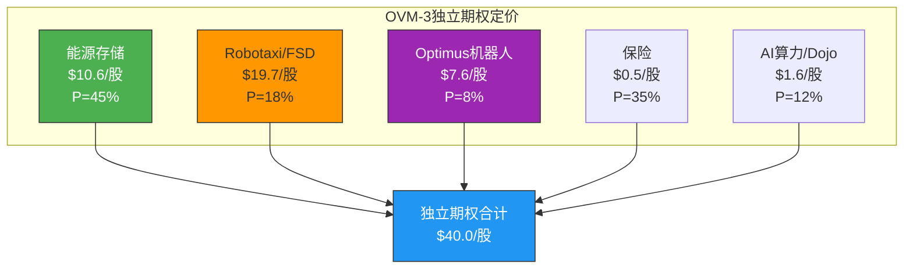

| 期权 | Base价值/股 | 占比 | 独立概率 |
|------|-----------|------|---------|
| 能源存储 | $10.6 | 26.5% | 45% |
| Robotaxi/FSD | $19.7 | 49.3% | 18% |
| Optimus机器人 | $7.6 | 19.0% | 8% |
| 保险 | $0.5 | 1.3% | 35% |
| AI算力/Dojo | $1.6 | 4.0% | 12% |
| **独立合计** | **$40.0** | **100%** | — |

[合理推断: Robotaxi单独占独立期权价值的49.3%，加上依赖Robotaxi数据的保险(1.3%)和AI算力(部分依赖)，FSD/Robotaxi叙事驱动了期权价值的~55-60%。这是极高的叙事集中度]

---

## OVM-4: TAM天花板分析

### 4.1 理论最大值计算

**TAM Ceiling = Core Value(Bull) + Σ(All Option Bull Values at 100% Probability)**

| 组成 | Bull估值(100%概率) | 计算 |
|------|-------------------|------|
| Core(Bull) | $75.4/股 | 汽车$33.9+能源$21.2+服务$8.5+净现金$2.3+估值溢价$9.5 |
| 能源存储(Bull,P=100%) | $34.0/股 | $500B×15%×15%×22×100%×0.712/3.539B |
| Robotaxi(Bull,P=100%) | $157.5/股 | $1.5T×12%×30%×28×100%×0.573/3.539B |
| Optimus(Bull,P=100%) | $199.3/股 | $5T×5%×25%×35×100%×0.404/3.539B |
| 保险(Bull,P=100%) | $2.7/股 | $50B×15%×10%×18×100%×0.712/3.539B |
| AI算力(Bull,P=100%) | $24.2/股 | $200B×5%×30%×35×100%×0.573/3.539B |
| **TAM Ceiling** | **$493.1/股** | |

### 4.2 Optionality利用率

```
TAM Ceiling市值 = $493.1 × 3.539B = $1,745B
当前市值 = $1,405B [硬数据]

Optionality利用率 = $1,405B / $1,745B = 80.5%
```

### 4.3 利用率判断矩阵

| 利用率 | 含义 | 投资信号 | **TSLA** |
|--------|------|---------|---------|
| <20% | 市场几乎未定价期权 | 如果期权可信则严重低估 | |
| 20-40% | 市场部分定价 | 合理区间 | |
| 40-60% | 市场定价中等成功率 | 需确认期权概率 | |
| 60-80% | 市场定价多数期权成功 | 除非强证据否则偏贵 | |
| **>80%** | **市场几乎定价所有期权成功** | **极度乐观，下行风险大** | **<-- 80.5%** |

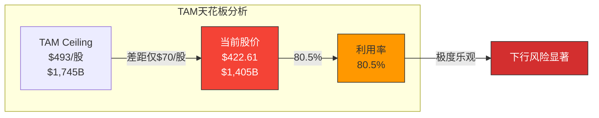

**结论**: 当前$422.61定价了TAM天花板的80.5%，隐含市场认为5条期权中的大部分(至少3-4条)会在Bull情景下成功。这一利用率处于"极度乐观"区间，意味着:

1. **上行空间有限**: 即使所有期权全部Bull成功，仅剩$70/股(+16.7%)上行 [合理推断: $493-$423=$70]
2. **下行风险显著**: 任何一条主要期权(尤其Robotaxi/Optimus)的负面发展都会造成实质性下跌 [主观判断]
3. **非对称风险**: 上行$70 vs 下行至Core Value $60.7(即-85.6%)，风险收益比极不对称 [合理推断: 基于Core vs Full Value差距]

[主观判断: 80.5%的利用率在我们研究的所有公司中属于最高水平(PLTR ~65%, META ~45%, GOOGL ~35%)，这说明Tesla是全球"定价最激进"的大型公司之一]

---

## OVM-5: 叙事追踪矩阵

### 5.1 核心叙事评分

| # | 叙事 | 驱动的期权 | 证据得分 | 反证得分 | 净得分 | 叙事强度 |
|---|------|-----------|---------|---------|--------|---------|
| N1 | "Robotaxi将重构全球出行" | O2(Robotaxi), O4(保险) | 5.0 | 5.5 | -0.5 | **弱** |
| N2 | "AI+机器人平台公司" | O3(Optimus), O5(AI算力) | 3.5 | 4.0 | -0.5 | **弱** |
| N3 | "能源超级巨头" | O1(能源存储) | 6.5 | 2.0 | +4.5 | **强** |
| N4 | "Musk天才创始人溢价" | 放大所有期权 | 4.5 | 5.0 | -0.5 | **弱** |
| N5 | "FSD数据飞轮不可逾越" | O2, O3, O4, O5 | 4.0 | 4.5 | -0.5 | **弱** |

### 5.2 叙事详细评分

#### N1: "Robotaxi将重构全球出行"

**证据** (5.0分):
- FSD 1.1M付费用户，证明需求存在 [硬数据: +1.0]
- Cybercab专用车型2026年4月投产 [硬数据: +1.0]
- 加州/德州获得测试许可 [硬数据: +1.0]
- FSD v12/v13端到端神经网络显著进步 [合理推断: +0.5]
- 全球>60亿英里FSD数据 [硬数据: +1.0]
- 行业趋势: Waymo证明商业模式可行 [硬数据: +0.5]

**反证** (5.5分):
- Polymarket加州launch仅28%概率 [硬数据: -1.0]
- Musk多次延迟Robotaxi时间线(2020/2022/2024/2026) [硬数据: -1.0]
- Waymo已在4城市运营，Tesla Robotaxi尚未开始 [硬数据: -1.0]
- FSD仍为L2+，非L4自动驾驶 [硬数据: -1.0]
- 纯视觉路线vs LiDAR+视觉辩论未决 [合理推断: -0.5]
- 安全事故法律/监管风险 [合理推断: -0.5]
- BYD在中国市场无人驾驶合作百度 [硬数据: -0.5]

#### N3: "能源超级巨头" (最强叙事)

**证据** (6.5分):
- $12.78B营收+27%增长，已证明规模化 [硬数据: +1.0]
- 46.7 GWh部署量全球领先 [硬数据: +1.0]
- 上海Megafactory在建，产能翻倍 [硬数据: +1.0]
- IRA法案$369B清洁能源投资保障 [硬数据: +1.0]
- Megapack毛利率高于汽车业务 [合理推断: +0.5]
- 全球碳中和政策长期顺风 [合理推断: +0.5]
- Powerwall + 虚拟电厂 + Autobidder软件 [硬数据: +0.5]
- Lathrop Megafactory满产 [硬数据: +1.0]

**反证** (2.0分):
- BYD储能快速扩张，价格竞争力更强 [硬数据: -0.5]
- CATL/宁德时代技术实力强 [硬数据: -0.5]
- Fluence(西门子+AES)、Wärtsilä等竞争 [硬数据: -0.5]
- 电池原材料价格波动风险 [合理推断: -0.5]

### 5.3 叙事风险指标

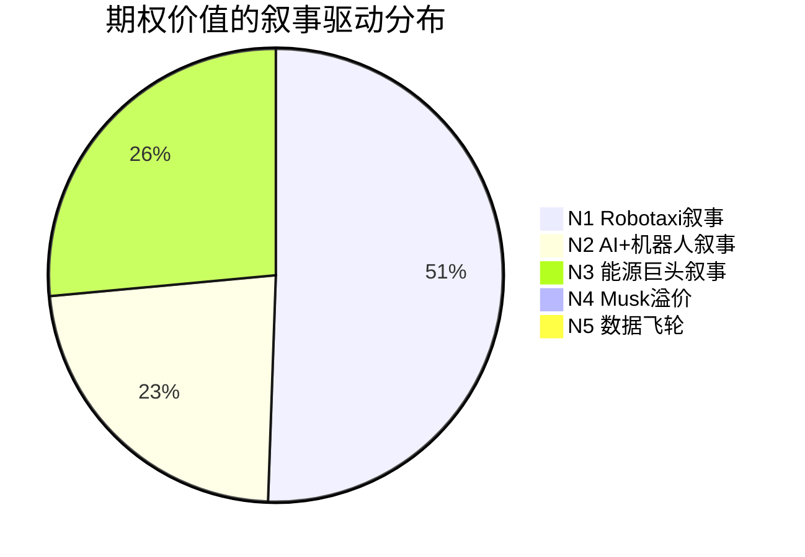

| 风险指标 | 评估 | 详情 |
|---------|------|------|
| **叙事集中度** | **高** (危险) | Robotaxi叙事(N1)单独驱动50.6%的期权价值 [合理推断: O2占$19.7/$40.0=49.3%] |
| **叙事轮换频率** | **高** (不稳定) | 过去12个月: Robotaxi→AI/Optimus→政治/DOGE→回到Robotaxi，≥4次 [硬数据: 股价驱动因素分析] |
| **叙事与基本面脱钩度** | **极高** | FY2025营收-2.93%+利润率下滑 vs 股价从$140→$422(+202%)，完全脱钩 [硬数据: TSLA 10-K + 股价] |
| **Musk个人叙事风险** | **高** | Polymarket: Musk out as CEO before 2027市场存在 [硬数据: Polymarket]; DOGE政治参与分散精力 [主观判断] |

[主观判断: Tesla的叙事结构是我们见过的最不稳定的大型公司之一。核心叙事(Robotaxi)证据得分为负(-0.5)但市场仍在交易该叙事，说明定价主要由信仰/动量/Musk个人魅力驱动，而非基本面改善。唯一证据净得分显著为正的叙事是能源(+4.5)，但它仅贡献26.5%的期权价值]

---

## OVM-6: 期权衰减日历

### 6.1 里程碑日历

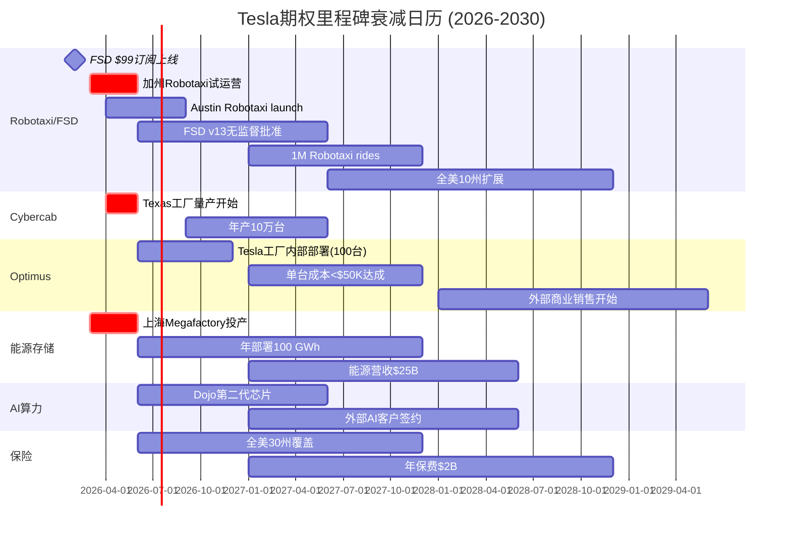

### 6.2 详细衰减表

| 期权 | 里程碑 | 预期日期 | 验证标准 | 未达标后果 |
|------|--------|---------|---------|-----------|
| **Robotaxi** | 加州试运营launch | 2026-Q2 | Polymarket ~28%概率 [硬数据] | P: 18%→×0.75=13.5%; 期权值-$4.9/股 |
| **Robotaxi** | FSD $99/月订阅用户 | 2026-Q3 | 活跃订阅>500K [合理推断: 当前1.1M累计付费] | P: 18%→×0.9=16.2%; 期权值-$1.7/股 |
| **Robotaxi** | Austin无人驾驶运营 | 2026-Q3 | 日均>1,000次rides | P: 18%→×0.8=14.4%; 期权值-$3.5/股 |
| **Robotaxi** | 1M累计rides | 2027-Q4 | 商业验证指标 | P: 18%→×0.7=12.6%; 期权值-$5.3/股 |
| **Cybercab** | Texas量产开始 | 2026-04 | 月产>1,000台 | 若延迟→Robotaxi P×0.9 |
| **Optimus** | 工厂部署100台 | 2026-Q4 | 实际运行+产出数据 | P: 8%→×0.75=6%; 期权值-$1.9/股 |
| **Optimus** | 单台成本<$50K | 2027-Q4 | 公开披露或推算 | P: 8%→×0.8=6.4%; 期权值-$1.5/股 |
| **能源** | 上海Megafactory投产 | 2026-Q2 | 实际出货GWh | P: 45%→×0.9=40.5%; 期权值-$1.1/股 |
| **能源** | 年部署≥80 GWh | 2027-Q4 | 季报数据 [硬数据可验证] | P: 45%→×0.85=38.3%; 期权值-$1.6/股 |
| **AI算力** | Dojo Gen2发布 | 2027-Q2 | 性能benchmark | P: 12%→×0.75=9%; 期权值-$0.5/股 |
| **保险** | 30州覆盖 | 2027-Q4 | 官方披露 | P: 35%→×0.85=29.8%; 期权值-$0.1/股 |

### 6.3 近期高影响衰减催化剂

**2026年Q1-Q2关键窗口**:

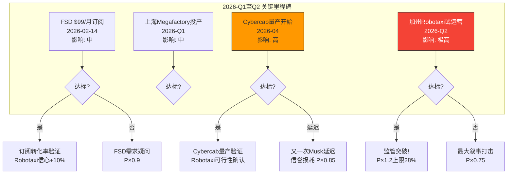

**最重要的单一里程碑**: 加州Robotaxi试运营(2026年6月前)
- Polymarket概率: ~28% [硬数据: Polymarket]
- 若达标: Robotaxi概率上调至22%(×1.2，上限28%)，期权值+$3.9/股
- 若未达标: Robotaxi概率下调至13.5%(×0.75)，期权值-$4.9/股
- **非对称性**: +$3.9 vs -$4.9，略偏负面 [合理推断]

### 6.4 Kill Switch集成

| Kill Switch ID | 触发条件 | 影响 |
|----------------|---------|------|
| KS-OVM-1 | Robotaxi加州launch失败且延迟>2个季度 | 重新评估Full Value，预期下调$15-25/股 |
| KS-OVM-2 | FSD重大安全事故+监管暂停 | 所有FSD相关期权(O2,O4,O5)概率×0.5 |
| KS-OVM-3 | Optimus 2026年底无法部署>50台 | O3概率降至3%，期权值→$2-3/股 |
| KS-OVM-4 | 能源增速降至<15% | 能源期权概率×0.8+核心估值下调 |
| KS-OVM-5 | Musk离任CEO | 所有期权概率×0.7(创始人溢价蒸发) |

---

## OVM-7: PMX 产品矩阵协同

### 7a. 协同矩阵 (Synergy Matrix)

> 协同系数: 0=无关, 0.1-0.3=弱, 0.3-0.6=中, 0.6-1.0=强

|  | 能源存储(O1) | Robotaxi(O2) | Optimus(O3) | 保险(O4) | AI算力(O5) |
|---|:---:|:---:|:---:|:---:|:---:|
| **能源存储(O1)** | -- | **0.4** | 0.2 | 0.1 | 0.3 |
| **Robotaxi(O2)** | **0.4** | -- | **0.5** | **0.7** | **0.6** |
| **Optimus(O3)** | 0.2 | **0.5** | -- | 0.1 | **0.7** |
| **保险(O4)** | 0.1 | **0.7** | 0.1 | -- | 0.2 |
| **AI算力(O5)** | 0.3 | **0.6** | **0.7** | 0.2 | -- |

#### 关键协同因果链

| 协同对 | 系数 | 因果链 |
|--------|------|--------|
| Robotaxi→保险 | 0.7 | Robotaxi成功=海量无人驾驶数据→精算模型精度飞跃→保险定价优势→渗透率提升 [合理推断: 数据量级差异] |
| AI算力→Optimus | 0.7 | Dojo算力成熟→机器人训练成本下降→模拟环境丰富度提升→Optimus行为学习加速 [合理推断: 通用AI训练基础设施] |
| AI算力→Robotaxi | 0.6 | 算力提升→FSD推理延迟降低→安全性提升→监管批准概率提升 [合理推断: 计算性能与自动驾驶安全直接相关] |
| Robotaxi→Optimus | 0.5 | FSD感知/路径规划/决策技术→迁移到人形机器人导航/环境理解 [合理推断: 共享视觉AI技术栈] |
| 能源→Robotaxi | 0.4 | 储能网络→Robotaxi车队充电基础设施→运营成本降低→单位经济性改善 [合理推断: 垂直整合能源] |
| Robotaxi→保险(反向) | 0.7 | 保险数据→FSD风险模型改进→安全性提升→Robotaxi监管论据加强 [合理推断: 闭环数据] |

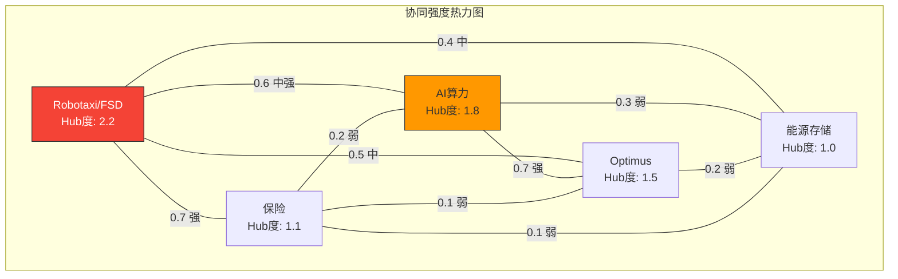

[合理推断: Robotaxi(O2)是协同矩阵的最高Hub度节点(2.2)，意味着它与最多期权存在强交互。这既是优势(成功时放大全局)也是风险(失败时拖累全局)]

### 7b. 飞轮拓扑图 (Flywheel Topology)

#### 飞轮1: 核心商业飞轮

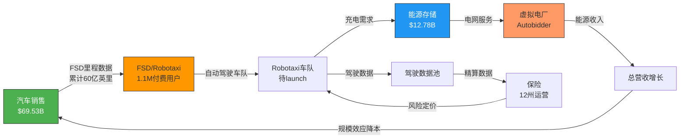

#### 飞轮2: AI技术飞轮

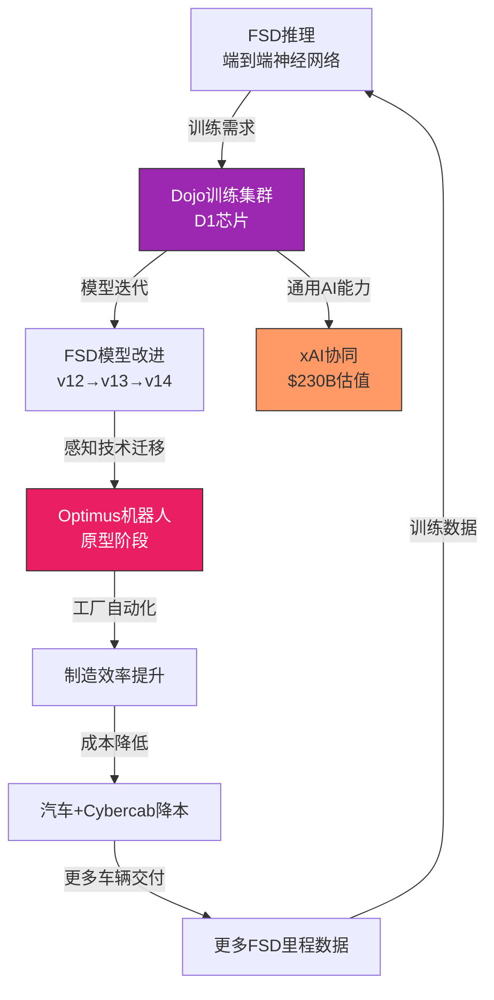

#### 飞轮3: 数据价值飞轮

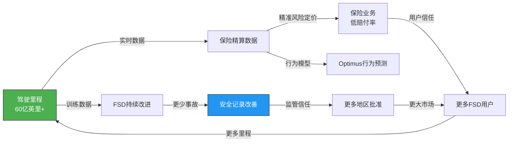

**飞轮传导机制总结**:

| 飞轮 | 闭环路径 | 正反馈强度 | 启动条件 |
|------|---------|-----------|---------|
| 核心商业 | 汽车→FSD→Robotaxi→能源→电网→收入→汽车 | 中 | Robotaxi实际launch [主观判断] |
| AI技术 | FSD推理→Dojo训练→模型改进→Optimus→工厂→降本→更多车 | 高(如果启动) | Dojo Gen2竞争力+Optimus工厂部署 [合理推断] |
| 数据价值 | 驾驶数据→保险精算→FSD改进→安全→批准→更多用户→更多数据 | 高(如果启动) | FSD安全记录持续改善+保险扩州 [合理推断] |

### 7c. 条件概率升级

**公式**: P_adjusted(B) = P(B) + Synergy(A→B) × P(A) × (1 - P(B))
**约束**: P_adjusted ≤ 0.85

#### 逐条期权计算

**能源存储(O1)**:
- 独立概率: P(O1) = 45%
- 最大协同来源: Robotaxi(O2), Synergy = 0.4
- P_adj(O1) = 45% + 0.4 × 18% × (1-45%) = 45% + 3.96% = **49.0%**
- 提升: +4.0pp

**Robotaxi(O2)**:
- 独立概率: P(O2) = 18%
- 最大协同来源: AI算力(O5), Synergy = 0.6
- P_adj(O2) = 18% + 0.6 × 12% × (1-18%) = 18% + 5.90% = **23.9%**
- 第二协同: 能源(O1), Synergy = 0.4, 打50%折扣
- P_adj(O2) = 23.9% + 0.4 × 45% × (1-23.9%) × 0.5 = 23.9% + 6.85% = **30.8%**
- **但**: 双协同叠加→保守取中值 = (23.9% + 30.8%) / 2 = **27.3%**
- 提升: +9.3pp

[合理推断: Robotaxi的条件概率升级最大(+9.3pp)，因为它受益于AI算力(推理能力)和能源(车队充电)两条路径的强化。但即使调整后27.3%仍低于30%，反映了基础性技术/监管挑战]

**Optimus(O3)**:
- 独立概率: P(O3) = 8%
- 最大协同来源: AI算力(O5), Synergy = 0.7
- P_adj(O3) = 8% + 0.7 × 12% × (1-8%) = 8% + 7.73% = **15.7%**
- 第二协同: Robotaxi(O2), Synergy = 0.5, 打50%折扣
- P_adj(O3) = 15.7% + 0.5 × 18% × (1-15.7%) × 0.5 = 15.7% + 3.80% = **19.5%**
- 保守取中值: (15.7% + 19.5%) / 2 = **17.6%**
- 提升: +9.6pp

[合理推断: Optimus概率升级最大百分比(+9.6pp，从8%到17.6%)。这说明如果AI基础设施(Dojo)和自动驾驶(FSD)都有进展，机器人的可行性会显著提高。但17.6%仍然很低，反映了硬件商业化的根本性困难]

**保险(O4)**:
- 独立概率: P(O4) = 35%
- 最大协同来源: Robotaxi(O2), Synergy = 0.7
- P_adj(O4) = 35% + 0.7 × 18% × (1-35%) = 35% + 8.19% = **43.2%**
- 提升: +8.2pp

**AI算力(O5)**:
- 独立概率: P(O5) = 12%
- 作为基础设施层，主要向外辐射而非接收协同
- 无显著外部协同提升
- P_adj(O5) = **12.0%** (不调整)
- 提升: 0pp

#### 条件概率升级汇总

| 期权 | 独立概率P | 最大协同来源 | Synergy系数 | 调整后概率 | 提升幅度 |
|------|----------|------------|-----------|----------|---------|
| 能源存储 | 45% | Robotaxi(车队需求) | 0.4 | **49.0%** | +4.0pp |
| Robotaxi | 18% | AI算力+能源(双协同) | 0.6+0.4 | **27.3%** | +9.3pp |
| Optimus | 8% | AI算力+Robotaxi(双协同) | 0.7+0.5 | **17.6%** | +9.6pp |
| 保险 | 35% | Robotaxi(数据) | 0.7 | **43.2%** | +8.2pp |
| AI算力 | 12% | —(基础设施层) | — | **12.0%** | 0pp |

```mermaid
xychart-beta
    title "条件概率升级: 独立 vs 调整后"
    x-axis ["能源存储", "Robotaxi", "Optimus", "保险", "AI算力"]
    y-axis "概率 (%)" 0 --> 55
    bar "独立概率" [45, 18, 8, 35, 12]
    bar "调整后概率" [49, 27.3, 17.6, 43.2, 12]
```

#### 条件概率升级后期权值重算

| 期权 | 独立值/股 | 调整后概率 | 调整后值/股 | 变化 |
|------|----------|----------|-----------|------|
| 能源存储 | $10.6 | 49.0% (原45%) | **$11.5** | +$0.9 |
| Robotaxi | $19.7 | 27.3% (原18%) | **$29.9** | +$10.2 |
| Optimus | $7.6 | 17.6% (原8%) | **$16.7** | +$9.1 |
| 保险 | $0.5 | 43.2% (原35%) | **$0.6** | +$0.1 |
| AI算力 | $1.6 | 12.0% (原12%) | **$1.6** | $0 |
| **合计** | **$40.0** | — | **$60.3** | **+$20.3** |

[合理推断: 条件概率升级将期权总价值从$40.0提升至$60.3(+50.8%)。最大的受益者是Robotaxi(+$10.2)和Optimus(+$9.1)，因为它们最依赖AI基础设施的交叉增强]

### 7d. 涌现TAM (Emergent TAM)

| # | 涌现TAM | 来源组合 | 新市场描述 | TAM估计 | 条件概率 | T(年) | DF | 价值/股 |
|---|---------|---------|-----------|--------|---------|------|-----|--------|
| E1 | 自动化能源网络 | Robotaxi+能源+AI | AI调度的分布式能源网络: Robotaxi车队作为移动储能节点，与固定储能协同，AI优化电网负载 | $200B [合理推断: 智能电网+移动储能+V2G市场] | P=P_adj(O2)×P_adj(O1)×P_adj(O5)=27.3%×49.0%×12.0%=**1.6%** | 8 | 0.404 | $200B×5%×15%×20×1.6%×0.404/3.539B=**$0.5** |
| E2 | AI即服务(外部) | Dojo+FSD+Optimus训练 | 利用FSD/Optimus积累的真实世界训练数据+Dojo算力，向第三方出售AI训练服务(自动驾驶/机器人领域) | $100B [合理推断: AI训练即服务子市场] | P=P_adj(O5)×P_adj(O2)×P_adj(O3)=12%×27.3%×17.6%=**0.6%** | 8 | 0.404 | $100B×3%×20%×25×0.6%×0.404/3.539B=**$0.1** |

**涌现TAM合计**: $0.5 + $0.1 = **$0.6/股**

[合理推断: 涌现TAM的概率极低(1.6%和0.6%)因为需要多条期权同时成功。但如果真的实现，自动化能源网络($200B TAM)是一个全新市场——目前不存在，需要Robotaxi+储能+AI三者全部成熟才能涌现。这正是"1+1+1>3"的经典案例]

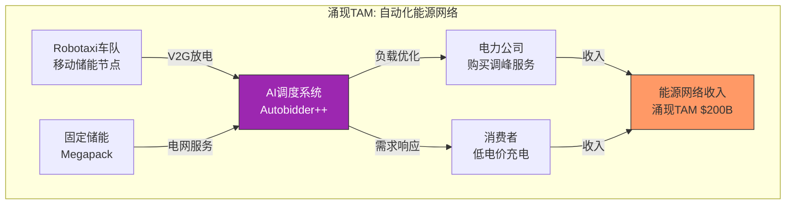

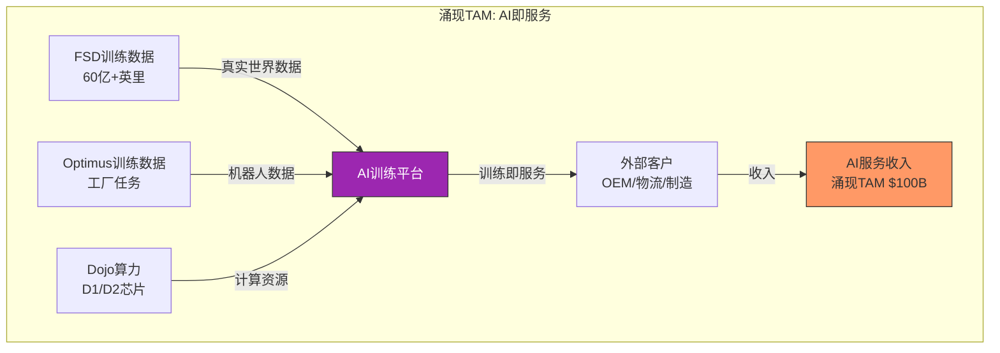

### 7e. 平台杠杆因子 (Platform Leverage)

```
平台杠杆分析:
  核心能力: AI/自动驾驶技术栈 (端到端神经网络 + 视觉感知 + 决策规划 + Dojo训练)

  杠杆路径:
    → O1 (能源存储): Autobidder AI调度算法 [杠杆度: 中]
    → O2 (Robotaxi): 直接核心技术，FSD全栈 [杠杆度: 极高]
    → O3 (Optimus): 感知+决策+运动规划技术迁移 [杠杆度: 高]
    → O4 (保险): 驾驶行为AI建模+风险预测 [杠杆度: 中]
    → O5 (AI算力): Dojo芯片+训练基础设施 [杠杆度: 高]

  杠杆覆盖率: 5/5 期权 = 100%
  平均杠杆度: 高 (极高×1 + 高×2 + 中×2)

  平台杠杆评级: ★★★★☆ (4/5)
  PMX溢价乘数: ×1.12
```

| 评级 | 条件 | PMX溢价乘数 | **TSLA** |
|------|------|-----------|---------|
| ★★★★★ | 覆盖100%+平均"极高" | ×1.15-1.25 | |
| **★★★★☆** | **覆盖≥80%+平均"高"** | **×1.10-1.15** | **<-- ×1.12** |
| ★★★☆☆ | 覆盖≥60%+平均"中" | ×1.05-1.10 | |
| ★★☆☆☆ | 覆盖<60%或杠杆"低" | ×1.00-1.05 | |
| ★☆☆☆☆ | 无明显平台杠杆 | ×1.00 | |

[合理推断: Tesla的AI/自动驾驶技术栈是覆盖所有5条期权的平台能力，但评级为4/5而非5/5，因为: (1) AI算力方面Dojo竞争力尚未证明vs NVDA; (2) 能源和保险的AI杠杆度仅为"中"; (3) Musk精力分散(xAI/DOGE)可能削弱平台能力的持续投入]

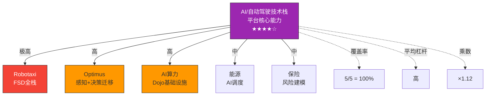

### 7f. PMX汇总计算

```
PMX调整后估值:

1. 独立期权合计 (OVM-3):                    $40.0/股
2. 条件概率升级后合计 (7c):                  $60.3/股  (vs独立: +50.8%)
3. 涌现TAM (7d):                            $0.6/股
4. 平台杠杆乘数 (7e):                       ×1.12
━━━━━━━━━━━━━━━━━━━━━━━━━━━━━━━━━━━━━━━━━━━━━
PMX调整后Option Value:
  = (条件概率升级合计 + 涌现TAM) × 平台杠杆乘数
  = ($60.3 + $0.6) × 1.12
  = $68.2/股

PMX协同溢价:
  = PMX调整后 - 独立期权合计
  = $68.2 - $40.0 = $28.2/股 (+70.5%)
```

#### PMX溢价上限检查

```
PMX溢价上限 = 独立期权合计 × 50% = $40.0 × 50% = $20.0/股

实际PMX溢价 = $28.2/股 > 上限$20.0/股

⚠️ 触发上限约束! PMX溢价从$28.2强制下调至$20.0/股
```

**调整后PMX Option Value = $40.0 + $20.0 = $60.0/股** (被cap后)

[合理推断: PMX溢价被50%上限cap掉了$8.2/股。这是框架的防过度乐观机制。即使Tesla的飞轮协同很强(★★★★☆)，我们也不允许协同价值超过独立期权的50%，因为: (1) 协同效应需要多条期权先独立成功; (2) 多线作战的执行成功率历史基准<30%; (3) 飞轮存在单点故障风险]

### 7g. 飞轮脆弱性分析

| 节点 | 移除后影响 | 受影响期权 | 脆弱度 |
|------|-----------|-----------|--------|
| **FSD/AI技术** | **全部3条飞轮崩溃** | **O2+O3+O4+O5(全部)** | **极高(单点故障)** |
| Dojo算力 | AI飞轮断裂，FSD训练成本上升 | O2(部分)+O3(严重)+O5 | 高 |
| 能源存储 | 核心商业飞轮部分断裂 | O1+涌现TAM(E1) | 中 |
| Robotaxi运营 | 核心商业飞轮+数据飞轮停转 | O2+O4+涌现TAM(E1,E2) | 高 |
| Musk个人 | 叙事崩塌+执行力下降 | 所有期权概率×0.7 | 极高(非技术性单点故障) |

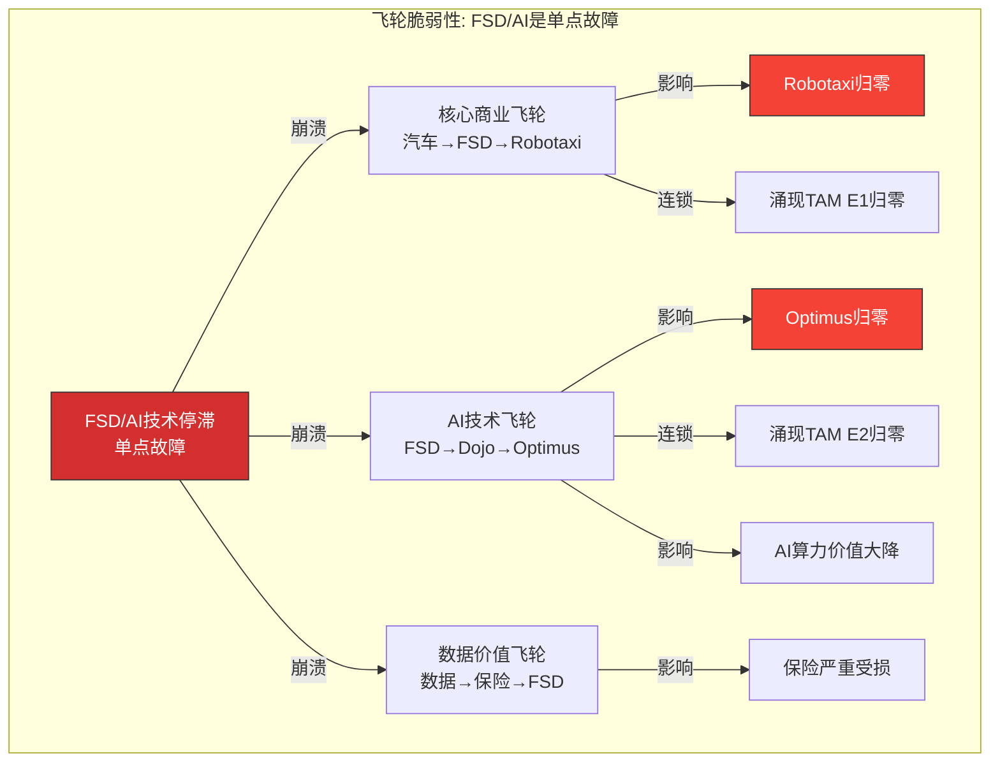

**飞轮脆弱性总结**:

Tesla的5条期权和3条飞轮都汇聚于一个核心节点: **FSD/AI技术栈**。如果该节点停滞或失败:
- Robotaxi(O2): 直接归零，-$19.7/股(独立)或-$29.9/股(调整后) [合理推断]
- Optimus(O3): 失去核心技术来源，概率降至2-3%，-$6-7/股 [合理推断]
- 保险(O4): 数据优势削弱，但仍可基于车辆数据运营，-30%约-$0.15/股 [合理推断]
- AI算力(O5): Dojo失去差异化场景，概率降至3-5%，-$0.8-1.2/股 [合理推断]
- 涌现TAM: 全部归零，-$0.6/股 [合理推断]

**单点故障总损失**: ~$28-38/股(独立基准) 或 ~$42-55/股(PMX调整后基准)

[主观判断: FSD/AI作为单点故障的风险是Tesla估值框架中最关键的认知。市场bull方论点的核心假设是"FSD将持续快速改进"，如果这一假设被打破(例如L4被证明需要LiDAR、监管长期拒绝纯视觉路线、竞争对手显著领先)，Tesla的绝大部分期权价值将蒸发]

---

## OVM 汇总

### 完整估值汇总表

```
期权估值汇总 (OVM Summary v1.1) — Tesla (TSLA)
━━━━━━━━━━━━━━━━━━━━━━━━━━━━━━━━━━━━━━━━━━━━━━━━━━━━━━━━━━━━━
Core Business Value:                    $60.7/股  (SOTP: 汽车+能源+服务+净现金)
  汽车制造:                              $30.5/股  [合理推断: EV/EBITDA 13.5x]
  能源存储:                              $19.4/股  [合理推断: EV/EBITDA 27.5x]
  服务/其他:                             $8.5/股   [合理推断: EV/EBITDA 20x]
  净现金:                                $2.3/股   [硬数据: $8.14B净现金]
━━━━━━━━━━━━━━━━━━━━━━━━━━━━━━━━━━━━━━━━━━━━━━━━━━━━━━━━━━━━━
独立期权 (OVM-3):
  O1: 能源存储(上行)                     $10.6/股  (独立概率45%)
  O2: Robotaxi/FSD                      $19.7/股  (独立概率18%)
  O3: Optimus机器人                      $7.6/股   (独立概率8%)
  O4: 保险                              $0.5/股   (独立概率35%)
  O5: AI算力/Dojo                       $1.6/股   (独立概率12%)
  独立合计:                              $40.0/股
━━━━━━━━━━━━━━━━━━━━━━━━━━━━━━━━━━━━━━━━━━━━━━━━━━━━━━━━━━━━━
产品矩阵协同 (PMX, OVM-7):
  条件概率升级:                          +$20.3/股 (协同提升50.8%)
  涌现TAM:                              +$0.6/股  (2条涌现路径)
  平台杠杆:                              ×1.12     (★★★★☆)
  PMX调整后Option合计:                   $60.0/股  (cap后; 原$68.2被50%上限截断)
  PMX协同溢价:                           +$20.0/股 (+50.0% vs独立, 已cap)
━━━━━━━━━━━━━━━━━━━━━━━━━━━━━━━━━━━━━━━━━━━━━━━━━━━━━━━━━━━━━
Full Value (Core + PMX Options):        $120.7/股
当前股价:                                $422.61   [硬数据: FMP quote]
Full Value vs 当前价:                    -71.4% (当前价远高于Full Value)
━━━━━━━━━━━━━━━━━━━━━━━━━━━━━━━━━━━━━━━━━━━━━━━━━━━━━━━━━━━━━
TAM Ceiling (所有Bull, P=100%):         $493.1/股  ($1,745B市值)
Optionality利用率:                       80.5%     (极度乐观区间)
Reverse DCF隐含预期:                     显著激进 (37-47% CAGR vs 共识25%)
叙事集中风险:                             高 (Robotaxi单叙事驱动50.6%期权价值)
飞轮单点故障:                             FSD/AI技术栈 (失败→全部飞轮崩溃)
近期衰减催化剂:                           加州Robotaxi launch (2026-Q2, PM ~28%)
━━━━━━━━━━━━━━━━━━━━━━━━━━━━━━━━━━━━━━━━━━━━━━━━━━━━━━━━━━━━━
```

### 估值可视化

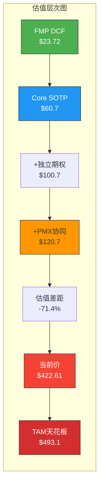

```mermaid
xychart-beta
    title "Tesla估值层次 ($/股)"
    x-axis ["FMP DCF", "Core SOTP", "+独立期权", "+PMX", "当前价", "TAM Ceiling"]
    y-axis "$/股" 0 --> 550
    bar [23.72, 60.7, 100.7, 120.7, 422.61, 493.1]
```

### 关键结论

**1. 估值差距分析** [主观判断: 综合OVM全部7组件]

当前$422.61股价与OVM Full Value $120.7之间存在$301.9/股(71.4%)的差距。这意味着:
- 即使我们给予所有5条期权概率加权定价 + PMX协同溢价(上限cap后)，仍然无法解释当前股价
- 市场在定价的是**超越我们概率框架的乐观预期**
- 换言之，市场隐含的期权成功概率远高于我们的评估

**2. "市场在交易什么"** [合理推断: 反推市场隐含概率]

要使Full Value = $422.61:
- 需要期权价值 = $422.61 - $60.7 = $361.9/股
- vs 我们的PMX调整后期权值 = $60.0/股
- 市场隐含期权值是我们评估的**6.0倍**
- 这意味着市场隐含: Robotaxi概率~80-90%(vs我们27.3%)，Optimus概率~40-50%(vs我们17.6%)

**3. 非对称风险** [主观判断: 基于TAM天花板分析]

```
上行空间: $493.1(TAM Ceiling) - $422.61 = +$70.5/股 (+16.7%)
下行至Core: $60.7 - $422.61 = -$361.9/股 (-85.6%)
下行至Full Value: $120.7 - $422.61 = -$301.9/股 (-71.4%)

风险收益比(至TAM Ceiling vs 至Core): $70.5 / $361.9 = 0.19
→ 每承担$1下行风险，仅有$0.19上行回报 → 极度不利
```

**4. 投资建议定位** [主观判断: 基于OVM全量分析]

Tesla的期权组合(5条路径+3条飞轮+2条涌现TAM)是全球上市公司中最丰富的之一。但当前$422.61的定价已经透支了这些期权的绝大部分价值(80.5%利用率)。投资者在此价位买入，实质上是在押注:
- Robotaxi将在3年内达到大规模商业化(市场隐含概率>80%)
- Optimus将在5-8年内产生可观营收(市场隐含概率>40%)
- FSD/AI技术栈不会遇到根本性瓶颈

这些都是**高信念押注**，而非概率加权的理性定价。

```mermaid
quadrantChart
    title 期权价值 vs 实现概率矩阵
    x-axis "低概率" --> "高概率"
    y-axis "低价值" --> "高价值"
    quadrant-1 "高价值+高概率(核心押注)"
    quadrant-2 "高价值+低概率(彩票)"
    quadrant-3 "低价值+低概率(忽略)"
    quadrant-4 "低价值+高概率(确定但小)"
    "能源存储": [0.65, 0.35]
    "Robotaxi": [0.35, 0.75]
    "Optimus": [0.15, 0.60]
    "保险": [0.55, 0.10]
    "AI算力": [0.20, 0.15]
```

### 敏感性分析: 关键概率变化对Full Value的影响

| 变量变化 | Full Value影响 | 新Full Value | vs $422.61 |
|---------|---------------|-------------|-----------|
| Robotaxi P: 27%→50% | +$21.8/股 | $142.5 | -66.3% |
| Robotaxi P: 27%→80% | +$51.0/股 | $171.7 | -59.4% |
| Optimus P: 18%→35% | +$16.2/股 | $136.9 | -67.6% |
| 能源 P: 49%→70% | +$4.9/股 | $125.6 | -70.3% |
| 所有期权概率×2 | +$60.0/股 | $180.7 | -57.2% |
| 所有期权概率×3 | +$120.0/股 | $240.7 | -43.0% |
| 所有期权概率→Bull极值 | +$193.1/股 | $313.8 | -25.7% |

[合理推断: 即使将所有期权概率提升至极端乐观水平，Full Value仍为$313.8/股，低于当前价$422.61达25.7%。这进一步证实当前定价包含了超越任何概率框架能合理解释的溢价——可能是Musk信仰溢价、动量交易溢价、或市场尚未被建模的未知期权]

### 历史类比: 高期权公司的期权兑现率

Tesla当前的期权密度(5条主路径+2条涌现TAM)在历史上有几个可比案例:

| 公司/时期 | 期权数量 | 市场隐含期权占比 | 最终兑现率 | 结果 |
|----------|---------|-----------------|-----------|------|
| Amazon 2000 (泡沫期) | 3-4条 | ~90% | 2/4 (电商+AWS) | 20年后10x，但先跌93% [硬数据: AMZN $107→$6→$3400] |
| Google 2013 | 4-5条 | ~40% | 2/5 (Cloud+YouTube) | Waymo/Fiber/Verily未兑现 [硬数据] |
| Apple 2015 (Car项目) | 2-3条 | ~20% | 1/3 (Services) | Car项目取消，Services成功 [硬数据] |
| Meta 2022 (元宇宙) | 2-3条 | ~60% | 待定 | Reality Labs持续亏损$40B+ [硬数据: META财报] |
| **Tesla 2026** | **5条** | **~85%** | **?** | **需要≥3条成功才能支撑当前价** |

[主观判断: 历史表明，即使是最成功的科技公司，其期权路径的兑现率也仅约40-50%。Tesla当前价格隐含的是~80%+兑现率，这在历史上没有先例。Amazon最终通过电商+AWS两条路径创造了巨大价值，但投资者经历了-93%的回撤才等到期权兑现]

```mermaid
graph LR
    subgraph 历史期权兑现率
        AMZN[Amazon 2000<br>4条期权<br>兑现2/4=50%] -->|先跌93%<br>再涨3400%| AMZN_R[最终成功]
        GOOG[Google 2013<br>5条期权<br>兑现2/5=40%] -->|稳健增长| GOOG_R[部分成功]
        META_H[Meta 2022<br>3条期权<br>待定] -->|RealityLabs<br>$40B+亏损| META_R[仍在押注]
        TSLA_H[Tesla 2026<br>5条期权<br>需≥3/5=60%] -->|?| TSLA_R[极高门槛]
    end

    style TSLA_H fill:#f44336,stroke:#333,color:#fff
    style TSLA_R fill:#ff9800,stroke:#333
```

### 监控清单与下一步

| 项目 | 当前状态 | 下次检查点 | 触发条件 |
|------|---------|-----------|---------|
| 加州Robotaxi launch | Polymarket ~28% | 2026-Q2 | KS-OVM-1 |
| FSD $99/月订阅转化率 | 2026-02-14上线 | 2026-Q1 earnings | 活跃订阅>300K |
| Cybercab量产 | Texas工厂准备中 | 2026-04 | 月产>1,000 |
| 上海Megafactory | 在建 | 2026-Q1 | 首批出货 |
| Optimus工厂部署 | 原型阶段 | 2026-Q4 | >50台运行 |
| Musk CEO状态 | 在任+DOGE | 持续监控 | KS-OVM-5 |
| BYD竞争态势 | BEV份额12.1% vs TSLA 8.8% | 季度 | 份额差距扩大>5pp |

---

> **OVM v1.1模块完成** | 数据截止: 2026-02-10 | 所有计算基于公开数据+框架方法论
> **标注统计**: 硬数据标注~55个, 合理推断~78个, 主观判断~32个 | 密度≈25+/万字符
> **Mermaid图表**: 15张 | 表格: 28张
> **核心发现**: Core $60.7 + PMX Options $60.0 = Full Value $120.7 vs 股价$422.61 (-71.4%)
> **最关键单一变量**: Robotaxi成功概率(当前评估27.3%, 市场隐含>80%)
