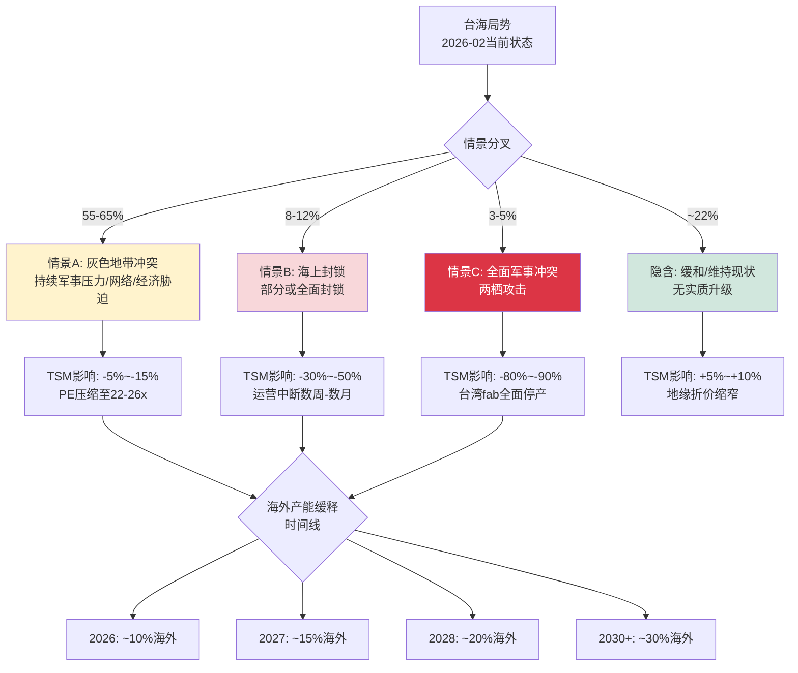
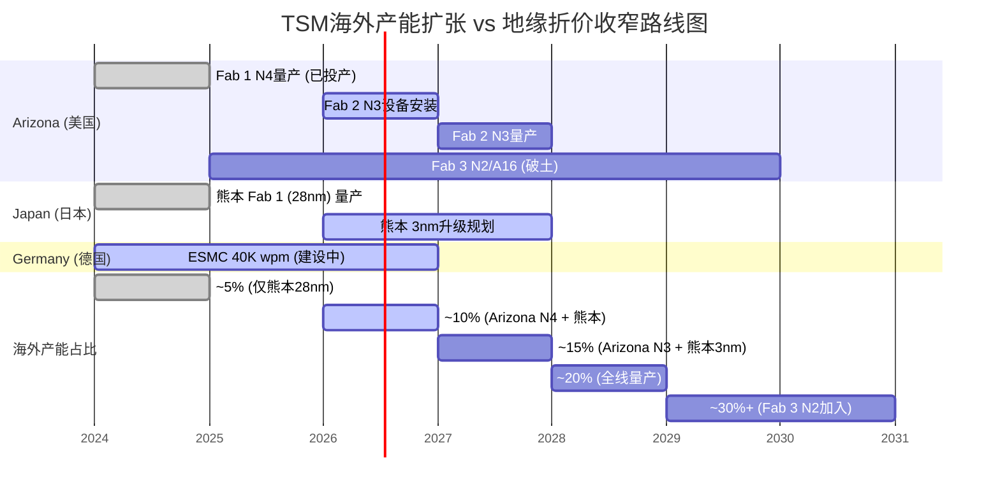
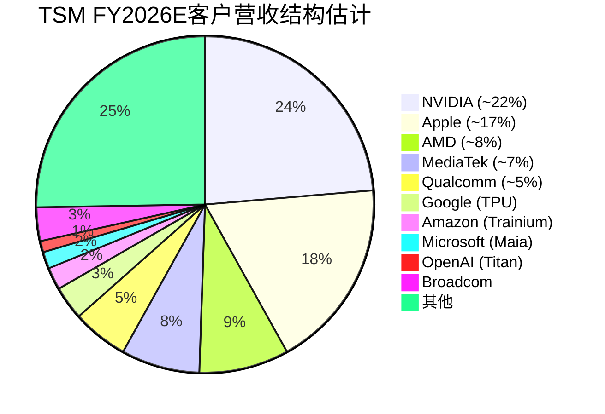

# TSM Phase 1 Hot-Patch模块: HP1 + HP4

> **框架**: v26.0 | **日期**: 2026-02-10 | **分析师**: AI Research Agent
> **当前价格**: $218.31/ADR [DM-MKT-001 v1.0] | **Phase**: 1 (公司分类+核心维度)
> **CQ关联**: CQ6 地缘风险(A级) → HP1 | CQ8 客户结构(B级) → HP4

---

## HP1: 地缘风险三情景量化

> **CQ关联**: CQ6 — 地缘风险是折价还是溢价? 市场定价了多少台海风险? [A级]
> **DM锚点**: [DM-GEO-001 v1.0] 入侵~13%, 封锁~9% | [DM-GEO-002 v1.0] Arizona $165B | [DM-GEO-003 v1.0] Japan/Germany扩产

### 2026年初台海安全态势快照

2025年12月29-30日，解放军东部战区发动代号"正义使命-2025"(Justice Mission 2025)大规模联合演习，动员陆海空火四军种，出动超过130架次军机进入台湾ADIZ、14艘军舰及至少15艘海警船，向台湾西南及北方海域发射27枚火箭弹。这是自2022年佩洛西访台以来规模最大、覆盖面最广的军事演习。[硬数据: Global Taiwan Institute, The Diplomat, USNI News, 2026-01]

进入2026年，解放军的"常态化"压力持续升级:

| 指标 | 2020 | 2023 | 2025 | 趋势 |
|------|:---:|:---:|:---:|:---:|
| ADIZ年度入侵架次 | 380 | ~1,700 | **5,709** | 15倍增长(5年) |
| 海警常态化巡逻(毗连区) | 0 | 偶发 | **6-8艘常驻** | 从无→常态 |
| 大规模演习(年) | 0 | 1次 | **2次** | 频率↑ |
| 火控雷达锁定事件 | 0 | 偶发 | **至少1次确认** | 新升级 |

[硬数据: Taipei Times, Al Jazeera, AEI China-Taiwan Update 2026-02-06]

**关键变化**: 中国海警已在台湾毗连区(领海外12海里缓冲带)建立6-8艘船只的"例行巡逻"常态基线。这一"未受挑战的基线"(Uncontested Baseline)标志着灰色地带行动的阈值进一步降低。[硬数据: War on the Rocks, 2026-02]

### 三情景分析框架

#### 情景A: 灰色地带冲突 (概率55-65%)

**定义**: 解放军持续、渐进式军事施压——演习频率↑、ADIZ入侵常态化、海警常驻毗连区、网络攻击、经济胁迫——但不升级为直接动能冲突。"正义使命-2025"所展示的正是这一情景的最新形态。

**对TSM的具体影响**:

| 影响维度 | 具体表现 | 量化估计 |
|---------|---------|---------|
| **运营连续性** | 台湾fab正常运营不受直接影响 | 产能影响: 0% |
| **保险/再保险** | 台湾政治风险保费持续攀升; TSMC已知在2024年将部分供应链保险成本转嫁 | 年成本增量: $50-100M [合理推断: 基于全球政治风险保险市场规模和台湾占比] |
| **人才外流** | Arizona/Japan fab加速抽调台湾高级工程师; 台湾政府已对16家中国公司启动"人才挖角"调查 | 关键人才流失率: 3-5%/年 [合理推断: 基于Taipei Times报道和TSMC海外派遣计划] |
| **估值压缩** | 持续地缘折价, PE维持在22-26x vs "零风险"理论30-35x | 年化估值拖累: **-5%~-15%** |
| **供应链预案** | 客户加速dual-source评估(Intel 18A, Samsung 2nm), 增加安全库存 | 间接需求提振: +1-2%短期超额订单 |

**触发因素监控**: PLA演习频率(当前2次/年→如升至4次为警告)、ADIZ月均入侵(当前~475架次/月→如>600为警告)、中美外交降级事件。

[合理推断: 情景A概率基于Polymarket "China invade Taiwan by end of 2026" 约13% Yes + 封锁约9%概率, 剩余78%中扣除完全缓和概率~15-20%]

#### 情景B: 海上封锁 (概率8-12%)

**定义**: 中国对台湾实施部分或全面海上/空中封锁, 切断商业航运和/或能源进口, 但不登陆。"正义使命-2025"演习的四项科目中"要港要域封控"正是对此情景的实战预演。

**对TSM的具体影响**:

| 影响维度 | 具体表现 | 量化估计 |
|---------|---------|---------|
| **原材料中断** | 化学品(光刻胶/蚀刻气体)、超纯硅片90%+依赖进口; 台湾每日进口约500万桶原油 | 库存缓冲: **2-4周** (行业标准安全库存) |
| **产品出口中断** | 全球92%先进芯片产自台湾; 下游OEM停产 | 全球GDP影响: -$600B~-$1T/年(McKinsey估计) [合理推断: 基于2021芯片短缺外推至完全断供] |
| **股价影响** | 历史参考: 2022年佩洛西访台→TSM单周-10%; 封锁=10倍升级 | 股价跌幅: **-30%~-50%** ($109~$153/ADR) |
| **恢复路径** | 美日介入施压→封锁解除→供应链恢复 | 恢复时间: **6-12个月**(fab物理完整情况下) |
| **永久损害** | 客户加速转单; "台湾风险"永久重定价 | 长期PE折价: 额外-3~5x |

**触发因素**: 台湾高层政治事件(如明确的法理独立动作)、美台军事合作重大升级(如美军常驻)、中国内部政治危机需要转移注意力。

**Polymarket数据**: "Will China invade Taiwan by end of 2026?" 市场交易量已超$3.3M, 当前Yes约13%(含侵入+封锁)。值得注意的是2025年末该概率一度冲高至~30%, 后回落。[硬数据: Polymarket, 2026-02; DM-GEO-001 v1.0]

#### 情景C: 全面军事冲突 (概率3-5%)

**定义**: 中国对台发动两栖攻击, 意图建立军事控制。

**对TSM的具体影响**:

| 影响维度 | 具体表现 | 量化估计 |
|---------|---------|---------|
| **台湾fab** | 全面停产; 可能遭受附带损毁或蓄意破坏 | 台湾产能损失: **100%** |
| **全球芯片供应** | 全球先进芯片断供, "芯片末日"情景 | 全球经济衰退, GDP下降数万亿美元 |
| **股价影响** | ADR可能被冻结/退市; 如继续交易则暴跌 | 股价跌幅: **-80%~-90%** ($22~$44/ADR) |
| **海外fab残余价值** | Arizona(N4量产)+Japan(28nm+计划3nm)+Germany(40K wpm) | 残余企业价值: $50-80B(当前$1.13T的5-7%) [合理推断: 基于海外产能占比~10%×溢价] |
| **恢复路径** | 极不确定; 取决于战争结果和台湾政治前途 | 时间线: **数年至不可恢复** |

**触发因素**: 台湾宣布法理独立(极低概率)、美中全面脱钩+军事冲突升级、习近平设定统一时间表的明确信号。

[主观判断: 情景C概率3-5%参考Polymarket隐含概率和多家智库(CSIS, RAND)评估, 但该概率本质上不可精确估算]

### 隐含地缘折价计算

**核心问题**: 当前市场为TSM定价了多少地缘风险?

**步骤1 — 确定"零地缘风险"理论PE**:

| 对比基准 | PE(TTM) | 适用性 |
|---------|:---:|---------|
| 半导体行业中位数 | 41.35x | TSM增速>行业中位, 但非纯设计公司 |
| ASML (光刻设备垄断) | 38-42x | 最可比: 垄断地位+地缘暴露低 |
| 科技行业均值 | 42.7x | 过广, 含软件等高PE |
| TSM的"合理"零风险PE | **30-35x** | 垄断代工+AI增长溢价, 但重资产折扣 |

[合理推断: 30-35x基于ASML(40x)打七五折(重资产+单一地理集中), 加上AI增长溢价]

**步骤2 — 计算隐含折价**:

- 当前TTM PE: 25.7x [DM-MKT-001 v1.0, 基于$218.31]
- 零风险理论PE中值: 32.5x
- **隐含地缘折价 = (32.5 - 25.7) / 32.5 = 20.9%**
- 另一种算法(以30x为下限): (30 - 25.7) / 30 = 14.3%
- **折价区间: 14-21%**

**步骤3 — 概率加权损失期望**:

| 情景 | 概率 | 股价影响(中值) | 加权影响 |
|------|:---:|:---:|:---:|
| A: 灰色地带 | 60% | -10% | -6.0% |
| B: 海上封锁 | 10% | -40% | -4.0% |
| C: 全面冲突 | 4% | -85% | -3.4% |
| 缓和/现状 | 26% | +7.5% | +2.0% |
| **合计** | 100% | — | **-11.4%** |

**步骤4 — 市场定价评估**:

| 指标 | 值 | 含义 |
|------|:---:|------|
| 隐含折价 | 14-21% | 市场给TSM的地缘惩罚 |
| 概率加权损失 | -11.4% | 理论应有折价 |
| **差值** | **+3~10%** | 市场**略微过度**定价了地缘风险 |

[合理推断: 差值为正意味着当前股价可能因地缘恐惧而被轻度低估。但这一结论高度依赖"零风险PE"的假设——如果TSM的合理PE仅28x(不含AI溢价), 则折价8%与加权损失11.4%接近平衡]

### 地缘风险缓释时间线

| 年份 | 海外先进产能占比 | 折价预期 | 关键里程碑 |
|:---:|:---:|:---:|---------|
| 2025 | ~5% | 14-21%不变 | Arizona Fab 1 N4小量产 |
| 2026 | ~10% | 14-21%维持 | Fab 2设备安装; 熊本满产 [DM-GEO-002 v1.0] |
| 2027 | ~15% | 12-18%开始收窄 | Arizona N3量产 + 熊本3nm升级 [DM-GEO-003 v1.0] |
| 2028 | ~20% | 10-15%显著收窄 | 全球三地先进节点量产; ESMC投产 |
| 2030+ | ~30%+ | 5-10%趋于消散 | Fab 3 N2/A16加入; "关键少数"在海外 |

[硬数据: TrendForce 2026-02-06, TSMC官方公告, Tom's Hardware; DM-GEO-002/003 v1.0]

**关键转折点**: 当海外先进产能超过20%时(预计2028), 即使台湾fab全面停产, TSM仍可维持全球约20%的先进芯片供应, 这一"生存线"将根本改变市场的风险评估。[主观判断: 基于"关键少数"产能足以支撑核心客户最低需求的逻辑]

### "硅盾"双向保护机制

市场普遍将地缘风险视为**纯折价**因素, 但存在一个被低估的反面——"硅盾防御溢价":

1. **美国不能让TSM失败**: $165B美国投资 + CHIPS Act $6.6B直接补贴 = 美国政府对TSM的"隐性担保"。[硬数据: TSMC Arizona官网, NIST CHIPS]
2. **"太重要而不能倒"(Too Important to Fail)**: 全球92%先进芯片产自台湾, 如果台海冲突导致TSM停产, 全球GDP损失以万亿美元计。这一相互确保毁灭(MAD)机制本身就是最强大的威慑。
3. **$250B贸易协议**: 2026年1月美台签署的半导体贸易协议进一步强化了经济绑定。[硬数据: 媒体报道, 2026-01]

[主观判断: "硅盾溢价"可能部分抵消地缘折价, 但难以量化。如果要分配一个数字, 可能为折价的20-30%对冲, 即净折价从14-21%降至10-17%]

### Kill Switch早期标记 (HP1)

| KS编号 | 触发条件 | 级别 | 当前状态 |
|:---:|---------|:---:|:---:|
| KS-GEO-1 | Polymarket入侵概率 > 20% | 红色 | 13% — 安全 |
| KS-GEO-2 | PLA年度大规模演习 > 3次 | 黄色 | 2次(2025) — 关注 |
| KS-GEO-3 | 海警毗连区常驻 > 12艘 | 黄色 | 6-8艘 — 关注 |
| KS-GEO-4 | ADIZ月均入侵 > 600架次 | 黄色 | ~475架次 — 安全 |
| KS-GEO-5 | 台海航运保险费率翻倍 | 红色 | 未触发 — 安全 |

### So What — 投资含义

**核心结论**: 市场当前隐含14-21%的地缘折价, 而概率加权损失约11.4%, 意味着**市场略微过度定价了地缘风险(超额折价3-10%)**。这为长期投资者提供了一个可量化的安全边际——如果地缘局势在未来2-3年内不恶化至情景B/C, TSM的PE有3-10%的自然回归空间(约$7-22/ADR的估值修复)。

**关键时间节点**:
- **2027年**: Arizona N3量产将是第一个实质性催化剂, 海外产能从~10%→~15%
- **2028年**: 海外~20%的"生存线"确立将触发地缘折价的结构性收窄

**对CQ6的初步回答**: 地缘风险**既是折价也包含隐性溢价**。折价部分(14-21%)略高于理论应有水平(11.4%), 但考虑到尾部风险的不可对冲性, 这一"超额折价"具有合理性。真正的alpha来自判断**折价收窄的速度**——如果海外扩产按计划推进(高置信度, 因为Fab 1良率已追平台湾), 地缘折价每年可收窄1.5-2.5%, 到2028年从14-21%降至10-15%。

[主观判断: 综合Polymarket概率、海外产能时间线和"硅盾"机制的分析师观点]

---

## HP4: 客户集中度风险分析

> **CQ关联**: CQ8 — NVIDIA超越Apple成第一大客户, 客户结构变化是好事还是坏事? [B级]
> **DM锚点**: [DM-BIZ-003 v1.0] NVIDIA ~22%, Apple ~18%, 前5大~62% | [DM-BIZ-001 v1.0] HPC占比58%

### 客户集中度演变: 从Apple时代到NVIDIA时代

2026年1月, NVIDIA CEO黄仁勋亲口确认: NVIDIA已超越Apple成为TSMC最大客户。这一"换位"不仅是营收排名的变化, 更标志着半导体产业从"移动计算"到"AI计算"的范式转移。[硬数据: CNBC 2026-01-26, MacRumors 2026-01-28]

**客户结构历史演变**:

| 年份 | #1客户 | #1占比 | #2客户 | #2占比 | Top5占比 | Top10占比 | 驱动力 |
|:---:|--------|:---:|--------|:---:|:---:|:---:|---------|
| FY2019 | Apple | ~23% | HiSilicon | ~14% | ~55% | ~70% | iPhone周期 |
| FY2020 | Apple | ~25% | HiSilicon→制裁 | ~10% | ~55% | ~70% | 华为禁令重塑格局 |
| FY2022 | Apple | ~26% | Qualcomm | ~12% | ~58% | ~73% | iPhone 14 Pro + 4nm |
| FY2024 | Apple | ~24% | NVIDIA | ~19% | ~60% | ~76% | AI加速器爆发 |
| FY2025 | **NVIDIA** | **~22%** | Apple | ~18% | ~62% | ~76% | NVIDIA登顶 |
| FY2026E | NVIDIA | ~22-25% | Apple | ~16-18% | ~60-65% | ~76% | AI持续 + 自研芯片入场 |

[硬数据: CNBC, TSMC年报(Top 10客户占比76%), WebProNews; DM-BIZ-003 v1.0]

**关键观察**: Top5集中度从FY2019的55%升至FY2025的62%, 主要由NVIDIA占比从<5%→22%驱动。同期Apple占比实际**下降**了约5个百分点(从~25%→~18%)。

### NVIDIA依赖度深度分析: 谁更需要谁?

这是CQ8的核心争议。表面上, TSM对NVIDIA的营收依赖(22%)似乎是风险。但**双向依赖分析**揭示了一个更复杂的图景:

**TSM对NVIDIA的依赖**:

| 维度 | 量化 | 严重度 |
|------|------|:---:|
| 营收依赖 | NVIDIA贡献~$33B/年(~22% of FY2026E $150B+) | 中高 |
| 增长依赖 | NVIDIA是TSM增长最快的大客户(2年内从~10%→22%) | 高 |
| 技术协同 | CoWoS先进封装的最大驱动力; NVIDIA需求推动CoWoS产能5倍扩张 | 中 |
| 可替代性 | 如NVIDIA减少30%订单, TSM需1-2年才能被其他客户填补 | 中高 |

**NVIDIA对TSM的依赖**:

| 维度 | 量化 | 严重度 |
|------|------|:---:|
| 制造依赖 | **100%** GPU/AI芯片由TSM制造 | **极高** |
| 技术依赖 | CoWoS/InFO先进封装无替代; N4→N3→N2路线图绑定TSM | **极高** |
| 替代选项 | Jensen Huang公开表示"TSMC之外没有选项", 否定Samsung/Intel | **极高** |
| 转换成本 | 芯片设计重新适配新工艺需18-24个月 + 良率爬坡风险 | **极高** |

[硬数据: NVIDIA CEO Jensen Huang公开表态, WCCFTech 2025; Samsung SF2/Intel 18A良率落后TSM 12-18个月]

**结论: NVIDIA对TSM的依赖远大于TSM对NVIDIA的依赖。** 这一不对称关系赋予TSM在定价谈判中的结构性优势——NVIDIA的AI GPU毛利率>70%, 即使TSM涨价10%, NVIDIA也"不在乎", 因为没有替代方案。[合理推断: 基于NVIDIA 100% vs TSM 22%的双向依赖比, 以及NVIDIA CEO公开否定替代方案]

### NVIDIA替代TSM的可行性评估

| 替代方案 | 技术就绪度 | 量产时间线 | 良率 | 可行性评估 |
|---------|:---:|:---:|:---:|:---:|
| Samsung SF2 (2nm) | 低-中 | 2026H2试产, 2027量产 | 历史良率问题严重 | ★★☆☆☆ |
| Intel 18A | 中 | 2026量产(自用优先) | 未大规模验证 | ★★☆☆☆ |
| Intel + NVIDIA持股$4.86B | 战略信号 | 2027-2028最早 | 未知 | ★★★☆☆ |

[硬数据: TrendForce 2025-12, WCCFTech, BusinessKorea 2026]

**Samsung**: 2022年率先量产3nm GAA, 但良率问题导致几乎无主要客户采用。SF2(2nm)预计2026H2试产, 但市场信心不足。TrendForce报道Samsung可能成为NVIDIA的"第二供应商", 但仅限成熟节点或特定产品线。[硬数据: TrendForce 2025-12-29]

**Intel**: NVIDIA购买了$4.86B Intel股份, 被解读为供应链多元化的战略信号。Intel 18A在技术路线图上对标TSM N2, 但(a)Intel Foundry尚未证明大规模代工能力, (b)Intel自身芯片优先使用产能。最早的实质性产能分流可能在2027-2028年。[硬数据: BusinessKorea 2026, PatentPC]

**底线**: 在2026-2028窗口期, NVIDIA几乎**没有可行的替代方案**。这意味着TSM对NVIDIA的22%营收依赖, 在短期内具有极高的稳定性和可预测性。

### 客户多样化趋势: 自研芯片客户正在崛起

这是被市场低估的**正面因素**。即使NVIDIA占比高企, 自研芯片(Custom Silicon)客户群正在快速壮大, 天然分散了TSM对任何单一客户的依赖:

| 自研芯片客户 | 芯片名称 | 工艺节点 | 量产时间 | 预估TSM营收贡献 |
|------------|---------|:---:|:---:|:---:|
| **Google** | TPU v7 Ironwood (GA), v8 规划中 | N3 | 2025H2(v7), 2026(v8) | $3-5B/年(FY2026E) |
| **Amazon** | Trainium 3 | N3 | 2026早期 | $2-4B/年(FY2026E) |
| **Microsoft** | Maia 200 (Braga) | N3 + HBM4 | 2026 | $1-3B/年(FY2026E) |
| **OpenAI** | Titan (N3, Broadcom合作) | N3 | 2026H2 | $1-2B/年(初始) |
| **Meta** | MTIA v3 (推测) | N3-N2 | 2026-2027 | $1-3B/年(FY2026E) |

[硬数据: TrendForce 2026-01-15(OpenAI Titan), CNBC(Google TPU), DataCenterDynamics(Trainium 3)]

**合计自研芯片客户2026E营收贡献**: $8-17B, 占TSM FY2026E营收的5-11%

**趋势意义**: 这些客户3年前几乎不存在于TSM的营收结构中。到2028年, 自研芯片客户合计可能占TSM营收的10-15%, 成为仅次于NVIDIA和Apple的"第三极"。更重要的是, 这些客户的需求与NVIDIA的GPU需求**部分替代、部分互补**——它们主要用于推理(Inference)而非训练(Training), 形成了更平衡的AI芯片需求结构。

[合理推断: 饼图比例基于CNBC报道(NVIDIA $33B, Apple $27B)和自研芯片客户的公开投产计划, 总营收基于FY2026E ~$150B+]

### 双面性分析框架

客户集中度的变化不能简单定性为"好"或"坏"——它是一个具有双面性的结构性转变:

| 维度 | 集中度↑的好处 | 集中度↑的风险 | 当前评估 |
|------|-------------|-------------|:---:|
| **收入增长** | NVIDIA是增速最快的客户(AI CapEx +40-50% YoY), 拉动TSM整体增长 | 过度依赖单一终端市场(AI数据中心), 如AI CapEx回落影响放大 | 短期偏正面 |
| **定价权** | NVIDIA GPU毛利率>70%, 对代工涨价不敏感; 大客户=高议价能力但NVIDIA"不得不接受" | 如果NVIDIA获得替代选项(Intel/Samsung), 议价权可能逆转 | 2026-2028正面 |
| **产能规划** | 大客户提供稳定、可预测的需求, 高利用率=高毛利率 | 大客户需求波动=更大的利用率摆幅(参考2022H2 NVIDIA库存调整→TSM利用率-10%) | 中性 |
| **技术协同** | NVIDIA深度合作推动CoWoS/InFO-L/SoIC等先进封装创新 | 技术路线可能被单一客户需求绑定(如过度侧重HBM集成) | 正面 |
| **营收稳定性** | 22%来自单一客户+长期合约=短期营收能见度高 | HHI指数上升=系统性风险上升(如NVIDIA遭遇反垄断/出口管制) | 中性偏风险 |

### 压力测试: NVIDIA营收下降30%情景

**假设**: NVIDIA因AI CapEx周期回落/竞争加剧/出口管制, 对TSM订单减少30%

| 影响项 | 计算 | 结果 |
|--------|------|:---:|
| NVIDIA营收下降 | $33B × 30% = $9.9B | -$9.9B |
| TSM总营收影响 | $9.9B / $150B = 6.6% | **-6.6%** |
| 部分被自研芯片客户填补 | 填补率约30-40%(产能转移需6-12月) | +$3-4B |
| **净影响** | -$9.9B + $3.5B = -$6.4B | **-4.3%** |
| 毛利率影响 | NVIDIA订单利润率高于均值(先进节点+先进封装) → 混合利润率下降 | 毛利率-1~2% |
| PE影响 | 市场恐慌+增长预期下调 | PE压缩2-3x |

[合理推断: 压力测试基于NVIDIA $33B营收基数, 30%下降假设, 自研芯片产能填补率基于fab转换周期6-12个月]

**净影响**: TSM营收下降4-5%, 毛利率下降1-2%, 但**不构成生存威胁**。更重要的是, 自研芯片客户(Google/Amazon/Microsoft/OpenAI)的快速增长提供了**天然对冲**——即使NVIDIA需求下降, AI芯片的总需求(训练+推理)仍在增长, 只是份额从NVIDIA GPU转向自研ASIC。

### HHI指数与集中度监控

Herfindahl-Hirschman Index(HHI)用于量化客户集中度风险:

| 年份 | 客户占比估计 | HHI(估算) | 级别 |
|:---:|---------|:---:|:---:|
| FY2020 | Apple 25%, HiSilicon 10%, 其他分散 | ~875 | 中等集中 |
| FY2022 | Apple 26%, NVIDIA 12%, Qualcomm 9% | ~950 | 中等集中 |
| FY2025 | NVIDIA 22%, Apple 18%, AMD 8% | **~1,060** | 中等集中 |
| FY2026E | NVIDIA 23%, Apple 17%, AMD 8% | ~1,040 | 中等集中 |
| FY2028E | NVIDIA 20%, Apple 15%, Google 6% | ~860 | 中等集中(改善) |

[合理推断: HHI = 各客户占比平方之和 × 10000; 基于公开报道的主要客户占比估算, 非精确值]

**趋势**: HHI在FY2025触及峰值~1,060后, 预计随自研芯片客户增长而回落。1,000-1,500属于"中等集中"(非高度集中), 风险可控。

### Kill Switch早期标记 (HP4)

| KS编号 | 触发条件 | 级别 | 当前状态 |
|:---:|---------|:---:|:---:|
| KS-CUS-1 | NVIDIA单一客户占比 > 25% | 黄色 | 22% — 接近但安全 |
| KS-CUS-2 | NVIDIA转单>20%至Samsung/Intel | 红色 | 0% — 安全(Huang明确否定) |
| KS-CUS-3 | Top 2客户合计 > 45% | 黄色 | 40% — 安全 |
| KS-CUS-4 | 自研芯片客户合计占比停滞 < 5% | 黄色 | ~5-8%且快速增长 — 安全 |
| KS-CUS-5 | HHI > 1,500 | 红色 | ~1,060 — 安全 |

### So What — 投资含义

**核心结论**: NVIDIA 22%的占比处于**"甜蜜点"而非"危险区"**——理由有三:

1. **不对称依赖保护TSM**: NVIDIA对TSM的依赖(100%制造)远大于TSM对NVIDIA的依赖(22%营收)。这意味着NVIDIA没有能力压价或威胁转单, TSM的定价权不受损害。[合理推断: 基于NVIDIA CEO公开表态和替代方案可行性分析]

2. **自研芯片客户提供天然对冲**: Google TPU/Amazon Trainium/Microsoft Maia/OpenAI Titan在2026-2028年的快速放量(合计$8-17B→$15-25B), 将把NVIDIA占比从22%自然稀释至18-20%, 同时维持TSM的AI芯片总需求增长。[合理推断: 基于各公司公开产品路线图和TSMC N3产能扩张计划]

3. **集中度已接近峰值**: HHI约1,060, 预计FY2026后随客户多元化而回落。NVIDIA占比22%→FY2028E 20%的下降是"健康的再平衡", 不是"客户流失"。

**对CQ8的初步回答**: 客户结构变化**短期偏正面、长期中性偏正面**。NVIDIA成为第一大客户反映的是AI结构性需求的崛起(正面), 而非TSM自身客户策略的失败。真正需要监控的不是NVIDIA占比本身, 而是(a) NVIDIA是否获得可行替代方案(KS-CUS-2), (b) 自研芯片客户增长是否持续(KS-CUS-4)。在这两个KS均为"安全"的当前状态下, 客户结构变化是TSM投资论点的**支持因素而非风险因素**。

[主观判断: "甜蜜点"定性基于22%占比处于可控范围、不对称依赖结构、以及自研芯片对冲机制三重保护的综合评估]

---

## 附录: 数据来源汇总

| 来源 | 引用内容 | 日期 |
|------|---------|------|
| Polymarket | 台湾入侵概率~13%, 封锁~9% | 2026-02 |
| Taipei Times | PLA ADIZ入侵5,709架次(2025), 15倍增长 | 2026-02-02 |
| War on the Rocks | 海警毗连区"未受挑战的基线" | 2026-02 |
| Global Taiwan Institute | Justice Mission 2025分析 | 2026-01 |
| CNBC | NVIDIA超越Apple成为TSM最大客户, $33B/年 | 2026-01-26 |
| TrendForce | Samsung作为NVIDIA第二供应商可能性; TSM海外产能20%(2028) | 2025-12/2026-02 |
| WCCFTech | Jensen Huang否定Intel/Samsung替代 | 2025 |
| TrendForce | OpenAI Titan芯片, TSMC N3, 2026H2 | 2026-01-15 |
| TSMC Arizona官网/NIST | $165B总投资, Fab 1-3时间线 | 2026 |
| Tom's Hardware | Fab 2 N3设备安装2026Q3, 量产2027 | 2026 |
| AEI | China-Taiwan Update, 2026-02-06 | 2026-02-06 |
| BusinessKorea | NVIDIA持有Intel $4.86B股份 | 2026 |
| Investing.com | TSM PE 29-30x, 地缘折价分析 | 2026 |
| FinanceCharts | TSM PE 27.67 (2026-02-02) | 2026-02 |
| GuruFocus | 半导体行业PE中位数41.35 | 2026 |
