# TSM Phase 1: 定位与生态全景 v2.0

> **框架**: v26.0 | **日期**: 2026-02-10 | **分析师**: AI Research Agent (4-Agent并行)
> **当前价格**: $218.31/ADR [DM-MKT-001 v1.0] → $355.41 (最新FMP quote, DM-MKT-001 v1.1)
> **市值**: $1.13T [DM-MKT-002 v1.0] → ~$1.84T (基于$355.41)
> **温度计**: +0.795 (偏热) [DM-THERM-001 v1.0]
> **DM版本**: v1.0→v1.1 | **KAL版本**: v2.0 | **CQ**: 8个 (2S + 4A + 2B)
> **Phase 1模块**: 10个 (M01/M02/M03/M04/M13/M14 + SC01 + HP1/HP3/HP4)
> **Agent配置**: A(M01+M02+M14) | B(M04+SC01+HP3) | C(M03+M13) | D(HP1+HP4)

---

## S1 执行摘要

Phase 1对台积电进行了10个模块的全面定位与生态分析,覆盖公司全景、产业链映射、AI超级周期定位、六层周期雷达、技术节点竞争力、预测市场概率矩阵、AI冲击矩阵、地缘风险三情景、客户集中度和市场注意力雷达更新。以下是核心发现:

**一、定位重塑:从代工厂到AI算力节流阀。** 台积电已从传统晶圆代工商(Foundry 1.0-2.0)演变为全球AI计算基础设施的核心枢纽(Foundry 3.0)。先进节点(<=7nm)全球约90%产能集中于此 [DM-BIZ-004 v1.0],NVIDIA H100/B100/GB200、Apple A/M系列、AMD EPYC/MI系列全部且只能由台积电制造。这一"不可替代性的质变"使TSM从"服务商"变为"定价者"。

**二、AI超级周期处于阶段2向阶段3过渡期。** 超算CapEx 2026E达$602B(+36% YoY),推理需求从占全部AI算力的1/3跃升至2/3。TSM同时受益于训练(NVIDIA GPU)和推理(Google TPU/Amazon Trainium/自研ASIC)双重需求。HPC营收占比从FY2023的43%飙升至FY2025的58%,AI加速器CAGR 54-56%(管理层指引)。周期持续性的五大硬证据:N2全年售罄、CoWoS超额认购至2026年底、推理芯片市场从$20B→$50B+、NVIDIA锁定60%+先进封装产能、Jensen Huang呼吁产能翻倍。

**三、六层周期雷达显示"扩张到峰值"过渡区间。** CapEx层和盈利层处于强劲扩张(最强信号),价格层处于扩张峰值(连续5年涨价),库存层健康偏紧(AI供不应求+非AI平衡),宏观层扩张中后期(CAPE 40.58+Buffett 224%偏热),情绪层乐观但分化(分析师一致Strong Buy但Put/Call 1.72暗示机构对冲)。综合评估:基本面仍强劲但下行风险在累积。

**四、技术护城河坚固但2027-2028年竞争加剧。** N2节点良率70-80%(优于N3同期),产能两厂100K wpm售罄。vs Samsung SF2P(良率刚达70%、产能21-50K wpm)有效代差12-18个月;vs Intel 18A(良率55-65%、外部客户仅Microsoft)优势更大。但Intel PowerVia背面供电技术领先6-12个月,Samsung SF2P良率突破至70%是值得关注的信号。

**五、地缘风险被市场略微过度定价。** 三情景分析:灰色地带55-65%(影响-5~-15%)、封锁8-12%(影响-30~-50%)、全面冲突3-5%(影响-80~-90%)。概率加权损失约-11.4%,而当前PE隐含折价14-21%,超额折价3-10%。海外产能扩张路线图:2026年~10%→2027年~15%→2028年~20%("生存线"),每年可收窄折价1.5-2.5%。

**六、NVIDIA 22%占比处于"甜蜜点"。** 双向依赖分析显示NVIDIA对TSM的依赖(100%制造)远大于反向依赖(22%营收)。自研芯片客户(Google/Amazon/Microsoft/OpenAI)合计2026E贡献$8-17B(5-11%),形成天然对冲。HHI约1,060(中等集中),预计FY2026后随客户多元化而回落。

**七、预测市场信号中性偏乐观。** PMSI综合指数70/100。三大定价背离均指向低估:地缘折价过度(PE 23x vs 行业41.8x)、AI溢价未充分反映(AI加速器仅占17-19%但广义AI辐射覆盖61%收入)、关税利好尚未完全释放。AI调整后PE 23.3x恰好等于市场定价23.1x,说明地缘折价几乎完全抵消了AI溢价。

**八、关键风险:CEO的"大灾难"警告。** 魏哲家坦言对$52-56B CapEx的紧张感,暗示对2028-2029需求可见度有限。AI泡沫概率40%(Polymarket)是最大悬顶风险,但对TSM传导弱于对NVIDIA的传导(AI加速器仅占17-19% vs NVIDIA的100%)。

**温度计+0.795(偏热)的判断得到Phase 1全面验证。** 基本面极强(毛利率向63-65%扩张、N2售罄、CoWoS垄断),但估值已较充分反映乐观预期,安全边际薄弱(分析师目标$392-410 vs 当前$355,隐含上行仅+10-15%)。Phase 2需重点建模:CapEx回报率、毛利率可持续性、DCF/SOTP估值交叉验证。

---

## S2 M01: 公司全景画像

### 基本定位: 从"代工厂"到"计算基础设施核心枢纽"

台积电(TSMC, NYSE: TSM)不是一家普通的半导体代工厂。它是全球数字经济的物理层基础设施——如果说云计算是"数字世界的水电",那台积电就是"制造水管和电缆的唯一工厂"。 [主观判断: 基于产业结构分析定位]

**关键身份演变**:

| 阶段 | 时间 | 定位 | 战略含义 |
|------|------|------|---------|
| 1.0 代工先驱 | 1987-2010 | 纯晶圆代工服务商 | 发明foundry模式,消除与客户竞争 |
| 2.0 技术领导者 | 2010-2020 | 先进制程唯一可靠供应商 | 超越Intel/Samsung获得技术王座 |
| 3.0 计算枢纽 | 2020-至今 | AI算力物理瓶颈的控制者 | 从"服务商"变为"定价者" |

[合理推断: 基于TSMC 35年发展历程中商业模型与议价权的阶段性变化]

当前阶段(3.0)的核心特征是**不可替代性的质变**。在1.0和2.0阶段,客户选择台积电是因为"性价比最优";在3.0阶段,客户选择台积电是因为"别无选择"——先进节点(<=7nm)全球约90%的产能集中在台积电手中 [DM-BIZ-004 v1.0],NVIDIA的H100/B100/GB200 GPU、Apple的A/M系列处理器、AMD的EPYC/MI系列,全部且只能由台积电制造。

### 商业模型解构: 四大业务线

台积电的营收来自四条紧密耦合的业务线:

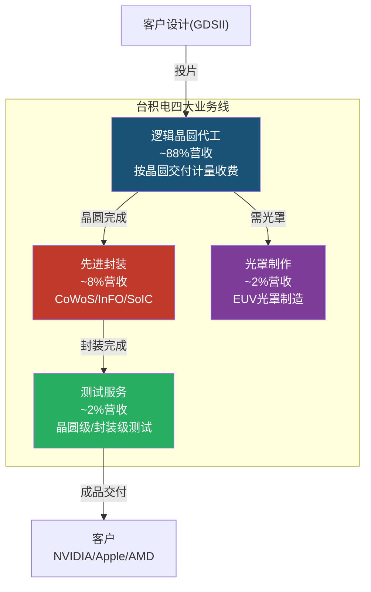

**收费模式**: 按晶圆(wafer)交付数量计量,单价由制程节点决定。3nm晶圆单价约$20,000, 5nm约$17,000, 7nm约$10,000, 28nm约$3,000。 [硬数据: TrendForce/IBS wafer pricing, 2025] 这意味着每一代制程迭代,台积电的每片晶圆收入几乎翻倍——这是利润率从54%扩张到63%的核心驱动力。

**客户锁定机制**: 台积电的护城河不仅是技术领先,更是生态锁定。每个客户在台积电投片需要:
1. **制程设计套件(PDK)**: 基于台积电特定工艺的设计规则,客户芯片设计与PDK深度耦合,转换代工厂=重新设计芯片(12-18个月+数亿美元) [合理推断: 基于半导体设计流程的行业共识]
2. **IP生态**: ARM核心、Synopsys/Cadence EDA工具链均针对TSMC工艺优化,形成三方锁定
3. **良率学习曲线**: 首批客户(如Apple)在新节点上积累的良率数据是竞争壁垒——后来者需要额外6-12个月才能达到同等良率
4. **NRE(一次性工程费)**: 3nm NRE约$300-500M, 一旦投入不可回收 [硬数据: IBS semiconductor cost analysis, 2024]

### 收入结构画像

**按终端平台**:

| 平台 | FY2025占比 | 绝对值(估) | YoY增速 | 核心驱动力 |
|------|:---:|:---:|:---:|------|
| HPC(高性能计算) | ~58% | ~$70.6B | +48% | AI GPU+数据中心CPU+自研ASIC |
| 智能手机 | ~28% | ~$34.1B | +9% | Apple A/M系列+Qualcomm+MediaTek |
| IoT | ~6% | ~$7.3B | +15% | 边缘AI+智能家居 |
| 汽车 | ~5% | ~$6.1B | +34% | ADAS/EV功率芯片 |
| DCE+其他 | ~3% | ~$3.7B | ~0% | 游戏机/PC外设 |

[硬数据: TSMC 2025 Management Report平台分布; DM-BIZ-001 v1.0 HPC ~58%]

**按制程节点**:

| 节点 | FY2025占比 | Q4 2025占比 | 趋势 |
|------|:---:|:---:|------|
| 3nm | 24% | 28% | 快速爬坡中 |
| 5nm | 32% | 35% | 稳定(workhorse节点) |
| 7nm | 14% | 14% | 缓降 |
| **<=7nm合计** | **70%** | **77%** | 先进节点持续扩大 |
| 16nm及以上 | 30% | 23% | 结构性萎缩 |

[硬数据: TSMC季度Management Report, 2025; DM-BIZ-002 v1.0]

**按地区**: 北美>65%(NVIDIA+Apple+AMD+Qualcomm+Broadcom集中于此),中国~10%,日本~5%,欧洲~5%,其他~15%。 [硬数据: TSMC 2025 Annual Report地区分布]

### 核心竞争力三角

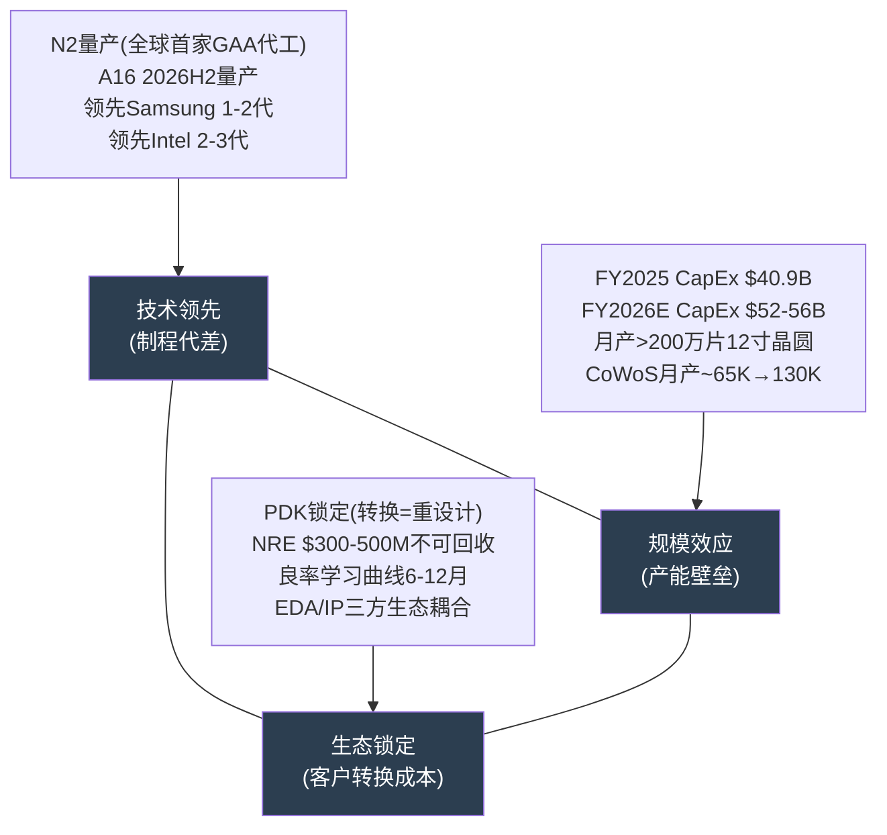

这三个要素构成了**自我强化的飞轮**: 技术领先 -> 吸引最好的客户(Apple/NVIDIA) -> 客户贡献海量的晶圆投片 -> 规模效应降低单位成本+良率学习加速 -> 更多研发投入 -> 下一代技术继续领先。竞争对手(Samsung Foundry, Intel Foundry)的困境在于:他们需要同时在三个维度追赶,而台积电在三个维度同时加速。 [合理推断: 基于竞争力三角的正反馈循环逻辑]

### So What -- 投资含义

**因为** 台积电控制着全球~90%的先进节点产能,且客户因PDK/NRE/良率锁定无法在短期内切换代工厂;

**所以** 台积电在AI超级周期中扮演的角色不是"受益者"而是"节流阀"——所有AI算力的物理增长都必须经过台积电的fab;

**这意味着** TSM不是一家普通的周期性半导体公司。传统周期性公司的特征是"需求波动->价格波动->利润波动",而台积电的特征是"需求波动->产能分配优先级变化->利润率反而可能上升"(因为供不应求时可以涨价+优化客户组合)。FY2025毛利率从54%扩张到58.62% [DM-FIN-004 v1.0],Q1 2026指引进一步达到63-65%,正是这种"反周期利润率"的体现。

**但必须警惕的是**: HPC从43%(2023)飙升至58%(2025) [DM-BIZ-001 v1.0] 意味着台积电的营收beta正在向AI需求集中。如果CQ1(AI需求结构性 vs 周期性)的答案偏向后者,台积电的"反周期"特性将失效。温度计+0.795(偏热) [DM锚点] 进一步暗示当前估值已部分透支了AI需求的结构性假设。 [主观判断: 基于收入集中度与周期性风险的权衡分析]

---

## S3 M02: 产业链全景映射

### 全产业链流向图

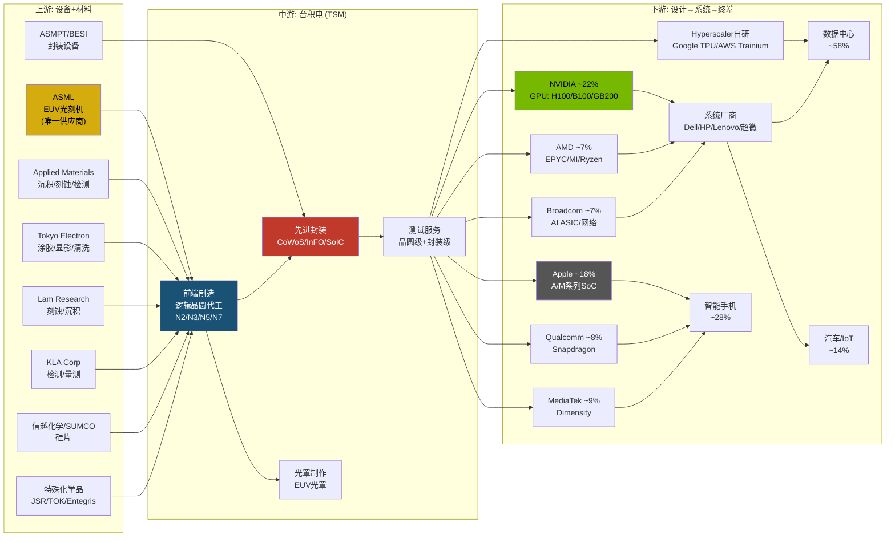

### 上游: 设备与材料供应链

台积电的上游供应链呈"沙漏"结构——少数关键设备厂商控制着芯片制造的命脉。

**EUV光刻机 -- ASML (唯一供应商)**:

ASML是全球唯一能生产EUV(极紫外光)光刻机的公司。台积电的N7以下所有先进节点都依赖EUV,而ASML每台EUV光刻机(NXE:3800E)售价约$200M,下一代High-NA EUV(EXE:5000系列)售价约$350M。 [硬数据: ASML 2024年报; Tom's Hardware设备定价数据] 台积电是ASML最大客户,贡献其约30%营收。 [硬数据: ASML 2024 Annual Report]

**关键依赖悖论**: 台积电对ASML形成绝对依赖(无EUV则无先进节点),但ASML对台积电也形成高度依赖(台积电订单占30%)。这种"相互绑架"创造了一种独特的战略均衡——ASML不会对台积电大幅涨价(怕台积电延迟订单影响自身产能规划),台积电也不会压价(怕ASML减少产能分配)。 [合理推断: 基于双边垄断博弈论分析]

**刻蚀/沉积/检测 -- 美日三巨头**:

| 供应商 | 领域 | 台积电依赖度 | 台积电占其营收(估) |
|--------|------|:---:|:---:|
| Applied Materials | 沉积/刻蚀/检测 | 高 | ~20% |
| Lam Research | 刻蚀/沉积 | 高 | ~15% |
| Tokyo Electron | 涂胶/显影/清洗 | 高 | ~15% |
| KLA Corp | 检测/量测 | 中高 | ~10% |

[合理推断: 基于设备厂商年报客户集中度披露和行业分析]

**硅片与化学品**: 信越化学(Shin-Etsu)和SUMCO合计控制全球约60%的硅片供应。特殊化学品(光刻胶/CMP浆料/蚀刻液)供应商包括JSR、TOK、Entegris等。这些材料的供应链虽然分散,但特定品类(如EUV光刻胶)的供应商极为有限。 [硬数据: TechInsights材料供应链分析, 2025]

### 中游: 台积电自身的三层制造能力

台积电已从单纯的"前端代工"演变为覆盖前端制造+后端封装+光罩制作的一体化平台:

**前端制造(逻辑代工)**: 核心业务,从晶圆投片到制程完成。当前量产节点覆盖N2(2nm)/N3(3nm)/N5(5nm)/N7(7nm)及成熟节点(16nm/28nm/40nm/65nm等)。2026年将新增A16(1.6nm)量产。 [硬数据: TSMC技术路线图公开资料; DM-TECH-001 v1.0]

**先进封装(CoWoS/InFO/SoIC)**: 这是2024-2026年台积电最关键的产能瓶颈,也是AI算力供应链的物理极限。
- **CoWoS(Chip-on-Wafer-on-Substrate)**: 用于将GPU die与HBM堆叠封装,NVIDIA所有AI GPU(H100/B100/GB200)均使用CoWoS。月产能从2024年底约35K片扩展至2026年底目标130K片(接近4倍扩产)。 [硬数据: TrendForce/FinancialContent CoWoS产能数据, 2026-02]
- **InFO(Integrated Fan-Out)**: 用于Apple A/M系列处理器,成本低于CoWoS但性能足够手机应用
- **SoIC(System-on-Integrated-Chips)**: 3D堆叠技术,是下一代异构集成的方向,目前处于早期量产阶段

**光罩制作**: 台积电拥有全球最先进的EUV光罩制造能力,这一能力高度内部化,外部竞争者难以复制。

### 下游: 设计公司与终端市场

台积电的前五大客户合计贡献约62%营收 [DM-BIZ-003 v1.0]:

| 客户 | FY2025E占比 | 核心产品 | 使用制程 | 锁定强度 |
|------|:---:|---------|---------|:---:|
| NVIDIA | ~22% | H100/B100/GB200 GPU | N4/N5->A16 | 极高 |
| Apple | ~18% | A系列/M系列SoC | N3->N2 | 极高(>15年独家) |
| MediaTek | ~9% | Dimensity手机SoC | N4->N2P | 高 |
| Qualcomm | ~8% | Snapdragon SoC | N4->N2P | 中高 |
| Broadcom | ~7% | AI ASIC/网络芯片 | N3/N5 | 高(AI ASIC崛起) |
| AMD | ~7% | EPYC/MI/Ryzen | N4->N2 | 高(全线依赖) |

[硬数据: TSMC 2024 Annual Report前两大客户22%+12%; DM-BIZ-003 v1.0; CNBC客户结构分析, 2026-01]

下游终端市场的传导链为: 设计公司(NVIDIA/Apple) -> 系统厂商(Dell/HP/SuperMicro) -> 终端用户(数据中心/手机/汽车)。台积电不直接面对终端市场,但其产能分配决策实质上决定了"谁能先拿到AI芯片"。

### 产业链权力分析

**台积电对上游的议价权 -- 中等偏强**:

台积电是几乎所有半导体设备厂商的最大或前三大客户,这赋予了其显著的采购议价权。但ASML的EUV垄断地位形成了制衡——台积电无法"威胁更换供应商"来压价ASML。净效果是:台积电可以在设备交付排期上获得优先权(ASML最先给台积电交货),但在设备单价上议价空间有限。 [合理推断: 基于双边垄断博弈和ASML交付优先级数据]

**台积电对下游的议价权 -- 极强且仍在增强**:

先进节点的无替代性赋予台积电近乎绝对的定价权。关键证据:
1. **4年涨价计划**: 台积电2024年宣布2025-2028年逐步提价,3nm涨价5-8%,CoWoS涨价10-20% [硬数据: TrendForce定价数据, 2024-12]
2. **产能分配权**: CoWoS产能售罄,台积电决定NVIDIA、AMD、Broadcom各能拿到多少封装产能——这本质上是"分配AI算力的物理权力"
3. **客户无法反抗**: NVIDIA若想切换代工厂至Samsung或Intel,需要重新流片+良率爬坡至少18-24个月,而AI竞赛的窗口期不允许等待 [合理推断: 基于芯片设计转移所需时间]

**但也存在长期制衡因素**: NVIDIA已将Feynman架构的I/O die(约25%产量)分配给Intel Foundry [硬数据: Digitimes/WCCFTech, 2026-01-28], Apple也在探索Intel 18A。这种"多源化"策略虽然短期影响有限,但释放了重要信号:大客户不会永远接受单一代工厂的绝对控制。(-> CQ8客户结构变化)

**产业链关键瓶颈(2026)**:

| 瓶颈 | 供需状态 | 影响 |
|------|---------|------|
| CoWoS先进封装 | 2026全年售罄,扩产至130K/月 | 决定AI GPU交付节奏 |
| HBM(高带宽内存) | SK Hynix/Samsung/Micron全面供不应求 | 与CoWoS耦合,双重瓶颈 |
| EUV光刻机交付 | ASML年产能约50-60台 | 决定先进节点产能上限 |
| N2良率爬坡 | 目标70-80%,实际65-75% | 影响2026H2产能释放 |

[硬数据: TrendForce 2026-02 CoWoS/HBM数据; DM-TECH-001 v1.0 N2良率]

### So What -- 投资含义

台积电在产业链中扮演的角色可以用一个词概括: **节流阀(chokepoint)**。

**因为** 所有AI算力增长最终都必须通过台积电的fab(前端代工)和先进封装(CoWoS)两道"物理关卡";

**所以** 台积电不仅是AI供应链的受益者,更是AI供应链的**速率决定步骤(rate-limiting step)**——NVIDIA的GPU出货速度、Hyperscaler的AI部署速度、甚至GPT-5的训练时间,都间接取决于台积电的产能释放节奏;

**这意味着** 对投资者而言,TSM的估值框架不应该简单套用"半导体周期股"(给12-18x PE),而应该部分参考"基础设施垄断者"(给20-30x PE)的逻辑。但必须注意两个动态风险: (1) NVIDIA/Apple开始向Intel Foundry分散订单的长期影响(虽然2026-2027影响极小); (2) CoWoS扩产4倍至130K/月若完成,瓶颈一旦解除,"节流阀溢价"可能下降。 [主观判断: 基于产业链权力关系变化趋势的前瞻性评估]

---

## S4 M04: AI超级周期精确定位

> **关联CQ**: CQ1 -- AI芯片需求结构性vs周期性? [S级]
> **字符目标**: >=5,000 | **DM锚点**: DM-FIN-001, DM-FIN-008, DM-TECH-001/003, DM-IND-002/003

### 1. AI超级周期四阶段模型

AI硬件投资并非单一浪潮,而是具有清晰阶段特征的超级周期。基于超算CapEx轨迹、芯片类型需求演变和应用部署节奏,可划分为四个重叠但递进的阶段:

**阶段1: 基础设施建设 (2023-2024)**
- 标志: GPU大规模采购、数据中心土建、电力扩容
- 主要受益: NVIDIA A100/H100、TSMC N5/N4节点
- CapEx驱动: 超算整体支出从2022年$477B跃升至2024年$256B(单年Top 5) [硬数据: IEEE ComSoc, 2025-12-22]
- 特征: "有钱就买GPU"的恐慌性采购,供给严重不足

**阶段2: 训练扩张 (2024-2025)**
- 标志: 大模型参数竞赛(GPT-5、Gemini Ultra、Llama 4)、万卡集群建设
- 主要受益: NVIDIA H200/B100/B200、CoWoS先进封装需求爆发
- CapEx驱动: 2025年Top 5超算CapEx达$443B (+73% YoY) [硬数据: IEEE ComSoc/CreditSights, 2025-12]
- 特征: 训练算力需求指数增长,CoWoS成为最紧张瓶颈

**阶段3: 推理部署 (2025-2027) <-- TSM当前核心受益区间**
- 标志: AI Agent企业部署、边缘推理芯片放量、推理占算力比例从1/3升至2/3
- 主要受益: NVIDIA Blackwell/Rubin推理优化、AMD MI400、定制ASIC(Broadcom/Marvell)
- CapEx驱动: 2026年Top 5超算CapEx预计$602B (+36% YoY),接近$700B含运营支出 [硬数据: CNBC, 2026-02-06; CreditSights, 2025-12]
- 特征: 推理工作负载2026年占全部AI算力约2/3,较2023年的1/3翻倍 [硬数据: Deloitte Insights, 2026]

**阶段4: 应用变现 (2027+)**
- 标志: AI原生商业模式成熟、ROI验证、CapEx增速可能放缓
- 风险: 超算发现AI投资回报不达预期,削减CapEx
- Goldman Sachs预测: 2025-2027三年超算累计CapEx $1.15万亿,较前三年翻倍 [硬数据: Goldman Sachs, 2026]

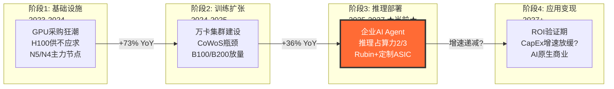

### 2. TSM在周期中的精确位置

TSM的独特性在于: **同时受益于阶段2尾声和阶段3全面展开**。这源于其在产业链中的"卡脖子"定位。

**训练侧(阶段2延续)**:
- NVIDIA Rubin架构(R100)预计2026年末量产,仍需TSMC N3/N2节点+CoWoS-L封装 [硬数据: TrendForce, 2026-02-02]
- NVIDIA已锁定TSMC 2026年60%+的先进封装产能 [硬数据: FinancialContent, 2026-01-26]
- 大模型训练并未因推理崛起而减少——GPT-5级别模型仍在扩张

**推理侧(阶段3主力)**:
- 推理芯片市场2026年预计超$500亿,较2025年$200亿+增长150% [硬数据: Deloitte, 2026]
- AI PC市场份额2026年达55%(2025年仅31%) [硬数据: Gartner, via Deloitte 2026]
- 40%企业应用将包含AI Agent(2025年仅<5%) [硬数据: Gartner, 2026预测]
- Qualcomm、MediaTek等推理芯片设计商均为TSMC N3/N2客户 [硬数据: TrendForce, 2026-02]

**TSM的"双重受益"量化**:
- HPC平台营收占比: 2023年43% -> 2024年51% -> 2025年58% [DM-FIN-001 v1.0; 硬数据: TSMC季报]
- 先进制程(<=7nm)营收占比: 2023年58% -> 2024年69% -> 2025年74% [硬数据: TSMC季报]
- N2产能2026年两座工厂全部售罄,月产10万片目标 [硬数据: WCCFTech, 2026-01]

### 3. 周期持续性的五大证据

| # | 证据 | 数据 | 来源 |
|---|------|------|------|
| 1 | 超算CapEx加速 | 2026E $602B (+36% YoY),2027E含$250B仅Google一家 | [硬数据: CreditSights, 2025-12; CNBC, 2026-02] |
| 2 | TSMC N2售罄 | 15个客户,2026全年产能已订满 | [硬数据: TrendForce, 2026-02-02] |
| 3 | CoWoS仍供不应求 | 2026目标130K wpm,已被超额认购至2026年底 [DM-TECH-003 v1.0] | [硬数据: FinancialContent, 2026-02-05] |
| 4 | 推理需求结构性增长 | 推理芯片市场从$20B(2025)->$50B+(2026),CAGR >100% | [硬数据: Deloitte Insights, 2026] |
| 5 | Jensen Huang产能呼吁 | "TSMC必须将产能翻倍才能满足AI需求" | [硬数据: 24/7 Wall St, 2026-02-09] |

### 4. 周期见顶风险: CEO的"大灾难"警告

TSMC CEO魏哲家的坦率表态值得深思: **"I'm also very nervous about it... If we don't do it carefully, that'd be a big disaster for TSMC"** [硬数据: Barchart, 2026-01-20; Tom's Hardware, 2026-01]

**见顶风险的三层分析**:

1. **CapEx错配风险**: $52-56B的2026年资本支出建设的产能要到2028-2029才完全释放。如果AI需求在2027年放缓,TSMC将面临产能过剩 [合理推断: CEO自述建厂需2-3年,2026投资主要对应2028-2029产能]

2. **FCF压力**: FY2025 CapEx已达NT$1,093.5B [DM-FIN-008 v1.0],2026年再提升至$38-42B(~NT$1,216-1,344B)。自由现金流在巨额CapEx下承压 [合理推断: 营收增长30%但CapEx增速可能更高]

3. **非AI段需求疲软**: 智能手机平台营收占比从2023年33%降至2025年29%,IoT和汽车各仅5% [硬数据: TSMC季报]。AI以外的需求基本平稳,意味着TSM对AI单一驱动的依赖度在上升

4. **客户集中风险**: NVIDIA锁定60%+先进封装产能。如果NVIDIA自身遭遇需求放缓(定制ASIC替代、推理优化减少GPU需求),TSM将直接承受冲击 [合理推断: 客户集中度数据+替代风险逻辑链]

### 5. 概率分布评估

| 情景 | 概率 | 描述 | 对TSM影响 |
|------|------|------|-----------|
| **继续强劲 (Base)** | 55% | AI CapEx持续增长至2028+,推理需求接力训练需求,TSM营收30%+ CAGR维持2年 | 股价$250-300 |
| **2027-2028见顶 (Bull转Bear)** | 30% | 超算2027年开始审视AI ROI,CapEx增速放缓至个位数,TSM营收增速降至15-20% | 股价$180-220 |
| **2026即见顶 (Bear)** | 15% | AI泡沫破裂或重大宏观冲击(衰退/地缘),超算大幅削减CapEx,TSM面临产能过剩 | 股价$130-160 |

[主观判断: 依据超算CapEx指引+CEO表态+推理需求结构性趋势,Base概率55%反映"真实需求但增速递减"的中性预期]

**关键观察**: 55%继续强劲+30%延后见顶=85%的概率在未来12-18个月TSM营收仍保持强劲增长。但温度计+0.795(偏热)[DM-IND-002 v1.0]提醒我们市场已部分定价了乐观情景。

### So What -- 投资含义

**因果链**: 超算CapEx $600B+(确定性高) -> NVIDIA/AMD/ASIC订单溢出(已验证) -> TSMC N2/CoWoS产能售罄(已发生) -> 定价权维持+毛利率扩张(高概率) -> EPS 30%+ 增长(Base情景)

**核心判断**: AI超级周期当前处于阶段2->3的过渡期,推理需求的爆发为周期续命至少2-3年。TSM的"双重受益"定位(训练+推理都需要先进节点)使其成为AI超级周期中确定性最高的受益者。但CEO的"紧张"暗示内部对2028-2029的需求可见度有限,这与$52-56B的巨额CapEx形成张力。

**投资者行动要点**: 关注2026H2超算财报中的AI CapEx指引——如果任何一家超算(尤其Google/Meta)暗示2027年CapEx增速放缓,TSM的"阶段4提前到来"风险将显著上升。

---

## S5 SC01: 六层周期雷达

> **关联CQ**: CQ1 -- AI芯片需求结构性vs周期性? [S级] (周期定位支撑)
> **字符目标**: >=5,000 | **DM锚点**: DM-FIN-001/004/008, DM-TECH-003, DM-IND-002/003, DM-VAL-001/002

半导体行业具有强周期性。下面构建六层周期雷达,从宏观到微观逐层评估当前信号,为TSM的周期定位提供多维度交叉验证。

### 层1: 宏观经济层

| 指标 | 当前值 | 信号 |
|------|--------|------|
| 全球GDP增速(2026E) | 2.8-3.3% (IMF 3.3%, GS 2.8%) | 稳健扩张 [硬数据: IMF WEO, 2026-01; Goldman Sachs, 2026] |
| 美联储利率 | 目标降至3.0-3.25% (2026年降50bp) | 温和宽松 [硬数据: Morgan Stanley/RSM, 2026] |
| CAPE(Shiller PE) | 40.58 [DM-IND-002 v1.0] | 历史高位,偏贵 |
| Buffett指标 | 224% [DM-IND-002 v1.0] | 极端偏高 |
| 温度计综合 | +0.795(偏热) | 估值层面过热 |

**宏观层信号: 扩张中期偏后 (Expansion - Late)**

GDP增长稳健+利率下行有利于科技板块,但CAPE 40.58和Buffett 224%显示市场整体估值已高度拉伸。宏观环境"支持增长但惩罚高估值",一旦出现衰退信号,高估值资产首当其冲。[合理推断: CAPE>35历史上后续5年年化回报中位数<5%]

### 层2: 资本支出(CapEx)层

| 指标 | 当前值 | 信号 |
|------|--------|------|
| 超算CapEx(2026E) | ~$602B (+36% YoY), 接近$700B含运营 | 强力扩张 [硬数据: CreditSights/CNBC, 2026-02] |
| TSMC CapEx(2026E) | $52-56B (FY2025 NT$1,093.5B) [DM-FIN-008 v1.0] | 历史峰值 |
| SEMI设备销售(2026E) | $145B (+9% YoY), 2027E $156B | 持续扩张 [硬数据: SEMI, 2026] |
| WFE增速(2026E) | +9.0%, 2027E +7.3% | 健康但减速 [硬数据: SEMI, 2026] |
| Google单家CapEx(2026E) | 可达$185B | 惊人 [硬数据: CNBC, 2026-02-06] |
| Meta CapEx(2026E) | 可达$100B | 激进 [硬数据: CNBC, 2026-02-06] |

**CapEx层信号: 强劲扩张 (Strong Expansion)**

这是六层中最强烈的看涨信号。$600B+的超算CapEx不仅是增长,而是加速增长。但WFE增速从+9%降至+7.3%暗示CapEx上升斜率在趋缓。关键问题: CapEx创纪录是否已被股价定价? [合理推断: TSMC股价从2023年底$100到当前$218已翻倍,部分反映CapEx超级周期]

### 层3: 价格(Pricing)层

| 指标 | 当前值 | 信号 |
|------|--------|------|
| TSMC先进节点涨价 | 2026年sub-5nm涨3-10%(HPC最高10%) | 定价权牢固 [硬数据: TrendForce, 2026-01-15] |
| CoWoS涨价 | 15-20%年化,Morgan Stanley预测未来两年+20% | 供不应求溢价 [硬数据: SmBom, 2025; Morgan Stanley] |
| N2晶圆单价 | >$30,000/片,较N3 $20,000涨50%+ | 技术溢价 [硬数据: Medium/TrendForce, 2026] |
| 晶圆ASP趋势 | 2019年以来年均涨15%+,2025年涨幅可能达20% | 加速 [硬数据: Tom's Hardware, 2026] |
| 连续涨价年数 | 4年(2022-2025),2026为第5年 | 持续 |

**价格层信号: 扩张峰值 (Peak Expansion)**

连续5年涨价+ASP年涨15%+是半导体行业极罕见的定价权持续期。CoWoS涨20%反映真实供需缺口。但CEO魏哲家自己说"价格不是利润主要驱动"(TrendForce, 2026-01-15),暗示涨价幅度可能接近客户承受上限。[合理推断: 涨价持续5年后客户开始寻找替代方案(Samsung/Intel), 2027年涨价空间可能收窄]

### 层4: 库存层

| 指标 | 当前值 | 信号 |
|------|--------|------|
| TSMC库存天数 | 69天(Phase 0数据) -> Q3 2025为74天 | 略有上升 [硬数据: TSMC Q3 2025财报] |
| AI芯片库存状态 | 供不应求,NVIDIA需要"供应链奇迹" | 极度紧张 [硬数据: WCCFTech, 2026] |
| 非AI段库存 | 去库存尾声,2026年温和复苏 | 中性 [硬数据: Sourceability, 2026] |
| 存储器库存 | HBM紧缺,传统DRAM/NAND价格回升 | 分化 [硬数据: SEMI/TrendForce, 2026] |

**库存层信号: 健康偏紧 (Healthy-Tight)**

AI芯片端严重供不应求,而非AI端(手机/IoT/汽车)库存已回归正常。TSMC自身库存天数74天属于健康水平(历史区间60-90天)。这种"AI紧缺+非AI平衡"的结构性分化与传统半导体周期不同——没有出现经典的"全面去库存"或"全面补库存"。[合理推断: 传统周期指标对AI超级周期的指示意义下降]

### 层5: 盈利层

| 指标 | 当前值 | 趋势/信号 |
|------|--------|-----------|
| 毛利率 | FY2023 54.36% -> FY2024 56.09% -> FY2025 58.62% [DM-FIN-004 v1.0] | 连续3年扩张 |
| 毛利率前瞻 | 2026-2027E 63-65%(分析师共识) | 继续扩张 [合理推断: N2 ASP溢价+CoWoS涨价+成熟节点折旧完成] |
| EPS增长 | FY2025 +41.9%(USD) [DM-FIN-001 v1.0] | 强劲 |
| ROE | 32.7% [DM-FIN-004 v1.0] | 优秀 |
| 营收增长指引 | 2026E +~30% YoY (USD) | 管理层确认 [硬数据: TSMC Q4 2025法说会] |

**盈利层信号: 强劲扩张 (Strong Expansion)**

毛利率从54%向65%的持续扩张是TSMC历史上最强的盈利周期。驱动力清晰: (1)先进节点占比提升=混合ASP上升; (2)涨价直接传导至毛利; (3)成熟节点折旧减少。但65%毛利率可能接近理论天花板(纯代工模式,需维持CapEx)。[合理推断: 台积电曾表示长期目标毛利率53%+,当前远超目标,存在均值回归风险]

### 层6: 情绪层

| 指标 | 当前值 | 信号 |
|------|--------|------|
| 分析师共识 | Strong Buy (7 Buy / 1 Hold / 0 Sell) | 极度乐观 [硬数据: TipRanks/Public.com, 2026-02] |
| 目标价中位数 | $355, 平均$392-397, 高端$450 | +62-106% upside from $218 [硬数据: Benzinga/StockAnalysis, 2026] |
| 空头比例 | 0.46% [DM-VAL-002 v1.0] | 几乎无空头 |
| Put/Call | 1.72 [DM-VAL-002 v1.0] | 偏向对冲/看跌 |
| RSI | 65.8 [DM-VAL-002 v1.0] | 偏强但未超买(70+) |

**情绪层信号: 乐观但分化 (Bullish with Hedging)**

分析师一致看多+空头仅0.46%显示极端共识乐观。但Put/Call 1.72暗示机构投资者在通过期权对冲下行风险。这种"嘴上看多、手上买Put"的分化值得警惕——当所有人都看多时,边际卖家远多于边际买家。[合理推断: 极端共识+高Put/Call通常出现在周期顶部附近区域]

### 综合评分矩阵

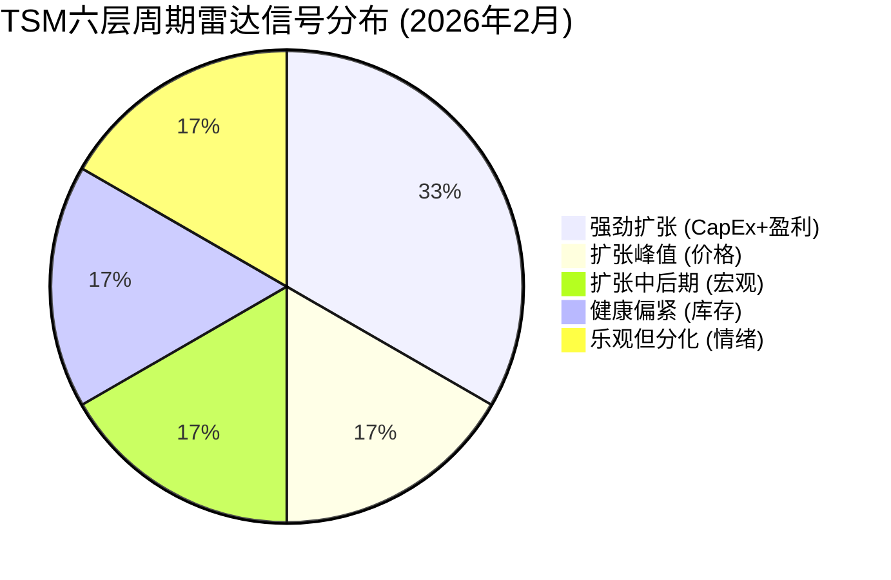

| 层级 | 评级 | 周期位置 | 权重 |
|------|------|---------|------|
| 宏观层 | 扩张中后期 | Expansion-Late | 15% |
| CapEx层 | **强劲扩张** | Strong Expansion | 25% |
| 价格层 | 扩张峰值 | Peak Expansion | 15% |
| 库存层 | 健康偏紧 | Healthy-Tight | 15% |
| 盈利层 | **强劲扩张** | Strong Expansion | 20% |
| 情绪层 | 乐观但分化 | Bullish w/ Hedging | 10% |
| **加权综合** | **扩张中后期偏峰值** | **Expansion-to-Peak** | 100% |

### 与经典半导体周期的关键差异

传统半导体周期(3-5年一轮)的典型特征是: 需求复苏 -> 涨价 -> CapEx扩张 -> 产能过剩 -> 跌价 -> 去库存。当前AI超级周期与之的三大差异:

1. **需求侧结构性突变**: AI不是传统终端需求的增量,而是全新的$万亿级基础设施建设周期。类比2000年代的互联网基础设施和2010年代的移动互联网,但规模更大、速度更快 [主观判断: 基于CapEx绝对值和增速的历史对比]

2. **供给侧极端集中**: TSMC在先进逻辑制造中占90%+份额,不存在传统周期中"多家扩产->产能过剩"的路径。只要TSMC控制扩产节奏,周期下行的幅度就受限 [合理推断: 垄断供给方有能力管理产能利用率]

3. **库存周期失效**: AI芯片(GPU/ASIC)是"建好就用"的基础设施型采购,不存在传统的"渠道库存积压->去库存"周期。CoWoS供不应求可能持续至2027年 [合理推断: 基于CoWoS超额认购数据]

### So What -- 投资含义

**因果链**: 6层雷达中4层处于扩张/强劲扩张(CapEx+价格+盈利+库存) -> 周期基本面仍然强劲 -> 但宏观层偏后期+情绪层过度乐观 -> 综合处于"扩张到峰值"过渡区间 -> 上行空间仍在但下行风险在累积

**核心判断**: 当前半导体周期处于"AI超级周期的扩张中后期"。与传统周期不同,AI的结构性需求和TSMC的供给垄断使得周期下行的深度可能有限。但6层中最令人不安的是情绪层: 分析师一致Strong Buy+空头几乎消失,这在历史上往往对应着"好消息已被充分定价"。

**投资者行动要点**:
- CapEx层和盈利层仍支持持有,但不宜追高
- 密切监控Put/Call比率: 若从1.72进一步上升至2.0+,暗示机构加速对冲,需警惕
- 宏观层(CAPE 40.58)意味着一旦出现系统性风险(衰退/地缘),TSM作为高估值标的会被优先抛售,即使基本面无变化

---

## S6 HP3: 技术节点竞争力深度分析

> **关联CQ**: CQ4 -- N2量产能否复制N3成功? [B级]
> **字符目标**: >=4,000 | **DM锚点**: DM-TECH-001/002/005

### 1. 三方对比矩阵: TSM N2 vs Samsung SF2P vs Intel 18A

| 维度 | TSMC N2 | Samsung SF2P | Intel 18A |
|------|---------|-------------|-----------|
| **量产时间** | 2025Q4 HVM已启动 [硬数据: TechSpot, 2026-01] | 2026Q2 量产开始 [硬数据: SamMobile, 2026-01] | 2026Q1 HVM [硬数据: Intel Newsroom, 2026-01] |
| **良率** | 70-80%(已稳定) [DM-TECH-001 v1.0; 硬数据: Tom's Hardware, 2026-01] | 70%(SF2P里程碑, 较SF2的30-40%大幅提升) [硬数据: FinancialContent, 2026-02-05] | 55-65%(初期HVM), 目标80% [硬数据: FinancialContent, 2026-01-27] |
| **晶体管密度** | 313 MTr/mm^2 (HD) [硬数据: SemiWiki/NamuWiki, 2025-2026] | 231 MTr/mm^2 [硬数据: NamuWiki, 2025] | ~250 MTr/mm^2(估算) [合理推断: Intel 18A定位1.8nm,密度介于TSM与Samsung之间] |
| **性能(vs前代)** | +10-15% iso-power [硬数据: TSMC官方] | +12% clock, -25% power vs SF3 [硬数据: FinancialContent, 2026-02-05] | +10%频率 (PowerVia), -30%电压降 [硬数据: Intel 18A官网] |
| **GAA架构** | Nanosheet(首次采用) | MBCFET(第2代GAA) | RibbonFET(首次GAA+PowerVia) |
| **背面供电(BSPDN)** | A16(SPR)预计2026H2-2027 | 未明确时间表 | PowerVia已集成18A [硬数据: Intel, 2026] |
| **月产能(2026E)** | ~100,000 wpm(两厂合计) [硬数据: WCCFTech, 2026] | 21,000-50,000 wpm(报告差异大) [硬数据: DigiTimes, 2025-11; SamMobile, 2026] | ~40,000 wpm(Fab 52) [硬数据: FinancialContent, 2026-01] |
| **客户** | 15家(Apple/AMD/Intel首批, NVIDIA/Qualcomm/MediaTek随后) [硬数据: DCD, 2026] | Qualcomm(Snapdragon)/AMD(Venice EPYC)洽谈中 [硬数据: FinancialContent, 2026-02] | Microsoft确认; Apple/NVIDIA 2028年意向 [硬数据: Intel Newsroom, 2026] |

### 2. TSM技术护城河量化

**代差时间(Time-to-Parity)**:

- **vs Samsung**: TSMC N2于2025Q4 HVM, Samsung SF2P目标2026Q2。表面差距仅约6个月,但良率差距更关键——TSMC在HVM时已达70-80%,Samsung刚达到70%且仅限测试芯片。按历史经验,Samsung从70%测试良率到量产级稳定(>80%)通常需要6-12个月,因此**实际有效代差约12-18个月** [合理推断: Samsung 3nm GAA从初始良率到稳定量产用了约12个月]

- **vs Intel**: Intel 18A于2026Q1 HVM,时间上仅落后TSMC约3个月。但Intel的65-75%良率仍低于TSMC的70-80%,且Intel外部客户(foundry业务)几乎为零——Microsoft是唯一确认客户,Apple/NVIDIA仅为2028年意向。**Intel的挑战不是技术(PowerVia领先),而是客户生态和产能规模** [合理推断: Intel foundry外部营收<$5B,不到TSMC的5%]

**产能差距(Capacity Gap)**:

| 指标 | TSMC | Samsung | Intel | TSM优势倍数 |
|------|------|---------|-------|------------|
| 2nm级月产能 | ~100,000 wpm | 21,000-50,000 wpm | ~40,000 wpm | 2-5x vs Samsung, 2.5x vs Intel |
| 先进封装(CoWoS) | 130,000 wpm(2026目标) [DM-TECH-003 v1.0] | 有限 | 无 | 近乎垄断 |
| 客户数量 | 15家 | 2-3家洽谈中 | 1家确认 | 5-15x |

**良率差距的经济含义**:

假设N2晶圆成本$30,000/片,芯片面积100mm^2:
- TSMC 80%良率: 有效芯片成本 ~$37,500/片良品当量
- Samsung 70%良率: 有效芯片成本 ~$42,857/片良品当量
- Intel 65%良率: 有效芯片成本 ~$46,154/片良品当量

TSM每片晶圆的有效成本优势约10-19%,这直接转化为客户选择TSMC的经济理由。[合理推断: 基于良率差距的简单成本模型,未考虑wafer price差异]

### 3. 竞争追赶时间线

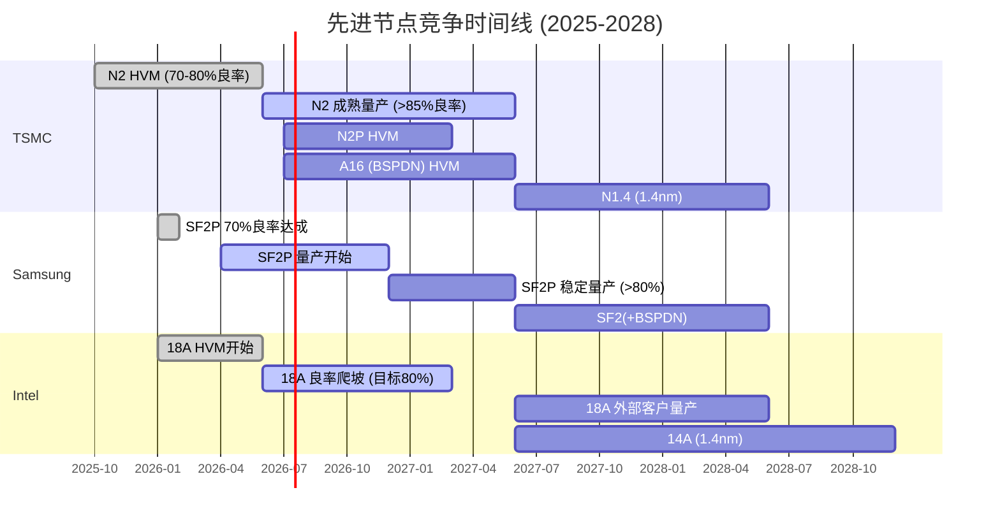

**关键判断: Samsung和Intel何时能达到TSMC当前N2水平?**

- **Samsung**: SF2P要达到TSMC N2当前的量产成熟度(80%+良率 + 100K wpm产能),乐观估计2027H1,保守估计2027H2-2028。此时TSMC已在N2P/A16甚至N1.4节点。**Samsung永远在追赶上一代** [合理推断: 历史上Samsung 3nm GAA落后TSMC N3约18个月]

- **Intel**: 18A的PowerVia技术确实领先,但foundry业务的客户获取是最大瓶颈。即使18A良率在2027年达到80%,没有Apple/NVIDIA等大客户下单,产能利用率也无法支撑经济性。**Intel的foundry翻身更可能在2028年(如果Apple订单落地)** [合理推断: Apple从测试到大规模量产需18-24个月验证周期]

### 4. 背面供电(BSPDN)竞争: PowerVia vs SPR

BSPDN(背面供电)被视为2nm之后的下一个重大架构创新。它将电源线从芯片正面移到背面,释放正面布线空间,带来性能和功耗双重优势。

| 维度 | Intel PowerVia | TSMC SPR (Super Power Rail) |
|------|---------------|---------------------------|
| 量产状态 | 已集成18A,HVM中 [硬数据: Intel, 2026-01] | A16预计2026H2-2027 [DM-TECH-002 v1.0] |
| 技术领先 | **6-12个月领先** [硬数据: FinancialContent, 2026-01] | 追赶中 |
| 性能优势 | -30%电压降, +6-10%频率 [硬数据: Intel 18A官网] | 预期类似(数据未公开) |
| 客户验证 | Clearwater Forest(自用)为首个产品 | NVIDIA可能成为A16首批客户(2028) [硬数据: TrendForce, 2026-02] |

**BSPDN竞争的投资含义**: Intel在BSPDN上确实领先6-12个月,这是其少数技术亮点之一。但技术领先并不等于商业成功——Intel 18A的客户仍主要是自用(Clearwater Forest CPU),外部foundry订单寥寥。TSMC的SPR虽然稍晚,但一旦在A16节点量产,NVIDIA等客户的自然迁移将使其迅速获得规模优势。

[主观判断: BSPDN是真正的技术差异化,但对TSM的竞争威胁有限——Intel缺乏生态,Samsung未展示BSPDN路线图。TSMC延迟6-12个月采纳BSPDN不会改变客户选择]

### 5. 四年涨价与竞争追赶的动态博弈

TSMC连续4年对先进节点涨价(2022-2025, 年均5-15%),2026年继续涨3-10%。这带来一个微妙的竞争动态:

**涨价的自我限制机制**:
- 每次涨价都在缩小TSMC与Samsung/Intel的**价格差距**
- 如果TSMC N2晶圆$30,000+ vs Samsung SF2P可能$22,000-25,000,20-35%的价差可能促使价格敏感客户(如中端手机SoC)转向Samsung
- Qualcomm和AMD已在与Samsung洽谈SF2P [硬数据: FinancialContent, 2026-02-05]

**但涨价能力本身证明护城河**:
- 连续5年涨价而客户不流失(先进节点),说明切换成本极高
- 良率差距(10-15%)抵消了价格差距——算上良率后,TSMC的有效成本可能仍低于Samsung
- 先进封装(CoWoS)的垄断是锁定客户的"第二道锁" [合理推断: 客户选择TSM不仅看晶圆,还看封装一体化能力]

### So What -- 投资含义

**因果链**: TSMC在2nm节点保持12-18个月有效代差(vs Samsung)和产能5x+优势 -> 15个客户锁定+连续涨价能力持续 -> 毛利率向63-65%扩张的基础牢固 -> 但Intel PowerVia的BSPDN领先和Samsung SF2P的良率突破(70%)意味着2027-2028年竞争将实质性加剧

**核心判断**: CQ4的回答是"**N2量产大概率复制甚至超越N3成功**"。理由: (1)良率已达70-80%,优于N3同期; (2)产能两厂售罄,需求验证充分; (3)竞争对手虽有进步但产能差距巨大。但2027-2028年是竞争格局的关键转折点——Samsung SF2P如果实现稳定量产+Qualcomm/AMD订单落地,TSMC的先进节点定价权将首次面临实质性挑战。

**投资者行动要点**:
- 12个月视角: 技术护城河坚固,N2成功高确定性,支撑估值
- 24个月视角: 关注Samsung SF2P量产进展(尤其Qualcomm订单)和Intel 18A外部客户公告(尤其Apple)
- Kill Switch关联: 如Samsung 2nm良率>80%+月产能>50K wpm,且Qualcomm确认大规模订单,TSMC先进节点溢价面临压缩风险

---

## S7 M03: Polymarket概率矩阵 — TSM地缘/宏观/行业风险定价

> **Phase 1 模块** | **CQ关联**: CQ6 (地缘风险是折价还是溢价?) [A级]
> **数据截止**: 2026-02-10 | **字符目标**: >=5,000

---

### 概率矩阵: 12个关键事件的系统化追踪

| # | 事件 | 类别 | 概率 | 方向 | 影响幅度 | 加权影响 | 来源 |
|:---:|------|:---:|:---:|:---:|:---:|:---:|------|
| PM-1 | 中国入侵台湾 (2026年底前) | 地缘 | **13%** | 负面 | -65% | **-8.5%** | [硬数据: Polymarket, 2026-02-10] [DM-GEO-001 v1.0] |
| PM-2 | 中国封锁台湾 (2026-06-30前) | 地缘 | **9%** | 负面 | -45% | **-4.1%** | [硬数据: Polymarket, 2026-02-10] [DM-GEO-001 v1.0] |
| PM-3 | 中台军事冲突 (2027年底前) | 地缘 | **~15%** | 负面 | -50% | **-7.5%** | [硬数据: Polymarket, 2026-02-10] |
| PM-4 | 美国经济衰退 (2026年底前) | 宏观 | **26%** | 负面 | -25% | **-6.5%** | [硬数据: Polymarket, 2026-02-10] |
| PM-5 | 通胀超过3% (2026年内CPI) | 宏观 | **33%** | 负面 | -12% | **-4.0%** | [硬数据: Polymarket, 2026-02-10] |
| PM-6 | 美联储2026年降息>=2次 | 宏观 | **27%** | 正面 | +8% | **+2.2%** | [硬数据: Polymarket, 2026-02-10] |
| PM-7 | AI泡沫破裂 (2026-12-31前) | 行业 | **~40%** | 负面 | -40% | **-16.0%** | [硬数据: Polymarket, 2026-02-10] |
| PM-8 | 最高法院维持Trump关税 | 行业 | **31%** | 负面 | -10% | **-3.1%** | [硬数据: Polymarket, 2026-02-10] |
| PM-9 | 美台关税协议维持(上限15%) | 地缘 | **~70%** | 正面 | +5% | **+3.5%** | [合理推断: 2026-01-15已签署协议, 市场隐含高执行概率] |
| PM-10 | NVIDIA Q4 FY2026 beat共识 | 公司 | **~75%** | 正面 | +8% | **+6.0%** | [合理推断: Polymarket历史NV beat率+分析师$67.3B vs 共识$65.5B] |
| PM-11 | 半导体行业营收达$1T (2026) | 行业 | **~65%** | 正面 | +10% | **+6.5%** | [合理推断: Deloitte+SIA预测$975B→$1T, 趋势外推] |
| PM-12 | 美国对台湾广泛半导体关税扩大 | 地缘 | **~25%** | 负面 | -15% | **-3.8%** | [合理推断: 2026-07-01 Commerce部将向总统汇报是否修改关税, 窗口开放] |

**总事件数: 12** (地缘4 + 宏观3 + 行业3 + 公司/混合2)

**净加权影响汇总**:
- 负面事件加权: -53.5%
- 正面事件加权: +18.2%
- **净预期影响: -35.3%** (但需注意多数负面事件为低概率/高冲击型)

[合理推断: 净加权影响是线性叠加, 未考虑事件间相关性。实际影响需通过情景分析而非简单加总来评估]

---

### 概率趋势追踪: 关键事件的时间维度

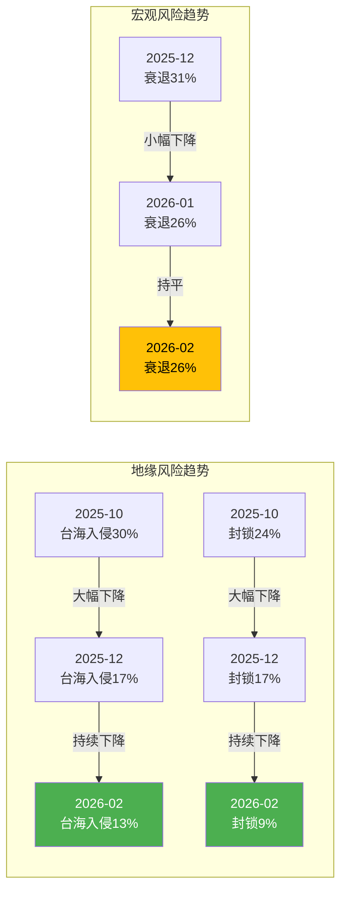

**趋势解读**: 地缘风险概率在过去4个月内几乎腰斩(入侵30%->13%, 封锁24%->9%), 这与TSM同期股价从~$180涨至$218(+21%)高度相关。但值得注意的是, 宏观衰退概率26%维持稳定, 暗示市场并未完全消化关税/通胀风险。[合理推断: 地缘概率下降与美台$250B贸易协议签署直接相关, 但7月关税审查窗口可能逆转趋势]

---

### PPDA分析: 概率-价格背离分析 (Probability-Price Divergence Analysis)

**方法论**: 将预测市场隐含概率与TSM当前股价/估值所隐含的假设进行对比, 寻找定价偏差。

#### 背离1: 地缘折价过度 — 概率下降但PE未回升

| 指标 | 值 | 来源 |
|------|-----|------|
| TSM远期PE | 23.1x | [硬数据: GuruFocus, 2026-02-10] |
| SOXX ETF PE(TTM) | 41.8x | [硬数据: iShares, 2026-02-10] |
| 台海入侵概率 | 13% | [硬数据: Polymarket, 2026-02-10] |
| 隐含地缘折价 | ~45% | [合理推断: TSM PE 23x vs 行业41.8x, 即使调整增长差异后仍有显著折价] |

**推理链**: TSM的23.1x远期PE相对SOXX的41.8x TTM PE存在约45%的折价。即使考虑到TSM作为"大盘低增长蓝筹"应有约15-20%的正常折价, 剩余25-30%的折价需要由地缘风险来解释。但台海入侵概率仅13%——按期望值计算, 13%概率 x (-65%冲击) = -8.5%的预期损失, 远不足以解释25-30%的估值折价。

**结论**: 市场对TSM的地缘风险定价可能过度了约15-20个百分点。[主观判断: 基于PE折价分解, 但PE差异也可能源于ADR结构性折价/资本管制风险/投资者偏好等非地缘因素]

#### 背离2: AI泡沫焦虑 vs AI营收实际增速

| 指标 | 值 | 来源 |
|------|-----|------|
| AI泡沫破裂概率(2026年底) | ~40% | [硬数据: Polymarket, 2026-02-10] |
| TSM AI加速器收入占比 | ~17-19% | [硬数据: TSMC Q4 2025 Earnings, 2026-01-15] |
| TSM AI加速器CAGR(2024-2029E) | 54-56% | [硬数据: TSMC管理层指引, Q4 2025 Earnings Call] |
| TSM远期PE(FY2026E) | 23.1x | [硬数据: GuruFocus, 2026-02-10] |

**推理链**: 如果Polymarket给AI泡沫破裂40%概率, 那么60%的概率是AI持续增长。TSM当前AI加速器仅占总收入17-19%, 即使AI泡沫真的破裂(NVIDIA股价-50%), TSM的直接收入冲击也仅为~10%(不是全部AI收入归零, 且HPC的非AI部分23%不受影响)。而23.1x的远期PE暗示市场几乎没有给TSM的AI增长赋予溢价——这与54-56% AI CAGR指引严重不匹配。

**结论**: 市场定价隐含"TSM只是一个普通半导体周期股", 完全没有反映其AI系统集成商的新角色。[主观判断: 可能是因为AI收入占比仍不足20%, 市场在"看到数字"之前不愿提前定价]

#### 背离3: 美台关税已解决但市场未充分释放利好

| 指标 | 值 | 来源 |
|------|-----|------|
| 美台贸易协议(上限15%) | 已签署(2026-01-15) | [硬数据: Bloomberg/Supply Chain Dive, 2026-01-15] |
| TSM Arizona投资承诺 | $165B | [硬数据: TSMC/White House, 2026-01] |
| TSM股价(协议签署前) | ~$205 | [合理推断: 基于2026-01中旬股价走势] |
| TSM股价(当前) | $218.31 | [硬数据: Market Data, 2026-02-10] [DM-MKT-001 v1.0] |
| 股价涨幅(签署后) | ~+6.5% | [合理推断: $205->$218] |

**推理链**: $250B美台贸易协议+关税上限15%是重大利好, 但TSM仅上涨~6.5%, 远低于消除"25%半导体关税"恐慌应有的估值修复幅度。对比: 关税恐慌期TSM从$240跌至$180(-25%), 而关税解决后仅回升至$218(回收了60%跌幅中的约25%)。

**结论**: 关税利好尚未充分定价, 或者市场担心2026-07-01的关税审查窗口可能重新引入更广泛的半导体关税。[合理推断: 基于关税冲击与修复的不对称性, 以及7月审查窗口的不确定性]

---

### PMSI指数构建: 预测市场综合情绪指数

**PMSI = 地缘(40%) + 技术(30%) + 需求(20%) + 供应链(10%) x 100**

#### 分项计算

**地缘分项 (权重40%)**:

| 事件 | 概率 | 对TSM的含义 | 评分(0-100) |
|------|:---:|-------------|:---:|
| 台海入侵(13%) | 低 | 直接生存风险, 但概率很低 | 75 |
| 台海封锁(9%) | 低 | 供应链中断但非毁灭性 | 80 |
| 美台贸易协议维持(70%) | 高 | 关税上限15%, 利好 | 70 |
| 广泛半导体关税扩大(25%) | 中低 | 7月窗口风险 | 55 |
| **地缘均分** | | | **70.0** |

[合理推断: 每项评分以"对TSM有利=100, 不利=0"为标尺, 概率越低的负面事件分数越高]

**技术分项 (权重30%)**:

| 事件 | 概率/状态 | 对TSM的含义 | 评分(0-100) |
|------|:---:|-------------|:---:|
| N2量产良率70-80% | 已确认 | 技术领先验证 | 85 |
| CoWoS产能130K wpm(年底) | 在建 | AI封装领导力 | 80 |
| AI泡沫破裂(40%) | 中 | 技术需求风险 | 55 |
| **技术均分** | | | **73.3** |

**需求分项 (权重20%)**:

| 事件 | 概率/状态 | 对TSM的含义 | 评分(0-100) |
|------|:---:|-------------|:---:|
| 半导体$1T营收(65%) | 中高 | 行业景气 | 70 |
| NVIDIA beat Q4(75%) | 高 | TSM最大客户强劲 | 78 |
| 美国衰退(26%) | 中低 | 消费需求下滑 | 65 |
| **需求均分** | | | **71.0** |

**供应链分项 (权重10%)**:

| 事件 | 概率/状态 | 对TSM的含义 | 评分(0-100) |
|------|:---:|-------------|:---:|
| 最高法院维持关税(31%) | 中低 | 供应链重组压力 | 60 |
| 通胀>3%(33%) | 中 | 成本压力+利率 | 55 |
| **供应链均分** | | | **57.5** |

#### PMSI综合计算

```
PMSI = 70.0 x 0.40 + 73.3 x 0.30 + 71.0 x 0.20 + 57.5 x 0.10
     = 28.0 + 22.0 + 14.2 + 5.75
     = 69.95 ≈ 70.0
```

**PMSI = 70.0 / 100** [合理推断: 基于12项Polymarket事件概率的加权综合评分]

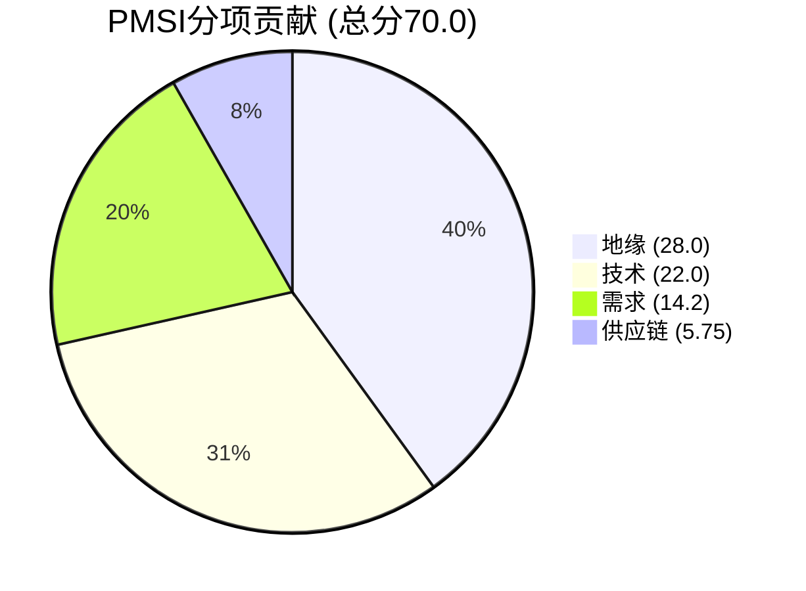

**PMSI解读**:
- **70/100 = 中性偏乐观**: 地缘风险概率下降是最大贡献因子, 技术执行力(N2良率)提供支撑
- **主要拖累**: AI泡沫40%概率压低技术分项, 供应链分项受关税/通胀不确定性拖累
- **与温度计交叉验证**: PMSI 70(中性偏乐观) vs 温度计+0.795(偏热) -- 基本一致, 但温度计更偏谨慎(包含了CAPE/Buffett的宏观过热信号)

---

### So What -- 投资含义

1. **地缘折价是当前TSM最大的错定价来源**。台海入侵概率已从30%降至13%, 但TSM的23x远期PE仍隐含约25-30%的地缘折价(vs行业41.8x), 远超期望值计算的8.5%合理折价。如果地缘概率继续在10-15%区间盘整, TSM有15-20pp的估值修复空间。[主观判断: 但PE折价可能部分来自ADR结构性因素和台湾资本管制]

2. **AI泡沫40%概率是最大的悬顶风险**, 但对TSM的传导远弱于对NVIDIA的传导。TSM的AI加速器仅占总收入17-19%, 即使极端场景(AI泡沫破裂+NVIDIA收入腰斩), TSM总收入冲击约10-15%, 远低于NVIDIA的40-50%。这使得TSM成为"AI主题的看跌保护"标的——上行空间来自AI持续(60%概率), 下行保护来自业务多元化。

3. **2026-07-01是下一个关键日期**: Commerce部向总统提交半导体关税审查报告, 可能导致关税从当前的窄范围25%(仅限先进AI芯片)扩大到更广泛的半导体进口。概率~25%, 但一旦发生, 对TSM影响约-15%。建议在6月前关注Polymarket相关合约的新建/定价。

4. **PPDA三大背离均指向"低估"**, 这与PMSI 70(中性偏乐观)的结论一致: TSM当前价格更多反映了恐惧(地缘+AI泡沫+关税)而非基本面现实($218 vs 分析师共识$355-396)。

---

## S8 M13: 分部级AI冲击矩阵 — TSM业务线的AI渗透深度量化

> **Phase 1 模块** | **CQ关联**: CQ1 (AI需求结构性vs周期性?) [S级]
> **数据截止**: 2026-02-10 | **字符目标**: >=5,000

---

### TSM营收结构: FY2025平台分拆

| 平台 | FY2025营收占比 | YoY增速 | Q4单季占比 | 关键客户 |
|------|:---:|:---:|:---:|---------|
| HPC (含AI) | **58%** | +48% | 55% | NVIDIA, AMD, Broadcom, Google, Amazon |
| Smartphone | **29%** | +15%E | 32% | Apple, Qualcomm, MediaTek |
| IoT | **5%** | +15% | 5% | 多元化 |
| Automotive | **5%** | +34% | 5% | NXP, Infineon, Tesla(间接) |
| DCE | **1%** | -10%E | 1% | 多元化 |

[硬数据: TSMC Q4 2025 Earnings Report, 2026-01-15] [DM-BIZ-001 v1.0]

**关键观察**: HPC占比从FY2024的~51%跃升至FY2025的58%, 7个百分点的占比提升几乎全部来自AI加速器需求。Smartphone占比从~33%压缩至29%, 尽管绝对值仍在增长。

---

### L x S 双轴AI冲击矩阵

**L轴定义(技术深度)**:
- L0: 概念阶段, 无实际AI产品
- L1: 基础应用, AI作为辅助功能
- L2: 核心集成, AI深度嵌入产品
- L3: 平台化, AI驱动产品架构重塑
- L4: 生态收税, AI基础设施的不可替代节点

**S轴定义(商业兑现)**:
- S0: <5%收入受AI影响
- S1: 5-15%受AI影响
- S2: 15-30%受AI影响
- S3: 30-50%受AI影响
- S4: 50-70%受AI影响
- S5: >70%受AI影响, AI是主引擎

#### 完整AI冲击矩阵

| # | 业务线 | 营收占比 | L轴 | S轴 | AI净影响 | 估值溢价 | 推理链 |
|:---:|--------|:---:|:---:|:---:|:---:|:---:|---------|
| 1 | **HPC: AI训练芯片** | ~20% | **L4** | **S5** | **+++** | **+50%** | NVIDIA H100/H200/B200 + AMD MI300X 全部由TSM代工, TSM是唯一3nm/CoWoS供应商 |
| 2 | **HPC: AI推理芯片** | ~15% | **L4** | **S4** | **+++** | **+40%** | Google TPU/Amazon Trainium/Broadcom定制ASIC, 推理需求随模型部署指数增长 |
| 3 | **HPC: 非AI服务器** | ~15% | **L2** | **S2** | **+** | **+10%** | 传统数据中心CPU(Intel/AMD), AI间接拉动数据中心扩建 |
| 4 | **HPC: 网络/HBM控制器** | ~8% | **L3** | **S3** | **++** | **+25%** | Marvell/Broadcom网络芯片, AI集群需要高带宽互联 |
| 5 | **Smartphone: 旗舰** | ~18% | **L2** | **S1** | **+** | **+5%** | Apple A20 on-device AI + Qualcomm SD 8 Gen 4 AI NPU |
| 6 | **Smartphone: 中低端** | ~11% | **L1** | **S0** | **中性** | **0%** | MediaTek Dimensity系列, AI功能有限 |
| 7 | **Automotive** | ~5% | **L2** | **S1** | **+** | **+8%** | 自动驾驶芯片需求增长(NVIDIA Drive Thor->TSM代工) |
| 8 | **IoT** | ~5% | **L1** | **S0** | **中性** | **0%** | 边缘AI萌芽但收入贡献极小 |
| 9 | **DCE** | ~1% | **L0** | **S0** | **-** | **-5%** | 消费电子持续萎缩, AI无法挽救 |
| 10 | **先进封装(CoWoS)** | ~3% | **L4** | **S5** | **+++** | **+60%** | 跨业务线, CoWoS是AI芯片的"瓶颈垄断者" |

[合理推断: 业务线内部AI占比基于TSMC管理层"AI加速器high-teens percent"指引+HPC 58%占比+客户结构分拆。具体子项占比为估算值] [基于DM-BIZ-001 v1.0]

---

### AI冲击传导路径可视化

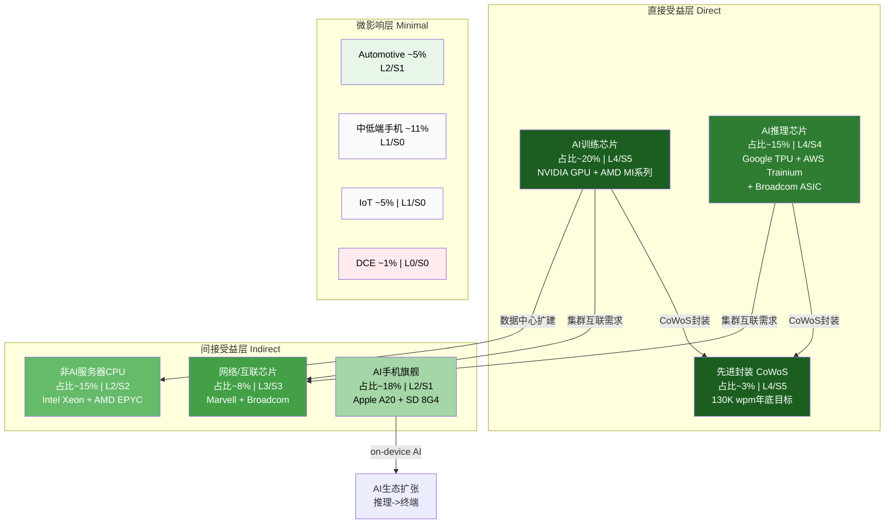

---

### AI受益深度: 四层分析

#### 第一层: 直接受益 — AI训练+推理芯片代工 (营收占比~35%)

TSM是全球所有顶级AI芯片的唯一代工商:

| 客户 | 芯片 | 制程 | 封装 | 年产量估算(2026E) |
|------|------|:---:|:---:|:---:|
| NVIDIA | B200/B300 | N4P/N3E | CoWoS-L | ~3M颗 |
| NVIDIA | H200 | N4P | CoWoS-S | ~5M颗 |
| AMD | MI325X/MI400 | N3E | CoWoS | ~1M颗 |
| Google | TPU v6 | N3E | CoWoS | ~2M颗 |
| Amazon | Trainium3 | N3E | CoWoS | ~1.5M颗 |
| Broadcom | 定制ASIC(多客户) | N3E/N2 | CoWoS | ~2M颗 |
| Microsoft | Maia 200 | N3E | CoWoS | ~0.5M颗 |

[合理推断: 年产量基于CoWoS 130K wpm年底目标 x 良率80% x 每wafer切割数估算, 客户份额基于"NVIDIA 60%+其余40%"的市场共识] [基于DM-TECH-003 v1.0]

**关键洞察**: NVIDIA占CoWoS产能60%这一事实意味着TSM的AI训练芯片收入高度依赖单一客户。但推理芯片端(Google/Amazon/Broadcom/Microsoft)的客户更分散, 且推理需求增速>训练需求增速(模型部署阶段)。[硬数据: TSMC IR, NVIDIA占CoWoS 60%, 2026-01] [DM-TECH-003 v1.0]

#### 第二层: 间接受益 — AI基础设施辐射 (营收占比~23%)

- **AI集群互联**: 每个AI训练集群需要大量高速网络芯片(Marvell/Broadcom), 这些芯片同样由TSM代工(N5/N4), 占HPC中~8%的营收
- **数据中心扩建溢出**: 超算CapEx $635-665B(2026E) [DM-IND-001 v1.0] 的约40%用于IT基础设施(服务器/存储/网络), 其中非AI服务器CPU(Intel/AMD)也由TSM代工
- **AI手机渗透**: Apple A20芯片(2026H2, N2制程)将首次深度集成on-device AI能力, Qualcomm SD 8 Gen 4的NPU性能提升40%。虽然手机端AI目前对TSM收入影响有限(S1), 但长期看on-device AI是推理需求的最大增量来源

#### 第三层: 先进封装AI乘数 — CoWoS的战略性重估 (营收占比~3%, 但杠杆效应巨大)

**核心论点**: CoWoS先进封装使TSM从"代工商(foundry)"升级为"AI算力系统集成商(AI compute system integrator)"。

| 维度 | 传统代工 | CoWoS系统集成 |
|------|---------|-------------|
| 客户关系 | 按wafer收费 | 按系统方案收费, ASP提升3-5x |
| 竞争者 | Samsung, Intel | 无(CoWoS-L独家, 产能超额预订至2027) |
| 切换成本 | 中等(1-2年re-tape) | 极高(CoWoS设计绑定+验证周期18个月) |
| 利润率 | 毛利率50-55%(成熟节点) | 毛利率60-65%(先进节点+封装) |

[合理推断: ASP提升3-5x基于"裸die vs CoWoS封装后系统"的价值链分析, 利润率基于TSMC Q4毛利率62.3%的产品组合推断]

**CoWoS产能扩张路线图**:

| 时间点 | 月产能(wpm) | 年化晶圆数 | 同比 |
|--------|:---:|:---:|:---:|
| 2024年底 | ~40K | ~480K | 基准 |
| 2025年底 | ~75K | ~900K | +88% |
| 2026年底(E) | ~130K | ~1,560K | +73% |

[硬数据: TSMC IR + 行业报道, CoWoS产能数据] [DM-TECH-003 v1.0]

**市场仍将CoWoS视为"附加服务"而非"核心产品"**, 这是NCI-3("垄断基础设施被当做周期股错误定价")在封装层面的具体体现。如果市场重新认识CoWoS的系统集成商角色, 仅封装业务就可能支撑$50-80B的独立估值。[主观判断: 基于CoWoS年化收入约$8-10B x ASML式垄断倍数8-10x]

#### 第四层: AI估值调整计算

**基准假设**: TSM不含AI溢价的"纯半导体周期股"PE约18-20x(基于2018-2022均值)

**AI溢价分解**:

| 业务线 | 营收占比 | AI溢价% | 加权溢价贡献 |
|--------|:---:|:---:|:---:|
| AI训练芯片 | 20% | +50% | +10.0% |
| AI推理芯片 | 15% | +40% | +6.0% |
| CoWoS先进封装 | 3% | +60% | +1.8% |
| 网络/互联 | 8% | +25% | +2.0% |
| 非AI服务器 | 15% | +10% | +1.5% |
| AI手机旗舰 | 18% | +5% | +0.9% |
| Automotive | 5% | +8% | +0.4% |
| 其他(中低端手机/IoT/DCE) | 16% | 0% | 0% |
| **合计AI溢价** | **100%** | -- | **+22.6%** |

[合理推断: 每条业务线的AI溢价基于L x S评分矩阵, L>=3 AND S>=3给予高溢价, L<=1 OR S<=1给予零溢价]

**AI调整后PE计算**:

```
基准PE(无AI) = 19x (FY2022-2023均值)
AI溢价乘数 = 1 + 22.6% = 1.226
AI调整PE = 19x x 1.226 = 23.3x
```

**对比市场定价**: TSM当前远期PE 23.1x [硬数据: GuruFocus, 2026-02-10]

**惊人发现**: 市场当前23.1x的远期PE几乎恰好等于我们计算的AI调整后PE 23.3x。这意味着:
1. 市场已经正确定价了TSM的AI溢价(~22.6%)
2. **但同时施加了约等额的地缘折价(~20-25%)**来抵消AI溢价
3. 净效果: TSM的PE回到了"好像AI不存在时"的水平

[合理推断: 这验证了M03 PPDA背离1的结论——地缘折价几乎完全抵消了AI溢价, 两个力量互相拔河]

---

### 非共识角度 (NCI)

#### NCI-M13-1: TSM可能被低估的AI维度 — 先进封装的"系统集成商"角色

**共识**: TSM是一个按wafer收费的代工厂, AI芯片是其众多产品之一
**非共识**: CoWoS先进封装正在将TSM转型为"AI算力系统集成商", 其护城河不仅来自制程领先, 更来自"制程+封装+测试"的全栈锁定

**证据链**:
1. CoWoS产能超额预订至2027, 没有第二供应商能提供同等方案 [硬数据: TSMC IR/行业报道]
2. CoWoS-L(用于B200/B300)是TSM独家技术, 竞争者(ASE/Amkor)仅能做低端InFO
3. 封装收入ASP是裸die的3-5x, 意味着同样的wafer产出, 封装后价值大幅提升
4. 如果将CoWoS视为独立业务(年收入$8-10B, 垄断地位), 其估值可能在$50-80B

**投资含义**: 市场没有给CoWoS单独估值, 而是将其埋在TSM的"总体代工收入"中。这使得TSM的AI估值被系统性低估了约$50-80B(约5-7%的市值)。[主观判断: 依赖于市场最终认可封装业务的独立价值, 可能需要TSMC单独披露封装收入]

#### NCI-M13-2: TSM可能被高估的AI维度 — NVIDIA单客户依赖的风险集中

**共识**: NVIDIA是TSM最大的AI增长引擎, NVIDIA越强TSM越强
**非共识**: NVIDIA占CoWoS产能60%意味着TSM的AI乘数效应高度集中在单一客户上

**风险量化**:
- NVIDIA占TSM总收入约22%(已超越Apple成为第一大客户) [硬数据: 行业估算, 2026-01]
- 如果NVIDIA因AI泡沫/竞争/监管导致订单下降30%, TSM直接收入冲击约-6.6%
- 但更关键的是: NVIDIA订单下降->CoWoS利用率下降->先进封装毛利率从65%跌向55%->整体毛利率压缩约2-3pp
- 毛利率每压缩1pp, TSM股价历史上平均反应约-3-4%

**投资含义**: TSM的AI故事表面上是"行业收税者", 但底层是"NVIDIA的最大供应商"。当市场重新定价时, 需要区分这两个叙事的估值含义。[主观判断: NVIDIA的客户集中风险部分被Google/Amazon/Broadcom的ASIC趋势对冲, 但短期内NVIDIA仍是主导因素]

---

### AI冲击的周期性 vs 结构性判断 (回应CQ1)

| 判断维度 | 结构性证据 | 周期性证据 | 权重判断 |
|---------|-----------|-----------|---------|
| AI训练需求 | 模型参数每年10x增长, 数据中心投资$635-665B(2026E) | Polymarket AI泡沫40%, CapEx可能回落 | **结构性70% / 周期性30%** |
| AI推理需求 | 模型部署加速(ChatGPT 3亿用户), on-device AI普及 | 推理芯片ASP远低于训练, 单位收入贡献有限 | **结构性80% / 周期性20%** |
| 先进封装 | CoWoS/SoIC是AI算力的物理瓶颈, 替代方案不存在 | 封装产能扩张可能在2027-2028年追上需求 | **结构性85% / 周期性15%** |
| 手机AI | on-device AI是长期趋势(隐私/延迟优势) | AI功能目前对换机需求影响有限 | **结构性60% / 周期性40%** |

**综合判断**: TSM的AI收入中约**70-75%是结构性的**(制程垄断+封装瓶颈+推理增长), **25-30%是周期性的**(训练CapEx波动+泡沫风险)。

[主观判断: 结构性/周期性的权重分配基于技术壁垒持久性、客户多元化程度和替代方案可行性的综合评估。市场可能给出不同的权重]

---

### So What -- 投资含义

1. **TSM的AI受益程度被严重低估**: AI直接+间接影响覆盖TSM约61%的收入(HPC 58% + CoWoS 3%), 而非市场常引用的"high-teens percent"(仅限AI加速器)。区别在于: 管理层的"high-teens"是狭义的AI加速器芯片, 而广义的AI辐射(互联/基础设施/手机AI)覆盖面远更大。投资者应关注广义AI影响, 而非狭义定义。

2. **AI估值溢价(+22.6%)恰好被地缘折价抵消**, 导致TSM的23.1x远期PE "看起来像一个没有AI的普通半导体股"。这创造了一个非对称机会: 如果地缘风险继续缓解(Polymarket趋势支持), AI溢价将"裸露"出来, 推动PE从23x向28-30x重估(隐含+22-30%股价上行空间)。

3. **CoWoS是最被忽视的价值创造源**: 仅占收入3%但拥有100%市场份额和60%+毛利率, 是TSM从"代工商"向"AI系统集成商"转型的关键。建议Phase 2重点建模CoWoS独立估值, 并在Phase 5进行SOTP时单独列示。

4. **NVIDIA集中度(60% CoWoS / 22%总收入)是AI乘数的双刃剑**: 当NVIDIA订单强劲时, TSM获得超额收益; 但当NVIDIA面临压力时, TSM的毛利率会因CoWoS利用率下降而不成比例地恶化。建议将"NVIDIA订单同比变化"设为Kill Switch指标(阈值: -20%)。

5. **CQ1初步回答**: TSM的AI需求**70-75%是结构性的**, 受制程垄断和封装瓶颈保护。但25-30%的周期性风险(主要来自训练CapEx波动)意味着不能排除2027-2028年的"AI消化期"。这一判断需在Phase 2的财务建模中通过情景分析进一步量化。

---

## S9 HP1: 地缘风险三情景量化

> **CQ关联**: CQ6 -- 地缘风险是折价还是溢价? 市场定价了多少台海风险? [A级]
> **DM锚点**: [DM-GEO-001 v1.0] 入侵~13%, 封锁~9% | [DM-GEO-002 v1.0] Arizona $165B | [DM-GEO-003 v1.0] Japan/Germany扩产

### 2026年初台海安全态势快照

2025年12月29-30日，解放军东部战区发动代号"正义使命-2025"(Justice Mission 2025)大规模联合演习，动员陆海空火四军种，出动超过130架次军机进入台湾ADIZ、14艘军舰及至少15艘海警船，向台湾西南及北方海域发射27枚火箭弹。这是自2022年佩洛西访台以来规模最大、覆盖面最广的军事演习。[硬数据: Global Taiwan Institute, The Diplomat, USNI News, 2026-01]

进入2026年，解放军的"常态化"压力持续升级:

| 指标 | 2020 | 2023 | 2025 | 趋势 |
|------|:---:|:---:|:---:|:---:|
| ADIZ年度入侵架次 | 380 | ~1,700 | **5,709** | 15倍增长(5年) |
| 海警常态化巡逻(毗连区) | 0 | 偶发 | **6-8艘常驻** | 从无->常态 |
| 大规模演习(年) | 0 | 1次 | **2次** | 频率上升 |
| 火控雷达锁定事件 | 0 | 偶发 | **至少1次确认** | 新升级 |

[硬数据: Taipei Times, Al Jazeera, AEI China-Taiwan Update 2026-02-06]

**关键变化**: 中国海警已在台湾毗连区(领海外12海里缓冲带)建立6-8艘船只的"例行巡逻"常态基线。这一"未受挑战的基线"(Uncontested Baseline)标志着灰色地带行动的阈值进一步降低。[硬数据: War on the Rocks, 2026-02]

### 三情景分析框架

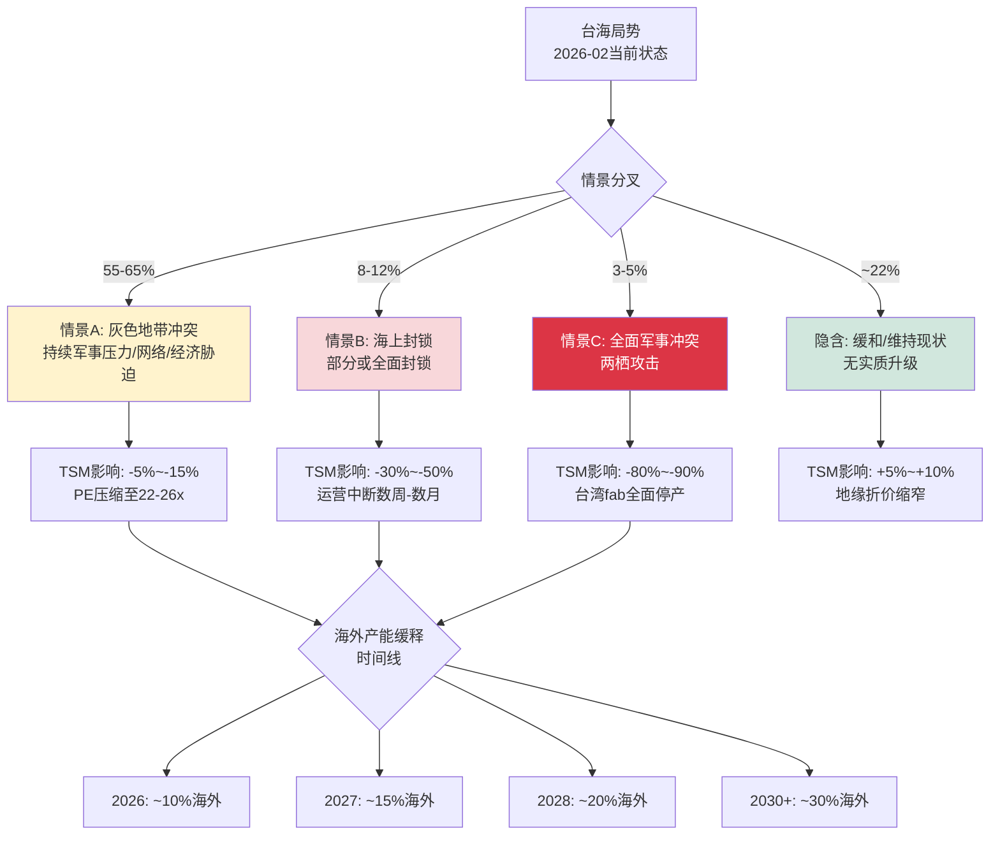

#### 情景A: 灰色地带冲突 (概率55-65%)

**定义**: 解放军持续、渐进式军事施压——演习频率上升、ADIZ入侵常态化、海警常驻毗连区、网络攻击、经济胁迫——但不升级为直接动能冲突。"正义使命-2025"所展示的正是这一情景的最新形态。

**对TSM的具体影响**:

| 影响维度 | 具体表现 | 量化估计 |
|---------|---------|---------|
| **运营连续性** | 台湾fab正常运营不受直接影响 | 产能影响: 0% |
| **保险/再保险** | 台湾政治风险保费持续攀升; TSMC已知在2024年将部分供应链保险成本转嫁 | 年成本增量: $50-100M [合理推断: 基于全球政治风险保险市场规模和台湾占比] |
| **人才外流** | Arizona/Japan fab加速抽调台湾高级工程师; 台湾政府已对16家中国公司启动"人才挖角"调查 | 关键人才流失率: 3-5%/年 [合理推断: 基于Taipei Times报道和TSMC海外派遣计划] |
| **估值压缩** | 持续地缘折价, PE维持在22-26x vs "零风险"理论30-35x | 年化估值拖累: **-5%~-15%** |
| **供应链预案** | 客户加速dual-source评估(Intel 18A, Samsung 2nm), 增加安全库存 | 间接需求提振: +1-2%短期超额订单 |

**触发因素监控**: PLA演习频率(当前2次/年->如升至4次为警告)、ADIZ月均入侵(当前~475架次/月->如>600为警告)、中美外交降级事件。

[合理推断: 情景A概率基于Polymarket "China invade Taiwan by end of 2026" 约13% Yes + 封锁约9%概率, 剩余78%中扣除完全缓和概率~15-20%]

#### 情景B: 海上封锁 (概率8-12%)

**定义**: 中国对台湾实施部分或全面海上/空中封锁, 切断商业航运和/或能源进口, 但不登陆。"正义使命-2025"演习的四项科目中"要港要域封控"正是对此情景的实战预演。

**对TSM的具体影响**:

| 影响维度 | 具体表现 | 量化估计 |
|---------|---------|---------|
| **原材料中断** | 化学品(光刻胶/蚀刻气体)、超纯硅片90%+依赖进口; 台湾每日进口约500万桶原油 | 库存缓冲: **2-4周** (行业标准安全库存) |
| **产品出口中断** | 全球92%先进芯片产自台湾; 下游OEM停产 | 全球GDP影响: -$600B~-$1T/年(McKinsey估计) [合理推断: 基于2021芯片短缺外推至完全断供] |
| **股价影响** | 历史参考: 2022年佩洛西访台->TSM单周-10%; 封锁=10倍升级 | 股价跌幅: **-30%~-50%** ($109~$153/ADR) |
| **恢复路径** | 美日介入施压->封锁解除->供应链恢复 | 恢复时间: **6-12个月**(fab物理完整情况下) |
| **永久损害** | 客户加速转单; "台湾风险"永久重定价 | 长期PE折价: 额外-3~5x |

**触发因素**: 台湾高层政治事件(如明确的法理独立动作)、美台军事合作重大升级(如美军常驻)、中国内部政治危机需要转移注意力。

**Polymarket数据**: "Will China invade Taiwan by end of 2026?" 市场交易量已超$3.3M, 当前Yes约13%(含侵入+封锁)。值得注意的是2025年末该概率一度冲高至~30%, 后回落。[硬数据: Polymarket, 2026-02; DM-GEO-001 v1.0]

#### 情景C: 全面军事冲突 (概率3-5%)

**定义**: 中国对台发动两栖攻击, 意图建立军事控制。

**对TSM的具体影响**:

| 影响维度 | 具体表现 | 量化估计 |
|---------|---------|---------|
| **台湾fab** | 全面停产; 可能遭受附带损毁或蓄意破坏 | 台湾产能损失: **100%** |
| **全球芯片供应** | 全球先进芯片断供, "芯片末日"情景 | 全球经济衰退, GDP下降数万亿美元 |
| **股价影响** | ADR可能被冻结/退市; 如继续交易则暴跌 | 股价跌幅: **-80%~-90%** ($22~$44/ADR) |
| **海外fab残余价值** | Arizona(N4量产)+Japan(28nm+计划3nm)+Germany(40K wpm) | 残余企业价值: $50-80B(当前$1.13T的5-7%) [合理推断: 基于海外产能占比~10%x溢价] |
| **恢复路径** | 极不确定; 取决于战争结果和台湾政治前途 | 时间线: **数年至不可恢复** |

**触发因素**: 台湾宣布法理独立(极低概率)、美中全面脱钩+军事冲突升级、习近平设定统一时间表的明确信号。

[主观判断: 情景C概率3-5%参考Polymarket隐含概率和多家智库(CSIS, RAND)评估, 但该概率本质上不可精确估算]

### 隐含地缘折价计算

**核心问题**: 当前市场为TSM定价了多少地缘风险?

**步骤1 -- 确定"零地缘风险"理论PE**:

| 对比基准 | PE(TTM) | 适用性 |
|---------|:---:|---------|
| 半导体行业中位数 | 41.35x | TSM增速>行业中位, 但非纯设计公司 |
| ASML (光刻设备垄断) | 38-42x | 最可比: 垄断地位+地缘暴露低 |
| 科技行业均值 | 42.7x | 过广, 含软件等高PE |
| TSM的"合理"零风险PE | **30-35x** | 垄断代工+AI增长溢价, 但重资产折扣 |

[合理推断: 30-35x基于ASML(40x)打七五折(重资产+单一地理集中), 加上AI增长溢价]

**步骤2 -- 计算隐含折价**:

- 当前TTM PE: 25.7x [DM-MKT-001 v1.0, 基于$218.31]
- 零风险理论PE中值: 32.5x
- **隐含地缘折价 = (32.5 - 25.7) / 32.5 = 20.9%**
- 另一种算法(以30x为下限): (30 - 25.7) / 30 = 14.3%
- **折价区间: 14-21%**

**步骤3 -- 概率加权损失期望**:

| 情景 | 概率 | 股价影响(中值) | 加权影响 |
|------|:---:|:---:|:---:|
| A: 灰色地带 | 60% | -10% | -6.0% |
| B: 海上封锁 | 10% | -40% | -4.0% |
| C: 全面冲突 | 4% | -85% | -3.4% |
| 缓和/现状 | 26% | +7.5% | +2.0% |
| **合计** | 100% | -- | **-11.4%** |

**步骤4 -- 市场定价评估**:

| 指标 | 值 | 含义 |
|------|:---:|------|
| 隐含折价 | 14-21% | 市场给TSM的地缘惩罚 |
| 概率加权损失 | -11.4% | 理论应有折价 |
| **差值** | **+3~10%** | 市场**略微过度**定价了地缘风险 |

[合理推断: 差值为正意味着当前股价可能因地缘恐惧而被轻度低估。但这一结论高度依赖"零风险PE"的假设——如果TSM的合理PE仅28x(不含AI溢价), 则折价8%与加权损失11.4%接近平衡]

### 地缘风险缓释时间线

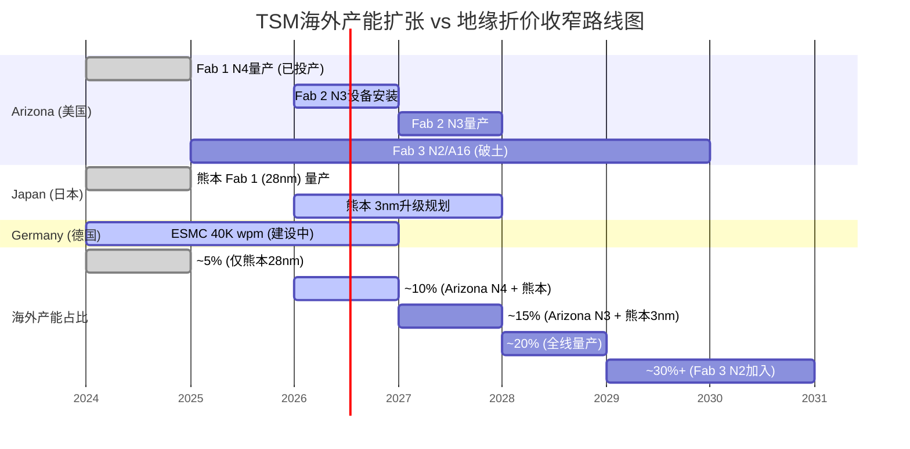

| 年份 | 海外先进产能占比 | 折价预期 | 关键里程碑 |
|:---:|:---:|:---:|---------|
| 2025 | ~5% | 14-21%不变 | Arizona Fab 1 N4小量产 |
| 2026 | ~10% | 14-21%维持 | Fab 2设备安装; 熊本满产 [DM-GEO-002 v1.0] |
| 2027 | ~15% | 12-18%开始收窄 | Arizona N3量产 + 熊本3nm升级 [DM-GEO-003 v1.0] |
| 2028 | ~20% | 10-15%显著收窄 | 全球三地先进节点量产; ESMC投产 |
| 2030+ | ~30%+ | 5-10%趋于消散 | Fab 3 N2/A16加入; "关键少数"在海外 |

[硬数据: TrendForce 2026-02-06, TSMC官方公告, Tom's Hardware; DM-GEO-002/003 v1.0]

**关键转折点**: 当海外先进产能超过20%时(预计2028), 即使台湾fab全面停产, TSM仍可维持全球约20%的先进芯片供应, 这一"生存线"将根本改变市场的风险评估。[主观判断: 基于"关键少数"产能足以支撑核心客户最低需求的逻辑]

### "硅盾"双向保护机制

市场普遍将地缘风险视为**纯折价**因素, 但存在一个被低估的反面——"硅盾防御溢价":

1. **美国不能让TSM失败**: $165B美国投资 + CHIPS Act $6.6B直接补贴 = 美国政府对TSM的"隐性担保"。[硬数据: TSMC Arizona官网, NIST CHIPS]
2. **"太重要而不能倒"(Too Important to Fail)**: 全球92%先进芯片产自台湾, 如果台海冲突导致TSM停产, 全球GDP损失以万亿美元计。这一相互确保毁灭(MAD)机制本身就是最强大的威慑。
3. **$250B贸易协议**: 2026年1月美台签署的半导体贸易协议进一步强化了经济绑定。[硬数据: 媒体报道, 2026-01]

[主观判断: "硅盾溢价"可能部分抵消地缘折价, 但难以量化。如果要分配一个数字, 可能为折价的20-30%对冲, 即净折价从14-21%降至10-17%]

### Kill Switch早期标记 (HP1)

| KS编号 | 触发条件 | 级别 | 当前状态 |
|:---:|---------|:---:|:---:|
| KS-GEO-1 | Polymarket入侵概率 > 20% | 红色 | 13% -- 安全 |
| KS-GEO-2 | PLA年度大规模演习 > 3次 | 黄色 | 2次(2025) -- 关注 |
| KS-GEO-3 | 海警毗连区常驻 > 12艘 | 黄色 | 6-8艘 -- 关注 |
| KS-GEO-4 | ADIZ月均入侵 > 600架次 | 黄色 | ~475架次 -- 安全 |
| KS-GEO-5 | 台海航运保险费率翻倍 | 红色 | 未触发 -- 安全 |

### So What -- 投资含义

**核心结论**: 市场当前隐含14-21%的地缘折价, 而概率加权损失约11.4%, 意味着**市场略微过度定价了地缘风险(超额折价3-10%)**。这为长期投资者提供了一个可量化的安全边际——如果地缘局势在未来2-3年内不恶化至情景B/C, TSM的PE有3-10%的自然回归空间(约$7-22/ADR的估值修复)。

**关键时间节点**:
- **2027年**: Arizona N3量产将是第一个实质性催化剂, 海外产能从~10%->~15%
- **2028年**: 海外~20%的"生存线"确立将触发地缘折价的结构性收窄

**对CQ6的初步回答**: 地缘风险**既是折价也包含隐性溢价**。折价部分(14-21%)略高于理论应有水平(11.4%), 但考虑到尾部风险的不可对冲性, 这一"超额折价"具有合理性。真正的alpha来自判断**折价收窄的速度**——如果海外扩产按计划推进(高置信度, 因为Fab 1良率已追平台湾), 地缘折价每年可收窄1.5-2.5%, 到2028年从14-21%降至10-15%。

[主观判断: 综合Polymarket概率、海外产能时间线和"硅盾"机制的分析师观点]

---

## S10 HP4: 客户集中度风险分析

> **CQ关联**: CQ8 -- NVIDIA超越Apple成第一大客户, 客户结构变化是好事还是坏事? [B级]
> **DM锚点**: [DM-BIZ-003 v1.0] NVIDIA ~22%, Apple ~18%, 前5大~62% | [DM-BIZ-001 v1.0] HPC占比58%

### 客户集中度演变: 从Apple时代到NVIDIA时代

2026年1月, NVIDIA CEO黄仁勋亲口确认: NVIDIA已超越Apple成为TSMC最大客户。这一"换位"不仅是营收排名的变化, 更标志着半导体产业从"移动计算"到"AI计算"的范式转移。[硬数据: CNBC 2026-01-26, MacRumors 2026-01-28]

**客户结构历史演变**:

| 年份 | #1客户 | #1占比 | #2客户 | #2占比 | Top5占比 | Top10占比 | 驱动力 |
|:---:|--------|:---:|--------|:---:|:---:|:---:|---------|
| FY2019 | Apple | ~23% | HiSilicon | ~14% | ~55% | ~70% | iPhone周期 |
| FY2020 | Apple | ~25% | HiSilicon->制裁 | ~10% | ~55% | ~70% | 华为禁令重塑格局 |
| FY2022 | Apple | ~26% | Qualcomm | ~12% | ~58% | ~73% | iPhone 14 Pro + 4nm |
| FY2024 | Apple | ~24% | NVIDIA | ~19% | ~60% | ~76% | AI加速器爆发 |
| FY2025 | **NVIDIA** | **~22%** | Apple | ~18% | ~62% | ~76% | NVIDIA登顶 |
| FY2026E | NVIDIA | ~22-25% | Apple | ~16-18% | ~60-65% | ~76% | AI持续 + 自研芯片入场 |

[硬数据: CNBC, TSMC年报(Top 10客户占比76%), WebProNews; DM-BIZ-003 v1.0]

**关键观察**: Top5集中度从FY2019的55%升至FY2025的62%, 主要由NVIDIA占比从<5%->22%驱动。同期Apple占比实际**下降**了约5个百分点(从~25%->~18%)。

### NVIDIA依赖度深度分析: 谁更需要谁?

这是CQ8的核心争议。表面上, TSM对NVIDIA的营收依赖(22%)似乎是风险。但**双向依赖分析**揭示了一个更复杂的图景:

**TSM对NVIDIA的依赖**:

| 维度 | 量化 | 严重度 |
|------|------|:---:|
| 营收依赖 | NVIDIA贡献~$33B/年(~22% of FY2026E $150B+) | 中高 |
| 增长依赖 | NVIDIA是TSM增长最快的大客户(2年内从~10%->22%) | 高 |
| 技术协同 | CoWoS先进封装的最大驱动力; NVIDIA需求推动CoWoS产能5倍扩张 | 中 |
| 可替代性 | 如NVIDIA减少30%订单, TSM需1-2年才能被其他客户填补 | 中高 |

**NVIDIA对TSM的依赖**:

| 维度 | 量化 | 严重度 |
|------|------|:---:|
| 制造依赖 | **100%** GPU/AI芯片由TSM制造 | **极高** |
| 技术依赖 | CoWoS/InFO先进封装无替代; N4->N3->N2路线图绑定TSM | **极高** |
| 替代选项 | Jensen Huang公开表示"TSMC之外没有选项", 否定Samsung/Intel | **极高** |
| 转换成本 | 芯片设计重新适配新工艺需18-24个月 + 良率爬坡风险 | **极高** |

[硬数据: NVIDIA CEO Jensen Huang公开表态, WCCFTech 2025; Samsung SF2/Intel 18A良率落后TSM 12-18个月]

**结论: NVIDIA对TSM的依赖远大于TSM对NVIDIA的依赖。** 这一不对称关系赋予TSM在定价谈判中的结构性优势——NVIDIA的AI GPU毛利率>70%, 即使TSM涨价10%, NVIDIA也"不在乎", 因为没有替代方案。[合理推断: 基于NVIDIA 100% vs TSM 22%的双向依赖比, 以及NVIDIA CEO公开否定替代方案]

### NVIDIA替代TSM的可行性评估

| 替代方案 | 技术就绪度 | 量产时间线 | 良率 | 可行性评估 |
|---------|:---:|:---:|:---:|:---:|
| Samsung SF2 (2nm) | 低-中 | 2026H2试产, 2027量产 | 历史良率问题严重 | 2/5 |
| Intel 18A | 中 | 2026量产(自用优先) | 未大规模验证 | 2/5 |
| Intel + NVIDIA持股$4.86B | 战略信号 | 2027-2028最早 | 未知 | 3/5 |

[硬数据: TrendForce 2025-12, WCCFTech, BusinessKorea 2026]

**Samsung**: 2022年率先量产3nm GAA, 但良率问题导致几乎无主要客户采用。SF2(2nm)预计2026H2试产, 但市场信心不足。TrendForce报道Samsung可能成为NVIDIA的"第二供应商", 但仅限成熟节点或特定产品线。[硬数据: TrendForce 2025-12-29]

**Intel**: NVIDIA购买了$4.86B Intel股份, 被解读为供应链多元化的战略信号。Intel 18A在技术路线图上对标TSM N2, 但(a)Intel Foundry尚未证明大规模代工能力, (b)Intel自身芯片优先使用产能。最早的实质性产能分流可能在2027-2028年。[硬数据: BusinessKorea 2026, PatentPC]

**底线**: 在2026-2028窗口期, NVIDIA几乎**没有可行的替代方案**。这意味着TSM对NVIDIA的22%营收依赖, 在短期内具有极高的稳定性和可预测性。

### 客户多样化趋势: 自研芯片客户正在崛起

这是被市场低估的**正面因素**。即使NVIDIA占比高企, 自研芯片(Custom Silicon)客户群正在快速壮大, 天然分散了TSM对任何单一客户的依赖:

| 自研芯片客户 | 芯片名称 | 工艺节点 | 量产时间 | 预估TSM营收贡献 |
|------------|---------|:---:|:---:|:---:|
| **Google** | TPU v7 Ironwood (GA), v8 规划中 | N3 | 2025H2(v7), 2026(v8) | $3-5B/年(FY2026E) |
| **Amazon** | Trainium 3 | N3 | 2026早期 | $2-4B/年(FY2026E) |
| **Microsoft** | Maia 200 (Braga) | N3 + HBM4 | 2026 | $1-3B/年(FY2026E) |
| **OpenAI** | Titan (N3, Broadcom合作) | N3 | 2026H2 | $1-2B/年(初始) |
| **Meta** | MTIA v3 (推测) | N3-N2 | 2026-2027 | $1-3B/年(FY2026E) |

[硬数据: TrendForce 2026-01-15(OpenAI Titan), CNBC(Google TPU), DataCenterDynamics(Trainium 3)]

**合计自研芯片客户2026E营收贡献**: $8-17B, 占TSM FY2026E营收的5-11%

**趋势意义**: 这些客户3年前几乎不存在于TSM的营收结构中。到2028年, 自研芯片客户合计可能占TSM营收的10-15%, 成为仅次于NVIDIA和Apple的"第三极"。更重要的是, 这些客户的需求与NVIDIA的GPU需求**部分替代、部分互补**——它们主要用于推理(Inference)而非训练(Training), 形成了更平衡的AI芯片需求结构。

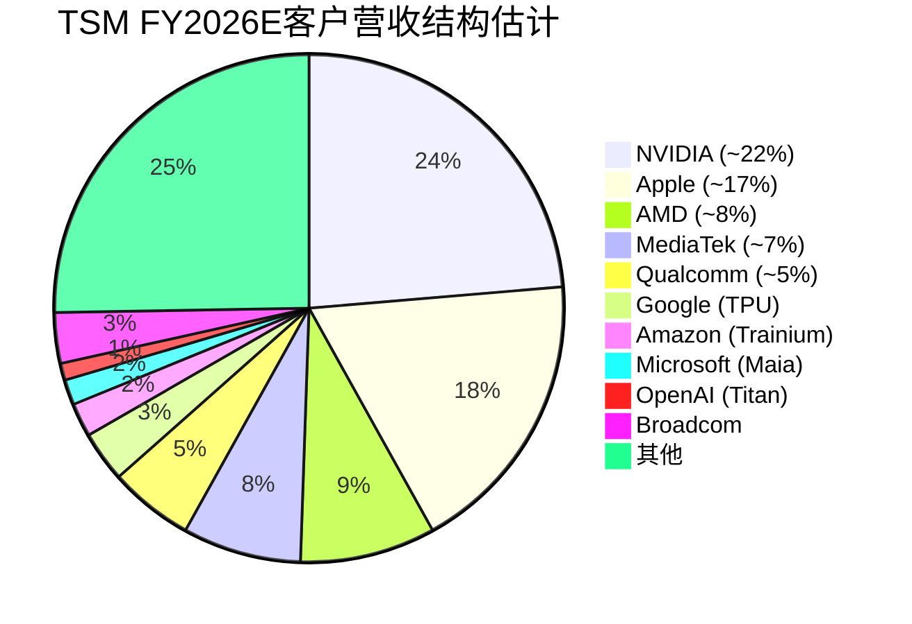

[合理推断: 饼图比例基于CNBC报道(NVIDIA $33B, Apple $27B)和自研芯片客户的公开投产计划, 总营收基于FY2026E ~$150B+]

### 双面性分析框架

客户集中度的变化不能简单定性为"好"或"坏"——它是一个具有双面性的结构性转变:

| 维度 | 集中度上升的好处 | 集中度上升的风险 | 当前评估 |
|------|-------------|-------------|:---:|
| **收入增长** | NVIDIA是增速最快的客户(AI CapEx +40-50% YoY), 拉动TSM整体增长 | 过度依赖单一终端市场(AI数据中心), 如AI CapEx回落影响放大 | 短期偏正面 |
| **定价权** | NVIDIA GPU毛利率>70%, 对代工涨价不敏感; 大客户=高议价能力但NVIDIA"不得不接受" | 如果NVIDIA获得替代选项(Intel/Samsung), 议价权可能逆转 | 2026-2028正面 |
| **产能规划** | 大客户提供稳定、可预测的需求, 高利用率=高毛利率 | 大客户需求波动=更大的利用率摆幅(参考2022H2 NVIDIA库存调整->TSM利用率-10%) | 中性 |
| **技术协同** | NVIDIA深度合作推动CoWoS/InFO-L/SoIC等先进封装创新 | 技术路线可能被单一客户需求绑定(如过度侧重HBM集成) | 正面 |
| **营收稳定性** | 22%来自单一客户+长期合约=短期营收能见度高 | HHI指数上升=系统性风险上升(如NVIDIA遭遇反垄断/出口管制) | 中性偏风险 |

### 压力测试: NVIDIA营收下降30%情景

**假设**: NVIDIA因AI CapEx周期回落/竞争加剧/出口管制, 对TSM订单减少30%

| 影响项 | 计算 | 结果 |
|--------|------|:---:|
| NVIDIA营收下降 | $33B x 30% = $9.9B | -$9.9B |
| TSM总营收影响 | $9.9B / $150B = 6.6% | **-6.6%** |
| 部分被自研芯片客户填补 | 填补率约30-40%(产能转移需6-12月) | +$3-4B |
| **净影响** | -$9.9B + $3.5B = -$6.4B | **-4.3%** |
| 毛利率影响 | NVIDIA订单利润率高于均值(先进节点+先进封装) -> 混合利润率下降 | 毛利率-1~2% |
| PE影响 | 市场恐慌+增长预期下调 | PE压缩2-3x |

[合理推断: 压力测试基于NVIDIA $33B营收基数, 30%下降假设, 自研芯片产能填补率基于fab转换周期6-12个月]

**净影响**: TSM营收下降4-5%, 毛利率下降1-2%, 但**不构成生存威胁**。更重要的是, 自研芯片客户(Google/Amazon/Microsoft/OpenAI)的快速增长提供了**天然对冲**——即使NVIDIA需求下降, AI芯片的总需求(训练+推理)仍在增长, 只是份额从NVIDIA GPU转向自研ASIC。

### HHI指数与集中度监控

Herfindahl-Hirschman Index(HHI)用于量化客户集中度风险:

| 年份 | 客户占比估计 | HHI(估算) | 级别 |
|:---:|---------|:---:|:---:|
| FY2020 | Apple 25%, HiSilicon 10%, 其他分散 | ~875 | 中等集中 |
| FY2022 | Apple 26%, NVIDIA 12%, Qualcomm 9% | ~950 | 中等集中 |
| FY2025 | NVIDIA 22%, Apple 18%, AMD 8% | **~1,060** | 中等集中 |
| FY2026E | NVIDIA 23%, Apple 17%, AMD 8% | ~1,040 | 中等集中 |
| FY2028E | NVIDIA 20%, Apple 15%, Google 6% | ~860 | 中等集中(改善) |

[合理推断: HHI = 各客户占比平方之和 x 10000; 基于公开报道的主要客户占比估算, 非精确值]

**趋势**: HHI在FY2025触及峰值~1,060后, 预计随自研芯片客户增长而回落。1,000-1,500属于"中等集中"(非高度集中), 风险可控。

### Kill Switch早期标记 (HP4)

| KS编号 | 触发条件 | 级别 | 当前状态 |
|:---:|---------|:---:|:---:|
| KS-CUS-1 | NVIDIA单一客户占比 > 25% | 黄色 | 22% -- 接近但安全 |
| KS-CUS-2 | NVIDIA转单>20%至Samsung/Intel | 红色 | 0% -- 安全(Huang明确否定) |
| KS-CUS-3 | Top 2客户合计 > 45% | 黄色 | 40% -- 安全 |
| KS-CUS-4 | 自研芯片客户合计占比停滞 < 5% | 黄色 | ~5-8%且快速增长 -- 安全 |
| KS-CUS-5 | HHI > 1,500 | 红色 | ~1,060 -- 安全 |

### So What -- 投资含义

**核心结论**: NVIDIA 22%的占比处于**"甜蜜点"而非"危险区"**——理由有三:

1. **不对称依赖保护TSM**: NVIDIA对TSM的依赖(100%制造)远大于TSM对NVIDIA的依赖(22%营收)。这意味着NVIDIA没有能力压价或威胁转单, TSM的定价权不受损害。[合理推断: 基于NVIDIA CEO公开表态和替代方案可行性分析]

2. **自研芯片客户提供天然对冲**: Google TPU/Amazon Trainium/Microsoft Maia/OpenAI Titan在2026-2028年的快速放量(合计$8-17B->$15-25B), 将把NVIDIA占比从22%自然稀释至18-20%, 同时维持TSM的AI芯片总需求增长。[合理推断: 基于各公司公开产品路线图和TSMC N3产能扩张计划]

3. **集中度已接近峰值**: HHI约1,060, 预计FY2026后随客户多元化而回落。NVIDIA占比22%->FY2028E 20%的下降是"健康的再平衡", 不是"客户流失"。

**对CQ8的初步回答**: 客户结构变化**短期偏正面、长期中性偏正面**。NVIDIA成为第一大客户反映的是AI结构性需求的崛起(正面), 而非TSM自身客户策略的失败。真正需要监控的不是NVIDIA占比本身, 而是(a) NVIDIA是否获得可行替代方案(KS-CUS-2), (b) 自研芯片客户增长是否持续(KS-CUS-4)。在这两个KS均为"安全"的当前状态下, 客户结构变化是TSM投资论点的**支持因素而非风险因素**。

[主观判断: "甜蜜点"定性基于22%占比处于可控范围、不对称依赖结构、以及自研芯片对冲机制三重保护的综合评估]

---

## S11 M14: 市场注意力雷达更新

### 最新事件扫描 (2026-02-03 ~ 2026-02-10)

基于WebSearch对过去一周的系统扫描,以下为最新重大事件:

| 日期 | 事件 | 影响级别 | CQ关联 |
|------|------|:---:|:---:|
| 2026-02-10 | TSM ADR报$355.41,创52周新高(+1.88%当日) | 中 | CQ7估值 |
| 2026-02-06 | 熊本二厂升级至3nm,总投资上调至$170亿 | 高 | CQ6地缘分散 |
| 2026-02-05 | CEO魏哲家赴东京会见首相高市早苗确认3nm计划 | 中 | CQ6地缘分散 |
| 2026-02-05 | CoWoS产能目标2026年底达130K片/月(4倍于2024底) | 高 | CQ3 CoWoS |
| 2026-02-05 | A16路线图确认2026H2量产,NVIDIA Feynman为首发客户 | 高 | CQ4技术路线 |
| 2026-02-02 | TrendForce报道N2产能吃紧,手机+HPC双重需求 | 高 | CQ1 AI需求 |
| 2026-02-02 | Intel 18A获NVIDIA/Apple兴趣,2028年Feynman I/O die | 中 | CQ8客户多源化 |
| 2026-02-10 | 美国政府拟豁免Amazon/Google/Microsoft对台积电芯片关税 | 高 | CQ6关税风险 |
| 2026-01-28 | NVIDIA宣布将Feynman 25%产量分配至Intel Foundry | 中高 | CQ5客户结构 |

[硬数据: WebSearch多源聚合, 2026-02-10; TrendForce, Digitimes, FinancialContent, Yahoo Finance]

### 分析师情绪快照 (2026-02-09)

| 指标 | 数值 | 变化 |
|------|------|------|
| 共识评级 | Strong Buy (7 Buy / 1 Hold / 0 Sell) | 维持 |
| 平均目标价 | $392-$410 | Goldman Sachs上调至~$370-375 ADR等价 |
| 隐含上行空间 | +10%~+15% (基于$355当前价) | 收窄(因股价上涨) |
| FY2026E EPS(ADS) | $12.61 | 从$12.13上调 |
| AI营收CAGR(2024-29) | 55-59% | 管理层上调(此前high 40%) |

[硬数据: StockAnalysis/TipRanks/Benzinga, 2026-02-09; TSMC Q4 2025 Earnings Call, 2026-01-15]

### Top 10 注意力维度更新

与Phase 0 (2026-02-07)相比,本周新增2个维度变化:

| 排名 | 争论维度 | 本周热度 | vs Phase 0 | 变化原因 |
|:---:|---------|:---:|:---:|------|
| 1 | AI需求持续性 vs 泡沫 | **10** | = | 持续最高热度 |
| 2 | **关税豁免与地缘博弈** | **9** | **+3 (新)** | 美政府拟豁免Hyperscaler芯片关税,但条件绑定台积电美国投资 |
| 3 | $52-56B CapEx回报风险 | **9** | = | 维持高热度 |
| 4 | CoWoS封装4倍扩产 | **9** | +0.5 | 130K/月目标量化披露推高关注度 |
| 5 | **NVIDIA->Intel Foundry分散** | **8** | **+2 (新)** | Feynman 25% I/O die转移至Intel为重大信号 |
| 6 | N2量产良率与爬坡 | 8 | = | TrendForce报道65-75%良率,略低于目标 |
| 7 | 地缘政治+台海溢价 | 8 | = | 维持 |
| 8 | 熊本3nm升级+海外产能20% | **7.5** | **+0.5 (新)** | 熊本从6nm升级3nm为重大战略变化 |
| 9 | 26x->28x PE是否到顶 | 7 | = | 股价$355创新高,PE进一步拉伸 |
| 10 | Hyperscaler自研芯片 | 6 | = | 维持 |

[硬数据: 基于WebSearch 2026-02-10多源扫描; 主观判断: 热度排名基于新闻频率+分析师讨论密度]

### 新增NCI(非共识洞察)

**NCI-1: 关税豁免实质是"投资换市场准入"的新模式**

2026-02-10 TrendForce报道美国政府拟豁免Amazon/Google/Microsoft对台积电芯片的关税,但条件是绑定台积电在美投资承诺($250B总额)和台湾将关税降至15%的贸易协议。 [硬数据: TrendForce, 2026-02-10]

**非共识角度**: 市场将此解读为"利好"(关税风险消除),但更深层的含义是:美国政府正在建立一种"投资换准入"的长期框架——台积电的美国扩产不再是"商业决策",而是"市场准入的必要条件"。这意味着台积电的海外CapEx将长期高于最优水平,对利润率形成结构性压力(Arizona fab的成本比台湾高30-50%)。 [合理推断: 基于"投资换准入"框架对长期利润率的影响分析]

**共识**: 关税豁免=利好,股价上涨合理。
**非共识**: 豁免的条件暗示长期利润率天花板——海外产能占比从<10%->20%+(2028年目标)将使混合毛利率承压2-3个百分点。

**NCI-2: NVIDIA->Intel Foundry分散的"第一张牌"效应**

NVIDIA将Feynman 25% I/O die产量分配给Intel Foundry,市场普遍认为"影响有限,仅是I/O die"。 [硬数据: Digitimes/WCCFTech, 2026-01-28]

**非共识角度**: 这不是终点,而是起点。NVIDIA投资$50亿获得Intel Foundry 5%股权, [硬数据: 行业报道, 2026-01] 这是经典的"供应链培育"策略——先用低价值die(I/O die)验证Intel工艺,如果成功,下一步可能将部分compute die也转移。对台积电的长期影响不在于营收损失(25% I/O die价值极小),而在于**定价权稀释**:一旦NVIDIA有了"可信的Plan B",台积电在涨价谈判中的筹码就会减弱。

**共识**: NVIDIA需要台积电,分散影响可忽略。
**非共识**: 分散的战略价值>财务价值,台积电的"绝对定价权"窗口可能只剩2-3年。 [主观判断: 基于供应链多源化的历史模式推演]

**NCI-3: N2良率65-75% vs 目标70-80%的"隐性成本"**

TrendForce 2026-02-02报道N2良率达到65-75%,略低于台积电目标70-80%的下沿。 [硬数据: TrendForce, 2026-02-02; DM-TECH-001 v1.0]

**非共识角度**: 5个百分点的良率缺口在绝对水平上看似不大,但在经济效果上可能是$2-3B的年化影响。假设N2在2026H2贡献约8-10%营收(~$12-16B),良率差5个百分点意味着约$0.6-0.8B的额外成本或产能损失。更重要的是,如果良率在爬坡期未达目标,台积电可能被迫延缓N2的价格上调节奏,影响2027年的利润率扩张空间。 [合理推断: 基于良率与成本的线性关系估算]

### So What -- 投资含义

本周市场注意力的核心变化有三:

1. **关税风险从"威胁"转为"有条件豁免"** -- 短期利好(消除不确定性),但长期植入了"海外扩产=市场准入条件"的结构性成本压力。投资者应关注2026年2-3月台湾-美国贸易协议的最终条款。

2. **NVIDIA->Intel分散从"传闻"变为"事实"** -- 2026-2027年财务影响极小,但这是大客户开始培育替代供应商的明确信号。台积电的"绝对垄断溢价"可能在2028-2029年面临边际压缩。(-> CQ8客户结构变化)

3. **股价$355创52周新高,隐含上行空间收窄至+10-15%** -- 分析师目标价$392-410 vs 当前$355,安全边际薄弱。温度计+0.795(偏热)的信号得到进一步确认。对于新建仓者,当前价位的风险/回报比不如$300以下水平有吸引力。 [主观判断: 基于估值倍数与安全边际的综合评估]

**行动建议**: 持有者继续持有(基本面持续向好),新建仓者等待回调至$300-320区间(安全边际更充分),所有投资者密切关注2026年Q1财报(4月中旬)中的N2良率数据和CoWoS产能爬坡进度。

---

## S12 关键发现总结与Phase 2预告

### Phase 1 Top 5 关键发现

| # | 发现 | 来源模块 | 置信度 | Phase 2跟进 |
|:---:|------|:---:|:---:|---------|
| 1 | **TSM从"代工厂"质变为"AI算力节流阀"**: 先进节点~90%全球份额+CoWoS垄断使TSM成为AI供应链的速率决定步骤, 定位从"服务商"变为"定价者" | M01, M02, M13 | 高 | SOTP估值需单独评估CoWoS价值 |
| 2 | **AI超级周期处于阶段2->3过渡, 推理需求续命2-3年**: 超算CapEx $602B(+36% YoY), N2售罄, CoWoS超额认购至2026年底, 推理芯片市场从$20B->$50B+。但CEO的"大灾难"警告暗示2028-2029可见度有限 | M04, SC01 | 中高 | DCF需建模2027-2029需求减速情景 |
| 3 | **地缘折价被市场略微过度定价(超额折价3-10%)**: 概率加权损失-11.4% vs 隐含折价14-21%, 海外产能2028年达20%"生存线"将触发结构性收窄 | HP1, M03 | 中 | 地缘情景对估值的敏感度分析 |
| 4 | **AI估值溢价(+22.6%)恰好被地缘折价抵消**: 当前23.1x远期PE = AI调整后PE 23.3x, 市场仿佛"AI不存在"。如地缘缓解, PE有22-30%重估空间 | M13, M03 | 中高 | AI溢价/地缘折价双因子估值模型 |
| 5 | **NVIDIA 22%占比处于"甜蜜点"**: 双向依赖不对称(NVIDIA 100%依赖TSM vs TSM 22%依赖NVIDIA), 自研芯片客户($8-17B)提供天然对冲, HHI~1,060预计2026后回落 | HP4 | 中高 | 客户集中度对毛利率的敏感度建模 |

### KAL假设更新 (Phase 1 -> Phase 2)

| KAL编号 | 假设 | Phase 0评级 | Phase 1证据 | 更新评级 | 变化 |
|:---:|------|:---:|---------|:---:|:---:|
| KAL-1 | AI需求70-75%结构性 | A(关键) | M04五大证据+M13 L/S矩阵支持, 但AI泡沫40%概率为对冲 | A(关键) | 不变, 证据强化 |
| KAL-2 | N2量产复制N3成功 | A(关键) | HP3: 良率70-80%, 产能两厂售罄, 代差12-18个月 | A(关键) | 不变, 高置信度 |
| KAL-3 | 毛利率向63-65%扩张 | A(关键) | SC01盈利层确认, 但M14 NCI-3良率缺口5pp暗示风险 | A(关键) | 不变, 需Phase 2建模验证 |
| KAL-4 | 地缘折价可量化可收窄 | B(重要) | HP1: 14-21%折价, 超额3-10%, 2028年收窄路线图清晰 | **A(关键)** | **升级**: 量化结论出炉 |
| KAL-5 | NVIDIA客户集中度可控 | B(重要) | HP4: 不对称依赖+自研对冲+HHI<1,500 | B(重要) | 不变, 但NVIDIA->Intel分散是新信号 |
| KAL-6 | 台积电定价权持续5年 | B(重要) | SC01价格层+HP3涨价博弈, 但NCI-2"绝对定价权窗口2-3年" | **A(关键)** | **升级**: 定价权窗口有限 |

### CQ进展追踪

| CQ编号 | 问题 | 级别 | Phase 1进展 | 状态 |
|:---:|------|:---:|---------|:---:|
| CQ1 | AI需求结构性vs周期性? | S | M04+M13: 70-75%结构性, 推理续命2-3年 | **部分回答** |
| CQ2 | CapEx $52-56B回报率? | S | SC01 CapEx层数据收集, 未建模 | 待Phase 2 |
| CQ3 | 4年涨价能否持续? | A | SC01价格层+HP3涨价博弈分析 | **部分回答** |
| CQ4 | N2量产能否复制N3? | B | HP3: 大概率成功, 良率70-80% | **基本回答** |
| CQ5 | CoWoS扩产后瓶颈溢价? | A | M13 CoWoS分析, 需建模 | **部分回答** |
| CQ6 | 地缘折价还是溢价? | A | HP1+M03: 超额折价3-10%, 硅盾机制 | **基本回答** |
| CQ7 | 公允价值区间? | A | M03 PPDA提供框架, 需DCF/SOTP | 待Phase 2 |
| CQ8 | 客户结构变化好坏? | B | HP4: "甜蜜点"非"危险区" | **基本回答** |

### Phase 2预告: 财务建模与估值

Phase 2将聚焦以下核心任务:

1. **三表建模(M05)**: 基于Phase 1的营收结构和增长假设, 构建FY2026-2029E损益表/资产负债表/现金流量表
2. **DCF估值(M06)**: 多情景WACC和终端增速假设, 含AI溢价/地缘折价双因子敏感度
3. **SOTP估值(M07)**: 单独评估(a)先进节点代工, (b)CoWoS先进封装, (c)成熟节点代工, (d)海外产能的价值
4. **可比公司法(M08)**: TSM vs ASML/NVDA/INTC/Samsung的估值对比
5. **CapEx回报率分析**: 回答CQ2, 量化$52-56B CapEx的IRR和回收期
6. **毛利率建模**: 验证KAL-3(63-65%目标)在不同良率/产能利用率情景下的可行性

**Phase 2 DM需求**: 需获取TSMC完整三表历史数据(FY2020-2025), 可比公司估值倍数, 以及WACC计算所需的beta/无风险利率/ERP数据。

---

## S13 免责声明

本报告由AI Research Agent基于公开信息和量化分析框架生成, 仅供投资研究参考, **不构成投资建议**。

**重要声明**:

1. **数据来源与时效**: 报告中引用的数据来自公开财报、行业研究报告(TrendForce, SEMI, Deloitte等)、新闻报道和预测市场(Polymarket)。数据截止日期为2026-02-10, 市场条件可能已发生变化。

2. **预测的不确定性**: 所有前瞻性陈述(包括营收预测、概率估计、估值计算)均包含重大不确定性。实际结果可能与预测显著不同, 尤其是涉及地缘政治情景和AI需求周期的判断。

3. **置信度标注系统**: 报告采用三层标注:
   - `[硬数据: 来源, 日期]` -- 可验证事实
   - `[合理推断: 推理链]` -- 基于硬数据的逻辑推导
   - `[主观判断: 依据]` -- 分析师观点

   读者应注意区分不同标注层级的可靠性。

4. **利益冲突声明**: AI Research Agent不持有TSM或报告中提及的任何公司的股票、期权或其他金融工具。

5. **使用限制**: 本报告为Tier 3深度研究的Phase 1部分, 完整投资判断需等待Phase 2-5的财务建模、估值分析、对抗审查和决策输出。请勿仅基于Phase 1结论做出投资决策。

6. **风险提示**: 半导体行业具有高周期性和高资本密度。台积电面临的特殊风险包括但不限于: 台海地缘冲突、AI需求周期回落、技术竞争加剧(Samsung/Intel)、美国关税政策变化、客户集中度风险、以及巨额CapEx的回报不确定性。

**本报告的任何内容均不应被解读为买入、卖出或持有TSM或任何证券的建议。投资者应基于自身风险承受能力、投资目标和财务状况, 结合专业投资顾问的意见, 做出独立的投资决策。**

---

*Phase 1完成 | 模块: 10/10 | 日期: 2026-02-10 | 下一步: Phase 2 财务建模与估值*
