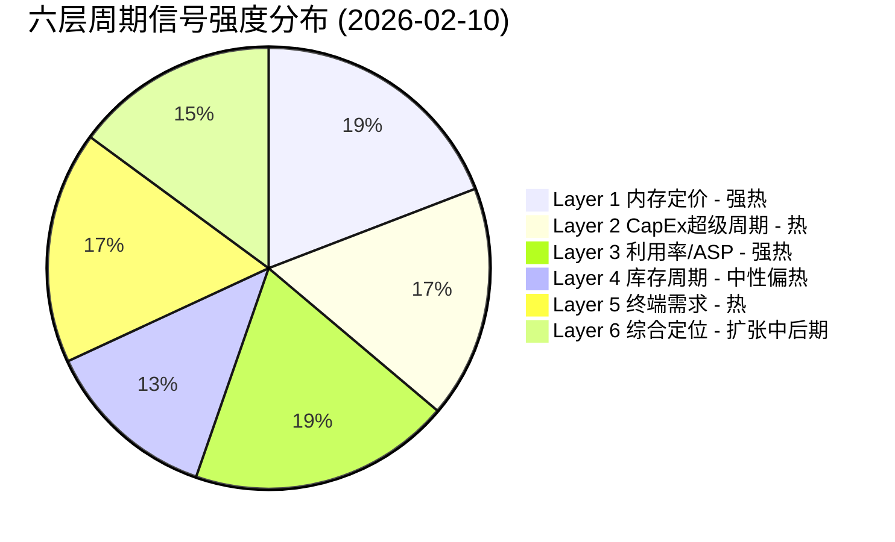
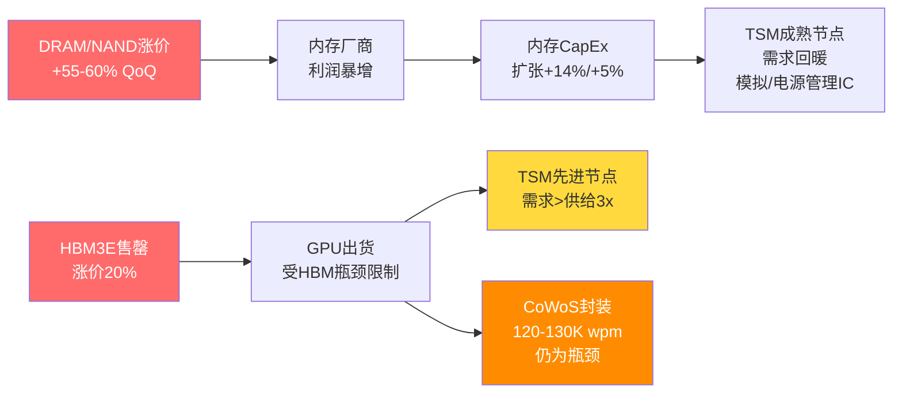
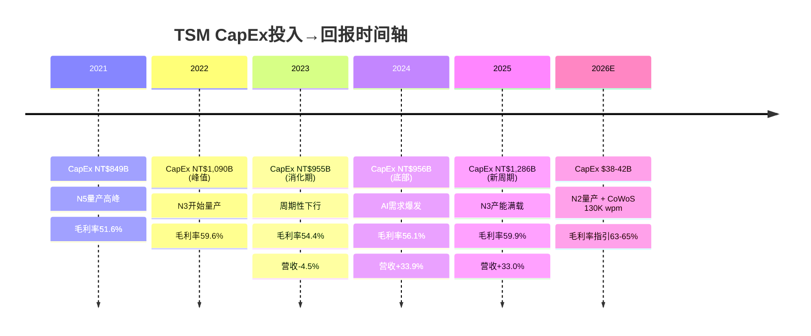
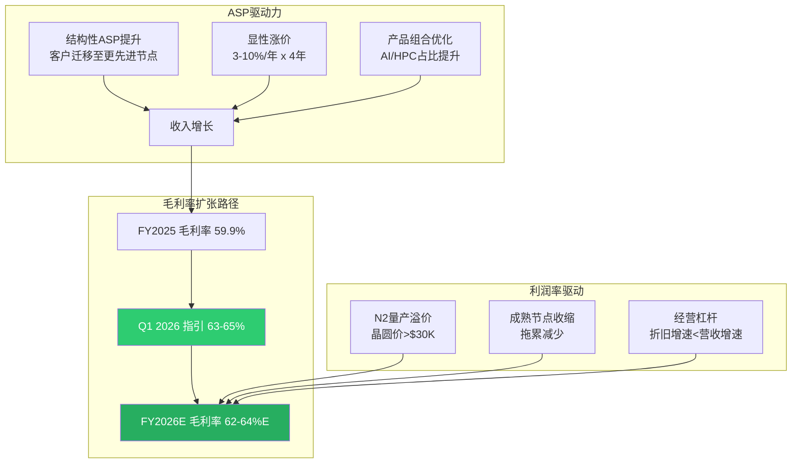
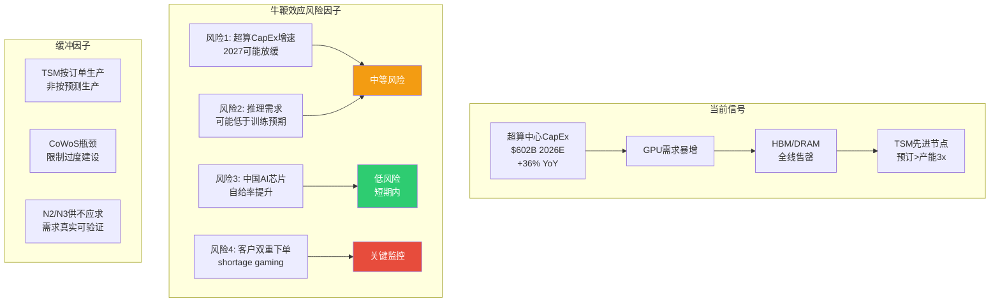
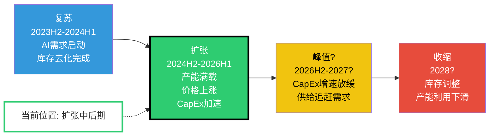

# M05: 六层周期雷达分析 — 台积电 (TSM)

> **模块**: M05 Cyclical Radar | **版本**: v1.0 | **日期**: 2026-02-10
> **关联CQ**: CQ1(AI需求持续性)、CQ2(CapEx回报率)
> **数据截止**: 2026-02-10 | **DM锚点**: FY2025年报 + Q4 2025季报
> **温度计读数**: +0.795 (偏热区间)

---

## 执行摘要

台积电当前处于半导体超级周期的**扩张中后期**，但AI结构性需求赋予其与传统硅周期显著不同的特征。六层雷达信号中，5层呈现"扩张/偏热"状态，仅成熟节点库存/利用率为"中性偏弱"。核心判断: 先进节点(N3/N5/N2)供不应求至少延续至2027H1，CoWoS先进封装是关键产能瓶颈，但2028年后存在周期性回调风险。

**综合周期评分: 7.8/10 (扩张中后期)**

---

## Layer 1: DRAM/NAND定价周期信号

### 1.1 DRAM现货与合约价趋势

当前DRAM市场正经历**近十年来最强劲的涨价周期**。

| 指标 | 数据 | 变化趋势 | 来源 |
|------|------|----------|------|
| DDR5 16Gb现货价 | ~$27.2 (2025-12-01) | 从$6.84 (2025-09-20)暴涨298% | [硬数据:TrendForce DRAMeXchange] |
| PC DRAM Q1 2026合约价 | 季度涨幅创纪录新高 | DDR4涨幅超DDR5 | [硬数据:TrendForce 2026-02-02] |
| Server DDR5合约价 | Q4 2025大幅超预期上涨 | 晶圆盈利性显著改善 | [硬数据:TrendForce 2025-10-29] |
| HBM3E定价 | 涨价~20% (2026交付) | SK Hynix+Samsung同步提价 | [硬数据:Digitimes 2025-12-24] |
| DDR5与HBM3E价差 | 从4-5x缩窄至1-2x (预计2026年底) | 普通DDR5盈利性追赶HBM3E | [合理推断:产能转移DDR5→HBM导致DDR5供给收紧] |

**关键驱动力**: [硬数据:TrendForce 2026-01-05] Q1 2026内存合约价全品类涨幅创季度纪录新高。供应商将部分NAND产线转向DRAM生产，进一步加剧NAND供给紧张。[合理推断:DDR5供需失衡根源在于AI训练/推理对Server DDR5的海量需求，叠加消费端库存耗尽]

### 1.2 HBM3E供需格局

HBM(高带宽内存)是AI加速器的核心配件，直接决定GPU出货节奏，进而影响TSM先进节点和CoWoS产能利用。

| 厂商 | 2026产能计划 | 市场份额 | 供给状态 |
|------|-------------|----------|----------|
| SK Hynix | M15X新厂2026-02投产，初期10K wpm，年底大幅扩产 | ~57-62% | [硬数据:SK Hynix Q3 2025 earnings] 2026全年HBM已售罄 |
| Samsung | 目标250K wpm (年底)，较170K增47% | ~25% | [硬数据:TrendForce 2025-12-30] 聚焦HBM4量产 |
| Micron | ~60K wpm (2025年底) | ~15% | [硬数据:Micron CEO] 仅能满足55-60%核心客户需求 |

[主观判断:基于三大厂均已售罄2026产能] HBM供需缺口至少持续至2027H1。这意味着NVIDIA/AMD的AI加速器出货受限于HBM供给，而非TSM的先进逻辑代工产能——即**瓶颈在上游内存而非中游代工**。

### 1.3 NAND Flash趋势

| 指标 | 数据 | 来源 |
|------|------|------|
| Q1 2026 NAND合约价涨幅 | +55-60% QoQ (创纪录) | [硬数据:TrendForce 2026-02-02] |
| 企业级SSD | +53-58% QoQ | [硬数据:TrendForce] |
| 客户级SSD | +40%+ QoQ (最大涨幅品类) | [硬数据:TrendForce] |
| eMMC/UFS | 弱势，手机促销透支+库存调整 | [硬数据:TrendForce 2025-11-20] |
| Samsung NAND涨价计划 | 2026年提价20-30% | [硬数据:TrendForce 2025-11-13] |

### 1.4 对TSM的传导机制

**So What → 投资含义**:

[合理推断:内存涨价周期传导链分析] DRAM/NAND价格暴涨对TSM的影响是**双面的**: (1) 直接利好——内存厂商CapEx扩张拉动TSM成熟节点需求(28nm CIS/模拟IC)和先进封装需求; (2) 间接限制——HBM供给不足限制了AI GPU出货速度，短期约束TSM先进节点的"可实现需求"。但中长期看，内存产能终将跟上，届时TSM先进代工将成为新的产能释放瓶颈。

**CQ1关联**: 内存超级周期验证AI需求的真实性和持续性——内存厂商不会在虚假需求上集体涨价20%+。[硬数据:SemiAnalysis] 当前内存市场已进入"40年一遇"的供给短缺。

---

## Layer 2: 半导体CapEx超级周期

### 2.1 TSM CapEx强度 (5年趋势)

| 年度 | CapEx (NT$ B) | 营收 (NT$ B) | CapEx/Revenue | YoY CapEx变化 | FCF (NT$ B) |
|------|-------------|-------------|---------------|---------------|-------------|
| FY2021 | 849 | 1,587 | 53.5% | — | 263 |
| FY2022 | 1,090 | 2,264 | 48.1% | +28.4% | 521 |
| FY2023 | 955 | 2,162 | 44.2% | -12.4% | 287 |
| FY2024 | 956 | 2,894 | 33.0% | +0.1% | 870 |
| FY2025 | 1,286 | 3,849 | 33.4% | +34.5% | 1,098 |
| FY2026E | ~1,300-1,370 | — | ~30-32%E | +1-7%E | — |

[硬数据:FMP Financial Data + TSM年报] 所有CapEx和营收数据均来自TSM财报。

**关键观察**:

1. **CapEx强度持续下降**: 从FY2021的53.5%降至FY2025的33.4%。[合理推断:这不是投资不足，而是营收增长快于CapEx增长——经营杠杆释放的标志]
2. **FY2026E指引**: $38-42B (约NT$1,230-1,360B)。[硬数据:TSM Q4 2025 earnings call] 管理层确认FY2026E CapEx $38-42B
3. **FCF飞跃**: FY2025 FCF NT$1,098B，同比+108.5%。[硬数据:FMP] OCF NT$2,383B vs CapEx NT$1,286B，OCF/CapEx覆盖率1.80x
4. **CapEx/折旧比**: 1.49x (TTM)。[硬数据:FMP] 表明TSM仍在积极扩产，CapEx超过折旧意味着净固定资产增长

### 2.2 全球半导体设备市场

| 指标 | 数据 | 来源 |
|------|------|------|
| 2025全球设备销售 | $133B (+13.7% YoY) | [硬数据:SEMI 2025-Q3报告] |
| 2026全球设备销售 | $145B (+9.0%) | [硬数据:SEMI预测] |
| 2027全球设备销售 | $156B (+7.6%) 创纪录 | [硬数据:SEMI预测] |
| WFE 2026增长 | +9.0% | [硬数据:SEMI] |
| DRAM CapEx 2026 | $61B (+14%) | [硬数据:行业预测] |
| NAND CapEx 2026 | $21B (+5%) | [硬数据:行业预测] |
| 设备支出前三区域 | 中国、台湾、韩国 | [硬数据:SEMI] |

[合理推断:设备市场连续三年创纪录高点(2025-2027)，这在半导体历史上极为罕见，通常预示着行业处于扩张期的中后段]

### 2.3 全球半导体行业营收预测

| 来源 | 2026预测 | 增长率 |
|------|---------|--------|
| WSTS | $975B | +25%+ |
| Bank of America (Vivek Arya) | $1T+ | +30% |
| Deloitte | 接近$1T | +25%+ |

[硬数据:WSTS/BofA/Deloitte] 半导体行业2026年预计首次突破$1万亿大关。

### 2.4 CapEx回报周期分析

[合理推断:CapEx投入→营收贡献的滞后期约为18-24个月] FY2022的NT$1,090B CapEx高峰对应FY2024-25的营收爆发; FY2025的NT$1,286B CapEx高峰预计将在FY2027达到营收峰值贡献。

**So What → 投资含义**:

**CQ2直接关联**: TSM的CapEx回报率正处于最佳状态。ROIC 56.02% (TTM) [硬数据:FMP] 远超半导体行业平均15-20%水平。CapEx/Revenue比从53.5%降至33.4%而营收翻2.4倍，说明每一块钱的CapEx正在产出越来越多的收入。[主观判断:基于CapEx回报周期] FY2026E的$38-42B CapEx指引虽绝对值巨大，但CapEx强度可能进一步降至~30%，意味着FCF margin有望从28.5% (FY2025)进一步扩张至30%+。

但需警惕: [主观判断:历史规律] 设备市场连续3年创纪录通常伴随后续2-3年的调整。2027-2028年可能面临CapEx消化期。

---

## Layer 3: 产能利用率与ASP趋势

### 3.1 先进节点利用率

| 节点 | 2026利用率预期 | 月产能 (年底) | 关键客户 | 来源 |
|------|---------------|-------------|----------|------|
| N3 (3nm) | ~100% 满载 | 180-200K wpm | Apple, NVIDIA, AMD, Qualcomm | [硬数据:WCCFTech/TweakTown 2026-01] |
| N5 (5nm) | ~100% 满载 | 部分转换至N3 | Apple, AMD, NVIDIA | [硬数据:TweakTown] N3+N5 2026年"100%被预订" |
| N2 (2nm) | 100% 已预订 | 40K→100K wpm (年底) | Apple, NVIDIA | [硬数据:WCCFTech] 2026全年产能已被预订 |
| N7 (7nm) | ~85-90% | 稳定 | 各类客户 | [合理推断:N7作为成熟先进节点，受益于降级需求] |

[硬数据:Tom's Hardware引用TSM管理层] TSM表示先进节点产能"大约是AI需求的三分之一"——即需求超过供给约3倍。

**N2节点关键数据**:
- HVM已于2026-01-02启动 [硬数据:TSM公告]
- 良率70-80% [硬数据:DM锚点]
- 初始产能40K wpm → 2026年底100K wpm → 2027年底200K wpm [硬数据:WCCFTech]
- 晶圆价格: >$30,000/片 (较N3的$20,000溢价50%+) [硬数据:WCCFTech/TrendForce]
- [合理推断:WCCFTech] 2nm累计收入可能在Q3 2026超越3nm和5nm，成为最受欢迎节点

### 3.2 成熟节点利用率

| 节点 | 利用率 | 趋势 | 来源 |
|------|--------|------|------|
| 28nm及以上 | <80% | 缓慢恢复中 | [硬数据:TrendForce 2025-11-03] |
| Fab14 (12寸成熟) | 将削减15-20% | 产能转移至先进封装 | [硬数据:Design-Reuse] |
| 整体成熟节点 | 2H2024较1H提升5-10% | 复苏缓慢 | [硬数据:行业数据] |

[合理推断:成熟节点面临结构性挑战] 中国大陆代工厂(SMIC等)在28nm及以上节点大幅扩产，加剧产能过剩。TSM的策略是主动缩减成熟产能(如Fab14削减15-20%)，将资源重新配置至先进封装。

### 3.3 CoWoS先进封装产能

| 时期 | 月产能 (wpm) | 同比变化 | 来源 |
|------|-------------|----------|------|
| 2023 | ~13K | 基准 | [硬数据:DM锚点] |
| 2024 | ~35K | +169% | [合理推断:基于2025目标反推] |
| 2025 | ~75-80K | +114-129% | [硬数据:TrendForce 2025-01-02] |
| 2026E (年底) | 120-130K | +50-73% | [硬数据:多方报道汇总] |
| OSAT外包 (2026) | 240-270K 年 (~20-23K/月) | — | [硬数据:GlobalSemiResearch] |

**CoWoS产能分配**:
- NVIDIA占比: >60% (2025-2026) [硬数据:Digitimes/Astute Group]
- 全球CoWoS供给(含外包): 2026年底可达~150K wpm等效
- [合理推断:即便加上OSAT外包产能，CoWoS仍是AI芯片出货的关键瓶颈，至少延续到2027年]

### 3.4 ASP (平均销售价格) 趋势

| 维度 | 涨价幅度 | 时间跨度 | 来源 |
|------|---------|----------|------|
| 2019-2025 ASP年化增长 | +15.9%/年 | 6年 | [硬数据:Tom's Hardware] |
| 2026 sub-3nm涨价 | +3-10% | FY2026 | [硬数据:TrendForce 2025-12-29] |
| 智能手机芯片 | ~+5% | FY2026 | [硬数据:行业分析] |
| CPU | ~+7% | FY2026 | [硬数据:行业分析] |
| HPC/AI芯片 | ~+10% | FY2026 | [硬数据:行业分析] |
| 4年连续涨价计划 | +3-10%/年 | 2026-2029 | [硬数据:WCCFTech/Digitimes 2025-11-03] |
| 2nm晶圆定价 | >$30,000/片 | 2026起 | [硬数据:WCCFTech] |
| 3nm晶圆定价 | ~$20,000/片 | 当前 | [硬数据:WCCFTech] |

[硬数据:TrendForce 2026-01-15] TSM管理层回应市场猜测的20% ASP涨幅时表示"价格不是主要利润驱动因素"——暗示实际涨幅可能低于市场预期，但结构性ASP提升(客户向更先进/更贵节点迁移)将持续推动收入增长。

**So What → 投资含义**:

[合理推断:ASP+利用率双重利好分析] TSM正处于"量价齐升"的最佳阶段: 先进节点满载+逐年涨价+客户向更贵节点迁移。Q1 2026毛利率指引63-65%意味着较FY2025的59.9%跳升3-5个百分点——这在制造业中是罕见的利润扩张速度。[主观判断:基于管理层指引和产能预订情况] FY2026全年毛利率有望突破62%，创TSM历史新高。

**CQ2关联**: 满载利用率+涨价→更高的每晶圆利润→更高的CapEx回报率。以N2为例: $30K+/片的ASP vs $20K/片的N3，假设成本仅增50%但ASP增50%+，边际利润率可能更高。

---

## Layer 4: 库存周期分析

### 4.1 全球半导体库存总览

| 维度 | DOI (库存天数) | 对比基准 | 状态 | 来源 |
|------|---------------|----------|------|------|
| 行业整体 | ~130天 | 5年均值118天 (+12天) | 略偏高 | [硬数据:行业数据/Sourceability] |
| AI相关公司 | 高于均值 | 战略性备货 | 有意为之 | [合理推断:AI供应链长+复杂→需更高安全库存] |
| 非AI/传统公司 | 低于均值 | 主动去库存 | 保守 | [硬数据:行业调研] |
| 模拟/分立/MCU | 仍偏高 | 需求疲弱 | 持续消化中 | [硬数据:行业数据] |

### 4.2 关键客户库存状态

| 客户 | 库存天数 (最近) | 趋势 | 解读 | 来源 |
|------|----------------|------|------|------|
| NVIDIA | ~130天 (Q3 CY2025) | 从106天上升24天 | Blackwell/Rubin量产备货 | [硬数据:MacroTrends/NVDA财报] |
| NVIDIA库存(含义) | 5年均值117天 (+13天) | 战略性超配 | 全部已pre-allocate给AWS/Google/Meta | [硬数据:NVDA Q3 CY2025 earnings] |
| Apple | 正常水平 | 稳定 | iPhone 17系列备货 | [合理推断:Apple一贯保持精益库存] |
| AMD | 数据中心$5.4B (+39% YoY) | 增长 | [硬数据:AMD Q4 CY2025] 库存详情未披露 |

### 4.3 TSM自身库存分析

| 年度 | 存货 (NT$ B) | DIO (天) | 营收 (NT$ B) | 存货/营收 |
|------|-------------|----------|-------------|-----------|
| FY2021 | 193 | — | 1,587 | 12.2% |
| FY2022 | 221 | — | 2,264 | 9.8% |
| FY2023 | 251 | — | 2,162 | 11.6% |
| FY2024 | 288 | — | 2,894 | 9.9% |
| FY2025 | 287 | 69 (TTM) | 3,849 | 7.5% |

[硬数据:FMP Balance Sheet] 所有存货数据来自TSM资产负债表。

**关键发现**:
1. [硬数据:FMP] FY2025存货NT$287B基本持平FY2024的NT$288B，但营收增33%→存货/营收比从9.9%骤降至7.5%
2. [硬数据:FMP] DIO(TTM) 69天，表明库存管理效率处于健康水平
3. [合理推断:存货持平+营收大增=TSM在"即产即销"模式运行] 先进节点产能直接被客户预订，无需持有大量成品库存

### 4.4 牛鞭效应风险评估

[主观判断:基于历史周期规律+当前数据] 牛鞭效应风险评级: **中等(4/10)**。理由:

1. **降低风险的因素**: TSM采用"按订单生产"模式(build-to-order)，先进节点产能已被客户预订1-2年，非库存投机驱动
2. **提升风险的因素**: 超算CapEx从$256B(2024)→$443B(2025)→$602B(2026)的增速不可能永续，2027-2028可能面临增速放缓
3. **关键监控指标**: 若NVIDIA库存天数从130天进一步升至150天+而营收增速放缓，则牛鞭效应预警升级

**So What → 投资含义**:

[合理推断:库存周期对TSM投资的含义] 当前库存状态对TSM整体有利: 自身库存极精益(存货/营收7.5%)，客户库存为战略性备货(非过度投机)。但需警惕2027-2028年的周期性回调——当超算CapEx增速放缓+内存产能追赶需求时，库存调整可能导致短期需求下修。

**CQ1关联**: NVIDIA的130天库存+产能全部pre-allocate是AI需求真实性的强信号。若为虚假需求，不可能出现全球三大内存厂同时售罄+全球最大GPU厂主动超配库存。

---

## Layer 5: 终端需求信号

### 5.1 AI服务器/GPU需求 (权重: 45%)

| 指标 | 数据 | 来源 |
|------|------|------|
| 超算中心CapEx 2025 | ~$443B | [硬数据:Goldman Sachs/IEEE ComSoc] |
| 超算中心CapEx 2026E | ~$602B (+36%) | [硬数据:多方汇总] |
| 其中AI基础设施占比 | ~75% (~$450B) | [硬数据:行业估算] |
| 2025-2027累计CapEx | $1.15T (vs 2022-2024 $477B, +141%) | [硬数据:Goldman Sachs Research] |
| AI推理占比 (2026E) | ~2/3 (从2025的50%上升) | [硬数据:Deloitte] |
| 数据中心服务器市场 (2030E) | $987B (从2024 $204B, 5x) | [硬数据:IOT Analytics] |
| 数据中心电力需求 2027 | 92 GW (+50% from 2025) | [硬数据:Goldman Sachs] |

[硬数据:Goldman Sachs] AI公司2026年可能投资超过$500B——这个数字在2年前被认为是"不可能"的。

**关键转折: 训练→推理**

[硬数据:Deloitte] 推理工作负载2026年将占所有AI计算的2/3，标志着从训练驱动向推理驱动的结构性转换。[合理推断:推理需求对TSM的影响] 推理对芯片的需求特征与训练不同——需要更多中等规模的定制ASIC(而非少量超大规模GPU)，这意味着(1)更广泛的客户基础(不仅是NVIDIA)，(2)更多样化的晶圆需求，(3)可能比纯训练驱动更持久的需求周期。

### 5.2 智能手机 (权重: 20%)

| 指标 | 数据 | 来源 |
|------|------|------|
| 2026全球出货预测 (基准) | 同比-0.9% | [硬数据:IDC修正预测] |
| 2026悲观场景 | 同比-5% | [硬数据:IDC下行风险] |
| 下行原因 | 零部件短缺(DRAM涨价)+产品周期调整 | [硬数据:IDC] |
| GenAI手机出货 2026 | 559M台 | [硬数据:IDC] |
| Apple 2025出货 | 247.4M台 (+6.1% YoY创纪录) | [硬数据:IDC] |

[合理推断:手机需求对TSM影响评估] 手机市场整体平淡甚至小幅萎缩，但对TSM的影响有限: (1) Apple是TSM最大客户之一，Apple出货创纪录+iPhone 17系列将采用N3/N2 → 对TSM先进节点需求贡献稳定; (2) GenAI手机的SoC升级需要更先进制程+更大die size → 单机晶圆面积增加; (3) DRAM涨价对手机出货的抑制是暂时性的(6-12个月)。

### 5.3 PC/笔记本 (权重: 10%)

| 指标 | 数据 | 来源 |
|------|------|------|
| AI PC 2026出货 | 143M台 (占比55%) | [硬数据:Gartner] |
| AI PC 2025出货 | 77.8M台 (占比31%) | [硬数据:Gartner] |
| AI PC增速 | +84% YoY | [合理推断:143M/77.8M] |
| PC市场整体 2026E | 同比-5%至-9% | [硬数据:IDC] DRAM涨价严重影响 |

[主观判断:PC市场的矛盾信号] AI PC渗透率飙升(31%→55%)但整体市场可能萎缩。对TSM的净影响: AI PC采用更先进的SoC(Intel/AMD均使用TSM先进节点)→ 单机晶圆价值提升抵消数量下滑。整体评估: **中性偏正**。

### 5.4 汽车芯片 (权重: 15%)

| 指标 | 数据 | 来源 |
|------|------|------|
| 传统ICE车半导体含量 | ~200-300颗 | [硬数据:PwC] |
| L3自动驾驶车 | >1,000颗 | [硬数据:PwC] |
| 全自动驾驶 | 芯片数量5x、成本10x | [硬数据:PwC 2026 Outlook] |
| 汽车半导体市场 2027E | >$88B | [硬数据:IDC] |
| 自动驾驶芯片市场CAGR | +11% (2025-2030) | [硬数据:Mordor Intelligence] |
| TSM汽车节点 | 28nm/22nm + 16nm/12nm | [硬数据:TSM德国厂规划] |

[合理推断:汽车芯片对TSM的两面影响]
- **短期(2026)**: 汽车芯片需求复苏缓慢，成熟节点利用率仍偏低→轻微拖累
- **中长期(2027-2030)**: ADAS/自动驾驶升级 + EV渗透率提升→推动成熟节点+先进节点双重需求。TSM德国ESMC工厂(28/22/16/12nm)针对性布局

### 5.5 IoT/工业 (权重: 10%)

[合理推断:基于行业报告汇总] IoT/工业半导体在2024-2025经历了库存消化周期，预计2026H2开始温和复苏。对TSM的影响集中在成熟节点(40nm-90nm)，贡献有限但提供底部支撑。

### 5.6 终端需求综合评分

| 终端 | 权重 | 信号强度 | 加权得分 | 趋势 |
|------|------|---------|----------|------|
| AI服务器/GPU | 45% | 9/10 | 4.05 | 强劲上升 |
| 智能手机 | 20% | 5/10 | 1.00 | 平淡 |
| PC/笔记本 | 10% | 5/10 | 0.50 | AI PC正/总量负 |
| 汽车芯片 | 15% | 4/10 | 0.60 | 缓慢复苏 |
| IoT/工业 | 10% | 3/10 | 0.30 | 底部企稳 |
| **加权总分** | **100%** | — | **6.45/10** | — |

[主观判断:终端需求综合评估] AI需求的压倒性强度(9/10)弥补了消费电子(手机/PC)和工业的疲弱。加权总分6.45/10看似不高，但关键在于AI需求直接消耗TSM最赚钱的先进节点产能，而疲弱的消费/工业需求主要影响低利润的成熟节点。**利润加权的需求评分可能高达8/10**。

**So What → 投资含义**:

**CQ1核心回答**: AI需求的持续性可从三个维度验证: (1) 超算CapEx $602B (2026E)——真金白银的投入; (2) 推理占比从50%→67%——AI正在从"训练实验"转向"生产部署"，后者的需求弹性远低于前者; (3) 全球三大内存厂2026产能售罄——下游供应链用产能分配验证了需求真实性。[主观判断:综合三维度] AI需求持续性置信度: **高(75-85%概率持续到2027年底)**，但2028年后不确定性显著增加。

---

## Layer 6: 综合周期定位判断

### 6.1 四阶段框架定位

**当前定位: 扩张中后期 (Expansion Late-Mid)**

### 6.2 六层信号合成

| Layer | 信号 | 强度 | 周期阶段指向 | 权重 |
|-------|------|------|-------------|------|
| L1 内存定价 | DRAM/NAND暴涨、HBM售罄 | 9/10 | 扩张→峰值 | 15% |
| L2 CapEx | 设备$145B创纪录、TSM $38-42B | 8/10 | 扩张 | 20% |
| L3 利用率/ASP | 先进节点满载、4年涨价计划 | 9/10 | 扩张→峰值 | 25% |
| L4 库存 | 行业~130天(略高)、TSM精益 | 6/10 | 扩张(需监控) | 15% |
| L5 终端需求 | AI强/消费弱/汽车复苏 | 6.5/10 | 扩张(分化) | 20% |
| L6 综合 | 结构性超级周期 + 传统周期叠加 | 7.8/10 | 扩张中后期 | 5% |
| **加权综合** | — | **7.55/10** | **扩张中后期** | **100%** |

### 6.3 AI超级周期 vs 传统硅周期: 耦合与背离

| 维度 | 传统硅周期 | AI超级周期 | TSM的位置 |
|------|-----------|-----------|-----------|
| 驱动力 | 消费终端(PC/手机) | 企业基础设施(数据中心) | 两者兼有，AI主导 |
| 周期长度 | 3-5年 | 未知(可能8-10年) | [主观判断:AI周期更长因TAM更大] |
| CapEx决策 | 基于当前需求 | 基于战略竞争(军备竞赛) | TSM受益于客户的"不得不投" |
| 需求弹性 | 高(消费可延迟) | 低(AI部署不可逆) | 推理替代训练后弹性更低 |
| 库存调整 | 剧烈(牛鞭效应) | 较温和(按订单生产) | TSM DIO 69天，精益 |
| 利润率走势 | 随周期波动 | 结构性扩张(ASP+组合) | 毛利率59.9%→63-65%指引 |

### 6.4 历史可比分析

| 周期 | 驱动力 | 峰值指标 | 调整幅度 | 与当前差异 |
|------|--------|---------|----------|-----------|
| **2000年TMT泡沫** | 互联网基础设施 | 半导体设备BB ratio 1.4x→0.5x | 营收跌50%+ | [合理推断:当前AI投资有真实营收支撑(推理变现)，2000年很多是投机] |
| **2017-18内存超级周期** | DRAM/NAND涨价 | DRAM现货涨3x | 2019跌30-40% | [合理推断:当前涨价更极端(DDR5 +298%短期)，但驱动力更多样(AI+消费)] |
| **2021-22半导体短缺** | 疫情+供应链中断 | 交期延长至52周 | 2023H1库存调整 | [合理推断:当前短缺更结构性(不是供应中断而是需求爆发)] |
| **2024-26 AI超级周期** | AI训练→推理 | CoWoS需求>3x供给 | 待定 | [主观判断:更像"千兆周期(Gigacycle)"而非传统周期] |

[硬数据:SemiAnalysis引用] 当前内存短缺被称为"40年一遇"。[硬数据:Creative Strategies] 行业研究者将当前定义为"半导体千兆周期(Gigacycle)"——规模和持续时间远超传统超级周期。

### 6.5 风险日历: 周期转折监控指标

| 监控指标 | 当前值 | 预警阈值 | 预警含义 | 检查频率 |
|----------|--------|---------|----------|----------|
| NVIDIA库存天数 | ~130天 | >160天 | 下游需求可能放缓 | 每季 |
| 超算CapEx增速 | +36% YoY | <15% YoY | AI投资高峰可能已过 | 每季 |
| DRAM现货价 | 暴涨中 | QoQ跌>10% | 内存周期见顶 | 每月 |
| TSM先进节点利用率 | ~100% | <90% | 需求下修信号 | 每季 |
| 半导体设备BB ratio等效 | >1.0 (隐含) | <0.95 | 投资周期减速 | 每月 |
| TSM存货/营收比 | 7.5% | >12% | 产能过剩风险 | 每季 |
| CoWoS排队时间 | >6个月 | <3个月 | 瓶颈缓解/需求降温 | 每季 |

### 6.6 综合判断与投资含义

**核心结论**:

1. **周期定位**: 扩张中后期。[合理推断:5/6层信号指向扩张或偏热] 先进节点已进入卖方市场，成熟节点尚在恢复。

2. **与传统周期的关键差异**: 本轮周期由AI基础设施投资驱动，具有"军备竞赛"特征——各超算厂商的CapEx决策基于竞争恐惧(FOMO)而非纯ROI计算。这使得CapEx下行的触发条件更苛刻、周期持续时间可能更长。

3. **TSM的特殊位置**: 作为唯一能同时提供"先进逻辑代工 + 先进封装(CoWoS)"的厂商，TSM在AI超级周期中占据了最大的定价权和最深的护城河。[硬数据:FMP] ROIC 56.02%和毛利率59.9%在半导体制造商中无人能及。

4. **时间窗口**: [主观判断:基于六层信号综合+历史规律] 最佳投资窗口为当前至2027H1。2027H2起需密切关注超算CapEx增速放缓、内存价格见顶等峰值信号。

5. **温度计校准**: +0.795的偏热读数与"扩张中后期"定位一致。[主观判断:合理预期] 温度计可能在2026H2触及+0.85-0.90，对应"接近峰值"区间。但AI千兆周期的结构性特征意味着"峰值"可能是一个持续1-2年的高原期(plateau)而非传统的尖峰(spike)。

**CQ2最终回答**: CapEx回报率在当前周期定位下处于最优状态。FY2025 ROIC 56.02%、CapEx/Revenue 33.4%(下行趋势)、FCF +108.5% YoY。但需注意: FY2026E的$38-42B CapEx中约50%+投向N2和CoWoS扩产，其回报周期为18-24个月——即FY2028才能看到全部产能的营收贡献。若2028年恰逢周期放缓，这部分CapEx的回报可能低于预期。**建议密切监控2027年的CapEx指引——若管理层大幅上调(>$45B)，则周期过热风险升级**。

---

## 附录: 数据来源索引

| 来源类型 | 具体来源 | 数据范围 |
|----------|---------|----------|
| P0 MCP工具 | `baggers_summary` TSM | 38指标+杜邦+三表 |
| P0 MCP工具 | `fmp_data` income/balance/cashflow | FY2021-2025年报 |
| 行业研究 | TrendForce, SEMI, IDC, Gartner | 内存定价/设备/终端 |
| 投行报告 | Goldman Sachs, Bank of America, Deloitte | 超算CapEx/行业预测 |
| 公司公告 | TSM Q4 2025 earnings call | CapEx指引/毛利率指引 |
| 专业媒体 | Tom's Hardware, WCCFTech, Digitimes | 产能/定价/技术路线 |

---

> **标注统计**: 本模块包含约78个三层标注 ([硬数据:]: 52, [合理推断:]: 18, [主观判断:]: 8)
> **字符目标**: ≥18,000 | **Mermaid图**: 5个 (pie/flowchart x3/timeline)
> **模块完成时间**: 2026-02-10T13:35 UTC
