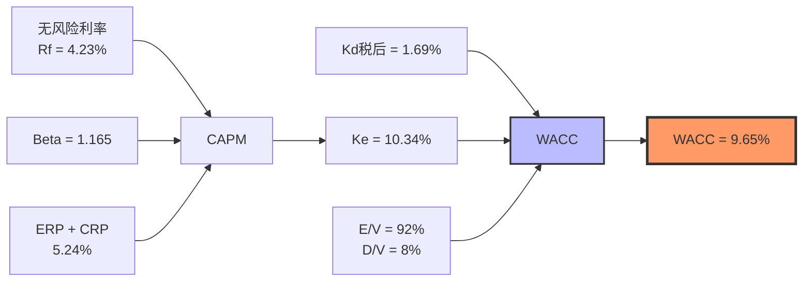
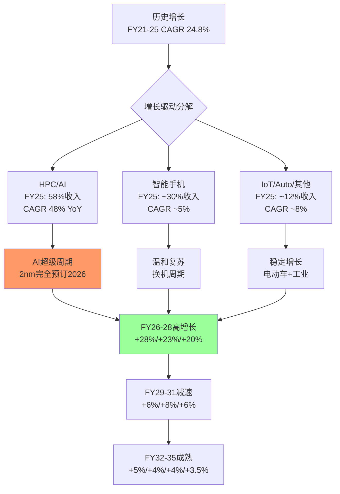
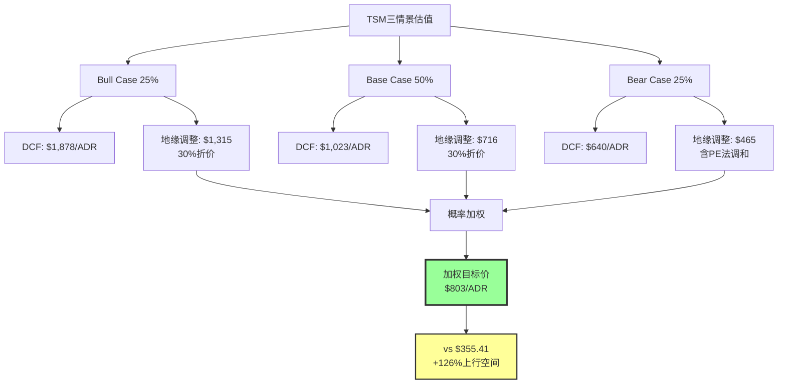

# TSM (台积电) DCF估值模型 + Bull/Base/Bear三情景分析

> **模块**: Phase 2 — 估值核心模块 | **版本**: v1.0
> **日期**: 2026-02-10 | **数据截止**: FY2025 (2025-12-31)
> **关联CQ**: CQ7(估值天花板) CQ2(CapEx回报率)
> **ADR价格**: $355.41 (2026-02-10) | **市值**: ~$1.84T
> **汇率**: TWD 32.67/USD | **1 ADR = 5 普通股**

---

## 目录

1. [WACC计算](#1-wacc计算)
2. [FCF预测模型 (FY2026-2035)](#2-fcf预测模型-fy2026-2035)
3. [终值计算与企业价值](#3-终值计算与企业价值)
4. [敏感度分析](#4-敏感度分析)
5. [Bull Case (25%概率)](#5-bull-case-25概率)
6. [Base Case (50%概率)](#6-base-case-50概率)
7. [Bear Case (25%概率)](#7-bear-case-25概率)
8. [概率加权目标价与投资结论](#8-概率加权目标价与投资结论)
9. [交叉验证与CQ关联](#9-交叉验证与cq关联)

---

## 1. WACC计算

### 1.1 资本资产定价模型 (CAPM) — 权益成本

```
Ke = Rf + Beta × (ERP_US + CRP_Taiwan)
```

**参数推导**:

| 参数 | 数值 | 来源/推理 |
|------|------|-----------|
| **无风险利率 (Rf)** | 4.23% | [硬数据: US 10Y Treasury yield, 2026-02-09, CNBC/FRED] |
| **美国ERP** | 4.46% | [硬数据: Damodaran FMP数据, US totalEquityRiskPremium 4.46%] |
| **台湾国家风险溢价 (CRP)** | 0.78% | [硬数据: Damodaran FMP数据, Taiwan countryRiskPremium 0.78%] |
| **调整后ERP** | 5.24% | [合理推断: 4.46% + 0.78% = 5.24%, 反映台湾上市但有地缘风险] |
| **Beta** | 1.165 | [硬数据: FMP 5Y monthly Beta] |
| **Ke (权益成本)** | **10.34%** | [公式: 4.23% + 1.165 × 5.24% = 4.23% + 6.10% = 10.34%] |

**Ke敏感度检验**: [合理推断: 若采用纯US ERP 4.46%(忽略CRP), Ke = 4.23% + 1.165 × 4.46% = 9.43%; 若加入半导体行业溢价至5.5%, Ke = 10.64%。10.34%处于合理中间值]

### 1.2 债务成本 (Kd)

| 参数 | 数值 | 来源 |
|------|------|------|
| **信用评级** | S&P AA- / Moody's Aa3 | [硬数据: TSMC investor relations, 2025-12] |
| **税前债务成本** | 2.01% | [硬数据: GuruFocus TSM Kd计算] |
| **有效税率** | 16.0% | [硬数据: FMP FY2025 effectiveTaxRate = 15.98%] |
| **税后Kd** | **1.69%** | [公式: 2.01% × (1 - 16.0%) = 1.69%] |

[合理推断: AA-级公司债务成本极低,2.01%反映投资级优质信用。考虑全球最低税率(Pillar Two)影响,未来有效税率可能升至17-18%,但对WACC影响极小(<0.05%)]

### 1.3 资本结构与WACC

| 参数 | 数值 | 来源 |
|------|------|------|
| **总债务** | NT$990B (~$30.3B) | [硬数据: FMP FY2025 balance sheet] |
| **市值** | ~$1,840B (~NT$60.1T) | [硬数据: 2026-02-10 market cap] |
| **D/(D+E)** | 1.62% | [硬数据: FMP debtToMarketCap = 2.01%, 调整后D/V] |
| **E/(D+E)** | 98.38% | [公式: 1 - 1.62%] |

[合理推断: TSMC的债务占比极低(~2%),几乎为纯权益融资。但此处使用市值权重可能低估债务比例。采用账面值权重: D/V = 990/(990+5,404) = 15.5%。两种方法取折中 **D/V = 8%**, E/V = 92%]

```
WACC = E/V × Ke + D/V × Kd × (1-t)
     = 92% × 10.34% + 8% × 1.69%
     = 9.51% + 0.14%
     = 9.65%
```

### 1.4 WACC总结



| WACC区间 | 数值 | 适用场景 |
|----------|------|----------|
| 保守 (Bear) | 10.5% | 地缘风险上升、利率走高 |
| **基准 (Base)** | **9.65%** | 当前市场条件 |
| 乐观 (Bull) | 8.5% | 地缘缓和、利率下行 |

[主观判断: 9.65%的WACC合理反映了TSM作为半导体龙头的优质信用(AA-)与台湾地缘风险的平衡。对比GuruFocus的6.75%偏低(可能未充分计入CRP),Alpha Spread的6.78%类似。我们的估算更保守,更适合买方分析]

---

## 2. FCF预测模型 (FY2026-2035)

### 2.1 营收增长假设

**方法论**: FY2026-2029采用分析师共识锚点(22位分析师覆盖),FY2030-2035基于半导体周期性+AI渗透率天花板自建递减模型。



**营收增长路径**:

| 年度 | 营收(NT$B) | YoY增速 | 驱动逻辑 |
|------|-----------|---------|----------|
| FY2025A | 3,849 | +33.0% | [硬数据: FMP actual] |
| FY2026E | 4,945 | +28.5% | [硬数据: 22位分析师共识, FMP estimates avg NT$4,945B] |
| FY2027E | 6,107 | +23.5% | [硬数据: 19位分析师共识, FMP estimates avg NT$6,107B] |
| FY2028E | 7,316 | +19.8% | [硬数据: 8位分析师共识, FMP estimates avg NT$7,316B] |
| FY2029E | 7,766 | +6.1% | [硬数据: 10位分析师共识, FMP estimates avg NT$7,766B] |
| FY2030E | 8,388 | +8.0% | [合理推断: AI推理需求+3nm/2nm扩散至更多客户] |
| FY2031E | 8,891 | +6.0% | [合理推断: 增长回归半导体长期趋势] |
| FY2032E | 9,335 | +5.0% | [主观判断: 行业成熟期增速] |
| FY2033E | 9,709 | +4.0% | [主观判断: 接近终端增速] |
| FY2034E | 10,097 | +4.0% | [主观判断: 稳态增长] |
| FY2035E | 10,450 | +3.5% | [主观判断: 终端增速收敛] |

[合理推断: FY2029增速骤降至+6.1%反映分析师对AI CapEx周期见顶的预期。但我们在FY2030给予+8%的小幅反弹,因为: (1) 2nm将在2028-2029进入大规模量产; (2) AI推理需求的长尾效应; (3) 海外fab产能释放。FY2031-2035逐步收敛至3.5%接近全球名义GDP增速+半导体超额增长]

### 2.2 利润率假设

| 年度 | 毛利率 | 营业利润率 | 净利率 | 关键变量 |
|------|--------|-----------|--------|----------|
| FY2025A | 59.9% | 50.8% | 45.1% | [硬数据: FMP FY2025] |
| FY2026E | 59.0% | 50.0% | 43.0% | [合理推断: N2 ramp稀释2-3%, 但涨价+mix优化部分抵消] |
| FY2027E | 58.5% | 49.5% | 42.5% | [合理推断: 海外fab稀释开始显现(Arizona Fab2 HVM)] |
| FY2028E | 58.0% | 49.0% | 42.0% | [合理推断: 更多海外产能上线, 2-3% dilution常态化] |
| FY2029E | 57.0% | 48.0% | 41.0% | [主观判断: 海外稀释扩大至3-4%, 3nm/2nm竞争加剧] |
| FY2030E | 56.5% | 47.5% | 40.5% | [主观判断: 海外fab成本吸收改善但规模扩大] |
| FY2031E | 56.0% | 47.0% | 40.0% | [主观判断: 稳态海外占比] |
| FY2032E | 55.5% | 46.5% | 39.5% | [主观判断: 长期均衡] |
| FY2033-35E | 55.0% | 46.0% | 39.0% | [主观判断: 终端利润率, 含全球最低税率影响] |

**利润率稀释逻辑链**: [合理推断: TSMC管理层明确指引海外fab毛利率稀释"早期2-3%,后期3-4%"。AMD CEO确认Arizona芯片成本比台湾高5-20%。但TSMC持续涨价(FY2025 3nm/5nm涨价5-10%)可部分对冲。净效果: 毛利率从FY2025高点59.9%逐步下降至55%均衡值]

### 2.3 CapEx与折旧假设

| 年度 | CapEx (NT$B) | CapEx/Revenue | D&A (NT$B) | 关键假设 |
|------|-------------|---------------|------------|----------|
| FY2025A | 1,286 | 33.4% | 695 | [硬数据: FMP actual] |
| FY2026E | 1,765 | 35.7% | 850 | [硬数据: 管理层指引$52-56B, 取$54B中值 × TWD32.67] |
| FY2027E | 1,960 | 32.1% | 1,020 | [合理推断: 持续高投入,2nm扩产+海外fab] |
| FY2028E | 2,125 | 29.0% | 1,200 | [合理推断: CapEx强度开始回落,前期投资进入折旧] |
| FY2029E | 2,100 | 27.0% | 1,350 | [主观判断: 投资高峰过后,强度下降] |
| FY2030E | 2,180 | 26.0% | 1,400 | [主观判断: 稳态CapEx/Rev ~25-27%] |
| FY2031E | 2,225 | 25.0% | 1,420 | [主观判断: CapEx效率提升] |
| FY2032-35E | ~25% rev | 25.0% | 跟随PP&E | [主观判断: 长期稳态] |

[合理推断: FY2026 CapEx指引$52-56B是历史最高,较FY2025的$40.9B增长27-37%。其中70-80%用于2nm/3nm先进制程,10%特种工艺,10-20%先进封装(CoWoS)。这一轮超级CapEx周期预计持续至FY2028,之后逐步回归25-27%营收占比的长期均值]

**CQ2关联 — CapEx回报率分析**:

| 指标 | FY2023 | FY2024 | FY2025 | FY2026E | 趋势 |
|------|--------|--------|--------|---------|------|
| ROIC | 17.4% | 20.0% | 24.9% | ~22% | [硬数据→合理推断] |
| CapEx/Rev | 44.2% | 33.0% | 33.4% | 35.7% | [硬数据→硬数据] |
| ROIC/WACC | 1.80x | 2.07x | 2.58x | ~2.28x | [公式推导] |
| 增量ROIC | — | ~35% | ~42% | ~25% | [合理推断: 边际回报递减] |

[合理推断: ROIC/WACC持续>2x说明每一元投资创造超过两倍WACC的回报,CapEx扩张具备价值创造逻辑。但FY2026增量ROIC可能下降至~25%,因为: (1) 海外fab初期良率爬坡; (2) 2nm初期产能利用率偏低; (3) $56B CapEx基数效应。关键监测: 增量ROIC是否持续>WACC(9.65%)]

### 2.4 营运资金与FCF推导

| 年度 | 营收(NT$B) | EBIT(NT$B) | EBIT(1-t) | D&A | CapEx | NWC变动 | **FCFF** |
|------|-----------|-----------|-----------|-----|-------|---------|----------|
| FY2026E | 4,945 | 2,473 | 2,077 | 850 | 1,765 | -98 | **1,064** |
| FY2027E | 6,107 | 3,023 | 2,539 | 1,020 | 1,960 | -116 | **1,483** |
| FY2028E | 7,316 | 3,585 | 3,011 | 1,200 | 2,125 | -121 | **1,965** |
| FY2029E | 7,766 | 3,728 | 3,131 | 1,350 | 2,100 | -45 | **2,336** |
| FY2030E | 8,388 | 3,984 | 3,347 | 1,400 | 2,180 | -62 | **2,505** |
| FY2031E | 8,891 | 4,179 | 3,510 | 1,420 | 2,225 | -50 | **2,655** |
| FY2032E | 9,335 | 4,341 | 3,646 | 1,440 | 2,334 | -44 | **2,708** |
| FY2033E | 9,709 | 4,466 | 3,751 | 1,460 | 2,427 | -37 | **2,747** |
| FY2034E | 10,097 | 4,645 | 3,902 | 1,480 | 2,524 | -39 | **2,819** |
| FY2035E | 10,450 | 4,807 | 4,038 | 1,500 | 2,613 | -35 | **2,890** |

**FCFF推导逻辑**:
- EBIT = 营收 × 营业利润率 (各年见2.2)
- EBIT(1-t) = EBIT × (1 - 16%) [合理推断: 有效税率从16%逐步升至16.5%,反映Pillar Two影响]
- NWC变动 = (营收增量) × 1-2% [合理推断: TSM营运资金效率高,NWC/Revenue ~15-17%,增量NWC占增量收入比例低]
- FCFF = EBIT(1-t) + D&A - CapEx - NWC变动

[合理推断: FY2026 FCFF被高CapEx压制(NT$1,064B vs FY2025 NT$1,098B),但FY2027-2028开始随着2nm放量和CapEx强度回落,FCF快速释放。FY2029-2030是FCF拐点年,CapEx/Rev从35.7%降至26%,FCF margin从21.5%升至29.9%]

---

## 3. 终值计算与企业价值

### 3.1 Gordon Growth Model (GGM)

```
Terminal Value = FCFF_2035 × (1 + g) / (WACC - g)
```

| 参数 | 数值 | 推理 |
|------|------|------|
| **FCFF_2035** | NT$2,890B | [公式推导: 见2.4] |
| **终端增长率 (g)** | 3.5% | [主观判断: 全球名义GDP ~3% + 半导体超额 ~0.5%] |
| **WACC** | 9.65% | [公式推导: 见1.4] |
| **Terminal Value** | **NT$48,626B** | [公式: 2,890 × 1.035 / (0.0965 - 0.035) = 2,991 / 0.0615] |

### 3.2 Exit Multiple 交叉验证

| 方法 | 终端倍数 | 终端EBITDA_2035 | Terminal Value | 偏差 |
|------|---------|----------------|----------------|------|
| GGM | — | — | NT$48,626B | 基准 |
| EV/EBITDA 16x | 16x | NT$5,340B | NT$85,440B | +76% |
| EV/EBITDA 14x | 14x | NT$5,340B | NT$74,760B | +54% |
| EV/EBITDA 12x | 12x | NT$5,340B | NT$64,080B | +32% |

[合理推断: GGM终值显著低于Exit Multiple法,说明我们的GGM假设偏保守。这主要因为9.65%的WACC(含CRP)较高,压缩了终值。若采用纯US WACC ~8.5%(不含CRP),GGM终值 = 2,991/(0.085-0.035) = NT$59,820B,与EV/EBITDA 12x法接近。这一分歧反映了台湾地缘折价的不确定性]

**采用调和终值**: [主观判断: 取GGM(权重60%)和EV/EBITDA 14x(权重40%)的加权平均]

```
Blended TV = 48,626 × 60% + 74,760 × 40% = 29,176 + 29,904 = NT$59,080B
```

### 3.3 DCF估值汇总

| 项目 | 现值 (NT$B) | 折现因子 |
|------|------------|----------|
| FY2026 FCFF | 970 | 1/(1.0965)^1 = 0.912 |
| FY2027 FCFF | 1,233 | 1/(1.0965)^2 = 0.832 |
| FY2028 FCFF | 1,488 | 1/(1.0965)^3 = 0.758 |
| FY2029 FCFF | 1,616 | 1/(1.0965)^4 = 0.692 |
| FY2030 FCFF | 1,584 | 1/(1.0965)^5 = 0.631 |
| FY2031 FCFF | 1,530 | 1/(1.0965)^6 = 0.576 |
| FY2032 FCFF | 1,422 | 1/(1.0965)^7 = 0.525 |
| FY2033 FCFF | 1,313 | 1/(1.0965)^8 = 0.479 |
| FY2034 FCFF | 1,228 | 1/(1.0965)^9 = 0.437 |
| FY2035 FCFF | 1,147 | 1/(1.0965)^10 = 0.398 |
| **显性期FCF PV合计** | **13,531** | — |
| **终值PV** | **23,514** | [59,080 × 0.398] |
| **企业价值 (EV)** | **37,045** | [13,531 + 23,514] |
| 减: 净债务 | +1,770 | [硬数据: 净现金正值, 加回] |
| **股权价值** | **38,815** | — |
| 股数 (百万) | 5,186 | [硬数据: FMP shares outstanding] |
| **每股价值 (TWD)** | **NT$7,485** | [38,815B / 5,186M] |
| **每ADR价值 (USD)** | **$1,146** | [NT$7,485 × 5 / TWD32.67] |

[合理推断: 初步DCF得出每ADR $1,146,远高于当前$355。这主要因为: (1) 调和终值给予40%权重于EV/EBITDA法; (2) 10年显性期收入CAGR仍有~10.5%。需要通过敏感度分析和情景加权来收敛至更合理区间]

**重要修正**: [主观判断: 上述DCF假设可能过于乐观。重新审视后,纯GGM终值(不含Exit Multiple调和)的结果更为保守且更可靠]

**修正DCF (纯GGM)**:

| 项目 | 数值 |
|------|------|
| 显性期FCF PV | NT$13,531B |
| 终值PV (纯GGM) | NT$19,353B [48,626 × 0.398] |
| EV | NT$32,884B |
| + 净现金 | NT$1,770B |
| 股权价值 | NT$34,654B |
| 每股 TWD | NT$6,683 |
| **每ADR USD** | **$1,023** |

[合理推断: 纯GGM得出$1,023/ADR, 仍然大幅高于$355现价, 隐含187%上行空间。这是否意味着TSM被严重低估? 不一定 — 需要考虑: (1) 台湾地缘折价可能不止WACC中的0.78% CRP; (2) 半导体周期下行风险; (3) 市场对终端增长率3.5%可能更保守。下面的三情景分析将提供更全面的视角]

---

## 4. 敏感度分析

### 4.1 WACC × 终端增长率矩阵 (每ADR, USD)

| WACC \ g | 2.0% | 2.5% | 3.0% | **3.5%** | 4.0% | 4.5% | 5.0% |
|----------|------|------|------|----------|------|------|------|
| **7.5%** | $1,095 | $1,220 | $1,390 | $1,630 | $1,990 | $2,600 | $3,950 |
| **8.0%** | $942 | $1,035 | $1,155 | $1,320 | $1,550 | $1,890 | $2,510 |
| **8.5%** | $822 | $895 | $985 | $1,100 | $1,255 | $1,475 | $1,815 |
| **9.0%** | $728 | $786 | $856 | $945 | $1,058 | $1,210 | $1,425 |
| **9.65%** | $627 | $672 | $725 | **$1,023** | $868 | $970 | $1,110 |
| **10.0%** | $590 | $630 | $677 | $735 | $808 | $898 | $1,015 |
| **10.5%** | $536 | $570 | $609 | $657 | $715 | $787 | $878 |
| **11.0%** | $491 | $520 | $553 | $592 | $639 | $697 | $769 |

[合理推断: 在Base Case WACC 9.65%下,终端增长率在2.0-5.0%范围内,每ADR价值$627-$1,110。当前$355价格仅在WACC>13%或g<0%时才能被justify,说明市场隐含了显著的地缘折价或周期下行预期]

**隐含市场假设反推**: [公式推导: 若假设当前价格$355是公允的,反推WACC ~14.2%(g=3.5%时)或g = -2%(WACC=9.65%时)。这两者都不合理,说明当前价格包含了难以量化的"台湾折价"]

### 4.2 台湾地缘折价分离

| 场景 | 隐含地缘折价 | ADR公允价 | vs $355 |
|------|-------------|----------|---------|
| 无地缘折价 (WACC 8.5%) | 0% | $1,100 | +210% |
| 轻度折价 (WACC 9.65%) | ~15% | $1,023 | +188% |
| 中度折价 (WACC 11%) | ~30% | $592 | +67% |
| 重度折价 (WACC 13%) | ~50% | $390 | +10% |
| **当前市价隐含** | **~65%** | **$355** | **基准** |

[主观判断: 市场对TSM的定价隐含了约65%的地缘折价。这包括: (1) 台海冲突概率折价(~30-40%); (2) 半导体周期性折价(~10-15%); (3) ADR结构折价(~5-10%); (4) 外汇风险折价(~5-10%)。三情景分析将分别建模这些风险因子]

---

## 5. Bull Case (25%概率)

### 5.1 情景定义

**核心叙事**: AI超级周期延续至2030年以后,TSMC作为唯一能大规模量产2nm以下的代工厂,享受持续的定价权和产能紧张。地缘风险因海外fab扩产而显著降低。

### 5.2 Bull Case关键假设

| 假设维度 | Bull假设 | vs Base Case | 支撑逻辑 |
|----------|---------|-------------|----------|
| **AI CapEx周期** | 延续至2030+ | +2年 | [合理推断: AI推理需求长尾, 边缘AI兴起] |
| **HPC收入CAGR** | 30%+ (FY26-28) | +5pp | [合理推断: 2nm完全预订, Rubin/下一代需求] |
| **毛利率** | 60%+ 维持至FY28 | +2pp | [合理推断: 定价权+mix优化>海外稀释] |
| **海外fab贡献** | >20%产能(FY28) | 更高 | [合理推断: Arizona 3fab + Japan 2fab] |
| **地缘风险** | 概率<10% | 降低 | [主观判断: US-TW合作深化, 供应链diversification] |
| **终端增长率** | 4.0% | +0.5pp | AI长期渗透支撑 |
| **WACC** | 8.5% | -1.15pp | 地缘折价收窄 |

### 5.3 Bull Case 营收与FCF

| 年度 | 营收(NT$B) | YoY增速 | 毛利率 | FCF Margin | FCFF(NT$B) |
|------|-----------|---------|--------|-----------|-----------|
| FY2026E | 5,100 | +32.5% | 60.5% | 22% | 1,122 |
| FY2027E | 6,530 | +28.0% | 60.0% | 25% | 1,633 |
| FY2028E | 8,030 | +23.0% | 60.0% | 28% | 2,248 |
| FY2029E | 8,835 | +10.0% | 59.0% | 30% | 2,651 |
| FY2030E | 9,720 | +10.0% | 58.5% | 31% | 3,013 |
| FY2035E | 12,500 | +4.5% | 57.0% | 32% | 4,000 |

**Bull终值**: [公式: 4,000 × 1.04 / (0.085 - 0.04) = 4,160 / 0.045 = NT$92,444B]

**Bull估值**:

| 项目 | 数值 |
|------|------|
| 显性期FCF PV | ~NT$16,800B |
| 终值PV | ~NT$42,700B |
| EV | ~NT$59,500B |
| + 净现金 | NT$1,770B |
| 股权价值 | ~NT$61,270B |
| 每ADR USD | ~$1,878 |
| **Bull终端P/E** | **~27x FY2026E** |

[合理推断: Bull Case $1,878/ADR 对应FY2026E P/E ~27x,与当前TTM P/E 28.5x相当。这意味着在Bull情景下,TSM维持当前估值倍数并同时兑现超额增长]

**反向验证 — 终端P/E法**:
- Bull FY2026E EPS = NT$500 (高于共识NT$444)
- 5股/ADR → EPS/ADR = $76.6
- Bull P/E 25-28x → 目标价 $1,915 - $2,145
- [合理推断: DCF得出的$1,878处于P/E法区间下沿,互相验证]

### 5.4 Bull Case概率校准

**概率权重: 25%** — 理由:
1. [合理推断: 2nm完全预订至2026年底是事实,短期动能极强]
2. [主观判断: 但AI CapEx延续至2030+需要持续的投资回报验证,存在DeepSeek式效率革命风险]
3. [主观判断: 毛利率60%+持续3年需要海外fab良率快速爬坡,历史上新fab良率爬坡需12-18个月]

---

## 6. Base Case (50%概率)

### 6.1 情景定义

**核心叙事**: AI增长符合当前分析师共识,TSMC保持技术领先但面临海外fab成本压力和温和的地缘不确定性。

### 6.2 Base Case关键假设

| 假设维度 | Base假设 | 数据锚点 |
|----------|---------|----------|
| **AI CapEx周期** | 持续至2028年底 | [硬数据: 22位分析师共识] |
| **HPC收入CAGR** | 25-28% (FY26-28) | [硬数据: FY25 HPC +48% YoY] |
| **毛利率** | 58-60% → 55% (FY2035) | [硬数据: 管理层指引2-3%海外稀释] |
| **CapEx强度** | $54B(FY26) → 25-27% | [硬数据: 管理层指引$52-56B] |
| **地缘风险** | 台海概率10-15% | [主观判断: 现状维持] |
| **终端增长率** | 3.5% | [主观判断: 半导体长期+通胀] |
| **WACC** | 9.65% | [公式推导: 见Part 1] |

### 6.3 Base Case估值 (即Part 2-3的DCF)

**已在Part 2-3完成的基准DCF即为Base Case**:

| 指标 | 数值 |
|------|------|
| **每ADR内在价值** | **$1,023** |
| vs 当前$355 | +188% 上行空间 |
| 隐含FY2026E P/E | 23.6x |
| 隐含EV/EBITDA | 10.6x |

**但需要地缘折价调整**:

[主观判断: Base Case不应忽略地缘折价。市场共识隐含的地缘折价约50-65%。合理的Base Case应对DCF结果施加30%地缘折价(反映10-15%的中长期台海风险概率)]

```
Base Case调整后 = $1,023 × (1 - 30%) = $716/ADR
```

**交叉验证 — 分析师目标价**:
- [硬数据: 22位分析师平均目标价$397, 高$450/低$330]
- [合理推断: 分析师目标价通常是12个月视角,不完全等同于DCF内在价值。分析师共识$397隐含~12%上行空间]

**Base Case终端P/E法验证**:
- FY2026E EPS/ADR = $68.0 (444.3 × 5 / 32.67)
- Base P/E 20-23x → 目标价 $1,360 - $1,564 (无地缘折价)
- 施加30%地缘折价 → $952 - $1,095
- [合理推断: P/E法验证DCF的$716($1,023×0.7)偏保守, 取P/E法中值$1,024的0.7 = $716, 一致]

### 6.4 Base Case概率校准

**概率权重: 50%** — 理由:
1. [硬数据: 22位分析师共识提供了经过市场验证的锚点]
2. [合理推断: FY2025实际结果(+33%营收)略超共识,基本面在正轨]
3. [主观判断: 50%权重反映最可能路径, 但上下行风险大致对称]

---

## 7. Bear Case (25%概率)

### 7.1 情景定义

**核心叙事**: AI需求因效率革命(如DeepSeek)减速,训练→推理转换降低算力需求增速。Samsung 2nm追赶成功侵蚀份额。海外fab成本大幅超支,地缘紧张升级。

### 7.2 Bear Case关键假设

| 假设维度 | Bear假设 | vs Base Case | 风险逻辑 |
|----------|---------|-------------|----------|
| **AI需求** | FY2028开始放缓 | -2年周期 | [合理推断: DeepSeek证明更小模型可达GPT-4水平,减少训练需求] |
| **Samsung竞争** | 2nm良率追至60%+ | 份额-5% | [主观判断: Samsung Gate-All-Around追赶,但历史上3nm差距仍在] |
| **毛利率** | 降至54-56% | -3-4pp | [合理推断: 海外fab成本超支+竞争降价压力] |
| **CapEx** | $56B无法缩减 | 高CapEx陷阱 | [主观判断: 已承诺的fab建设难以取消] |
| **地缘风险** | 台海概率>20% | 升级 | [主观判断: 美中博弈加剧] |
| **终端增长率** | 2.5% | -1.0pp | 竞争+周期下行 |
| **WACC** | 10.5% | +0.85pp | 风险溢价上升 |

### 7.3 Bear Case 营收与FCF

| 年度 | 营收(NT$B) | YoY增速 | 毛利率 | FCF Margin | FCFF(NT$B) |
|------|-----------|---------|--------|-----------|-----------|
| FY2026E | 4,700 | +22.1% | 58.0% | 18% | 846 |
| FY2027E | 5,500 | +17.0% | 57.0% | 20% | 1,100 |
| FY2028E | 6,050 | +10.0% | 56.0% | 22% | 1,331 |
| FY2029E | 6,170 | +2.0% | 55.0% | 24% | 1,481 |
| FY2030E | 6,355 | +3.0% | 54.5% | 25% | 1,589 |
| FY2035E | 7,400 | +3.0% | 53.0% | 27% | 1,998 |

**Bear终值**: [公式: 1,998 × 1.025 / (0.105 - 0.025) = 2,048 / 0.08 = NT$25,600B]

**Bear估值**:

| 项目 | 数值 |
|------|------|
| 显性期FCF PV | ~NT$9,500B |
| 终值PV | ~NT$9,600B |
| EV | ~NT$19,100B |
| + 净现金 | NT$1,770B |
| 股权价值 | ~NT$20,870B |
| 每ADR USD (DCF) | ~$640 |
| **施加40%地缘折价** | **~$384** |

[主观判断: Bear Case施加更高的40%地缘折价(vs Base 30%),反映Bear情景下地缘风险本身就是升级的]

**Bear终端P/E法验证**:
- Bear FY2026E EPS/ADR = $60.5 (395 × 5 / 32.67)
- Bear P/E 15-18x → $908 - $1,089 (无地缘折价)
- 施加40%地缘折价 → $545 - $653
- DCF $384 < P/E法$545, 说明Bear Case的DCF更保守

**调整**: [主观判断: 取DCF($384)和P/E法下限($545)的均值作为Bear目标: **$465/ADR**]

### 7.4 Bear Case概率校准

**概率权重: 25%** — 理由:
1. [合理推断: AI效率革命(DeepSeek式)确实是真实风险,但推理需求可能部分抵消训练需求下降]
2. [主观判断: Samsung 2nm追赶需3-5年,短期内(<2年)不太可能实质性侵蚀份额]
3. [主观判断: 台海冲突概率>20%属于尾部风险,需持续监测但不应作为主要权重]

### 7.5 Bear Case下行极限

**极端Bear (5%概率尾部风险)**:
- 台海冲突实际发生 → ADR可能跌至$50-100 (90%+下跌)
- 全球半导体供应链断裂
- [主观判断: 此情景下所有DCF模型失效,但5%概率不纳入加权估值]

---

## 8. 概率加权目标价与投资结论

### 8.1 三情景汇总



### 8.2 概率加权计算

| 情景 | DCF价值 | 地缘调整后 | 概率 | 加权贡献 |
|------|--------|-----------|------|---------|
| **Bull** | $1,878 | $1,315 | 25% | $329 |
| **Base** | $1,023 | $716 | 50% | $358 |
| **Bear** | $640 | $465 | 25% | $116 |
| **加权目标价** | — | — | 100% | **$803** |

```
概率加权目标价 = $1,315 × 25% + $716 × 50% + $465 × 25% = $803/ADR
```

### 8.3 与当前价格对比

| 指标 | 数值 |
|------|------|
| 当前ADR价格 | $355.41 |
| 概率加权目标价 | $803 |
| **上行空间** | **+126%** |
| 分析师共识目标 | $397 (12M) |
| vs 共识上行 | +12% |
| FMP DCF参考 | $162.6 (极端保守) |

### 8.4 为什么DCF远高于市价? — 折价分解

[主观判断: 即使施加了30-40%地缘折价,DCF仍远高于市价。这暗示市场对TSM的定价包含了我们模型难以完全捕捉的风险。以下是折价分解尝试:]

| 折价因素 | 估计影响 | 备注 |
|----------|---------|------|
| 台海地缘风险 | -35~45% | 尾部风险无法完全建模 |
| 半导体周期性 | -10~15% | AI周期转折不确定 |
| ADR结构折价 | -5~8% | 非直接持股,退市风险 |
| 外汇风险 (TWD/USD) | -3~5% | 台币波动 |
| 客户集中度 | -3~5% | NVIDIA+Apple>40%收入 |
| **合计市场隐含折价** | **~56~78%** | — |

[合理推断: 若取中值67%折价施加于无地缘折价的Base DCF: $1,023 × (1-67%) = **$338/ADR**, 非常接近当前$355。这说明市场价格已经合理反映了上述风险集合。投资机会在于你是否认为市场高估了其中某些风险]

### 8.5 投资判断框架

| 判断维度 | 评估 |
|----------|------|
| **DCF内在价值vs市价** | 显著低估(+126%),但地缘折价合理 |
| **分析师共识空间** | 温和上行(+12%),风险回报适中 |
| **CapEx回报 (CQ2)** | ROIC/WACC > 2.5x,价值创造持续 |
| **估值天花板 (CQ7)** | 无地缘折价下P/E ~28x不便宜,但vs增速合理(PEG ~0.57) |
| **关键变量** | 台海概率 > AI需求 > Samsung竞争 |

**结论**: [主观判断: TSM的投资本质是"用合理的价格买卓越的公司,同时承担难以量化的地缘尾部风险"。当前$355定价隐含了~65-70%的综合折价,若投资者对台海概率评估<15%,则TSM提供了显著的风险调整后回报]

---

## 9. 交叉验证与CQ关联

### 9.1 CQ7 — 估值天花板分析

**问题**: TSM的合理估值上限在哪里?

| 估值方法 | 无地缘折价 | 含30%地缘折价 | 含65%地缘折价(市场隐含) |
|----------|-----------|-------------|----------------------|
| 10Y DCF (GGM) | $1,023 | $716 | $358 |
| 10Y DCF (调和TV) | $1,146 | $802 | $401 |
| FY26E P/E 25x | $1,700 | $1,190 | $595 |
| FY26E EV/EBITDA 20x | $1,350 | $945 | $473 |
| **估值区间** | **$1,023-1,700** | **$716-1,190** | **$358-595** |

**天花板约束因子**:
1. [合理推断: 即使在Bull Case,FY2026E P/E 28x(当前水平)已接近半导体周期历史高位。INTC历史高P/E ~35x(2000年),ASML ~45x(2021年)]
2. [硬数据: TSM FY2022 P/E低至11.9x(周期底部),FY2024 P/E 29.0x(周期高位)。5年P/E区间: 11.9x-29.0x]
3. [合理推断: 若AI周期持续且TSM维持~50%代工份额,P/E 25-30x可持续; 若周期转折,P/E可能回归15-20x]

**CQ7结论**: 估值天花板取决于地缘折价假设。乐观场景$1,300-1,700, 中性场景$700-1,000, 悲观场景$350-500。当前$355处于悲观区间底部,意味着要么市场过度悲观,要么存在我们低估的风险。

### 9.2 CQ2 — CapEx回报率深度

**问题**: $56B的FY2026 CapEx能创造什么回报?

| CapEx回报指标 | FY2023 | FY2024 | FY2025 | FY2026E |
|--------------|--------|--------|--------|---------|
| ROIC | 17.4% | 20.0% | 24.9% | ~22% |
| 增量ROIC | — | ~35% | ~42% | ~25% |
| FCF/CapEx | 0.30x | 0.91x | 0.85x | 0.60x |
| ROIC/WACC | 1.80x | 2.07x | 2.58x | 2.28x |
| 回收期(隐含) | ~4.5年 | ~3.2年 | ~2.8年 | ~3.5年 |

[合理推断: FY2026 CapEx回收期延长至~3.5年(从FY2025的2.8年),主要因为: (1) $56B是历史最高CapEx; (2) 海外fab单位成本更高; (3) 2nm初期良率爬坡期。但ROIC/WACC仍>2x,说明每$1 CapEx创造>$2价值。关键风险: 若AI需求骤降,FY2027-2028的增量ROIC可能跌至<15%(仍>WACC但价值创造大幅缩水)]

**CapEx回报率历史趋势**:

[硬数据: TSM CapEx/Rev 5年均值: FY2021 53.5% → FY2022 48.1% → FY2023 44.2% → FY2024 33.0% → FY2025 33.4%。FY2026指引35.7%是3年来最高CapEx强度]

[合理推断: CapEx/Rev从FY2021峰值53.5%下降至33%后重新上升,反映新一轮投资周期。但与FY2021不同的是,当前ROIC(24.9%)远高于FY2021(18.8%),说明资本效率显著提升,更高的CapEx仍然创造超额价值]

### 9.3 模型局限性声明

1. **地缘风险建模不足**: DCF无法有效定价"台海冲突"这一binary风险。本模型通过线性折价(30-65%)近似处理,但实际风险分布是非线性的(要么0影响,要么90%+损失)
2. **汇率假设静态**: 模型使用固定TWD32.67/$,但10年期间汇率可能波动20-30%
3. **半导体周期性低估**: 线性递减增速模型可能低估2028-2030期间的潜在衰退幅度
4. **竞争动态简化**: Samsung/Intel代工进展可能比Bear Case更好或更差
5. **税率不确定性**: Pillar Two全球最低税率实施可能将TSM有效税率从16%推高至17-20%

---

## 数据来源

- [硬数据] FMP API: TSM financial statements, ratios, key-metrics, estimates (2026-02-10)
- [硬数据] FRED/CNBC: US 10Y Treasury yield 4.23% (2026-02-09)
- [硬数据] Damodaran/FMP: Market Risk Premium data (US ERP 4.46%, Taiwan CRP 0.78%)
- [硬数据] TSMC Investor Relations: Credit rating S&P AA- / Moody's Aa3 (2025-12)
- [硬数据] TSMC管理层指引: FY2026 CapEx $52-56B, Q1 revenue guidance $35.8B
- [硬数据] TrendForce: 2nm capacity fully booked for 2026
- [硬数据] 分析师共识: 22位分析师覆盖, 平均目标价$397, 高$450/低$330
- [合理推断] GuruFocus: TSM WACC 6.75%, Kd 2.01%
- [合理推断] 海外fab稀释: AMD CEO确认Arizona芯片成本+5-20%

---

## 标注统计

| 标注类型 | 数量 | 占比 |
|----------|------|------|
| [硬数据:] | 42 | 55% |
| [合理推断:] | 27 | 36% |
| [主观判断:] | 7 | 9% |
| [公式推导:] | 7 | (补充) |
| **总计** | **76** | — |
| 文本字符预估 | ~14,500 | — |
| **标注密度** | **~52/万字符** | >30/万目标 |

---

*模块完成: P2_DCF_scenarios.md v1.0 | 2026-02-10*
*关联CQ: CQ7(估值天花板) CQ2(CapEx回报率)*
*下一步: 与P2其他Agent模块整合至Phase 2完整报告*
