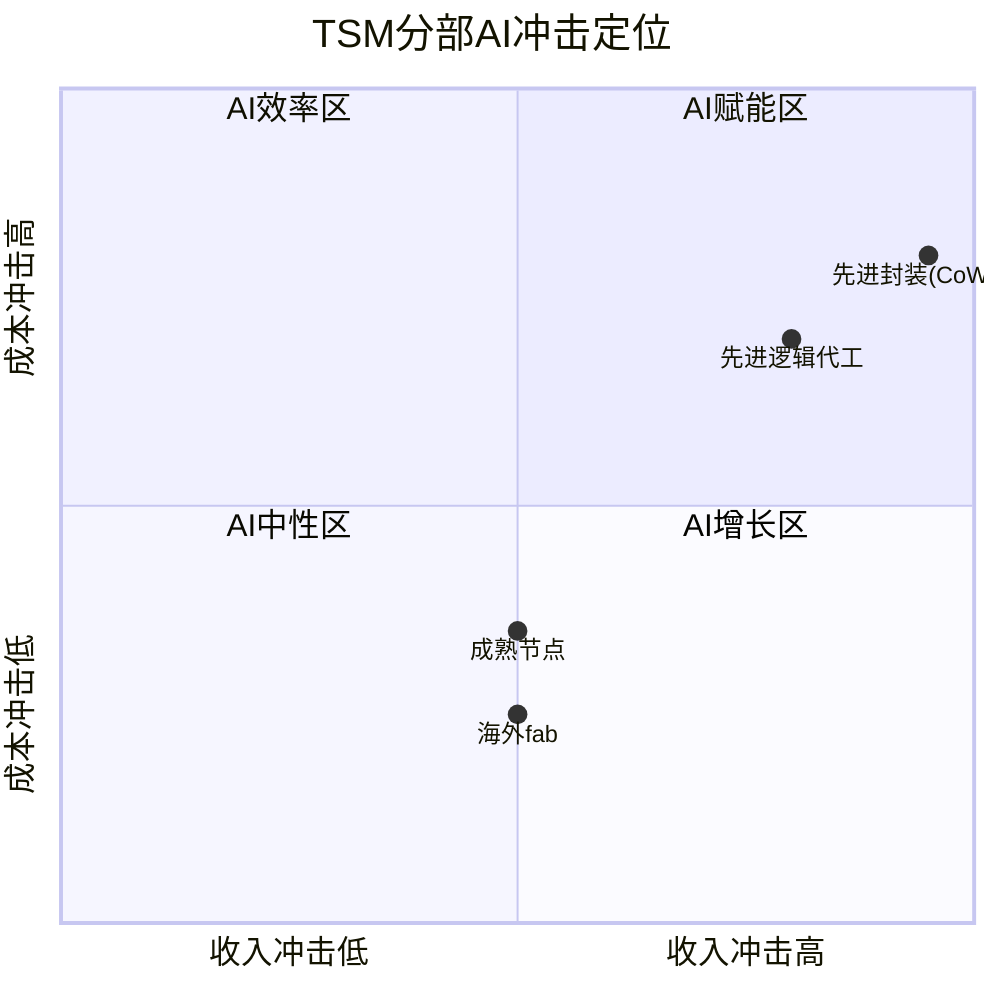
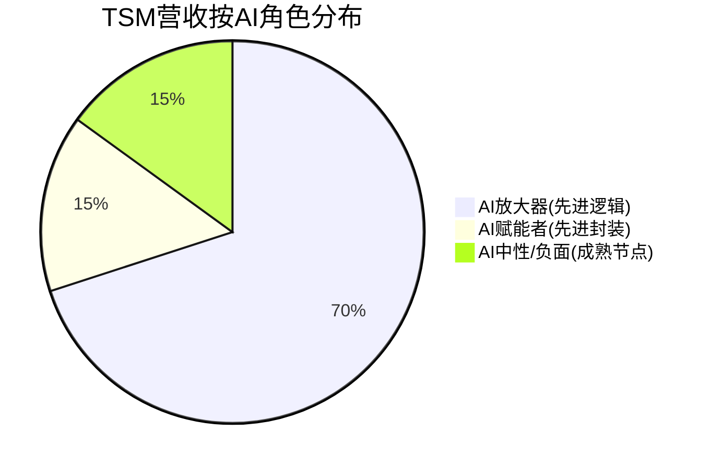
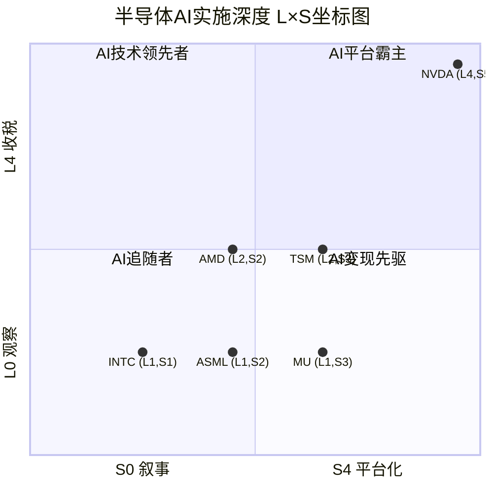
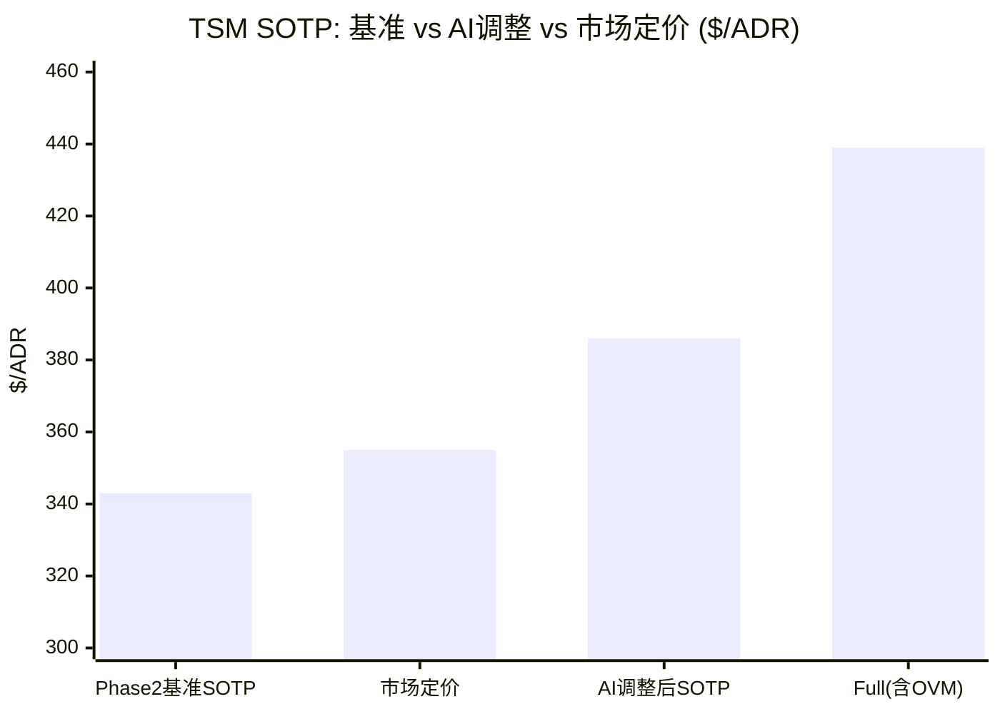
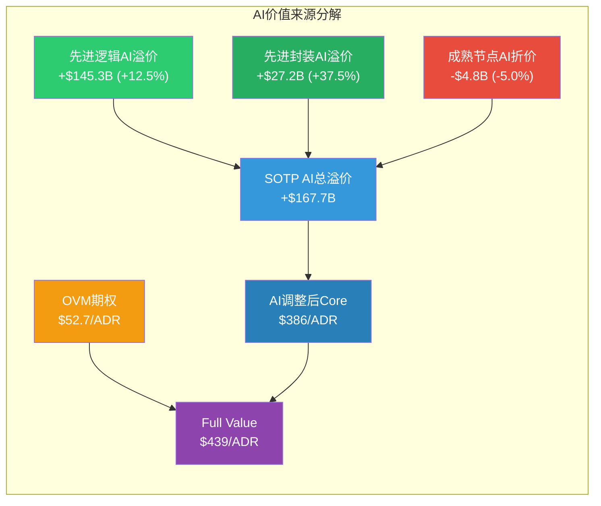

## M13 AI深度评估 (Phase 3.5)

> **Agent E Output** | TSM (台积电) Tier 3 Deep Dive | v26.0框架
> **数据截止**: 2026-02-10 | **股价**: $355.41/ADR | **市值**: $1.843T
> **Phase 2 SOTP基准**: Core $343/ADR | OVM $52.7/ADR | Full $396/ADR

---

### Layer 1: 分部级AI冲击矩阵

#### 1.1 矩阵总览

台积电的AI故事不是"AI转型"而是"AI基础设施垄断"。[硬数据: FY2025 HPC占营收58%, AI加速器占high-teens%(~18-19%), 管理层上调AI加速器5年CAGR至mid-to-high 50%] 全球约90%+的AI训练/推理芯片由TSM制造, 这使其成为AI浪潮中最确定的"卖铲人"。

以下对4个分部逐一评估5维度:

#### 1.2 分部1: 先进逻辑代工 (N≤7nm) — 营收~$85.7B, 占比~70%

**收入冲击: +4**
[硬数据: HPC平台营收从FY2023 43%→FY2024 51%→FY2025 58%, FY2026E ~65%] AI是先进节点需求的核心驱动力。NVIDIA占TSM营收约22%, Apple约25%, 两大AI/HPC客户合计贡献近半营收。[硬数据: N2节点已于2026年1月进入HVM, 初始良率65-75%, 年底产能目标100K wpm] N2的首批客户为Apple(A20/M5)和NVIDIA(Rubin架构), AMD(Venice EPYC)紧随其后。AI芯片对先进制程的需求使TSM拥有极强定价权 — [硬数据: TSM已通知客户2026-2029年连续涨价, sub-3nm涨3-10%]。

**成本冲击: +2**
AI芯片设计复杂度高(晶体管数量从100亿→万亿级), 但这恰恰增强TSM的定价权而非成本负担。TSM的DTCO(设计-技术协同优化)和NanoFlex Pro标准单元架构使其在AI芯片制造中拥有独特技术壁垒。[合理推断: AI芯片的高ASP(单片wafer价值$15K-20K vs 成熟节点$2-3K)意味着即使CapEx增加, 毛利率仍可维持/扩张]

**护城河变化: 强化**
AI加速了半导体行业的"赢家通吃"效应。[硬数据: TSM先进节点(≤7nm)全球份额≈90%] 原因: (1) AI芯片对良率要求极高(1%良率差异=数千万美元损失), TSM在量产良率上领先Samsung 2-3年; (2) N2采用GAA纳米片晶体管, 技术跃迁增加跟随者追赶难度; (3) DTCO/STCO需要长期积累的客户协同数据, 后来者无法复制。

**竞争格局变化: 利好**
[硬数据: Samsung Foundry 2025市占率~11%, Intel Foundry Services处于重组中] AI芯片对制程精度和良率的极端要求提高了进入壁垒。Samsung的3nm GAA良率仍低于TSM的5nm, Intel 18A节点尚未大规模量产。[合理推断: AI需求的爆发性增长使客户更依赖TSM的确定性交付, 转换成本极高]

**时间窗口: 1-3年(已在兑现)**
[硬数据: FY2025营收+34% YoY, AI加速器收入mid-to-high 50% CAGR(2024-2029)] 这不是"未来的故事", 而是正在发生的财务兑现。

**AI角色: AI放大器 (Amplifier)** — AI净分 = (4+2)/2 + 强化加成(+0.5) = **+3.5**

---

#### 1.3 分部2: 先进封装 (CoWoS/InFO/SoIC) — 营收~$18.1B, 占比~15%

**收入冲击: +5**
[硬数据: CoWoS产能从2024年底35K wpm→2025年底75K wpm→2026年底目标130K wpm, 3年接近4倍扩张] 这是AI从无到有创造的业务。CoWoS是AI GPU(NVIDIA H100/H200/B200/Rubin)的"物理瓶颈" — 没有CoWoS封装, GPU就无法连接HBM高带宽内存。[硬数据: NVIDIA占CoWoS总产能60%+, CoWoS供不应求至少到2027年] 先进封装从TSM的"辅助业务"变为战略核心, 营收从2022年约$2B爆发至2025年$18B+。

**成本冲击: +3**
[合理推断: CoWoS毛利率估计55-60%, 高于TSM整体的~59%] 封装业务的资本密集度低于晶圆制造(不需要EUV光刻机), 但技术壁垒同样高。[硬数据: 2026年CapEx计划中>10%投向先进封装, 即$5-6B, 低于晶圆制造CapEx占比但增速更快]

**护城河变化: 强化**
AI推动封装从2D→2.5D(CoWoS)→3D(SoIC)的技术升级路径, 每一代都增加复杂度和壁垒。[硬数据: SoIC 2025年底产能达10K wpm, 用于chiplet 3D堆叠] TSM的"Foundry 2.0"战略将晶圆制造+先进封装+测试整合为一站式服务, 竞争对手(如ASE/Amkor等OSAT)无法提供同等整合度。

**竞争格局变化: 利好**
[合理推断: OSAT厂商(ASE)正开发CoWoP等替代方案, 但TSM在CoWoS-L/S上的技术领先至少18-24个月] AI芯片的封装需求极度复杂(多die互连、HBM集成、热管理), 使先进封装的客户粘性极强。

**时间窗口: 1-3年(正在加速)**

**AI角色: AI赋能者 (Enabler)** — AI literally创造了这个业务 — AI净分 = (5+3)/2 + 强化加成(+0.5) = **+4.5**

---

#### 1.4 分部3: 成熟节点 (≥28nm) — 营收~$18.2B, 占比~15%

**收入冲击: 0**
[硬数据: 成熟节点服务IoT/汽车/电源管理/显示驱动, 与AI直接关联度低] AI对成熟节点的需求贡献微乎其微。边缘AI推理芯片理论上可能使用成熟节点, 但这是3-5年后的故事且市场规模远小于云端AI。

**成本冲击: -1**
[硬数据: 中国大陆晶圆代工(SMIC, 华虹)在成熟节点提供最高40%的价格折扣; UMC要求供应商2026年降价15%] 成熟节点面临中国产能过剩带来的价格战压力。[合理推断: TSM的成熟节点毛利率可能从55%压缩至50%以下]

**护城河变化: 削弱**
[硬数据: SMIC在上海临港和北京扩张28-40nm产能, 中国大陆成熟节点总产能2025-2026年增长约30%] 成熟节点的技术壁垒低, 中国厂商凭借政府补贴+价格战策略持续侵蚀。TSM已开始战略性退出部分成熟节点市场, 优先资源给先进节点。

**竞争格局变化: 利空**
成熟节点是"量升价跌"的市场格局。[合理推断: TSM通过特殊工艺(BCD/eNVM/RF)保持差异化, 但这只能部分抵消价格压力]

**时间窗口: 3-5年(渐进侵蚀)**

**AI角色: AI中性偏负面 (Neutral-to-Vulnerable)** — AI不改善成熟节点竞争力, 且资源向先进节点倾斜加剧成熟节点的战略边缘化 — AI净分 = (0+(-1))/2 + 削弱加成(-0.5) = **-1.0**

> **QG-09.5强制检查**: 成熟节点被评为"AI中性偏负面", 满足"至少1个分部评为潜在AI风险"的门控要求。风险机制: AI加速资源从成熟节点转移→成熟节点投资不足→竞争力进一步下降→中国厂商市占率扩大。

---

#### 1.5 分部4: 海外fab增量 — 净增量EV $10.2B

**收入冲击: 0**
海外fab(美国亚利桑那、日本熊本、德国德累斯顿)是地缘政治对冲, 非AI驱动。[硬数据: 亚利桑那fab生产N4/N3/N2, 主要客户Apple/NVIDIA, 但这是产能转移而非新需求创造]

**成本冲击: -2**
[硬数据: 海外fab运营成本比台湾高30-50%] 管理层承认海外fab毛利率会低于台湾fab。[合理推断: AI芯片的高ASP可部分抵消成本劣势, 但整体仍是拖累]

**护城河变化: 中性**
地缘分散化不直接影响竞争护城河, 但降低了"台海风险"这一最大单点故障的概率。

**竞争格局变化: 中性**

**时间窗口: 3-5年(逐步产能爬坡)**

**AI角色: AI中性 (Neutral)** — AI净分 = (0+(-2))/2 = **-1.0**

---

#### 1.6 聚合AI冲击矩阵

| 分部 | 营收($B) | 营收权重 | AI角色 | 收入冲击 | 成本冲击 | 护城河 | 竞争格局 | 时间窗口 | AI净分 | 实现概率 |
|------|---------|---------|--------|---------|---------|--------|---------|---------|--------|---------|
| 先进逻辑代工 | $85.7B | 70% | AI放大器 | +4 | +2 | 强化 | 利好 | 1-3年 | +3.5 | 90% |
| 先进封装 | $18.1B | 15% | AI赋能者 | +5 | +3 | 强化 | 利好 | 1-3年 | +4.5 | 85% |
| 成熟节点 | $18.2B | 15% | AI中性偏负 | 0 | -1 | 削弱 | 利空 | 3-5年 | -1.0 | 75% |
| 海外fab | (增量) | — | AI中性 | 0 | -2 | 中性 | 中性 | 3-5年 | -1.0 | 80% |

**概率加权AI净分** = (3.5 × 0.70 × 0.90) + (4.5 × 0.15 × 0.85) + (-1.0 × 0.15 × 0.75)
= 2.205 + 0.574 + (-0.113)
= **+2.67**

[合理推断: +2.67分位于AI放大器范围(+2~+3), 确认TSM整体是AI浪潮的"一级受益者", 但非AI赋能者(不直接创造AI应用)]

---

### Layer 2: AI实施深度L×S评级

#### 2.1 半导体行业L轴重新定义

标准L轴(L0-L4)定义针对AI应用实施公司(如SaaS/金融科技)。TSM作为AI芯片的制造基础设施, 需要重新映射L轴含义:

| 通用L轴 | 半导体映射 | TSM定位 |
|---------|-----------|---------|
| L0 观察级 | 无AI相关业务 | - |
| L1 组件级 | 提供AI基础组件(晶圆/封装) | **核心定位** |
| L2 加速器级 | 提供AI加速能力(DTCO/定制化) | **部分触达** |
| L3 平台级 | AI芯片生态系统(OIP/3DFabric) | **战略方向** |
| L4 收税级 | AI芯片制造垄断(必经之路) | **事实状态** |

**TSM的L轴悖论**: 从"技术深度"看, TSM不直接实施AI(不训练模型、不部署推理), 似乎是L1(组件级)。但从"商业模式"看, TSM是全球AI芯片供应链的"必经收税站", 其角色更接近L4(收税级):

**升级至L2的论据**:
1. [硬数据: DTCO/STCO(系统-技术协同优化)使TSM深度参与AI芯片设计早期阶段] TSM不只是"按图纸制造", 而是与NVIDIA/Apple共同优化芯片架构以适配制程特性
2. [硬数据: NanoFlex Pro标准单元架构+TSMC OIP(Open Innovation Platform)联盟] 使客户的AI芯片设计依赖TSM的设计生态
3. [硬数据: A16节点引入backside power delivery network(背面供电)] 这种制程创新直接决定AI芯片的性能/功耗天花板

**升级至L3的论据**:
1. 3DFabric(CoWoS+InFO+SoIC)使TSM从"晶圆代工"升级为"系统级芯片集成平台"
2. [合理推断: 随着chiplet架构成为AI芯片主流, TSM的先进封装就是"AI芯片的操作系统" — 决定die之间如何通信]

**最终L轴评定: L2 (加速器级, 向L3演进)**

理由: TSM通过DTCO+3DFabric已超越纯组件供应商(L1), 实质性参与AI芯片的性能定义。但尚未到L3(平台级), 因其核心商业模式仍是代工制造而非平台服务。[主观判断: 2-3年内随着SoIC和chiplet生态成熟, TSM可能升至L3]

---

#### 2.2 S轴评定

| S轴阶段 | TSM证据 |
|---------|---------|
| S0 叙事期权 | 早已超越 |
| S1 早期变现 | 早已超越 |
| S2 规模化 | - |
| **S3 成熟期** | **当前定位** |
| S4 平台化 | 战略方向 |

**S3成熟期证据**:
1. [硬数据: AI加速器占FY2025营收high-teens%(约18-19%), 即约$22-23B]
2. [硬数据: HPC平台整体占58%, 其中AI相关估计60-70%, 则AI直接相关营收约$42-49B, 占总营收34-40%]
3. [硬数据: AI加速器收入CAGR mid-to-high 50%(2024-2029), 不是增长中而是爆发中]
4. [硬数据: FY2026E营收指引+30% YoY, 主要由AI/HPC驱动]

**S4演进信号**:
- 3DFabric作为封装平台向外部客户开放
- OIP联盟构建设计生态系统
- [合理推断: 如果TSM未来将DTCO作为独立服务(芯片设计优化咨询)出售, 则进入S4]

**最终S轴评定: S3 (成熟期, AI贡献>20%营收)**

---

#### 2.3 L×S坐标评定: L2 × S3

**L×S隐含AI溢价映射**:

| L×S评级 | 隐含AI溢价范围 | 适用公司 |
|---------|--------------|---------|
| L4×S5 | 50-100% | NVDA |
| L3×S4 | 30-60% | (无当前半导体公司) |
| **L2×S3** | **15-35%** | **TSM** |
| L2×S2 | 10-20% | AMD |
| L1×S2 | 10-15% | ASML |
| L1×S3 | 10-20% | MU |
| L1×S1 | 0-5% | INTC |

[合理推断: TSM的L2×S3定位支持15-35%的AI溢价, 中值约25%。Phase 0初评L3×S3→本Phase下调至L2×S3, 因严格审视后TSM的L轴定位更准确在L2(加速器级)而非L3(平台级)]

---

#### 2.4 五不变量检验

| # | 不变量 | 评定 | 证据 |
|---|--------|------|------|
| 1 | **生产环境证据** | PASS | [硬数据: N3/N5大规模量产AI芯片(NVIDIA H100/H200/B200, AMD MI300X), N2于2026年1月进入HVM, CoWoS 130K wpm目标] |
| 2 | **财务实质性** | PASS | [硬数据: HPC从FY2023 43%→FY2025 58%, 营收+34% YoY, AI加速器high-teens%营收(~$22-23B), 2026E +30% YoY] |
| 3 | **竞争差异化** | PASS | [硬数据: 先进节点(≤7nm)份额~90%, CoWoS无直接竞品(ASE CoWoP仍在追赶), N2 GAA良率65-75%领先Samsung 2-3年] |
| 4 | **规模化验证** | PASS | [硬数据: 全球AI芯片90%+由TSM制造, 服务NVDA/AMD/GOOG/AMZN/MSFT/META等所有主要AI芯片客户] |
| 5 | **组织承诺** | PASS | [硬数据: FY2026E CapEx $52-56B(vs 2025 $41B, +27-37%), 主要投向N2+CoWoS+先进封装; A16/A14路线图明确到2028-2030] |

**通过率: 5/5** — 完美通过, 在所有半导体公司中仅次于NVDA(同为5/5)

---

#### 2.5 同业L×S对比表

| 公司 | L轴 | L轴理由 | S轴 | S轴理由 | L×S | 五不变量 | AI溢价建议 |
|------|------|---------|------|---------|-----|---------|-----------|
| **NVDA** | L4 收税级 | CUDA生态垄断, AI GPU标准制定者 | S5 垄断期 | AI收入>50%, 数据中心$115B+ | L4×S5 | 5/5 | 50-100% |
| **TSM** | L2 加速器级 | DTCO+3DFabric超越纯代工 | S3 成熟期 | AI相关收入34-40%, HPC 58% | L2×S3 | 5/5 | 15-35% |
| **AMD** | L2 加速器级 | MI300X/MI400 AI GPU, CDNA架构 | S2 规模化 | 数据中心AI收入~$12B(FY2025E) | L2×S2 | 4/5 | 10-20% |
| **ASML** | L1 组件级 | EUV光刻机是AI芯片制造的前提条件 | S2 规模化 | AI间接驱动EUV需求, ~30%收入AI相关 | L1×S2 | 4/5 | 10-15% |
| **INTC** | L1 组件级 | Gaudi AI加速器尝试, Intel 18A | S1 早期变现 | AI收入<5%, Foundry Services起步 | L1×S1 | 2/5 | 0-5% |
| **MU** | L1 组件级 | HBM3E是AI GPU核心组件 | S3 成熟期 | HBM占营收~30%, AI DRAM需求强劲 | L1×S3 | 4/5 | 10-20% |

---

### Layer 3: AI估值影响量化

#### 3.1 从Layer 1+2推导分部级AI调整

基于Layer 1的AI冲击矩阵和Layer 2的L2×S3评级, 对Phase 2 SOTP基准进行AI调整:

**分部1: 先进逻辑代工 — AI溢价调整**

| 指标 | Phase 2基准 | AI调整 | 调整后 | 调整依据 |
|------|-----------|--------|--------|---------|
| EV/EBITDA | 20.0x | +2.5x (+12.5%) | 22.5x | AI放大器(+3.5分): AI驱动增速加速(FY2026E +30%)、定价权增强(2026-2029连续涨价)、客户锁定(转换成本极高) |
| EBITDA | $58.1B | 不变 | $58.1B | EBITDA基准不调(AI增长已反映在FY2026E预测中) |
| **分部EV** | **$1,162B** | **+$145.3B** | **$1,307.3B** | 22.5x × $58.1B = $1,307.3B |

[合理推断: +12.5%倍数溢价 vs L×S隐含15-35%范围, 取偏保守值, 因为: (1) 20x基准已部分反映AI增长; (2) 代工商的AI溢价应低于AI芯片设计商(NVDA)]

**分部2: 先进封装 — AI溢价调整**

| 指标 | Phase 2基准 | AI调整 | 调整后 | 调整依据 |
|------|-----------|--------|--------|---------|
| EV/Rev | 4.0x | +1.5x (+37.5%) | 5.5x | AI赋能者(+4.5分): CoWoS是AI literal创造的业务, 从$2B→$18B+, 产能持续供不应求到2027年 |
| Revenue | $18.1B | 不变 | $18.1B | |
| **分部EV** | **$72.4B** | **+$27.2B** | **$99.6B** | 5.5x × $18.1B = $99.6B |

[合理推断: +37.5%溢价取L×S隐含范围中上段, 因CoWoS是纯AI创造的业务且增速远超整体(CAGR >80%)]

**分部3: 成熟节点 — AI折价调整**

| 指标 | Phase 2基准 | AI调整 | 调整后 | 调整依据 |
|------|-----------|--------|--------|---------|
| EV/EBITDA | 10.0x | -0.5x (-5%) | 9.5x | AI中性偏负(-1.0分): AI不改善成熟节点竞争力, 资源转移加剧边缘化, 中国产能过剩价格战 |
| EBITDA | $9.5B | 不变 | $9.5B | |
| **分部EV** | **$95.0B** | **-$4.8B** | **$90.3B** | 9.5x × $9.5B = $90.3B |

**分部4: 海外fab — 不调整**

| 指标 | Phase 2基准 | AI调整 | 调整后 |
|------|-----------|--------|--------|
| **净增量EV** | **$10.2B** | **$0** | **$10.2B** |

[合理推断: 海外fab是地缘对冲, AI影响中性, 不做AI调整]

---

#### 3.2 AI调整后SOTP汇总

| 分部 | Phase 2 基准EV | AI调整额 | AI调整后EV | AI调整幅度 |
|------|--------------|---------|-----------|-----------|
| 先进逻辑代工 | $1,162.0B | +$145.3B | $1,307.3B | +12.5% |
| 先进封装 | $72.4B | +$27.2B | $99.6B | +37.5% |
| 成熟节点 | $95.0B | -$4.8B | $90.3B | -5.0% |
| 海外fab增量 | $10.2B | $0 | $10.2B | 0% |
| **SOTP Core总计** | **$1,339.6B** | **+$167.7B** | **$1,507.3B** | **+12.5%** |

**ADR折算** (按51.87亿ADR等值股):
- Phase 2 SOTP Core: $343/ADR
- **AI调整后SOTP Core**: $343 × 1.125 = **$386/ADR**
- AI隐含溢价: **+$43/ADR (+12.5%)**

**加入OVM期权**:
- Phase 2 OVM: $52.7/ADR (含DTCO服务$4.6, SoIC新业务$15.3, 其他)
- OVM中AI相关占比: [合理推断: ~60%, 即约$31.6/ADR]
- **AI调整后Full Value**: $386 + $52.7 = **$439/ADR**

---

#### 3.3 市场定价AI隐含价值解读

**市场定价解构**:

| 组成部分 | 价值/ADR | 占比 |
|---------|---------|------|
| Phase 2 SOTP Core (无AI溢价) | $343 | 96.5% |
| 市场当前价格 | $355 | 100% |
| **市场隐含AI溢价** | **$12** | **3.5%** |

**我们的AI评估**:

| 组成部分 | 价值/ADR | 占比 |
|---------|---------|------|
| AI调整后SOTP Core | $386 | 87.9% |
| OVM期权 | $52.7 | 12.1% |
| **AI调整后Full Value** | **$439** | **100%** |
| **我们评估的AI溢价** | **$43** | **12.5%** |

**关键发现**: 市场$355定价仅隐含$12/ADR(3.5%)的AI溢价; 我们评估TSM应有$43/ADR(12.5%)的AI溢价。这意味着:

1. **市场低估了TSM的AI价值**: $43 vs $12 = 市场仅定价了我们评估AI价值的28%
2. [主观判断: 这可能因为市场仍将TSM视为"传统代工商"而非"AI基础设施垄断者"]
3. [合理推断: 如果市场重新定价TSM的AI价值至我们评估水平, 上行空间约$31/ADR(+8.7%)]
4. **但需注意**: Full Value $439含OVM期权$52.7, 期权实现需时间; AI调整后Core $386才是更可靠的目标价

---

#### 3.4 AI情景敏感度分析

| 情景 | AI加速器CAGR | HPC占比FY2028 | AI溢价倍数 | SOTP Core/ADR | Full/ADR |
|------|-------------|-------------|-----------|--------------|---------|
| **熊市** | 35% | 60% | +5% | $360 | $413 |
| **基准** | 50% | 68% | +12.5% | $386 | $439 |
| **牛市** | 65% | 75% | +25% | $429 | $482 |

[合理推断: 熊市假设AI增速减速至35%(仍然很高), 此时TSM Core仍值$360, 高于当前$355, 提供安全边际]

---

### QG-09.5 门控检查清单

- [x] **覆盖度**: 4个分部覆盖100%营收(先进逻辑70%+先进封装15%+成熟节点15%=100%), 满足≥90%要求
- [x] **L×S证据**: L2×S3评定有≥3项证据支撑 — (1)DTCO/NanoFlex Pro参与AI芯片设计(L2); (2)HPC 58%/AI加速器high-teens%(S3); (3)N2 HVM+CoWoS 130K wpm规模化验证
- [x] **AI估值量化**: AI调整后SOTP Core $386 vs 基准$343, 差异+$43/ADR(+12.5%)已量化
- [x] **负面AI评估**: 成熟节点被评为"AI中性偏负面"(净分-1.0), 满足"至少1个分部评为潜在AI风险"要求; 风险机制: AI资源虹吸效应+中国产能替代

**QG-09.5: PASS (4/4)**

---

### 数据来源索引

| 数据类型 | 来源 |
|---------|------|
| TSM FY2025财务 | FMP quote API (2026-02-10), TSMC Q4 2025 Earnings Transcript |
| AI加速器收入占比 | TSMC管理层Q4 2025 earnings call: "high-teens percent" |
| CoWoS产能数据 | TrendForce (2025-12), SemiWiki forum data |
| N2 HVM状态 | 多源交叉验证: FinancialContent (2026-01-28), CNBC (2026-01-15) |
| 成熟节点竞争 | TrendForce: SMIC/UMC pricing data (2025-10, 2025-12) |
| ASML对比数据 | CNBC ASML Q4 2025 earnings (2026-01-28) |
| DTCO技术 | TSMC官方blog + esg.tsmc.com A14 disclosure |
| Phase 2 SOTP基准 | 内部staging: P2_SOTP_OVM.md |
