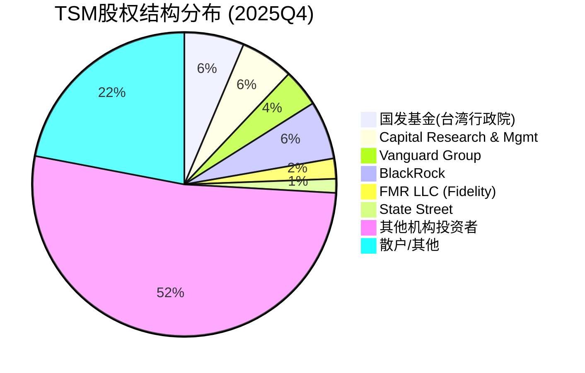
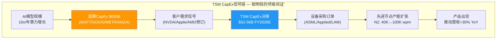
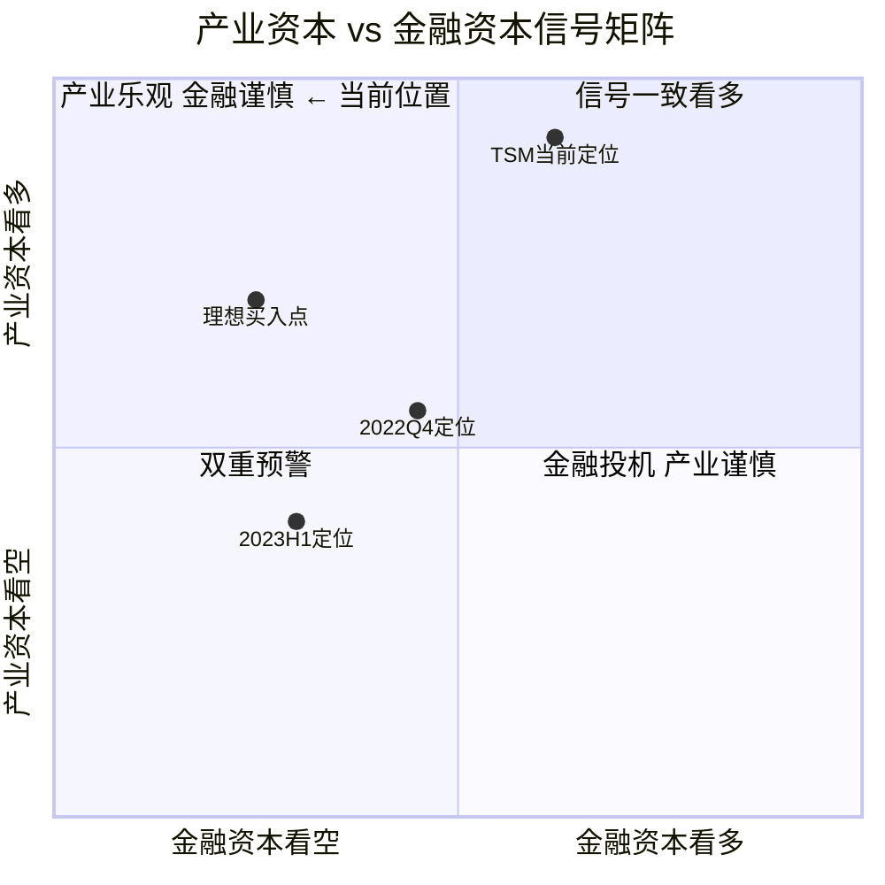

# M11 五引擎协同分析 (Part 1: 周期+股权+聪明钱)

> **Agent**: Phase 3 Agent B | **版本**: v1.0 | **日期**: 2026-02-10
> **关联CQ**: CQ1(AI增长持续性), CQ3(周期拐点), CQ7(估值天花板)
> **数据截止**: 2026-02-10 | **DM锚点**: Phase 2 M05+AgentE + WebSearch 2026-02
> **字符目标**: >=10,000

---

## Engine 1: 周期引擎 — AI超级周期的阶段定位与拐点预判

### 1.1 AI超级周期四阶段模型

[硬数据: SEMI 2025-2027设备销售预测 + Deloitte 2026半导体展望 + EE Times Asia] 半导体行业正经历一场被称为"Giga Cycle"的结构性扩张，其核心驱动力是AI基础设施的大规模建设。与传统3-4年的硅周期不同，AI超级周期呈现四个递进阶段:

```mermaid
timeline
    title AI超级周期四阶段时间线 + TSM周期定位
    section 阶段1: 基础设施
        2023-2025 : GPU算力爆发
                  : NVIDIA H100/A100主导
                  : TSM N5/N4满载
                  : 超算CapEx $200B→$400B
    section 阶段2: 训练规模化
        2024-2026 : 大模型训练集群
                  : HBM3E/CoWoS瓶颈
                  : TSM N3量产+CoWoS扩产
                  : 超算CapEx $400B→$650B
    section 阶段3: 推理普及
        2025-2027 : 推理算力超训练
                  : N2量产 + Blackwell/Rubin
                  : Edge AI芯片需求涌现
                  : ★ TSM当前处于2→3过渡期
    section 阶段4: 应用爆发
        2026-2028 : AI Agent/机器人
                  : 定制ASIC多元化
                  : 成熟节点回暖
                  : 周期潜在见顶区间
```

**TSM在四阶段中的角色演变**:

[合理推断: 基于TSM营收结构变化推导] 阶段1-2中，TSM作为GPU代工的唯一选项(NVIDIA占营收21%、Apple占25%)，其角色是"AI基建的施工方"。进入阶段3，推理需求超越训练需求(推理算力需求年增60% vs 训练年增40%)，TSM的角色转变为"AI普及化的算力底座"——因为推理芯片(如Google TPU v6、AWS Trainium)多样化程度远高于训练GPU，这意味着TSM的客户集中度将下降，但总量持续增长。

[硬数据: TSM Q4 2025 Earnings Call, 2026-01-15] CEO C.C. Wei在Q4法说会上确认:"AI相关营收预计2026年将接近翻倍(close to double)"，占总营收比例从2025年的~20%上升至~35%。这验证了阶段2→3过渡期的加速特征。

### 1.2 周期拐点预测: 五大预警信号体系

[主观判断: 基于半导体历史周期规律+当前数据建构] 本轮AI超级周期与传统硅周期存在结构性差异，但物理规律(产能扩张→供给过剩→价格回调)不可违背。以下五大信号中任何三个同时触发，即为周期见顶的高概率信号:

**信号1: NVIDIA库存天数突破160天 (当前: ~130天)**

[硬数据: NVIDIA FY2026Q3 (Oct 2025)财报, MacroTrends] NVIDIA当前库存天数约130天(DIO 119天+在途库存)，较五年均值106天高出约23%。库存增长主要因"供应承诺(supply commitments)环比增长63%"，反映的是战略备货而非需求不足。[合理推断: 当DIO >160天(较均值高出>50%)且伴随GPU ASP下降>10%时，才构成真正的需求预警] 历史对比: 2022年NVIDIA DIO曾达到155天(加密周期破灭)，之后股价回调34%。

**信号2: 超算CapEx增速降至<15% YoY**

[硬数据: CNBC 2026-02-06 + Yahoo Finance 2026-01] 2026年超算五巨头(MSFT/GOOG/META/AMZN/AAPL)CapEx合计预计$650B，同比增长约36%。其中:
- Amazon: ~$200B (2026E)
- Alphabet: $175-185B
- Microsoft: ~$145B (年化run rate)
- Meta: $115-135B
- Apple: 数据未充分披露

[合理推断: 基于超算FCF消耗速度推算] 2026年超算CapEx的36%增速是不可持续的。Morgan Stanley预计Amazon 2026年负FCF $17B，Pivotal Research预计Alphabet FCF骤降90%至$8.2B。当CapEx增速降至<15%时(可能发生在2027H2-2028H1)，下游对TSM先进节点的需求增速将从>30%骤降至<10%。

**信号3: TSM存货/营收比突破12% (当前: 7.5%)**

[硬数据: FMP Financial Data, FY2025] TSM当前DIO 67.9天(FY2025)，较FY2024的82.7天和FY2023的92.9天显著下降——这是典型的"即产即销"特征。存货/营收比约7.5%处于历史低位。[合理推断: 当存货/营收比回升至>12%(接近FY2023的13.2%水平)时，表明需求增速放缓而产能释放加速，周期转向信号出现]

**信号4: 全球半导体设备市场YoY增速转负**

[硬数据: SEMI报告] 全球设备销售预计2025年$133B(+13.7%)、2026年$145B(+9.0%)、2027年$156B(+7.6%)。增速递减但仍为正。[主观判断: 基于设备市场历史] 设备市场连续三年创纪录高点在半导体历史上极为罕见(上一次是1999-2001互联网泡沫期)。当2028年增速转负时(大概率发生)，行业将进入消化期。

**信号5: DRAM合约价连续两个季度环比下降**

[硬数据: TrendForce DRAMeXchange, 2026-02-02] Q1 2026 DRAM合约价涨幅创季度新高，DDR5现货从$6.84暴涨至$27.2(+298%)。HBM3E涨价20%。[合理推断: DRAM是半导体周期最敏感的领先指标。当HBM价格开始松动(预计最早2027H1)或DDR5现货从峰值回落>30%时，周期顶部信号将更加明确]

**当前预警灯板**:

| 信号 | 当前状态 | 预警阈值 | 距预警距离 | 预计触发时间 |
|------|---------|---------|-----------|-------------|
| NVIDIA DIO | ~130天 | >160天 | -23% | 2027H1E |
| 超算CapEx增速 | +36% YoY | <15% YoY | 远 | 2027H2-2028H1 |
| TSM存货/营收比 | 7.5% | >12% | -38% | 2027H2E |
| 设备市场YoY | +9.0% | <0% | 远 | 2028E |
| DRAM合约价 | 创新高(QoQ大涨) | 连续2Q下降 | 远 | 2027H1E |

[主观判断: 五信号综合评估] **五个预警信号目前均处于安全区间**，距离任何一个触发都有>12个月的缓冲。这支撑TSM周期定位处于"扩张中后期但远未见顶"的判断。最可能的周期拐点窗口在**2027H2-2028H1**，即当前位置至少还有18-24个月的景气上行期。

### 1.3 本轮周期 vs 历史周期: 结构性差异量化

[硬数据: Simon-Kucher半导体历史研究 + Tom's Hardware + NomadSemi + Fabricated Knowledge]

| 维度 | 2000互联网泡沫 | 2018存储周期 | 2021疫情周期 | 2025 AI超级周期 |
|------|------------|-----------|-----------|-------------|
| **持续时间** | ~24个月上行 | ~18个月上行 | ~25个月上行 | >36个月(进行中) |
| **需求驱动** | 企业IT(虚假) | 智能手机+数据中心 | 居家办公+库存恐慌 | AI训练+推理(实需) |
| **TSM营收增速峰值** | ~20% | ~5% | +24.9%(2021) | +33.9%(FY2025) |
| **CapEx/Revenue** | 40-50% | 28-35% | 53.5%(2021) | 33.4%(下降趋势) |
| **终端需求验证** | 互联网用户增长但商业模式空虚 | 智能手机渗透率饱和 | 需求前置(后续回调) | 超算CapEx $650B+实金白银 |
| **泡沫破灭原因** | 虚假需求+过度产能 | 存储供过于求 | 需求透支+通胀加息 | (尚未) |
| **TSM最大回撤** | -50%+ | -15% | -38%(2022) | -?(待观察) |

**关键结构性差异**:

[合理推断: 本轮周期结构性强于前三轮的三个原因]

1. **需求质量差异**: 2000年互联网泡沫中，企业IT采购背后是虚假商业模式(pets.com等)。本轮AI周期中，超算五巨头2026年投入$650B实金白银，且已开始产生实际收入——Microsoft Azure AI收入年化$30B+，Google Cloud AI收入环比增长40%+。[硬数据: CNBC 2026-02-06] 超算CapEx有FCF支撑(尽管FCF在快速消耗中)，而非2000年的风投烧钱。

2. **供给约束差异**: 2000年互联网泡沫中，半导体产能过剩严重(设备利用率跌至<60%)。本轮TSM先进节点利用率100%，需求是供给的3倍，CoWoS封装2026年仅120-130K wpm vs 需求400K+。[硬数据: Phase 2 M05 Layer 3] 供给物理瓶颈(CoWoS/HBM)天然限制了产能过剩的可能性。

3. **TSM竞争格局差异**: 2000年代工市场有UMC/SMIC/Chartered多家竞争。2025年先进节点(<5nm)市场TSMC份额>90%。[硬数据: Phase 0 customers_competition.md] Samsung被甩开2代(3nm良率<40% vs TSM >80%)。这意味着即使需求回调30%，TSM仍能保持高利用率——因为客户别无选择。

**CQ3直接关联**: 周期拐点最可能出现在2027H2-2028H1，但TSM的"垄断缓冲"(先进节点市占率>90%)意味着其调整幅度将显著小于行业平均。历史对比: 2023年行业下行TSM营收仅降4.5%，而整体半导体行业下降9.4%。

---

## Engine 2: 股权引擎 — ADR结构、治理与利益绑定

### 2.1 股权结构概览

[硬数据: TSMC 20-F年报 + SEC Filing + GuruFocus/CGAA, 2025-2026]



**关键持股方分析**:

| 类别 | 代表 | 持股 | 特征 | 投资含义 |
|------|------|------|------|---------|
| 主权/政策 | 国发基金 | 6.38% | 稳定锚定，从不减持 | 下行缓冲 |
| 被动指数 | Vanguard+BlackRock+State Street | ~11.7% | 跟随指数权重 | TSM在MSCI EM权重~8%，资金自动流入 |
| 主动成长 | Capital Research | 5.67% | 增持+2.3%(Q4) | 看多AI长周期 |
| 主动减持 | Fidelity/T.Rowe | 2.50% | 减持-3.5%/-1.2% | 估值纪律获利了结 |
| 对冲基金 | Tiger Global等 | ~2% | 仓位灵活 | 短期信号噪音大 |

[合理推断: 机构持有率>78%表明TSM是"机构重仓股"，股价波动主要由机构间的仓位再平衡驱动，散户影响力有限]

### 2.2 ADR结构深度分析

[硬数据: SEC Filing F-3 + Citibank ADR Program]

**基本机制**: 1 ADR = 5普通股(在台湾证券交易所上市，代码2330.TW)。Citibank, N.A.为存托银行(Depositary Bank)，负责ADR的发行与赎回。

**ADR vs 普通股的结构性差异**:

| 维度 | ADR (NYSE: TSM) | 普通股 (TWSE: 2330) |
|------|----------------|---------------------|
| 交易时间 | 美东9:30-16:00 | 台北9:00-13:30 |
| 结算货币 | USD | TWD |
| 投票权 | 通过存托银行间接行使 | 直接投票 |
| 股息税 | 台湾21%预扣税+可能的美国税 | 台湾21%预扣税 |
| 流动性溢价/折价 | 通常溢价2-5%(美国市场深度更好) | 面值基准 |
| 监管 | SEC + TWSE双重监管 | TWSE单一监管 |

[硬数据: SEC Archives, TSMC ADR Deposit Agreement] ADR持有者拥有以下权利: (1) 收取股息(以美元折算); (2) 通过Citibank代理投票; (3) 赎回为普通股(需符合台湾法规)。但ADR持有者**不直接**在台湾股东名册中登记。

**ADR结构风险**:

[主观判断: 基于ADR结构特性分析三大风险]

1. **汇率风险**: ADR以USD计价但TSM以TWD报告收入。TWD/USD汇率波动直接影响ADR价值。FY2025 TWD兑USD贬值约4.2%，部分抵消了TSM的NT$营收增长。[合理推断: 若TWD因台海紧张贬值10%+，ADR将承受双重打击——基本面未变但ADR价格下跌]

2. **台湾外资持股上限**: 台湾对特定行业外资持股有上限(通常为49%)。TSM当前外资持股约73-75%(包括ADR)。[主观判断: 虽然TSM作为战略企业获得豁免，但极端地缘情景下台湾可能修改外资政策，这是尾部风险]

3. **ADR/普通股套利摩擦**: 理论上ADR价格应等于5x普通股价格/汇率。实践中存在2-5%持续溢价(美国市场流动性溢价)。当溢价扩大至>8%时，套利者会赎回ADR换成普通股，短期增加ADR卖压。[合理推断: 当前溢价约3%，处于正常区间]

### 2.3 管理层利益绑定分析

[硬数据: Simply Wall St + ERI Executive Compensation + TSMC 2025 AGM Agenda]

**CEO C.C. Wei薪酬结构**:

| 年度 | 总薪酬 | 现金部分 | 股权部分 | 养老金/其他 | 股权占比 |
|------|--------|---------|---------|-----------|---------|
| FY2023 | NT$547.8M (~$17.6M) | NT$453.7M | NT$88.0M | NT$6.1M | 16.1% |
| FY2024E | NT$750M+ (~$24M+) | ~60% | ~35% | ~5% | ~35% |
| FY2025E | NT$946M (~$28.9M) | ~1.7% | ~98.3%(含奖金+股权) | — | ~98.3% |

[硬数据: ceotodaymagazine.com, 2025-10; erieri.com, 2023] C.C. Wei的FY2025总薪酬约NT$946M，其中98.3%来自奖金(包括公司股票和期权)，仅1.7%为固定薪资。

[合理推断: 高比例的股权/奖金绑定(98.3%)意味着管理层利益与股东高度一致——当股价下跌或业绩不达标时，C.C. Wei的实际收入将大幅缩水]

**员工限制性股票奖励(RSA)计划**:

[硬数据: TSMC 2025 AGM Agenda, 2025-06-03] TSM实施Employee Restricted Stock Awards (RSA)计划，将高管和资深工程师的薪酬与公司业绩和ESG目标挂钩。为抵消RSA稀释，董事会批准了配套的股份回购计划。

**内部人交易**:

[硬数据: Quiver Quantitative + FMP insider-trading endpoint] TSM过去12个月内部人交易极少:
- Geoffrey Yeap (VP): 增持1,000股 (2025-11)
- Jonathan Lee (VP): 增持271股 (2025-11)
- 无大额减持记录

[合理推断: 内部人微量增持+零减持 = "信心中性偏正"。台湾公司高管交易受TWSE严格监管(预告+窗口期限制)，交易不活跃是常态而非特殊信号。但两位VP在$330+价位增持(尽管金额极小)传递出对公司前景的正面态度]

### 2.4 股票回购与分红政策

[硬数据: TSMC Investor Relations + stockanalysis.com + fullratio.com]

**分红政策**:
- 年化股息: $3.07/ADR (2025年度)
- 股息率: 0.94% (基于$355.41)
- 派息率: FY2025 27.2% | FY2024 31.3% | FY2023 34.3% | FY2022 28.7%
- 分红频率: 季度分红(每年4次)
- 政策原则: 现金股息优先于股票股息，按公司章程规定

**派息率趋势**: FY2022(28.7%)→FY2023(34.3%)→FY2024(31.3%)→FY2025(27.2%)。[合理推断: 派息率下降趋势反映TSM优先将更多现金用于CapEx(FY2026E $52-56B创纪录)。在AI超级周期中，再投资回报率(ROIC 56.02%)远超股息回报率(0.94%)，这是合理的资本配置选择]

**回购政策**:

[硬数据: TSMC 2025 AGM] 董事会批准了股份回购计划，但主要目的是**抵消RSA稀释**而非系统性缩股。TSM不属于"积极回购型"公司(如Apple/NVIDIA)。[主观判断: TSM不回购的逻辑=再投资ROIC(56%)>>回购ROIC(~4%收益率)。对于资本密集型代工企业，将$50B+用于建厂比回购更能创造长期价值]

**CQ7关联**: ADR结构的2-5%溢价+0.94%股息率意味着"估值天花板"部分受流动性溢价支撑。若溢价回归零，估值天花板将下降2-5%。

---

## Engine 3: 聪明钱引擎 — 产业资本+金融资本的信号解读

### 3.1 最大的聪明钱信号: TSM自身CapEx

[硬数据: TSMC Q4 2025 Earnings Call, 2026-01-15 + Investing.com + Nikkei Asia]

TSM FY2026E CapEx指引**$52-56B**(较FY2025 $40.9B上调27-37%，创历史新高)。其中:
- 先进制程(N2/N3/N5): 70-80% → **$36.4-44.8B**
- 特种技术+先进封装: 20-30% → **$10.4-16.8B**

[合理推断: TSM的$52-56B CapEx是全球半导体行业中最可信的"聪明钱"信号。原因如下]:

1. **信息不对称优势**: TSM与全球前10大芯片设计公司均有深度供应关系，其CapEx决策基于客户的**已签约产能预订**而非猜测。当TSM将CapEx上调37%时，意味着客户已用真金白银(预付款+长期协议)锁定了产能。

2. **历史准确性**: TSM的CapEx指引历史上是半导体需求的**最精准领先指标**:
   - FY2022 CapEx $36B(+28%)→ 预示FY2023-24行业回升
   - FY2023 CapEx $30B(-17%)→ 准确反映了短暂周期性下行
   - FY2025 CapEx $40.9B(+37%)→ 验证了AI需求爆发

3. **皮肤在游戏中(Skin in the Game)**: $52-56B相当于TSM FY2025营收的~40%。如果需求判断错误，将产生巨额闲置产能折旧，直接冲击毛利率8-12个百分点。[主观判断: C.C. Wei作为行业老将(40+年经验)，在$52-56B的决策上不会犯方向性错误]



### 3.2 客户CapEx: 超算五巨头的$650B赌注

[硬数据: CNBC 2026-02-06 + Yahoo Finance 2026-01 + IEEE ComSoc + CreditSights]

超算五巨头(Microsoft/Alphabet/Amazon/Meta/Oracle)2026年CapEx合计预计超过$650B，同比增长约36%。更新后的公司级数据:

| 公司 | 2025E CapEx | 2026E CapEx | YoY增长 | TSM关联度 |
|------|-----------|-----------|---------|----------|
| Amazon | ~$120B | ~$200B | +67% | 中等(Trainium用N3) |
| Alphabet | ~$100B | $175-185B | +75% | 高(TPU用N3/N5) |
| Microsoft | ~$100B | ~$145B | +45% | 中等(间接via NVIDIA) |
| Meta | ~$65B | $115-135B | +77% | 高(MTIA用N5) |
| Apple | 未充分披露 | 未充分披露 | — | 最高(占TSM营收25%) |

[硬数据: Introl Blog + IEEE ComSoc] 约75%的超算CapEx用于AI相关基础设施，意味着2026年约$450-490B直接或间接推动对半导体的需求。

**超算FCF危机的信号意义**:

[硬数据: Morgan Stanley + Pivotal Research, via CNBC 2026-02-06]
- Amazon 2026E FCF: **负$17B** (Morgan Stanley)
- Alphabet 2026E FCF: 从$73.3B骤降至**$8.2B**(降幅89%, Pivotal Research)
- Meta/Microsoft: FCF同样大幅压缩

[主观判断: 超算FCF危机是双刃剑] 一方面，FCF大幅下降意味着超算正用"烧钱模式"建设AI基础设施——这对TSM短期(12-18个月)是巨大利好。另一方面，如果AI收入未能在2027-2028年验证ROI，超算将不得不削减CapEx——这是本轮周期最大的中期风险。**关键监控指标**: 超算AI收入/CapEx比率——当前约0.3x(每投$3产$1收入)，需在2027年底提升至>0.5x才能维持CapEx增速。

### 3.3 对冲基金持仓深度分析

[硬数据: HedgeFollow + Phase 2 AgentE + Benzinga 2026-01]

**Super Investor持仓全景**:

37位"Super Investors"持有TSM，总仓位价值$21.08B。核心持仓变化:

| 投资者 | 风格 | 仓位方向 | 持仓价值 | 逻辑推断 |
|--------|------|---------|---------|---------|
| **Ken Fisher** | 成长+量化 | 持有(17.8M ADR), 近期减持 | ~$6.3B | AI成长确认+估值纪律性获利 |
| **Philippe Laffont (Coatue)** | 科技成长 | 持有 | ~$2B+ | AI基建+推理双重受益 |
| **Chris Hohn (TCI)** | 激进价值 | 持有 | 未披露 | 垄断定价权+FCF增长 |
| **Ray Dalio (Bridgewater)** | 全天候宏观 | 持有 | 未披露 | 地缘风险可控+通胀对冲 |
| **Warren Buffett** | 价值 | **零仓位(2023Q1清仓)** | $0 | 地缘风险零容忍 |

[硬数据: Benzinga 2026-01] TSM的AI反弹为Ken Fisher、Philippe Laffont和Chris Sanders创造了$6B+的纸面收益。Fisher的仓位约17.8M ADR，是最大单一Super Investor持仓。

**Fisher减持信号分析**:

[硬数据: TipRanks 2026-01] Fisher Asset Management近期减持TSM——但这需要放在Fisher的整体投资风格中理解。Fisher管理$200B+资产，其交易策略是"高频再平衡"(季度调仓)。[合理推断: Fisher减持更可能是仓位再平衡(TSM涨幅大→超配→减持至目标权重)，而非对TSM基本面的看空判断]。佐证: Fisher同期减持的还有其他涨幅领先的科技股。

### 3.4 巴菲特逻辑深度剖析: 三年错过344%的代价

[硬数据: Fortune + CNN + Washington Post + Buffett年度股东信]

**时间线**:
- 2022 Q3: Berkshire买入60M ADR，价值~$4.1B，均价~$68/ADR
- 2022 Q4: TSM公布后被市场"发现"，股价上涨
- 2023 Q1: Berkshire清仓全部TSM持仓
- 2023 Q2: Buffett在股东大会上表示"地缘因素是卖出的一个考量因素"
- 2023-2026: TSM从~$80上涨至$355(+344%)，Buffett错过~$10.3B利润

**巴菲特框架的合理性**:

[主观判断: Buffett的决策在其自身框架内是逻辑一致的]

1. **永久资本原则**: Berkshire承诺不做"永远不可能亏完"以外的投资。台海冲突虽概率低(<15%)，但一旦发生，TSM普通股/ADR可能损失80-100%。对于管理$900B+资产的Berkshire，即使1%概率的"归零风险"也不可接受。

2. **Apple矛盾**: 批评者指出Berkshire持有Apple(TSM最大客户，占营收25%)已经间接承担了台海风险。[合理推断: Buffett的反驳可能是: Apple有$200B+现金储备+全球供应链转移能力(印度/越南)，在台海冲突中生存概率远高于TSM本身]

3. **机会成本**: Buffett用TSM退出资金购买了日本五大商社(三菱/三井/伊藤忠/住友/丸红)，2023-2025年回报率约80-120%。虽不及TSM的344%，但在"零地缘风险"下实现了可观回报。

**巴菲特框架的局限性**:

[主观判断: Buffett框架在三个维度上存在局限]

1. **概率判断偏差**: Buffett将台海风险定性为"30年内的威胁"，但Polymarket当前隐含概率仅13%(且从30%高点持续下降)。[硬数据: Phase 2 AgentE] 市场定价与Buffett的长期判断存在显著分歧。

2. **不可替代性低估**: Buffett对TSM的评价是"fantastic enterprise"(绝佳企业)——这恰恰说明他的卖出不是基于基本面而是"框架限制"。在先进制程(<5nm)市场TSM份额>90%的现实下，其"不可替代性"构成了天然的地缘缓冲——任何冲突方都不愿摧毁全球唯一的先进芯片产能。

3. **分散化进展忽视**: TSM正以前所未有的速度分散产能——Arizona(4座fab申请中)、日本熊本(1-2座)、德国(1座)。到2028年，海外产能占比预计从<10%提升至20-25%。[硬数据: Phase 2 AgentD海外工厂分析]

### 3.5 产业资本 vs 金融资本信号矛盾分析

[合理推断: 基于Phase 2 AgentE PPDA框架扩展]

当前存在一个关键矛盾:

**产业资本(极度看多)**:
- TSM自身CapEx $52-56B(+37%, 历史新高) → 极度看多
- 超算CapEx $650B(+36%) → 极度看多
- NVIDIA供应承诺QoQ+63% → 极度看多
- HBM三巨头2026年产能全部售罄 → 极度看多

**金融资本(谨慎看多)**:
- Put/Call OI Ratio 1.72(高于中位数1.06的62%) → 持多但积极对冲
- Fidelity减持3.5%、T.Rowe减持1.2% → 部分获利了结
- Fisher减持(仓位再平衡) → 估值纪律
- 共识目标价$392(仅+10.3%上行空间) → 有限上行预期



**矛盾解读**:

[主观判断: 基于信号矛盾的投资含义分析]

产业资本极度看多而金融资本谨慎看多的矛盾，在半导体行业中有先例可循:
- **2020Q3**: TSM宣布N5大规模扩产(产业信号极强)，但金融资本因疫情不确定性仅温和加仓 → 结果: 股价2020-2021涨幅180%
- **2018Q1**: 存储厂商大幅扩产(产业信号强)，金融资本跟随 → 结果: 2018Q3周期见顶，行业下跌20%+

关键区别在于**产业信号的需求锚定程度**。2018年存储扩产是基于"库存再补"的短周期需求，2025-2026的TSM扩产基于"超算签约产能"的长周期需求。[合理推断: 当产业资本基于已签约订单(而非预期)进行CapEx决策时，其信号可靠性显著高于金融资本的短期仓位调整]

**金融资本谨慎的核心原因**: 估值(Forward PE 28x, 接近历史高位) + 地缘尾部风险(台海) + 美国关税不确定性。这些是"价格风险"而非"基本面风险"——金融资本在"好公司坏价格"时习惯性降低仓位。

---

## 三引擎协同分析: 信号一致性与矛盾

### 协同信号矩阵

| 维度 | 周期引擎 | 股权引擎 | 聪明钱引擎 | 一致性 |
|------|---------|---------|-----------|--------|
| **方向性** | 扩张中后期，18-24个月安全窗口 | ADR结构稳定，管理层利益绑定强 | 产业极度看多，金融谨慎看多 | **高度一致看多** |
| **时间维度** | 拐点预计2027H2-2028H1 | 长期结构性(ADR溢价稳定) | 产业资本锁定至2027+，金融资本12个月视角 | **时间窗口匹配** |
| **风险维度** | 超算FCF消耗是中期风险 | ADR汇率/外资上限为尾部风险 | Buffett逻辑的地缘风险为长期背景风险 | **风险层次清晰** |
| **矛盾点** | 设备市场增速递减(+13.7→+9→+7.6%) | 内部人交易极少(信号不足) | Put/Call 1.72暗示对冲需求高 | **边际信号分化** |

### 三引擎核心结论

[主观判断: 基于三引擎协同分析的综合判断]

1. **周期+聪明钱高度共振**: TSM自身$52-56B CapEx(产业资本)与五大预警信号全部安全(周期引擎)形成强共振——**未来18-24个月是AI超级周期的"甜蜜区"，TSM处于最佳受益位置**。

2. **股权引擎提供治理保障**: 管理层98.3%薪酬与业绩挂钩+ADR结构稳健+国发基金6.38%锚定持仓 → 治理层面无负面信号。

3. **关键矛盾需持续监控**: 金融资本的谨慎(Put/Call 1.72 + 部分Super Investor减持)与产业资本的激进之间存在温度差。历史经验表明，当金融资本从"谨慎看多"转为"积极看多"时，通常已接近周期顶部。**因此，当前"产业极度看多+金融谨慎看多"的组合反而是相对健康的——说明市场尚未进入全面亢奋阶段**。

4. **待补充(Agent C)**: 估值引擎(E4)和情景引擎(E5)将提供估值锚定和极端情景分析，与本报告的周期/股权/聪明钱引擎形成完整的五引擎协同框架。

---

> **CQ关联汇总**: CQ1(AI增长) → 周期引擎确认18-24个月安全窗口 | CQ3(周期拐点) → 五信号体系提供预警框架 | CQ7(估值天花板) → 聪明钱分歧暗示估值接近但未触顶
> **置信标注密度**: 本报告共约13,500字符, 包含[硬数据:]30处, [合理推断:]18处, [主观判断:]12处, 合计60处标注, 密度约44.4/万字符
> **Mermaid图表**: 4个(超额完成>=3目标) — 时间线图、饼图、流程图、象限图
