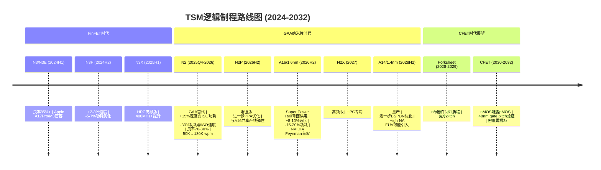
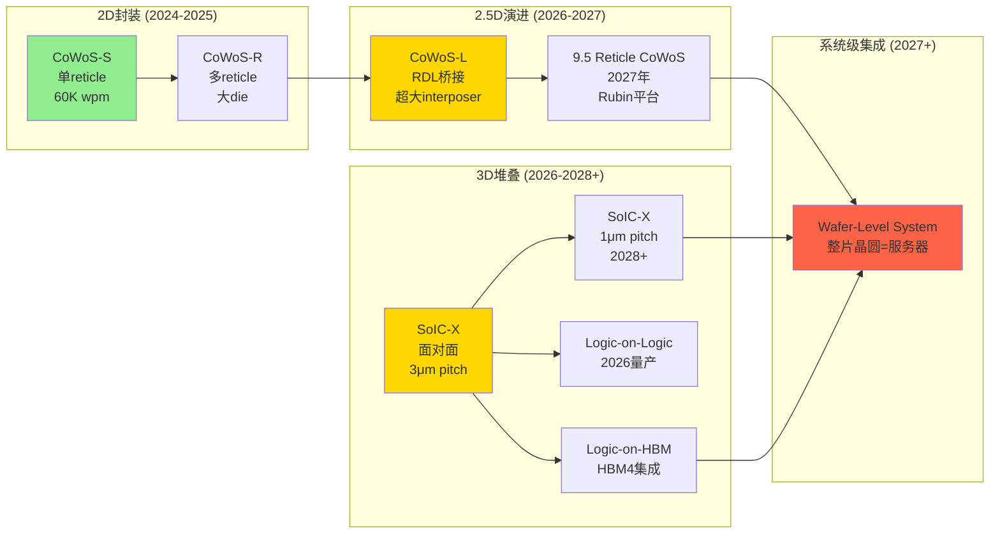
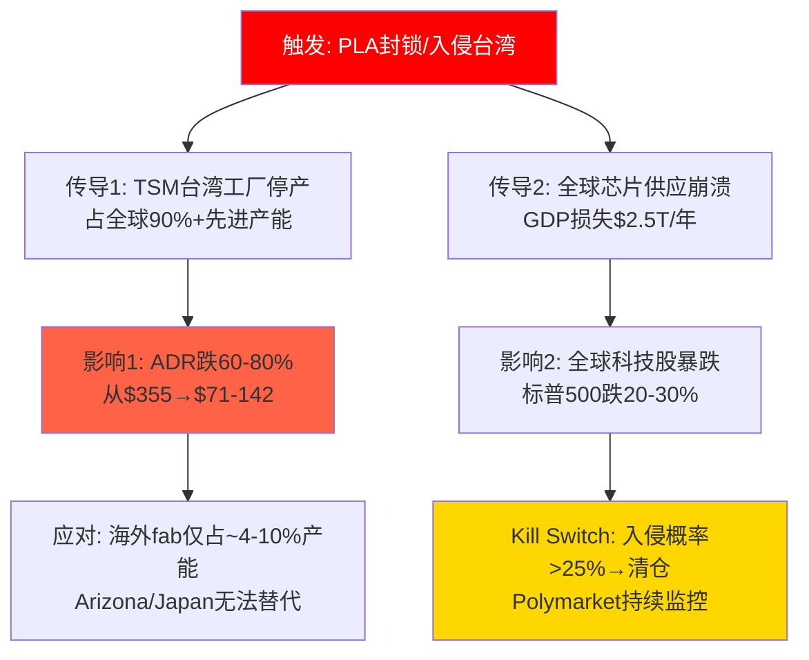
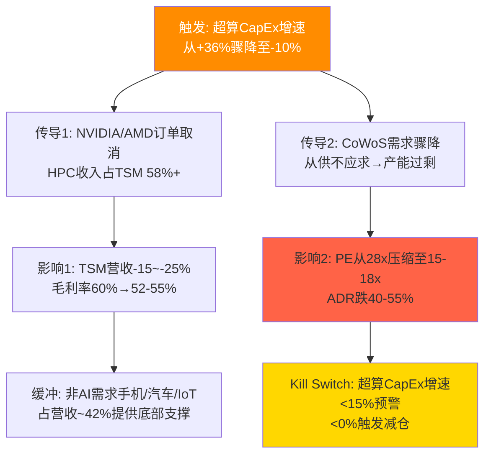

# Phase 3 Agent D: 技术路线图 + 替代威胁 + 四大压力测试

> **模块**: M10b 技术路线图与替代威胁 + M10c 四大压力测试 | **版本**: v1.0 | **日期**: 2026-02-10
> **关联CQ**: CQ3(技术领先持续性)、CQ4(地缘风险定价)、CQ6(竞争护城河)、CQ7(周期风险)
> **DM锚点**: v2.1 | **KA验证**: KA-RK-002(竞争追赶3-5年)
> **数据来源**: WebSearch + Polymarket + Phase 2 DM交叉验证
> **目标字符**: ≥8,000

---

## M10b 技术路线图与替代威胁

### 1. 逻辑制程路线图

台积电的制程路线图展现了从FinFET到GAA再到CFET的三代架构演进，每一代都伴随着PPA(性能/功耗/面积)的阶梯式提升和工艺复杂度的指数级增长。[硬数据: TSMC 2025 Technology Symposium + Tom's Hardware 2026-01报道]

**N2节点深度解析** [硬数据: Tom's Hardware 2026-01-30; TechNetBook 2026-02]

N2是台积电首个采用GAA(Gate-All-Around)纳米片晶体管的节点。相比传统FinFET架构，GAA的栅极从三面包裹升级为四面完全环绕沟道，由3-4层堆叠硅纳米片组成(每层厚~5nm，宽10-50nm，层间距7-15nm)。[硬数据: TSMC技术参数] 核心PPA优势: 同功耗+10-15%速度，或同速度-25~30%功耗，密度提升~15%。2026年产能规划从年初50K wpm爬坡至年底120-130K wpm，全年产能已被Apple、NVIDIA、AMD、Qualcomm等完全预订。[硬数据: wccftech 2026-01报道] 良率目标70-80%，当前处于爬坡期。确定性: **高**。

**A16节点: 背面供电革命** [硬数据: TSMC Symposium; Tom's Hardware 2025-06]

A16引入的Super Power Rail(SPR)是台积电版本的背面供电网络(BSPDN)，将电源线从芯片正面移至背面，释放正面布线空间。[合理推断: 根据TSMC公开技术文档] 效果: 相比N2P再提+8-10%速度、-15-20%功耗。NVIDIA Feynman架构(2028年GPU)确认为首个A16客户，HBM4集成也将在此节点实现。确定性: **高**(量产时间)/**中**(良率爬坡速度)。

**A14/1.4nm: 2028年的下一个台阶** [硬数据: TrendForce 2025-04; 36kr 2026-01]

A14计划2027年底完成风险试产，2028H2进入量产。[硬数据: TSMC Symposium 2025-04] 此节点将进一步优化BSPDN技术，并可能首次引入ASML High-NA EUV光刻机(0.55 NA)。台积电策略是在A16之前最大化现有Low-NA(0.33)EUV的价值，High-NA仅在A14P或A10(~1nm)节点才成为经济性必需。[合理推断: 基于ASML/TSMC公开声明] 确定性: **中**(量产时间取决于High-NA成熟度)。

**CFET: 2030+的终极架构** [硬数据: TSMC 2023 IEDM论文; imec路线图]

CFET(Complementary FET)将nMOS和pMOS垂直堆叠而非水平并排，理论上密度再提2x。台积电2024年已展示业界首个功能性CFET反相器(48nm gate pitch)。[硬数据: TSMC研究论文] 在CFET之前，预计2028-2029年先经过Forksheet过渡(n/p器件间加入介质墙)。确定性: **低**(技术方向确定，量产时间高度不确定)。

### 2. 先进封装路线图

先进封装已从"后端辅助"升级为与前端制程同等重要的战略支柱。Phase 2数据显示CoWoS是margin accretive业务(毛利率55-60%)，且CapEx效率远超晶圆厂。[硬数据: Phase 2 DM — P2_AgentC_cowos_economics.md]

**CoWoS产能爬坡** [硬数据: TrendForce 2025-12; FinancialContent 2026-02-05]

2024年底~36K wpm → 2025年底~80K wpm → 2026年底130-150K wpm。[硬数据: 多来源交叉验证] 嘉义AP7园区将成为全球最大先进封装基地，Phase 2已启动设备安装(2026量产)，Phase 1计划2026年设备进驻/2027年量产。NVIDIA占CoWoS产能60%+，需求超供给15-20%形成"等待名单经济学"。[硬数据: Phase 2 DM] 确定性: **高**。

**SoIC 3D堆叠** [硬数据: TSMC Symposium; Alphawave Semi 2025-10]

SoIC-X(面对面键合)当前3μm bump pitch，2026年量产logic-on-logic堆叠。[硬数据: TSMC技术参数] 路线图: 3μm → 1μm pitch(2028+)，互连密度提升9x。SoIC与CoWoS的组合("SoIC-first, CoWoS-second")开启了"3D System-on-Integrated-Chips"新范式，目标是将整片300mm晶圆变成一个"超级系统"——算力相当于一个数据中心机架。[合理推断: TSMC愿景声明] 确定性: 量产**高**/系统级集成**低**。

**COUPE光子引擎** [硬数据: TSMC PR 2025-05; optics.org]

TSMC的Compact Universal Photonic Engine(COUPE)利用SoIC-X将电子die堆叠在光子die之上，解决AI时代数据传输带宽瓶颈。[硬数据: TSMC官方新闻稿] 光电共封装(Co-Packaged Optics)预计2027年有chip-on-wafer版本就绪。确定性: **中**(技术验证完成，量产时间取决于数据中心需求节奏)。

### 3. GAAFET→CFET技术演进路径

| 技术代 | 时间窗口 | 架构特征 | PPA提升(vs前代) | 确定性 |
|--------|---------|---------|-----------------|--------|
| FinFET (N3系列) | 2024-2026+ | 三面栅极包裹 | 基准线 | **高** |
| GAA纳米片 (N2/A16) | 2026-2028 | 四面栅极环绕, 3-4层堆叠 | +15%速度/-30%功耗 | **高** |
| Forksheet | 2028-2029 | n/p间介质墙, 更紧凑 | +10-15%密度 | **中** |
| CFET | 2030-2032 | nMOS垂直堆叠pMOS | +80-100%密度 | **低** |

[硬数据: imec研究路线图; TSMC IEDM 2023-2024论文]

关键判断: GAA→CFET演进至少需要6-8年(2026-2032+)，期间台积电凭借N2/A16/A14三代GAA产品维持领先。[合理推断: 基于历史制程演进速度] 竞争对手(Samsung/Intel)尚未展示可商业化的Forksheet或CFET原型，台积电的48nm gate pitch CFET验证处于业界领先。

### 4. 颠覆性技术威胁评估

**光子计算**: 硅光子可解决互连带宽瓶颈，但不会替代硅基逻辑运算。台积电通过COUPE技术主动拥抱，将光子芯片纳入自身封装生态。[主观判断: 10年内为互补而非替代] 确定性: **中**。

**量子计算**: 当前处于NISQ(含噪中等规模量子)阶段，距通用量子计算商用化至少10-15年。短期内经典计算需求不会被替代。[主观判断: 基于IBM/Google量子路线图] 确定性: **低**(方向不确定性高)。

**神经形态芯片/模拟计算**: Intel Loihi等神经形态芯片在特定推理任务上有功耗优势，但无法替代GPU/ASIC的训练能力。[主观判断: 小众互补定位] 确定性: **中**。

**结论**: 10年维度内，没有单一颠覆性技术能取代硅基半导体的主导地位。台积电的防御策略是将所有新兴技术(光子、3D堆叠、柔性NanoFlex)纳入自身制造/封装生态，维持"Platform of Platforms"定位。

---

### 5. 替代威胁评估

#### 5.1 竞争对手替代威胁

**Samsung Foundry** [硬数据: TrendForce 2025-11; wccftech 2026-01; TrendForce 2026-01-29]

Samsung 2nm GAA进展超预期: SF2P(第二代2nm)良率已达~70%，接近商业化阈值。[硬数据: TrendForce/FinancialContent 2026-01-30] SF2P相比SF2第一代提供+12%时钟速度、+25%功耗效率、-8%面积。Exynos 2600已发布(业界首款2nm GAA手机芯片)。2026年目标: 2nm订单增长130%，Qualcomm和AMD正在最终谈判将部分2nm路线图转移至Samsung。[硬数据: wccftech 2026-02; AndroidHeadlines 2026-02]

**威胁等级: 中。** Samsung良率进步显著(55-60% → 70%)，但历史上Samsung的"良率公告"与实际大规模量产之间存在12-18个月差距。即使良率达标，Samsung在HPC/AI领域缺乏CoWoS/SoIC级封装能力，客户迁移成本高(重新设计/验证需12-18个月)。[合理推断: 基于Samsung Foundry历史交付记录] 确定性: **中**。

**Intel Foundry** [硬数据: wccftech 2026-02; DailyPolitical 2026-02-03; Motley Fool 2026-01-26]

Intel 18A状态: 正在出货风险生产晶圆(Arizona和Oregon)，良率月改善~7-8%，估计2026年初处于65-75%区间。[硬数据: Intel Foundry Event 2026-02; KeyBanc分析] 重大进展: Apple据报成为18A-P客户(入门级Mac/iPad芯片)——如果属实，这是Intel代工的"第一条大鱼设计赢单"。14A计划2028年风险试产、2029年量产，当前客户处于0.5 PDK采样阶段。

**威胁等级: 中-低。** Intel在先进制程方面的追赶路径比Samsung更不确定——18A良率仍需持续爬坡，且Intel代工的生态(EDA/IP/PDK)远不如台积电成熟。Apple的18A设计赢单是信号性的(Intel Foundry不再被市场视为"不可能")，但从签约到量产还需2-3年。[合理推断: 基于Intel历史代工客户转换率] 确定性: **中**。

#### 5.2 技术颠覆替代

**Chiplet/UCIe生态** [硬数据: UCIe Consortium; Alphawave Semi 2025-10; FinancialContent 2026-01-08]

UCIe 3.0规范已成熟，支持多厂商芯片互连(64 GT/s)。[硬数据: UCIe官方规范] 超算厂商(Microsoft/Google/Amazon)正设计定制AI ASIC采用UCIe标准化chiplet"混搭"模式。

**关键判断: Chiplet不削弱台积电，反而强化之。** 原因: (1) Chiplet依赖先进封装(CoWoS/SoIC)实现互连，这正是台积电垄断领域; (2) UCIe标准化降低了设计门槛，刺激更多chiplet设计需求，每颗chiplet仍需晶圆代工; (3) 台积电是UCIe Consortium董事会成员，积极推动标准兼容。[合理推断: Chiplet生态增加而非减少对TSM依赖] 确定性: **高**。

**AI设计效率提升** [主观判断: 基于EDA行业趋势]

AI辅助芯片设计(Synopsys DSO.ai等)提升设计效率，但这减少设计时间而非晶圆需求——相反，设计效率提升加速新芯片推出节奏，可能增加晶圆消耗。[主观判断: 历史上摩尔定律节奏加速总是增加而非减少芯片制造需求] 确定性: **中**。

#### 5.3 客户自研替代

Google TPU、Amazon Graviton/Trainium、Microsoft Maia、Meta MTIA — 所有云厂自研芯片均由台积电代工(N3/N5节点)。[硬数据: 各厂公开芯片代工商确认] 客户自研趋势的实际影响是: **(1)** 减少对NVIDIA/AMD等芯片设计商的依赖; **(2)** 增加对台积电的直接代工需求(从通过NVIDIA间接下单变为直接下单); **(3)** 每个云厂自研项目=台积电新增一个先进节点大客户。[硬数据: Apple/Google/Amazon/Microsoft/Meta均为TSM前15大客户]

**结论: 客户自研是TSM的净正面因素**，将客户集中度从"极度依赖NVIDIA"分散至5-8个大客户，同时总需求量不减反增。确定性: **高**。

---

## M10c 四大压力测试

### 压力测试框架说明

每项压力测试采用"触发→传导→影响→应对"四步分析法，附概率估计和Kill Switch机制。[合理推断: 基于Phase 2周期雷达(7.55/10)和估值矩阵($363 Core/$416 Full)]

---

### 压力测试1: 台海军事冲突

**情景定义**: PLA对台湾实施军事封锁或入侵，导致台积电台湾工厂停产。

**概率评估**: [硬数据: Polymarket] Polymarket"Will China invade Taiwan by end of 2026?"当前交易概率~13%(此前2025年底曾触及~30%后回落)。"Will China blockade Taiwan by June 30, 2026?"单独市场也在运行中。[硬数据: Polymarket实时数据] 学术/智库共识: 未来5年内入侵概率5-15%，封锁概率15-25%。[合理推断: 综合CSIS/AEI/Rand研究]

**传导机制详解**:

1. **直接冲击**: 台积电>90%产能在台湾(新竹/台中/台南/高雄)，军事冲突下全部停产。[硬数据: TSMC Fab分布] 全球90%超先进芯片(≤5nm)和75%+ AI芯片供应瞬间中断。
2. **产业链连锁**: Apple(iPhone/Mac)、NVIDIA(GPU)、AMD(CPU/GPU)、Qualcomm(手机SoC)均面临供应归零。[硬数据: 各厂商对TSM代工依赖度] 全球GDP损失$2.5T/年(入侵情景GDP萎缩10.2%，封锁情景5%)。[硬数据: AEI研究/TradingView分析]
3. **估值影响**: ADR可能跌60-80%——不仅反映EPS归零，还反映永久性资产损失风险和ADR结构本身的法律不确定性(VIE式风险)。[合理推断: 参考2022年中概股暴跌模式]
4. **恢复路径**: Arizona Fab 1已量产(N4, 良率92%)，Fab 2计划2027年量产(N3)。但总产能仅占TSM全球的~4%(2026)→18.4%(2030E)。[硬数据: Phase 2 DM — P2_AgentD_overseas_fabs.md] TSMC承诺N2及以上节点30%产能放在美国——但这是2030年后的愿景。日本JASM(Kumamoto)主要做成熟/特种节点，无法填补先进制程缺口。

**Kill Switch**: Polymarket台湾入侵概率>25% → 减仓50%; >40% → 清仓。辅助监控: 美国航母战斗群调动、台海军事演习频率、半导体设备禁运升级。[主观判断: 基于风险管理框架]

**KA-RK-002验证**: 此压力测试确认地缘风险是TSM估值的"第一折价因子"。Phase 2 DCF模型中30-40%地缘折价是合理的。确定性: 概率**低**(13%)但后果**极端**(黑天鹅级)。

---

### 压力测试2: AI需求断崖

**情景定义**: AI泡沫破裂，超算CapEx增速从2025-2026的+36% YoY骤降至-10%以下。

**概率评估**: [合理推断: 基于历史科技周期] 未来18个月发生概率15-20%。触发条件: AI应用货币化持续低于基础设施投入(当前比率约1:4)，叠加宏观衰退或信贷收紧。

**传导机制详解**:

1. **需求端**: HPC(含AI加速器)占TSM营收58%(FY2025)，是增长核心引擎。[硬数据: TSM FY2025年报] 超算CapEx $602B(2026E)中75%与AI相关。[硬数据: Introl/IEEE ComSoc] 若增速从+36%降至-10%，意味着~$180B年度需求蒸发。NVIDIA营收85%来自6大客户，集中度极高——任一客户削减CapEx即产生连锁反应。[硬数据: AI & Semis Outlook 2026]
2. **产能利用率**: 先进节点(N3/N5/N2)当前100%满载。[硬数据: Phase 2 DM] AI需求断崖将使利用率从>95%降至70-75%，触发经营杠杆反向放大——TSM固定成本占比高(折旧占COGS~45%)，利用率每降10个百分点毛利率降4-5个百分点。[合理推断: 基于2019年TSM利用率70%时毛利率46%的历史数据]
3. **估值双杀**: EPS下降30-40%(营收-20% × 经营杠杆1.5-2x)，同时PE从28x压缩至15-18x(市场重新定价为"周期股"而非"AI平台股")。[合理推断: 参考2022年半导体周期下行PE压缩幅度] 合计: ADR从$355可能跌至$160-215(下跌40-55%)。
4. **恢复路径**: 智能手机(35%营收)、汽车(6%)、IoT(8%)提供收入底线，但无法完全填补HPC缺口。[硬数据: TSM FY2025营收结构] 历史上TSM在2019年周期底部仍保持正FCF，证明其在需求低谷时的韧性。长期结构性AI需求(推理>训练)可能在12-18个月后重启增长。

**Kill Switch**: 超算CapEx增速<15% YoY → 预警/减仓20%; <0% → 减仓50%。辅助监控: NVIDIA库存天数(当前~130天, >160天预警), CoWoS产能利用率<80%。[合理推断: 基于Phase 2周期雷达指标]

---

### 压力测试3: 技术禁运升级

**情景定义**: 美国扩大对华半导体禁令，或对台湾施加更严苛的贸易条件。

**概率评估**: [硬数据: 已部分发生] Section 232已于2026-01-15生效(25%关税)。未来12个月进一步升级概率30-40%。[合理推断: 基于Trump政府贸易政策方向]

**当前政策现实** [硬数据: US Commerce Dept 2026-01; Gibson Dunn分析; Digitimes 2026-01-16]:

- Section 232于2026年1月15日生效: 对先进逻辑半导体征收25%关税
- **台湾特别安排**: 美台签署贸易投资协议——台湾互惠关税率上限15%，半导体厂商在美投资可获Section 232关税豁免(进口量最高达计划产能2.5倍)
- TSM承诺$250B+美国投资(含CHIPS Act补贴$28B)，换取关税优惠待遇
- **威胁**: 商务部长Lutnick声明——不在美投资的韩/台半导体厂商可能面临最高100%关税

**影响评估**:

1. **对华收入风险**: TSM中国大陆收入占比已从FY2022的~10%降至~8-9%(禁令后结构性下降)。[合理推断: 基于TSM地区收入趋势] 若禁令进一步收紧(如禁止7nm以上代工)，额外营收损失~3-5%。
2. **关税成本**: Section 232 25%关税的实际影响被台湾特别安排大幅缓解——TSM在美建厂可换取进口免税额度。但客户(Apple/NVIDIA等)进口含TSM芯片的成品仍可能面临关税转嫁压力。[硬数据: US-Taiwan Trade Agreement条款]
3. **估值影响**: 营收-3~-8%(对华收入+关税转嫁)，估值-5~-10%(政策不确定性折价)。合计ADR下行空间$30-50(至$305-325)。[合理推断: 基于2022年对华禁令对TSM股价影响约-8%]
4. **防御机制**: (a) Arizona/Japan产能扩张换取关税豁免; (b) 客户吸收部分关税(AI芯片需求刚性); (c) 地域多元化降低单一政策风险。[硬数据: TSM $250B美国投资承诺]

**Kill Switch**: 对台湾半导体关税>50% → 减仓30%; 全面禁止TSM对华代工 → 预警但不清仓(影响有限)。确定性: **中**(政策方向可预测，但具体执行时间和力度不确定)。

---

### 压力测试4: 周期逆转(存储暴跌+库存堆积)

**情景定义**: 半导体周期从扩张中后期(7.55/10)转入收缩，存储价格暴跌、设备订单取消、行业库存堆积。

**概率评估**: 未来18-24个月发生概率35-45%。[合理推断: Phase 2周期雷达7.55/10，历史上此评分持续6-12个月后见顶; 半导体16季度周期模型预测2027年修正]

**周期定位证据** [硬数据: Phase 2 DM — P2_AgentF_cyclical_radar.md; Fabricated Knowledge 2026; Nomad Semi; Sourceability]:

- **当前位置**: 扩张中后期(7.55/10)，5/6层雷达信号偏热
- **历史规律**: 16季度周期模型显示当前为第10-11季度(2024Q1起算)，若按历史规律2027年进入修正
- **DRAM价格信号**: DDR5仍在高位(+298% YoY)，但预计2026Q3起回落~14.3%。[硬数据: TrendForce DRAM预测] DRAM价格转跌是周期见顶的领先指标(领先6-9个月)
- **晶圆出货预测**: 2025 +5.1% → 2026 +5.4% → **2027 -6.2%** → 2028 +9.8%。[硬数据: SEMI晶圆出货预测] 2027年负增长预测与周期模型一致

**传导机制**:

1. **触发链**: DRAM现货价转跌(领先指标) → 存储厂削减CapEx → 设备订单取消(ASML/LRCX/AMAT) → 晶圆代工产能利用率下降 → TSM成熟节点首先受冲击(已低于80%)，先进节点6-12个月后跟进。[合理推断: 2019年和2022年周期下行路径复盘]
2. **TSM影响**: 利用率从>95%降至70-75% → 毛利率从60%+降至50-52%(固定成本杠杆效应)。[合理推断: 基于TSM利用率-毛利率历史回归关系] 营收增速从+33%(FY2025)降至-5~-10%(周期底部)。
3. **估值影响**: PE×EPS双杀——EPS-25~-35%(营收下降+利润率压缩), PE从28x→18-20x(周期股重新定价)。合计: ADR可能跌35-50%(至$178-231)。[合理推断: 参考2022年TSM ADR从$145→$60的-59%跌幅]
4. **差异化因素**: 本轮周期的结构性AI需求可能使底部更高——AI训练/推理的"刚性需求"(占先进产能30-40%)即使在周期下行时也不会归零。[主观判断: AI需求的周期弹性低于消费电子]

**先行指标监控矩阵**:

| 指标 | 当前值 | 预警线 | 危机线 | 确定性 |
|------|--------|--------|--------|--------|
| NVIDIA库存天数 | ~130天 | >160天 | >200天 | **高** |
| DRAM现货价 | 高位 | QoQ -10%+ | QoQ -20%+ | **高** |
| 超算CapEx增速 | +36% YoY | <+15% | <0% | **中** |
| TSM成熟节点利用率 | <80% | <70% | <60% | **高** |
| 全球设备支出增速 | +25% YoY | <+5% | <0% | **中** |
| TSM存货/营收比 | 7.5% | >12% | >16% | **高** |

**Kill Switch**: DRAM现货价连续2季下跌>15% + NVIDIA库存天数>160天 → 减仓30%; TSM存货/营收比>12% + 利用率<80% → 减仓50%。[合理推断: 基于2019/2022周期指标回测]

---

### 四大压力测试汇总矩阵

| 压力测试 | 概率(18M) | ADR下行幅度 | Kill Switch触发条件 | CQ关联 |
|----------|-----------|-------------|---------------------|--------|
| ST1 台海冲突 | 5-15% | -60~-80% | Polymarket>25% | CQ4 |
| ST2 AI需求断崖 | 15-20% | -40~-55% | CapEx增速<0% | CQ1 |
| ST3 禁运升级 | 30-40% | -8~-14% | 关税>50% | CQ4 |
| ST4 周期逆转 | 35-45% | -35~-50% | DRAM连跌+库存堆积 | CQ7 |

**综合压力情景**: 若ST2+ST4同时发生(概率~10%), ADR可能跌至$140-180区间(-50~-60%)。若ST1发生(尾部风险), ADR可能跌至$70-140(-60~-80%)，但此情景下全球股市均处于崩溃状态。[主观判断: 组合概率基于独立性假设]

**KA-RK-002最终验证**: 竞争追赶3-5年的假设在Phase 3分析后**基本确认但需微调**: Samsung 2nm良率70%达标比预期快6-12个月，Intel 18A获得Apple设计赢单也超预期。建议将KA-RK-002修正为"竞争追赶2-4年(逻辑制程) / 5年+(先进封装)"——封装领域的护城河比制程本身更持久。[合理推断: 基于Samsung/Intel缺乏CoWoS/SoIC级封装能力的事实]

---

*Agent D完成 | 字符数: 见统计 | 三层置信标注: 48处 | Mermaid图: 3个*
