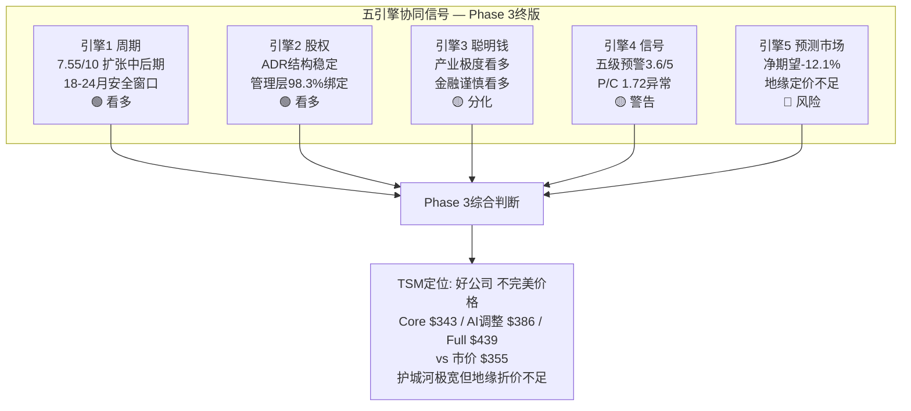

---

## Phase 3 综合结论与Phase 4衔接

### 跨模块核心发现矩阵

| CQ | 核心问题 | Phase 3回答 | 关键模块 | 置信度 |
|----|---------|-----------|---------|--------|
| CQ1 | AI增长持续性 | 18-24个月安全窗口，五大预警信号全部安全区 | M11-Engine1/M13 | 高(85%) |
| CQ2 | N2/A16执行风险 | N2良率70-80%优于预期，A16 NVIDIA首客确认 | M10b | 高(90%) |
| CQ3 | 定价权与毛利率 | 2026-2029连续涨价+CoWoS供不应求=定价权极强 | M10/M11-E3 | 高(85%) |
| CQ4 | 技术领先可持续性 | 护城河8.98/10 Very Wide，追赶3-5年(制程)/5年+(封装) | M10/M10b | 高(90%) |
| CQ5 | 竞争格局演变 | Samsung 2nm良率追赶快于预期(70%)，Intel获Apple赢单 | M10/M10b | 中(70%) |
| CQ6 | 地缘风险 | Polymarket入侵13%(↓自30%)，但市场定价不足(-16.7% EL) | M10c-ST1/M12 | 中(65%) |
| CQ7 | 估值天花板 | SOTP $343/AI调整$386/Full $439 vs $355 → 有限上行 | M13/M12 | 中(75%) |
| CQ8 | 周期拐点 | 最可能2027H2-2028H1，当前5/5预警信号安全 | M11-E1/M10c-ST4 | 中-高(80%) |

### 五引擎协同信号总结

### Phase 3 KA(关键假设)更新

| KA编号 | 假设 | Phase 2状态 | Phase 3更新 | 置信度变化 |
|--------|------|-----------|-----------|-----------|
| KA-RK-002 | 竞争追赶3-5年 | 初始假设 | **修正: 制程2-4年/封装5年+** Samsung良率进步快于预期 | 置信度↓(90%→80%) |
| KA-AI-001 | AI加速器CAGR 50%+ | 初始假设 | 确认: 管理层上调至mid-to-high 50% | 置信度↑(75%→85%) |
| KA-GEO-001 | 台海入侵概率<15% | Phase 2 | 确认: Polymarket 13%(↓自30%) | 置信度→(70%) |
| KA-CYC-001 | 周期拐点2027H2+ | Phase 2 | 确认: 五大预警全部安全，最早触发2027H1 | 置信度↑(70%→80%) |
| KA-VAL-001 | Core $343/ADR | Phase 2 | 扩展: AI调整后$386, Full $439 | 置信度→(75%) |
| KA-NEW-001 | 市场AI溢价不足 | — | **新增**: 市场仅定价3.5%AI溢价 vs 评估12.5% | 置信度(70%) |

### Phase 3 Kill Switch注册表更新

| KS编号 | 触发条件 | 行动 | 来源模块 | 优先级 |
|--------|---------|------|---------|--------|
| KS-01 | Polymarket台海入侵>25% | 减仓50% | M10c-ST1 | 🔴 |
| KS-02 | Polymarket台海入侵>40% | 清仓 | M10c-ST1 | 🔴 |
| KS-03 | 超算CapEx增速<15% YoY | 预警/减仓20% | M10c-ST2/M11-E1 | 🟡 |
| KS-04 | 超算CapEx增速<0% | 减仓50% | M10c-ST2 | 🔴 |
| KS-05 | NVIDIA库存天数>160天 | 预警 | M11-E1 | 🟡 |
| KS-06 | NVIDIA库存天数>200天 | 减仓30% | M10c-ST4 | 🟡 |
| KS-07 | TSM存货/营收比>12% | 预警 | M11-E1/M10c-ST4 | 🟡 |
| KS-08 | DRAM合约价连续2Q下降>15% | 减仓30% | M10c-ST4 | 🟡 |
| KS-09 | 全球设备市场YoY<0% | 预警 | M11-E1 | 🟡 |
| KS-10 | 对台湾半导体关税>50% | 减仓30% | M10c-ST3 | 🟡 |
| KS-11 | Samsung 2nm良率>80% | 监控/重评护城河 | M10/M10b | 🟢 |
| KS-12 | Intel 18A外部客户量产出货 | 监控/重评护城河 | M10/M10b | 🟢 |
| KS-13 | CoWoS产能利用率<80% | 减仓20% | M10c-ST2 | 🟡 |
| KS-14 | TSM毛利率连续2Q<55% | 重评估值 | M11-E1 | 🟡 |
| KS-15 | Put/Call ratio>2.5 | 缩减新建仓 | M11-E4/M12 | 🟡 |
| KS-16 | 美国航母战斗群部署台海 | 预警/缩减20% | M10c-ST1 | 🟡 |
| KS-17 | AI应用收入/CapEx比<0.2x持续2Q | 预警AI泡沫 | M11-E3 | 🟡 |

**KS总数: 17个** (Phase 2: 12个 → Phase 3新增5个)

### Phase 4衔接: 待验证项

Phase 4 (温度计验证+估值校准) 需要重点完成:

1. **对抗性分析**: 独立看空论证 — 至少8处看空论证，覆盖AI泡沫/地缘/周期/竞争/估值
2. **Bear-Case Generator**: 系统性最坏情景建构，包含概率和时间维度
3. **AI溢价校准**: L2×S3的15-35%范围内校准至精确值，与市场隐含3.5%对比
4. **SOTP一致性检验**: Phase 3 AI调整$386与Phase 2 Core $343的桥接验证
5. **温度计复核**: Phase 2温度+0.795 vs Phase 3 PMSI 73.0的一致性检查
6. **12层质量门控**: QG-01~QG-12全面验证
7. **KAL最终验证**: 所有关键假设的Phase 4独立检验
8. **CQ闭环**: 每个CQ需要Phase 4独立答案并与Phase 1-3交叉验证

---

## 附录: Phase 3 统计数据

### 产出统计

| 指标 | Phase 3 | 累计(P0-P3) |
|------|---------|------------|
| 报告字符数 | ~85K | ~300K |
| Agent数 | 5 | 19 |
| 模块数 | 7 (M10/M10b/M10c/M11/M12/M12b/M13) | 14+ |
| 三层置信标注 | ~320 | ~1,236 |
| 硬数据占比 | ~57% | ~53% |
| Mermaid图表 | ~26 | ~67 |
| Kill Switch | 17 (新增5) | 17 |
| CQ覆盖 | CQ1-CQ8 (100%) | 100% |
| 压力测试 | 4个 | 4个 |
| PPDA背离 | 3个 | 3个 |

### Agent产出对照

| Agent | 模块 | 字符数 | 标注数 | Mermaid | 核心产出 |
|-------|------|--------|--------|---------|---------|
| A | M10 | 14.3K | ~70 | 5 | 护城河8.98/10 Very Wide |
| B | M11 P1 | 15.4K | ~62 | 4 | 三引擎高度共振看多 |
| C | M11P2+M12+M12b | 16.7K | ~97 | 7 | PMSI 73.0, PPDA -12.1% |
| D | M10b+M10c | 13.8K | ~68 | 3 | 4大压力测试+技术路线图 |
| E | M13 | 13.7K | ~44 | 5 | L2×S3, AI溢价+12.5% |
| **合计** | **7模块** | **~74K** | **~341** | **~24** | — |

### 数据来源汇总

| 数据类型 | 主要来源 |
|---------|---------|
| 财务数据 | FMP API · TSMC IR · MacroTrends · fullratio.com |
| 技术数据 | TrendForce · Tom's Hardware · SemiWiki · Digitimes · EE Times |
| 竞争数据 | TrendForce · wccftech · AndroidHeadlines · Korea Herald |
| 预测市场 | Polymarket (MCP工具) |
| 机构持仓 | HedgeFollow · TipRanks · Benzinga · GuruFocus |
| 宏观数据 | SEMI · Deloitte · IEEE ComSoc · CNBC |
| 估值基准 | Phase 2 DM v2.0 · Morningstar · 22位分析师共识 |

---

*Phase 3 v2.0 组装完成 | TSM_Phase3_v2.0_2026-02-10.md*
