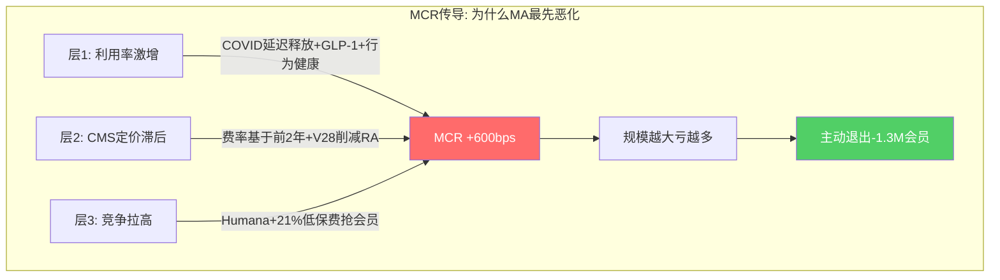
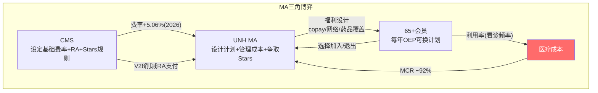

# Chapter 4: UnitedHealthcare三子板块经济学

> **CQ2**: UHC三个子板块各自创造什么价值？哪些决定收入，哪些决定利润，哪些决定护城河？
> UHC = UNH的"收入引擎"($344.9B/年)但也是"MCR风险集中器"

## 4.1 三子板块全景

UnitedHealthcare包含三个在经济本质上截然不同的子业务：

| 子板块 | FY2025收入 | 会员数 | 核心客户 | 经济本质 |
|--------|-----------|--------|---------|---------|
| Medicare & Retirement (M&R) | $171.3B (+23%) | 9.4M MA | 65+老年人 | 政府合同+精算赌博 |
| Employer & Individual (E&I) | $79.2B | ~28M | 企业HR+个人 | 行政服务+承保风险 |
| Community & State (C&S) | $94.4B (+17%) | ~8.5M Medicaid | 州政府 | 政策依附型服务 |
[DM-SEG-008: segment_data.md, UHC sub-segment revenue and membership]

三者收入合计$344.9B，但它们面对的客户、风险暴露、增长逻辑和利润质量完全不同。**把UHC当作一个整体分析会掩盖关键差异。**

## 4.2 Medicare & Retirement: 最关键也最脆弱的利润引擎

### 经济模型

M&R是UHC乃至整个UNH最重要的单一业务——$171.3B收入占UHC的50%、占UNH合并收入的38%。[DM-SEG-009: $171.3B/$447.6B=38.3%]

运作方式：CMS按人头向UNH支付固定费用（包含基础费率+风险调整+星级bonus），UNH承担会员的全部医疗费用。利润=保费-医疗成本-行政成本。

**收入驱动力分解**:
- **CMS费率**: 2026年+5.06%有效增长率 — 这是Trump行政部门CMS的慷慨政策，显著高于Biden时期 [DM-REG-001: CMS 2026 final rate +5.06%]
- **星级bonus**: UNH 77%会员在4+星计划 → 质量bonus约增加4-5%额外支付 [DM-REG-002]
- **风险调整(RA)**: CMS V28模型正在分阶段实施 → 减少RA支付（对UNH不利，因为Optum Health的"诊断编码优化"能力被削弱）
- **会员人数**: FY2025 MA +755K达到9.4M → 但2026年预计-1.3M至-1.4M（主动退出不赚钱市场）[DM-REG-003]

**利润压力分解**:
MA业务的MCR是全分部最高的——行业平均~90%(FY2024)，UNH可能更高。[DM-IND-002: business_scout.md, MA MLR ~90% industry]



为什么MA的MCR恶化最严重？三层因果：

```
层1(直接原因): 老年人医疗利用率在2024-2025年快速上升
  ├── COVID期间延迟的手术/检查在2023-2025年集中释放
  ├── GLP-1药物(Ozempic等)年费$12-15K/人, 老年人使用率高
  └── 行为健康服务利用率+20-30%

层2(制度原因): CMS定价机制的结构性滞后
  ├── CMS费率基于前2年FFS数据 → 2025的高利用率要到2027-2028才反映在费率中
  ├── V28风险调整模型减少了诊断编码的"上行空间"
  └── 星级评定标准趋严 → bonus harder to earn

层3(竞争原因): 激进入场者拉高行业MCR
  ├── Humana MA会员从5.8M增至7.0M(+21%) — 通过低保费吸引高风险人群
  ├── UNH被迫匹配竞争者的福利水平 → 收入不变但成本上升
  └── 新入MA的会员medical cost比预期高2x [DM-BIZ-009: business_scout.md]
```

**M&R的核心矛盾**: 收入增长被CMS费率驱动(+5-9%/年)，但成本增长被利用率+药价驱动(可能+7-10%/年)。**当成本增长>收入增长时，规模越大亏越多。** 这就是UNH主动减少1.3M MA会员的原因——不是不能增长，而是增长会恶化利润。

### 护城河评估

M&R的护城河来自三个层面：
1. **精算数据积累** — 30年MA运营经验+1.5亿人理赔数据库 → 风险定价精度领先同行 → 嵌入深度5.0/5 [DM-FW-001: framework_extraction.md, L4操作层5.0]
2. **星级评定管理能力** — 77%会员在4+星计划(行业最佳水平之一) → 质量bonus增收 → 嵌入深度4.5/5
3. **CMS关系+合规能力** — 运营数十年的CMS合规基础设施 → 新进入者需3-5年建立 → 嵌入深度4.0/5

**但护城河正在被侵蚀**: V28削弱了UNH的RA优化能力，Humana在MA市占率上正在追赶(可能在2026年底超过UNH成为最大MA保险商) [DM-COMP-002: business_scout.md, Humana MA 5.8M→7.0M]

## 4.3 Employer & Individual: 现金牛但低增长

### 经济模型

E&I为企业和个人提供健康保险计划，包含两种截然不同的模型：

- **ASO (Administrative Services Only)**: UNH只提供行政管理(理赔处理、网络接入、药品管理)，不承担医疗成本风险。收入=管理费($5-15/人/月)。几乎零MCR风险，纯现金流业务
- **Fully Insured**: UNH同时提供管理和承保，承担MCR风险。收入=保费，利润=保费-医疗成本-行政成本

**E&I的混合结构**: ~60%是ASO(低风险、低利润率但稳定)，~40%是fully insured(有MCR风险)。这使得E&I的整体MCR波动远小于M&R。行业商业保险MCR约85%，相对稳定。[DM-IND-003: business_scout.md, Commercial MLR ~85%]

**收入驱动力**: 保费提价(通常年+5-7%) + 企业员工数量(与就业市场正相关) + 产品组合(从fully insured向ASO迁移的趋势)

### 价值判断

E&I是UNH的"现金牛"——收入增长慢(~5%/年)但利润稳定，MCR波动小，不依赖政府政策。在M&R和C&S都面临压力的2025年，E&I是最稳定的板块。

**但E&I不是增长引擎**: 大型雇主保险市场接近饱和，UNH已是最大玩家。增量来自中小企业和ACA交易所，但这些市场竞争激烈且利润更薄。

## 4.4 Community & State: 政策依附型收入

### 经济模型

C&S为州政府运营Medicaid管理式护理计划——州政府按人头付费，UNH管理受益人的医疗服务。

FY2025收入$94.4B(+17%)——收入增长强劲是因为Medicaid扩展+新合同。但有两个结构性问题：

**问题1: Medicaid redetermination冲击**
- 2023-2024年COVID时期的"持续覆盖"政策到期 → 15M+人重新审核Medicaid资格
- 结果: 最健康(=最便宜)的人被剔除出Medicaid，留下的人群更病(=MCR更高)
- 行业Medicaid MCR飙升至91%(十年最高) [DM-IND-004: business_scout.md, Medicaid MLR ~91%]

**问题2: 州级合同脆弱性**
- UNH在2025年失去了路易斯安那州Medicaid合同(330K会员，因PBM定价争议) [DM-REG-012: regulatory_scout.md, Louisiana contract loss]
- 2026年预计Medicaid会员减少565K-715K [DM-REG-013: regulatory_scout.md]
- 州级招投标是政治+价格博弈——护城河比M&R和E&I都弱

**C&S的价值判断**: 规模大($94.4B)但利润质量差(MCR~91%+, OPM可能<2%)。收入增长是政策驱动而非竞争优势驱动。在Medicaid redetermination完成后(2025-2026)，留下的人群MCR可能稳定但不会显著改善。

## 4.5 UHC三子板块的投资含义

### 利润贡献重构

UHC合计adj营业利润约$10.5B，但分布极不均匀：

| 子板块 | 收入($B) | 估计adj OE($B) | 估计OPM | 利润占比 |
|--------|---------|---------------|---------|---------|
| M&R | $171.3 | $4.0-5.0 | 2.3-2.9% | ~40-45% |
| E&I | $79.2 | $4.5-5.0 | 5.7-6.3% | ~43-48% |
| C&S | $94.4 | $0.5-1.5 | 0.5-1.6% | ~5-14% |
| **合计** | **$344.9** | **$10.5** | **3.0%** | **100%** |
[DM-SEG-010: 基于行业OPM水平推算, 因UNH不披露子分部利润]

**关键发现**: E&I贡献的利润可能接近或超过M&R，尽管收入只有M&R的一半。因为E&I的MCR更低(85% vs 90%+)且ASO业务几乎零MCR风险。**市场过度关注M&R(因为MCR headline)而忽视了E&I才是UHC真正的利润支柱。**

### 风险分层

| 子板块 | MCR敏感度 | 监管暴露 | 增长前景 | 综合风险 |
|--------|---------|---------|---------|---------|
| M&R | 极高 | 极高(CMS) | 收缩中 | ★★★★★ |
| E&I | 中 | 低 | 稳定偏慢 | ★★☆☆☆ |
| C&S | 高 | 高(州级) | 不确定 | ★★★★☆ |

**投资者应该关注什么？** 市场在定价M&R的MCR恶化，但E&I的稳定性和C&S的redetermination后稳定化尚未被充分计入。如果M&R通过退出不赚钱市场在2026-2027年将MCR从~90%降至87-88%，UHC的整体利润可能从$10.5B恢复至$13-14B——即使没有行业性MCR改善。

## 4.6 Medicare Advantage深潜: UNH最关键的50%收入

MA业务值得单独深入分析——它占UHC收入的50%($171.3B)，是MCR恶化的重灾区，也是CMS政策影响最直接的板块。

### MA的"三角博弈": CMS-UNH-会员



### CMS V28风险调整: 静悄悄的利润侵蚀

CMS从2024年开始分阶段实施新的风险调整模型(V28)，预计到2028年完全过渡。V28的影响:

1. **减少"诊断编码优化"的上行空间**: 旧模型下，Optum Health/Insight可以通过更详细的诊断编码增加UNH的RA收入(合法但有灰色地带)。V28收窄了编码的价值差异→UNH的RA优势被削弱
2. **降低高acuity患者的超额支付**: V28更好地标准化了风险调整→UNH从高acuity会员获得的超额RA支付减少
3. **分阶段影响**: 2024(+33% V28)→2025(+67%)→2026+(100%) → 每年约-1~-2%的MA收入损失 [DM-REG-018: CMS V28 phase-in schedule]

**量化**: V28全面实施后对UNH MA收入的影响约-$3~-5B/年(基于$171.3B MA收入的-2~-3%)。这等于额外+100~-150bps的MCR压力。

### Star Ratings: 质量竞赛中的赢家

UNH在Stars评级上表现优于行业——77%会员在4+星计划(行业平均约60%)。[DM-REG-002]

Stars的经济影响:
- 4+星计划获得5%的quality bonus(基于基础费率)
- UNH MA收入$171.3B × 77%在4+星 × 5% bonus = **约$6.6B额外收入** [DM-REG-019: 计算值]
- 如果Stars从77%降至行业平均60% → 损失约$1.4B/年
- 2025年联邦法官裁定CMS需重新计算UNH的部分Stars评级(有利) [DM-REG-002]

**Stars是UNH在MA领域最重要的竞争优势之一** — 它提供$6.6B的额外收入而竞争对手(特别是HUM，Stars近期下降)无法匹配。这也解释了为什么UNH的MA MCR(~92%)虽然高，但包含了quality bonus后的净回报仍可能接近盈亏平衡。

### MA会员退出策略的深层逻辑

UNH 2026年预计退出-1.3M MA会员。这不是竞争失败——是精算优化:

**退出的计划特征**:
- 位于109个县(高成本、低provider密度的农村/偏远地区)
- 这些地区的MCR可能>95%(每承保一个会员亏损)
- 退出后剩余9.4M→~8.0M会员的平均MCR应改善2-3pp [DM-REG-020: 管理层commentary推算]

**但退出有副作用**:
1. 固定成本(IT/行政/Stars管理)不能按比例减少 → 人均行政成本上升
2. 会员减少→数据减少→Optum的精算模型精度可能略降
3. CMS/国会可能批评"遗弃老年人" → 政治风险
4. 竞争对手(特别是Humana)可以进入这些市场→长期份额损失

## 4.7 E&I的隐藏价值: ASO现金牛

E&I的$79.2B收入中，约60%是ASO(行政服务)、40%是fully insured。[DM-SEG-021: 行业标准比例估算]

**ASO经济学**:
- 收入: 管理费$5-15/会员/月 → ~$12B/年(估) [DM-BIZ-014]
- 成本: 主要是行政人员+IT系统 → OPM >15%
- 利润: ~$1.8-2.5B(估)
- 特征: **零MCR风险** — UNH不承担医疗成本，只收管理费
- 增长: 低但极稳(大型雇主续约率>95%)

**ASO是UNH最被忽视的利润池**。它不受MCR波动影响，不受CMS政策影响，不受PBM监管影响——是纯粹的、高质量的、经常性的管理费收入。在P/E重估的讨论中，ASO部分应该获得类似ADP/Paychex的估值(18-22x P/E)而非保险估值(12-15x)。

### E&I的真实OPM重构

| E&I子类 | 收入(估$B) | OPM(估) | 利润(估$B) |
|---------|---------|---------|-----------|
| ASO(管理费) | $12 | 15-18% | $1.8-2.2 |
| Fully Insured(承保) | $67 | 3-4% | $2.0-2.7 |
| **E&I合计** | **$79** | **4.8-6.2%** | **$3.8-4.9** |
[DM-SEG-022: 基于行业ASO OPM标准推算]

**E&I的真实OPM(4.8-6.2%)远高于UHC整体(3.0%)** — 因为ASO拉高了平均。这进一步证明E&I是UHC中最有价值的部分，而不是MCR最高的M&R。

## 4.8 C&S(Medicaid)的政治经济学

C&S($94.4B)是UNH最"政治化"的业务:

### Medicaid Redetermination的深层影响

2023-2024年COVID持续覆盖结束后，15M+人重新审核资格:
- 最健康/收入最高的人被移出Medicaid(他们现在获得雇主保险或ACA交易所保险)
- 留下的人群更病、收入更低、利用率更高
- **这是一个永久性的"逆选择"事件** — redetermination前后的Medicaid人群MCR差异可能>5pp
- UNH Medicaid MCR从~88%(2022)→~91%+(2025) 部分来自这个人群劣化 [DM-IND-010]

### 州级合同的不确定性

UNH的Medicaid合同分布在约30个州。每个州是独立的招投标:

| 维度 | 对UNH的影响 |
|------|-----------|
| 合同期限 | 通常3-5年，到期重新竞标 |
| 定价 | 州政府设定保费(capitation rate)，UNH承担MCR风险 |
| 政治因素 | 州长/立法机构可能偏好本地保险商 |
| 集中度风险 | 路易斯安那州已失(330K会员) [DM-REG-012] |
| 2026E退出 | -565K~-715K Medicaid会员(主动+被动) [DM-REG-013] |

**C&S的价值判断**: 收入很大($94.4B)但利润极薄(OPM可能<2%)、政策依赖度高、人群MCR在结构性恶化。在6个REU中，C&S是"性价比最差"的——收入贡献大但利润贡献小、风险贡献大。如果UNH进一步收缩C&S(退出更多州)，集团OPM会改善但收入会下降。
