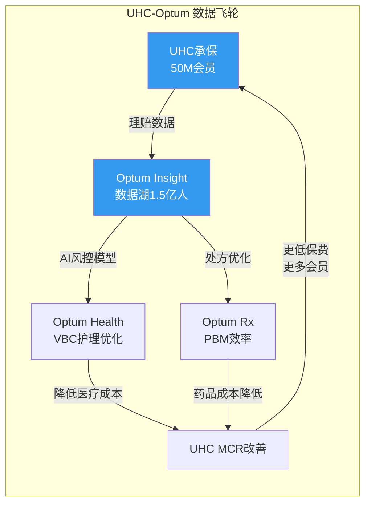

# Chapter 5: Optum三线经济学

> **CQ2续**: Optum的三条业务线各自创造什么价值？哪些是真正的差异化引擎，哪些是复杂度来源？
> Optum = UNH的"估值溢价来源"，但FY2025 GAAP合计利润从$16.7B跌至$9.5B(-43%)

## 5.1 Optum的特殊地位

在讨论Optum之前，必须先理解一个关键结构：**Optum的收入中约63%来自UHC内部转移(~$173B消除 vs $276B总收入)**。[DM-SEG-007: 分部收入合计$621B - 合并$447.6B = $173.4B消除; Optum内部占比=($173B×Optum收入权重)/$276B≈63%]

这意味着Optum不是一个独立的市场参与者，而是UNH集团内部的"服务中心"。评估Optum的真实价值需要回答：如果UHC不是它的客户，Optum的外部收入($108B)能否独立支撑其估值？


> 飞轮逻辑自洽，但FY2025的现实是：Optum Health亏损$278M(GAAP)→飞轮C环节失效→MCR未改善。飞轮是概念还是现实？CQ4将验证。

## 5.2 Optum Health: 最大的问号

### 经济模型

Optum Health拥有美国最大的医生雇佣/联盟网络(~90,000名医生)和~4.7M value-based care(VBC)患者。[DM-BIZ-006]

VBC模型的核心逻辑：Optum Health按人头获得固定费用，承担患者的医疗成本。如果Optum的医疗管理能力优于行业平均，actual cost < capitation payment → 利润。本质上，Optum Health是一个"医疗成本的空头头寸"。

**FY2025灾难**:
| 指标 | FY2023 | FY2024 | FY2025 | 趋势 |
|------|--------|--------|--------|------|
| 收入 | $94.7B | $105.4B | $102.0B | **首次下降(-3%)** |
| GAAP营业利润 | $6.6B | $7.8B | **-$278M** | **转亏** |
| Adj营业利润 | ~$5.1B | ~$4.2B | $2.3B | -45% |
| Adj OPM | ~5.4% | ~4.0% | **2.3%** | 不断恶化 |
[DM-SEG-006: segment_data.md]

**为什么Optum Health转亏？** 四层因果：

```
层1: VBC患者的实际医疗成本远超capitation定价
  ├── 利用率恢复(同UHC的M&R逻辑)
  ├── GLP-1药物成本+行为健康成本爆发
  └── 新接入VBC患者的acuity(疾病严重度)高于精算预期

层2: 过度扩张+退出成本
  ├── 2020-2023年激进收购诊所网络(DaVita Medical Group等)
  ├── 部分市场的患者密度不足以覆盖固定成本
  └── 2025年开始退出低效市场 → 重组费用+减值

层3: 内部转移定价争议
  ├── Health Affairs研究: UNH给Optum诊所的支付比外部高17% [DM-REG-006]
  ├── 高市占率地区高达61%
  └── 这使得Optum Health的"利润"部分来自UHC的转移支付而非真实效率

层4: GAAP vs Adj差额$2.6B
  ├── 估值减记(收购的诊所网络goodwill减值)
  ├── 重组费用(市场退出+人员优化)
  └── 暗示管理层在"洗大澡"(NH-02假说的支持证据)
```

**Optum Health的真实价值是什么？**

如果Optum Health是独立上市公司，外部收入约$40B(消除$62B内部)，adj营业利润$2.3B，adj OPM 5.8%(基于外部收入)——这放在医疗服务行业是中等偏低水平(HCA 12.5%, DaVita 15.2%, Evolent亏损但高增长)。

**独立估值**: 外部收入$40B × adj OPM 5.8% = adj OP $2.3B → P/E 15x = 约$25B市值。但失去UHC内部转移后，需要从外部获客替代$62B收入——这不太现实。

**Optum Health的护城河**:
- 90,000名医生是美国执业医生的10% — 但医生不是"被锁定"的，而是"被雇佣"的。竞争对手可以挖人
- VBC模式如果真的有效(降低总医疗成本)，应该有正的adj利润 — 2025年adj OPM仅2.3%说明效果有限
- 数据飞轮: 更多患者→更多结局数据→更好的护理路径优化 — 但这需要时间证明

**结论**: Optum Health是一个**未完成的赌注**——规模已建(90K医生/$102B收入)但利润未证(adj OPM 2.3%)。2026年是关键检验年：如果退出低效市场后adj OPM回升至5%+，赌注开始兑现；如果持续<3%，这个模型可能有结构性问题。

## 5.3 Optum Insight: 最有"基础设施"属性的分部

### 经济模型

Optum Insight = 医疗IT + 数据分析 + 外包服务(含Change Healthcare)

**收入构成**:
- Change Healthcare平台: ~$6-7B/年(理赔处理、支付完整性、数据分析) [DM-BIZ-008]
- 其他Optum Insight服务: ~$12-13B(编码、审计、咨询、软件)
- 合计FY2025: $19.4B(+4%)，是四个分部中收入最小但OPM最高的

**利润剖析**:
| 指标 | FY2023 | FY2024 | FY2025 GAAP | FY2025 Adj |
|------|--------|--------|-------------|------------|
| 营业利润 | $4.3B | $3.1B | $2.6B | $3.7B |
| OPM | 22.6% | 16.5% | 13.4% | 19.1% |
[DM-SEG-011: segment_data.md]

**FY2024 OPM骤降16.5%**: Change Healthcare 2024.2网络攻击导致~$867M直接成本计入Optum Insight [DM-BIZ-010: segment_data.md, Change attack $867M in FY2024]

**FY2025 adj OPM 19.1%恢复中**: 攻击影响逐渐消退，但GAAP 13.4%仍受重组/减值拖累

**Backlog $31.1B**: 这是一个重要的前瞻指标 [DM-BIZ-008]。$31.1B backlog意味着~19个月的收入可见度(非常高)。但需验证: 攻击后是否有客户因安全顾虑离开？backlog中有多少是政府合同(相对安全)vs商业合同(可能流失)？

### 基础设施属性评估

Optum Insight是UNH内部最接近"基础设施公司"的分部。但要获得基础设施级估值(25-40x P/E)需要满足：

| 基础设施条件 | Optum Insight现状 | 评估 |
|------------|----------------|------|
| 不可替代性 | Change处理~50%美国理赔 | ★★★★☆ |
| 高OPM | Adj 19.1% (vs SPGI 50%+, MSCI 45%+) | ★★☆☆☆ |
| 经常性收入 | Backlog $31.1B，高比例合同制 | ★★★★☆ |
| 低客户集中度 | ~50%来自UHC内部 | ★★☆☆☆ |
| 低政策风险 | 网络安全+数据隐私监管加强 | ★★★☆☆ |

**评分: 3.0/5** — 有基础设施的基因但还不是真正的基础设施公司。OPM太低(19% vs 40-60%)且内部收入占比太高。

**独立估值**: 如果独立上市，外部收入~$10B，adj OP ~$1.9B → 20x P/E = ~$27B市值。作为纯医疗IT公司可能获得25-30x → $34-41B。

## 5.4 Optum Rx: 规模巨大但面临制度性重构

### 经济模型

Optum Rx是美国第三大PBM(仅次于CVS Caremark和Express Scripts/Cigna)，管理处方药的采购、配送和报销。

**FY2025**: 收入$154.7B(+16%), adj营业利润$6.1B, adj OPM 3.9% [DM-SEG-012: segment_data.md]

PBM的利润来源历来不透明：
1. **药品回扣(rebates)**: 从药厂获取回扣，部分留存、部分传递给客户
2. **价差(spread)**: 向客户收取的药品价格 > 向药房支付的价格
3. **特药(specialty)**: 高价特药的分发利润(癌症、HIV、罕见病)
4. **服务费**: 管理费、咨询费、数据分析费

### 监管重塑正在发生

**CAA 2026(Consolidated Appropriations Act 2026)**: 2026.2.3签署 → **强制100%回扣透明传递** + PBM薪酬与药价脱钩 [DM-REG-011]

这是PBM行业的结构性转变：
- 回扣留存(spread)模式将被终结 → Optum Rx必须转向服务费模式
- Express Scripts已与FTC和解(2026.2)，设定了Optum Rx的先例 [DM-REG-004]
- Optum Rx与FTC"取得重大进展" → 和解可能在2026年

**影响量化**:
- 如果Optum Rx被迫100%传递回扣，估计利润下降$1.5-2.5B(占adj OP $6.1B的25-40%)
- 但这会通过降低客户药品成本→改善UHC的MCR → 集团层面部分对冲
- 净影响: Optum Rx利润下降但UHC利润改善 — 这是纵向整合的"内部转移"效应

### Optum Rx的护城河

PBM的护城河来自规模(采购议价力)和网络效应(药房网络越大→覆盖越广→客户越多)。但这个护城河正在被监管侵蚀：

- **Arkansas禁止PBM拥有药房**(法律挑战中) [DM-REG-014: regulatory_scout.md, Arkansas PBM pharmacy ownership ban]
- 全50州已有PBM监管法规 [DM-REG-015: regulatory_scout.md]
- FTC第二份报告(2025.1)抨击PBM"疯狂逐利和自我交易" [DM-REG-016]

**Optum Rx是一个正在从"利润丰厚的灰色地带"被推向"透明低利润服务商"的业务。** 它的规模壁垒仍在，但利润质量将结构性下移。

**独立估值**: 外部收入~$90B(消除内部~$65B), adj OP ~$3.5B → 12x P/E(PBM同行) = ~$30B市值

## 5.5 Optum合计: 估值溢价的真实基础

### SOTP初步框架

| Optum分部 | 外部收入 | Adj OP | 独立P/E | 独立市值 |
|-----------|---------|--------|---------|---------|
| Health | ~$40B | $2.3B | 15x | $25B |
| Insight | ~$10B | $1.9B | 25x | $34B |
| Rx | ~$90B | $3.5B | 12x | $30B |
| **Optum合计** | **~$140B** | **$7.7B** | **~16x加权** | **~$89B** |

注意：独立状态下Optum的总利润从adj $12.1B(集团内)降至~$7.7B(独立)——差额$4.4B是内部转移利润。这就是"协同"的真实价值: **每年$4.4B的内部利润转移**。

### Optum为什么值溢价？

1. **数据飞轮**: 1.5亿人健康数据 → AI模型 → 风险定价+护理优化 — 但尚未证明能持续产生超额利润
2. **交叉销售**: UHC客户是Optum的天然市场(87%的Fortune 100是UNH客户) — 但内部客户的粘性可能<外部
3. **Backlog可见度**: $31.1B = 高确定性收入流
4. **AI成本节约**: 2026年管理层预计~$1B AI驱动成本节约 [DM-BIZ-011: business_scout.md, $1B AI savings 2026E]

### Optum为什么不值溢价？

1. **62%收入来自内部** — 失去UHC后这些收入消失
2. **Optum Health亏损** — VBC模型未证明
3. **监管解构风险** — DOJ/FTC可能强制分拆
4. **OPM低于真正的平台** — 合计adj OPM ~4.5% vs 科技平台20%+
5. **Change Healthcare风险** — 攻击暴露了集中化的脆弱性

**最终评估**: Optum在UNH内部的价值(adj $12.1B利润)显著高于独立价值(~$7.7B利润)。溢价的基础是真实的(内部协同每年$4.4B)，但这个溢价同时也是监管靶心——"自我交易"本质上就是这$4.4B的另一种描述。
