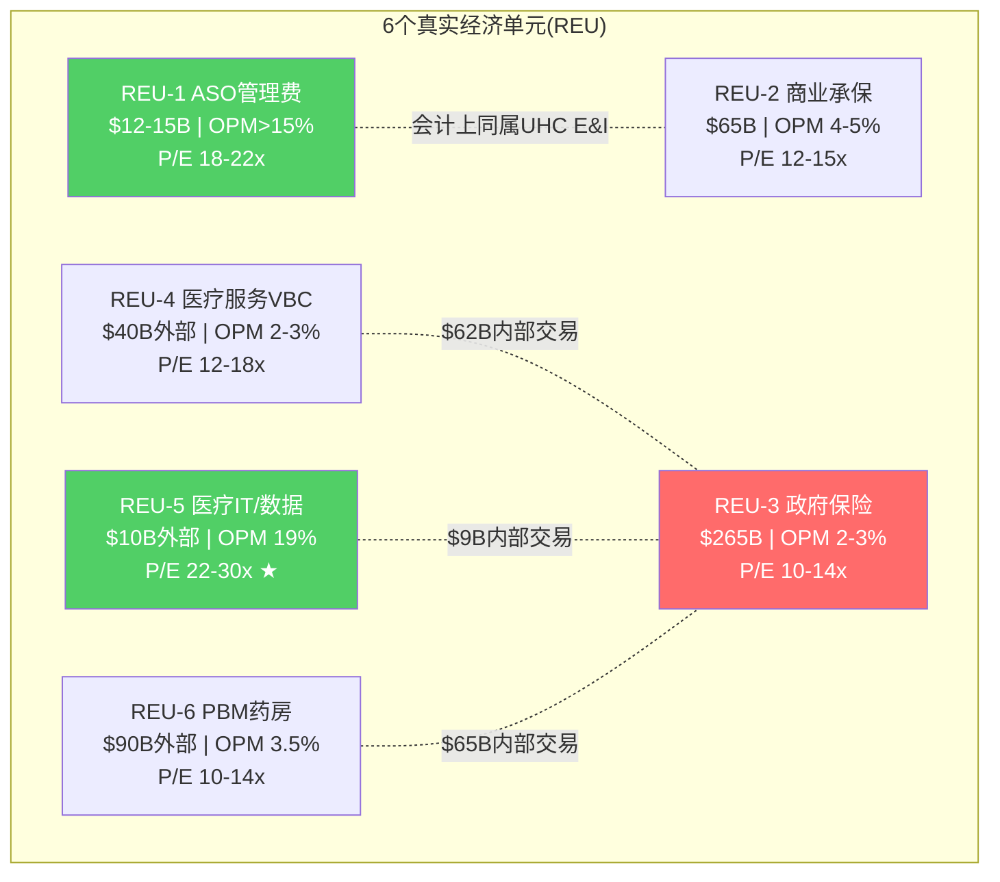

# Chapter 6: 会计分部 vs 真实经济单元 — 利润地图重构

> **CQ2.5**: 披露口径是否掩盖了真实利润结构？哪些利润是真实经济利润，哪些是内部转移？
> 这是理解UNH估值的关键一步: 不拆开看，永远不知道钱在哪里

## 6.1 会计分部的三个系统性误导

### 误导1: 收入规模 ≠ 利润贡献

UNH FY2025分部收入: UHC $344.9B, Optum Health $102.0B, Insight $19.4B, Rx $154.7B。

看到这些数字，直觉反应是"UHC贡献55%收入因此最重要"。但利润告诉完全不同的故事：

| 分部 | 收入占比 | Adj利润占比 | OPM | 每$1收入的利润 |
|------|---------|-----------|-----|-------------|
| UHC | 55% | 46% | 3.0% | $0.030 |
| Optum Health | 16% | 10% | 2.3% | $0.023 |
| Optum Insight | 3% | 16% | 19.1% | $0.191 |
| Optum Rx | 25% | 27% | 3.9% | $0.039 |
[DM-SEG-013: 基于segment_data.md adj营业利润计算]

**Optum Insight只有3%的收入但贡献16%的利润** — 每$1收入产生$0.19利润，是UHC的6.4倍。这是一个隐藏在巨大收入数字中的"利润珍珠"。

**Optum Rx贡献25%收入和27%利润** — 看似与收入匹配，但如果CAA 2026的100%回扣传递生效，其利润可能下降25-40%，利润占比将从27%降至20%以下。[DM-REG-011]

### 误导2: 内部交易创造"虚胖"

FY2025分部收入合计$621.0B，但合并收入仅$447.6B — $173.4B被消除（28%） [DM-SEG-007]

这$173B内部交易包括：
- UHC向Optum Rx支付的药品管理费 → Optum Rx收入虚高
- UHC向Optum Health支付的VBC管理费 → Optum Health收入虚高
- UHC向Optum Insight支付的理赔处理/数据费 → Optum Insight收入虚高

**每个Optum分部都有"UHC内部客户"导致的收入膨胀**:
| 分部 | 总收入 | 外部收入(估) | 内部收入(估) | 内部占比 |
|------|--------|-----------|-----------|---------|
| Optum Health | $102.0B | ~$40B | ~$62B | ~61% |
| Optum Insight | $19.4B | ~$10B | ~$9.4B | ~48% |
| Optum Rx | $154.7B | ~$90B | ~$64.7B | ~42% |
[DM-SEG-014: 基于总消除额$168B按分部规模比例推算]

**Optum Health的61%收入来自UHC内部** — 这是所有分部中内部依赖度最高的。如果DOJ强制要求UHC与Optum在"公平市场价格"(arm's length)交易，Optum Health的收入和利润都会显著下降。

### 误导3: GAAP vs Adjusted的$2.7B差额

FY2025合并GAAP营业利润$19.0B vs Adj $21.7B — 差额$2.7B。

这$2.7B调整包括：
- Optum Health: 估值减记+重组费用 — 表明管理层正在承认前期并购的价值破坏
- Optum Insight: Change Healthcare攻击残余成本
- Corporate: 法律/和解准备金(FTC/DOJ相关？)

**"Adjusted"能代表"真实"吗？** 在正常年份，GAAP和Adjusted差额通常<$1B。$2.7B差额说明2025年有大量非经常性项目，支持"洗大澡"假说(NH-02)。但如果每年都有$2-3B的"非经常性"项目，那它们就变成了经常性的 — 这正是市场给折价的原因之一。

## 6.2 真实经济单元重构

抛开会计分部，UNH实际上由以下6个"真实经济单元"(REU)组成，每个的economics截然不同：

### REU-1: 商业保险ASO (管理费业务)
- **位于**: UHC E&I (ASO部分)
- **收入**: ~$12-15B (纯管理费)
- **利润率**: 极高(>15% OPM) — 零MCR风险
- **增长**: 低(~3-5%/年)
- **价值**: 稳定现金牛，几乎不受MCR波动影响
- **正确可比**: ADP, Paychex (行政外包)
- **估值锚**: 18-22x P/E

### REU-2: 商业保险承保 (fully insured)
- **位于**: UHC E&I (fully insured部分)
- **收入**: ~$65B
- **利润率**: ~4-5% OPM, MCR ~85%
- **增长**: 中(~5-7%/年, 保费提价)
- **价值**: 核心承保业务，周期性但可预测
- **正确可比**: CI, ELV
- **估值锚**: 12-15x P/E

### REU-3: 政府保险 (Medicare + Medicaid)
- **位于**: UHC M&R + C&S
- **收入**: ~$265B (UNH收入的59%)
- **利润率**: ~2-3% OPM (MCR ~89-91%)
- **增长**: 政策驱动(CMS费率+会员)
- **价值**: 巨大收入但薄利润，高度依赖政策
- **正确可比**: HUM (纯MA), CNC (纯Medicaid)
- **估值锚**: 10-14x P/E

### REU-4: 医疗服务 (VBC + 诊所)
- **位于**: Optum Health
- **收入**: ~$40B (外部)
- **利润率**: ~2-3% adj OPM (当前亏损)
- **增长**: 收缩中(退出市场)
- **价值**: 长期赌注，尚未证明
- **正确可比**: HCA, DaVita, Amedisys
- **估值锚**: 12-18x P/E (如果有利润)

### REU-5: 医疗IT/数据平台
- **位于**: Optum Insight
- **收入**: ~$10B (外部)
- **利润率**: ~19% adj OPM
- **增长**: 中(~5-8%/年)
- **价值**: 最有"平台"属性的部分，backlog $31.1B
- **正确可比**: Veeva, Evolent, HIMS
- **估值锚**: 22-30x P/E

### REU-6: PBM/药房服务
- **位于**: Optum Rx
- **收入**: ~$90B (外部)
- **利润率**: ~3.5-4% OPM (监管后可能降至2-3%)
- **增长**: 低(被监管压缩)
- **价值**: 规模壁垒强但利润正在被监管重新分配
- **正确可比**: CVS Caremark (within CVS), Express Scripts (within CI)
- **估值锚**: 10-14x P/E

> ★ REU-5(Optum Insight)是唯一配得上"平台P/E"的分部。REU-1(ASO)是隐藏的高利润率现金牛。REU-3(政府保险)占收入59%但MCR~90%+。

## 6.3 SOTP初步估值 (基于真实经济单元)

| REU | Adj OP($B) | P/E锚 | 隐含市值($B) |
|-----|-----------|-------|------------|
| REU-1 ASO | $2.0 | 20x | $28B |
| REU-2 商业承保 | $3.0 | 13x | $28B |
| REU-3 政府保险 | $5.5 | 12x | $47B |
| REU-4 医疗服务 | $2.3 | 14x | $23B |
| REU-5 医疗IT | $1.9 | 26x | $35B |
| REU-6 PBM | $3.5 | 12x | $30B |
| **合计(独立之和)** | **$18.2B** | | **$191B** |
| **+协同溢价(内部$4.4B)** | $4.4B | 15x | **+$47B** |
| **-集团折价(20%)** | | | **-$48B** |
| **-净债务** | | | **-$54B** |
| **SOTP权益价值** | | | **$136-190B** |
| **每股** | | | **$149-209** |

**初步SOTP结论**: $149-209/股，vs当前$284 — **当前价格可能高估了15-47%**。

但这个结论有两个重要caveat：
1. **协同溢价可能被低估** — 如果UNH的数据飞轮真的能提供$6-8B而非$4.4B的年化价值，SOTP上升至$220-260
2. **集团折价可能被高估** — 如果市场认为纵向整合是优势而非风险，折价从20%降至10% → +$24B → $173-233/股

**这个SOTP与Reverse DCF的交叉**: Reverse DCF隐含公允价$260-350(概率加权), SOTP隐含$149-209。差距很大。差异来自SOTP按独立状态估值而Reverse DCF按集团运营估值 — 这$60-140B的差额就是"协同vs复杂度"争论的货币化表达。Phase 2的CQ4(飞轮真伪)将决定哪个更接近真实。

## 6.4 哪些利润池被会计掩盖了？

1. **ASO业务** — 高利润率(>15%)但被fully insured的低OPM稀释。如果E&I分开披露ASO和fully insured，投资者会发现UHC中有一个隐藏的高质量现金流引擎
2. **Optum Insight的外部业务** — adj OPM 19%但被内部服务(可能定价偏低)拖累。独立后OPM可能升至22-25%
3. **Optum Rx的specialty药品** — 特药利润远高于传统处方药，但被PBM的整体低OPM掩盖

## 6.5 哪些"协同"可能是内部输血？

Health Affairs研究是一个重要的证据点 [DM-REG-006]: UNH给Optum诊所的支付比外部高17%，高市占率地区61%。

如果这17%是"市场公允价格"(因为Optum诊所质量更高/更高效)，那是真协同。如果这17%是"关联交易溢价"(UHC故意多付以提高Optum利润)，那是内部输血。

**区分真协同vs内部输血的方法**：
- 如果Optum诊所的医疗结局(clinical outcomes)优于外部诊所 → 真协同(支付溢价是合理的)
- 如果Optum诊所的结局与外部无显著差异但获得更高支付 → 内部输血
- DOJ正在调查的就是这个问题

**这是CQ4(飞轮真伪)的核心子问题: UNH的纵向整合协同，有多少是"价值创造"，多少是"价值转移"？**
