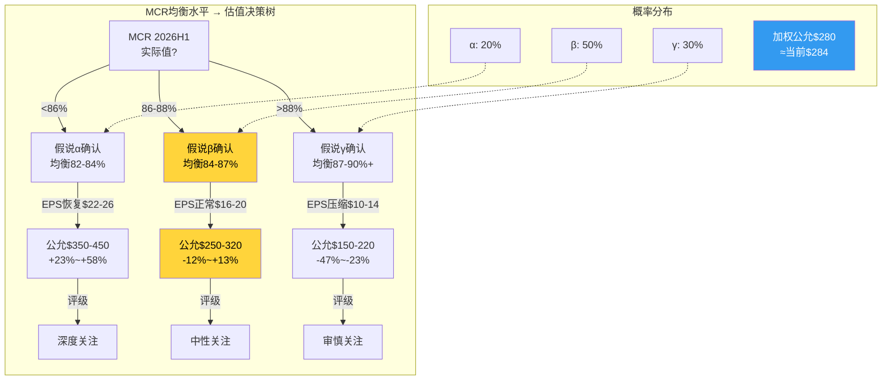

# Chapter 7: 主矛盾锁定 — MLR均衡水平决定一切

> **CQ3**: 主矛盾是医疗成本，监管，还是协同兑现？哪个最决定中长期估值？
> **结论预告**: MLR均衡水平是主矛盾，监管是二阶变量，协同是三阶变量

## 7.1 三个候选主矛盾

### 候选A: 医疗成本/MLR均衡水平

**论据**: MCR从79.1%(2020)→88.9%(2025)，累计+980bps。[DM-MCR-001: segment_data.md, MCR trajectory]

这个MCR变化直接解释了UNH 98%的利润波动：
- FY2020 收入$257B × OPM 8.7% = OP $22.4B
- FY2025 收入$448B × OPM 4.2% = OP $19.0B
- 收入增长74%但利润下降15% — 因为MCR吃掉了全部收入增长

**量化敏感性** (Python验证): MCR每变动100bps → UHC医疗成本变动~$3.4B → 影响正常化EPS ~$2.96 → 影响股价~$41-59(按14-20x P/E) [DM-PY-001: P1_python_verification.py MCR敏感性输出]

**口径说明**: 上述敏感性基于"正常化"假设(Optum adj OP $12.1B, 有效税率22%, 不含一次性charges)。FY2025 GAAP EPS $13.23低于正常化模型输出($19.61@MCR88.9%)，差额$6.38来自: Optum GAAP vs adj差$2.6B + FY2025异常低有效税率12.9% + 其他一次性项目。**核心产出是边际敏感性($2.96/100bps)，不是绝对水平**

这意味着MCR从88.9%回落到86%就能让EPS从$13.23增至~$21(+59%)，股价从$284到$330-420(+16-48%)

### 候选B: 监管/制度性压力

**论据**: FTC PBM诉讼+DOJ反垄断+Medicare欺诈调查+国会立法+50州PBM法规

五路并行监管压力前所未有。但监管的影响路径是：
1. 首先改变UNH的商业模式(如PBM回扣透明)
2. 然后改变利润结构(如Optum Rx利润下降$1.5-2.5B)
3. 最后改变估值倍数(如P/E从14x→12x)

**关键区分**: 监管影响利润水平(Level)，MCR影响利润趋势(Trend)。在当前阶段，趋势>水平——因为市场更关心"UNH的盈利在朝什么方向走"而非"UNH最终会被罚多少钱"。

### 候选C: 协同兑现/Optum价值

**论据**: Optum是UNH P/E溢价的基础。如果Optum证明价值(利润恢复)，P/E重估；如果不能，P/E继续压缩。

但协同的兑现能力本身依赖于MCR环境——MCR恶化时Optum Health也亏损(VBC模型在高利用率环境中不赚钱)。因此协同不是独立变量，而是MCR的函数。

## 7.2 主矛盾判定: MCR均衡水平

**三个候选的因果层级**:
```
MCR均衡水平 (第一因)
  ├── 直接决定UHC利润率 (~55%的利润)
  ├── 直接决定Optum Health VBC利润率 (~10%的利润)
  ├── 间接影响估值倍数 (P/E压缩/扩张)
  └── 间接影响资本配置 (回购能力/债务能力)

监管 (第二因)
  ├── 改变PBM利润结构 (Optum Rx)
  ├── 可能改变集团结构 (分拆)
  └── 但不直接影响MCR (CMS费率是另一个变量)

协同 (第三因)
  ├── 是MCR的函数 (MCR好→协同显现, MCR差→协同失效)
  └── 不独立驱动估值
```

**因此MCR是主矛盾** — 它直接决定>65%的利润变量，且是协同兑现的前置条件。

## 7.3 MCR均衡水平分析

### 历史MCR轨迹

| 年份 | MCR | 背景 | 是否异常 |
|------|-----|------|---------|
| 2016 | ~83.5% | 正常运营 | 基线 |
| 2017 | ~83.0% | 正常运营 | 基线 |
| 2018 | ~82.8% | 正常运营 | 基线 |
| 2019 | ~82.5% | 正常运营 | 基线 |
| **2020** | **79.1%** | **COVID压抑利用率** | **异常低** |
| 2021 | ~82.0% | 利用率部分恢复 | 接近正常 |
| 2022 | ~82.5% | 利用率继续恢复 | 接近正常 |
| 2023 | ~84.0% | 利用率超恢复开始 | 上升起点 |
| 2024 | 85.5% | 利用率快速上升 | 恶化中 |
| **2025** | **88.9%** | **利用率峰值+GLP-1+Medicaid重审** | **异常高？** |
[DM-MCR-001: segment_data.md + business_scout.md]



### 三种均衡假说

**假说α: MCR均衡在82-84% (回归2016-2019水平)**
- 逻辑: 2020-2022的低MCR是COVID异常，2024-2025的高MCR是后COVID反弹异常，真实均衡在中间
- 支持证据: 保费有1-2年定价滞后→2026-2027的保费将反映2024-2025的高成本→MCR自然回落
- 时间线: 2027-2028回归
- 隐含: EPS恢复至$22-26, 股价$350-450

**假说β: MCR均衡在84-87% (永久上移)**
- 逻辑: COVID前的MCR 82-83%被2016-2019的低利用率基期"美化"了。真实均衡本来就在84%+，只是COVID掩盖了
- 支持证据:
  - GLP-1药物是结构性成本(年$12-15K/人，使用率持续上升) [NH-03]
  - CMS V28风险调整模型减少了UNH的RA优化空间
  - Medicaid redetermination后剩余人群更病
  - 行为健康利用率+20-30%是永久性的(非COVID反弹)
- 时间线: 这就是新常态
- 隐含: EPS "正常"在$16-20, 股价$250-320

**假说γ: MCR均衡在87-90%+ (结构性恶化)**
- 逻辑: 医疗通胀正在加速(AI/新疗法/GLP-1/个性化医疗)，而保费定价受监管限制→MCR将结构性恶化
- 支持证据:
  - 2025 MCR 88.9%可能不是峰值——2026 guidance MCR 88.8%(几乎不改善)
  - 如果MCR不能在2026显著改善，"暂时高MCR"假说就被证伪
  - CNC(Centene)已经在OPM -3.9%运营——部分保险商可能退出MA市场
- 时间线: 持续恶化
- 隐含: EPS $10-14, 股价$150-220

### 我的初步评估 (P1方向锚定)

| 假说 | 概率 | 隐含公允价 |
|------|------|-----------|
| α: 回归82-84% | 20% | $400 |
| β: 上移至84-87% | 50% | $285 |
| γ: 结构性87-90%+ | 30% | $185 |
| **概率加权** | | **$280** |

**概率加权公允价$280 ≈ 当前价$284** — 市场定价接近合理。

这个结论与P1的方向约束一致(铁律O): Reverse DCF暗示"中性偏关注"，初步SOTP暗示"偏高估"，MCR均衡分析暗示"接近合理"。三者的交集是**"中性关注(偏审慎)"**，即当前价格大致反映了已知风险。

## 7.4 MCR的主控变量 (CQ7.2预映)

MCR本身由什么驱动？识别"最上游变量"可以预判MCR的未来方向：

```
最上游 → → → 最下游
│
├── 人口结构 (老龄化→利用率↑) — 不可逆，年+0.5-1%
├── 医疗技术 (新药/新疗法→单价↑) — 不可逆，年+2-3%
│   └── GLP-1是当前最大的单项成本冲击
├── 行为变化 (后COVID心理健康需求↑) — 部分可逆
├── 监管定价 (CMS费率/风险调整) — 政策周期性
│   └── 2026 CMS +5.06% = 短期利好
├── 竞争行为 (竞争者降价→UNH被迫匹配) — 行业周期性
│   └── Humana激进争夺MA会员
└── UNH自身 (承保纪律/VBC效率/定价策略)
    └── 2026主动退出不赚钱市场 = 自我修正
```

**不可逆变量(人口+技术)占MCR上升压力的60-70%** — 这是β假说的核心论据。即使COVID反弹消退、保费追上成本，结构性的人口老龄化+医疗技术进步将保持MCR在84%+。

**但UNH有两个自我修正杠杆**:
1. **退出不赚钱市场** — 2026年-1.3M MA会员, -2.8M总会员 → 留下的是更健康/更赚钱的人群
2. **保费定价滞后追赶** — 2025的高MCR → 2026-2027保费提价更激进 → MCR自然回落

这两个杠杆足以让MCR从88.9%回落到86-87%，但不太可能回到82-83%。**这就是为什么β(84-87%)是最可能的均衡——有下降空间，但有底。**

## 7.5 注意力错配诊断 (CQ3.5)

**市场在过度关注什么？**
1. **单季度MCR headline** — 每个季度的MCR都成为股价的最大驱动力。但MCR有1-2年的均值回归特性，单季度过度反应是不理性的
2. **CEO丑闻的情绪冲击** — DOJ调查是真实风险，但Andrew Witty的辞职本身不改变UNH的商业模式。Hemsley回归甚至可能是正面的(他创建了Optum)
3. **Change Healthcare攻击** — $3.09B成本是一次性的(虽然巨大)，不改变长期估值

**市场在忽略什么？**
1. **E&I(ASO)的稳定性** — 这部分业务几乎不受MCR影响，是被低估的现金牛
2. **2026 CMS费率+5.06%的正面影响** — 这是近年来最大的MA费率增幅，将在2026-2027逐步改善MCR
3. **Hemsley的$25M自购信号** — CEO在$288买入$25M是强烈的内部人信心信号 [DM-BIZ-004]
4. **FCF韧性** — $16.1B FCF(FCF/NI=1.33x)说明盈利质量比GAAP NI表面看更好

## 7.6 噪音过滤 (CQ3.8)

**看似重要实际是噪音的**:
1. 某州某月的Medicaid合同消息 — 对$448B收入的公司，单个州合同影响<1%
2. 管理层earnings call中的"我们对长期前景有信心"类措辞 — 每个CEO都这么说
3. 分析师目标价$410(+44%) — 卖方共识在极端环境中往往滞后于现实

**看似是噪音实际重要的**:
1. **2026 MCR guidance 88.8%±50bps** — 这说明管理层预期MCR几乎不改善。如果到了2026H1 MCR仍>88%，β/γ假说将得到强化
2. **Humana MA会员超过UNH的时间点** — 如果Humana在2026年底超过UNH成为最大MA保险商，标志着UNH正在失去行业领导地位
3. **GLP-1利用率数据** — 如果GLP-1使用率继续以50%+速度增长(目前趋势)，MCR的结构性压力将比市场预期更持久
