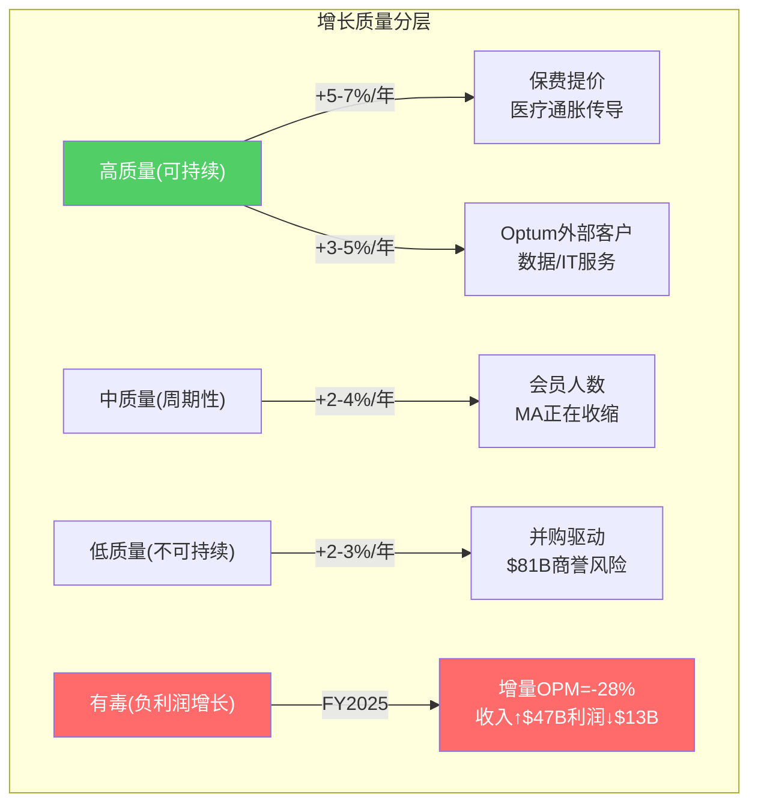
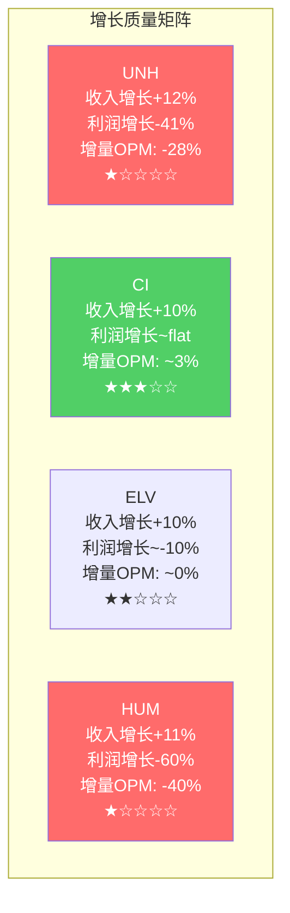

# Chapter 8: 增长质量分解 — 哪些增长在创造价值，哪些在透支未来

> **CQ5**: 增长来自价格、人数、组合变化、服务渗透，还是并购？哪些是高质量的？

## 8.1 收入增长分解 (2016-2025)

UNH收入从$184.8B(2016)增长到$447.6B(2025)，10年CAGR 10.3%。但这10.3%的来源差异巨大：

### 有机增长 vs 并购增长

**并购贡献估计**:
- 商誉从$47.6B(2016)增至$110.5B(2025) = +$62.9B [DM-BS-001]
- 累计并购支出~$81B(10年) [DM-CF-002]
- 主要并购: Change Healthcare($13B, 2022), DaVita Medical Group($4.9B, 2019), Surgical Care($2.3B, 2017), LHC Group($5.4B, 2023)等
- 并购带来的收入估计~$50-60B/年(当前) → 占$448B收入的~12%

**有机增长拆解**(扣除并购后):

| 有机增长驱动力 | 年化贡献 | 质量评级 | 持续性 |
|-------------|---------|---------|-------|
| **保费提价** | +5-7% | ★★★★☆ | 高(医疗通胀传导) |
| **会员人数增长** | +2-4% | ★★★☆☆ | 中(MA收缩中) |
| **产品组合优化** | +1-2% | ★★★★☆ | 中高 |
| **Optum外部客户增长** | +3-5% | ★★★★★ | 高(最高质量) |
| **有机合计** | ~8% | | |
| **并购贡献** | ~2-3% | ★★☆☆☆ | 低(依赖持续M&A) |
| **总增长** | ~10% | | |

### 增长质量评分

1. **保费提价(+5-7%)** — 高质量：保费提价是保险公司最稳定的收入来源。UNH作为最大保险商有一定定价权。但受CMS费率(MA/Medicaid)和市场竞争(商业保险)约束。因为MCR上升→保费提价有成本传导逻辑支撑→但利润率不一定扩张(保费追成本)

2. **会员人数增长(+2-4%)** — 中等质量(恶化中)：2016-2023年UNH MA会员从~4M增至9.4M，CAGR~12%。但2026年预计-1.3M(-14%)。E&I会员基本稳定。C&S受Medicaid政策驱动。**当前阶段"有质量的收缩"(退出不赚钱市场)比"无质量的增长"(拉入高MCR会员)更有价值。**

3. **并购(+2-3%)** — 最低质量：每年$5-13B并购支出产生的收入增长。商誉$110.5B是一个悬在头上的巨大风险——一旦Optum Health减值(已经开始)，将直接冲击权益。**并购增长的ROI需要验证: 如果$81B并购带来的年化利润<$6B(7.4% return on acquisition capital)，则低于WACC 9%——并购在毁灭价值。**

> FY2025的增长是"有毒"的：每多赚$1收入反而亏$0.28利润。2026年管理层选择收缩(收入↓2%)是正确的。

## 8.2 利润增长 vs 收入增长的脱节

| 指标 | 2016-2023 CAGR | 2023-2025 CAGR | 含义 |
|------|---------------|---------------|------|
| 收入 | 10.5% | 9.7% | 收入增长未放缓 |
| 营业利润 | 14.0% | -23.5% | 利润崩塌 |
| 净利润 | 18.1% | -26.7% | 净利润崩塌更严重 |
| EPS | 18.6% | -25.5% | EPS暴跌 |
| FCF | 17.5% | -20.9% | FCF也显著下降 |
[DM-FIN-006: FMP income + cashflow 计算]

**收入增长+10%但利润-24%** — 这是典型的"有毒增长"信号：增量收入的边际利润是负的。

**为什么增量收入利润为负？**

每$1新增收入的利润分析:
- FY2024→2025: 收入增$47.3B, 营业利润减$13.3B → 增量OPM = **-28%**
- 这意味着2025年新增的$47.3B收入不仅没有产生利润，反而损失了$13.3B
- 原因: 新增收入来自MA会员增长(高MCR, 接近或超过100%的incremental MCR)和Optum Health(GAAP亏损)

**这是一个关键洞见: UNH在2024-2025年的增长是有毒的——收入越多,亏越多。** 管理层在2026年选择收缩(收入下降至$439B)是正确的战略。

## 8.3 增长的耐久性评估 (CQ5.8)

### 可持续5-10年的增长:
1. **美国医疗支出增长(+4-6%/年)** — 人口老龄化+医疗技术进步→行业蛋糕自然增长。UNH只需维持市占率就能获得这部分增长 [DM-IND-005: CBO projection, healthcare spending +5-6%/年]
2. **MA渗透率提升** — 目前MA覆盖Medicare受益人的~52%，CBO预计到2030年升至60%+ → UNH的MA会员可能重新增长(在退出低利润市场后) [DM-IND-006: MA penetration ~52%]
3. **Optum Insight数据/AI服务** — 医疗数据分析需求结构性增长, $31.1B backlog提供可见性

### 可持续1-3年的增长(非永续):
1. **Optum Rx特药增长** — 生物制药管线爆发→特药利润高→但PBM监管将压缩
2. **保费追赶定价** — 2024-2025的高MCR→2026-2027更激进提价→收入增长→但只是均值回归
3. **Optum Health重组后利润恢复** — 退出低效市场→利润改善→但基数低

### 可能是一次性错觉的增长:
1. **2022-2024的大规模并购拉动** — $35B+并购→收入暴增→但goodwill risk上升
2. **Medicaid扩展** — COVID时期的持续覆盖政策→Medicaid会员暴增→已在逆转(redetermination)
3. **COVID后V-shaped反弹** — 2020-2021的EPS暴增是COVID导致的MCR异常低→不代表正常盈利能力

## 8.4 FY2025的增长质量诊断

| 分部 | 收入增长 | 利润增长 | 增量利润率 | 增长质量 |
|------|---------|---------|-----------|---------|
| UHC | +16% | -40% adj | 极负 | ★☆☆☆☆ |
| Optum Health | -3% | -45% adj | N/A(收缩) | ★☆☆☆☆ |
| Optum Insight | +4% | 持平 adj | ~19% | ★★★★☆ |
| Optum Rx | +16% | +5% adj | ~2% | ★★☆☆☆ |
[DM-SEG-015: segment_data.md 计算]

**唯一有高质量增长的分部是Optum Insight** — 收入增长转化为利润增长，且OPM稳定在19%。这进一步支持了"Optum Insight是隐藏的利润珍珠"的判断(Ch6)。

## 8.5 增长质量对估值的含义

1. **不应对UNH的"10%收入增长"给予增长溢价** — 因为增量利润为负(2024-2025)。只有当增量OPM>0时，收入增长才有估值意义
2. **2026年收入下降是正面信号** — $448B→$439B(-2%)是"有质量的收缩"——退出负利润会员→提升整体MCR → 每$1收入的利润从$0.027提升。管理层明确说"margin recovery over growth" [DM-BIZ-011]
3. **长期增长引擎: Optum Insight > Optum Rx > UHC** — 按增量利润率排序，而非收入增速排序
4. **并购ROI需要在Phase 2验证** — $81B并购×WACC 9% = 每年至少需要$7.3B利润才能覆盖资本成本。当前Optum合计adj利润$12.1B，其中并购贡献可能$6-8B → 边际(接近WACC但可能低于)

## 8.5 增长路径的二阶效应分析

### 并购增长的隐藏成本

表面上并购增加了收入和利润，但有三个二阶效应削弱了并购增长的实际价值:

**效应1: 商誉膨胀→减值风险**
- 2016商誉$47.6B → 2025商誉$110.5B → +$62.9B
- 这$62.9B是"未来利润的预付" — 如果并购标的未达预期利润→减值
- Optum Health FY2025已开始减值(GAAP亏损含减记) [DM-SEG-006]
- CVS在2024年对Oak Street减值$11B+是前车之鉴 [DM-COMP-006]

**效应2: 管理注意力稀释**
- 每年$5-13B并购 = 每年2-5个大型整合项目
- Change Healthcare(2022,$13B)的整合至今未完成 — 2024.2网络攻击部分源于整合期间的安全盲区
- 管理团队的注意力被分散在"整合旧并购"和"运营当前业务"之间
- FY2025 Optum Health的糟糕表现可能部分因为管理层在同时整合多个收购

**效应3: 债务螺旋风险**
- 并购通常用债务融资 → 总债务$31.7B(2017)→$78.4B(2025) [DM-BS-002]
- 利息支出从$1.2B(2017)→$4.0B(2025) [DM-FIN-017: FMP income interest expense]
- 利息覆盖从12.8x→4.7x
- 如果EBIT不恢复+继续并购→杠杆进一步上升→可能触发评级下调→融资成本上升→恶性循环

### 有机增长 vs 并购增长的10年对比

| 指标 | 有机增长(保费+会员+Optum外部) | 并购增长 |
|------|--------------------------|---------|
| 10年累计投入 | ~$0(不需要额外资本) | ~$81B |
| 年化收入贡献 | ~$200B(从$185B→$385B有机) | ~$60B |
| 年化利润贡献 | ~$15-18B | ~$5-6B |
| ROI | ∞(无资本投入) | 6-7%(<WACC) |
| 风险 | MCR波动(可管理) | 商誉减值+整合失败(不可逆) |
| 可持续性 | 高(行业自然增长) | 低(有限标的+监管限制) |
[DM-GRW-001: 分解逻辑: 总收入增长-并购贡献=有机增长]

**有机增长的ROI是无穷大(不需要资本投入)，并购增长的ROI是6-7%**。资本配置的最优策略应该是: 最大化有机增长(保费定价+Optum外部客户拓展)+减少边际并购+增加回购。Hemsley在FY2025的策略(并购从$13.4B→$4.5B)正在朝这个方向调整。

## 8.6 增长质量评分: UNH vs 同行

**CI是唯一增量OPM为正的主要保险商**(估计~3%) — 因为Express Scripts的PBM利润部分抵消了保险MCR恶化。这再次证明CI的"轻整合"模型在当前环境中表现优于UNH的"重整合"。

**UNH和HUM是增长质量最差的两家**——收入增长最快(+11-12%)但利润下降最多(-41%/-60%)。高增长+高亏损 = 有毒增长。两者的共同特征: MA敞口高(UNH 38%, HUM 80%+)→MA MCR恶化对它们的冲击最大。

## 8.7 2026-2028增长前景评估

| 维度 | 2026E | 2027E | 2028E | 驱动力 |
|------|-------|-------|-------|-------|
| 收入 | $439B(-2%) | $455B(+4%) | $481B(+6%) | 保费追赶+会员企稳 |
| adj OPM | 5.0-5.5% | 6.0-6.5% | 6.5-7.0% | MCR改善(保费追赶+退出策略) |
| adj EPS | $17.75+ | $19.80 | $23.78 | 利润率恢复+回购 |
| EPS CAGR(25→28) | - | - | **~22%** | 从低基数恢复 |
[DM-EST-002: FMP estimates 2027-2028E]

**2025→2028E的22% EPS CAGR看起来很高，但这是从异常低基数恢复**——不是真正的"高成长"。正常化后(2028→2030E)的EPS CAGR将放缓至8-10%(接近行业长期增速)。

**投资者不应被22% EPS recovery误导为"UNH是成长股"** — 这是均值回归，不是增长加速。
