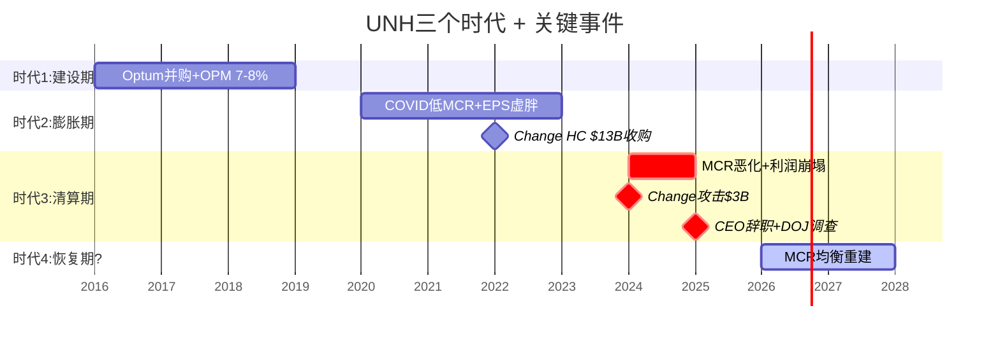
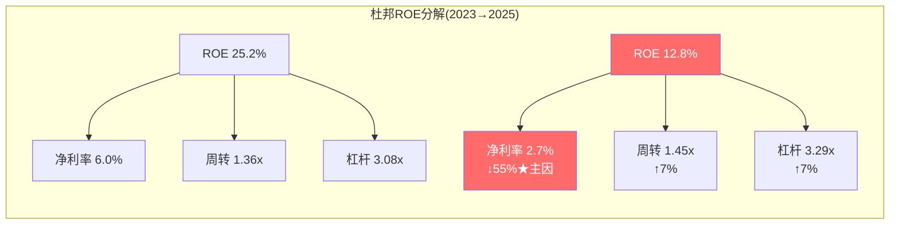

# Chapter 9: 财务考古学 — 10年轨迹中的隐藏信号

> **CQ5续 + D1数据基础**: 10年数据中哪些趋势被忽视？哪些信号能预判拐点？
> 本章建立数据基础，为Phase 2-3的深度分析提供锚点

## 9.1 杜邦分解: ROE从24%到13%发生了什么？

| 年份 | ROE | = | 净利率 | × | 资产周转 | × | 权益乘数 |
|------|-----|---|--------|---|---------|---|---------|
| 2017 | 21.2% | | 5.2% | | 1.45x | | 2.79x |
| 2019 | 24.0% | | 5.7% | | 1.39x | | 3.02x |
| 2021 | 24.1% | | 6.0% | | 1.36x | | 2.96x |
| 2023 | 25.2% | | 6.0% | | 1.36x | | 3.08x |
| 2024 | 15.5% | | 3.6% | | 1.34x | | 3.22x |
| **2025** | **12.8%** | | **2.7%** | | **1.45x** | | **3.29x** |
[DM-FIN-007: FMP ratios, ROE杜邦分解]

**ROE从25.2%(2023)→12.8%(2025)的分解**:
- 净利率: 6.0%→2.7% (贡献-55%的ROE下降) ← **MCR恶化的直接结果**
- 资产周转: 1.36x→1.45x (轻微改善) ← 收入增长快于资产增长
- 权益乘数: 3.08x→3.29x (杠杆轻微上升) ← 债务增加+权益减少

**诊断: ROE崩塌100%由净利率驱动**。资产效率和杠杆都在维持甚至轻微改善。这意味着如果净利率恢复，ROE会自动恢复——不需要去杠杆或资产重组。

这是一个积极信号: **问题集中在利润率(MCR)一个维度，而非多维度同时恶化。**

## 9.2 现金转换质量: FCF/NI的异常韧性

| 年份 | NI($B) | FCF($B) | FCF/NI | 含义 |
|------|--------|---------|--------|------|
| 2017 | 10.6 | 11.6 | 1.10x | 正常 |
| 2019 | 13.8 | 16.4 | 1.18x | 正常偏好 |
| 2021 | 17.3 | 19.9 | 1.15x | 正常 |
| 2023 | 22.4 | 25.7 | 1.15x | 正常 |
| 2024 | 14.4 | 20.7 | 1.44x | 异常高 |
| **2025** | **12.1** | **16.1** | **1.33x** | 异常高 |
[DM-FIN-008: FMP cashflow]

**NI大幅下降但FCF相对韧性强**。FCF/NI从2017-2023的~1.15x升至2024-2025的~1.35-1.44x。

为什么FCF>NI的差距在扩大？

**正面解读**:
1. D&A($4.4B) > CapEx($3.6B) — 折旧超过资本支出=$0.8B非现金利润转换
2. 保险float效应: UNH收到保费后延迟支付医疗费用 → 负营运资本周期(-36天CCC) [DM-FIN-009: FMP ratios, CCC=-36 days]
3. working capital管理优化

**负面解读**:
1. CapEx/D&A比率仅1.44x(vs 2017年0.90x) → UNH可能在under-investing
2. 如果under-investing，当前FCF是通过牺牲未来产能获得的 — 不可持续
3. $4.5B并购(2025)仍在继续 → FCF被并购抵消后的"真正自由"现金流更低

**我的判断**: FCF韧性是真实的(保险float+低CapEx需求)，但需警惕under-investment风险。保险公司天然CapEx低($3.6B/$448B=0.8%)，这不是under-investing的证据——保险公司的"资本投入"是精算准备金而非固定资产。

## 9.3 债务轨迹: 从保守到激进

| 年份 | 总债务($B) | 净债务($B) | ND/EBITDA | 利息覆盖 | 信号 |
|------|-----------|-----------|----------|---------|------|
| 2017 | 31.7 | 19.7 | 1.13x | 12.8x | 保守 |
| 2019 | 40.7 | 29.7 | 1.33x | 11.6x | 保守 |
| 2021 | 46.0 | 24.6 | 0.91x | 14.4x | 极保守 |
| 2022 | 57.6 | 34.3 | 1.08x | 13.6x | 保守(Change并购后) |
| 2023 | 67.4 | 42.0 | 1.16x | 10.0x | 中等 |
| 2024 | 76.9 | 51.6 | 1.84x | 8.3x | 上升 |
| **2025** | **78.4** | **54.0** | **2.34x** | **4.7x** | **警戒区间** |
[DM-FIN-010: FMP balance + ratios]

**利息覆盖从2021年的14.4x降至2025年的4.7x** — 这是一个值得关注的恶化。

原因有两个:
1. 债务从$46B增至$78.4B(+70%，主要是Change并购) [DM-BS-002]
2. EBIT从$24B(2021)降至$18.7B(2025)(-22%)

4.7x利息覆盖仍在安全区间(>3x通常被视为安全)，但趋势方向不好。如果EBIT继续下降到$15B，利息覆盖将降至3.7x — 接近信用评级下调的边界。

**信用评级**: UNH当前评级A+/A3(Moody's降低了？需验证)。Altman Z-Score 2.74(灰色区间1.81-2.99) [DM-FIN-005]。不是危险信号但已不在安全区。

## 9.4 回购效率: 历史最佳 vs 当前困境

10年累计回购~$52B，股份从968M→910M(-6%)。[DM-FIN-003]

**回购效率计算**:
- 累计回购$52B / 累计减少58M股 = 平均$896/股回购成本(分拆前调整)
- 当前价$284 vs 平均回购成本... 需要更精确的计算，但直觉上：在$400-600区间回购的大量资金现在underwater

**回购SBC覆盖率**: 582.5%(SBC $971M, 回购$5.5B) → 回购远超SBC稀释，净份额在减少 [DM-FIN-004]

**当前困境**: 2025年回购从$9B降至$5.5B(分红$7.9B不变)，FCF $16.1B刚好覆盖回购+分红=$13.4B。如果FCF进一步下降或分红继续增长，回购可能接近零。

**分红安全性分析**:
- FY2025分红$7.9B / FCF $16.1B = 49% FCF payout → 安全
- FY2025分红$7.9B / NI $12.1B = 65% NI payout → 偏高但可接受
- 连续10年+增长($2.38→$8.70/股) — 削减分红的声誉代价很高
- **2026年分红仍安全** — 即使FCF降至$14B，payout ratio仍<60%

## 9.5 商誉风险: $110.5B的减值炸弹

商誉$110.5B = 总资产35.7% = 股东权益的117% [DM-BS-001]

这意味着如果商誉减值$94.1B(股东权益全部=零)，UNH理论上资不抵债。当然这是极端情况，但商誉减值的部分风险已经在显现：

**Optum Health FY2025 GAAP亏损$278M包含估值减记** [DM-SEG-006] — 管理层已经在承认部分并购价值被高估。

**商誉by分部估计**:
| 分部 | 商誉估计($B) | 占比 | 减值风险 |
|------|------------|------|---------|
| Optum Health | ~$50-55 | ~47% | 高(VBC亏损) |
| Optum Insight | ~$25-28 | ~24% | 中(Change攻击后) |
| Optum Rx | ~$12-15 | ~13% | 低 |
| UHC | ~$15-18 | ~15% | 低 |
[DM-SEG-016: 基于并购历史推算]

**Optum Health的$50-55B商誉是最大风险点** — 这个分部FY2025 GAAP亏损+收入下降+正在退出市场。如果减值测试时使用的DCF假设中的增长率和利润率不再成立(MCR持续>87%)，可能触发重大减值。

**一次$10B商誉减值的影响**: 直接冲击NI → EPS减少~$11 → 但不影响现金流(非现金项) → 影响P/B和债务covenant中的权益/杠杆比率




> ROE崩塌100%由净利率(=MCR)驱动。资产效率和杠杆反而在改善。这意味着：修复MCR=修复ROE，无需其他调整。

## 9.6 10年财务轨迹的三个时代

```
时代1: 建设期 (2016-2019)
├── 收入CAGR ~10%, EPS CAGR ~18%
├── MCR 82-83%, OPM 7-8%
├── 并购Optum平台(DaVita, Surgical Care等)
├── 债务增长但ND/EBITDA<1.5x
└── 叙事: "保险+科技平台 = 成长故事"

时代2: 膨胀期 (2020-2023)
├── COVID压抑MCR至79% → 利润异常膨胀
├── EPS从$16→$24(但部分是虚胖)
├── Change Healthcare $13B收购 → 商誉膨胀
├── 股价从$350→$560
└── 叙事: "不可替代的健康基础设施"

时代3: 清算期 (2024-2025)
├── MCR从83%→89% — 虚胖被挤出
├── Change攻击 → 暴露IT脆弱性
├── CEO辞职 + DOJ调查 → 治理危机
├── EPS $24→$13 — 2020-2023的"虚胖利润"被完全清算
└── 叙事: "周期性保险公司?还是暂时受伤的平台?"
```

**我们现在在时代3的尾声。** 问题是: 时代4是"恢复期"(回到时代1的7-8% OPM)还是"新常态"(5-6% OPM成为永久水平)？

这个问题的答案取决于MCR均衡水平(Ch7)——如果β假说正确(84-87%)，时代4的OPM将是6-7%，EPS $18-22，合理P/E 16-18x → 股价$290-400。

## 9.7 预警指标清单 (Phase 2-4追踪)

| 指标 | 当前值 | 警戒线 | 危险线 | 含义 |
|------|--------|--------|--------|------|
| MCR(季度) | 88.9% | >89% | >91% | 主控变量 |
| 利息覆盖 | 4.7x | <4x | <3x | 信用风险 |
| ND/EBITDA | 2.34x | >2.5x | >3x | 杠杆风险 |
| FCF/NI | 1.33x | <1.0x | <0.7x | 盈利质量 |
| 商誉/权益 | 117% | >120% | >150% | 减值风险 |
| 回购+分红/FCF | 83% | >90% | >100% | 可持续性 |
| MA会员变化 | -1.3M(26E) | 持续收缩 | >-2M/年 | 竞争力 |
[DM-FIN-011: 基于历史分析和行业基准]

当前没有指标在"危险线"——但利息覆盖(4.7x)和ND/EBITDA(2.34x)已在"警戒"区间。如果MCR持续>88%导致EBITDA不能恢复，这两个指标将进一步恶化。
