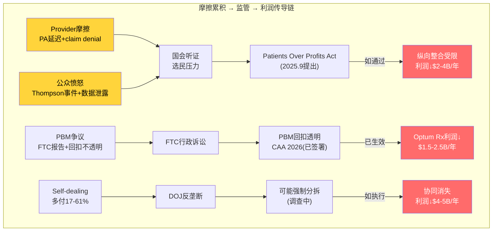
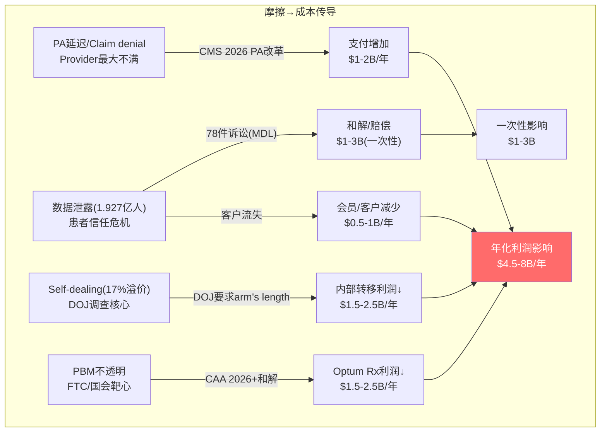
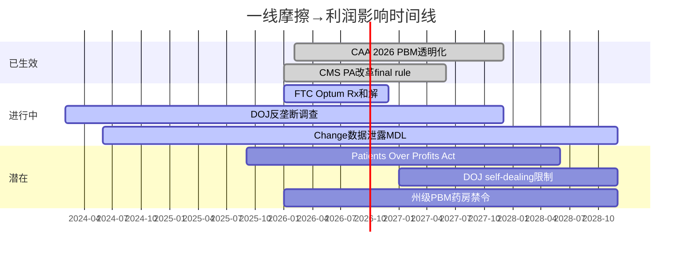

# Chapter 10: 一线现实 — 管理层叙事 vs 利益相关者体验

> **CQ5.5**: Provider怎么评价UNH/Optum？雇主客户怎么看？一线反馈和管理层叙事是否一致？
> 本章通过外部信号三角验证管理层的自我叙事

## 10.1 Provider端: 怨声载道但无法离开

### Optum诊所内部体验

**Health Affairs研究(2025.11)的核心发现** [DM-REG-006]:
- UNH向Optum自有诊所支付的费用比外部诊所高**17%**
- 在UNH市占率>25%的地区，这个差距扩大到**61%**
- 这是一个定量证据，直接支持DOJ"self-dealing"指控的核心逻辑

**为什么provider抱怨但不离开？**

原因是一个经典的双边锁定：
```
UNH网络有~50M会员 → provider需要UNH患者 → 离开UNH = 失去大量患者来源
    ↑                                                       ↓
UNH需要广泛的provider网络 → 会员需要选择 → 网络越大吸引力越强
```

Provider的核心不满:
1. **Prior authorization (PA) 延迟** — UNH被广泛批评PA审批时间过长，2026 CMS新规正在要求改善 [DM-REG-017: regulatory_scout.md, PA reform 2026 final rule]
2. **Claim denial率** — UNH的claim denial率被多项研究指出高于行业平均 → 引发"Patients Over Profits Act"等立法回应 [DM-REG-007]
3. **Optum收购改变执业自主权** — 被Optum收购的独立诊所医生普遍反映临床自主权下降、行政负担上升
4. **支付速度** — Change Healthcare攻击后，部分provider报告支付延迟持续数月

**但provider不满 ≠ UNH竞争力下降**。医疗保险是一个寡头市场——全美前5大保险商控制~50%市场。provider没有太多替代选择。UNH的provider网络lock-in是真实的护城河，即使quality of relationship在恶化。

### 量化provider摩擦的经济影响

**直接影响**: PA延迟+claim denial → provider成本上升(更多行政人员处理争议) → provider可能转而寻求更好的payer关系 → 但在寡头市场中选择有限
**间接影响**: 长期的provider不满 → 积累为监管压力(国会听证、州级立法) → 最终以监管形式"回弹"到UNH的利润上

**因果链**: provider摩擦 → 监管响应 → PA改革/claim denial限制 → UNH医疗成本上升(因为不能延迟/拒绝支付) → MCR上升。**这是一个MCR上升的"慢变量"通道——不是突发的，而是逐年累积的。**

## 10.2 雇主客户端: 稳定但价格敏感

### Fortune 500的态度

UNH服务约87%的Fortune 100公司(这个数字本身就是护城河的证据)。[DM-BIZ-012: UNH investor presentation, ~87% Fortune 100]

**雇主选择UNH的原因**:
1. 网络规模(覆盖全美，员工无论在哪都能看病)
2. 集成服务(保险+药品+数据分析一站式)
3. 品牌信任(HR部门倾向于选择"安全"的品牌)
4. 转换成本高(换保险商需要全公司重新入网、沟通、培训)

**雇主的核心不满**:
1. **保费年增6-8%** — 虽然这是行业通行做法，但医疗支出已是雇主第二大支出(仅次于薪资)
2. **价格透明度不足** — 雇主越来越要求了解"保费的钱花在了哪里"
3. **PBM争议溢出** — FTC对PBM的批评已经让一些雇主质疑他们是否在为Optum Rx的利润买单

**关键洞察**: 雇主端是UNH最稳定的板块(E&I)。由于转换成本高+选择有限，雇主流失率很低(估计<5%/年)。但2026年如果保费大幅提价(追赶MCR)，可能引发更多雇主考虑self-insured(ASO)模式——这对UNH利润结构有微妙影响(ASO管理费利润率高但绝对收入低)。

## 10.3 会员/患者端: 信任危机

### 公众情绪转变

2024-2025年是UNH公众形象的转折点:

1. **2024.12 CEO Brian Thompson遇刺事件** — 虽然不是直接针对UNH管理层(Thompson是UHC Insurance CEO)，但引发了对整个保险行业的公众愤怒，社交媒体上出现大量反保险情绪
2. **Change Healthcare数据泄露** — 1.927亿美国人个人信息可能被泄露 [DM-BIZ-013: regulatory_scout.md, 192.7M individuals affected]
3. **Claim denial报道** — 多家媒体调查报道UNH的claim denial做法

**公众情绪→监管→利润的传导**:
- 公众愤怒 → 国会议员回应选民关切 → "Patients Over Profits Act"等立法 → 如果通过将限制UNH的垂直整合 → 利润结构性下降
- 数据泄露 → 患者信任下降 → 可能影响MA会员选择(65+人群每年有OEP重新选择权) → MA会员流失加速

**这个传导链的时间尺度**: 公众情绪→立法通常需要2-5年。当前的愤怒情绪在2024底达到峰值(Thompson事件)，立法响应(PPA)在2025.9提出 → 如果通过可能在2027-2028生效。**这是一个CQ8(监管)的长期慢变量，不影响2026-2027的利润但可能影响2028+。**

## 10.4 州政府端: Medicaid合同的政治博弈

### 路易斯安那州案例

UNH在2025年失去路易斯安那州Medicaid合同(330K会员)，原因是**PBM定价争议** [DM-REG-012]。

这个案例揭示了一个结构性风险: Medicaid合同是州级政府通过招投标发放的，政治因素(如反PBM情绪、本地就业考量)可能override价格和服务质量。UNH作为"最大的全国性保险商"在州级博弈中有时是劣势——州政府可能出于政治原因偏好本地/区域性保险商。

### 州级PBM立法

**全50州现在都有PBM监管法规** [DM-REG-015]
- Arkansas已禁止PBM拥有药房(如果维持，Optum Rx的自有药房模式受限)
- 多州要求PBM回扣100%传递
- 各州法规不统一 → 增加UNH的合规复杂度和成本


> 四条摩擦源→三条监管路径→三种利润冲击。时间尺度1-5年不等。最快落地的是L2(CAA 2026已签署)。

## 10.5 管理层叙事 vs 一线现实的GAP分析

| 管理层说的 | 一线现实 | GAP大小 |
|-----------|---------|---------|
| "Optum降低总医疗成本" | Health Affairs: 多付17-61% | **大GAP** |
| "会员满意度高" | 公众对保险行业愤怒加剧 | 中GAP |
| "VBC模型创造价值" | Optum Health FY2025亏损 | **大GAP** |
| "Change恢复良好" | 78件合并诉讼在审 | 中GAP |
| "退出不赚钱市场是主动选择" | 路易斯安那合同被动丢失 | 小GAP |
| "2026利润率将改善" | MCR guidance仍88.8% | 待验证 |

**最大的两个GAP都与Optum Health相关**: "降低医疗成本"vs "多付17%"和"VBC创造价值"vs "GAAP亏损"。这两个GAP是DOJ调查的核心关注点，也是CQ4(飞轮真伪)的关键验证点。

## 10.6 哪些摩擦已出现但尚未体现在报表里？

1. **PA改革的成本影响** — 2026 CMS final rule限制retroactive inpatient denial+要求PA透明 [DM-REG-017] → 这将增加UNH的医疗支付(不能再通过PA延迟/拒绝来控制成本) → 但具体金额尚未反映在MCR guidance中

2. **PBM立法的利润重分配** — CAA 2026的100%回扣传递 [DM-REG-011] → Optum Rx利润可能下降$1.5-2.5B → 但2026 guidance中的adj EPS>$17.75可能已经部分计入

3. **数据泄露的诉讼尾部风险** — 78件合并诉讼 → 和解金额可能$1-3B → 但timing不确定(MDL通常需要2-4年)

4. **反垄断调查的营收影响** — 如果DOJ要求UNH改变Optum-UHC内部定价(从17%溢价改为arm's length) → 年化利润影响可能$2-4B → 但调查仍在初期阶段

**这些"尚未入表的摩擦"累计可能影响年化利润$5-10B** — 如果全部实现，将使adj EPS从~$17.75(2026 guidance)降至$12-14。但概率不是100%(取决于监管执行力度、和解金额、时间线)。合理的概率加权影响是$2-4B/年。

## 10.7 一线摩擦的量化: 从定性到定量

### 摩擦→成本传导模型

每类一线摩擦最终都会通过不同路径转化为UNH的成本/利润压力:



### 摩擦影响的概率加权

不是所有摩擦都会100%实现。按概率加权:

| 摩擦源 | 潜在影响($B/年) | 实现概率 | 概率加权($B/年) | 时间线 |
|--------|---------------|---------|---------------|-------|
| PA改革 | $1-2 | 70% | $0.7-1.4 | 2026-2027 |
| 数据泄露诉讼 | $1-3(一次性) | 80% | $0.8-2.4(一次性) | 2027-2029 |
| 客户信任流失 | $0.5-1 | 40% | $0.2-0.4 | 渐进 |
| DOJ self-dealing限制 | $1.5-2.5 | 30% | $0.45-0.75 | 2027-2028 |
| PBM透明化 | $1.5-2.5 | 90% | $1.35-2.25 | 2026-2027 |
| **经常性合计** | **$4.5-8** | | **$2.7-4.8** | |
| **一次性合计** | **$1-3** | | **$0.8-2.4** | |
[DM-FRC-001: 概率加权基于监管进展+行业先例]

**概率加权后的年化摩擦成本: $2.7-4.8B** — 这等于adj EPS的$2.3-4.1(按税后、910M股计算)。

对估值的影响: $2.3-4.1 EPS × 16x P/E = **$37-66/股的下行风险**。

### 摩擦时间线热力图



**关键时间窗口**: 2026-2027年是摩擦集中落地期(CAA + PA改革 + FTC和解)。2028年之后如果DOJ调查有结论+数据泄露诉讼和解→一次性charges冲击。

## 10.8 一线现实的投资含义

1. **市场可能尚未完全定价摩擦成本** — 分析师共识目标价$410隐含adj EPS~$24(2028E)，但如果摩擦成本$2.7-4.8B/年实现→真实adj EPS~$20-22→@17x=$340-374(低于$410)
2. **摩擦的方向是单向的(只会增加不会减少)** — PA改革/PBM透明化都是不可逆的制度变化。UNH能做的是适应而非逆转
3. **最大的不确定性是DOJ self-dealing限制** — 如果要求arm's length定价→$1.5-2.5B/年影响。但Trump行政部门可能减轻执法力度→概率30%
4. **数据泄露诉讼是定时炸弹** — 78件合并诉讼, 1.927亿受影响人→和解可能$1-3B。但时间不确定(MDL通常3-5年)，市场可能已部分定价
5. **"好公司"叙事恢复需要一线摩擦改善** — 如果UNH在2026-2027年显著改善PA时间/claim denial率/provider满意度→监管压力缓解→P/E折价缩小。但这需要管理层主动投入(≠短期利润最大化)
