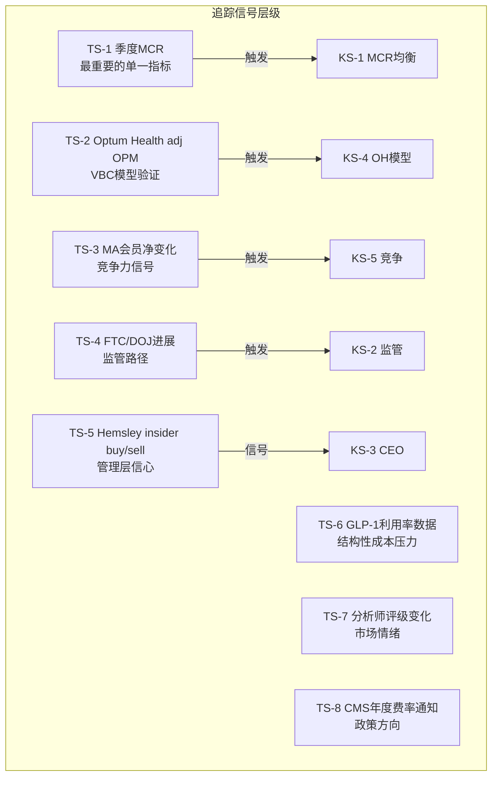
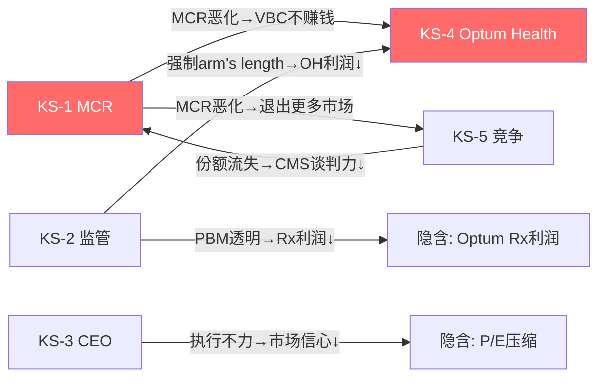

# Chapter 11: 风险预映与追踪框架

> **D4风险认知 + D9追踪体系**: KS/TS初稿，覆盖MCR/监管/CEO/Optum/竞争5个维度
> Phase 1建立框架，Phase 4红队后更新置信度

## 11.1 Kill Switch矩阵 (5个核心KS)

### KS-1: MCR均衡水平 (主控变量)

| 字段 | 值 |
|------|---|
| **条件** | UNH季度MCR持续>88%超过4个季度 |
| **阈值** | 连续4Q MCR > 88% |
| **数据源** | UNH季度earnings release, CMS MA率 |
| **检查频率** | 每季度 |
| **当前值** | 88.9% (FY2025), 2026 guidance 88.8%±50bps |
| **触发距离** | 当前已在阈值区间 — 2026Q1-Q2是关键验证窗口 |
| **依赖KS** | KS-5(竞争)影响MCR趋势 |
| **触发动作** | 如果2026H1 MCR>88% → β/γ假说强化 → 评级从"中性关注"下调至"审慎关注" |
| **置信度** | 50% (β假说84-87%最可能) |
| **最后检查** | 2026-01-27 (Q4 2025 earnings) |
| **历史记录** | FY2023 ~84%, FY2024 85.5%, FY2025 88.9% — 连续恶化中 |
| **备注** | 2026 CMS +5.06%费率增长是MCR改善的最大利好，如果这个利好下MCR仍>88%，说明问题是结构性的 |

### KS-2: 监管路径 (FTC/DOJ)

| 字段 | 值 |
|------|---|
| **条件** | FTC/DOJ采取结构性行动(强制分拆Optum/禁止纵向整合) |
| **阈值** | 正式提起分拆诉讼 或 立法通过"Patients Over Profits Act" |
| **数据源** | FTC/DOJ公告, 国会记录, SEC filing |
| **检查频率** | 月度 |
| **当前值** | FTC: Optum Rx"取得重大进展"和解中; DOJ: 反垄断调查进行中 |
| **触发距离** | FTC和解可能在2026年落地(温和); DOJ分拆诉讼概率<20% |
| **依赖KS** | 独立(不依赖其他KS) |
| **触发动作** | 如果分拆诉讼提起 → 协同溢价$47B归零 → SOTP降至$150-210 → 评级"审慎关注" |
| **置信度** | 15% (Trump行政部门倾向放松而非加强反垄断) |
| **最后检查** | 2026-02 (Express Scripts和解后) |
| **历史记录** | 2024.2 DOJ开启调查, 2024.9 FTC提起PBM行政诉讼, 2025.9 PPA提出 |
| **备注** | Trump DOJ可能放缓反垄断执法 — 但公众对保险行业的愤怒是跨党派的 |

### KS-3: CEO执行力验证

| 字段 | 值 |
|------|---|
| **条件** | Hemsley在2026年未能恢复盈利轨迹(adj EPS < $17.75 guidance) |
| **阈值** | 2026 adj EPS < $16.00 (guidance下限-10%) |
| **数据源** | 季度earnings, management guidance |
| **检查频率** | 每季度 |
| **当前值** | 2026 guidance adj EPS > $17.75 |
| **触发距离** | 需2026全年执行验证 |
| **依赖KS** | KS-1(MCR)直接影响EPS |
| **触发动作** | 如果adj EPS < $16 → 管理层可信度崩溃 → P/E可能从14x→11x → 股价$175-195 |
| **置信度** | 30% (Hemsley买入$25M @$288是正面信号) |
| **最后检查** | 2026-01-27 (guidance发布) |
| **历史记录** | Witty: 2025.5辞职+暂停guidance; Hemsley: 2025.5回归+$25M自购 |
| **备注** | Hemsley是Optum缔造者，最了解如何恢复Optum利润。但DOJ刑事调查是个人风险 |

### KS-4: Optum Health模型验证

| 字段 | 值 |
|------|---|
| **条件** | Optum Health adj OPM持续<3%超过6个季度 |
| **阈值** | 连续6Q adj OPM < 3% |
| **数据源** | 季度分部earnings |
| **检查频率** | 每季度 |
| **当前值** | FY2025 adj OPM 2.3% (GAAP亏损) |
| **触发距离** | 当前已在阈值以下 — 2026H1是验证窗口 |
| **依赖KS** | KS-1(MCR)影响VBC利润; KS-2(监管)影响self-dealing定价 |
| **触发动作** | 如果Optum Health持续无法盈利 → VBC模型被证伪 → 身份B概率从40%降至20% → 估值下移$30-50/股 |
| **置信度** | 40% (退出低效市场可能改善OPM) |
| **最后检查** | 2026-01-27 |
| **历史记录** | FY2023 adj OPM ~5.4%, FY2024 ~4.0%, FY2025 2.3% — 持续恶化 |
| **备注** | Optum Health的$50-55B商誉是减值炸弹。如果模型证伪，减值可能$10-20B |

### KS-5: 竞争格局变化 (Humana超越)

| 字段 | 值 |
|------|---|
| **条件** | Humana MA会员超过UNH成为最大MA保险商 |
| **阈值** | Humana MA会员 > UNH MA会员(年度) |
| **数据源** | CMS enrollment数据, 公司earnings |
| **检查频率** | 半年 |
| **当前值** | UNH 9.4M vs Humana 7.0M (差距2.4M) |
| **触发距离** | UNH -1.3M(26E) + Humana +1M(趋势) → 2026底差距可能收窄至0.1M |
| **依赖KS** | KS-1(MCR)影响UNH退出速度 |
| **触发动作** | 如果Humana超越 → UNH失去"最大MA保险商"标签 → CMS谈判力削弱 → 长期MCR压力 |
| **置信度** | 35% (2026底接近交叉点) |
| **最后检查** | 2026-01 (CMS enrollment数据) |
| **历史记录** | 2020: UNH 5.8M vs HUM 4.8M; 2025: UNH 9.4M vs HUM 7.0M |
| **备注** | Humana在激进扩张，但HUM自身也面临MCR恶化(P/E 17.3x, OPM 1.1%) |

## 11.2 Tracking Signals (TS)

| TS编号 | 信号 | 当前值 | 下次检查 | 升级/降级含义 |
|--------|------|--------|---------|-------------|
| TS-1 | 季度MCR | 88.9%(FY25) | 2026-04 (Q1'26) | <87%=升级信号, >89%=降级 |
| TS-2 | OH adj OPM | 2.3% | 2026-04 | >4%=VBC回暖, <2%=模型失效 |
| TS-3 | MA会员净变化 | -1.3M(26E) | 2026-10 (OEP后) | 降幅<预期=正面 |
| TS-4 | FTC/DOJ进展 | 和解中/调查中 | 月度 | 和解=利好, 诉讼=利空 |
| TS-5 | Hemsley交易 | 2025.5买$25M | 季度 | 继续买=信心, 卖=警报 |
| TS-6 | GLP-1利用率 | 快速增长 | 半年 | 增速放缓=MCR利好 |
| TS-7 | 分析师评级 | 18买/6持/2卖 | 月度 | 下调=情绪恶化 |
| TS-8 | CMS 2027费率 | 2026秋预通知 | 2026-10 | +4%+=正面, <3%=负面 |

## 11.3 慢变量识别

**这些变量不会在单季度触发KS，但持续累积可能在2-5年内重塑UNH的利润结构：**

| 慢变量 | 方向 | 年化影响 | 累积效应(5年) | 监测方法 |
|--------|------|---------|-------------|---------|
| 人口老龄化 | MCR↑ | +0.5-1% 利用率 | 医疗支出+3-5% | Census数据 |
| GLP-1药物普及 | MCR↑ | +$2-5B行业成本 | 可能成为最大单项成本 | 处方数据+PBM报告 |
| PA改革(CMS) | MCR↑ | 限制拒赔→支付↑ | OPM可能永久-0.5-1% | CMS规则更新 |
| PBM透明化 | Rx利润↓ | -$1.5-2.5B | 商业模式重塑 | CAA执行+州法 |
| Provider摩擦→立法 | 利润↓ | 视立法力度 | PPA如通过=结构性冲击 | 国会进展 |
| AI效率提升 | 成本↓ | +$1B(2026管理层预期) | 可能部分抵消上述压力 | AI投资ROI |

**净效应**: 向上慢变量(AI)可能贡献$1B+/年 vs 向下慢变量(GLP-1+PA+PBM+人口)可能消耗$3-6B/年。**净向下$2-5B/年 — 这是MCR均衡无法回到82-83%的根本原因。**

## 11.4 KS条件依赖网络

**最危险的组合**: KS-1(MCR恶化) + KS-2(监管落地) + KS-4(OH证伪) 三者同时触发。
- 概率: ~5-8% (三者独立概率的乘积+相关性调整)
- 影响: EPS可能降至$8-10, P/E 10-12x → 股价$80-120 (-60-72%)
- 对策: 这是"黑天鹅"级别风险，需要在P4红队中压力测试

**最可能的路径**: KS-1(β假说确认) + KS-3(Hemsley部分恢复) → MCR稳定在86-87%, EPS恢复至$18-20, P/E 16-17x → 股价$290-340 (+2-20%)
