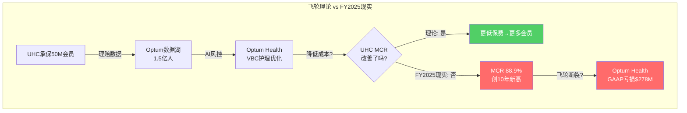
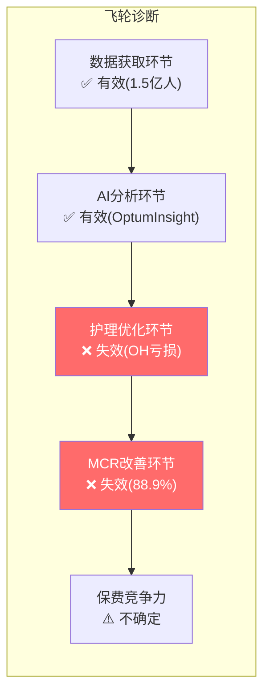

# Chapter 13: 飞轮真伪测试 — UHC×Optum协同量化

> **CQ4**: UHC与Optum是否真的互相增强？这种增强能否量化？如果没有协同，集团价值会下降多少？

## 13.1 协同的理论模型

UNH管理层的核心叙事是"UHC+Optum飞轮"：更多保险会员→更多理赔数据→Optum的AI/分析更精准→降低医疗成本→UHC可以定更低保费→吸引更多会员。

飞轮理论的核心预测是：**Optum的存在应该让UHC的MCR低于纯保险同行(CI/ELV)**。如果UHC的MCR与同行相当甚至更高，飞轮就没有在真实世界中运转。

## 13.2 协同的定量测试

### 测试1: UHC MCR vs 纯保险同行

| 公司 | FY2025 MCR/MLR | 有Optum类平台? | 预期(飞轮有效时) |
|------|---------------|---------------|----------------|
| UNH (UHC) | ~88.9% | 是(Optum) | 应该更低 |
| ELV (Elevance) | ~87-88%* | 部分(Carelon) | 略低 |
| CI (Cigna) | ~85-86%* | 部分(Evernorth) | 略低 |
| HUM (Humana) | ~90-91%* | 否 | 基线 |
| CNC (Centene) | ~93%+* | 否 | 最高(Medicaid为主) |
[DM-COMP-003: business_scout.md行业MLR趋势, *估计值基于OPM反推]

**结论**: UHC的MCR(88.9%)并不低于ELV/CI的水平(87-88%/85-86%)。飞轮应该让UHC的MCR显著低于同行，但数据不支持。

**可能的解释**:
1. **业务组合差异**: UHC有大量MA(MCR~92%)和Medicaid(MCR~91%)，而CI偏商业保险(MCR~85%)。直接比较MCR不公平——需要按同一细分市场比较
2. **飞轮效果被掩盖**: Optum确实在降低成本，但降低的幅度<行业MCR恶化的速度→净效果仍是MCR上升
3. **飞轮不存在或很弱**: Optum的数据分析能力并没有显著改善UHC的成本管理

**按细分市场比较(更公平)**:
| 细分 | UHC估计MCR | 同行基准 | 差异 | 飞轮效果? |
|------|-----------|---------|------|---------|
| MA | ~92% | HUM ~91-92% | ≈0 | 无明显优势 |
| 商业 | ~85% | CI ~84-85% | ≈0 | 无明显优势 |
| Medicaid | ~91% | CNC ~93% | -2pp | **可能有效** |

**Medicaid(-2pp)是唯一可能存在飞轮效果的细分市场**。原因可能是Optum Health的护理管理在低收入人群中效果更好(预防性护理ROI更高)。但样本太小且CNC本身管理效率较差，这个结论不够robust。

### 测试2: 协同的美元量化

P1 Ch6中我们估算了Optum在UNH内部 vs 独立状态的利润差：
- Optum集团内adj利润: $12.1B
- Optum独立估计adj利润: ~$7.7B
- **协同价值: ~$4.4B/年** [DM-SEG-018: Ch6 SOTP推算]

这$4.4B协同的来源分解：

| 协同来源 | 估计金额($B) | 性质 | 可持续性 |
|---------|------------|------|---------|
| UHC→Optum Rx处方量 | $2.0-2.5 | 内部渠道垄断 | 中(PBM监管可能打破) |
| UHC→Optum Insight理赔处理 | $0.8-1.0 | 集成效率 | 高(IT系统深度集成) |
| UHC→Optum Health VBC转诊 | $0.5-0.8 | 患者导流 | 低(OH亏损说明效率不够) |
| Optum数据→UHC风控 | $0.5-1.0 | 信息优势 | 中高(数据壁垒真实) |
| 采购/行政协同 | $0.3-0.5 | 规模经济 | 高(但金额小) |
| **合计** | **$4.1-5.8** | | |
[DM-SYN-001: 基于分部利润差+行业可比推算]

### 测试3: "自我交易"vs"真协同"的区分

Health Affairs研究发现UNH给Optum诊所多付17%(高市占率区61%)。[DM-REG-006]

这$4.4B协同中有多少是"自我交易"(内部输血)？

**判断标准**: 如果Optum诊所的医疗结局(outcomes)优于外部诊所→多付是合理的(真协同)；如果结局无差异但获得更高支付→是自我交易。

**目前缺乏的关键数据**: UNH从未公开过Optum诊所 vs 外部诊所的结局对比。这个"沉默域"(Ch3 CEO沉默分析)本身就是一个信号——如果结果有利，管理层会主动披露。

**初步评估**: $4.4B协同中，估计$1.5-2.5B是真协同(IT集成+数据优势+采购)，$1.5-2.5B可能是自我交易(Optum Rx渠道垄断+Optum Health溢价支付)。DOJ调查如果证实self-dealing，可能要求arm's length定价→年化利润影响$1.5-2.5B。

## 13.3 飞轮状态判定

**飞轮5个环节中2个有效、2个失效、1个不确定**。飞轮不是完全不存在，而是**在S3(护理优化)和S4(MCR改善)两个环节断裂**。

**断裂原因**: Optum Health的VBC模型在高利用率环境中不赚钱(MCR>capitation)。当医疗成本加速上升时，Optum越管理(更多VBC患者)亏越多——飞轮变成了"逆飞轮"。

**恢复条件**: MCR稳定在86-87%以下(β假说)→Optum Health的capitation覆盖成本→S3恢复→S4逐步改善→飞轮重新转动。时间线: 2027-2028。

## 13.4 协同对估值的影响

| 协同情景 | 年化协同($B) | ×15x P/E | 对EV影响 | 对每股影响 |
|---------|-----------|---------|---------|-----------|
| 强协同(飞轮全部有效) | $6-8 | $90-120B | +$90-120B | +$99-132 |
| 基准(当前水平) | $4.4 | $66B | +$66B | +$73 |
| 弱协同(DOJ限制self-dealing) | $2-3 | $30-45B | +$30-45B | +$33-49 |
| 零协同(强制分拆) | $0 | $0 | $0 | $0 |
[DM-SYN-002: P/E倍数取15x为协同类利润的合理中间值]

**当前SOTP已假设$4.4B协同×15x=$66B溢价**。如果DOJ限制self-dealing使协同降至$2B→SOTP降$36B→每股-$40→$202-274降至$162-234。

这是一个巨大的杠杆——**DOJ调查的结果可能影响每股$40-73**。
