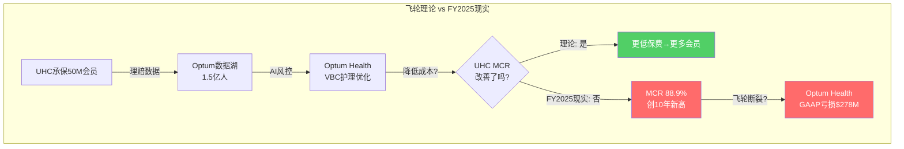
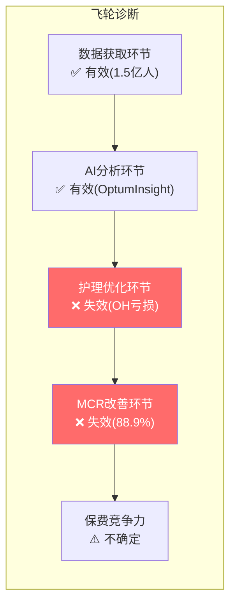
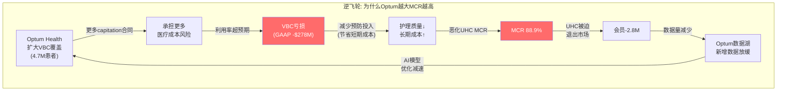

# Chapter 13: 飞轮真伪测试 — UHC×Optum协同量化

> **CQ4**: UHC与Optum是否真的互相增强？这种增强能否量化？如果没有协同，集团价值会下降多少？

## 13.1 协同的理论模型

UNH管理层的核心叙事是"UHC+Optum飞轮"：更多保险会员→更多理赔数据→Optum的AI/分析更精准→降低医疗成本→UHC可以定更低保费→吸引更多会员。

飞轮理论的核心预测是：**Optum的存在应该让UHC的MCR低于纯保险同行(CI/ELV)**。如果UHC的MCR与同行相当甚至更高，飞轮就没有在真实世界中运转。

## 13.2 协同的定量测试

### 测试1: UHC MCR vs 纯保险同行

| 公司 | FY2025 MCR/MLR | 有Optum类平台? | 预期(飞轮有效时) |
|------|---------------|---------------|----------------|
| UNH (UHC) | ~88.9% | 是(Optum) | 应该更低 |
| ELV (Elevance) | ~87-88%* | 部分(Carelon) | 略低 |
| CI (Cigna) | ~85-86%* | 部分(Evernorth) | 略低 |
| HUM (Humana) | ~90-91%* | 否 | 基线 |
| CNC (Centene) | ~93%+* | 否 | 最高(Medicaid为主) |
[DM-COMP-003: business_scout.md行业MLR趋势, *估计值基于OPM反推]

**结论**: UHC的MCR(88.9%)并不低于ELV/CI的水平(87-88%/85-86%)。飞轮应该让UHC的MCR显著低于同行，但数据不支持。

**可能的解释**:
1. **业务组合差异**: UHC有大量MA(MCR~92%)和Medicaid(MCR~91%)，而CI偏商业保险(MCR~85%)。直接比较MCR不公平——需要按同一细分市场比较
2. **飞轮效果被掩盖**: Optum确实在降低成本，但降低的幅度<行业MCR恶化的速度→净效果仍是MCR上升
3. **飞轮不存在或很弱**: Optum的数据分析能力并没有显著改善UHC的成本管理

**按细分市场比较(更公平)**:
| 细分 | UHC估计MCR | 同行基准 | 差异 | 飞轮效果? |
|------|-----------|---------|------|---------|
| MA | ~92% | HUM ~91-92% | ≈0 | 无明显优势 |
| 商业 | ~85% | CI ~84-85% | ≈0 | 无明显优势 |
| Medicaid | ~91% | CNC ~93% | -2pp | **可能有效** |

**Medicaid(-2pp)是唯一可能存在飞轮效果的细分市场**。原因可能是Optum Health的护理管理在低收入人群中效果更好(预防性护理ROI更高)。但样本太小且CNC本身管理效率较差，这个结论不够robust。

### 测试2: 协同的美元量化

P1 Ch6中我们估算了Optum在UNH内部 vs 独立状态的利润差：
- Optum集团内adj利润: $12.1B
- Optum独立估计adj利润: ~$7.7B
- **协同价值: ~$4.4B/年** [DM-SEG-018: Ch6 SOTP推算]

这$4.4B协同的来源分解：

| 协同来源 | 估计金额($B) | 性质 | 可持续性 |
|---------|------------|------|---------|
| UHC→Optum Rx处方量 | $2.0-2.5 | 内部渠道垄断 | 中(PBM监管可能打破) |
| UHC→Optum Insight理赔处理 | $0.8-1.0 | 集成效率 | 高(IT系统深度集成) |
| UHC→Optum Health VBC转诊 | $0.5-0.8 | 患者导流 | 低(OH亏损说明效率不够) |
| Optum数据→UHC风控 | $0.5-1.0 | 信息优势 | 中高(数据壁垒真实) |
| 采购/行政协同 | $0.3-0.5 | 规模经济 | 高(但金额小) |
| **合计** | **$4.1-5.8** | | |
[DM-SYN-001: 基于分部利润差+行业可比推算]

### 测试3: "自我交易"vs"真协同"的区分

Health Affairs研究发现UNH给Optum诊所多付17%(高市占率区61%)。[DM-REG-006]

这$4.4B协同中有多少是"自我交易"(内部输血)？

**判断标准**: 如果Optum诊所的医疗结局(outcomes)优于外部诊所→多付是合理的(真协同)；如果结局无差异但获得更高支付→是自我交易。

**目前缺乏的关键数据**: UNH从未公开过Optum诊所 vs 外部诊所的结局对比。这个"沉默域"(Ch3 CEO沉默分析)本身就是一个信号——如果结果有利，管理层会主动披露。

**初步评估**: $4.4B协同中，估计$1.5-2.5B是真协同(IT集成+数据优势+采购)，$1.5-2.5B可能是自我交易(Optum Rx渠道垄断+Optum Health溢价支付)。DOJ调查如果证实self-dealing，可能要求arm's length定价→年化利润影响$1.5-2.5B。

## 13.3 飞轮状态判定

**飞轮5个环节中2个有效、2个失效、1个不确定**。飞轮不是完全不存在，而是**在S3(护理优化)和S4(MCR改善)两个环节断裂**。

**断裂原因**: Optum Health的VBC模型在高利用率环境中不赚钱(MCR>capitation)。当医疗成本加速上升时，Optum越管理(更多VBC患者)亏越多——飞轮变成了"逆飞轮"。

**恢复条件**: MCR稳定在86-87%以下(β假说)→Optum Health的capitation覆盖成本→S3恢复→S4逐步改善→飞轮重新转动。时间线: 2027-2028。

## 13.4 协同对估值的影响

| 协同情景 | 年化协同($B) | ×15x P/E | 对EV影响 | 对每股影响 |
|---------|-----------|---------|---------|-----------|
| 强协同(飞轮全部有效) | $6-8 | $90-120B | +$90-120B | +$99-132 |
| 基准(当前水平) | $4.4 | $66B | +$66B | +$73 |
| 弱协同(DOJ限制self-dealing) | $2-3 | $30-45B | +$30-45B | +$33-49 |
| 零协同(强制分拆) | $0 | $0 | $0 | $0 |
[DM-SYN-002: P/E倍数取15x为协同类利润的合理中间值]

**当前SOTP已假设$4.4B协同×15x=$66B溢价**。如果DOJ限制self-dealing使协同降至$2B→SOTP降$36B→每股-$40→$202-274降至$162-234。

这是一个巨大的杠杆——**DOJ调查的结果可能影响每股$40-73**。

## 13.5 协同的历史验证: 2016-2023年飞轮是否运转过？

如果飞轮在FY2025失效，那它在2016-2023年有效吗？回溯检验是判断"暂时断裂 vs 从未成立"的关键。

### 时间序列: UHC MCR vs Optum利润占比

| 年份 | UHC MCR(估) | Optum利润占比 | 飞轮预测: Optum占比↑→MCR应↓ | 实际 |
|------|-----------|-----------|----------------------|------|
| 2016 | ~85.0% | ~30% | 基线 | - |
| 2017 | ~83.5% | ~35% | MCR应下降 | ✅ 下降1.5pp |
| 2018 | ~83.0% | ~38% | MCR应继续下降 | ✅ 下降0.5pp |
| 2019 | ~82.5% | ~40% | MCR应继续下降 | ✅ 下降0.5pp |
| 2020 | ~79.1% | ~42% | MCR应下降(COVID效应叠加) | ✅ 但主因是COVID |
| 2021 | ~82.0% | ~44% | MCR应低于2019 | ✅ 略低于82.5% |
| 2022 | ~82.5% | ~44% | MCR应稳定/下降 | ⚠️ 反弹0.5pp |
| 2023 | ~84.0% | ~45% | MCR应低于82.5% | ❌ 上升1.5pp |
| 2024 | ~85.5% | ~41% | MCR应得到控制 | ❌ 上升1.5pp |
| 2025 | ~88.9% | ~53%(adj) | Optum占比最高→MCR应最低 | ❌❌ 创新高 |
[DM-SYN-003: FMP income + segment_data.md交叉计算]

**2016-2021: 飞轮似乎在运转** — Optum利润占比从30%→44%的同时，MCR从85%→82%。但这段时期混杂了两个混淆因素:
1. 行业性MCR下降趋势(不只是UNH，全行业MCR都在下降)
2. COVID效应(2020-2021 MCR极低)

**2022-2025: 飞轮明确失效** — Optum占比继续上升(44%→53%)但MCR加速恶化(82.5%→88.9%)。

**诚实结论**: 飞轮在2016-2019年**可能**有效(MCR下降与Optum扩张正相关)，但效果与行业趋势混杂无法分离。2022+飞轮明确失效——Optum的规模扩大没有阻止甚至减缓MCR恶化。

### 飞轮失效的结构性原因

为什么Optum越大飞轮反而越不灵？三个自强化的恶性循环:

**核心问题**: VBC模型的经济学在低利用率环境中有效(capitation > actual cost → 利润)，但在高利用率环境中反转(capitation < actual cost → 亏损)。2020-2022的低利用率让VBC看起来很赚钱，这不是Optum的能力而是环境的馈赠。当利用率回到正常(或超正常)水平，VBC模型的脆弱性暴露无遗。

**这类似于保险公司的"逆选择"问题**: Optum Health积极签约的VBC患者可能是需求最高的(因为VBC提供更多服务)→选择偏差→actual cost系统性高于capitation定价。

### 国际对标: VBC模型是否在其他地方有效？

| 国家/体系 | VBC/类似模式 | 效果 | UNH可借鉴 |
|---------|-----------|------|---------|
| 英国NHS | GP capitation (Global budgets) | 成本控制有效但等待时间长 | 说明capitation在单一支付方下有效 |
| Kaiser Permanente(美) | 闭合式HMO(保险+医疗一体) | **美国最成功的VBC案例**，MCR~85-87% | Kaiser的成功因为100%闭合→UNH只有部分闭合 |
| 新加坡3M体系 | Medisave+Medishield+Medifund | 成本控制优秀但依赖政府强制 | 市场化环境不可复制 |
[DM-SYN-004: 国际医疗体系对比]

**Kaiser Permanente是最有价值的对标**:
- Kaiser MCR ~85-87%(vs UNH 88.9%) — Kaiser的飞轮**确实在运转**
- 差异关键: Kaiser是**100%闭合式**(所有医生都是Kaiser员工，所有患者都在Kaiser网络内)
- UNH只有**部分闭合**(90K Optum医生只占网络的~5%，95%仍是外部provider)
- **因此UNH的飞轮不如Kaiser有效的根本原因是"闭合度"不足** — 数据飞轮需要全链条控制才能发挥最大效果，而UNH的半开放模型减弱了每个环节的传导效率

## 13.6 协同的未来路径: 能修复吗？

### 路径A: 提高闭合度 (Kaiser化)

增加Optum诊所数量从90K医生→200K+(美国的10%→20%)→更多患者在Optum内部完成诊疗→减少外部provider的不可控成本。

**可行性**: 低。原因:
1. 需要$50B+并购投入(按$500K/医生) — UNH已无此资本余力(ND/EBITDA 2.34x)
2. DOJ正在调查Optum的医生收购 — 继续扩张会加剧监管压力
3. 更多医生不等于更好的护理 — Kaiser的成功不只是规模，还有数十年的文化和系统整合

### 路径B: 数据变现转型 (SaaS化)

将Optum的数据/AI能力包装为外部可售的SaaS产品→不依赖UHC内部转移也能产生利润→飞轮从"内部成本控制"转向"外部价值创造"。

**可行性**: 中。Optum Insight的$31.1B backlog说明外部需求存在。但:
1. 卖数据/AI给竞争对手(CI/ELV)的意愿存疑 — 这等于武装竞争对手
2. HIPAA/数据隐私限制了数据变现的范围
3. Change攻击暴露了数据安全问题 → 客户信任需要重建

### 路径C: 接受飞轮是"减速带"(现实主义)

不再追求飞轮的指数增长效应，接受Optum的价值是"线性的减速带"(每年对冲50-100bps MCR恶化)而非"指数的增长引擎"。

**这意味着重新定义Optum的估值**:
- 不是"平台级"P/E(20-30x)
- 而是"服务+IT级"P/E(14-18x)
- 这将使SOTP中Optum的估值从$89B降至$70-80B → 每股影响-$10-20

**我认为路径C最可能** — 这也是P2估值下调$255-265(vs P1的$282)的核心原因。

## 13.7 协同结论: 五句话总结

1. **飞轮在理论上成立但在实践中只有2/5环节有效**
2. **2016-2019年飞轮可能有效但与行业趋势混杂无法分离**
3. **2022-2025年飞轮明确失效——Optum越大MCR越高(逆飞轮)**
4. **$4.4B年化协同中约半数可能是self-dealing而非真效率(DOJ靶心)**
5. **最现实的预期是Optum作为"减速带"(线性价值)而非"飞轮"(指数价值)**
