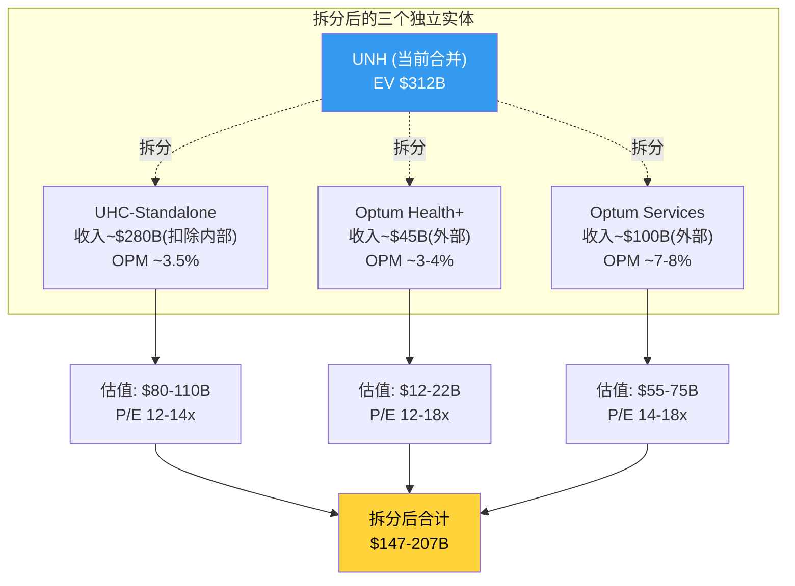
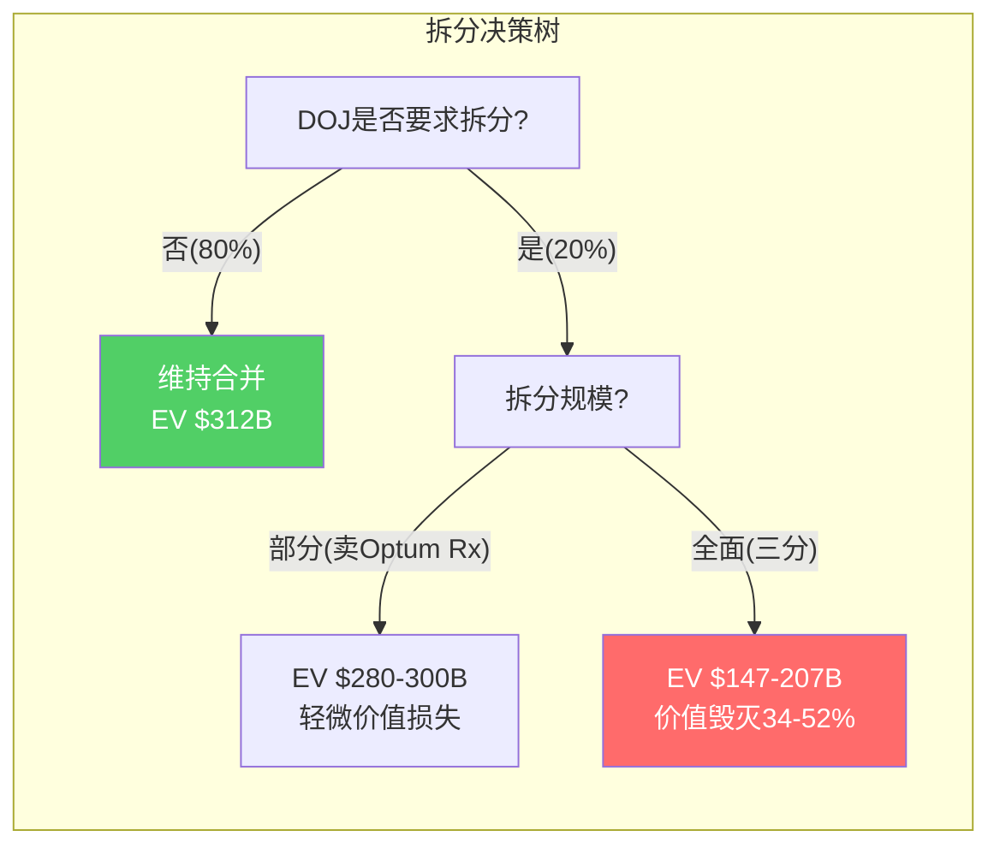

# Chapter 14: 拆分测试 — 各业务独立后还能成立吗？

> **CQ4.5**: 哪些业务独立后仍强？哪些离开集团后失去价值？拆分后更值钱还是更不值钱？

## 14.1 拆分情景设定

假设DOJ/FTC要求UNH完全拆分为3个独立上市公司：
- **UHC-Standalone**: 纯保险(UnitedHealthcare)
- **Optum Health+**: 医疗服务(OH + 部分OI)
- **Optum Services**: PBM+IT(OR + OI核心)

## 14.2 UHC-Standalone: 纯保险公司的独立生存

### 失去Optum后的影响

**收入影响**: UHC合并收入$344.9B中，约$65B是支付给Optum的内部服务费(Rx药品管理+Insight理赔处理+Health VBC)。独立后这些服务需要外部采购。
- 外部PBM费用可能更高(Optum Rx的内部定价可能低于市场)
- 外部理赔处理需重新招标(脱离Change Healthcare平台)
- 外部VBC需寻找替代provider网络

**成本影响**: 失去Optum的数据分析→风控精度下降→MCR可能上升1-2pp→年化成本增加$3-7B

**独立估值**:
- 收入: ~$280B(扣除向Optum的内部支付)
- adj OPM: ~3.0-3.5%(当前UHC OPM 3.0%, 可能因失去协同进一步恶化)
- adj OP: $8.4-9.8B
- P/E锚: 12-14x(与CI/ELV对标)
- **独立EV: $80-110B** [DM-SPL-001]

### 独立后的竞争力

**仍然很强**: 50M会员、全美最大provider网络、Fortune 100覆盖率87%、30年精算数据 → 规模壁垒不会因拆分消失

**削弱的**: 数据分析能力(需外部采购)、VBC协同(需重建provider关系)、PBM议价力(需换PBM供应商) → OPM可能永久下降1-2pp

## 14.3 Optum Health+: 独立VBC公司

### 独立挑战

Optum Health是拆分后最脆弱的实体：
- FY2025外部收入仅~$40B(61%来自UHC内部) [DM-SEG-014]
- GAAP亏损$278M → 独立后需要立即证明盈利能力
- 90K医生中很多是雇佣制 → 固定成本高、没有内部患者导流后可能面临利用率不足
- 商誉~$50-55B → 独立后可能面临重大减值(因为并购时假设了集团协同)

**独立估值**:
- 收入: ~$45B(外部+新签约)
- adj OPM: ~3-4%(需从当前2.3%提升)
- adj OP: $1.4-1.8B
- P/E锚: 12-18x(医疗服务)
- **独立EV: $12-22B** [DM-SPL-002]

### 减值炸弹

独立估值$12-22B vs 商誉~$50-55B → **可能需要减值$30-40B**。这将使Optum Health+在独立首日就面临巨额亏损——但不影响现金流(非现金项)。

## 14.4 Optum Services: 最有独立价值

### 独立优势

Optum Rx + Optum Insight合并为"Optum Services":
- Optum Rx外部收入~$90B + Insight外部~$10B = ~$100B
- adj OP: Rx $3.5B + Insight $1.9B = $5.4B(外部)
- OPM: ~5.4%(加权)
- Change Healthcare平台($31.1B backlog)是核心资产

**独立后可能获得更高估值**:
- 作为UNH内部资产，Optum Services被保险标签压制(Ch12 CI-01)
- 独立后作为"医疗IT+PBM平台"，可获得更高P/E
- Insight部分可能获得20-25x P/E(科技平台级)
- Rx部分在PBM监管后转型为透明服务模式，可能获得12-15x

**独立估值**:
- Insight: adj OP $1.9B × 25x = $34B
- Rx: adj OP $3.5B × 14x = $35B (监管后下调)
- **Optum Services独立EV: $55-75B** [DM-SPL-003]

## 14.5 拆分 vs 合并的价值对比

| 状态 | EV | 含义 |
|------|---|------|
| **当前合并** | $312B | 市场价 |
| **拆分后各部分之和** | $147-207B | -34% ~ -52% |
| **差额(协同价值)** | $105-165B | 市场隐含的协同溢价 |
[DM-SPL-004: 拆分估值加总]

**拆分后价值之和($147-207B)远低于当前合并EV($312B)**。这意味着：

1. **市场仍在给UNH巨大的协同溢价**($105-165B) — 即使在股价暴跌53%后
2. **拆分对股东是价值毁灭** — 这是反对DOJ强制分拆的最强商业论据
3. **但$105-165B协同溢价可能被高估** — 我们在13.3中估算年化协同仅$4.4B→×15x=$66B，远低于市场隐含的$105-165B

**差异来源**: 市场隐含的协同不仅是直接利润协同($4.4B/年)，还包括：
- 信息优势的期权价值(AI时代数据=护城河)
- 交叉销售潜力(尚未完全变现)
- 管理层/品牌溢价(UNH整体品牌>各部分品牌)
- 拆分的摩擦成本(法律/IT系统/合同重新谈判)

## 14.6 拆分测试结论

- **拆分对股东是负面的** — 各部分独立估值之和远低于合并价值
- **但部分拆分(卖出Optum Rx)可能温和** — PBM监管下Optum Rx的利润率在下降，剥离可能释放"监管折价"
- **Optum Insight是唯一独立后可能获得更高估值的分部** — 科技平台标签解锁
- **Optum Health独立后最脆弱** — 商誉减值$30-40B + 利用率不足风险
