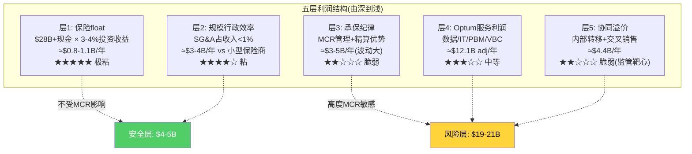
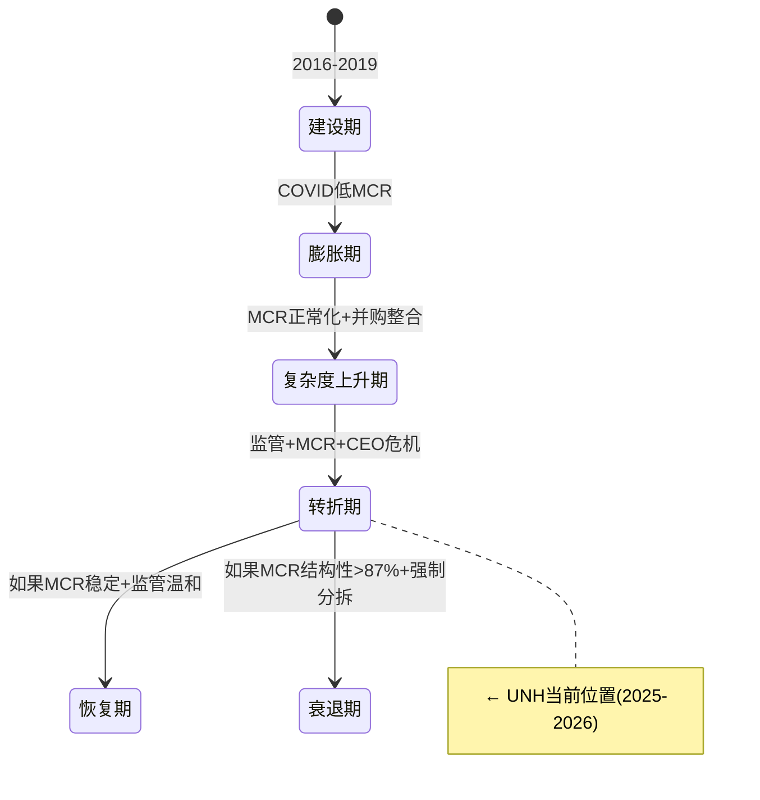
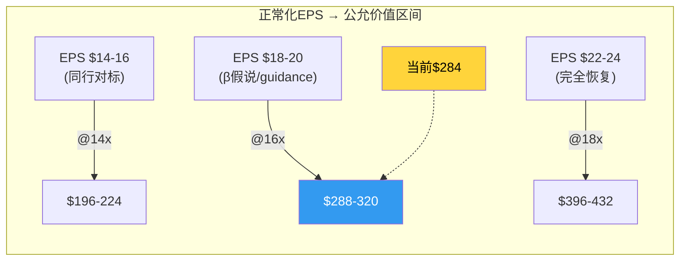

# Chapter 15: 盈利模式解剖 — 利润从哪里来，哪些更粘，哪些更脆弱

> **CQ6**: 利润来自承保纪律、服务协同、规模、制度优势，还是议价力？UNH现在处于哪一个阶段？

## 15.1 五层利润来源拆解

UNH的利润不是来自单一来源，而是五个层级的叠加。每层的粘性、风险和可持续性截然不同：

### 层1: 保险float (最深层，最粘)

保险公司先收保费后付医疗费→中间持有大量现金(float)→投资赚取收益。
- UNH现金+短期投资: $28.1B [DM-BS-003: FMP balance, cashAndShortTermInvestments]
- 长期投资: $54.3B [DM-BS-004: FMP balance, longTermInvestments]
- 投资组合合计: ~$82B
- FY2025利息费用$4.0B但投资收入被包含在non-operating income中
- 估计年投资收益$2-3B(net of interest)

**粘性评级**: ★★★★★ — float是保险公司的"免费杠杆"，只要有会员就有float，不受MCR波动影响。即使在MCR 92%的Q4 2025，float仍在产生收益。

### 层2: 规模行政效率 (中深层，较粘)

UNH作为$448B收入的巨头，行政成本(SG&A/opex除医疗成本)的效率远高于小型保险商。
- FMP显示SG&A/Revenue = 0%(这是数据问题——UNH不单独披露SG&A，全部在operating expenses中)
- operating expenses $64.0B包含了医疗管理成本+行政成本+折旧+一次性charges
- 剥离后的行政效率比率需要从10-K详细notes中提取

**规模效率的证据**: UHC的OPM即使在FY2025最差情况(3.0%)仍高于CNC(-3.9%)——部分原因是规模带来的行政成本分摊优势。

**粘性评级**: ★★★★☆ — 规模效率不会因MCR波动而消失。但如果大规模退出会员(2026 -2.8M)，固定成本分摊会恶化。

### 层3: 承保纪律 (浅层，脆弱)

承保纪律 = 精准定价+风险选择+保费调整+准备金管理。
- 2016-2023: UNH的承保纪律被认为是行业最佳(MCR稳定在82-84%)
- 2024-2025: MCR飙升至88.9%——承保纪律"失效"

**失效原因分析**:
- 不是UNH忘了怎么承保，而是外部变量变化速度>定价调整速度
- CMS MA费率有1-2年滞后(基于前2年FFS数据)
- GLP-1药物成本在2024-2025年爆发式增长，没有任何保险商提前定价
- 新入MA会员的acuity比精算预期高2x [DM-BIZ-009]

**粘性评级**: ★★☆☆☆ — 承保纪律是"能力"(粘)但MCR是"环境"(不粘)。能力仍在，但环境恶化时能力无法阻止MCR上升。

### 层4: Optum服务利润 (中层，中等粘性)

Optum adj营业利润$12.1B来自三线：
- Rx $6.1B: 规模PBM利润，主要来自rebate/spread/specialty → 正在被监管重构
- Insight $3.7B: 数据/IT服务，backlog驱动 → 最稳定
- Health $2.3B: VBC管理费 → 当前最脆弱

**粘性评级**: ★★★☆☆ — Insight高粘(backlog $31.1B)，Rx中粘(规模壁垒)但监管下降，Health低粘(亏损)

### 层5: 协同溢价 (最浅层，最脆弱)

$4.4B/年来自内部转移定价优势。这是监管靶心——DOJ/FTC都在审查。

**粘性评级**: ★★☆☆☆ — 完全取决于监管结果

## 15.2 UNH处于哪个阶段？ (CQ6.5)

**当前位于"转折期"** — 处在恢复期和衰退期的分岔口。判断依据：

**偏向恢复期的信号**:
1. 2026 CMS费率+5.06%(历史最大增幅之一)
2. 管理层主动退出不赚钱市场(理性决策)
3. Hemsley回归+$25M自购(内部人信心)
4. FCF仍$16.1B(现金创造能力未崩塌)
5. Piotroski 7/9(财务健康)

**偏向衰退期的信号**:
1. DOJ刑事+民事调查(前所未有的监管压力)
2. Q4 2025近零利润(可能含结构性问题)
3. Optum Health VBC模型未证明(GAAP亏损)
4. 商誉$110.5B(减值炸弹)
5. GLP-1成本持续上升(结构性)

**我的评估**: 55:45偏向恢复期。核心依据：MCR在保费定价追赶后大概率在2026H2-2027稳定在86-87%(β假说50%概率)，而DOJ强制分拆概率<20%(Trump行政部门倾向放松执法)。

## 15.3 利润结构对投资的含义

| 利润层 | 金额($B/年) | MCR敏感度 | 监管敏感度 | 投资者应关注的 |
|--------|-----------|---------|-----------|-------------|
| Float | $2-3 | 无 | 无 | 利率环境 |
| 规模效率 | $3-4 | 低 | 低 | 会员规模趋势 |
| 承保纪律 | $3-5 | **极高** | 中(CMS费率) | MCR季度趋势 |
| Optum服务 | $12.1 adj | 高(OH) | **极高**(Rx) | OH adj OPM + FTC进展 |
| 协同溢价 | $4.4 | 中 | **极高** | DOJ调查 + 立法 |
| **合计** | **$24-29 adj** | | | |

**最大风险集中在层3(承保)+层5(协同)** — 这两层合计$7-10B，都是高MCR/高监管敏感。如果两者同时恶化(MCR>88% + DOJ限制self-dealing)→adj利润从$22B降至$15-17B→adj EPS $13-15→@14x P/E→股价$180-210。

**最大机会在层4(Optum服务)** — 如果OH恢复(adj OPM>5%)+Insight增长(backlog转化)→Optum adj利润从$12.1B升至$15B→adj EPS $20+→@17x P/E→股价$340+。

## 15.4 利润周期性分析: UNH是周期股吗？

### 历史OPM周期

| 周期 | 时期 | OPM范围 | 驱动力 | 持续时间 |
|------|------|---------|--------|---------|
| 上行1 | 2016-2019 | 7.0%→8.1% | Optum建设+MA扩张 | 4年 |
| 高峰 | 2020-2021 | 8.7%-8.3% | COVID低MCR | 2年 |
| 上行2 | 2022-2023 | 8.8%-8.7% | 利用率缓慢恢复 | 2年 |
| **下行** | **2024-2025** | **8.1%→4.2%** | **MCR恶化+charges** | **2年** |
| 恢复? | 2026-2028E | 5.0%→7.0%E | 保费追赶+退出策略 | 2-3年E |
[DM-FIN-018: FMP income OPM时间序列]

**OPM的周期长度约4-6年(从谷到谷)**: 2016(7.0%) → 2025(4.2%) → 2030E(?)。如果这个模式成立，下一个OPM低谷可能在2030-2032年。

**这支持"UNH有周期性但不是纯周期股"的判断**: OPM波动范围4-9%(约5pp)，这比银行(ROE波动10-20pp)小，但比消费品(OPM波动2-3pp)大。UNH更准确的定位是"弱周期股"——被市场当作防御股是一个定价错误。

### OPM底部在哪里？

历史最低OPM:
- FY2016: 7.0%(因ACA交易所退出的charges)
- FY2025: **4.2%**(MCR恶化+一次性charges)
- Q4 2025单季度: **0.3%**(极端charges)

**4.2%是否就是底部？** 两种可能:

1. **是底部(60%概率)**: FY2025包含大量一次性项目(Optum Health减记+Change残余+年末准备金集中释放)。剥离这些后"真实"OPM约5.0-5.5% → 2026将从5%基础恢复
2. **不是底部(40%概率)**: 如果GLP-1成本继续爆发+DOJ限制self-dealing生效+PA改革增加支付→2026 OPM可能进一步降至3.5-4.0%

**管理层的2026 guidance隐含OPM**: 收入>$439B × adj EPS>$17.75 × 910M股 × (1/(1-22%)) = adj OP ~$20.7B → adj OPM ~4.7%。这比FY2025 GAAP 4.2%只好0.5pp——**管理层自己也不预期快速恢复**。

## 15.5 利润结构的终局: UNH的"正常"盈利是多少？

这是整份报告最关键的问题之一。所有估值最终取决于"正常化EPS"的假设。

### 正常化EPS的5种估算方法

| 方法 | 假设 | 正常化adj EPS | 逻辑 |
|------|------|-------------|------|
| 1. 历史中位OPM | OPM 7.5%(2016-2023中位) | $22-24 | 假设回到历史均值 |
| 2. β假说OPM | OPM 6.0-6.5%(扣除COVID虚胖+GLP-1) | **$18-20** | 最可能的新均衡 |
| 3. 同行对标OPM | OPM 4.5-5.0%(CI/ELV加权) | $14-16 | 保守: 假设无Optum溢价 |
| 4. 管理层guidance | adj EPS >$17.75(2026) → $19.80(2027E) | $18-20 | 管理层自己的预期 |
| 5. 分析师共识 | 2028E EPS $23.78 | $22-24 | 假设完全恢复 |
[DM-VAL-006: 综合FMP estimates + 内部模型]

**方法1和5假设"完全恢复"(OPM回到7.5%+)** — 我认为这过于乐观(Ch7论证了GLP-1+V28的结构性压力)。

**方法3假设"无Optum溢价"** — 过于悲观(Optum Insight确实有真实价值)。

**方法2和4高度一致(EPS $18-20)** — 这是β假说下的"新常态"利润水平。以此为基础:
- @14x P/E(当前折价): $252-280
- @16x P/E(部分恢复): $288-320
- @18x P/E(信心恢复): $324-360

**当前$284落在14-16x的P/E区间 — 市场正在定价"新常态但不确定何时稳定"。**

