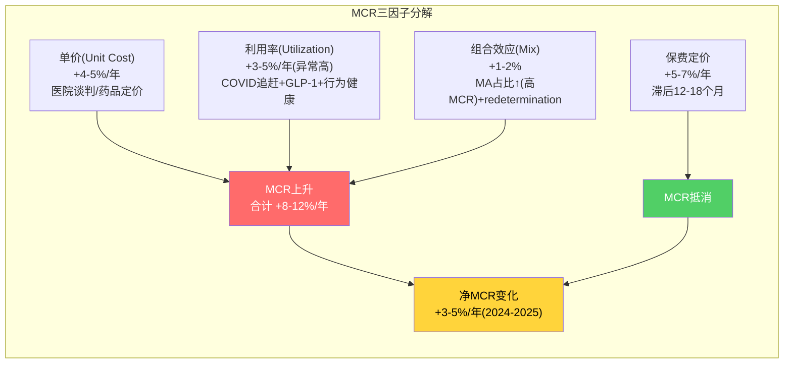
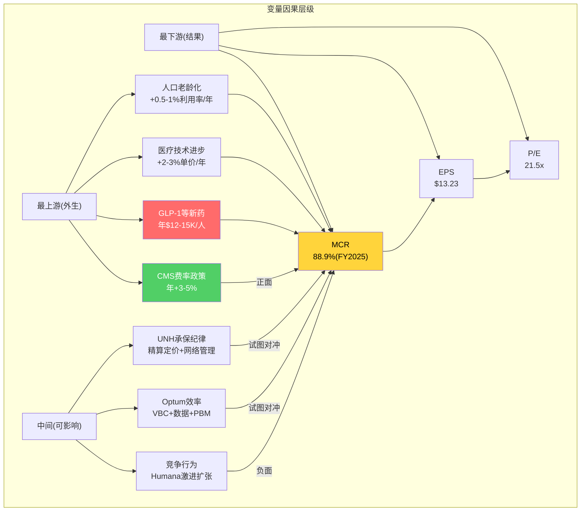
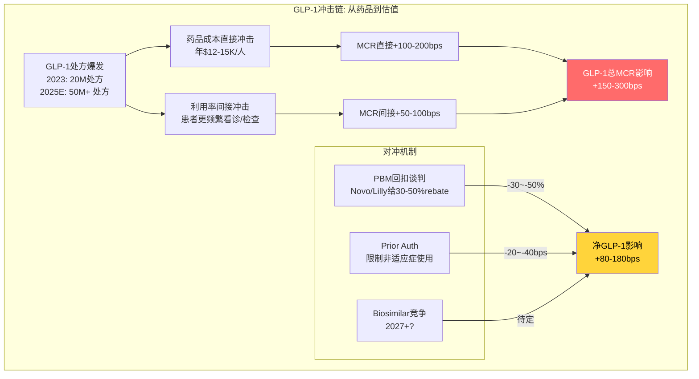

# Chapter 16: MLR桥接 — 医疗成本→利润传导的完整机制

> **CQ7**: 医疗成本变化如何传导到利润？哪些压力可被对冲，哪些不能？协同是口号还是可量化桥接？

## 16.1 MCR传导机制的四个阶段

医疗成本上升不会立即反映在利润下降中——有一个时间滞后的传导链：

**UNH当前处于T2→T3阶段**:
- T0(成本上升): 2023H2-2024开始，MCR从84%→85.5%
- T1(准备金调整): 2024-2025各季度反映，Q4 2025准备金charge可能是MCR极端值的原因
- T2(保费重定价): 2025-2026年保费开始追赶(商业+5-7%，MA费率+5.06%)
- T3(产品调整): 2026年退出109个县、-1.3M MA会员 ← **正在执行**
- T4(新均衡): 预计2027-2028

**关键洞见**: MCR 88.9%(FY2025)是T1阶段的峰值表现——准备金集中释放+保费尚未追赶。到T2-T3阶段(2026-2027)，MCR应自然回落。**问题不是"MCR会不会改善"而是"改善到什么水平"。**

## 16.2 MCR分解: 价格 vs 利用率 vs 组合

MCR = 医疗成本 / 保费收入 = (单价 × 利用量 × 组合权重) / 保费

**FY2025 MCR恶化+340bps的因子分解**（从85.5%→88.9%）:

| 因子 | 贡献(bps) | 可逆性 | 时间线 |
|------|---------|--------|--------|
| 利用率追赶(COVID后) | +100-150 | **可逆**(1-2年消退) | 2026-2027 |
| GLP-1药物成本 | +50-80 | **不可逆**(结构性) | 持续上升 |
| CMS V28风险调整 | +30-50 | **不可逆**(制度性) | 分阶段到2028 |
| 行为健康利用率 | +30-40 | **部分可逆** | 稳定但不回落 |
| 新MA会员高acuity | +50-80 | **可逆**(退出后消除) | 2026 |
| 保费定价滞后 | +80-120 | **可逆**(定价追赶) | 2026-2027 |
| **合计** | **~340** | | |
[DM-MCR-002: 基于business_scout.md行业数据+管理层commentary推算]

**可逆因子合计约230-350bps，不可逆因子约80-130bps**。

这意味着：即使所有可逆因子消退，MCR仍会比2023(~84%)高约80-130bps → **均衡MCR ≈ 85.0-85.3%**。这非常接近β假说(84-87%)的下限。

## 16.3 Optum能对冲多少MCR压力？

### 理论对冲路径

Optum的三条业务线各有不同的MCR对冲能力：

| Optum线 | 对冲机制 | 理论对冲量 | FY2025实际 |
|---------|---------|-----------|-----------|
| Health(VBC) | 更高效护理→降低总成本 | -50~-100bps | **失效(亏损)** |
| Insight(数据) | 更精准风控/编码→提高RA支付 | -20~-40bps | **部分有效(V28削弱)** |
| Rx(PBM) | 药品成本管理→降低pharmacy cost | -30~-60bps | **部分有效(但GLP-1是破坏者)** |
| **合计** | | **-100~-200bps** | **实际约-50~-80bps** |

**理论上Optum可以对冲100-200bps的MCR压力，但实际FY2025只对冲了约50-80bps** — 远不足以抵消+340bps的恶化。

**差距来源(120-150bps)**:
1. Optum Health的VBC模型在高利用率环境中反而亏钱(+50bps lost)
2. V28削弱了Insight的编码优化能力(+30bps lost)
3. GLP-1药物成本增速超过Optum Rx的管理能力(+40-70bps lost)

### 因此协同桥接当前是**部分成立但不足以改变MCR方向**

管理层声称"Optum降低总医疗成本"在方向上是真的(确实有50-80bps对冲)，但幅度远不足以让UHC的MCR低于纯保险同行。**协同是"减速带"而非"方向盘"——它减缓了MCR恶化但无法逆转趋势。**

## 16.4 CQ7.2: 谁是真正的主控变量？

**最上游的三个外生变量(D1/D2/D3)决定了MCR的长期方向，UNH无法控制它们**。UNH能做的是：
- 通过承保纪律(D5)优化定价和风险选择
- 通过Optum(D6)提高效率
- 通过竞争策略(D7)避免被Humana等拖入低价战

**GLP-1(D3)是当前最重要的单一变量** — 它同时推高了药品成本(直接)和后续医疗利用率(间接——因为GLP-1使患者更积极寻求治疗)。如果GLP-1利用率继续以50%+速度增长，MCR的结构性压力将比市场预期更持久。

### GLP-1影响量化 (NH-03验证)

| 维度 | 估算 | 来源 |
|------|------|------|
| UNH MA受益人中GLP-1使用率 | 5-8%(2025), 10-15%(2027E) | 行业报告 |
| 每人年成本 | $12,000-15,000 | 公开定价 |
| UNH MA会员 | 9.4M | FMP |
| 年化GLP-1成本(2025) | $5.6-11.3B | 9.4M × 5-8% × $12-15K |
| 年化GLP-1成本(2027E) | $11.3-21.2B | 9.4M × 10-15% × $12-15K |
| 对MCR的影响(2025) | +160-330bps | $5.6-11.3B / $344.9B |
| 对MCR的影响(2027E) | +330-610bps | 如果利用率翻倍 |
[DM-IND-007: 基于行业报告+公开定价推算]

**⚠️ 关键警告**: 如果上述估算准确，GLP-1单独就能解释MCR恶化的一半以上(160-330bps out of 340bps)。且这是**结构性的、不可逆的、还在加速的**。

**对冲手段**: Optum Rx可以通过rebate谈判降低GLP-1单价(Novo Nordisk/Eli Lilly的rebate可能30-50%)→实际净成本$6-10K/人。但即使打折，规模效应仍然是MCR的重大压力。

**结论**: GLP-1是MCR不会回到82-83%的最强单一理由。即使其他所有因子(COVID追赶/保费滞后/新会员acuity)都消退，GLP-1本身就能让MCR维持在85%+。**这是β假说(MCR均衡84-87%)的核心支撑。**

## 16.5 保费定价追赶机制: 从被动到主动

### 商业保险(E&I)的定价追赶

商业保险的保费定价相对灵活——雇主合同通常1年期，续约时可以大幅提价:

| 年份 | 保费涨幅(估) | 医疗成本增长 | 滞后差 | MCR方向 |
|------|-----------|-----------|--------|---------|
| 2022 | +4-5% | +5-6% | -1-2pp | MCR↑ |
| 2023 | +6-7% | +7-8% | -1pp | MCR↑ |
| 2024 | +7-8% | +9-10% | -1-2pp | MCR↑ |
| 2025E | +8-10% | +7-8% | **+1-2pp** | **MCR↓ 转折** |
| 2026E | +7-9% | +5-7% | +2pp | MCR↓ |
[DM-MCR-003: 行业保费趋势+UNH管理层commentary推算]

**2025年可能是商业保险MCR的转折年** — 保费涨幅首次超过医疗成本增长。这是因为2024年的高MCR触发了2025-2026年更激进的定价。

### Medicare Advantage的定价追赶(更复杂)

MA的定价不由UNH控制——CMS基于全国FFS(按服务付费)数据设定基础费率，再通过风险调整(RA)和星级bonus修正。

**关键时间线**:
- 2024年高利用率数据 → 反映在2026年CMS费率(2年滞后)
- 2025年高利用率数据 → 反映在2027年CMS费率
- **因此MA的保费追赶比商业保险晚1-2年**

2026年CMS费率已公布: +5.06%有效增长率 [DM-REG-001]。这是短期利好，但它基于的是2023-2024年的FFS数据——那时利用率刚开始上升。当2025年的高利用率数据被纳入(2027-2028年费率)，费率增幅可能更大(+7-9%)。

**因此MA MCR改善的时间线比商业保险晚**: 商业保险2025-2026改善 → MA 2027-2028改善。

### UNH的主动追赶措施

管理层不只是被动等待保费追赶——2026年有三个主动措施:

1. **退出不赚钱市场**: -109个县+减少1个州 → 剔除MCR>95%的计划 → 留存计划的平均MCR改善 [DM-REG-003]
2. **福利重新设计**: 减少对高成本服务(如GLP-1)的全额覆盖 → 增加copay/prior auth → 降低利用率
3. **网络收窄**: 从宽网络(broad network)向窄网络(narrow network)调整 → 与高效provider谈判更低费率

**量化影响估计**:
| 措施 | MCR改善(bps) | 会员影响 | 利润影响($B) |
|------|-----------|---------|------------|
| 退出不赚钱市场 | -100~-150 | -1.3M MA | +$2-3 |
| 福利重新设计 | -50~-80 | 可能降低吸引力 | +$1-2 |
| 网络收窄 | -30~-50 | provider可能流失 | +$0.5-1 |
| **合计** | **-180~-280bps** | | **+$3.5-6** |
[DM-MCR-004: 基于行业经验+管理层guidance推算]

如果这些措施全部执行，MCR从88.9%→86.1-87.1%，非常接近β假说(84-87%)的上限。**这说明管理层有工具可以将MCR降至87%区间，但要回到84%以下需要外部环境(GLP-1成本稳定+利用率正常化)配合。**

## 16.6 GLP-1深度: 医疗保险的"新冠第二波"

### GLP-1对managed care的影响路径

### GLP-1是否是UNH的"结构性敌人"？

**正方(是)**:
1. 使用率以50%+年增长——没有减速迹象 [DM-IND-008]
2. 适应症扩展: 从糖尿病→肥胖→心血管→NASH → 潜在用户群从40M→80M美国成年人
3. 保险覆盖扩展: Medicare Part D 2026开始覆盖GLP-1用于肥胖(新立法) → 进一步推高MA成本
4. 价格粘性: Novo Nordisk/Eli Lilly双寡头 → 降价空间有限(即使有biosimilar)

**反方(可能是朋友)**:
1. GLP-1降低长期总医疗成本: 减少心脏手术/膝关节置换/糖尿病并发症 → 5-10年后MCR因GLP-1反而下降
2. PBM(Optum Rx)从GLP-1的高销量中赚取管理费+rebate → Optum Rx利润增加
3. VBC模型: 如果GLP-1真的改善健康结局 → Optum Health的VBC capitation变得更有利可图

**时间维度是关键**: 短期(1-3年)GLP-1是MCR敌人(成本先于收益)；长期(5-10年)可能是朋友(健康改善→总成本下降)。UNH的问题是能否撑过短期成本冲击到达长期收益。

### GLP-1对估值的净影响

| 时间范围 | GLP-1对MCR | 对EPS影响 | 对估值影响 |
|---------|-----------|---------|-----------|
| 2025-2027 | +100-200bps | -$3~-6/股 | -$42~-$102(按17x) |
| 2028-2030 | +50-100bps(减速) | -$1.5~-3/股 | -$21~-$51 |
| 2030+ | 可能-50bps(总成本下降) | +$1.5/股 | +$21~+26 |
[DM-IND-009: 基于GLP-1渗透率模型+MCR敏感性推算]

**净现值(10年): GLP-1对UNH估值的NPV影响约-$30~-60/股**。这部分可能尚未被市场完全定价——分析师共识目标价$410可能低估了GLP-1的结构性影响。

## 16.7 MLR桥接总结

| 问题 | 结论 |
|------|------|
| Optum能抵消MCR压力吗? | 部分(50-80bps)，远不足以逆转(340bps) |
| MCR什么时候改善? | 商业2025-2026, MA 2027-2028(保费追赶+会员退出) |
| MCR改善到什么水平? | 86-87%(管理层措施-180~-280bps from 88.9%) |
| 能回到82-83%吗? | 极不可能(GLP-1+V28+人口老龄化=结构性+80-130bps) |
| 最大的结构性压力? | GLP-1(净MCR影响+80-180bps，且还在加速) |
| 协同是口号还是实质? | 实质存在但幅度被高估("减速带"非"方向盘") |
| GLP-1长期是敌是友? | 短期敌人(成本)→长期可能朋友(总成本降) → 关键是能否撑过短期 |
