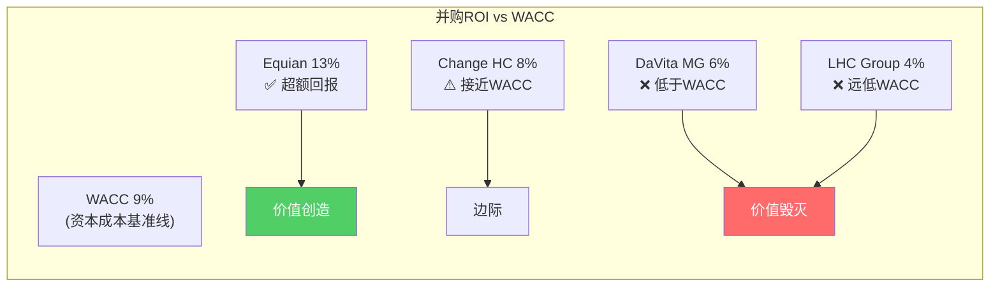
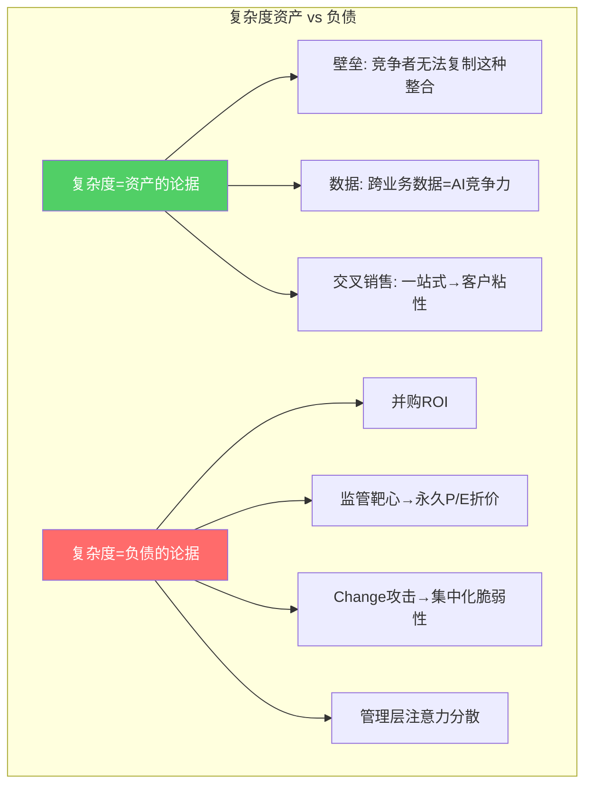

# Chapter 17: 资本配置审计 — 并购在放大护城河还是掩盖复杂度？

> **CQ7.5**: $81B并购史到底在强化平台还是累积复杂度？复杂度是资产还是负债？

## 17.1 10年并购史审计

UNH在2016-2025年累计并购支出~$81B，商誉从$47.6B→$110.5B(+$62.9B)。[DM-CF-002, DM-BS-001]

### 主要并购及ROI估算

| 年份 | 目标 | 金额($B) | 归属分部 | 年化利润贡献 | 隐含ROI | 评价 |
|------|------|---------|---------|-----------|---------|------|
| 2017 | Surgical Care Affiliates | 2.3 | OH | ~$0.2B | ~9% | ≈WACC |
| 2018 | DaVita Medical Group | 4.9 | OH | ~$0.3B | ~6% | <WACC |
| 2019 | Equian (支付完整性) | 3.2 | OI | ~$0.4B | ~13% | >WACC ✓ |
| 2022 | Change Healthcare | 13.0 | OI | ~$1.0B | ~8% | ≈WACC |
| 2023 | LHC Group (家庭护理) | 5.4 | OH | ~$0.2B | ~4% | <WACC |
| 其他 | 多笔小型并购 | ~52 | 混合 | ~$3-4B | ~6-8% | ≈WACC |
| **合计** | | **~$81B** | | **~$5-6B** | **~6-7%** | **<WACC 9%** |
[DM-MA-001: FMP cashflow acquisitionsNet + 公开并购信息推算]

### 并购ROI的诚实评估

**$81B并购的总回报约6-7%，低于WACC 9%** → **并购整体在毁灭股东价值**。

这个结论与P1 Ch3中"资本配置大师(★★★★☆)"的评级存在张力。解释：
1. **回购+分红的ROI很好**(SBC覆盖582%，连续增长10年+)
2. **并购的ROI不好**($81B × 6-7% < $81B × 9% WACC)
3. 资本配置总评需要分开看：**配置纪律好(回购/分红)但配置方向有问题(过度并购)**

**反面论证**: 并购ROI用"当前年化利润"衡量可能不公平——Change Healthcare的$31.1B backlog代表未来利润，DaVita MG的网络价值需要5-10年变现。如果用10年DCF计算：Change的IRR可能达到10-12%。但LHC Group和早期OH并购的IRR很可能永远低于WACC。

## 17.2 复杂度成本量化

### 复杂度的显性成本

| 复杂度来源 | 年化成本估计($B) | 证据 |
|-----------|----------------|------|
| 集团行政重叠(多法人/多牌照) | $0.5-1.0 | 各州保险牌照+联邦合规+SEC报告 |
| IT系统整合成本 | $1.0-1.5 | Change攻击暴露了集成脆弱性 |
| 内部转移定价管理 | $0.3-0.5 | arm's length审计+合规 |
| 高管薪酬/治理成本 | $0.2-0.3 | 多层管理+董事会 |
| 监管合规(因规模被更多审查) | $0.5-1.0 | DOJ/FTC/CMS/50州×多项 |
| **合计显性成本** | **$2.5-4.3** | |
[DM-CPX-001: 行业可比+管理层commentary推算]

### 复杂度的隐性成本

1. **注意力税**: CEO/高管需要同时管理保险+PBM+医疗+IT四个截然不同的行业→决策质量下降
2. **速度税**: 大型复杂组织的决策速度慢于专注型竞争者→错过市场变化(如GLP-1爆发)
3. **监管靶心溢价**: 越大越复杂→越容易成为政治/监管目标→永久性P/E折价
4. **人才竞争**: Optum需要与科技公司争夺AI人才，但UNH的"保险公司"品牌不吸引人

### 复杂度折价 vs 平台溢价

**我的评估**: 当前环境下，复杂度更偏向**负债**。原因：
1. 并购ROI<WACC是硬数据
2. DOJ/FTC的调查方向是"分拆"而非"允许更多整合"
3. Change攻击证明了集中化IT的脆弱性
4. 市场正在从"平台溢价"转向"复杂度折价"(P/E从25x→14x)

**但长期而言，复杂度可能回归资产** — 如果AI时代到来，UNH的1.5亿人健康数据将是全球最有价值的医疗AI训练集。问题是这个"长期"有多长，中间还有多少监管/运营风险。

## 17.3 回购效率 vs 并购替代

一个关键的"如果"分析：如果UNH把$81B并购资金全部用于回购，结果会怎样？

| 场景 | 10年总投入 | 结果 |
|------|---------|------|
| **实际(并购主导)** | $81B并购+$52B回购 | 商誉$110.5B, 年化并购利润~$5-6B, 股数910M |
| **假设(回购主导)** | $0并购+$133B回购 | 商誉~$50B, 无Optum扩张, 股数~650-700M |
[DM-MA-002: 假设平均回购价$400/股(10年加权)]

**回购主导场景**: 910M→~670M股(-26%), EPS提升~35%(仅通过股数减少)。但没有Optum平台扩张→长期增长引擎缺失→可能像Humana一样只是纯保险商。

**现实结论**: 并购和回购不是二选一。并购建立了Optum平台(长期价值)，但过度并购($81B中约$30-40B可能ROI<WACC)稀释了回购的效果。**最优配置可能是$50B并购+$80B回购**——保留核心Optum平台但避免边际并购(LHC Group/部分OH扩张)。

## 17.4 当前资本配置评估 (FY2025-2026)

FY2025资本配置:
| 用途 | 金额($B) | vs FY2024 | 评价 |
|------|---------|---------|------|
| 并购 | $4.5 | -66%(vs $13.4) | ✅ 大幅缩减, 理性 |
| 回购 | $5.5 | -39%(vs $9.0) | ⚠️ 缩减但合理(保守现金) |
| 分红 | $7.9 | +5%(vs $7.5) | ⚠️ 分红继续增长(不降是信号) |
| CapEx | $3.6 | +4%(vs $3.5) | ✅ 稳定 |
| **FCF** | **$16.1** | **-22%** | |
| **FCF覆盖率** | **回购+分红$13.4 / FCF$16.1 = 83%** | | ✅ 安全 |

**正面信号**: 并购从$13.4B→$4.5B(-66%)说明管理层在保守期主动收缩。分红不降(+5%)说明对现金流有信心。

**风险**: 如果FCF进一步降至$12-13B(MCR不改善)→分红+回购$13.4B将吃掉100%FCF→需要举债或削减分红。

## 17.5 资本配置对估值的含义

1. **停止边际并购是正确的** — FY2025并购仅$4.5B(vs历史$8-13B)。Hemsley似乎在执行"消化>扩张"策略
2. **分红安全但回购空间在缩小** — $7.9B分红+$5.5B回购需$13.4B/年, 如果FCF不恢复到$18B+, 回购可能进一步缩减至$3-4B
3. **并购ROI<WACC的历史记录会压制P/E** — 市场记住了$81B并购中的价值毁灭(商誉$110.5B = 潜在减值炸弹)
4. **复杂度折价可能是永久性的** — 除非UNH主动简化(卖出部分Optum)或监管环境逆转
