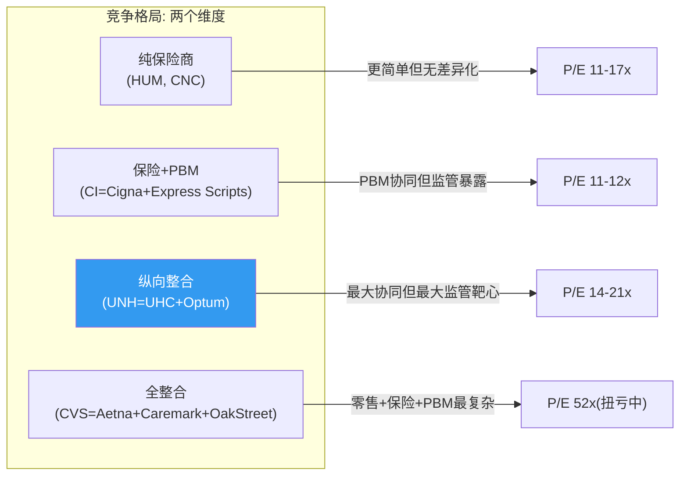
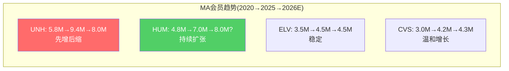
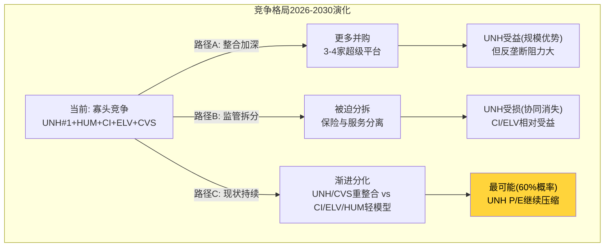

# Chapter 18: 竞争对标深度 — UNH vs 五大同行的真实差距

> **竞争格局全景**: UNH/CI/ELV/HUM/CNC/CVS六家的纵向对比+UNH竞争力诊断

## 18.1 六公司对标矩阵

### 全维度对标表

| 维度 | UNH | CI(Cigna) | ELV(Elevance) | HUM(Humana) | CNC(Centene) | CVS |
|------|-----|-----------|---------------|-------------|-------------|-----|
| **市值($B)** | $258 | $71 | $82 | $37 | $26 | $57 |
| **收入($B)** | $448 | $246 | $179 | $130 | $163 | $369 |
| **P/E(GAAP)** | 21.5x | 11.9x | 11.7x | 17.3x | N/A(亏损) | 52.5x |
| **OPM** | 4.2% | 3.3% | 4.1% | 1.1% | -3.9% | 2.6% |
| **ROE** | 12.5% | 15.1% | 13.3% | 7.0% | -28.7% | 2.3% |
| **D/E** | 81.6 | 75.1 | 74.4 | 74.8 | 90.6 | 106.1 |
| **Rev Growth** | +12.3% | +10.4% | +9.5% | +11.3% | +23.2% | +8.4% |
| **MA会员(M)** | 9.4 | ~4.0 | ~4.5 | 7.0 | ~2.0 | ~4.2 |
| **纵向整合** | 最深 | 中(PBM) | 浅(Carelon) | 无 | 无 | 深(零售+PBM) |
| **当前危机** | MCR+CEO+DOJ | MCR | MCR | MCR(最严重) | MCR(亏损) | 扭亏中 |
[DM-COMP-001, DM-COMP-004: FMP compare_stocks + WebSearch行业数据]

## 18.2 关键竞争维度分析

### 维度1: P/E溢价的合理性

**UNH P/E 21.5x是CI(11.9x)/ELV(11.7x)的近2倍。** 这个溢价从何而来？

| 溢价来源 | 估计贡献(P/E倍) | 当前状态 |
|---------|---------------|---------|
| Optum平台差异化 | +4-6x | 正在被质疑(OH亏损) |
| 规模领先(#1保险商) | +1-2x | 可能被HUM超越 |
| 资本配置历史 | +1-2x | 并购ROI<WACC |
| 增长溢价 | +1-2x | 2026收入下降 |
| **合计溢价** | **+7-12x** (vs CI/ELV ~12x) | |

**问题**: 这+7-12x溢价中，至少一半(Optum+增长)的基础正在动摇。如果P/E收敛到16-18x(保留规模溢价+部分Optum溢价)：
- @16x × adj EPS $16.35 = $262
- @18x × adj EPS $16.35 = $294

**当前$284在16-18x adj P/E区间** — 市场已经在消化部分溢价压缩。

### 维度2: MA市场份额动态

**UNH可能在2026年底被Humana超越成为第二大MA保险商(按会员数)**。[DM-COMP-002]

这是一个重要的竞争拐点：
- **短期影响**: 有限——UNH主动退出不赚钱市场是正确策略
- **中期影响**: 可能削弱UNH与CMS的谈判筹码("最大MA商"的话语权)
- **长期影响**: 如果Humana的激进策略被证明成功(低MCR+高份额)，市场可能重新评估UNH"选择性收缩"的逻辑

**但Humana自身也面临严重MCR压力**(OPM仅1.1%)。激进扩张可能是短视的——吸引的高风险会员将在1-2年后恶化HUM的MCR。这是一场"谁先扛不住"的消耗战。

### 维度3: 纵向整合 — 优势还是枷锁？

| 公司 | 整合深度 | 整合带来的 | 整合的代价 |
|------|---------|-----------|-----------|
| **UNH** | 保险+VBC+PBM+IT | 数据飞轮+协同$4.4B | DOJ/FTC靶心+复杂度折价 |
| **CI** | 保险+PBM | Express Scripts协同 | FTC PBM已和解 |
| **ELV** | 保险+浅服务 | Carelon小规模 | 最低监管风险 |
| **CVS** | 零售+保险+PBM | 全渠道+Oak Street | 扭亏中+复杂度极高 |
| **HUM** | 纯MA保险 | 简单+专注 | 无协同差异化 |

**CI已经完成FTC PBM和解** — 这使CI的监管风险已部分化解(Express Scripts和解条款已知)，而UNH的Optum Rx和解条款仍不确定。[DM-REG-004]

**这意味着CI在监管确定性维度上已领先UNH** — 可能部分解释CI P/E(11.9x)为何低于UNH(21.5x)看似不合理但实际上CI的监管折价更小。

### 维度4: ROE质量对比

| 公司 | ROE | 净利率 | 资产周转 | 杠杆 | ROE质量 |
|------|-----|--------|---------|------|---------|
| UNH | 12.5% | 2.7% | 1.45x | 3.29x | 杠杆+周转驱动 |
| CI | 15.1% | 2.4% | 2.0x | 3.15x | **周转最高** |
| ELV | 13.3% | 2.8% | 1.5x | 3.17x | 较均衡 |
| HUM | 7.0% | 0.8% | 1.3x | 6.7x | 杠杆极高,质量差 |

**CI的ROE(15.1%)高于UNH(12.5%)且杠杆更低** — CI的资产周转2.0x(最高)说明Cigna的资本效率优于UNH。这挑战了"UNH是行业最优"的叙事。

## 18.3 竞争力诊断总结

| 维度 | UNH强于同行 | UNH弱于同行 |
|------|-----------|-----------|
| **规模** | ✅ 收入#1($448B), 会员#1(50M) | |
| **多元化** | ✅ 最广泛的业务线(保险+服务+IT+PBM) | |
| **数据资产** | ✅ 1.5亿人数据(行业最大) | |
| **FCF生成** | ✅ $16.1B(绝对值最大) | |
| **MCR管理** | | ❌ 88.9%不优于ELV/CI |
| **估值性价比** | | ❌ P/E 21.5x(2倍于CI/ELV) |
| **监管风险** | | ❌ 最深整合=最大靶心 |
| **ROE质量** | | ❌ CI ROE 15.1%>UNH 12.5% |
| **增长动能** | | ❌ 2026收入下降(唯一一家) |
| **管理层** | ⚠️ Hemsley回归(有能力但DOJ风险) | |

**综合竞争力评级**: UNH在"规模/数据/多元化"三个维度领先，但在"MCR/估值/监管/ROE/增长"五个维度不如最佳同行。**UNH是最大的但不是最好的——这个差距就是P/E溢价应该压缩的理由。**

## 18.4 竞争格局对估值的含义

1. **P/E溢价应从21.5x压缩至15-18x** — Optum溢价部分合理(数据+规模)但当前被高估(OH亏损+监管风险)
2. **CI可能是更好的价值机会** — 11.9x P/E + ROE 15.1% + FTC和解已完成 + 更低复杂度
3. **UNH的核心优势是"不可被取代"而非"最优"** — 没有第二家公司能提供UNH级别的全美一站式健康服务
4. **长期看AI差异化可能逆转竞争格局** — 如果Optum Insight的AI能力产生超额回报(2028+)，当前的复杂度折价将转为平台溢价

## 18.5 个体公司深度对标

### Cigna (CI): UNH应学习的"简单化"标杆

**Cigna的核心优势**: 在保险+PBM(Express Scripts)两条线上做到了UNH 80%的协同效果，但只有UNH 50%的复杂度。

| 维度 | CI | UNH | CI优势在哪 |
|------|---|-----|----------|
| ROE | 15.1% | 12.5% | CI更高效 |
| P/E | 11.9x | 21.5x | CI更便宜 |
| 资产周转 | 2.0x | 1.45x | CI更轻资产 |
| FTC状态 | **已和解** | 进行中 | CI监管确定性更高 |
| 商誉/资产 | ~25% | 35.7% | CI减值风险更低 |
| 业务线 | 2条(保险+PBM) | 4条 | CI更聚焦 |

**CI的Express Scripts和解**: 2026.2完成。和解条款要求rebate透明+薪酬与药价脱钩。这使CI的PBM监管风险已经"定价完成"——市场知道最坏情况是什么。而UNH的Optum Rx和解条款仍未知→不确定性溢价更高。[DM-COMP-005: regulatory_scout.md]

**CI的战略启示**: Cigna证明了"保险+PBM"的简单整合模型可以产生高ROE(15.1%)而不需要UNH级别的纵向深度(VBC+IT+数据)。这挑战了"UNH必须保持最深整合才能保持竞争力"的假设。

**如果CI是"轻整合模型"而UNH是"重整合模型"**，问题是: 重整合的额外$4-5B利润(Optum Health + Insight)是否值得额外的复杂度成本($2.5-4.3B/年, Ch17)和监管风险？

答案在FY2025似乎是"不值得"——UNH的ROE(12.5%)低于CI(15.1%)，说明重整合的额外利润被复杂度成本吃掉了大部分。

### Humana (HUM): UNH在MA市场的最大威胁

**Humana的核心优势**: 纯MA专家，100%聚焦于Medicare Advantage市场。

| 维度 | HUM | UNH(MA部分) | HUM优势在哪 |
|------|-----|-----------|----------|
| MA会员 | 7.0M(+21%) | 9.4M(-14% 2026E) | HUM在扩张UNH在收缩 |
| MA专注度 | ~80%收入来自MA | ~38%收入来自MA | HUM更专注 |
| Stars评级 | 波动大(近期下降) | 77%在4+星(稳定) | UNH更稳定 |
| OPM | 1.1% | ~2.7%(UHC) | UNH更高(但都很低) |
| P/E | 17.3x | 21.5x(整体) | HUM更便宜 |

**Humana的激进扩张风险**: HUM在2024-2025年通过低保费和广覆盖吸引了大量新MA会员(+21%)。但这些新会员的MCR可能很高(UNH的教训: 新会员MCR比预期高2x)。如果HUM重蹈UNH的覆辙，2026-2027年HUM可能面临类似的MCR危机。

**竞争动态**: UNH和HUM正在走相反的道路——UNH选择"有质量的收缩"(退出不赚钱市场)，HUM选择"规模扩张"(低价吸引会员)。2027年将是判定谁正确的时间节点:
- 如果HUM的激进策略导致MCR崩塌(类似UNH 2025) → UNH的收缩策略被验证
- 如果HUM成功管理了新会员MCR → UNH的退出可能是过度保守

### CVS Health: UNH的全整合镜像

**CVS = 零售药房 + Aetna(保险) + Caremark(PBM) + Oak Street(VBC)**

CVS的整合深度可能超过UNH——它是唯一同时拥有线下零售渠道(9,000+药房)的集成商。但CVS的整合更混乱:

| 维度 | CVS | UNH | 差异原因 |
|------|-----|-----|---------|
| P/E | 52.5x | 21.5x | CVS处于扭亏期(前期巨额减值) |
| OPM | 2.6% | 4.2% | CVS零售拖累利润率 |
| ROE | 2.3% | 12.5% | CVS近乎无盈利 |
| 商誉 | ~$77B | $110.5B | 都很高 |
| 药房 | 9,000+实体店 | Optum Rx(无实体) | CVS有线下但是负担 |

**CVS的教训**: 2024年CVS进行了$11B+的商誉减值(Aetna+Oak Street) — **这可能预示了UNH在Optum Health上的类似命运**。CVS的经验说明: 保险+PBM+VBC的全整合并不保证高利润，实体零售+保险的混合更可能是价值陷阱。

### ELV (Elevance): "安全牌"选择

ELV是最"无聊"但可能最安全的managed care投资:

| 维度 | ELV | UNH | 含义 |
|------|-----|-----|------|
| P/E | 11.7x | 21.5x | ELV便宜45% |
| OPM | 4.1% | 4.2% | 几乎相同 |
| ROE | 13.3% | 12.5% | ELV略高 |
| 监管风险 | 低(浅整合) | 极高(深整合) | ELV安全得多 |
| 增长前景 | 稳定(+9.5%) | 收缩中 | ELV更可预测 |
| 纵向整合 | Carelon(小型) | Optum(大型) | ELV复杂度低 |

**ELV的隐含信息**: 市场给ELV 11.7x P/E + OPM 4.1% ≈ UNH的保险部分(如果没有Optum)应值多少。如果UNH的UHC独立估值参考ELV:
- UHC adj OP $10.5B × 12x(ELV PE) = $126B
- 这意味着市场当前给UHC+Optum合计$258B中，隐含Optum值$132B
- vs Ch14拆分测试中Optum独立估值$67-97B → **市场可能仍在高估Optum**

## 18.6 竞争格局的三种演化路径

**路径C(现状持续)概率最高(60%)**: 监管不会完全拆分UNH但会持续施压(PBM透明化/self-dealing限制/PA改革)→UNH利润结构性下移但不崩塌→P/E稳定在15-18x→股价$270-330。

## 18.7 竞争对标最终结论

1. **UNH是最大的但不是最好的** — CI/ELV在ROE/P/E效率上优于UNH
2. **重整合模型在2024-2025年被证伪** — 额外复杂度没有产生额外利润
3. **Humana是MA市场最大威胁** — 可能2026底超越UNH成为#1 MA商
4. **CVS是UNH的前车之鉴** — $11B商誉减值可能预示Optum Health的命运
5. **ELV是UNH"保险部分"的估值锚** — 隐含Optum被市场高估$35-65B
6. **CI的FTC和解是竞争优势** — 监管确定性本身有价值
