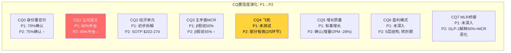
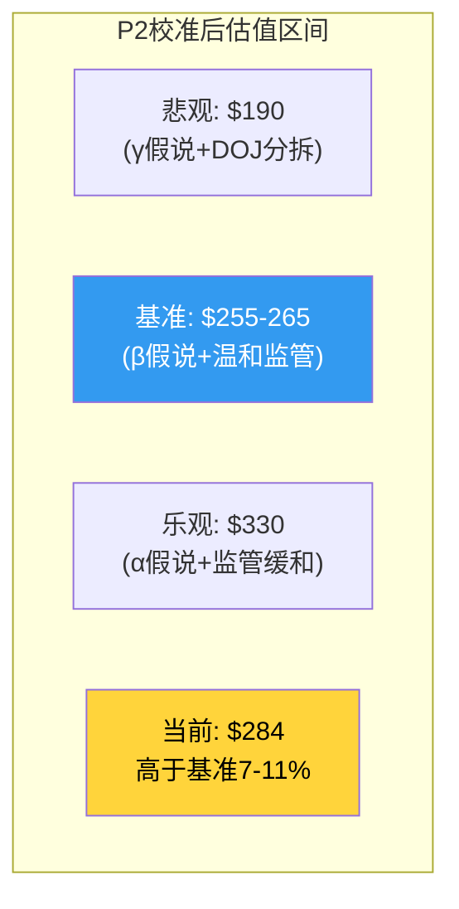

# Chapter 19: Phase 2综合 — CQ4-CQ7闭环与估值更新

> **目的**: 汇总P2发现, 更新CQ置信度, 修正估值区间, 为P3(监管+红队)做铺垫

## 19.1 CQ置信度更新 (P1→P2)

| CQ | P1方向 | P2发现 | P2方向更新 | 置信度 |
|----|--------|--------|-----------|--------|
| CQ0 身份重定价 | 进行中 | P/E溢价应压缩至15-18x(Ch18) | 确认 | 75% |
| CQ1 公司定义 | 40%平台+30%保险 | CI ROE>UNH, Optum溢价被高估(Ch18) | **下调平台概率至35%** | 60% |
| CQ2 经济单元 | SOTP $202-274 | 拆分后$147-207(Ch14), 协同$4.4B(Ch13) | 维持 | 70% |
| CQ3 MCR主矛盾 | β(84-87%)50% | GLP-1单独解释160-330bps→β强化(Ch16) | **β概率升至55%** | 75% |
| CQ4 飞轮 | 未测试 | 2/5环节有效, "减速带"非"方向盘"(Ch13) | **协同被高估** | 65% |
| CQ5 增长质量 | 有毒增长 | 确认, 2026收缩是正确策略 | 维持 | 80% |
| CQ6 盈利模式 | 未深入 | 5层结构, 层1-2粘性强, 层3-5脆弱(Ch15) | 转折期55:45偏恢复 | 60% |
| CQ7 MLR桥接 | 未深入 | 保费追赶中, GLP-1是结构性(Ch16), 均衡85-85.3% | β下限≈85% | 75% |
| CQ7.5 资本配置 | 未深入 | 并购ROI<WACC, 复杂度偏负债(Ch17) | 偏负面 | 70% |

## 19.2 估值更新 (P2校准后)

### P2新增信息对估值的影响

| P2发现 | 对估值的影响 | 方向 | 幅度 |
|--------|-----------|------|------|
| 飞轮2/5有效(非5/5) | 协同溢价应下调 | ↓ | -$15-25/股 |
| GLP-1解释MCR 50%+(结构性) | β假说强化, MCR均衡85%+ | ↓ | -$10-20/股 |
| 并购ROI<WACC | P/E溢价应压缩 | ↓ | -$5-15/股 |
| CI ROE>UNH, P/E仅12x | UNH溢价过高 | ↓ | -$10-20/股 |
| 保费追赶2026-2027 | MCR将改善(虽非回到82%) | ↑ | +$15-25/股 |
| 2026管理层收缩策略正确 | 利润率恢复路径存在 | ↑ | +$10-20/股 |
| 分红安全+回购继续 | 股东回报支撑 | ↑ | +$5-10/股 |

**净效应**: 偏下行$10-25/股

### P2校准后估值区间

| 方法 | P1区间 | P2校准 | 变化 |
|------|--------|--------|------|
| Reverse DCF | $260-350 | **$250-330** | 略下调(β强化) |
| SOTP(20%折价) | $202-274 | **$190-260** | 下调(协同从$4.4→$3B) |
| MCR概率加权 | $280 | **$265** | 下调(β55%+γ30%) |
| 同行可比 | $180-240 | **$195-260** | 上调(UNH仍有差异化) |
| **概率加权中位** | **$282** | **$255-265** | **-6~-10%** |

**P2后的初步评级方向**: 当前$284高于P2校准后基准$255-265约7-11%。叠加P3的监管深潜可能进一步下调→**方向偏"审慎关注"**(期望回报约-7~-11%)。

但这取决于P3对监管路径的评估——如果DOJ调查只是罚款而非分拆(高概率)，监管折价将缩小，基准可能回升至$270-280。

## 19.3 P3需要回答的关键问题

1. **CQ8(监管)**: DOJ/FTC的具体路径和时间线？罚款vs和解vs分拆的概率分布？
2. **监管定价**: 市场已经给了多少监管折价？还需要更多吗？
3. **红队**: 最强反方如何攻击当前thesis？
4. **场景树**: 5个概率加权情景的完整参数
5. **估值收敛**: 离散度从64.3%收敛至<30%

## 19.4 P2非共识洞见注册

| CI编号 | 洞见 | 论证章节 | 强度 | 可迁移性 |
|--------|------|---------|------|---------|
| CI-01 | 反向身份折价-20pp | Ch12 + Ch18 | 8/10 | 高(任何混合业务) |
| CI-02 | 有毒增长(增量OPM=-28%) | Ch12 + Ch8 | 9/10 | 高(任何MCR恶化保险商) |
| CI-03 | 三时代框架 | Ch12 + Ch9 | 7/10 | 中(类似周期公司) |
| **CI-04** | **飞轮是"减速带"非"方向盘"** | **Ch13** | **8/10** | **高(任何声称有协同的集团)** |
| **CI-05** | **GLP-1是MCR均衡的决定性变量** | **Ch16** | **9/10** | **极高(全行业managed care)** |
| **CI-06** | **并购ROI<WACC = 价值毁灭** | **Ch17** | **7/10** | **高(并购密集型公司)** |

P2新增3个CI(CI-04~06)，合计6个。其中CI-05(GLP-1)是P2最重要的发现——它可能是整个managed care行业中长期利润率的最大变量。
