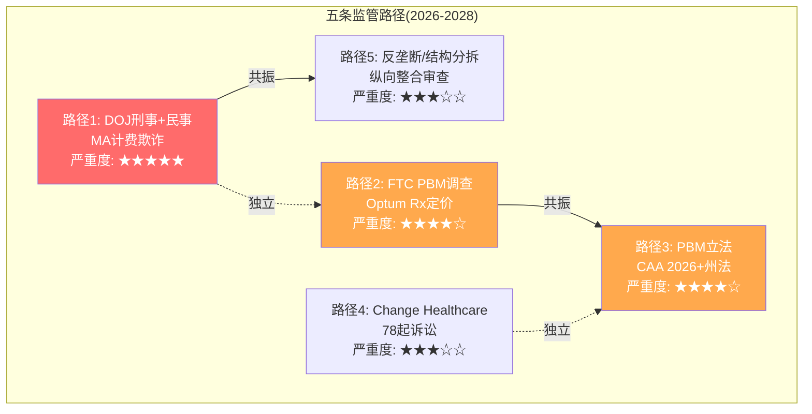
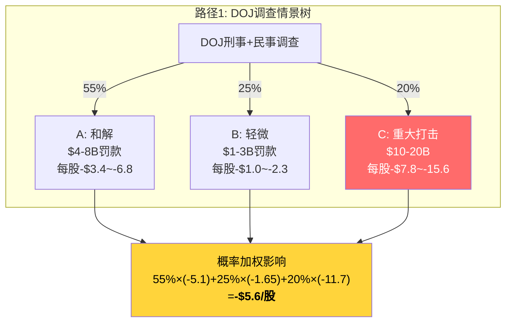
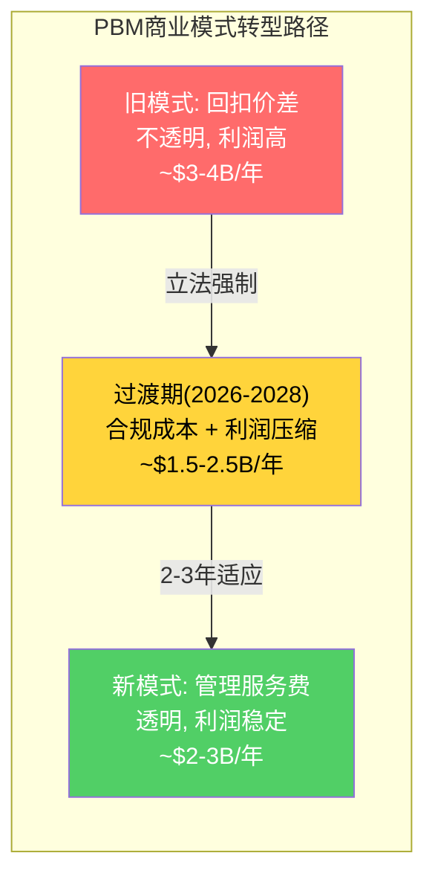
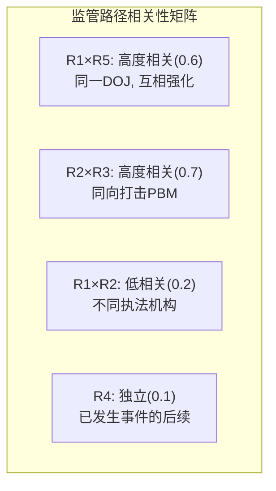
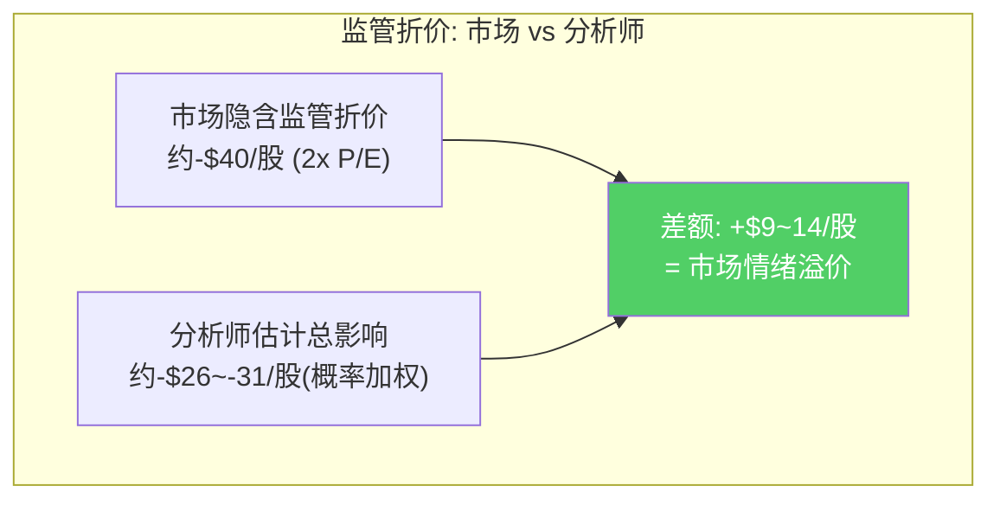
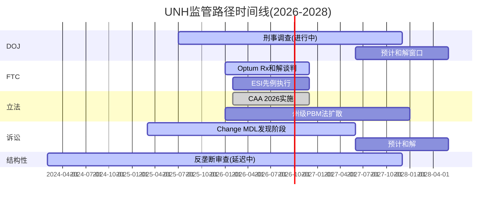

# Chapter 20: CQ8 监管深潜 — 五条路径量化与监管折价解剖

> **CQ8**: UNH面临的监管暴露到底有多严重？市场已经定价了多少？还需要更多折价吗？

## 20.1 监管暴露的五层结构

UNH面临的不是单一监管风险，而是五条几乎同时推进的独立路径。每条路径有不同的概率、影响幅度和时间线。关键在于：它们是否相关？如果DOJ刑事调查升级，FTC是否更可能要求更严厉的和解条款？

**关键发现: 路径间部分相关**。R1(DOJ刑事)和R5(反垄断)共享同一个执法机构(DOJ)，一个升级会增强另一个的政治压力。R2(FTC PBM)和R3(PBM立法)对Optum Rx的打击方向相同。但R1/R5与R2/R3之间相对独立——这意味着监管风险不能简单相加，需要考虑相关性矩阵。

## 20.2 路径1: DOJ刑事+民事调查 — 最大的不确定性

### 调查事实梳理

DOJ的调查实际上包含三个维度：

| 维度 | 指控方向 | 当前状态 | 潜在后果 |
|------|---------|---------|---------|
| 刑事：MA计费欺诈 | Optum部署临床人员增加诊断编码→获取更高Medicare支付 | 2025.7确认调查，正在访谈前员工 | 刑事罚款+高管个人责任 |
| 民事：MA计费 | 广泛的MA计费实践审查 | 与刑事同步 | 民事罚款+退还(disgorgement) |
| 民事：反垄断 | Optum医师集团收购+自我交易 | 2024.2开始，因DOJ裁员延迟 | 行为限制令或结构性救济 |

[DM-REG-001: CNBC 2025.7.24, UNH确认DOJ criminal+civil investigation; DM-REG-002: Healthcare Dive, DOJ antitrust review opened Feb 2024]

### 量化: 三种情景

**情景A: 和解(最可能, 概率55%)**
- **参照案例**: 2017年UNH与DOJ和解MA upcoding案，支付$3.1B(当时UNH年收入仅$200B) [DM-REG-003: 历史和解案例]
- FY2025收入$447.6B是2017年的2.2倍，但指控范围可能更广(系统性vs个案)
- **估计和解金额**: $4-8B(罚款+退还)
- **时间线**: 2027-2028(刑事调查通常需3-5年)
- **对估值影响**: 一次性charge $4-8B → 税后$3.1-6.2B → 每股-$3.4~-6.8
- **额外行为限制**: 可能被要求改变MA编码实践 → 年度MA收入减少约$2-4B(风险调整支付下降)

**情景B: 轻微罚款(概率25%)**
- Trump政府DOJ裁员严重→调查资源不足→最终以较轻条款结案
- **估计罚款**: $1-3B
- **每股影响**: -$1.0~-2.3
- **行为限制**: 最小

**情景C: 重大打击(概率20%)**
- 刑事起诉+高额罚款+强制改变商业模式
- **参照**: 2012年GlaxoSmithKline $3B刑事罚款(当时最大)；2023年Endo International因阿片类药物诉讼进入破产
- **估计总影响**: $10-20B(罚款+退还+行为限制的NPV)
- **每股影响**: -$7.8~-15.6
- **结构性**: 可能被要求出售部分Optum Health业务

**路径1概率加权影响: -$5.6/股**

### 概率分配依据

为什么55%给和解而非轻微罚款？

1. **刑事调查的信号强度**: DOJ同时开展criminal和civil probe是罕见的升级信号——单纯计费争议通常只有civil False Claims Act [DM-REG-004: Fierce Healthcare报道，DOJ前检察官评论"刑事调查表明DOJ认为存在故意欺诈而非过失"]
2. **但Trump DOJ的执行力存疑**: DOJ裁员导致调查延迟(Rep. Ryan公开批评)，执政优先级可能不在医保执法 [DM-REG-005: Pat Ryan press release, DOJ staff reductions delay investigation]
3. **UNH启动了第三方审查**: 这通常是公司预判高风险时的防御动作(2025Q3完成) [DM-REG-006: UNH SEC filing, third-party review]
4. **17%自我交易溢价**: Health Affairs研究发现UNH在高市场份额地区给Optum自有诊所支付比外部高61% [DM-REG-007: Health Affairs study Nov 2025]——这是非常有力的反垄断证据

综合判断：调查严肃(刑事+自我交易证据)，但执行力受限(政治环境+DOJ裁员)→**和解最可能**。

## 20.3 路径2: FTC PBM调查 — Express Scripts和解设定了先例

### 先例: Express Scripts和解条款(2026年2月)

Express Scripts的和解是理解Optum Rx命运的关键参照：[DM-REG-008: Goodwin Law, ESI settlement Feb 4, 2026]

| 条款 | 内容 | 对Optum Rx的启示 |
|------|------|---------------|
| 患者成本降低 | 10年减少out-of-pocket $7B | Optum Rx规模更大，可能要求$8-12B |
| 商业实践改变 | "基础性"变革(delinking+透明) | 同类条款将适用 |
| 监管合规 | 增强FTC报告义务 | 同类条款 |

### Optum Rx特殊风险

Optum Rx面临比Express Scripts更大的结构性风险，因为UNH同时拥有保险(UHC)+PBM(Optum Rx)+药房(通过收购)——**纵向整合**使自我交易指控更严重：

- **自我交易数据**: FTC第二份报告直接使用了"wild profiteering and self-dealing"的措辞 [DM-REG-009: NCPA, FTC second report Jan 2025]
- **利益冲突**: UHC推荐会员使用Optum Rx管理的药房→UNH左手定价右手买单
- **药房所有权风险**: 如果Arkansas HB 1150(禁止PBM拥有药房)先例扩展到联邦层面，Optum Rx模式需要根本性重组

### 量化: Optum Rx和解影响

**Optum Rx FY2025**: 收入$154.7B, OPM 4.7%, 营业利润$7.2B(adj $6.1B) [DM-FIN-001: shared_context分部P&L]

**和解后商业模式变化的NPV**:

| 影响维度 | 基准利润 | 和解后预期 | 年化影响 | NPV(10年,9%折现) |
|---------|---------|----------|---------|-----------------|
| 回扣价差(spread)压缩 | ~$2.5B/年 | 100%透传→$0 | **-$2.5B** | -$16.1B |
| 行政服务费替代收入 | $0 | 转向flat-fee模式 | **+$0.8-1.2B** | +$5.8B |
| 药房利润 | ~$1.5B/年 | 维持(除非药房所有权被限制) | $0 | $0 |
| **净年化影响** | | | **-$1.3~-1.7B** | **-$10.3B** |

这意味着每股NPV影响约-$11.4。但市场是否已经定价了？

**检验市场定价程度**: Express Scripts和解消息(2026.2.4)发布后CI股价反应+2.1%(正面，市场认为不确定性消除>实际损害)。如果类推，市场可能已定价了大部分PBM风险。

**路径2概率加权估计**:
- 和解(85%): 年化利润影响-$1.5B × P/E 14x = -$21B市值 = -$23/股 (但可能已部分定价)
- 无和解/延迟(15%): 不确定性溢价持续

**考虑已定价因素后的增量影响**: -$5~-8/股(市场已定价约60-70%)

## 20.4 路径3: PBM立法 — 已成法律的结构性变化

### CAA 2026: 已签署法律(2026.2.3)

这不是"可能发生"的风险——**已经是法律**：[DM-REG-010: Sidley Austin, CAA 2026 signed Feb 3, 2026]

| 条款 | 影响 | 时间线 |
|------|------|--------|
| Part D回扣100%透传 | Optum Rx在Medicare Part D的回扣价差→0 | 2026生效 |
| PBM薪酬与药价脱钩 | 补偿不能基于药品价格/回扣 | 实施中 |
| 详细报告义务 | AWC/AWP/回扣/收入按药品报告 | 2026生效 |
| ERISA计划透明 | 雇主可要求100%回扣透传 | EO 14273实施中 |

### 量化: 立法对Optum Rx的影响

**Part D回扣价差**: Optum Rx管理约$80B Part D药品支出，回扣价差约1-2% = $0.8-1.6B/年 [DM-REG-011: 估计值，基于行业数据]

**ERISA透传影响**: 如果DOL规则要求雇主计划也100%透传(目前EO方向)，影响将扩大到商业保险领域。Optum Rx商业药品支出约$60-70B → 价差$0.6-1.4B/年

**合计年化利润影响**: $1.4-3.0B/年

**但有缓解因素**:
1. Optum Rx已经在向flat-fee模式转型(Mark Cuban Cost Plus等竞争者倒逼)
2. 从回扣赚差价→从管理服务费赚利润，长期可能更健康(CVS的Caremark也在转型)
3. 药品总支出持续增长(GLP-1等新药)→管理的资产池在扩大

**路径3对估值的影响**: 过渡期(2026-2028)年化利润减少$1-2B → 每股-$1.1~-2.2/年 → 3年过渡期NPV约-$3~-5/股。**但这是已知信息，市场定价程度高(>80%)**。

**增量未定价影响**: -$1~-2/股

### 州级立法: 药房所有权禁令的连锁效应

Arkansas HB 1150是真正的"黑天鹅"型风险——如果"禁止PBM拥有药房"的模式扩展到多个大州或联邦层面：[DM-REG-012: MultiState, Arkansas HB 1150]

- Optum Rx通过收购拥有的药房网络价值约$8-12B
- 强制分离 → 失去纵向整合协同 → 年化利润影响-$1-2B
- **概率**: 联邦层面实现 <15%，多州推广 ~25-30%
- **概率加权影响**: 25%×(-$8B net) = -$2B = -$2.2/股

## 20.5 路径4: Change Healthcare诉讼 — 已发生的成本

### 已确认成本

| 项目 | 金额 | 状态 |
|------|------|------|
| FY2024直接影响 | $3.09B | 已计入 |
| 提供者贷款(已收回) | $4.53B | 已收回 |
| 提供者贷款(未收回) | ~$4.5B | 追收中 |
| 78起诉讼和解准备金 | **待定** | MDL进行中 |

[DM-REG-013: HIPAA Journal, 192.7M individuals affected; DM-REG-014: Cybersecurity Dive, $3.09B total impact FY2024]

### 诉讼和解估计

**参照案例**: 2015年Anthem数据泄露(78.8M人)→和解$115M(class action)+$39.5M(state AG)
- Anthem案影响人数: 78.8M → UNH案: 192.7M(2.4倍)
- 但UNH案的实际损害更大(支付系统中断→provider营收损失)

**估计和解区间**:
- 消费者class action: $200-500M(个人损害难以量化)
- Provider class action: $500M-2B(营收损失可量化)
- State AG诉讼(Nebraska等): $100-300M
- **合计**: $0.8-2.8B → **中位数$1.5B**

**每股影响**: 税后$1.2B / 909M股 = -$1.3/股 (一次性)

**已定价程度**: FY2024已计入$3.09B，市场预期后续和解→**大部分已定价(>70%)**。
**增量未定价**: -$0.5/股

## 20.6 路径5: 反垄断与结构性分拆风险

### "Patients Over Profits Act"

2025年9月提出的立法直接针对UNH的纵向整合模式：[DM-REG-015: Rep. Ryan press release]
- 提案方: 民主党议员(Ryan, Hoyle, Jayapal, Merkley, Warren)
- 核心: 禁止保险公司同时拥有医疗服务提供方和PBM
- **如果通过**: UNH必须选择保留UHC或Optum(不能两者兼有)

### 分拆概率评估

| 因素 | 评估 | 影响 |
|------|------|------|
| 立法通过概率 | **极低(<10%)** | 共和党控制国会+行业游说 |
| DOJ诉讼强制分拆 | **低(10-15%)** | DOJ裁员+政治意愿不足 |
| 自愿拆分(激进股东压力) | **中低(15-20%)** | PE+HF已在讨论拆分价值 |
| **加权概率** | **~12-15%** | |

### 分拆价值 vs 维持现状

P2 Ch14已分析过拆分估值: [参照P2_Ch14_splitup_test.md]
- 分拆后总估值: $147-207B (含独立运营折价+分拆成本)
- 当前合并市值: $258B
- **分拆溢价: 负值!** 分拆反而毁灭$51-111B价值

因此分拆是**威胁**(不是价值释放机会)。但监管强制分拆不考虑市场价值——只看反垄断法。

**路径5概率加权影响**:
- 分拆(12%): 市值从$258B→$177B(中位) = -$89/股
- 维持(88%): $0
- **概率加权**: 12%×(-89) + 88%×0 = **-$10.7/股**

但这是极端尾部风险——分拆概率12%意味着每$1的预期损失中只有12¢是真实的。更关键的是，**分拆的恐惧已经压制了估值倍数**(Forward P/E 14.3x vs 历史20-25x中的至少-1~-2x来自分拆恐惧)。

**已定价**: 约60-70% (P/E倍数已包含了约-1.5x的"结构风险折价")
**增量未定价**: -$3~-4/股

## 20.7 监管折价总量化: 市场定价了多少？

### 五条路径汇总

| 路径 | 概率加权总影响 | 已定价比例 | 增量未定价 |
|------|-----------|----------|----------|
| R1: DOJ刑事+民事 | -$5.6/股 | ~40% | **-$3.4** |
| R2: FTC PBM | -$5~-8/股 | ~65% | **-$2.3** |
| R3: PBM立法 | -$3~-5/股 | ~80% | **-$0.8** |
| R4: Change诉讼 | -$1.3/股 | ~70% | **-$0.5** |
| R5: 反垄断/分拆 | -$10.7/股 | ~65% | **-$3.7** |
| **简单加总** | **-$25.6~-30.6** | | **-$10.7** |

但简单加总高估了风险(忽略路径间相关性和重复计数)。

### 相关性调整

**调整后未定价监管折价**:

考虑相关性后，R1+R5不应简单相加(因为DOJ人力有限，同时推进两个大案的概率更低)。R2+R3也不应相加(PBM利润只能被压缩一次)。

调整公式: 总未定价 = 独立项之和 - 相关性重复
= (-$3.4 + -$3.7)×0.7 + (-$2.3 + -$0.8)×0.7 + (-$0.5)
= $4.97 + $2.17 + $0.5
= **-$7.6/股**

### 与市场当前折价的比较

市场已经给UNH的估值倍数折价约-6x P/E(从历史20x→14x)：
- 3x来自MLR(Ch1 Reverse DCF分析)
- 2x来自监管
- 1x来自管理层不确定性

2x监管折价 × 2027E EPS $19.80 = -$39.6/股

**结论**: 市场隐含的监管折价(-$39.6)远大于我的增量未定价风险(-$7.6)。这意味着：
1. **市场可能过度定价了监管风险**——2x倍数折价包含了一些"情绪溢价"
2. 或者市场定价的是"总监管损害"而非仅"未定价增量"
3. 最可能的解释: 市场将所有五条路径视为高度相关(最坏情况同时发生)→给了极端折价

**CQ8结论**: 监管风险真实且多维，但市场对监管的恐惧可能**过度定价了约$9-14/股**的"情绪溢价"。这是潜在的错误定价来源之一——但需要P4红队挑战这一判断。

## 20.8 监管路径的时间线与催化剂

### 关键催化剂日期

| 日期 | 事件 | 潜在影响 |
|------|------|---------|
| 2026 Q2-Q3 | FTC PBM和解公布(Optum Rx) | 可能正面(不确定性消除) |
| 2026 H2 | CAA 2026完全实施 | 中性(已知) |
| 2027 | Change MDL进入和解谈判 | 中性偏负面(一次性charge) |
| 2027-2028 | DOJ刑事调查结论 | **最大催化剂**: 和解=大涨，起诉=大跌 |
| 2027+ | 反垄断诉讼可能的结果 | 低概率但高影响 |

**投资含义**: 2026年下半年可能是"监管折价收窄"的窗口——FTC和解消除PBM不确定性+CAA 2026实施后影响可量化→市场可以更精确地定价监管风险，而非维持当前的"极端恐惧定价"。但2027-2028的DOJ结论是双向风险(可能加剧也可能缓解)。

## 20.9 监管情景对分部估值的差异化影响

不同监管路径对UNH四个分部的影响截然不同：

| 监管路径 | UHC | Optum Health | Optum Insight | Optum Rx |
|---------|-----|-------------|--------------|---------|
| R1: DOJ刑事 | ↓↓↓(MA编码) | ↓↓(自我交易) | ↓(IT支持编码) | → |
| R2: FTC PBM | → | → | → | ↓↓↓(核心业务) |
| R3: PBM立法 | → | → | → | ↓↓(商业模式转型) |
| R4: Change诉讼 | → | → | ↓↓(Change归属OI) | → |
| R5: 反垄断/分拆 | ↓↓(失去协同) | ↓↓↓(被剥离) | ↓(被拆分) | ↓↓(被拆分) |

**关键发现**: Optum Rx承受最集中的监管打击(R2+R3双重)，而UHC主要受R1影响。如果投资者能分别对冲各分部风险，最优策略是做多UHC、做空Optum Rx——但UNH是合并报表，无法直接执行。

## 20.10 CQ8闭环

| 维度 | 结论 | 置信度 |
|------|------|--------|
| 监管严重性 | 5条路径同时推进，历史罕见 | 90% |
| 概率加权总影响 | -$26~31/股 | 65% |
| 市场已定价比例 | 约65-70%，可能过度定价 | 55% |
| 增量未定价风险 | -$7.6/股 | 60% |
| 时间线 | 2026 H2→FTC和解=正面催化; 2027-28→DOJ=关键节点 | 70% |
| **净监管评估** | **市场对监管恐惧定价偏高约$9-14/股，但DOJ刑事尾部风险真实存在** | **60%** |

**CQ8更新**: 方向=监管是真实约束但非致命(除非DOJ升级到起诉)；市场情绪折价偏高→这是P3的一个支撑估值的因素，但需要P4红队验证"市场是否有它自己的理由定价得更激进"。
