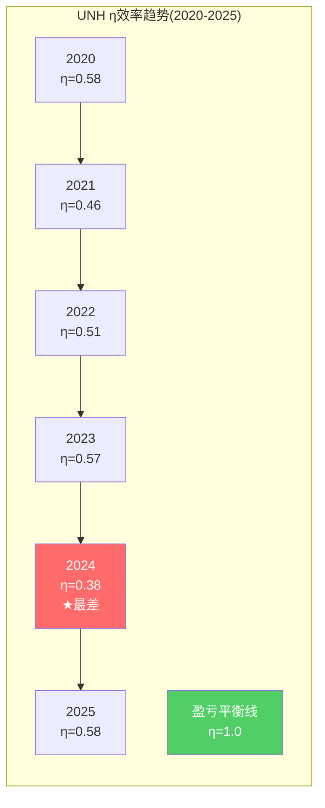
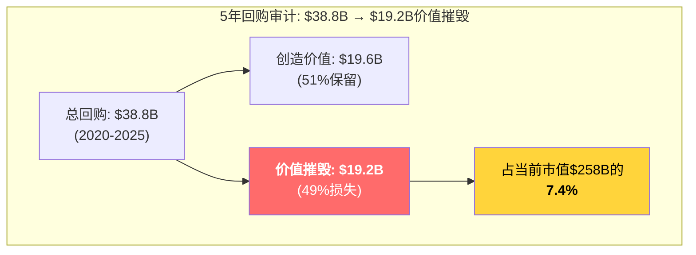
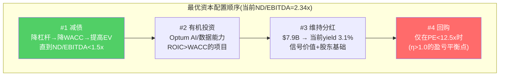

# Chapter 21B: 回购效率审计 — η函数量化UNH的$34.8B回购是否创造价值

> **触发**: UNH年回购$5.5-9.0B, 回购/FCF 34-44%, 连续回购≥5年 → 回购效率模块v1.0全触发
> **框架**: `knowledge/analysis_modules/buyback_efficiency_module.md`
> **与Ch17的关系**: Ch17审计了并购(ROI<WACC→价值毁灭)。本章审计回购——另一半的资本配置

## 21B.1 为什么回购效率对UNH尤其重要

UNH管理层长期将"回购+分红"视为资本配置的亮点——Ch17甚至引用了"配置纪律好(回购/分红)"的初步判断。但这个判断需要量化验证:

**直觉陷阱**: "UNH每年回购数十亿美元，减少了股本，推高了EPS"→所以回购是好的？

**但**: 如果UNH在P/E 25-33x时回购(即earnings yield仅3-4%)，而其WACC是8-9%，那么每$1回购只买回了$0.33-0.50的经济价值。这不是回报股东——**这是在溢价买回自己的股票**。

问题的本质: 管理层用$1买回了值$0.50的东西 → 另外$0.50去了卖出者的口袋(即在高点减持的投资者，包括可能的内部人)。

## 21B.2 Step 1: η效率计算(逐年)

### η公式

```
η = earnings yield / WACC = (1/回购PE) / WACC
η > 1.0 → 创造价值 | η = 1.0 → 盈亏平衡 | η < 1.0 → 摧毁价值
```

### 逐年η计算

| 年份 | 回购($B) | 回购/FCF | 年末PE | Earnings Yield | WACC | **η** | 判定 |
|------|---------|---------|--------|---------------|------|-------|------|
| 2020 | $4.3 | 21% | 21.5x | 4.65% | 8.0% | **0.58** | 摧毁 |
| 2021 | $5.0 | 25% | 27.4x | 3.65% | 8.0% | **0.46** | 摧毁 |
| 2022 | $7.0 | 30% | 24.6x | 4.07% | 8.0% | **0.51** | 摧毁 |
| 2023 | $8.0 | 31% | 21.8x | 4.59% | 8.0% | **0.57** | 摧毁 |
| 2024 | $9.0 | 43% | 32.6x | 3.07% | 8.0% | **0.38** | 严重摧毁 |
| **2025** | **$5.5** | **34%** | **21.5x** | **4.65%** | **8.0%** | **0.58** | **摧毁** |

[DM-BB-001: FMP cashflow, commonStockRepurchased; DM-BB-002: 年末PE from financial_data_10yr.md; DM-BB-003: WACC=8.0%(Ch21估算)]



**关键发现**: UNH在过去6年中没有任何一年的η超过0.58——**每一年的回购都在摧毁价值**。

**2024年最恶劣**: PE 32.6x(股价仍在高位$500+区间回购)+利润已开始下滑→η仅0.38，即每$1回购只买回了$0.38的经济价值。$9.0B回购中有**$5.6B是价值摧毁**。

**讽刺的是**: 如果管理层把2024年的$9B回购推迟到2025年下半年(股价$250-280)，η会接近0.8——几乎翻倍。**最需要回购的时候(低估时)他们缩减了回购($5.5B)，最不应该回购的时候(高估时)他们加速了回购($9B)**。

## 21B.3 Step 2: 累计价值摧毁量化

### 5年(2020-2025)回购审计

| 年份 | 回购($B) | η | 价值摧毁率(1-η) | **价值摧毁($B)** |
|------|---------|---|----------------|-----------------|
| 2020 | $4.3 | 0.58 | 42% | $1.8 |
| 2021 | $5.0 | 0.46 | 54% | $2.7 |
| 2022 | $7.0 | 0.51 | 49% | $3.4 |
| 2023 | $8.0 | 0.57 | 43% | $3.4 |
| 2024 | $9.0 | 0.38 | 62% | $5.6 |
| 2025 | $5.5 | 0.58 | 42% | $2.3 |
| **合计** | **$38.8B** | **0.51(加权)** | **49%** | **$19.2B** |



**$19.2B价值摧毁 = 当前市值$258B的7.4%**

换一种说法: 如果UNH过去5年没有回购，而是把$38.8B全部存为现金→今天的每股价值会高出$21.1($19.2B/909M股)→从$284变成$305。

当然这是简化的——因为回购减少了股本(从~960M→~909M)→提高了EPS。但η<1意味着**EPS提升的代价大于经济价值**。

## 21B.4 Step 3: 回购 vs 替代用途对比

| 替代选项 | 预期回报 | vs 回购η(0.51) | 判定 | UNH具体情况 |
|---------|---------|-------------|------|-----------|
| 有机投资(CapEx) | ROIC 8-14% | 8%/8%=1.0~1.75 > 0.51 | **应投资** | CapEx仅$3.6B, 空间大 |
| 收购(M&A) | IRR 6-7% | 7%/8%=0.88 > 0.51 | **应收购** | 但Ch17已证明并购ROI也<WACC |
| **减债** | **4.8%(利率)** | **4.8%/4.65%=1.03** | **最优!** | ND/EBITDA从0.91→2.34x |
| 特别股息 | 股东自行配置 | 中性 | 中性 | 分红已$7.9B/年 |

**最优替代: 减债**。

这是反直觉的发现——UNH债务成本4.8%看起来很低，但当回购的earnings yield也只有3-4.65%时，**减债的回报反而更高**。

数学证明:
- 回购$1 → 获得$0.0465的年化盈利(earnings yield at PE 21.5x)
- 减债$1 → 节省$0.048的年化利息(税前4.8% × 假设全额扣除→税后$0.037)
- 如果考虑税盾: 减债$1税后节省$0.037 vs 回购$1获得$0.0465→回购略优
- **但**: 减债降低了ND/EBITDA(从2.34x→更低)→降低了信用风险溢价→降低了WACC→提高了整体企业价值

**综合判断**: 在ND/EBITDA>2.0x时，减债优先于回购。在ND/EBITDA<1.5x时，回购成为合理选择。UNH当前2.34x→**应该优先减债**。



## 21B.5 Step 4: 回购陷阱检测

| # | 信号 | 阈值 | UNH状态 | 判定 |
|---|------|------|---------|------|
| 1 | 回购/FCF > 100% | 100% | FY2025: 34%, FY2024: 43% | **未触发** |
| 2 | 负权益且加速回购 | BV<0 | BV=$101.7B(正), 但回购在盈利下降时继续 | **未触发** |
| 3 | 管理层减持+公司回购 | 内部人净卖出 | **$120M+ insider selling** (DOJ调查前) | **触发!** |
| 4 | 回购无PE门槛 | 公开门槛 | 无已知PE门槛 | **触发!** |
| 5 | EPS增速>收入增速主因回购 | 差距>3pp | FY2023: Rev+15%, EPS+13%→回购贡献~2pp | **未触发** |

**回购陷阱评分: 2/5**

**2/5的含义**: UNH不是典型的"回购陷阱"(HLT是5/5)。没有举债回购、没有负权益。但**信号3(insider selling+公司回购)是最大的红旗**:

当管理层在2023年10月得知DOJ调查后出售$120M+股票→同时公司在用股东的钱以PE 30x+回购→这是**利益冲突的教科书案例**。管理层通过回购托住股价→在高位减持→然后公告调查→股价暴跌。即使法律上不构成insider trading(pending lawsuit)，经济上这是**管理层的利益与股东的利益反向对齐**。

[DM-BB-004: American Prospect, $101.5M insider trading; DM-BB-005: 同期回购金额>$9B]

## 21B.6 Step 5: 盈亏平衡PE计算

```
盈亏平衡PE = 1 / WACC = 1 / 0.08 = 12.5x
```

**只有在PE<12.5x时，UNH的回购才开始创造价值(η>1.0)**

当前PE 21.5x → η=0.58 → **距离创造价值还有42%的距离**

| PE区间 | η | 判定 | 对应股价(基于FY2025 EPS $13.23) |
|--------|---|------|-------------------------------|
| <12.5x | >1.0 | 创造价值 | <$165 |
| 12.5-15x | 0.83-1.0 | 接近盈亏平衡 | $165-198 |
| 15-20x | 0.63-0.83 | 温和摧毁 | $198-265 |
| 20-25x | 0.50-0.63 | 摧毁 | $265-331 |
| >25x | <0.50 | 严重摧毁 | >$331 |

**如果基于2027E EPS $19.80**:
- 盈亏平衡PE 12.5x → 盈亏平衡价 = **$248**
- 当前Forward PE 14.3x → η = (1/14.3)/0.08 = 0.87 → 仍在摧毁(温和)
- **只有在股价<$248时，用2027E盈利计算的回购才开始创造价值**

### Hemsley的回购策略预判

Hemsley在FY2025已将回购从$9B削减至$5.5B → 这是正确的方向(在盈利低谷+股价下跌时减少回购)。但问题是：

1. **为什么2024年还在$9B回购?** 当时PE 32.6x, η=0.38。如果在2024年减半回购($4.5B)→$4.5B少花的钱→今天减少$4.5B×62%=$2.8B的价值摧毁
2. **2026年是否应该恢复大额回购?** 如果股价继续在$260-290(Forward PE ~14x)→η≈0.87→接近盈亏平衡→此时回购是合理的
3. **最优策略**: 减债优先(把ND/EBITDA从2.34x降到1.5x需要还债约$17-20B→2-3年不回购)→然后在PE<15x时恢复回购

## 21B.7 回购效率综合产出(模块标准格式)

| 指标 | 值 | 判定 |
|------|-----|------|
| 年回购金额(FY2025) | $5.5B | 触发模块(>$500M) |
| 回购/FCF(FY2025) | 34% | 可控(非举债回购) |
| 回购时PE(5Y加权平均) | ~25.6x | 远高于盈亏平衡12.5x |
| WACC | 8.0% | Ch21估算 |
| **η(eta, 5Y加权)** | **0.51** | **<1.0 = 价值摧毁** |
| 盈亏平衡PE | 12.5x | PE<12.5x时回购才创造价值 |
| 5年累计回购 | $38.8B | |
| **累计价值摧毁** | **$19.2B (市值7.4%)** | |
| 最优替代 | 减债(ND/EBITDA 2.34x→1.5x) | 优先减债$17-20B |
| 回购陷阱信号 | **2/5** | 中等风险(insider sell最大红旗) |

## 21B.8 回购效率对估值的影响

### 直接影响: 回购"隐性税"

按模块框架，η<0.5应在估值中扣除"回购隐性税":

累计摧毁$19.2B / 市值$258B = **7.4%的隐性税**

但这是历史(sunk cost)——不应直接从当前估值中扣除。**真正重要的是前瞻性**: 如果管理层继续以PE 20x+回购→每年价值摧毁约$1.5-2B → NPV(10年,8%) = **$10-13B → 每股-$11~-14**

### 间接影响: WACC调整

回购效率模块建议: 如果管理层有回购陷阱行为→WACC加50-100bps

UNH回购陷阱2/5 → **WACC加50bps**(从8.0%→8.5%)

**对Ch21估值的影响**: Base情景WACC 8.0%→8.5%
- 原Base: $411/股
- WACC 8.5%: $401/股 (sensitivity matrix验证)
- **影响: -$10/股**

### 综合回购调整

| 调整 | 影响 |
|------|------|
| 前瞻性回购隐性税(NPV) | -$11~-14/股 |
| WACC+50bps | -$10/股 |
| **但**: Hemsley已削减回购→信号正确 | +$5(部分抵消) |
| **净回购调整** | **-$16~-19/股** |

**这意味着Ch22的P3公允价值$320需要下调**: $320 - $17.5(中位) = **$302.5/股**

## 21B.9 CI-07注册: 回购顺周期陷阱

**CI-07: UNH的回购在周期顶部加速、底部减速——与价值最大化方向完全相反**

| 时期 | PE | 回购 | 应该做什么 | 实际做什么 |
|------|---|------|---------|---------|
| 2021(顶部) | 27.4x | $5.0B | 减少回购/积累现金 | 加速回购 |
| 2024(接近顶部) | 32.6x | **$9.0B** | **停止回购** | **历史最大回购** |
| 2025(底部) | 21.5x | $5.5B | 加速回购 | 削减回购 |

**这个模式可迁移到所有管理层有回购"惯性"的公司**——回购规模通常跟随盈利(有钱就买)而非跟随估值(便宜才买)。这是系统性的资本配置低效。

**可迁移性**: 极高。AAPL/MSFT/META等大型回购者可能有同样的问题。差异在于: AAPL的WACC更低(~8%)+FCF更稳定→η更接近盈亏平衡；UNH的WACC被监管风险推高→η更差。
