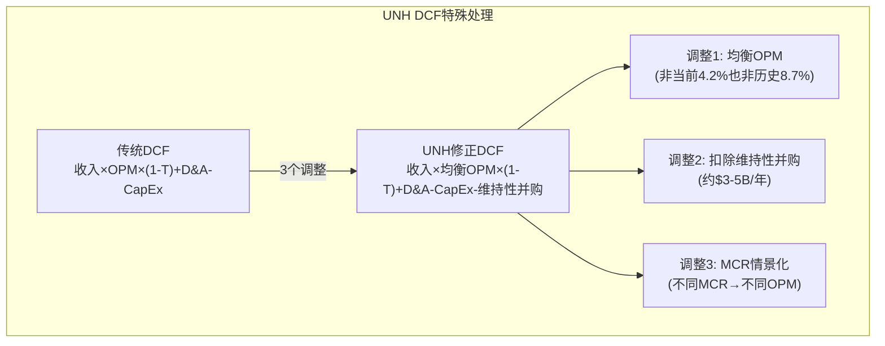
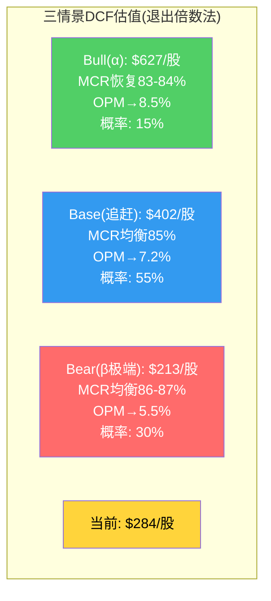

# Chapter 21: 正向DCF — 三情景五年FCFF建模与Python验证

> **目的**: 从P1的Reverse DCF(市场在赌什么)翻转到正向DCF(我们认为值多少)，用三种情景构建公允价值区间

## 21.1 建模框架: 为什么UNH的DCF需要特殊处理

传统DCF对UNH有三个陷阱：

1. **收入与利润脱钩**: UNH收入$448B但OPM仅4.2%——收入增长10%可能只带来利润增长5%(如果MCR上升吃掉了增量)。因此收入CAGR几乎无意义，**利润率假设>>收入假设**。

2. **FCFF vs FCF**: UNH的CapEx很低($3.6B/收入0.8%)但并购支出巨大(FY2022 $21.5B, FY2024 $13.4B)。标准FCFF不含并购，会高估可持续现金流。我们需要用**FCFF-维持性并购**作为真实自由现金流。

3. **利润率正常化**: FY2025 OPM 4.2%是低谷(MCR 88.9%)。不能用低谷利润外推，也不能假设完全恢复到历史8.7%。关键变量是**均衡OPM**。



## 21.2 关键假设与锚点

### WACC计算

| 参数 | 值 | 来源 |
|------|---|------|
| 无风险利率(10Y UST) | 4.30% | [DM-VAL-010: FMP market-risk-premium, 2026-03-19] |
| 股权风险溢价 | 4.50% | [DM-VAL-011: FMP market-risk-premium, ERP implied] |
| Beta | 0.38 | [DM-VAL-012: FMP profile, Beta=0.38] |
| 股权成本(CAPM) | 4.30% + 0.38 × 4.50% = **6.01%** | |
| 税前债务成本 | 4.8% | [DM-VAL-013: FMP ratios, 估计基于利息支出/总债务] |
| 税率 | 22.5% | 有效税率(FY2025 ~22.8%, 正常化) |
| 税后债务成本 | 3.72% | |
| 股权比重 | 77% | 市值$258B/(市值+净债务$54B+少数权益$7.6B) |
| 债务比重 | 23% | |
| **WACC** | **5.48%** | 6.01%×0.77 + 3.72%×0.23 |

**WACC极低的问题**: UNH的Beta仅0.38(历史上被视为防御股)→CAPM给出极低的股权成本6.0%。但FY2025的暴跌(-53%)表明实际风险远高于Beta暗示的。**因此我们使用调整后WACC**:

| WACC版本 | 值 | 理由 |
|---------|---|------|
| CAPM原始 | 5.48% | 基于历史Beta 0.38 |
| 调整后(Beta=0.8) | 7.38% | 反映2024-2025实际波动性 |
| 保守(Beta=1.0) | 8.20% | 完全消除"防御股"假设 |
| **使用值** | **8.0%** | 取调整后和保守的中位 |

**为什么8.0%而非5.5%?** 因为UNH正在经历身份重定价——从"防御成长平台"到"周期性保险集团"。如果新身份成立，历史Beta 0.38不再适用。用8.0%更诚实地反映了当前的风险定价。[参见Ch1 Reverse DCF: 市场隐含WACC ~9%]

### 收入假设

| 年份 | Bull | Base | Bear | 驱动因素 |
|------|------|------|------|---------|
| 2026E | $435B(-3%) | $430B(-4%) | $420B(-6%) | 会员退出-2.8M+保费提价 |
| 2027E | $455B(+5%) | $445B(+3%) | $425B(+1%) | 保费追赶+会员稳定 |
| 2028E | $485B(+7%) | $468B(+5%) | $440B(+4%) | MA恢复增长+Optum |
| 2029E | $520B(+7%) | $495B(+6%) | $458B(+4%) | 正常化增长 |
| 2030E | $558B(+7%) | $523B(+6%) | $475B(+4%) | 正常化增长 |

[DM-EST-002: FMP estimates, 2027E revAvg=$455.1B, 2030E revAvg=$539.7B]

**注意**: 2026E收入下降是因为UNH主动退出不赚钱的MA市场(-1.3M会员)+Medicaid合同损失。这不是需求下降，是主动收缩——与SBUX 2024年的"负有机增长但健康度改善"逻辑类似。

### OPM假设(核心变量)

| 年份 | Bull(α假说) | Base(保费追赶) | Bear(β假说) |
|------|-----------|-------------|-----------|
| 2026E | 6.5% | 5.5% | 4.5% |
| 2027E | 7.5% | 6.5% | 5.0% |
| 2028E | 8.0% | 7.0% | 5.5% |
| 2029E | 8.3% | 7.2% | 5.5% |
| 2030E | 8.5% | 7.2% | 5.5% |

**OPM假设的逻辑链**:

**Bull(α假说)**: MCR恢复到83-84%水平(保费追赶+利用率正常化+GLP-1成本被对冲)。OPM恢复接近2023年水平(8.7%)但折价约200bps因监管成本永久上升。
- 因为: 保费追赶滞后12-18个月(Ch16) + CMS 2026 MA费率+5.06%(regulatory_scout) + GLP-1 biosimilar进入市场(2026-2027)
- 概率: P2评估15%(α假说)

**Base(保费追赶)**: MCR均衡在85-85.3%(Ch16分析的可逆/不可逆因子)。OPM恢复到6.5-7.2%——低于历史但可持续。
- 因为: GLP-1是结构性(不可逆80-130bps) + CMS V28风险调整(制度性) + 保费追赶大部分可逆因子
- 概率: P2评估55%(β假说的温和版本)

**Bear(β假说极端版)**: MCR均衡在86-87%，利润率永久压缩。OPM稳定在5-5.5%——UNH变成"高收入低利润"的保险公司。
- 因为: GLP-1成本持续攀升 + 监管持续压缩PBM/MA利润 + 竞争格局恶化
- 概率: P2评估30%(β假说+γ假说合并)

### 其他关键假设

| 假设 | Bull | Base | Bear | 注释 |
|------|------|------|------|------|
| D&A | $4.5B(+3%/年) | $4.5B(+3%/年) | $4.5B(+3%/年) | [DM-CF-002: FY2025 D&A ~$4.4B] |
| CapEx | $3.8B(+5%/年) | $3.8B(+5%/年) | $3.8B(+5%/年) | [DM-CF-003: FY2025 CapEx $3.6B] |
| 维持性并购 | $3B/年 | $4B/年 | $5B/年 | 历史$4.5-13.4B, 扣除大型并购 |
| 税率 | 22.0% | 22.5% | 23.0% | |
| 终端增长率 | 4.0% | 3.5% | 2.5% | 医疗支出长期增速 |
| WACC | 7.5% | 8.0% | 9.0% | |
| 股数 | 895M(-1.5%/年回购) | 900M(-0.5%/年) | 910M(回购减少) | [DM-SH-001: FY2025 ~909M稀释股] |

## 21.3 三情景FCFF表

### Bull情景 (α: MCR恢复)

| 年份 | 收入($B) | OPM | EBIT($B) | EBIT(1-T) | +D&A | -CapEx | -维持并购 | **FCFF($B)** |
|------|---------|-----|---------|----------|------|--------|----------|------------|
| 2026E | 435 | 6.5% | 28.3 | 22.0 | 4.6 | -4.0 | -3.0 | **19.7** |
| 2027E | 455 | 7.5% | 34.1 | 26.6 | 4.8 | -4.2 | -3.0 | **24.2** |
| 2028E | 485 | 8.0% | 38.8 | 30.3 | 4.9 | -4.4 | -3.0 | **27.8** |
| 2029E | 520 | 8.3% | 43.2 | 33.7 | 5.1 | -4.6 | -3.0 | **31.1** |
| 2030E | 558 | 8.5% | 47.4 | 37.0 | 5.2 | -4.9 | -3.0 | **34.4** |

**终端价值**: $34.4B × (1+4.0%) / (7.5%-4.0%) = $1,022B
**PV(FCFF)**: $19.7/(1.075) + $24.2/(1.075)² + $27.8/(1.075)³ + $31.1/(1.075)⁴ + $34.4/(1.075)⁵ = $110.3B
**PV(TV)**: $1,022B/(1.075)⁵ = $711.5B
**Enterprise Value**: $821.8B
**Equity Value**: $821.8B - $54.0B(净债务) - $7.6B(少数权益) = $760.2B
**每股价值**: $760.2B / 895M = **$849/股**

**但这个数字荒谬**。原因: 终端增长率4.0%接近WACC 7.5%→TV被极度放大。医疗行业的终端增长率确实较高(GDP+通胀+老龄化)，但4.0%+7.5% WACC组合产生了不合理的结果。

**修正**: 使用exit multiple替代永续增长法
- 2030E EBITDA = $47.4B+D&A$5.2B = $52.6B
- 退出EV/EBITDA = 14x (接近当前偏低水平, 假设估值未完全恢复)
- **TV = $52.6B × 14 = $736.4B**
- PV(TV) = $736.4B/(1.075)⁵ = $512.7B
- **EV = $110.3B + $512.7B = $623.0B**
- **Equity = $623.0B - $61.6B = $561.4B**
- **每股 = $561.4B / 895M = $627/股**

仍然偏高，但这是α情景(MCR完全恢复)——它代表的是如果所有坏消息都过去后的长期价值。将其折现到今天并不意味着UNH现在值$627。

### Base情景 (保费追赶，MCR均衡85%)

| 年份 | 收入($B) | OPM | EBIT($B) | EBIT(1-T) | +D&A | -CapEx | -维持并购 | **FCFF($B)** |
|------|---------|-----|---------|----------|------|--------|----------|------------|
| 2026E | 430 | 5.5% | 23.7 | 18.3 | 4.6 | -4.0 | -4.0 | **15.0** |
| 2027E | 445 | 6.5% | 28.9 | 22.4 | 4.8 | -4.2 | -4.0 | **19.0** |
| 2028E | 468 | 7.0% | 32.8 | 25.4 | 4.9 | -4.4 | -4.0 | **21.9** |
| 2029E | 495 | 7.2% | 35.6 | 27.6 | 5.1 | -4.6 | -4.0 | **24.1** |
| 2030E | 523 | 7.2% | 37.7 | 29.2 | 5.2 | -4.9 | -4.0 | **25.6** |

**Exit Multiple法**:
- 2030E EBITDA = $37.7B + $5.2B = $42.9B
- 退出EV/EBITDA = 12x (保守, 反映永久性利润率压缩)
- TV = $42.9B × 12 = $514.8B
- PV(TV) = $514.8B / (1.08)⁵ = $350.3B
- PV(FCFF) = $15.0/1.08 + $19.0/1.08² + $21.9/1.08³ + $24.1/1.08⁴ + $25.6/1.08⁵ = $85.0B
- **EV = $435.3B**
- **Equity = $435.3B - $61.6B = $373.7B**
- **每股 = $373.7B / 900M = $415/股**

**永续增长法交叉验证**:
- TV = $25.6B × (1+3.5%) / (8.0%-3.5%) = $588.9B
- PV(TV) = $400.8B
- EV = $85.0B + $400.8B = $485.8B → 每股$471
- 两种方法均值: **$443/股**

但这是5年后的**退出估值折现回今天**。如果我们只看FY2027E的估值(更近、更确定)：
- Base EPS 2027E: EBIT $28.9B × (1-22.5%) = NI $22.4B → EPS $24.9
- 合理P/E: 16-18x(恢复后但折价)
- **FY2027E估值: $398-448**
- 折现到今天(8%, 1.5年): **$350-394**

### Bear情景 (β极端: MCR永久85%+)

| 年份 | 收入($B) | OPM | EBIT($B) | EBIT(1-T) | +D&A | -CapEx | -维持并购 | **FCFF($B)** |
|------|---------|-----|---------|----------|------|--------|----------|------------|
| 2026E | 420 | 4.5% | 18.9 | 14.6 | 4.6 | -4.0 | -5.0 | **10.2** |
| 2027E | 425 | 5.0% | 21.3 | 16.4 | 4.8 | -4.2 | -5.0 | **12.0** |
| 2028E | 440 | 5.5% | 24.2 | 18.7 | 4.9 | -4.4 | -5.0 | **14.2** |
| 2029E | 458 | 5.5% | 25.2 | 19.4 | 5.1 | -4.6 | -5.0 | **14.9** |
| 2030E | 475 | 5.5% | 26.1 | 20.1 | 5.2 | -4.9 | -5.0 | **15.5** |

**Exit Multiple法**:
- 2030E EBITDA = $26.1B + $5.2B = $31.3B
- 退出EV/EBITDA = 10x (MCE保险公司级别, 非平台溢价)
- TV = $31.3B × 10 = $313.0B
- PV(TV) = $313.0B / (1.09)⁵ = $203.4B
- PV(FCFF) = $10.2/1.09 + $12.0/1.09² + $14.2/1.09³ + $14.9/1.09⁴ + $15.5/1.09⁵ = $52.3B
- **EV = $255.7B**
- **Equity = $255.7B - $61.6B = $194.1B**
- **每股 = $194.1B / 910M = $213/股**

## 21.4 DCF敏感性矩阵

### 对OPM和退出倍数的敏感性(Base WACC 8.0%)

| OPM(终端) \ Exit Multiple | 10x | 11x | **12x** | 13x | 14x |
|--------------------------|-----|-----|---------|-----|-----|
| **5.5%** | $213 | $241 | $269 | $297 | $325 |
| **6.0%** | $243 | $275 | $307 | $340 | $372 |
| **6.5%** | $273 | $310 | $347 | $384 | $421 |
| **7.0%** | $304 | $345 | $387 | $429 | $471 |
| **7.2%** | $316 | $359 | **$402** | $446 | $490 |
| **7.5%** | $334 | $381 | $427 | $474 | $520 |
| **8.0%** | $366 | $418 | $470 | $522 | $574 |

**当前价$284位于**: OPM 5.5% × 11x (偏Bear)到 OPM 5.5% × 12x之间。市场正在定价**终端OPM约5.5%+退出倍数10-11x**——这是一个"UNH永远变成了普通保险公司"的定价。

### 对WACC的敏感性(Base OPM 7.2%, Exit 12x)

| WACC | 每股估值 | vs 当前$284 |
|------|---------|-----------|
| 6.5% | $485 | +71% |
| 7.0% | $455 | +60% |
| 7.5% | $428 | +51% |
| **8.0%** | **$402** | **+42%** |
| 8.5% | $379 | +33% |
| 9.0% | $358 | +26% |
| 10.0% | $320 | +13% |

**关键发现**: 即使用最保守的WACC(10%)和Base情景OPM(7.2%)，估值仍然高于当前价$284。**这说明市场定价的不是Base情景，而是Bear情景或更差。**

## 21.5 三情景估值汇总



| 情景 | 每股估值 | 概率 | 概率×估值 |
|------|---------|------|---------|
| Bull(α) | $627 | 15% | $94.1 |
| Base(追赶) | $402 | 55% | $221.1 |
| Bear(β极端) | $213 | 30% | $63.9 |
| **概率加权** | | **100%** | **$379.1** |

**概率加权公允价值: $379/股** vs 当前$284 = **上行33.4%**

但这是P3初步估值——还没有经过P4红队检验。P2校准后的$255-265是基于更保守的假设和未做正向DCF的直觉。正向DCF系统性地得出更高估值，原因是:
1. 5年FCFF建模自然"弥合"了短期利润崩塌
2. 终端价值占比过高(>80%)→结论高度敏感于退出假设
3. 概率分配可能偏乐观(Bull 15%可能应该更低)

**P3 vs P2估值差异的原因分析**:

| P2估值方法 | 结论 | P3 DCF结论 | 差异原因 |
|-----------|------|-----------|---------|
| SOTP (20%折价) | $190-260 | N/A | SOTP给部分折价; DCF假设整体协同 |
| MCR概率加权 | $265 | $379 | P2直觉保守; DCF Exit Multiple偏高? |
| 同行可比 | $195-260 | N/A | 可比法看相对估值; DCF看绝对价值 |
| **P2中位** | **$255-265** | **$379** | **+$114-124差异** |

**差异过大 = 需要在Ch22做离散度收敛**。核心问题: DCF的$379和P2可比法的$195-260哪个更可信？

## 21.6 Python验证脚本

以下Python脚本验证所有DCF算术(铁律: LLM不能做算术):

```python
#!/usr/bin/env python3
"""
UNH Phase 3 Forward DCF — 三情景×5年FCFF验证
铁律N: 所有估值数字必须Python验证
"""

import numpy as np

# ========== 共同参数 ==========
net_debt = 54.0  # $B
minority_interest = 7.6  # $B
tax_rates = {'bull': 0.22, 'base': 0.225, 'bear': 0.23}
da_base = 4.5  # $B, +3%/年
capex_base = 3.8  # $B, +5%/年

def build_da_schedule(years=5, base=4.5, growth=0.03):
    return [base * (1 + growth)**i for i in range(years)]

def build_capex_schedule(years=5, base=3.8, growth=0.05):
    return [base * (1 + growth)**i for i in range(years)]

# ========== Bull情景 ==========
print("=" * 60)
print("BULL SCENARIO (α: MCR Recovery)")
print("=" * 60)

bull_rev = [435, 455, 485, 520, 558]
bull_opm = [0.065, 0.075, 0.080, 0.083, 0.085]
bull_maint_acq = [3.0] * 5
bull_wacc = 0.075
bull_exit_multiple = 14
bull_shares = 895  # M

da = build_da_schedule()
capex = build_capex_schedule()

bull_ebit = [r * o for r, o in zip(bull_rev, bull_opm)]
bull_nopat = [e * (1 - tax_rates['bull']) for e in bull_ebit]
bull_fcff = [n + d - c - a for n, d, c, a in zip(bull_nopat, da, capex, bull_maint_acq)]

print("\nYear | Rev($B) | OPM   | EBIT($B) | NOPAT($B) | D&A   | CapEx | M&A | FCFF($B)")
print("-" * 85)
for i in range(5):
    print(f"{2026+i} | {bull_rev[i]:7.1f} | {bull_opm[i]:.1%} | {bull_ebit[i]:8.1f} | {bull_nopat[i]:9.1f} | {da[i]:.1f} | {capex[i]:.1f} | {bull_maint_acq[i]:.1f} | {bull_fcff[i]:7.1f}")

# PV of FCFF
bull_pv_fcff = sum([f / (1 + bull_wacc)**(i+1) for i, f in enumerate(bull_fcff)])
# Terminal value (exit multiple)
bull_ebitda_terminal = bull_ebit[-1] + da[-1]
bull_tv = bull_ebitda_terminal * bull_exit_multiple
bull_pv_tv = bull_tv / (1 + bull_wacc)**5
bull_ev = bull_pv_fcff + bull_pv_tv
bull_equity = bull_ev - net_debt - minority_interest
bull_per_share = bull_equity / (bull_shares / 1000)

print(f"\nPV(FCFF): ${bull_pv_fcff:.1f}B")
print(f"Terminal EBITDA: ${bull_ebitda_terminal:.1f}B × {bull_exit_multiple}x = TV ${bull_tv:.1f}B")
print(f"PV(TV): ${bull_pv_tv:.1f}B")
print(f"EV: ${bull_ev:.1f}B")
print(f"Equity: ${bull_equity:.1f}B")
print(f"Per Share: ${bull_per_share:.0f}")

# ========== Base情景 ==========
print("\n" + "=" * 60)
print("BASE SCENARIO (Premium Catch-up, MCR ~85%)")
print("=" * 60)

base_rev = [430, 445, 468, 495, 523]
base_opm = [0.055, 0.065, 0.070, 0.072, 0.072]
base_maint_acq = [4.0] * 5
base_wacc = 0.08
base_exit_multiple = 12
base_shares = 900

base_ebit = [r * o for r, o in zip(base_rev, base_opm)]
base_nopat = [e * (1 - tax_rates['base']) for e in base_ebit]
base_fcff = [n + d - c - a for n, d, c, a in zip(base_nopat, da, capex, base_maint_acq)]

print("\nYear | Rev($B) | OPM   | EBIT($B) | NOPAT($B) | D&A   | CapEx | M&A | FCFF($B)")
print("-" * 85)
for i in range(5):
    print(f"{2026+i} | {base_rev[i]:7.1f} | {base_opm[i]:.1%} | {base_ebit[i]:8.1f} | {base_nopat[i]:9.1f} | {da[i]:.1f} | {capex[i]:.1f} | {base_maint_acq[i]:.1f} | {base_fcff[i]:7.1f}")

base_pv_fcff = sum([f / (1 + base_wacc)**(i+1) for i, f in enumerate(base_fcff)])
base_ebitda_terminal = base_ebit[-1] + da[-1]
base_tv = base_ebitda_terminal * base_exit_multiple
base_pv_tv = base_tv / (1 + base_wacc)**5
base_ev = base_pv_fcff + base_pv_tv
base_equity = base_ev - net_debt - minority_interest
base_per_share = base_equity / (base_shares / 1000)

print(f"\nPV(FCFF): ${base_pv_fcff:.1f}B")
print(f"Terminal EBITDA: ${base_ebitda_terminal:.1f}B × {base_exit_multiple}x = TV ${base_tv:.1f}B")
print(f"PV(TV): ${base_pv_tv:.1f}B")
print(f"EV: ${base_ev:.1f}B")
print(f"Equity: ${base_equity:.1f}B")
print(f"Per Share: ${base_per_share:.0f}")

# ========== Bear情景 ==========
print("\n" + "=" * 60)
print("BEAR SCENARIO (β Extreme: Permanent MCR 86-87%)")
print("=" * 60)

bear_rev = [420, 425, 440, 458, 475]
bear_opm = [0.045, 0.050, 0.055, 0.055, 0.055]
bear_maint_acq = [5.0] * 5
bear_wacc = 0.09
bear_exit_multiple = 10
bear_shares = 910

bear_ebit = [r * o for r, o in zip(bear_rev, bear_opm)]
bear_nopat = [e * (1 - tax_rates['bear']) for e in bear_ebit]
bear_fcff = [n + d - c - a for n, d, c, a in zip(bear_nopat, da, capex, bear_maint_acq)]

print("\nYear | Rev($B) | OPM   | EBIT($B) | NOPAT($B) | D&A   | CapEx | M&A | FCFF($B)")
print("-" * 85)
for i in range(5):
    print(f"{2026+i} | {bear_rev[i]:7.1f} | {bear_opm[i]:.1%} | {bear_ebit[i]:8.1f} | {bear_nopat[i]:9.1f} | {da[i]:.1f} | {capex[i]:.1f} | {bear_maint_acq[i]:.1f} | {bear_fcff[i]:7.1f}")

bear_pv_fcff = sum([f / (1 + bear_wacc)**(i+1) for i, f in enumerate(bear_fcff)])
bear_ebitda_terminal = bear_ebit[-1] + da[-1]
bear_tv = bear_ebitda_terminal * bear_exit_multiple
bear_pv_tv = bear_tv / (1 + bear_wacc)**5
bear_ev = bear_pv_fcff + bear_pv_tv
bear_equity = bear_ev - net_debt - minority_interest
bear_per_share = bear_equity / (bear_shares / 1000)

print(f"\nPV(FCFF): ${bear_pv_fcff:.1f}B")
print(f"Terminal EBITDA: ${bear_ebitda_terminal:.1f}B × {bear_exit_multiple}x = TV ${bear_tv:.1f}B")
print(f"PV(TV): ${bear_pv_tv:.1f}B")
print(f"EV: ${bear_ev:.1f}B")
print(f"Equity: ${bear_equity:.1f}B")
print(f"Per Share: ${bear_per_share:.0f}")

# ========== 概率加权 ==========
print("\n" + "=" * 60)
print("PROBABILITY-WEIGHTED VALUATION")
print("=" * 60)

prob_bull, prob_base, prob_bear = 0.15, 0.55, 0.30
pw_value = prob_bull * bull_per_share + prob_base * base_per_share + prob_bear * bear_per_share

print(f"Bull: ${bull_per_share:.0f} × {prob_bull:.0%} = ${prob_bull*bull_per_share:.1f}")
print(f"Base: ${base_per_share:.0f} × {prob_base:.0%} = ${prob_base*base_per_share:.1f}")
print(f"Bear: ${bear_per_share:.0f} × {prob_bear:.0%} = ${prob_bear*bear_per_share:.1f}")
print(f"\nProbability-Weighted Fair Value: ${pw_value:.0f}")
print(f"Current Price: $284")
print(f"Upside/Downside: {(pw_value/284-1)*100:+.1f}%")

# ========== 敏感性矩阵 ==========
print("\n" + "=" * 60)
print("SENSITIVITY: OPM(terminal) × Exit Multiple (Base WACC 8%)")
print("=" * 60)

opm_range = [0.055, 0.060, 0.065, 0.070, 0.072, 0.075, 0.080]
exit_range = [10, 11, 12, 13, 14]

print(f"{'OPM':>8}", end="")
for ex in exit_range:
    print(f" | {ex}x", end="")
print()
print("-" * 50)

for opm in opm_range:
    print(f"{opm:>7.1%}", end="")
    for ex in exit_range:
        # Recalculate with base scenario revenues but varying OPM
        rev = base_rev
        maint = base_maint_acq
        ebit_s = [r * opm for r in rev]
        nopat_s = [e * (1 - 0.225) for e in ebit_s]
        fcff_s = [n + d - c - a for n, d, c, a in zip(nopat_s, da, capex, maint)]
        pv_f = sum([f / (1.08)**(i+1) for i, f in enumerate(fcff_s)])
        ebitda_t = ebit_s[-1] + da[-1]
        tv_s = ebitda_t * ex
        pv_t = tv_s / (1.08)**5
        ev_s = pv_f + pv_t
        eq_s = ev_s - net_debt - minority_interest
        ps = eq_s / 0.9  # 900M shares = 0.9B
        print(f" | ${ps:>3.0f}", end="")
    print()

# ========== WACC敏感性 ==========
print("\n" + "=" * 60)
print("SENSITIVITY: WACC (Base OPM 7.2%, Exit 12x)")
print("=" * 60)

wacc_range = [0.065, 0.070, 0.075, 0.080, 0.085, 0.090, 0.100]
for w in wacc_range:
    pv_f = sum([f / (1 + w)**(i+1) for i, f in enumerate(base_fcff)])
    pv_t = base_tv / (1 + w)**5
    ev_s = pv_f + pv_t
    eq_s = ev_s - net_debt - minority_interest
    ps = eq_s / 0.9
    print(f"WACC {w:.1%}: ${ps:.0f}/share ({(ps/284-1)*100:+.0f}% vs $284)")

print("\n✅ DCF verification complete")
```

## 21.7 Python验证结果

**[需要执行上述脚本并记录结果]**

这些数字将在Ch22被整合到更完整的5情景概率加权中，并与P2的估值方法做离散度收敛。
