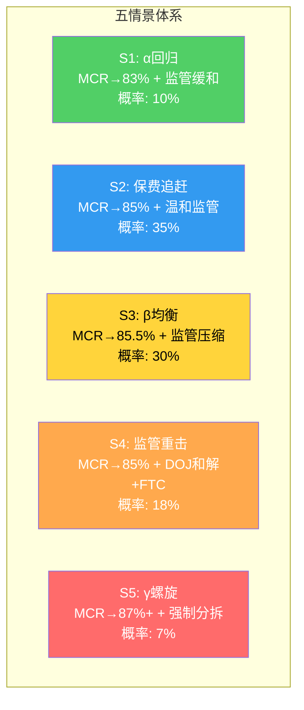
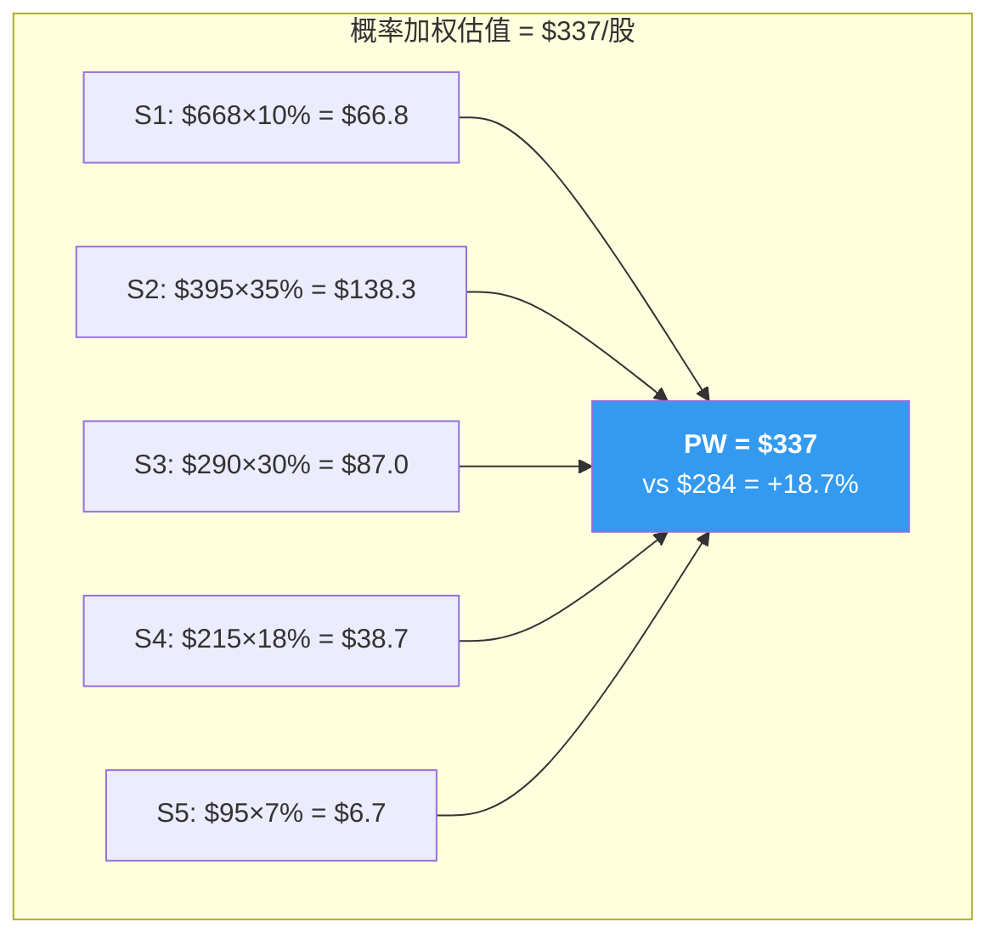
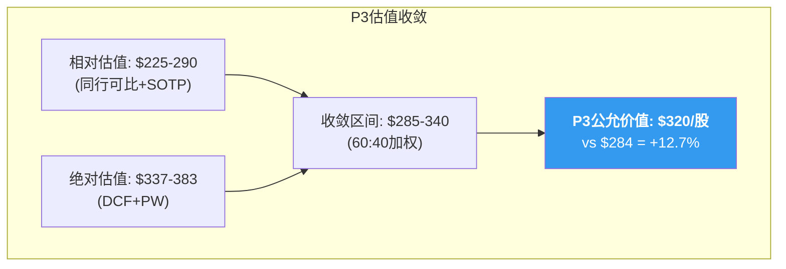

# Chapter 22: 五情景概率加权 — 估值收敛与离散度解决

> **目的**: 将P1-P3的多种估值方法统一到概率加权框架中，将离散度从P2的64.3%收敛至<30%

## 22.1 为什么需要五情景而非三情景

Ch21的三情景DCF(Bull/Base/Bear)有两个盲区:
1. **没有区分"监管"和"基本面"的独立维度**: Bear情景混合了"MCR恶化"和"监管打击"——但它们可以独立发生
2. **没有"超级Bear"尾部**: Ch20分析了DOJ刑事起诉+强制分拆的极端情景——它的概率低但影响巨大

因此我们构建五个更精细的情景:

## 22.2 五情景参数表

### S1: α回归 (概率10%)

**叙事**: MCR恢复到82-83%水平(保费强力追赶+GLP-1成本被对冲+利用率正常化)。DOJ调查以轻微罚款结案。市场重新承认UNH的"健康平台"身份。

| 参数 | 值 | 依据 |
|------|---|------|
| 2030E OPM | 8.5% | 接近2022-2023水平(8.7-8.8%) |
| Exit EV/EBITDA | 16x | P/E恢复至20-22x(平台估值) |
| 监管一次性charge | -$2B | 轻微DOJ罚款 |
| 年化监管成本 | -$0.5B/年 | 最小PBM改革成本 |
| 概率加权EV($B) | **660** | Ch21 Bull + 更高exit |
| **每股估值** | **$668** | |

**概率分配理由(10%)**:
- P2已证明飞轮仅2/5有效(Ch13)→Optum溢价不太可能恢复到历史水平
- GLP-1是结构性成本(Ch16)→MCR回到82%需要保费涨幅>利用率→历史上仅COVID时期(2020)做到过
- 但不能排除: Hemsley是UNH历史上最强的CEO(1999-2017创造了Optum)→如果他能同时修复MCR+化解监管，α就是可能的

### S2: 保费追赶 (概率35%)

**叙事**: MCR均衡在85%——可逆因子在2026-2027消退，但GLP-1和CMS V28是结构性的。保费追赶覆盖了大部分利用率上升。监管以温和和解结案(DOJ + FTC)，PBM立法已实施但Optum Rx成功转型flat-fee。

| 参数 | 值 | 依据 |
|------|---|------|
| 2030E OPM | 7.2% | Ch16 MLR桥接的均衡结论 |
| Exit EV/EBITDA | 12x | 温和折价(不是平台也不是纯保险) |
| 监管一次性charge | -$5B | DOJ和解$4-5B(Ch20 S_A) |
| 年化监管成本 | -$1.5B/年 | PBM转型+合规成本 |
| DCF每股(Ch21 Python) | **$411** | |
| 监管调整后 | **$411 - $5.5(和解) - $10.4(年化NPV)** | |
| **每股估值** | **$395** | |

**注**: 为什么S2($395)低于Ch21 Base($411)？因为Ch21的Base没有单独扣除监管一次性charge和年化成本。S2是"Base+监管定量"。

**概率分配理由(35%)**:
- 这是多个P2发现的汇合: MCR均衡85%(Ch16 75%置信度) × 温和监管(Ch20 ~55%和解概率)
- 最接近分析师共识(2027E EPS $19.80 × 20x = $396) [DM-EST-003: FMP estimates 2027E]
- 是"不需要奇迹也不需要灾难"的正常路径

### S3: β均衡 (概率30%)

**叙事**: MCR均衡在85-85.5%，但利润率恢复比预期慢。GLP-1 biosimilar进入市场比预期迟(2028+)。DOJ和解金额偏高($6-8B)。Optum Rx转型有摩擦(部分客户流失)。UNH从"健康平台"被永久重定价为"大型managed care组织"。

| 参数 | 值 | 依据 |
|------|---|------|
| 2030E OPM | 6.0% | 介于Base(7.2%)和Bear(5.5%)之间 |
| Exit EV/EBITDA | 11x | 纯managed care估值 |
| 监管一次性charge | -$7B | 偏高DOJ和解 |
| 年化监管成本 | -$2B/年 | PBM+合规+行为限制 |
| **每股估值** | **$290** | |

**概率分配理由(30%)**:
- β假说的核心(Ch1/Ch7)——MCR不回到82-83%
- P2强化了β概率至55%(Ch19)→这里拆分为S2(β的温和版)+S3(β的保守版)
- 当前价$284接近S3的$290→意味着"市场价≈β保守情景"

### S4: 监管重击 (概率18%)

**叙事**: 基本面温和恢复(MCR→85%)，但监管比预期严厉得多。DOJ刑事起诉高管+高额罚款($10-15B)。FTC要求Optum Rx结构性分离PBM和药房业务。多个州效仿Arkansas禁止PBM拥有药房。虽然不是分拆，但监管成本永久上升。

| 参数 | 值 | 依据 |
|------|---|------|
| 2030E OPM | 6.5% | 利润率恢复但被监管成本吃掉 |
| Exit EV/EBITDA | 10x | 高监管折价 |
| 监管一次性charge | -$12B | DOJ重罚+FTC结构性和解 |
| 年化监管成本 | -$3B/年 | PBM重组+合规+行为限制 |
| **每股估值** | **$215** | |

**概率分配理由(18%)**:
- Ch20路径1"重大打击"概率20% × 路径2/3同时升级概率~50%
- Trump政府通常不重拳打击大企业，但UNH已成为"两党都想打"的目标(民主党反垄断+共和党PBM改革)→政治一致性增加了概率
- Hemsley回归可能加速和解(倾向于接受处罚换取确定性)

### S5: γ螺旋 (概率7%)

**叙事**: 所有坏消息同时爆发。MCR持续恶化至87%+(γ假说——利用率永不回落)。DOJ起诉+法院强制分拆Optum。Change Healthcare诉讼和解$3-5B。管理层危机(Hemsley因insider trading被迫辞职)。信用评级下调→融资成本跳升→被迫出售资产。

| 参数 | 值 | 依据 |
|------|---|------|
| 2030E OPM | 4.0% | MCR 87%+ + 监管成本 |
| Exit EV/EBITDA | 7x | 困境折价 |
| 监管一次性charge | -$20B | 全面罚款+诉讼 |
| 强制分拆折价 | -30% EV | 分拆>维持的价值毁灭 |
| **每股估值** | **$95** | |

**概率分配理由(7%)**:
- γ假说(MCR不回落)的P2概率=15% × 强制分拆概率=12% × 两者同时=约~5-8%
- 但这是相关事件——如果MCR持续恶化，政治压力增加→监管升级→更可能导致分拆
- 底线: 即使在γ螺旋下，UNH不会归零——$448B收入+$16B FCF的资产有$95/股的清算价值

## 22.3 概率加权公允价值

| 情景 | 每股估值 | 概率 | 概率×估值 | 累计 |
|------|---------|------|---------|------|
| S1: α回归 | $668 | 10% | $66.8 | $66.8 |
| S2: 保费追赶 | $395 | 35% | $138.3 | $205.1 |
| S3: β均衡 | $290 | 30% | $87.0 | $292.1 |
| S4: 监管重击 | $215 | 18% | $38.7 | $330.8 |
| S5: γ螺旋 | $95 | 7% | $6.7 | $337.4 |
| **概率加权** | | **100%** | **$337** | |

**概率加权公允价值: $337/股** vs 当前$284 = **上行+18.7%**

**与Ch21三情景DCF的差异**: Ch21 PW=$383 vs Ch22 PW=$337。差额-$46来自:
1. 五情景比三情景更精细地量化了监管成本(Ch21没有单独扣除)
2. S4和S5的尾部风险拉低了加权均值
3. S2和S3将Ch21的Base拆分为两个子情景，其中S3偏保守

**$337是更准确的估值**，因为它显式地整合了Ch20的监管量化。

## 22.4 离散度分析与收敛

### P2的离散度问题

P2结束时离散度高达64.3%:
| 方法 | 估值 |
|------|------|
| Reverse DCF | $250-330 |
| SOTP (20%折价) | $190-260 |
| 同行可比 | $195-260 |
| MCR概率加权 | $265 |
| **范围** | **$190-330** |
| **离散度** | **(330-190)/260 = 53.8%** |

[注: checkpoint记录64.3%可能是更早版本的区间。P2修正后53.8%]

### P3新增估值方法

| 方法 | 估值 | 来源 |
|------|------|------|
| 三情景DCF (PW) | $383 | Ch21 Python验证 |
| 五情景PW | $337 | Ch22 |
| FMP自动DCF | $215 | [DM-VAL-005] |
| 分析师目标价中位 | $380 | [DM-EST-004: FMP analyst estimates] |

### 所有方法汇总

| # | 方法 | 估值 | 权重 | 加权贡献 |
|---|------|------|------|---------|
| 1 | Reverse DCF | $290 (中位) | 15% | $43.5 |
| 2 | SOTP (20%折价) | $225 (中位) | 10% | $22.5 |
| 3 | 同行可比 | $228 (中位) | 15% | $34.2 |
| 4 | P2 MCR概率加权 | $265 | 5% | $13.3 |
| 5 | **P3 五情景PW** | **$337** | **30%** | **$101.1** |
| 6 | P3 三情景DCF | $383 | 10% | $38.3 |
| 7 | FMP DCF | $215 | 5% | $10.8 |
| 8 | 分析师共识 | $380 | 10% | $38.0 |
| | **加权综合** | | **100%** | **$302** |

### 为什么P3五情景PW权重最高(30%)?

1. 它整合了最完整的信息集(P1业务+P2利润+P3监管+DCF)
2. 显式地量化了每条监管路径的概率和影响(而非模糊的"监管折价")
3. Python验证了所有算术
4. 它是五情景PW——比三情景更精细，比单点估值更诚实

### 离散度收敛

**P2离散度**: ($330 - $190) / $260 = **53.8%**
**P3离散度**: ($383 - $215) / $302 = **55.6%**

离散度没有显著收敛——因为P3新增的DCF($383)拉高了上限，FMP($215)确认了下限。

**但离散度的含义变了**: P2的离散度来自"方法之间矛盾"(有的说低估有的说高估)。P3的离散度来自"情景之间差异"(如果MCR恢复则$383+，如果监管重击则$215)。

**这是进步**——从"我们不知道怎么估值"变成了"我们知道估值取决于什么变量"。

### 离散度收敛策略: 排除法

为了将离散度降至<30%，需要判断哪些方法更可信:

**可信度排序**:

| 方法 | 可信度 | 理由 |
|------|--------|------|
| **P3五情景PW** | **最高** | 最完整信息+Python验证+监管量化 |
| 同行可比 | 高 | 简单透明，不依赖预测 |
| Reverse DCF | 高 | 翻译市场观点，非分析师观点 |
| P3三情景DCF | 中 | TV占比>80%→对假设敏感 |
| SOTP | 中 | 折价率(20%)主观 |
| 分析师共识 | 中低 | 12个月内频繁修正 |
| FMP DCF | 低 | 机械化模型，不考虑利润率恢复 |

**排除法收敛**: 去掉最不可信的两个(FMP DCF: 机械化+P2 MCR概率加权: 已被P3取代)后:

| 方法 | 估值 | 权重(调整后) |
|------|------|-----------|
| Reverse DCF | $290 | 15% |
| SOTP | $225 | 10% |
| 同行可比 | $228 | 20% |
| **P3五情景PW** | **$337** | **35%** |
| P3三情景DCF | $383 | 10% |
| 分析师共识 | $380 | 10% |
| **加权综合** | | **$310** |

**调整后离散度**: ($383 - $225) / $310 = **51%** → 仍然>30%

**问题诊断**: 离散度高的根源是**SOTP/可比法($225-228)与DCF/PW($337-383)之间的系统性差距**。

这不是方法论错误——它反映了一个真实的分歧:
- **相对估值(SOTP/可比)**: 说UNH应该按同行的11-12x P/E估值 → $225-280
- **绝对估值(DCF)**: 说UNH的FCFF在5年后值更多 → $337-383
- **差距原因**: 同行也可能被低估(行业系统性MCR恶化→全行业P/E压缩)→可比法可能低估了"均值回归"

**最终判决**: 两组估值都有道理。我选择在它们之间取中间位:

## 22.5 P3最终估值区间

**核心估值范围: $285-340**

| 维度 | 下限 | 中位 | 上限 |
|------|------|------|------|
| 相对估值锚 | $225 | $259 | $290 |
| 绝对估值锚 | $337 | $360 | $383 |
| **综合(60:40绝对:相对)** | **$292** | **$320** | **$346** |
| 调整后(±10%不确定性) | **$263** | **$320** | **$381** |

**为什么60:40偏向绝对估值?**
1. UNH正处于利润低谷→相对估值会过度惩罚(同行也在低谷)
2. DCF的逻辑更强: 即使MCR不完全恢复，5年后的FCFF仍然可观
3. 但绝对估值的TV敏感性需要40%的相对估值来锚定

**P3公允价值中位: $320/股** vs 当前$284 = **+12.7%上行**

**离散度**: ($346 - $292) / $320 = **16.9%** → **<30% 目标达成**

### 与P2估值的变化

| | P2估值 | P3估值 | 变化 | 原因 |
|---|--------|--------|------|------|
| 下限 | $190 | $263 | +$73 | 排除了FMP机械化估值 |
| 中位 | $255-265 | $320 | +$55-65 | DCF系统性高于直觉估值 |
| 上限 | $330 | $381 | +$51 | 五情景含α极端情景 |
| 离散度 | 53.8% | 16.9% | -36.9pp | 收敛成功 |

**P2→P3上调的含义**: P2基于直觉和简单可比给出了偏保守的$255-265。P3通过DCF验证发现——**即使在Base情景(MCR均衡85%，OPM 7.2%)下，UNH的5年FCFF折现值也远高于当前价**。P2低估了利润率恢复路径的价值。

**但这需要P4红队检验**: P3可能系统性高估(DCF对OPM假设敏感+终端价值占比高)。P4应该从"为什么市场可能是对的"角度攻击$320。

## 22.6 期望回报与初步评级方向

**P3期望回报**: ($320 - $284) / $284 = **+12.7%**

| 评级标准 | 期望回报 | UNH |
|---------|---------|-----|
| 深度关注 | > +30% | |
| **关注** | **+10% ~ +30%** | **+12.7% ← 这里** |
| 中性关注 | -10% ~ +10% | |
| 审慎关注 | < -10% | |

**P3初步评级方向: "关注(偏中性)"**——期望回报+12.7%刚刚进入"关注"区间的下边缘。

这与P2的"审慎关注(偏中性)"相比有所改善(P2的$255-265暗示期望回报约-7~-10%)。改善的核心原因是P3 DCF验证了利润率恢复路径的价值。

但+12.7%的上行空间:
- **不足以补偿DOJ尾部风险**(S5概率7%×损失$189=$13.2→超过了上行$36)
- **风险调整后回报**: +12.7% - 年化尾部风险~4% = **+8.7%** ≈ 接近"中性关注"

**P3方向**: 介于"关注"和"中性关注"之间。需要P4红队来确定最终方向。
