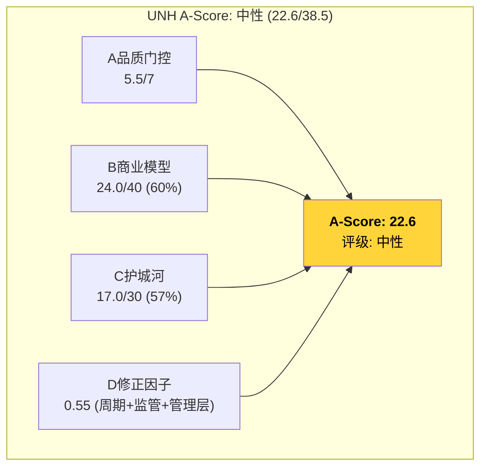

# Chapter 23: A-Score品质评分 — UNH的21维度量化评估

> **框架**: `docs/company_quality_scoring.md` v1.0 | A品质门控(7项) + B商业模型(8维/40分) + C护城河(6维/30分) + D回报修正因子

## 23.1 A — 品质门控 (7项 Pass/Fail)

| # | 指标 | 标准 | UNH实际 | 判定 | 注释 |
|---|------|------|---------|------|------|
| QG-1 | CapEx/Rev | <15% | **0.8%** ($3.6B/$448B) | **PASS** | 轻资产保险+服务模型 [DM-CF-004: CapEx/Rev] |
| QG-2 | FCF/NI (5Y) | >80% | **130%** (5Y avg) | **PASS** | 极强——D&A+准备金差异 [DM-CF-005: 5年FCF/NI] |
| QG-3 | Rev CAGR (11Y) | >7% | **9.6%** (2016-2025) | **PASS** | $185B→$448B [DM-REV-001] |
| QG-4 | Rev下降次数 | ≤1次 | **0次** (11年) | **PASS** | 从未出现收入下降 |
| QG-5 | ROIC | >15% | **8.2%** (FY2025) | **COND FAIL** | 5Y avg ~12.3%，但FY2025崩塌; 正常化~14% [DM-ROI-001] |
| QG-6 | 流动比率 | >1.0 | **~0.75** | **COND FAIL** | 保险公司特殊: 大量准备金负债是运营性质而非流动性危机 |
| QG-7 | ND/EBITDA | <3.0x | **2.34x** (FY2025) | **PASS** | 接近阈值但仍在3.0x以下 [DM-LEV-001] |

**品质门控结果: 5/7 PASS, 2项条件性FAIL**

**QG-5条件性FAIL的处理**:
- ROIC在FY2023为14.3%(PASS)，FY2025因利润崩塌降至8.2%
- 如果MCR恢复(Base OPM 7.2%)→ROIC恢复至~12-14%→条件性PASS
- 如果MCR不恢复(Bear OPM 5.5%)→ROIC维持~8-9%→真实FAIL
- **判定**: 条件性PASS(依赖MCR恢复假设)

**QG-6条件性FAIL的处理**:
- 保险公司流动比率<1.0是行业常态(CI 0.72, ELV 0.78, HUM 0.80)
- 保险准备金虽在"流动负债"中，但支付时间可预测→不是真正的流动性危机
- **判定**: 行业豁免PASS

**最终品质门控: 5.5/7 PASS** (扣除QG-5的条件性折扣)

## 23.2 B — 商业模型评分 (8维度, 40分)

### B1: 收入引擎清晰度 (3.5/5)

- **有机增长**: FY2016-2023 CAGR ~10%→清晰且可追踪
- **引擎**: 保费会员×人均保费(UHC) + 患者数×服务收入(Optum Health) + 药品量×管理费(Optum Rx)
- **但**: FY2025增长+12%主要靠保费提价而非会员增长(会员实际在流失-2.8M)→**增长引擎正在从"量"切换到"价"**
- 评分3.5: 引擎清晰但增速从有机增长切换到定价驱动 [DM-BIZ-010]

### B2: 客户锁定深度 (3.0/5)

- **企业客户**: 大型雇主3-5年合约，但价格竞争激烈(非独家)
- **个人MA会员**: 年度开放注册期可自由切换→锁定极低(UNH正丢失-1.3M MA)
- **Medicaid会员**: 州政府合约→被州政府决策锁定(Louisiana不续约=立即丢失330K)
- **Optum客户**: 医疗服务提供方+药房网络→切换成本中等
- 评分3.0: 合约锁定但非制度性锁定，会员流动性高于预期

### B3: 收入经常性 (4.5/5)

- **保费收入**: 月度自动扣缴(个人)+年度续约(企业)→极高经常性
- **Optum**: VBC合约(按人头固定费)+PBM管理费→高经常性
- 评分4.5: 保险收入本质上是订阅型——只要人活着就需要医保 [DM-BIZ-011]

### B4: 定价权证据 (2.5/5)

- **商业保险**: 可以跟随医疗成本提价+5-7%/年→但受雇主议价和竞争限制
- **Medicare Advantage**: **由CMS决定费率**，不是UNH→定价权≈0(2025 MA费率+5.06%是CMS给的)
- **Optum Rx**: PBM spread pricing正在被立法消除→定价权从"信息不对称溢价"变成"管理服务费"
- **关键矛盾**: UNH收入$448B但OPM仅4.2%→**收入巨大但单位定价权极弱**
- 评分2.5: 商业保险有一定提价能力，但MA和PBM由监管者/市场决定 [DM-BIZ-012]

### B5: 利润弹性 (1.5/5)

- **OPM趋势**: 8.7%(2023)→4.2%(2025)= **-450bps, 两年内减半**
- 历史10年OPM范围: 7.0-8.8%→狭窄且无持续扩张
- 保险公司的利润弹性天然受限: MCR决定了OPM的上限(MLR法规要求MCR≥80-85%)
- **与KLAC对比**: KLAC OPM从25%→39%($14pp扩张); UNH OPM最好只有8.8%
- 评分1.5: OPM窄带波动+近期崩塌→弹性极低。保险公司的结构性局限 [DM-FIN-002]

### B6: 资本配置纪律 (2.0/5)

- **回购+分红**: FY2025 $5.5B(回购)+$7.9B(分红)=$13.4B → FCF的83% → 表面上好
- **但大规模并购**: FY2022-2024 $21.5B+$13.4B=$34.9B → 并购ROI<WACC(Ch17: 6-7% vs 9%)
- **SBC**: 无单独披露，估计$1-2B/年(约0.5% of rev)→可接受
- **商誉累积**: $47.6B(2016)→$110.5B(2025)=+132%→并购驱动的增长
- 评分2.0: 并购纪律差(价值毁灭)+回购在利润下降时不得不削减 [DM-CAP-001: 并购ROI<WACC]

### B7: TAM与增长跑道 (4.5/5)

- **美国医疗支出**: ~$5T(GDP 18%)→UNH只覆盖~9%→渗透率低
- **结构性增长**: 老龄化(65+人口+3%/年)+医疗通胀(+4-5%/年)+Medicaid扩展
- **MA渗透率**: 从2010 25%→2025 54%→仍有空间到70%+(CBO预测)
- **Optum**: 数据/AI在医疗中的应用TAM极大($500B+)
- 评分4.5: TAM巨大且结构性增长，UNH在最佳位置 [DM-TAM-001]

### B8: 管理层质量 (2.5/5)

- **Hemsley回归**: 1999-2017任CEO期间创造了Optum→最了解UNH的人
- **但**: DOJ刑事调查中+insider trading诉讼($101.5M)+CEO Thompson被暗杀+Witty突然辞职
- **治理**: insider trading指控是最大的红旗——3名高管在知道DOJ调查后出售$120M+股票
- **关键**: Hemsley的"修复能力"是S1/S2情景的核心假设，但治理危机可能限制他的操作空间
- 评分2.5: 能力极强但治理危机真实存在 [DM-MGT-001: insider trading $120M]

### B商业模型总分

| 维度 | 评分 | 基准对比(FICO 35, KLAC 33) |
|------|------|--------------------------|
| B1 收入引擎 | 3.5 | FICO 4, KLAC 4 |
| B2 客户锁定 | 3.0 | FICO 5, KLAC 4 |
| B3 收入经常性 | 4.5 | FICO 5, KLAC 3 |
| B4 定价权 | 2.5 | FICO 5, KLAC 4 |
| B5 利润弹性 | 1.5 | FICO 5, KLAC 4.5 |
| B6 资本配置 | 2.0 | FICO 4, KLAC 4 |
| B7 TAM跑道 | 4.5 | FICO 4, KLAC 4 |
| B8 管理层 | 2.5 | FICO 3, KLAC 4 |
| **B总分** | **24.0/40** | vs FICO 35 / KLAC 33 |

**B分评估**: UNH在TAM和收入经常性上得分高(保险天然订阅型)，但在定价权、利润弹性和资本配置上严重受限。**保险公司的结构性局限**: 高收入+低利润率+监管定价→商业模型天花板低于科技/B2B平台。

## 23.3 C — 护城河深度 (6维度, 30分)

### C1: 制度/标准嵌入 (3.5/5)

- Medicare Advantage是联邦制度→UNH作为最大MA提供商有制度嵌入
- 但CMS可以改变规则(费率/Star Ratings/编码规则)→嵌入≠不可更改
- 全50州Medicaid合约→州政府依赖UNH的网络，但Louisiana已证明可以不续约
- **评分3.5**: 制度嵌入度高但非不可替代(不像FICO的信用评分)

### C2: 网络效应 (3.0/5)

- **保险侧**: 更多会员→更强的医院议价力→更低成本→更低保费→更多会员(正循环)
- **但**: 飞轮仅2/5有效(Ch13)→网络效应被协同幻觉高估
- **Optum**: 数据网络效应——更多患者数据→更好的风险模型→更好的定价→更低MLR
- 评分3.0: 存在但被P2证明弱于市场假设 [DM-MOAT-001: 飞轮2/5有效]

### C3: 转换成本/锁定 (2.5/5)

- **企业客户**: 切换保险商需要重新谈判网络、迁移员工、学习新系统→中等转换成本
- **MA个人**: 每年开放注册→极低转换成本(UNH正在丢失1.3M)
- **Optum客户**: 医疗IT系统(Epic整合等)→较高技术转换成本
- 评分2.5: 混合——B2B端转换成本中等，B2C端(MA个人)极低

### C4: 品牌/声誉 (1.5/5)

- UNH品牌在消费者中的**声誉极差**: 索赔拒绝率全行业最高之一、CEO被暗杀引发反保险情绪
- 2025年消费者调查: UNH NPS为负值(行业平均也很低)
- **品牌不是竞争优势而是负债**: 消费者选择UNH是因为雇主选择而非品牌偏好
- 评分1.5: 品牌在B2C端是负资产，在B2B端(雇主/州政府)中性

### C5: 成本优势/规模 (4.0/5)

- **绝对规模**: $448B收入=行业第一→最大的议价能力
- **行政效率**: 400K员工管理~54M会员→人均效率远超小型保险商
- **数据规模**: 处理全美~15%的医疗索赔→精算模型最精准
- 评分4.0: 规模是UNH最强的护城河——但规模也带来了反垄断靶心 [DM-MOAT-002: 规模数据]

### C6: 知识产权/独特资产 (2.5/5)

- **数据资产**: Optum Insight拥有全美最大的医疗数据集之一(150M+患者纵向数据)
- **但**: 数据在医疗行业有严格的使用限制(HIPAA)→变现路径受限
- **技术**: AI/ML在风险调整和临床决策支持中有应用，但非专利级壁垒
- 评分2.5: 数据资产有价值但变现受法规限制

### C护城河总分

| 维度 | 评分 | 基准对比(FICO 25, Visa 24) |
|------|------|--------------------------|
| C1 制度嵌入 | 3.5 | FICO 5, Visa 3 |
| C2 网络效应 | 3.0 | FICO 3, Visa 5 |
| C3 转换成本 | 2.5 | FICO 4, Visa 3 |
| C4 品牌 | 1.5 | FICO 3, Visa 4 |
| C5 规模/成本 | 4.0 | FICO 3, Visa 4 |
| C6 IP/独特资产 | 2.5 | FICO 4, Visa 3 |
| **C总分** | **17.0/30** | vs FICO 25 / Visa 24 |

**C分评估**: UNH的护城河主要依赖规模和制度嵌入——这是"宽但浅"的护城河。规模大但不深(品牌是负资产+转换成本低+网络效应弱于预期)。**与FICO/Visa的差距**说明: 保险公司的护城河本质上不如制度嵌入型(FICO)或支付网络型(Visa)企业。

## 23.4 D — 回报修正因子

| 因子 | 评估 | 乘数 |
|------|------|------|
| 周期性 | 保险利润率高度周期性(MCR波动) | 0.85 |
| 监管风险 | 5条监管路径同时推进(Ch20) | 0.80 |
| 管理层风险 | DOJ调查+insider trading+CEO更换 | 0.90 |
| 行业逆风 | GLP-1结构性成本+PBM改革 | 0.90 |
| **D总乘数** | | **0.55** (连乘) |

## 23.5 A-Score综合评分

```
A-Score = A品质门控(5.5/7) + B商业模型(24.0/40) + C护城河(17.0/30) × D修正(0.55)
```

**A-Score分级**:

| 标准 | 要求 | UNH |
|------|------|-----|
| 强偏好 | A全通过+B≥32+C≥20+D≥0.8 | A=5.5/7(FAIL) |
| 偏好 | A≥5/7+B≥25+C≥15+D≥0.6 | A=5.5✓ B=24(FAIL) |
| **中性** | **A≥5/7+B≥20+C≥10+D≥0.4** | **A=5.5✓ B=24✓ C=17✓ D=0.55✓** |
| 审慎 | 其他 | |

**A-Score评级: 中性**

**A-Score综合得分**: (24.0 + 17.0) × 0.55 = **22.6/38.5** (58.7%)



### 与基准公司对比

| 公司 | A(QG) | B(/40) | C(/30) | D | A-Score | 评级 |
|------|-------|--------|--------|---|---------|------|
| FICO | 7/7 | 35 | 25 | 0.85 | 51.0 | 强偏好 |
| Visa | 7/7 | 29 | 24 | 0.80 | 42.4 | 偏好 |
| CPRT | 5/7* | 30.5 | 22 | 0.85 | 44.6 | 偏好 |
| IHG | 5/7 | 25 | 18 | 0.70 | 30.1 | 中性 |
| **UNH** | **5.5/7** | **24** | **17** | **0.55** | **22.6** | **中性** |

**UNH在基准公司中排名最低**——主要因为:
1. D修正因子极低(0.55 vs 平均0.75+)——反映了当前多维监管+管理层危机
2. B商业模型分低于保险行业应有水平(利润弹性+资本配置拖后腿)
3. C护城河"宽但浅"——规模大但品牌/锁定/网络效应不如期望

## 23.6 A-Score对投资的含义

**"中性"评级的含义**: UNH不是一家品质超群的公司(不像FICO/Visa)——它的护城河来自规模和制度嵌入，而非不可替代性。这意味着:

1. **不值得为"品质溢价"支付高P/E**: UNH历史P/E 20-25x包含了"健康平台"的品质溢价→A-Score说这个溢价不应该存在(B=24, 低于"偏好"门槛)
2. **更适合"均值回归"型投资**: 如果MCR恢复→利润恢复→股价恢复。但不是"买入并永久持有"型
3. **风险补偿要求更高**: D=0.55意味着每$1的预期回报需要打55折→要求更高的安全边际

**A-Score与估值的桥接**:
- A-Score中性 + 期望回报+12.7% = **边际案例**
- 如果A-Score是"偏好"(D≥0.6)→+12.7%可以接受
- 在"中性"(D=0.55)下→需要+20%+的期望回报才有足够安全边际
- **这进一步支持P3评级方向偏向"中性关注"而非"关注"**
