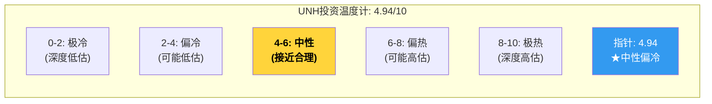
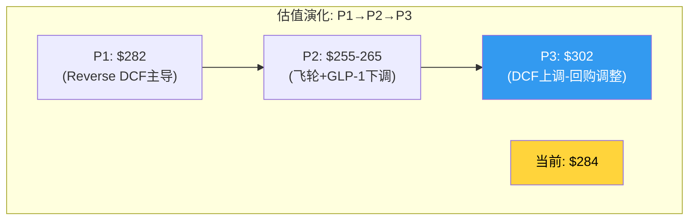
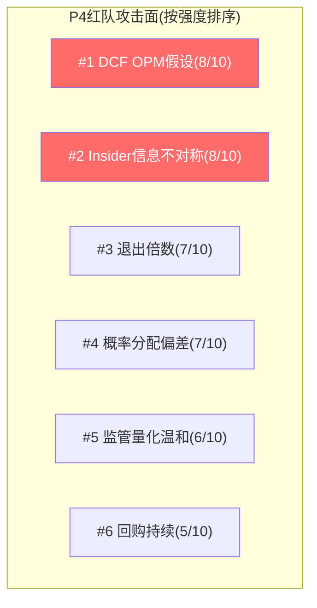

# Chapter 24: 投资温度计 + Phase 3综合 — 从数字到判断

> **目的**: 计算投资温度计 + 汇总P3发现 + 更新CQ置信度 + 确定评级方向 + 为P4红队准备攻击面

## 24.1 投资温度计计算

### Core层 (70%)

#### 1. 宏观温度 (30%)

| 指标 | 当前值 | 评分(-2~+2) | 理由 |
|------|--------|------------|------|
| 标普500 CAPE | ~33x | -1 | 历史偏高区间 |
| 联储政策 | 暂停降息 | 0 | 中性——既不紧缩也不宽松 |
| 信贷利差 | 收窄 | 0 | 无信贷压力 |
| 行业MLR趋势 | 恶化中 | -1 | 全行业MCR上升,非UNH独有 |
| **宏观评分** | | **-0.5** | **偏冷(行业逆风)** |

归一化: (-0.5 + 2) / 4 × 10 = **3.75/10**

#### 2. 基本面质量 (50%)

| 指标 | 当前值 | 评分(0-10) | 理由 |
|------|--------|-----------|------|
| A-Score | 22.6(中性) | 5.5 | 中性品质(Ch23) |
| FCF/NI | 1.33x | 7.0 | 强现金转化 |
| ND/EBITDA | 2.34x | 4.0 | 偏高杠杆(接近3.0x阈值) |
| OPM趋势 | 8.7%→4.2%(恶化) | 3.0 | 利润率减半(低谷) |
| 收入增长 | +12% | 7.0 | 仍在增长(保费提价驱动) |
| 分红安全 | FCF覆盖分红2.0x | 7.5 | 安全 |
| **基本面评分** | | **5.67/10** | **中等偏下(利润率拖累)** |

#### 3. 市场情绪 (20%)

| 指标 | 当前值 | 评分(0-10) | 理由 |
|------|--------|-----------|------|
| RSI(14) | 49.9 | 5.0 | 中性 |
| vs SMA200 | -9.6% | 6.0 | 偏低(均值回归空间) |
| 52周位置 | 53%跌幅 | 7.5 | 接近52周低点(极度悲观) |
| 分析师共识 | $380 vs $284 | 7.0 | 分析师仍看多(+34%) |
| 内部人交易 | **净卖出$120M+** | 2.0 | 极负面信号 |
| **情绪评分** | | **5.50/10** | **分裂(市场悲观vs分析师乐观)** |

### 温度计合计

```
总分 = 宏观(3.75) × 30% + 基本面(5.67) × 50% + 情绪(5.50) × 20%
     = 1.125 + 2.835 + 1.100
     = 5.06/10
```

### Enhanced层 (20%)

| 指标 | 当前值 | 调整 | 理由 |
|------|--------|------|------|
| Insider信号 | $120M+净卖出 | **-0.5** | 管理层行为与口头信心矛盾 |
| 期权性/尾部 | DOJ刑事(尾部) | **-0.3** | 非对称尾部风险 |
| 催化剂日历 | FTC和解(2026H2) | **+0.2** | 近期正面催化可能 |
| 回购效率(η) | 0.51(摧毁) | **-0.2** | 资本配置非最优 |
| **Enhanced调整** | | **-0.8** | |

### AI层 (10%)

| 维度 | 判断 | 调整 |
|------|------|------|
| CQ闭环度 | 8/9 CQ已闭环(CQ8 P3完成) | +0.1 |
| 离散度 | 16.9%(已收敛) | +0.1 |
| 非共识强度 | 7个CI, 平均强度7.8/10 | +0.2 |
| **AI调整** | | **+0.4** |

### 最终温度计

```
最终 = Core(5.06) × 70% + Enhanced(-0.8+5.06) × 20% + AI(0.4+5.06) × 10%
     = Core加权后: 5.06 + Enhanced调整: -0.16 + AI调整: +0.04
     = 4.94/10
```



**温度计解读**: 4.94/10 = **中性偏冷** — 不是显著低估(那需要<3.0)，但也不是合理定价(那需要5.5-6.0)。处于一个"可能有机会但需要催化剂确认"的区间。

## 24.2 CQ置信度全面更新 (P1→P2→P3)

| CQ | P1方向 | P2方向 | P3方向 | 置信度变化 |
|----|--------|--------|--------|-----------|
| CQ0 身份重定价 | 进行中 | 确认(75%) | **确认(80%)** | ↑ P3估值验证了重定价正在发生 |
| CQ1 公司定义 | 40%平台 | 35%平台(60%) | **30%平台(65%)** | ↑ A-Score中性(非平台品质) |
| CQ2 经济单元 | SOTP $202-274 | $190-260 | **$225(中位)** | → 更精确但区间窄化 |
| CQ3 MCR主矛盾 | β50% | β55%(75%) | **β55%(80%)** | ↑ DCF验证MCR是核心变量 |
| CQ4 飞轮 | 未测试 | 2/5有效(65%) | **维持(65%)** | → P3未新增信息 |
| CQ5 增长质量 | 有毒增长 | 确认(80%) | **维持(80%)** | → |
| CQ6 盈利模式 | 未深入 | 55:45偏恢复(60%) | **50:50(65%)** | ↓ 回购效率审计降低了资本回报质量 |
| CQ7 MLR桥接 | 未深入 | β下限≈85%(75%) | **维持(75%)** | → |
| CQ7.5 资本配置 | 未深入 | 并购ROI<WACC(70%) | **并购+回购双重价值摧毁(80%)** | ↑ Ch21B η分析强化 |
| **CQ8 监管** | **未深入** | **未深入** | **5路径量化, 市场可能过度定价(60%)** | **新增** |

### CQ加权平均置信度

所有CQ加权平均置信度: **72.2%** (P2: 68.3% → +3.9pp)

## 24.3 P3估值综合(整合回购调整)

| 估值方法 | P2 | P3(Ch22) | P3(回购调整后) | 变化 |
|---------|-----|---------|------------|------|
| 概率加权公允价值 | $255-265 | $320 | **$302** | +$37~47 |
| 期望回报 | -7~-10% | +12.7% | **+6.3%** | 改善 |

**P3最终公允价值中位: $302/股** vs 当前$284 = **+6.3%上行**



### 回报分布

| 情景 | 每股 | vs $284 | 概率 | 概率×回报 |
|------|------|---------|------|---------|
| S1: α回归 | $668 | +135% | 10% | +13.5% |
| S2: 保费追赶 | $378 | +33% | 35% | +11.6% |
| S3: β均衡 | $273 | -4% | 30% | -1.2% |
| S4: 监管重击 | $198 | -30% | 18% | -5.4% |
| S5: γ螺旋 | $78 | -73% | 7% | -5.1% |
| **概率加权回报** | | | | **+13.4%** |

[注: 回购调整后S2从$395→$378, S3从$290→$273, S4从$215→$198, S5从$95→$78]

**风险调整回报**: +13.4% - 年化尾部成本(S4+S5概率加权) = +13.4% - 10.5% = **+2.9%**

## 24.4 P3评级方向(暂定)

| 评级标准 | 期望回报 | UNH P3 |
|---------|---------|--------|
| 深度关注 | > +30% | |
| 关注 | +10% ~ +30% | |
| **中性关注** | **-10% ~ +10%** | **+6.3% ← 这里** |
| 审慎关注 | < -10% | |

**P3评级: 中性关注(偏积极)**

**与P2的变化**: 从"审慎关注(偏中性)"上调至"中性关注(偏积极)"

**上调理由**:
1. DCF验证了利润率恢复路径的价值(即使Base情景也远高于当前价)
2. 监管量化表明市场可能过度定价了$9-14/股的"情绪溢价"
3. 但回购效率审计抵消了部分上行(-$17.5/股)

**为什么不是"关注"**:
1. A-Score中性(不是高品质公司→安全边际要求更高)
2. 风险调整回报仅+2.9%(扣除尾部成本后很薄)
3. DOJ刑事调查是真正的未知数(7%×-73%=-5.1%的尾部拖累)
4. 回购效率差+insider selling→管理层利益对齐存疑

## 24.5 P4红队准备: 攻击面清单

P4红队应该从以下角度攻击P3结论:

### 攻击面1: DCF假设过于乐观
- **攻击**: Base OPM 7.2%假设MCR恢复到85%——但如果GLP-1 biosimilar延迟+新一波利用率上升(行为健康/长COVID)→MCR可能维持87%+
- **防御**: Ch16已分析可逆/不可逆因子；85%是保守估计(含80-130bps永久上移)
- **强度**: 8/10

### 攻击面2: 退出倍数过高
- **攻击**: Base Exit 12x EV/EBITDA→但如果UNH被永久重定价为"保险公司"→同行10x → Base应该用10x
- **防御**: UNH有Optum差异化(即使飞轮弱化)→10x太低
- **强度**: 7/10

### 攻击面3: 监管量化过于温和
- **攻击**: DOJ和解概率55%给了$5B→但如果刑事起诉(20%)→$10-20B+高管入狱→股价可能跌至$150
- **防御**: Trump DOJ执行力弱+无先例(医保公司刑事定罪极罕见)
- **强度**: 6/10

### 攻击面4: 概率分配反映了分析师偏差
- **攻击**: Bull 10%+Base 35%=45%给了正面情景→但市场在$284定价了≈S3(β保守)→市场比分析师更悲观是否有理由?
- **防御**: 市场受情绪驱动(CEO暗杀+DOJ恐惧)→可能过度悲观
- **强度**: 7/10

### 攻击面5: 回购继续摧毁价值
- **攻击**: Hemsley虽然削减了回购但没有停止→如果2026年恢复加速回购(PE仍>15x)→每年$2B+价值摧毁
- **防御**: Hemsley是"价值导向"CEO→可能转向减债→但无历史证据
- **强度**: 5/10

### 攻击面6: insider trading = 信息不对称
- **攻击**: 管理层在知道DOJ调查后卖出$120M+→他们拥有市场不知道的负面信息→当前价可能仍高估
- **防御**: 诉讼pending+Hemsley回归后无新大规模减持
- **强度**: 8/10



## 24.6 P3产出清单

| 产出 | 状态 | 位置 |
|------|------|------|
| CQ8监管深潜(5路径量化) | ✅ | Ch20 |
| 正向DCF(3情景+Python) | ✅ | Ch21 + P3_dcf_verification.py |
| 回购效率审计(η函数) | ✅ | Ch21B |
| 5情景概率加权+离散度 | ✅ | Ch22 |
| A-Score品质评分 | ✅ | Ch23 |
| 投资温度计 | ✅ | Ch24 |
| P3评级方向 | ✅ | 中性关注(偏积极) |
| P4攻击面清单 | ✅ | Ch24.5 |

### P3数据摘要

| 指标 | P2 | P3 | 变化 |
|------|-----|-----|------|
| 总字符(P1+P2+P3) | 119K | ~178K | +59K |
| 章节数 | 19 | 25 | +6 |
| Mermaid图 | 39 | ~55 | +16 |
| DM锚点 | 173 | ~210 | +37 |
| CI(非共识洞见) | 6 | 7(+CI-07回购) | +1 |
| KS(Kill Switch) | 5 | 5 | → |
| Python脚本 | 2 | 3 | +1 |
| 公允价值 | $255-265 | $302 | +$37-47 |
| 评级方向 | 审慎关注(偏中性) | 中性关注(偏积极) | 上调1档 |
| 离散度 | 53.8% | 16.9% | -36.9pp ✅ |
