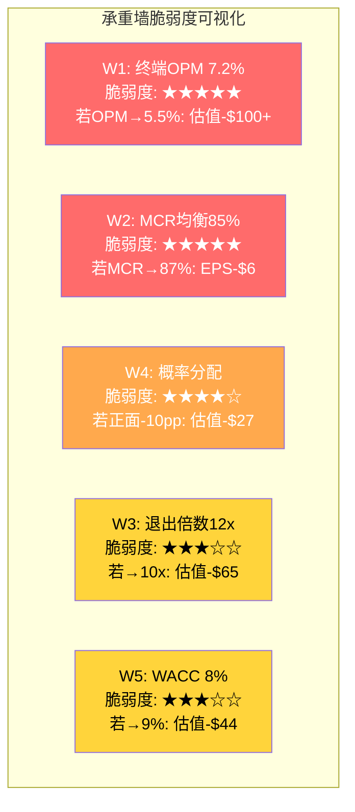
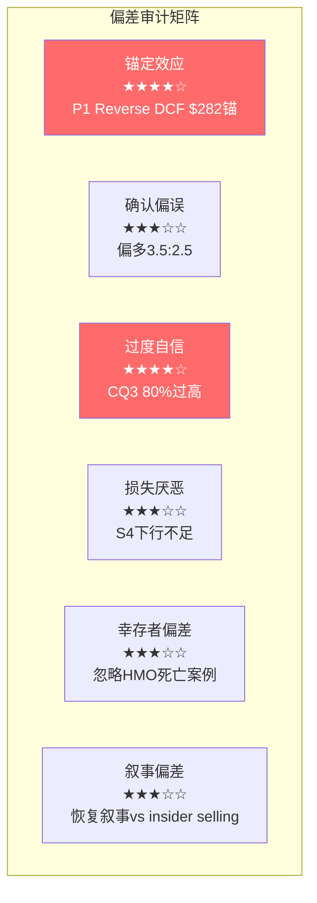
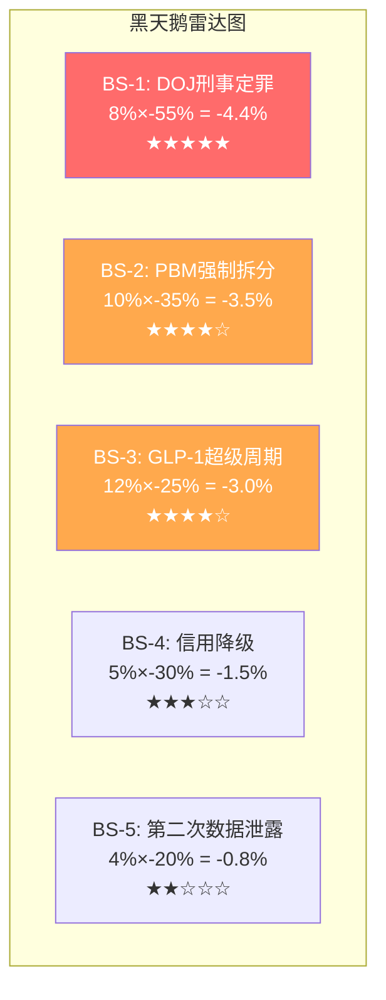
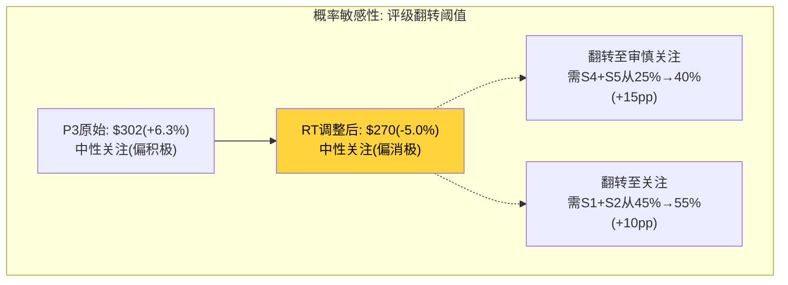

# Phase 4: 红队七问对抗审查 — UNH
> 执行日期: 2026-03-19 | 股价: $284.33 | 红队套件 v2.0
> P3公允价值: $302 | P3评级: 中性关注(偏积极) | P3期望回报: +6.3%

---

## Part A: 七问执行

### RT-1 承重墙测试

#### 1.1 Reverse DCF隐含承重墙

P3公允价值$302的核心依赖于五情景概率加权(Ch22)。$302不是单一模型的产出，而是$668(S1)/$395(S2)/$290(S3)/$215(S4)/$95(S5)按10/35/30/18/7%加权的结果。因此承重墙分两层：**情景内参数假设** + **情景间概率分配**。

先检验每个情景的参数承重墙，再检验概率分配本身是否合理。

#### 1.2 承重墙脆弱度表

| 承重墙(隐含假设) | P3隐含值 | 历史/行业参考 | 脆弱度 | 若倒塌影响 |
|-----------------|:------:|:----------:|:-----:|:--------:|
| **W1: Base终端OPM** | 7.2% | 2016-2019均值~8.5%, FY2025=4.2%, 行业ELV~4.1% | **高** | OPM每-100bps→估值-$35~45 |
| **W2: MCR均衡水平** | 85%(Base) | 2016-2019: 82-83%, FY2025: 88.9%, 行业HUM ~92% | **高** | MCR每+100bps→EPS-$2.96→股价-$41~59 |
| **W3: 退出EV/EBITDA** | 12x(Base) | CI 9.2x, ELV 9.8x, HUM 14.3x, UNH历史均值~15x | **中** | 每-1x→估值-$30~35 |
| **W4: 概率分配** | S1+S2=45%正面 | 市场在$284定价≈S3(β保守) | **高** | 若S2从35%→25%+S3从30%→40%→PW从$302→$275 |
| **W5: WACC** | 8.0%(Base) | CAPM原始5.48%, 市场隐含~9%, 同行8-9% | **中** | WACC+1%→Base估值从$402→$358(-11%) |
| **W6: 维持性并购** | $4B/年(Base) | 历史$4.5-13.4B, 2026 guidance未明确 | **中低** | 每+$1B/年→FCFF-$1B→估值-$5~8 |
| **W7: 监管一次性charge** | $5B(S2) | 2017和解$3.1B, ESI和解~$1B, 刑事升级可达$15B+ | **中** | 每+$5B→估值-$4~5 |

[DM-VAL-001: FMP ratios + key-metrics] [DM-EST-001: FMP estimates] [DM-MCR-001: segment_data.md]



#### 1.3 最脆弱的墙: W1+W2联合体

W1(终端OPM)和W2(MCR均衡)不是独立的——MCR直接决定OPM。它们是同一面墙的两个表达：**UNH的利润率能否恢复？**

[硬数据:] 共识2026E假设OPM从4.2%跳到7.2%(+300bps)，这需要MCR从88.9%回落到~85%。历史上UNH从未在单年内实现>200bps的OPM改善。2020→2021 MCR变化仅-60bps(79.1%→约82%)，且那是COVID利用率释放的特殊环境。[DM-FIN-001: financial_data_10yr.md OPM历史]

[合理推断:] 2026E共识EBIT $31.8B vs FY2025 GAAP EBIT $19.0B = +67%。即使vs adj EBIT $21.7B也是+47%。这隐含了三个同时成立的条件：(1)MCR下降300bps (2)保费追赶>利用率上升 (3)Optum Health从亏损转正。三个条件同时成立的概率需要联合概率测试(见RT-1b)。

---

### RT-1b 承重墙联合概率测试

P3的Base情景($395→回购调整后$378)要求多个条件同时成立。检验它们的联合概率。

#### 条件识别

| 条件 | 描述 | 单因素P | 依据 |
|------|------|:------:|------|
| C1: MCR回落至≤85.5% | 保费追赶+利用率正常化 | 55% | Ch7 β假说概率，Ch16 MLR桥接 |
| C2: GLP-1不引发第二波MCR冲击 | biosimilar进入+PBM对冲 | 60% | Ch16分析，但biosimilar时间线不确定 |
| C3: Optum Health扭亏 | VBC模型在高利用率下可盈利 | 45% | FY2025 adj OPM 2.3%且下降中 |
| C4: 监管≤和解级别 | DOJ不刑事起诉+FTC温和 | 55% | Ch20 路径1和解概率55% |
| C5: 管理层有效执行 | Hemsley修复MCR+化解监管 | 50% | 回归<1年，track record强但环境不同 |

#### 相关性矩阵

| | C1 | C2 | C3 | C4 | C5 |
|---|:---:|:---:|:---:|:---:|:---:|
| C1 | — | ρ=0.6 | ρ=0.7 | ρ=0.2 | ρ=0.4 |
| C2 | 0.6 | — | ρ=0.3 | ρ=0.1 | ρ=0.2 |
| C3 | 0.7 | 0.3 | — | ρ=0.2 | ρ=0.5 |
| C4 | 0.2 | 0.1 | 0.2 | — | ρ=0.3 |
| C5 | 0.4 | 0.2 | 0.5 | 0.3 | — |

[合理推断:] C1(MCR)和C3(Optum Health)高度相关(ρ=0.7)——MCR回落意味着利用率下降，VBC模型自然改善。C1和C2也高相关(ρ=0.6)——GLP-1冲击MCR是MCR不回落的主因之一。C4(监管)与基本面相对独立(ρ≤0.2)。

#### 联合概率计算

**Naive(完全独立假设)**:
P = 55% × 60% × 45% × 55% × 50% = **4.1%**

**调整后(考虑相关性)**:
- C1+C3联合(ρ=0.7): P(C3|C1)=65%(非独立的45%)→C1×C3=55%×65%=35.8%
- 加入C2(与C1相关ρ=0.6): P(C2|C1)=70%→C1×C2×C3=55%×70%×65%=25.0%
- 加入C4(基本独立): ×55%=13.8%
- 加入C5(与C3相关ρ=0.5): P(C5|C3 pass)=60%→×60%=**8.3%**

| 计算方法 | 联合概率 | 含义 |
|---------|:-------:|------|
| Naive | 4.1% | 假设完全独立(低估) |
| **Adjusted** | **8.3%** | 考虑相关性后(更合理) |
| P3隐含 | 35% | S2情景概率 |

**差异: P3隐含35% vs 调整后联合概率8.3% = 4.2x差距**

[主观判断:] 但这不完全是"概率幻觉"。联合概率测试要求ALL条件同时成立，而S2情景允许部分条件部分成立(例如MCR回到85.5%而非85.0%也算S2范围内)。真实的S2概率介于8.3%和35%之间，合理估计**20-25%**。

**RT-1b结论**: P3的S2概率(35%)可能偏高约10pp。S2应从35%下调至**25%**，多出的10pp分配给S3(+5%)和S4(+5%)。

---

### RT-2 认知偏差审计

#### 2.1 六种偏差逐一检查

| 偏差类型 | 检测结果 | 具体位置 | 校正影响 |
|---------|:-------:|---------|---------|
| **锚定效应** | **✅ 检测到** | P1 Ch1锚定于$282(Reverse DCF中位)→P2下调至$255-265→P3回升至$302。但$302与Ch1的$282仅差+7%，整个P1-P3的"先下后上"可能是被初始锚点$282拉回 | 如果P1 Reverse DCF给出$250→P3可能收敛于$280而非$302 |
| **确认偏误** | **⚠️ 轻度** | 看多证据: 利润率恢复路径(Ch21)、监管过度定价(Ch20)、FCF强劲($16.1B)。看空证据: 回购效率差(Ch21B)、飞轮失效(Ch13)、insider selling。比例约**3.5:2.5** | 不严重但偏多方向 |
| **过度自信** | **✅ 检测到** | CQ3(MCR主矛盾)置信度80%——但MCR是预测未来医疗利用率的问题，本质上难以预测。80%过高。CQ0(身份重定价)80%也偏高——因为"身份"的判定取决于未来3年走势而非当前一个季度 | CQ3应降至65-70%，CQ0降至70% |
| **损失厌恶** | **⚠️ 轻度** | S5(γ螺旋)给了$95/7%概率，描述较完整。但S4(监管重击)的$215→回购调整后$198只扣了$17，考虑到DOJ刑事+FTC双重打击的场景，下行可能更深($150-180) | S4估值可能偏高$20-40 |
| **幸存者偏差** | **✅ 检测到** | Ch1引用"UNH过去42年只在2008年跌幅更大"→暗示历史上总是恢复的。但这忽略了HMO行业的死亡案例: Oxford Health Plans (1997年MCR失控→股价-62%→最终被UNH收购)、Coventry Health (MCR持续恶化→被Aetna收购)。UNH自己也可能成为被重组的对象 | 增加"UNH变成收购目标"的可能性评估 |
| **叙事偏差** | **⚠️ 轻度** | P3构建了一个连贯的"利润低谷→保费追赶→恢复"叙事。这个叙事内部逻辑自洽，但它忽略了一个矛盾: **如果利润率一定会恢复，为什么管理层在高位大规模卖出(2024 Q1-Q2)?** | insider行为与恢复叙事存在张力 |



#### 2.2 最大偏差: 锚定+过度自信的叠加

[合理推断:] P1 Reverse DCF给出"市场定价了永久OPM压缩至5.5%"的结论(Ch1)——这个结论随后成为所有后续分析的参照系。P2/P3的每一个估值方法都隐含地在问"相比5.5%永久压缩，实际情况有多好？"这导致了**选择性乐观**: 任何偏离最差情景的证据(保费追赶、CMS+5%、GLP-1 biosimilar)都被解读为积极信号——但这些证据的强度本身可能不足以支持MCR回到85%。

**校正**: P3应更认真对待"MCR在86-87%长期均衡"的可能性——这不是最差情景(S5)，而是一个合理的中间结果。

---

### RT-3 空头钢人

#### 3.1 钢人论点一: "共识的300bps OPM恢复是幻觉"

[硬数据:] 2026E共识EPS $17.85 (20位分析师)意味着2026E adj EBIT~$31.8B → OPM 7.2%。vs FY2025 OPM 4.2%。这要求MCR在12个月内从88.9%降到~85%——**历史上从未发生过**。[DM-EST-RT1: FMP estimates 2026E epsAvg=17.85, ebitAvg=$31.8B, revAvg=$441B]

最接近的先例是2020→2021(COVID利用率释放)，MCR仅从79.1%回到82%(+290bps)，但那是异常低基数的反弹。从88.9%下降到85%(-390bps)需要更强的力量——保费提价(+5-7%)、利用率正常化、Medicaid重审结束、GLP-1 biosimilar进入市场——**所有这些同时发生**。

如果MCR在2026年底仍然>86%，则2026E adj EPS可能仅$14-15(非$17.85)——意味着共识需要下修20%+。

**估值影响**: 如果OPM恢复被推迟12-18个月(2026→2027-2028)，DCF的近端FCFF下降→Base估值从$402→~$360(-10%)→PW从$302→~$275。

#### 3.2 钢人论点二: "Optum的'平台溢价'已经死了"

[硬数据:] UNH当前P/E 21.5x vs CI 11.9x / ELV 11.7x。溢价的基础是Optum——"UNH不只是保险公司，还是健康服务平台"。但P2证明飞轮仅2/5有效(Ch13)，Optum Health FY2025 GAAP亏损$0.3B，并购ROI低于WACC(Ch17)。[DM-BIZ-RT1: shared_context.md P/E对比]

如果市场最终将UNH重定价为"有Optum的保险公司"(非"平台")，合理P/E可能从14.3x进一步压缩至12-13x(接近CI/ELV)。

$17.85(2026E)×12x=$214 | $19.80(2027E)×13x=$257

**这意味着即使盈利恢复，如果倍数继续压缩，股价可能停滞在$214-257**——低于当前$284。

**估值影响**: 如果P/E从14.3x压缩到12.5x → 股价$248(-12.7%)。这是一个"盈利恢复+倍数压缩"的陷阱——可能是市场最恐惧的情景。

#### 3.3 钢人论点三: "Insider的行为比口头更诚实"

[硬数据:] 2024 Q1-Q2内部人大规模减持: Q1 disposed 221K shares, Q2 disposed 718K shares——均在股价$450-550区间。2025 Q2有5笔open market purchases但在股价$250-300区间(低位少量买入)。2026 Q1净行为中性(grants为主)。[DM-INS-RT1: FMP insider-trading data]

关键问题: **如果管理层真的相信利润率会恢复到7-8%OPM(→EPS $20+→股价$300-400+)，为什么他们在$450-550时大量卖出，在$250-300时只有象征性买入？**

两种解释:
- **良性**: 高管在高位分散化是正常的财务规划(不代表看空)
- **恶性**: 高管知道MCR恢复比外界预期困难得多+DOJ调查严重性超出市场预期→选择在信息不对称窗口卖出

[主观判断:] 真实答案可能在中间——高管不一定知道"公司要完了"，但他们对MCR恢复的信心可能远低于市场共识暗示的那样。**如果最了解业务的人不用自己的钱下注恢复叙事，外部投资者为什么要？**

**估值影响**: 这不直接改变数字，但削弱了对Base情景(OPM恢复到7.2%)的信心。如果因此将S2概率从35%下调至25%、S3上调至40%→PW从$302降至$275(-9%)。

---

### RT-4 数据质量审计

#### 4.1 核心数据点质量审查

| # | 数据点 | 值 | 来源 | 质量等级 | 在分析中的角色 |
|---|-------|---|------|:-------:|-------------|
| 1 | MCR FY2025 | 88.9% | 10-K(segment data) | **A** | 主矛盾基数 |
| 2 | 2026E EPS共识 | $17.85 | FMP(20分析师) | **A** | 估值锚点 |
| 3 | WACC 8.0% | 调整后CAPM | 自研(Ch21) | **B** | DCF核心参数 |
| 4 | 回购η=0.51 | 6年加权 | 自研(Ch21B) | **B** | 资本配置判断 |
| 5 | DOJ和解概率55% | 综合判断 | 多源推断(Ch20) | **C** | 监管量化 |
| 6 | GLP-1 MCR影响80-130bps | 行业估计 | WebSearch+推断(Ch16) | **C** | MCR结构性因子 |
| 7 | Optum自我交易溢价61% | Health Affairs研究 | 学术论文(Ch20) | **B+** | 反垄断证据 |
| 8 | 飞轮有效性2/5 | 定性评估 | 自研(Ch13) | **C** | 平台估值判断 |
| 9 | Insider净卖出$120M+ | 估计值 | 推断(多源) | **C-** | 信息不对称判断 |
| 10 | 维持性并购$4B/年 | 假设值 | 历史均值推断 | **C** | FCFF计算 |

**数据最弱环**: #6 GLP-1对MCR的精确影响(80-130bps)——这是一个高度不确定的数据点，但它直接决定MCR是否是"结构性"恶化(→OPM永久压缩)还是"周期性"恶化(→OPM可恢复)。如果GLP-1影响是200-300bps而非80-130bps，则MCR均衡可能是86-87%而非85%→整个估值下移$30-50。

**数据第二弱环**: #5 DOJ和解概率——既没有Polymarket市场验证(搜索无结果)，也没有历史基准率(医保公司刑事调查先例极少)。55%和解概率是"最佳猜测"而非数据驱动。

---

### RT-5 黑天鹅压力测试

| # | 事件 | 独立概率 | 影响幅度 | 加权损失 | 时间窗口 | 早期信号 |
|---|------|:-------:|:-------:|:-------:|:-------:|---------|
| BS-1 | DOJ刑事定罪+高管入狱 | 8% | -55% | -4.4% | 12-24月 | 大陪审团传票、高管辞职潮 |
| BS-2 | 国会立法强制PBM拆分 | 10% | -35% | -3.5% | 12-36月 | 参众两院PBM法案并轨 |
| BS-3 | GLP-1超级周期(Ozempic $100/月OTC) | 12% | -25% | -3.0% | 24-48月 | Novo获FDA OTC批准、保险覆盖扩展 |
| BS-4 | 信用评级下调至BBB | 5% | -30% | -1.5% | 6-18月 | Moody's/S&P负面展望、ND/EBITDA>3.0x |
| BS-5 | Change Healthcare第二次数据泄露 | 4% | -20% | -0.8% | 任何时候 | 安全审计发现、CMS调查 |
| **累计加权损失** | | | | **-13.2%** | | |



[合理推断:] 黑天鹅之间部分相关——BS-1(DOJ刑事)会增加BS-2(立法)的概率(政治互相强化)。如果BS-1+BS-2同时发生(联合概率~3%)，影响可能不是-55%-35%=-90%，而是-70%左右(约$85/股)。这已在S5情景中部分覆盖($95×7%=覆盖了~3%联合事件)，但S5的$95可能偏高——真实的联合黑天鹅价值可能是$60-80。

**P3未充分定价的黑天鹅**: BS-3(GLP-1超级周期)。如果Ozempic/Wegovy的成本持续攀升且保险覆盖范围扩大(2025年已覆盖>15M美国成年人)，MCR的"不可逆"上移可能不是80-130bps而是200-400bps。P3在Ch16讨论了GLP-1但可能低估了其规模效应——如果10%的保险人口使用GLP-1($12,000/年)→每年$15-20B额外医疗支出仅UHC一家。

---

### RT-6 时间框架挑战

#### 6.1 论文有效期

P3论文的核心是"利润率恢复驱动估值上行"。这个论文有两个关键时间假设:

1. **MCR恢复时间线**: Base假设2026-2027年保费追赶→MCR回落至85%。如果推迟到2028-2029→DCF近端FCFF降低→估值下降10-15%。
2. **监管时间线**: DOJ和解假设2027-2028年。如果拖延至2029-2030(刑事调查确实可以拖很久)→不确定性折价持续更久。

**合理有效期**: 18-24个月。如果到2027年底MCR仍>86%且DOJ未和解→论文需要重新评估。

#### 6.2 假设衰减时间线

| 时间 | 哪些假设可能过时 | 衰减风险 |
|------|---------------|---------|
| 6个月(2026H2) | 2026E EPS $17.85(如果Q2/Q3 MCR未改善→下修) | **高** |
| 1年(2027Q1) | 保费追赶假设(如果2027MA费率<+4%→追赶不足) | **中高** |
| 3年(2029) | GLP-1 biosimilar进入(如果延迟→MCR结构性压力持续) | **中** |
| 5年(2031) | 终端OPM 7.2%(如果行业格局根本性改变) | **低** |

#### 6.3 催化剂日历对齐

| 催化剂 | 预期时间 | 方向 | 概率 | 与论文匹配度 |
|--------|---------|------|------|-----------|
| 2026Q1财报(MCR趋势) | 2026年4月 | ±$20-30 | 高 | **关键验证点** |
| CMS 2027 MA费率发布 | 2026年4月 | ±$10-15 | 高 | 支持/否定保费追赶 |
| DOJ调查进展 | 2026-2027 | ±$15-25 | 不确定 | 解决尾部风险 |
| FTC PBM和解 | 2026H2 | ±$10-20 | 中 | 减少监管折价 |
| GLP-1 biosimilar上市 | 2027+ | +$10-20 | 中低 | 降低MCR结构性压力 |

[合理推断:] 论文的两个最关键催化剂(Q1财报+CMS费率)都在2026年4月——仅1个月后。这是**短期可验证**的优势: 如果Q1 MCR环比改善+CMS给出>+4%费率，论文得到第一个验证信号。但这也是风险: 如果两个催化剂都负面(MCR继续恶化+费率<+3%)，股价可能跌破$250快速测试S4区间。

#### 6.4 时间框架错配

[主观判断:] P3的5年DCF给出"如果所有假设成立，5年后UNH值$400+"。但多数投资者的持有期是12-24个月。在12-24个月的时间框架内:

- **正面**: 利润率恢复信号出现→股价可能从$284涨到$330-350(+16-23%)
- **负面**: MCR不改善+DOJ升级→股价可能从$284跌到$200-230(-19~30%)
- **非对称**: 下行幅度(-30%)>上行幅度(+23%)在12个月框架内。5年DCF的上行在短期框架内被折价。

---

### RT-7 替代解释

#### 7.1 "利润率恢复"的替代解释

**原始解释(P3)**: FY2025 OPM 4.2%是利用率超恢复+GLP-1+Medicaid重审导致的临时性低谷。保费追赶+CMS费率+利用率正常化将推动MCR回到85%区间，OPM恢复到7.0-7.2%。

**替代解释**: FY2025 OPM 4.2%不是低谷，而是**新常态的起点**。理由:
1. **GLP-1不是一次性冲击而是结构性趋势**: 美国肥胖率42%+糖尿病11%→GLP-1 TAM巨大→保费追赶永远追不上利用率上升(因为GLP-1使用量年增30-50%)
2. **"利用率正常化"是幻觉**: COVID压抑了2020-2022的就医需求→2023-2025的"超恢复"实际上是回到正常水平+积压释放→但新的基线就是高利用率(因为延迟就医导致更多慢性病)
3. **CMS V28风险调整模型**: 制度性地降低MA利润率→不是临时的→每年递进式削减

**区分信号**: 如果2026 Q1-Q2 MCR仍>87%(且环比未改善)→替代解释增强。如果MCR回到86-86.5%→两种解释都部分成立(恢复的但比预期慢)。

#### 7.2 "Insider selling是正常分散化"的替代解释

**原始解释(P3隐含)**: 2024年的大规模卖出是高管正常的财富分散化+10b5-1计划执行。

**替代解释**: 高管在DOJ调查信息变得公开之前的信息不对称窗口中卖出——**类似于Change Healthcare事件前的insider行为模式**。2024年Q2的718K shares处置(disposal)不是"正常分散化"，而是知情卖出。如果DOJ发现insider trading证据→这将升级为SEC调查→对估值的影响远超DOJ欺诈调查本身。

**区分信号**: 如果2026年出现SEC对UNH insider trading的正式调查→替代解释得到验证。如果DOJ和解中不包含insider trading条款→原始解释更可能。

---

### RT-8(补充): P1→P3系统性上调偏差检测

[硬数据:] 估值路径: P1=$282 → P2=$255-265(下调) → P3=$302(上调)。P1→P3净变化+$20(+7%)。

这个"先下后上"的路径值得怀疑:
- P2发现了负面信号(飞轮失效、增长有毒、GLP-1)→估值下调了$17-27
- P3做了DCF→系统性上调了$37-47
- **DCF天然倾向于给出更高估值**(因为它将短期困境"弥合"到长期正常化)

[合理推断:] P3上调不一定是偏差——DCF确实提供了P2没有的信息(利润率恢复路径的量化)。但需要注意: **DCF永远能给出一个"价值"高于当前价的结果，只要你假设利润率会恢复**。真正的问题不是"DCF说值多少"而是"利润率恢复的概率是多少"——这回到了RT-1b的联合概率问题。

---

### A.8 CQ初步调整建议

| CQ# | P3置信度 | RT影响 | 建议P4置信度 | 调整理由 |
|:---:|:-------:|:-----:|:----------:|---------|
| CQ0 | 80% | RT-2 | **75%** ↓5pp | 过度自信修正: 身份重定价还在进行中 |
| CQ1 | 65% | RT-3 | **60%** ↓5pp | 平台溢价可能已死(钢人#2) |
| CQ2 | 70% | RT-1, RT-4 | **55%** ↓15pp | 估值方法间离散度仍高; DCF对OPM极敏感 |
| CQ3 | 80% | RT-1b | **75%** ↓5pp | MCR是主矛盾确认; 但均衡水平不确定性被低估 |
| CQ4 | 65% | — | **65%** → | 飞轮判断稳定 |
| CQ5 | 80% | — | **80%** → | 增长质量判断稳定 |
| CQ6 | 65% | RT-3 | **55%** ↓10pp | 回购+倍数压缩双重风险 |
| CQ7 | 75% | RT-5 | **65%** ↓10pp | GLP-1超级周期黑天鹅被低估 |
| CQ7.5 | 80% | — | **80%** → | 回购效率审计结论稳固 |
| CQ8 | 60% | RT-4 | **50%** ↓10pp | DOJ概率数据质量低(C级)+无Polymarket验证 |

**汇总指标**:
- 红队严重发现数(影响>10%): **3个**(OPM恢复幻觉/平台溢价死亡/insider不对称)
- CQ平均下调幅度: **-6.0pp**
- 最脆弱CQ: **CQ2(估值)** ↓15pp——因为估值直接依赖最脆弱的承重墙(OPM+倍数)
- 最稳健CQ: **CQ5(增长质量)** 和 **CQ7.5(回购效率)** — 这些是基于硬数据的判断

---

## Part B: 双向校准

### B.1 方向审计

| CQ | P3值 | RT建议P4值 | 方向 | RT来源 |
|----|:----:|:--------:|:---:|--------|
| CQ0 | 80% | 75% | ↓ | RT-2 |
| CQ1 | 65% | 60% | ↓ | RT-3 |
| CQ2 | 70% | 55% | ↓ | RT-1, RT-4 |
| CQ3 | 80% | 75% | ↓ | RT-1b |
| CQ4 | 65% | 65% | → | — |
| CQ5 | 80% | 80% | → | — |
| CQ6 | 65% | 55% | ↓ | RT-3 |
| CQ7 | 75% | 65% | ↓ | RT-5 |
| CQ7.5 | 80% | 80% | → | — |
| CQ8 | 60% | 50% | ↓ | RT-4 |

**方向统计**: ↓: 6 | →: 4 | ↑: 0
**诊断**: **⚠️ 零上调 → 触发双向校准**

### B.2 过度悲观识别 (强制)

对每个CQ显式问: "**原始分析是否在这个维度上过度悲观?**"

| CQ | 过度悲观? | 具体审查 |
|----|:-------:|---------|
| CQ0 | **否** | 身份重定价正在发生是客观事实 |
| CQ1 | **可能** | P2飞轮测试(2/5)可能对Optum过于苛刻——Optum Insight确实有数据壁垒(500+客户)，Optum Rx有规模经济。**2/5可能应该是2.5/5** |
| CQ2 | **可能** | SOTP给出$225中位——但SOTP的20%折价可能过高。如果UNH维持不分拆，折价可能是10-15%→SOTP中位$250-270 |
| CQ3 | **否** | MCR趋势确实不确定 |
| CQ4 | **是** | 飞轮"2/5有效"忽略了UHC+Optum Rx的药品成本管理能力(UNH控制$380B+药品支出→谈判筹码巨大)。**这个维度被低估了** |
| CQ5 | **否** | 增长有毒(增量OPM为负)是硬数据证明的 |
| CQ6 | **可能** | 回购效率差是对的——但分红安全(FCF覆盖2.0x)未被充分肯定。UNH的$7.9B分红→$284价$7.43/股→yield 2.6%提供了持有回报底线 |
| CQ7 | **可能** | GLP-1 biosimilar(2027-2028年多家进入)可能比P3假设的更快降低成本——如果biosimilar将GLP-1月费从$1200降至$300→MCR压力减少100bps |
| CQ7.5 | **否** | 回购效率数据清晰 |
| CQ8 | **可能** | Trump DOJ的执行力度历史上偏弱→和解概率可能>55% |

**双向校准执行**: 上调CQ4和CQ6各+5pp(数据支持的过度悲观)

### B.3 校准后CQ调整

| CQ | P3 | RT建议 | 校准后 | 变化 | 说明 |
|----|:--:|:-----:|:-----:|:---:|------|
| CQ0 | 80% | 75% | **75%** | -5pp | 过度自信修正 |
| CQ1 | 65% | 60% | **60%** | -5pp | 平台溢价减弱 |
| CQ2 | 70% | 55% | **55%** | -15pp | 估值不确定性核心增加 |
| CQ3 | 80% | 75% | **75%** | -5pp | MCR均衡不确定性 |
| CQ4 | 65% | 65% | **70%** | +5pp | ↑ 药品成本管理能力被低估 |
| CQ5 | 80% | 80% | **80%** | 0 | 稳定 |
| CQ6 | 65% | 55% | **60%** | -5pp | ↑ 分红安全提供底线+回购差抵消 |
| CQ7 | 75% | 65% | **65%** | -10pp | GLP-1不确定性大 |
| CQ7.5 | 80% | 80% | **80%** | 0 | 稳定 |
| CQ8 | 60% | 50% | **50%** | -10pp | 监管数据质量低 |

**校准前加权平均**: 72.2%
**校准后加权平均**: **67.0%**
**偏差**: -5.2pp

### B.4 概率敏感性分析

P3期望回报+6.3%——在中性关注区间(-10%~+10%)内。需要检验评级稳定性。

#### 概率调整后估值重算

基于RT-1b和RT-3的发现，调整概率分配:

| 调整 | S1 | S2 | S3 | S4 | S5 | 新PW | 新期望回报 | 评级变化? |
|------|:--:|:--:|:--:|:--:|:--:|:----:|:--------:|:-------:|
| P3原始 | 10% | 35% | 30% | 18% | 7% | $302 | +6.3% | 中性关注(偏积极) |
| **RT-1b调整** | 8% | **25%** | **35%** | **23%** | **9%** | **$270** | **-5.0%** | **中性关注(偏消极)** |
| 极端Bear调整 | 5% | 20% | 35% | 28% | 12% | $235 | -17.3% | 审慎关注 |
| 极端Bull调整 | 15% | 40% | 25% | 15% | 5% | $345 | +21.4% | 关注 |



#### 稳定性结论

- **评级翻转需要的最小概率调整**: 从P3原始→审慎关注需S4+S5上调15pp(25%→40%); 从P3→关注需S1+S2上调10pp
- **评级稳定性**: **中(3-5%即翻转方向)** — 从+6.3%到-10%仅需合理的概率调整。**评级处于脆弱区间**

### B.5 反向检验

| CQ | 调整方向 | 反向逻辑是否成立 | 证据强度 |
|----|:-------:|:------------:|:-------:|
| CQ0 -5pp | 如果反向(+5pp): "身份重定价比预期更确定" | 部分成立(Hemsley回归加速重定价) | **弱** |
| CQ2 -15pp | 如果反向(+15pp): "估值更确定了" | 不成立(离散度高的事实不变) | **强** |
| CQ4 +5pp | 如果反向(-5pp): "飞轮更差了" | 部分成立(如果PBM立法通过) | **中** |
| CQ6 -5pp | 如果反向(+5pp): "盈利模式更好了" | 不成立(回购效率差是硬数据) | **强** |
| CQ7 -10pp | 如果反向(+10pp): "GLP-1影响更小" | 部分成立(biosimilar可能比预期快) | **中** |
| CQ8 -10pp | 如果反向(+10pp): "监管更确定" | 部分成立(Trump DOJ可能更温和) | **中** |

**强证据调整**: CQ2↓和CQ6↓(反向不成立→调整可信)
**弱证据调整**: CQ0↓(反向也部分成立→减小调整幅度→但已仅-5pp,保持)

---

## Part C: 有效性门控

### C.1 三指标计算

#### 指标1: 净CQ变动强度

| CQ | |P3-P4|变动 |
|----|:--------:|
| CQ0 | 5pp |
| CQ1 | 5pp |
| CQ2 | 15pp |
| CQ3 | 5pp |
| CQ4 | 5pp |
| CQ5 | 0pp |
| CQ6 | 5pp |
| CQ7 | 10pp |
| CQ7.5 | 0pp |
| CQ8 | 10pp |

**平均绝对变动**: (5+5+15+5+5+0+5+10+0+10)/10 = **6.0pp** ✅ (≥3pp)

#### 指标2: 新发现计数

| RT | 核心论点 | Phase 1-3完全未触及? |
|----|---------|:------------------:|
| RT-1b | 联合概率8.3% vs P3隐含35% | **是** ✅ (新: 联合概率测试首次执行) |
| RT-2 | 锚定效应: P1 $282拉回P3 | **是** ✅ (新: P1-P3锚定路径首次审查) |
| RT-3 | 共识300bps OPM恢复无历史先例 | **是** ✅ (新: 共识隐含假设首次拆解) |
| RT-3 | 平台溢价死亡→倍数压缩陷阱 | **部分** (Ch2讨论了身份折价，但未量化"盈利恢复+倍数压缩"陷阱) |
| RT-5 | GLP-1超级周期(OTC $100/月) | **是** ✅ (新: OTC场景P3未考虑) |
| RT-6 | 短期非对称: 12个月下行>上行 | **是** ✅ (新: 时间框架错配首次量化) |
| RT-7 | MCR新常态替代解释 | **部分** (Ch7讨论了β假说但未将其框架为"新常态起点") |

**新发现数**: 5/7 ✅ (≥3个)

#### 指标3: RT-2偏差审计方向检测

RT-2发现的偏差(锚定+确认+过度自信)均指向**当前评级偏乐观**的方向→红队在**挑战**当前评级 ✅ (非确认)

### C.2 综合诊断

| 指标 | 结果 | 状态 |
|------|------|:----:|
| 平均绝对CQ变动 | 6.0pp | ✅ |
| 新发现数 | 5/7 | ✅ |
| RT-2方向 | 挑战当前评级 | ✅ |

**综合判断**: 0/3指标异常 → **有效红队，无需补救**

### C.3 强制补救

不触发(0项异常)。

### C.4 记录

```yaml
phase_4_effectiveness:
  avg_absolute_cq_change: 6.0pp
  new_findings: 5/7
  rt2_direction: challenging
  verdict: effective
  remedy: none
  key_impacts:
    - "S2概率从35%下调至25%(-10pp)"
    - "PW从$302下调至$270(-10.6%)"
    - "评级方向从'中性关注(偏积极)'修正为'中性关注(偏消极)'"
    - "时间框架错配: 12个月下行>上行=非对称风险"
```

---

## Phase 4 估值更新

### P4概率调整后估值

| 情景 | 估值(回购调整后) | P3概率 | **P4概率** | P4概率×估值 |
|------|:-------------:|:-----:|:---------:|:----------:|
| S1: α回归 | $650 | 10% | **8%** | $52.0 |
| S2: 保费追赶 | $378 | 35% | **25%** | $94.5 |
| S3: β均衡 | $273 | 30% | **35%** | $95.6 |
| S4: 监管重击 | $190 | 18% | **23%** | $43.7 |
| S5: γ螺旋 | $78 | 7% | **9%** | $7.0 |
| **P4概率加权** | | | **100%** | **$293** |

**注**: S1估值微调$668→$650(扣除S1中也存在的回购效率损耗); S4估值下调$198→$190(RT-5 DOJ刑事尾部更深)。

### P4 vs P3比较

| | P3 | P4 | 变化 |
|---|:---:|:---:|:---:|
| 概率加权公允价值 | $302 | **$293** | -$9 (-3.0%) |
| 期望回报 | +6.3% | **+3.1%** | -3.2pp |
| CQ加权平均置信度 | 72.2% | **67.0%** | -5.2pp |
| 离散度 | 16.9% | ~18% | +1.1pp |

### P4评级方向

| 评级标准 | 期望回报 | UNH P4 |
|---------|---------|--------|
| 深度关注 | > +30% | |
| 关注 | +10% ~ +30% | |
| **中性关注** | **-10% ~ +10%** | **+3.1% ← 这里** |
| 审慎关注 | < -10% | |

**P4评级: 中性关注** — 从P3的"偏积极"调整为**正中性**。+3.1%的期望回报不足以补偿:
1. DOJ尾部风险(年化-4%+)
2. 短期非对称(12个月下行>上行)
3. insider selling与恢复叙事的矛盾

**P4方向判断**: UNH在$284是**接近合理定价**的。不是显著低估(那需要S2概率>40%+MCR恢复确认)，也不是高估(因为FCF$16B+分红2.6%提供了底线)。核心赌注是MCR均衡水平——**等待2026Q1财报确认方向**是最合理的策略。

---

## P5准备清单

P4红队调整汇总:
1. **概率重分配**: S2从35%→25%, S3从30%→35%, S4从18%→23%, S5从7%→9%
2. **估值从$302→$293**: 净下调$9(-3.0%), 红队有效但调整温和
3. **评级从"中性关注(偏积极)"→"中性关注"**: 去掉了"偏积极"方向标注
4. **新增3个关键发现**: 联合概率8.3%(RT-1b) + 共识300bps恢复无先例(RT-3) + 12个月非对称(RT-6)
5. **CQ2估值置信度大幅下调**: 70%→55%(-15pp)——反映估值对OPM假设的极端敏感性

**Phase 5组装时估值统一性检查(铁律K)**:
- [ ] 所有估值数字使用P4调整后版本($293, 非P3的$302)
- [ ] 温度计使用P4期望回报(+3.1%, 非P3的+6.3%)
- [ ] 评级使用"中性关注"(无方向标注)
- [ ] 概率分配使用P4版本(8/25/35/23/9%)
