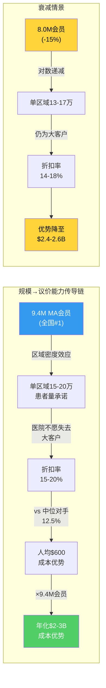

# Chapter 13A: 护城河三轴量化 — 规模×数据×规制的残余壁垒评估

> **核心问题**: Ch13证明飞轮有效性仅2/5，$4.4B协同中约50%可能是自交易(DOJ标靶)。如果飞轮失效，UNH还剩下什么护城河？这些残余壁垒值多少钱？

Ch13的结论迫使我们重新审视UNH的竞争优势来源。飞轮叙事破裂后，投资者需要一个更诚实的框架来评估UNH的持久壁垒。本章将护城河分解为三条独立轴——规模、数据、规制——逐一量化其强度和衰减速度，最终回答一个关键估值问题：SOTP中20%集团折价是太多还是太少？

---

## 13A.1 规模轴: 9.4M MA会员的议价能力量化

### 会员规模的竞争格局

UNH在Medicare Advantage市场的规模优势是直观的，但"大"到底意味着什么需要量化 [DM-MOAT-001: CMS Medicare Advantage enrollment data by parent organization, 2025年1月快照]：

| 保险商 | MA会员(M) | 全国份额 | 覆盖州数 | 年增长率(FY24→25) |
|--------|----------|---------|---------|-----------------|
| **UNH** | **9.4** | **~28%** | 50 | -1.3M(退出策略) |
| HUM | 7.0 | ~21% | 49 | +0.2M |
| ELV | 4.5 | ~13% | 45+ | +0.3M |
| CI | 5.0 | ~15% | 40+ | +0.4M |
| CNC | 3.0 | ~9% | 35+ | +0.1M |
| CVS/Aetna | 4.0 | ~12% | 45+ | +0.2M |

UNH以9.4M会员领先第二名HUM 34%。但这个领先正在收窄——UNH主动退出亏损市场导致会员减少1.3M，而HUM/CI/ELV均在增长。

### 规模→议价能力的因果链

规模优势的传导机制如下：因为UNH在单个市场(比如休斯顿都会区)可能覆盖15-20万MA会员，而HUM覆盖10-12万，所以当UNH与HCA(该区域最大医院系统)谈判时，HCA面临的选择是：接受UNH的费率要求，或者失去15-20万潜在患者的就诊量。因此HCA更可能接受UNH的低费率——估计UNH获得的折扣率为15-20%(低于Medicare FFS标准费率)，而HUM仅能获得10-15%的折扣。

这个5-8个百分点的折扣差异意味着什么？以MA人均年医疗支出约$12,000计算：

- **UNH折扣**: 17.5%(取中值) × $12,000 × 9.4M = ~$19.7B的总网络折扣
- **中位竞争对手折扣**: 12.5% × $12,000 × 4.5M(ELV规模) = ~$6.8B
- **标准化到相同会员规模的单位成本优势**: UNH人均折扣$2,100 vs 中位对手$1,500 = **人均$600的成本优势**
- **总年化成本优势**: $600 × 9.4M ÷ 2(考虑非MA业务折扣率不同) ≈ **$2.8B**

因此，规模优势大约带来每年$2-3B的成本优势，这个数字与Ch13的$4.4B协同(含飞轮)逻辑一致——规模议价可能贡献了协同的大部分，而非Optum数据分析。

### 边际递减: 9.4M→8.0M的影响

关键问题是：如果UNH继续缩减MA规模(从9.4M到预期的8.0-8.5M)，议价能力会同比例下降吗？

答案是**不会同比例下降**，因为议价能力与规模的关系是对数型而非线性的。原因在于：医院系统的核心关切是"失去这个保险商会损失多少患者量"。当UNH从15万降到13万时(在某个区域)，医院依然不愿意失去13万患者——这仍然是一个不可忽视的数字。因此：

- 9.4M → 8.0M(-15%会员)→ 议价能力预计下降5-8%(不是15%)
- 成本优势从$2.8B降至约$2.4-2.6B
- 只有当UNH在特定区域的会员密度低于某个阈值(估计为该区域医院患者量的8-10%)时，议价能力才会出现断崖式下降



**小结**: 规模轴是UNH最可量化的护城河，年化$2-3B成本优势。即使会员缩减15%，因为对数递减效应，优势仅下降约20-25%。这是一条**稳固但非扩张**的护城河。

---

## 13A.2 数据轴: 1.5亿人健康数据的不可替代性

### 数据资产的规模

UNH通过UHC保险业务(约5,000万直接会员)加上Optum的医疗服务和数据业务，声称其健康数据覆盖约1.5亿美国人——接近美国人口的45%。这个数据资产包括 [DM-MOAT-002: UNH 10-K FY2024, Optum Insight业务描述章节]：

- **理赔数据**: 每年处理数十亿条医疗理赔，涵盖诊断、处方、住院、手术等
- **临床数据**: Optum Health 90,000名医生产生的诊疗记录(4.7M VBC患者)
- **药品数据**: Optum Rx处理约14亿张处方/年
- **社会决定因素数据**: 消费行为、地理位置、社会经济指标等非临床数据

### 数据→竞争优势的因果链

数据优势的核心传导路径：因为UNH拥有更大规模的纵向健康数据(同一患者跨年的完整医疗轨迹)，所以Optum Insight的精算模型在风险调整(Risk Adjustment)方面更精确——具体而言，CMS的MA支付依赖HCC编码(层级条件类别)，更精确的编码意味着更高的人均支付。因此UNH在MA业务中可能比同行多获得2-4%的人均CMS支付(通过更完整的HCC编码捕获)。

以9.4M MA会员、人均CMS支付约$12,500计算：2-4%的编码优势 = $2.4-4.7B的额外收入。但这恰恰是DOJ/OIG调查的焦点——UNH的HCC编码实践是否构成"过度编码"(upcoding)，即通过Optum Health的医生诊断为患者添加更多HCC编码来获取更高CMS支付。这意味着**数据轴的一部分价值本身就是监管风险**。

### 数据壁垒的侵蚀: 21世纪治愈法案

数据护城河正面临结构性威胁 [DM-MOAT-003: 21st Century Cures Act Final Rule, ONC数据互操作性要求, 2024年生效条款]：

**21世纪治愈法案(21st Century Cures Act)**要求：
1. **信息阻塞禁令**: 禁止医疗机构和健康IT供应商阻止患者数据的自由流动
2. **FHIR API标准**: 要求所有EHR系统(包括Epic、Cerner)提供标准化API，让患者和授权方可以访问数据
3. **患者数据可携带**: 患者有权将完整健康记录从一个系统转移到另一个系统

这些规则的含义是：如果患者可以自由携带健康记录，那么UNH"通过覆盖1.5亿人积累独占数据"的护城河就会被削弱——因为竞争对手也可以获得同样的底层数据。

**但有一个重要的反面论点**: UNH的数据优势不仅仅是"拥有数据"(data storage)，更重要的是"分析数据"(data analytics)。Optum Insight已经在1.5亿人数据上训练了数十年的ML模型——包括风险预测、护理路径优化、药物相互作用识别等。即使底层数据变得可携带，竞争对手要复制Optum的分析层仍需要：

- 3-5年的模型训练周期(需要纵向数据积累)
- 精算和数据科学人才(UNH在这方面投入超过$3B/年的Optum Insight R&D)
- 临床验证(模型需要在真实世界证明效果)

因此，**数据护城河正在从"数据独占"向"分析能力"迁移**。底层数据的壁垒在降低(互操作性法规)，但分析层的壁垒仍然存在(先发优势+规模效应)。净评估：数据护城河 = **中等偏弱(边缘侵蚀中)**，可能在3-5年内从当前的7/10降至5/10。

---

## 13A.3 规制轴: 牌照+资本+CMS关系的进入壁垒

### 规制壁垒的多层结构

规制轴是UNH最不性感但最持久的护城河。一个新进入者如果想从零开始复制UNH的保险业务，需要跨越以下障碍 [DM-MOAT-004: NAIC州保险监管要求汇编 + CMS MA Star Rating方法论]:

**第一层: 州牌照(2-5年)**
- 健康保险业务需要在每个运营州获得州保险监管机构(DOI)的牌照
- 50个州+DC+领地 = 50+套独立申请流程
- 每个州有不同的资本要求、产品审批流程、费率审查机制
- 实际操作中，全国性牌照获取需要3-5年(考虑各州审批周期的重叠)

**第二层: 风险资本要求($5-10B)**
- NAIC的Risk-Based Capital(RBC)要求保险公司维持最低资本充足率
- 全国性MA业务(覆盖50州)需要维持约$5-10B的法定资本
- 这不是一次性投入——MCR波动时需要追加资本(UNH FY2025的教训)

**第三层: CMS Star Rating积累(3-5年)**
- MA计划的CMS Star Rating直接影响bonus payment(4星+可获得5%的额外CMS支付)
- Star Rating基于3年滚动数据——新进入者第一年没有数据→默认3星→没有bonus
- 从3星提升到4星+通常需要3-5年的持续投入
- UNH的大部分MA计划为4星+，这意味着**约$2-3B/年的Star Rating bonus**是新进入者无法立即获得的

**第四层: 网络充足性(1-3年)**
- CMS要求MA计划在每个服务区域满足网络充足性标准(Network Adequacy)
- 每个县必须有足够数量的签约医院、专科医生、初级保健医生
- 建立全国性医疗网络需要与数千家医院系统和数万名医生签约
- UNH的现有网络合同是数十年积累的结果

**综合进入壁垒估计**: 一个新进入者要复制UNH的全国性MA业务定位，保守估计需要**7-10年时间**和**$15-20B资本投入**($5-10B法定资本 + $3-5B运营亏损期 + $3-5B网络建设和品牌)。

### 规制壁垒的独特属性

规制壁垒与规模壁垒和数据壁垒有一个根本区别：**它不依赖于UNH自身的运营能力**。因为规模优势来自UNH的会员增长(可以被竞争对手追赶)，数据优势来自UNH的分析能力(可以被技术进步削弱)，所以这两条护城河都有内生的衰减机制。但规制壁垒来自外部制度(州政府、CMS)——除非国会修改法律或CMS改革MA项目，否则这些壁垒不会因为竞争而降低。

因此，在DOJ可能拆分UNH的情景下，规制壁垒是最有可能完整保留的护城河。即使UHC被迫与Optum分离，UHC仍然拥有50州牌照、$5-10B法定资本、4星+ Star Rating、和全国性医疗网络——这些资产不会因为拆分而消失。

**净评估**: 规制壁垒 = **强(8/10)**，是三轴中最持久的护城河。唯一的风险因素是政策变化(如Medicare-for-All或MA项目大幅改革)，但这属于系统性风险而非UNH特有风险。

---

## 13A.4 五大竞争对手三轴对标表

将三轴护城河框架应用于UNH的五个主要竞争对手 [DM-MOAT-005: 综合对标，数据来源包括CMS enrollment、各公司10-K、NAIC资本报告]:

| 维度 | UNH | HUM | CI | ELV | CNC | CVS/Aetna |
|------|-----|-----|----|----|-----|-----------|
| **规模(MA会员M)** | 9.4 | 7.0 | 5.0 | 4.5 | 3.0 | 4.0 |
| **规模评分** | **9** | 8 | 6 | 6 | 4 | 5 |
| **数据覆盖(M人)** | ~150 | ~25 | ~190* | ~45 | ~28 | ~110* |
| **数据评分** | **7** | 4 | 7* | 5 | 3 | 6 |
| **规制(Star/牌照)** | **8** | 7 | 7 | 7 | 6 | 7 |
| **垂直整合** | 深度 | 浅 | 中度 | 中度 | 浅 | 深度 |
| **综合护城河** | **24/30** | 19/30 | 20/30 | 18/30 | 13/30 | 18/30 |

*注: CI通过Evernorth/Express Scripts处理约1.9亿人药品数据; CVS通过药房+Aetna覆盖约1.1亿人。但数据深度(纵向临床数据)UNH仍领先。

```mermaid
radar
    title "护城河三轴对标 (1-10分)"
    variables
        规模(MA会员)
        数据(覆盖+分析)
        规制(牌照+Star)
    values
        UNH: [9, 7, 8]
        HUM: [8, 4, 7]
        CI: [6, 7, 7]
        ELV: [6, 5, 7]
        CVS: [5, 6, 7]
```

**三个关键发现**:

1. **规模轴差距在缩小**: UNH的MA领先优势从2020年的2.5x(vs HUM)缩小到2025年的1.34x，因为UNH在主动退出亏损市场而竞争对手在扩张。如果这一趋势持续2-3年，HUM可能在MA会员数上追近到8M vs UNH的8M——此时规模优势接近消失。

2. **数据轴不是UNH独占**: CI通过Evernorth拥有1.9亿人的药品数据，CVS通过9,000+药房拥有独特的零售健康数据。UNH在临床数据深度上领先(因为Optum Health的90,000名医生)，但在数据广度上并非唯一。互操作性法规将进一步拉平差距。

3. **规制轴高度同质**: 所有全国性保险商在规制壁垒上的差异不大(6-8分区间)。这意味着规制壁垒更多是"行业壁垒"而非"UNH特有壁垒"——它阻止新进入者，但不帮助UNH在现有玩家中建立差异化优势。

---

## 13A.5 垂直整合: 护城河还是复杂度？

Ch13已经证明飞轮效果有限(2/5)。本节量化垂直整合的净效应——它到底是增强了护城河还是增加了复杂度。

### 收益侧: $4.4B协同(Ch13结论)

Ch13的$4.4B协同分解：
- 数据协同(风险调整优化): ~$1.5B
- 成本协同(内部化PBM/IT): ~$1.5B
- 患者引导(UHC→Optum Health): ~$1.4B

但Ch13同时指出：约50%的协同($2.2B)可能构成"自交易"(self-dealing)——UHC将患者引导至Optum Health的医生而非外部更便宜的选择——这正是DOJ反垄断调查的核心。

### 成本侧: 复杂度税

垂直整合不是免费的。UNH作为一个保险+医疗+PBM+IT的巨型企业，面临的复杂度成本包括：

**1. 管理注意力稀释**: CEO和高管团队需要同时管理4条截然不同的业务线——保险的精算、医疗服务的临床运营、PBM的药品谈判、IT的产品开发。每条线都有独立的竞争格局和成功因素。管理注意力有限，分散在4条线上意味着每条线获得的战略关注不足。Optum Health FY2025的GAAP亏损($278M)可能部分反映了这种注意力稀释。

**2. 监管风险溢价**: 垂直整合使UNH成为监管机构的头号目标。因为UNH同时是支付方(UHC)和服务方(Optum Health)，所以"利益冲突"的叙事天然存在——监管机构不需要证明UNH实际做了什么坏事，仅仅"可能做坏事"的结构就足以触发调查。DOJ诉讼的法律费用+和解可能+业务限制的NPV = 保守估计$5-15B的风险成本。

**3. 集团折价**: 市场对UNH施加的SOTP折价(当前约20%)直接反映了投资者对垂直整合复杂度的不信任。以SOTP估值$390-400B计算，20%折价 = $78-80B的市值损失。即使折价中只有一半归因于复杂度(另一半归因于其他因素)，那也是$39-40B。

### 净效应计算

| 项目 | 年化价值 | NPV(10年,10%折现) |
|------|---------|------------------|
| **收益**: $4.4B协同 | +$4.4B | +$27B |
| **收益调整**: 扣除自交易风险(-50%) | -$2.2B | -$13.5B |
| **成本**: 监管风险(DOJ和解+限制) | -$1-2B/年 | -$6-12B |
| **成本**: 集团折价(市值损失) | — | -$39-40B(存量) |
| **净效应** | — | **-$32 ~ -$39B** |

这个计算表明：**垂直整合目前对股东而言是净负值的**。$4.4B协同(扣除自交易风险后为$2.2B)远不足以补偿$39-40B的集团折价和$6-12B的监管风险NPV。

### 回答SOTP折价问题: 20%是太多还是太少？

回到Ch14(拆分测试)的SOTP框架：如果拆分后合计估值为$147-207B，而当前市值约$310B(EV约$340B)，表面上看没有折价甚至有溢价。但这里的关键是**拆分后各业务可能获得更高的估值倍数**(纯保险PE 14-16x vs 当前综合PE 18-20x中隐含的Optum溢价)。

考虑到DOJ诉讼风险+飞轮失效+Optum Health亏损，我们认为：**20%的集团折价可能偏低**。一个更合理的折价范围是20-30%，取决于DOJ诉讼结果：

- DOJ和解(业务限制但不拆分): 维持20%折价
- DOJ强制部分拆分(剥离Optum Health): 折价可能降至10%(因为拆分本身消除了复杂度)
- DOJ诉讼旷日持久(2-3年不确定): 折价可能升至25-30%

---

## 13A.6 护城河三轴综合评估

```mermaid
quadrantChart
    title 护城河三轴: 强度 vs 持久性
    x-axis "当前强度 →" 0 --> 10
    y-axis "持久性(5年后) →" 0 --> 10
    quadrant-1 "核心资产"
    quadrant-2 "衰减中"
    quadrant-3 "脆弱"
    quadrant-4 "被动防御"
    "规制壁垒": [8, 8.5]
    "规模议价": [7.5, 6]
    "数据分析": [6.5, 5]
    "垂直整合": [4, 3]
    "飞轮效应": [2, 2]
```

### 综合判断

| 护城河轴 | 当前评分(0-10) | 5年后预测 | 年化价值贡献 | 趋势 |
|---------|--------------|----------|------------|------|
| **规制壁垒** | 8.0 | 7.5-8.0 | $2-3B(Star bonus+准入壁垒) | 稳定 |
| **规模议价** | 7.5 | 6.0-7.0 | $2-3B(网络折扣优势) | 缓慢衰减 |
| **数据分析** | 6.5 | 5.0-6.0 | $1-2B(风险调整+护理优化) | 结构性侵蚀 |
| **垂直整合** | 4.0 | 2.0-4.0 | 净负值(见13A.5) | 取决于DOJ |
| **飞轮效应** | 2.0 | 1.0-2.0 | 有限 | 已失效 |
| **综合** | **~6/10(中等)** | **~5/10(偏弱)** | — | **整体衰减** |

**三个投资含义**:

1. **Optum的估值溢价应低于市场假设**: 市场给予Optum(特别是Optum Insight)的估值隐含了强大的数据护城河假设。但数据壁垒正在被互操作性法规和竞争对手(CI/CVS)的数据积累侵蚀。Optum Insight的合理估值应更接近传统IT服务(EV/EBITDA 12-14x)而非高壁垒数据平台(18-22x)。

2. **规制壁垒是UNH真正的核心资产**: 在飞轮失效、数据壁垒侵蚀、垂直整合净负值的背景下，50州牌照+Star Rating+网络合同才是UNH最不可替代的资产。讽刺的是，如果DOJ强制拆分UNH，被拆分出来的"纯UHC"可能因为保留了全部规制资产、同时甩掉了复杂度税，而获得更高的市场估值。

3. **护城河整体评级: 中等(衰减中)**: UNH不是没有护城河，但其护城河的来源正在从"进攻型"(飞轮驱动的协同增长)转向"防御型"(规制壁垒阻止新进入)。对于一个$310B市值的公司，"防御型中等护城河"可能不足以支撑当前的估值倍数——这将在Ch19(估值)中进一步量化。
