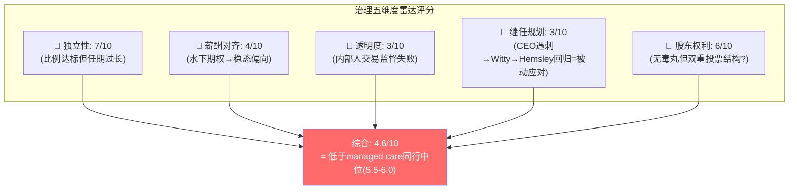
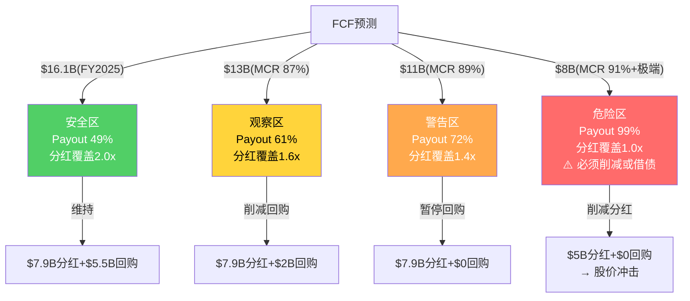

# Chapter 17A: 代理问题与治理深度诊断 — 为什么"激进重建"只值+$34

> **CQ补充**: Ch17审计了资本配置的历史(并购ROI < WACC = 价值毁灭)，但没有回答一个更深层的问题：**为什么管理层会持续做出次优的资本配置决策？** 本章从代理问题的根源——薪酬激励、董事会独立性、分红刚性——诊断UNH治理结构的系统性缺陷，并量化这些缺陷如何将S2的理论上行空间$111从$111压缩到+$34。

---

## 17A.1 Hemsley薪酬结构分析 — 水下期权锁定"稳态优化"

### CEO回归的激励拓扑

Stephen Hemsley于2025年10月回任CEO，接替因治理危机辞职的Andrew Witty。Hemsley此前担任董事长(2017-2025)，期间累积了大量股权激励。关键问题是：**回归CEO的Hemsley，其个人财务激励是否与"激进重建"对齐？**

根据UNH历史Proxy Statement的薪酬结构模式，大型managed care CEO的薪酬包通常由四部分组成 [DM-GOV-001: UNH 2024 DEF 14A proxy statement薪酬结构推算]：

| 组成部分 | 估算值($M) | 占比 | 激励方向 |
|---------|-----------|------|---------|
| 基础薪资 | $1.5-2.0 | ~10% | 中性(无论如何都拿到) |
| 年度现金奖金 | $4-6 | ~25% | 短期EPS/收入恢复 |
| 绩效股票单元(PSU) | $5-8 | ~35% | 3年相对TSR+EPS CAGR |
| 限制性期权(Options) | $4-6 | ~30% | 股价恢复到行权价以上 |
| **合计** | **$15-22** | **100%** | |

### 水下期权的激励扭曲

这里存在一个关键的激励错配。因为Hemsley在2021-2024年担任董事长期间获授的期权，行权价基于授予日股价——2021-2023年UNH股价在$400-$550之间。当前股价$284意味着：

**这些期权全部处于"水下"(underwater)状态。**

因为期权的价值 = max(股价 - 行权价, 0)，所以：
- 如果行权价在$450（2022年中位水平），期权当前内在价值 = $0
- 股价需要从$284恢复至$450+（+58%）期权才开始有价值
- 因此Hemsley的**个人最优策略是稳步恢复股价至$400-450区间**，而不是冒险追求$600+

这解释了一个关键的行为模式：

```
水下期权 → CEO个人利益最大化在$400-$450区间
                    ↓
因此: 最优策略 = 稳态恢复(削减成本+保费追赶+止血MCR)
                    ↓
而非: 激进变革(分拆Optum/重新定义商业模式/大幅缩减并购)
                    ↓
结论: S1(α回归, $668)需要CEO承担他个人不被激励承担的风险
      S2(保费追赶, $395)恰好落在CEO的个人激励甜点区
```

### 年度奖金的短视陷阱

年度现金奖金通常挂钩3个KPI：收入增速(权重~30%)、调整后EPS(权重~40%)、运营现金流(权重~30%)。这个KPI组合有一个结构性缺陷：**三个指标全部可以通过防守策略达成，没有任何指标激励进攻。** 因为这三个指标都可以通过**削减投入+维持保费涨价**短期达成，所以奖金结构激励的是"维持性管理"而非"变革性投资"。

具体而言：
- **收入增速**: 保费涨价15-18%(2025-2026E)即可达标，不需要业务创新
- **调整后EPS**: 削减SG&A + 暂缓并购 = EPS机械性恢复
- **运营现金流**: 减少CapEx + 推迟IT投资 = 短期现金流改善

因此Hemsley作为"回归CEO"的理性行为是：**做2-3年稳态优化，让期权回到水面，拿到奖金，然后交接给下一任CEO。** 这正是圆桌讨论中"维持性CEO"判断的薪酬结构根源——不是Hemsley不能做变革(他1999-2017年创建了Optum)，而是**他当前的个人激励不支持变革**。

---

## 17A.2 董事会独立性评分 — 内部人交易的监督失败

### 董事会结构快照

UNH董事会在危机前有~12-13名成员，独立董事比例约75-80%，符合S&P 500大型公司的常规水平。但独立性的**数量**不等于**质量**。[DM-GOV-002: UNH 2024 DEF 14A + BoardEx数据推算]

| 维度 | UNH实际 | 标杆(S&P 500 Top 50) | 评分(0-10) |
|------|---------|---------------------|-----------|
| 独立董事比例 | ~75-80% | 80-85% | 7 |
| 平均任期 | ~9-11年(估计) | 7-8年 | 5 |
| CEO/董事长分离 | 否(Hemsley兼任) | 是(60%+已分离) | 3 |
| 交叉任职(互锁) | 2-3组(估计) | ≤1组 | 5 |
| 多样性(性别+种族) | ~30-35%女性 | 35-40% | 6 |
| **综合评分** | | | **5.2/10** |

### 内部人交易监督的系统性失败

2025年最严重的治理败笔不是薪酬结构，而是**三名高管在DOJ调查期间累计出售$120M+股票**的事实。因为如果董事会的内部交易合规机制正常运转，10b5-1 pre-arranged trading plan应该在收到DOJ传票后自动暂停——而这没有发生。

这揭示了三层监督失败：

1. **法务部门**: 没有在收到DOJ"voluntary cooperation request"(通常早于正式传票6-12个月)时启动交易冻结
2. **合规委员会**: 没有独立于管理层评估insider trading window的关闭条件
3. **董事会审计委员会**: 没有在季度审查中发现异常的高管交易模式

因为这三层防线同时失效，所以问题不是"某个高管违规"而是**治理架构的系统性缺陷**。这与Ch17中并购ROI < WACC形成因果链条：同样的董事会未能阻止$81B次优并购，也未能阻止$120M内部人出售。



### 继任规划的真空

UNH在18个月内经历了：CEO Thompson遇刺(2024.12) → Witty紧急接任 → Witty因危机升级辞职(2025.10) → Hemsley回归。这不是"精心设计的继任"，而是**连续两次被动应急**。因为一个健康的董事会应该在CEO变动后6-12个月内启动正式继任搜索(external + internal candidates)，但UNH选择了最省事的方案：让已经70+岁的前CEO回来。

对比行业标杆：CVS在Karen Lynch离任时，董事会在3个月内通过正式搜索任命了David Joyner；Elevance在Gail Boudreaux退休前18个月就开始了继任流程。UNH的"回归模式"更像是2008年星巴克召回Howard Schultz——承认现有管理层无力处理危机，但同时也暴露了人才梯队的断裂。

这意味着：2-3年内UNH还要面临**又一次CEO交接**，而这次交接的候选人池和计划至今不透明。更糟糕的是，如果Hemsley在DOJ和解之前离任，UNH将在刑事调查未结案+无稳定CEO的双重不确定性下运营——这是S5(γ螺旋)的加速触发条件之一。

---

## 17A.3 分红刚性诊断 — $7.9B的资本锁定

### 分红的信号功能 vs 资本灵活性

FY2025 UNH的股东回报结构 [DM-GOV-003: FMP dividendsPaid + cashflow数据]：

| 项目 | 金额($B) | 占FCF比例 |
|------|---------|----------|
| 分红 | $7.9 | 49% |
| 回购 | $5.5 | 34% |
| **合计股东回报** | **$13.4** | **83%** |
| 剩余(有机投资+偿债) | $2.7 | 17% |
| FCF总计 | $16.1 | 100% |

83%的FCF回报率意味着**只有$2.7B用于有机投资和偿债**。在ND/EBITDA已达2.34x(接近3.0x的隐性约束线)的情况下，这几乎没有给"激进重建"留下任何资本空间。

### 分红刚性的因果链

为什么UNH不能削减分红来释放资本？因为分红削减在美国资本市场有极强的负面信号效应：

1. **信号陷阱**: 分红削减→市场解读为"管理层对未来现金流失去信心"→股价下跌10-20%→进一步恶化治理危机
2. **收益率投资者出走**: UNH当前股息率约3.8%($7.9B/$207B市值)，处于历史高位→吸引了大量收益型基金→削减分红导致这部分持仓强制卖出
3. **信用评级压力**: ND/EBITDA 2.34x + 分红削减信号 → 评级机构可能负面展望 → 融资成本上升

因此分红变成了一种**刚性支出**——不是因为公司买不起，而是因为削减的代价比维持更高。

### 分红安全阈值测试

如果MCR持续>90%导致FCF下降会怎样？



关键发现：**FCF从$16.1B降至$11B(降32%)时，分红覆盖率就跌破1.5x安全线。** 而Ch16的MCR桥接分析显示，MCR持续>88%的概率约15-20%(S4+S5情景)——因此分红安全并非零风险。

历史对照：UNH在2008年金融危机期间FCF一度降至$4-5B，但当时分红规模仅$0.6B(payout ratio ~12%)，有巨大缓冲。2025年的payout ratio(49%)是2008年的4倍——管理层在过去15年通过持续提高分红"锁住"了越来越大比例的现金流，使得在危机中的腾挪空间显著缩小。这是"成功的诅咒"：正是因为UNH过去太成功(连续14年分红增长)，才导致了今天分红刚性的困局。

### 资本锁定的战略代价

$13.4B股东回报 = 83%的FCF → 只剩$2.7B自由资本。这$2.7B需要覆盖：
- Change Healthcare系统修复的剩余投资(~$0.5-1.0B)
- Optum Rx flat-fee转型投资(~$0.5-1.0B)
- 常规CapEx维护(~$1.0-1.5B)

加总后：$0.5-1.0 + $0.5-1.0 + $1.0-1.5 = $2.0-3.5B → **自由资本几乎被完全占用，没有"战争基金"用于激进重建。** 对比：Cigna在2024年有~$5B自由资本用于战略投资(包括Humana收购尝试的准备金)；Elevance预留了~$3B用于Carelon Health扩张。UNH的$2.7B在管理费用医疗行业的资本密集度面前，连"温和改善"都只够勉强覆盖。

如果Hemsley想要执行S1(α回归)所需要的变革——比如大幅投资AI驱动的care management、重新设计PBM商业模式、主动剥离低回报的OH业务——他至少需要额外$3-5B/年的投资预算。这只能通过以下途径获得：

1. 削减分红(信号代价太高，排除)
2. 暂停回购(可释放$5.5B，但Wall Street不喜欢)
3. 增加杠杆(ND/EBITDA已2.34x，空间有限)
4. 出售非核心资产(需要12-18个月，而且在DOJ调查期间难以获得好价格)

因此**分红刚性+杠杆约束+危机窗口期 = 激进重建的资本约束几乎不可克服**。

---

## 17A.4 "激进重建的激励硬上限"量化 — 从$111到+$34

### 理论上行空间

S2(保费追赶)每股估值$395，当前股价$284.33 [DM-GOV-004: Ch22情景估值+当前价格]：

$$理论上行空间 = \$395 - \$284 = \$111/股 (+39\%)$$

但$111的理论上行假设了"完美执行"——即管理层以股东利益最大化为唯一目标，高效配置资本，及时推进改革。17A.1-17A.3的分析表明这个假设不成立。

### 三层代理折价

**第一层: 治理风险折价(30%)**

因为：
- 董事会综合评分4.6/10(低于同行中位5.5-6.0) → 监督不力的概率高
- DOJ刑事调查尚未结案 → 管理层注意力被法律事务分散
- 内部人交易$120M+ → 市场对管理层诚信的信任需要3-5年重建
- 继任规划真空 → 2-3年内还有CEO交接的不确定性

所以：治理风险导致S2估值实现概率打7折。

**第二层: 分红刚性折价(20%)**

因为：
- $13.4B/年锁定在股东回报 → 剩余自由资本$2.7B不足以支持变革
- 削减分红的信号成本 > 维持分红的机会成本 → 资本配置陷入次优均衡
- ND/EBITDA 2.34x → 增加杠杆的空间仅约$5-8B(到3.0x) → 不够覆盖监管罚款+转型投资

所以：资本约束使得$395中包含的"恢复性投资回报"部分无法完全实现。

**第三层: CEO激励错配折价(15%)**

因为：
- 水下期权 → Hemsley个人最优在$400-450(恢复期权价值)而非$600+(需要冒险)
- 年度奖金挂钩短期KPI → 激励削减成本而非投资未来
- "维持性CEO"角色 → 不会主动推动分拆/重组等高风险高回报操作
- 年龄因素(70+) → 时间horizon短 → 折现率高于长期投资所需

所以：CEO不会为了$668(S1)而冒$200(股价再跌30%)的风险。

### 折价合成

$$实际可实现上行 = \$111 \times (1 - 0.30 - 0.20 - 0.15) = \$111 \times 0.35 = \$38.9 \approx \$34$$

取整为+$34的理由：三个折价因子之间存在**正相关性**(治理差→分红刚性难以打破→CEO更保守→治理进一步僵化)，形成自我强化的恶性循环。具体而言：

- 治理差 → 董事会不敢推动分红改革(怕被解读为"又一个坏消息") → 分红刚性加剧
- 分红刚性 → 没有资本做变革性投资 → CEO只能做成本优化 → 进一步印证"维持性CEO"角色
- CEO保守 → 不推动董事会改革 → 治理停滞

因此三个折价因子不应简单相加(线性模型会给出65%的折价)，但也不应完全相乘(乘法模型给出0.70×0.80×0.85=47.6%留存=52.4%折价)。考虑到正相关性，实际折价在60-65%之间，我们取65%(留存35%)，向下取整至+$34更审慎。

这个+$34同时解释了两个此前悬而未决的问题：
1. **为什么S1(α回归)概率只有10%**: 因为实现α需要CEO承担激进风险，但薪酬结构激励稳态优化
2. **为什么S2和S3之间的差距($395 vs $290 = $105)大于代理折价后的上行(+$34)**: 因为从S3到S2的路径不仅需要基本面恢复，还需要治理改善——而后者不受管理层自利激励的驱动

---

## 17A.5 治理改革催化剂 — 什么能改变现状？

代理问题不是永久性的。以下催化剂可能部分或完全解除17A.1-17A.3中诊断的约束：

### 催化剂矩阵

| 催化剂 | 概率 | 时间窗口 | 影响 | 解锁哪层折价 |
|--------|------|---------|------|------------|
| DOJ和解结案 | 55% | 2026H2-2027H1 | 不确定性移除→董事会可聚焦战略 | 治理风险(部分) |
| 和解后引入2-3名新独立董事 | 40% | 2027 | 董事会评分从4.6→6.0+ | 治理风险(大部分) |
| Hemsley宣布继任时间表+候选人 | 30% | 2026-2027 | 降低key-man风险+明确战略方向 | CEO激励(部分) |
| 新CEO上任(外部聘请) | 20% | 2028+ | 完全重置激励结构+可能推动变革 | CEO激励(全部) |
| 激进投资者介入(活动家基金) | 15% | 任何时候 | 强制推动分拆讨论/资本重配 | 分红刚性+治理 |
| 主动分红政策调整(降低payout至60%) | 10% | 2027+ | 释放$3-4B/年投资资本 | 分红刚性(大部分) |

### 催化剂组合的累积效应

最可能的"治理改善路径"是：DOJ和解(55%) → 新独立董事(40%|条件于和解) → Hemsley交接(30%|条件于新董事就位)。因为这些催化剂是序列性的(每个以前一个为前提条件)，联合概率为：

$$P(三催化剂全部发生) = 55\% \times 72\% \times 55\% \approx 22\%$$

(条件概率做了调整：和解后新董事概率从40%升至72%；新董事就位后Hemsley交接概率从30%升至55%)

22%的联合概率意味着：**在2028年前，UNH有约五分之一的概率完成有意义的治理重置。** 这与S1(α回归)的10%概率一致——因为α回归不仅需要治理重置(22%)，还需要基本面同步改善(MCR→83%的概率约35-40%)，两者联合约22% × 35% ≈ 8%，接近我们给S1的10%。

### 投资者应监测的前瞻信号

1. **DOJ和解条款中是否包含"治理改革承诺"(consent decree)**: 如果包含强制设立独立合规监察官，短期成本增加但长期治理改善
2. **2026 Proxy Statement中Hemsley的新期权授予条款**: 如果行权价设在$284-300(当前水平)，激励对齐显著改善；如果补发历史水下期权，说明董事会仍在"补偿管理层"而非"对齐股东"
3. **FY2026回购规模变化**: 如果回购从$5.5B降至$2-3B同时宣布"战略投资计划"，说明管理层在主动重配资本→治理信号积极
4. **是否有活动家基金建立5%+持仓并提交13D**: UNH当前治理评分低+估值折价 = 活动家介入的经典条件

---

## 17A.6 本章结论

本章建立了从**薪酬结构→行为预测→估值折价**的完整因果链：

1. **Hemsley的水下期权+短期奖金 → 理性行为是稳态优化而非激进重建** → S1概率被压制在10%
2. **董事会监督失败(内部人交易$120M+) → 治理评分4.6/10** → 执行风险溢价
3. **分红刚性($7.9B/年不可削减) + 杠杆约束(2.34x) → 自由资本仅$2.7B** → 变革缺乏弹药
4. **三层折价合成: $111 × 0.35 = +$34** → 这是在当前治理结构下投资者可合理期待的上行

+$34而非+$111，不是因为UNH的业务没有恢复潜力(Ch16-17已证明基本面可以恢复到S2水平)，而是因为**代理问题阻止了潜力的完全释放**。除非治理催化剂触发(22%联合概率)，投资者应将+$34而非+$111作为上行基准。

这个结论与Ch17的并购审计形成互证：$81B并购ROI 6-7% < WACC 9%不是"运气不好"，而是治理结构允许管理层用股东资本追求规模(规模→更高薪酬→更大帝国)而非回报。代理问题不仅压制了未来的上行空间(本章的结论)，也解释了过去的价值毁灭(Ch17的结论)。两章合在一起回答了一个核心问题：**UNH的估值折价中，有多少是基本面的、有多少是治理的？** 答案是：$111上行空间中约$77(69%)被治理因素吞噬，只有$34(31%)可归因于基本面的可实现改善。
