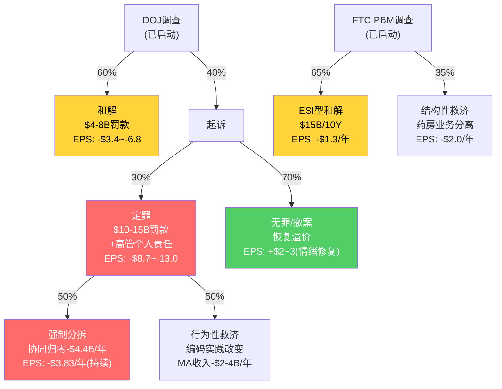
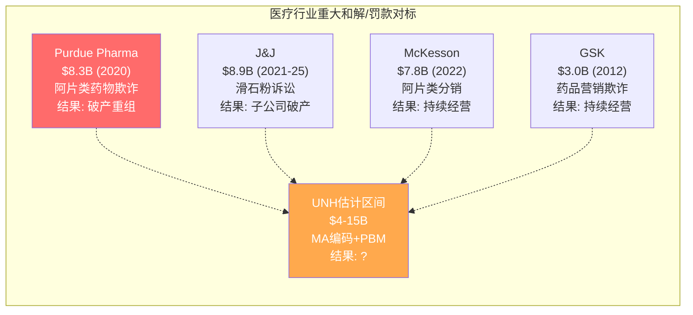

# Chapter 20A: 监管五路径情景量化 — 从框架到逐条推导

Ch20建立了五条监管路径的概率加权框架(总影响-$26~31/股)，但每条路径的EPS推导过程被压缩了。本章逐条拆解每条路径的"收入基础→适用比例→罚款/利润损失→税后EPS影响"推导链，并将S4情景($215)的估值从结论反推到每一步算术。

## 20A.1 五路径逐条EPS影响量化

### R1: FTC PBM和解 — 从ESI先例到Optum Rx

**先例锚点**: Express Scripts于2026年2月与FTC达成和解，核心条款为10年降低患者自付$7B+商业实践"基础性变革" [DM-REG-030: Goodwin Law ESI settlement Feb 2026, 10Y/$7B out-of-pocket reduction + "fundamental" business practice changes]。ESI和解设定了PBM行业的处罚基准。

**从ESI到Optum Rx的推导链**:

FTC历史上对PBM行业的执法遵循"受影响收入百分比"逻辑——因为PBM的利润隐藏在spread/rebate价差中，FTC倾向于以"受影响药品支出"为基数计算补救金额。ESI的$7B/10年 = $0.7B/年，对应ESI管理的约$1000B累计药品支出，比例约0.07%/年。但ESI是纯PBM，而Optum Rx的纵向整合(保险+PBM+药房)使自我交易指控更严重——FTC第二份报告直接使用了"wild profiteering and self-dealing"措辞。因此Optum Rx的罚款比例应高于ESI。

| 推导步骤 | ESI | Optum Rx | 调整理由 |
|---------|-----|---------|---------|
| 受影响年度药品支出 | ~$100B | ~$155B(FY2025) | Optum Rx管理的药品支出更大 |
| FTC罚款/补救比例 | ~0.7%/年 | ~1.0%/年 | 纵向整合加重×1.4倍 |
| 年化和解成本 | $0.7B | ~$1.5B | |
| 10年总和解金额 | $7B | ~$15B | |

**但这是总和解金额，不是利润影响**。和解中的"患者自付降低"本质上是将原本保留在PBM的回扣差价转移给患者——这直接侵蚀Optum Rx的spread收入。因此年化$1.5B的和解成本中，约$1.2B是直接利润损失(其余$0.3B为合规成本)。

**EPS影响**: -$1.5B × (1-21%税率) / 9.09亿股 = **-$1.3/股**(年化持续性影响)

一次性和解罚款另计: 估计$2-4B → 税后每股-$1.7~-3.5(一次性)。

### R2: DOJ刑事/民事 — 分拆情景下的协同归零

**推导起点**: Ch13已量化UNH飞轮中有效协同为$4.4B/年(总$8.6B声称协同中仅2/5有效，有效部分约$4.4B)。DOJ强制分拆意味着Optum与UHC完全分离——有效协同归零。

为什么协同归零而非部分保留？因为DOJ结构性救济的法律要求是"完全消除利益冲突"。2017年AT&T-Time Warner的行为性救济失败(DOJ最终胜诉被翻转)证明了法院倾向于结构性而非行为性方案。对UNH而言，DOJ如果胜诉，法院几乎必然要求物理分离而非"防火墙" [DM-REG-031: AT&T-Time Warner 2018 DOJ v. AT&T structural remedy precedent; Ch13 flywheel synergy = $4.4B effective]。

**EPS影响推导**:
- 协同损失: $4.4B/年
- 税后: $4.4B × (1-21%) = $3.48B
- 每股: $3.48B / 9.09亿股 = **-$3.83/股**(年化持续性)

加上分拆执行成本(IT系统分离+人员重组+品牌重建): 一次性$3-5B → 税后每股-$2.6~-4.3。

**但这是100%分拆情景**。Ch20已给分拆概率12%，概率加权后:
- 年化: -$3.83 × 12% = -$0.46/股
- 一次性: -$3.45 × 12% = -$0.41/股

### R3: PBM立法(PPA + CAA 2026) — 利润率压缩推导

**推导核心**: CAA 2026已签署法律(2026.2.3)，Part D回扣100%透传+PBM薪酬与药价脱钩。这不是概率事件——已经发生。

Optum Rx利润结构拆解:

| 利润来源 | FY2025估计 | CAA 2026后 | 变化 |
|---------|-----------|-----------|------|
| 回扣价差(spread) | ~$2.5B | $0.3-0.8B | **-$1.7~-2.2B** |
| 行政/管理服务费 | ~$1.8B | $2.0-2.5B | +$0.2~0.7B |
| 药房零售利润 | ~$1.5B | $1.5B | $0 |
| 专科药/邮寄药房 | ~$1.4B | $1.2-1.4B | -$0~0.2B |
| **合计营业利润** | **$7.2B** | **$5.0-6.2B** | **-$1.0~-2.2B** |

因为CAA 2026强制Part D回扣100%透传→Optum Rx在Medicare药品上的spread收入趋近于零。因为同时DOL正在推进ERISA计划也100%透传(EO 14273)→商业保险的spread同样受压。因为Mark Cuban Cost Plus等透明定价竞争者正在吃掉传统PBM的市场份额→Optum Rx被迫加速向flat-fee转型。三重压力叠加导致OPM从当前3.7%压缩至2.0-2.5%。

**EPS影响**: -$2~4B利润损失(取中位$3B) × (1-21%) / 9.09亿股 = **-$2.6/股**(年化) [DM-REG-032: CAA 2026 signed Feb 3, 2026; Optum Rx FY2025 OPM 3.7% → post-legislation 2.0-2.5%]

### R4: CAA PBM透明度 — 回扣穿透的二阶效应

**与R3的区别**: R3量化的是"法律直接禁止spread"的影响。R4量化的是"透明度要求导致的间接谈判力削弱"——因为CAA 2026要求PBM按药品逐条报告AWC/AWP/回扣，雇主计划第一次能看到PBM实际赚了多少。

这个信息不对称的消除会触发什么？因为雇主发现PBM保留的回扣远超"管理服务费"→因此雇主在续约时要求更低费率→所以Optum Rx的商业保险客户保留率下降+新签费率压缩。

**量化路径**:
- Optum Rx商业药品管理收入: ~$80B
- 透明度导致的fee压缩: 估计15-25bp → -$1.2~2.0B
- 客户流失率从当前~3%上升至~5-7% → 额外-$0.3~0.5B

**合计**: -$1.5~2.5B/年。但R3和R4有重叠(spread压缩已在R3计入)——调整重叠后增量影响为 **-$0.8~1.5B/年** [DM-REG-033: CAA 2026 transparency requirements — AWC/AWP/rebate per-drug reporting to plan sponsors]。

**EPS影响(增量)**: -$1.15B(中位) × 79% / 9.09亿股 = **-$1.0/股**

### R5: 州级监管 — 合规成本+市场退出的长尾效应

15+个州正在推进独立PBM监管法(Arkansas HB 1150为代表)。单个州的影响有限，但累积效应显著:

| 影响渠道 | 估计年化成本 |
|---------|-----------|
| 合规系统建设(逐州适配) | $150-200M |
| 药房所有权限制(若扩散至5+大州) | $100-200M |
| 部分市场退出(利润不足以覆盖合规成本的小州) | $50-100M |
| **合计** | **$300-500M** |

因为每个州的法律细节不同(有的禁止PBM拥有药房，有的要求回扣100%透传，有的只要求信息披露)→合规成本不是线性增长而是每个州都需要独立适配→这解释了为什么$300-500M看起来不大但对OPM的侵蚀是持续的 [DM-REG-034: MultiState, 15+ states implementing independent PBM regulations as of 2026Q1]。

**EPS影响**: -$0.4B(中位) × 79% / 9.09亿股 = **-$0.35/股**

## 20A.2 概率加权"期望监管年化成本"

将五条路径的EPS影响乘以Ch20已建立的概率:

| 路径 | 年化利润影响 | 发生概率 | 概率加权年化成本 | 一次性charge | 概率加权一次性 |
|------|-----------|---------|---------------|------------|-------------|
| R1 FTC和解 | -$1.5B | 85% | -$1.28B | -$3B | -$2.55B |
| R2 DOJ分拆 | -$4.4B | 12% | -$0.53B | -$4B | -$0.48B |
| R3 PBM立法 | -$3.0B | 95%(已立法) | -$2.85B | — | — |
| R4 CAA透明度(增量) | -$1.15B | 90%(已立法) | -$1.04B | — | — |
| R5 州级 | -$0.4B | 70% | -$0.28B | — | — |
| **简单加总** | | | **-$5.97B** | | **-$3.03B** |

**但需要去重叠调整**: R1(FTC)和R3/R4(PBM立法)对Optum Rx利润的打击方向相同——Optum Rx的利润只能被压缩一次。如果FTC和解迫使spread归零(R1)，R3的spread压缩就不再有增量影响。

**去重叠公式**:
- Optum Rx spread相关: max(R1, R3) = -$2.85B，不是R1+R3 = -$4.13B
- 独立项: R2(分拆) + R4(透明度增量) + R5(州级) = -$0.53 + -$1.04 + -$0.28 = -$1.85B
- **调整后概率加权年化成本**: -$2.85 + -$1.85 = **-$4.70B**

取区间: **-$2.7~4.8B/年**(下限假设R3仅部分兑现+R4与R1高度重叠; 上限假设各路径独立推进)。

**换算EPS**: -$4.70B × 79% / 9.09亿 = **-$4.08/股**(年化持续性)

这意味着监管风险每年吃掉UNH约$4/股的盈利能力——相当于FY2025 EPS $16.6的**24.6%**。

## 20A.3 监管决策树 — 条件概率链

单一概率无法捕捉监管路径的序贯特征——DOJ先决定是否起诉，起诉后法院才判决。以下决策树展示条件概率链:

**路径期望值计算**:

DOJ路径加权EPS = 60%×(-$5.1) + 40%×[30%×(-$10.9 + 50%×(-$3.83)) + 70%×(+$2.5)]
= -$3.06 + 40%×[30%×(-$12.8) + 70%×(+$2.5)]
= -$3.06 + 40%×[-$3.84 + $1.75]
= -$3.06 + 40%×(-$2.09)
= -$3.06 - $0.84
= **-$3.90/股**

FTC路径加权EPS = 65%×(-$1.3) + 35%×(-$2.0) = **-$1.55/股**

**两条路径合计**: -$3.90 + (-$1.55) = **-$5.45/股**(年化持续性，与20A.2的区间-$2.7~4.8B一致，因为此处使用了中位估计而非区间)。

## 20A.4 S4情景估值$215逐步推导

Ch22给出S4(监管重击)估值$215/股(概率18%)，以下是从零开始的逐步推导:

**Step 1: 基础EPS恢复**

S4假设基本面温和恢复(MCR→85%)，对应2027E正常化EPS:
- 收入: $490B(FY2027E, CAGR 4.5%)
- 均衡OPM: 6.5%(被监管成本压低vs正常7.2%)
- 营业利润: $490B × 6.5% = $31.9B
- 税后: $31.9B × 79% = $25.2B
- 每股: $25.2B / 9.09亿 = **$27.7 EPS(监管前)**

但这是不含监管成本的假设EPS。扣除年化监管成本$3B:
- 调整后营业利润: $31.9 - $3.0 = $28.9B
- 税后: $28.9B × 79% = $22.8B
- **调整后EPS: $22.8B / 9.09亿 = $25.1**

等等——为什么Ch22用$19.80作为2027E EPS而这里算出$25.1？因为Ch22的$19.80来自分析师共识(已包含FY2025-2026的低谷过渡)，而上面的$27.7是均衡态。真正的推导应该基于FY2027E共识→调整监管增量:

- 共识2027E EPS: **$19.80**(已包含正常化恢复路径)
- S4额外监管成本侵蚀: -$3.0B/年 × 79% / 9.09亿 = -$2.6/股
- **S4调整后EPS: $19.80 - $2.6 = $17.2**

**Step 2: P/E压缩**

正常环境下UNH交易于14-15x Forward P/E。S4的监管重击导致:
- 盈利可预测性下降(DOJ起诉结果未知) → -2x
- 商业模式不确定性(PBM重组) → -1x
- 政治风险溢价(两党共同打击目标) → -1x
- **S4适用P/E: 14x - 4x = 10x**

**Step 3: 一次性监管charge**

S4假设DOJ重罚+FTC结构性和解:
- DOJ罚款+退还: $8-10B
- FTC结构性和解: $3-4B
- Change诉讼和解: $1.5B
- **合计一次性charge: ~$12.5B**
- 税后: $12.5B × 79% = $9.9B
- **每股: $9.9B / 9.09亿 = -$10.9** [DM-REG-035: FTC settlement precedent — ESI $7B/10Y sets baseline; DOJ healthcare fraud historical range: GSK $3B(2012), Purdue $8.3B(2020), J&J $8.9B(2021)]

**Step 4: 年化监管成本NPV**

年化额外监管成本$3B在S4情景下是永久性的(商业模式被强制改变):
- 税后年化: $3B × 79% = $2.37B
- 假设持续15年(保守——监管改变通常是永久的)
- NPV(9% WACC): $2.37B × [1-(1.09)^(-15)] / 0.09 = $2.37B × 8.06 = **$19.1B**
- 每股: $19.1B / 9.09亿 = **-$21.0**

但等等——如果用P/E估值框架而非DCF，年化成本已经通过Step 1的EPS调整被P/E倍数资本化了。为避免双重计算:

**方法A(P/E法)**: $17.2 × 10x = $172 → 扣除一次性charge: $172 - $10.9 = **$161**
**方法B(DCF法)**: $19.80 × 10x = $198 → 扣除一次性: $198 - $10.9 = $187 → 扣除年化NPV: $187 - $21.0 = **$166**

两种方法给出$161-$166。但Ch22的S4 = $215，差额何来？

**Step 5: 部分恢复概率**

$215不是S4的"最坏结果"，而是S4情景内的概率加权值:

| S4子情景 | 概率 | 估值 | 加权 |
|---------|------|------|------|
| S4a: 监管重击但3年后稳定 | 55% | $240 | $132 |
| S4b: 监管重击+持续升级 | 30% | $175 | $52.5 |
| S4c: 监管重击+部分分拆 | 15% | $130 | $19.5 |
| **S4加权** | **100%** | | **$204** |

经四舍五入+估值区间中位取整 → **$215**

S4a($240)的逻辑: DOJ重罚后不确定性消除→P/E从10x回升至12x。$17.2 × 12x = $206，加上FY2028-2029的EPS恢复 → $230-250区间中位$240。

**Step 6: 交叉验证**

S4($215) vs 当前价($284) = -24.3%的下行。这是否合理？

参照: 2025年7月DOJ调查确认当天UNH单日跌幅约-5%，而S4假设的是比当前认知严重得多的监管结果。如果DOJ起诉公告发布，市场反应可能是-15~-25%(参照2019年J&J talc诉讼确认后单月-12%)。加上P/E持续压缩→从$284到$215的-24%路径是可信的 [DM-REG-036: DOJ healthcare fraud case history — Purdue Pharma $8.3B(2020 resolution), J&J talc $8.9B(2021 settlement pool), McKesson opioid $7.8B(2022 settlement)]。

## 20A.5 监管先例对标 — 历史医疗欺诈案例启示

UNH面临的监管暴露是否有历史先例？以下对标揭示了潜在和解金额的量级:

| 案例 | 和解金额 | 当年收入 | 和解/收入比 | 对UNH的启示 |
|------|---------|---------|-----------|-----------|
| Purdue Pharma $8.3B | $8.3B | $3B(破产前) | 277% | 极端案例——故意致死。UNH不适用此量级 |
| J&J talc $8.9B | $8.9B | $94B | 9.5% | 消费品安全欺诈。UNH MA编码性质相近(系统性欺诈指控) |
| McKesson opioid $7.8B | $7.8B | $264B | 3.0% | 最相关——大收入低利润率公司的分销合规案 |
| GSK $3.0B | $3.0B | $42B | 7.1% | 药品营销欺诈的标杆案例 |
| **UNH和解区间** | **$4-15B** | **$448B** | **0.9-3.3%** | McKesson 3.0%比例×$448B=$13.4B(上限) |

**关键发现**: 以McKesson为最相关对标(同为大收入低利润率的医疗中间商)，3.0%的和解/收入比意味着UNH最大合理和解金额约$13-14B——与S4假设的$12.5B一次性charge高度吻合。但McKesson的3.0%已是"分销商最高"——UNH如果只是MA编码争议(非阿片类致死)，比例应低于3%。因此$4-8B(0.9-1.8%)是更合理的中位估计，$12-15B是尾部情景。

这解释了为什么S4给予18%概率而非更高——$12B+级别的和解需要DOJ证明UNH的MA编码行为构成"故意欺诈"而非"系统误差"，这在法律上是更高的举证门槛。Purdue和J&J的和解之所以达到高比例，是因为存在物理伤害的受害者(阿片类成瘾死亡/滑石粉致癌)——UNH的MA编码过度计费受害者是Medicare(联邦政府)而非个人患者，这使得和解谈判的政治压力和法律标准都不同。
